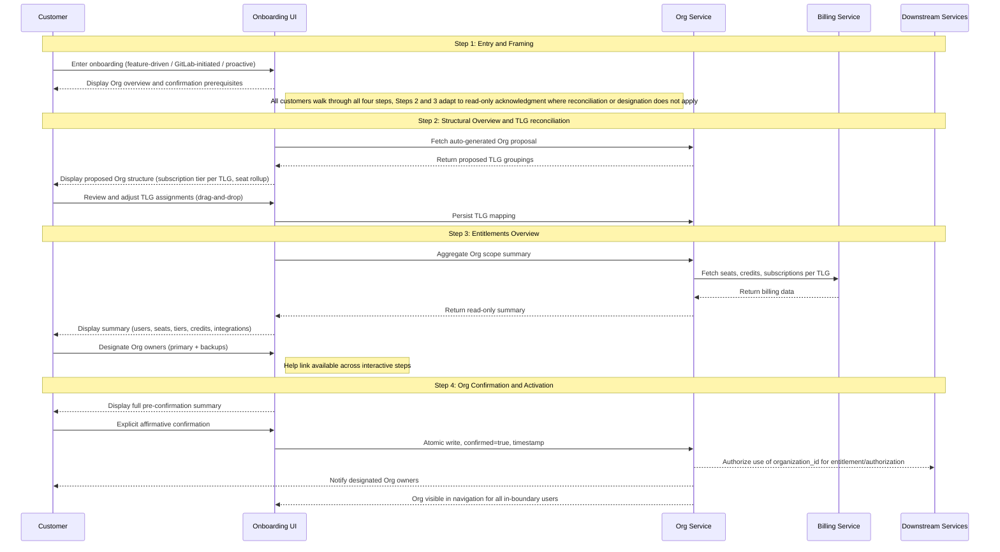

GitLab は、プロダクト全体で 3 つの役割を果たす基盤プリミティブとして Organizations を導入しています。それらは別々のものですが、実際には互いを補強します。

**正規のテナント境界。** Organization は顧客の top-level groups、projects、users を共有データ境界の下にカプセル化します。これは下流システムが認可と権限付与に使用する境界であり、GitLab インフラストラクチャに Cells 間で移動できるポータブルで自己完結した単位を与えることで、Cells アーキテクチャを扱いやすくします。

**統一されたコントロールプレーンと構築・デプロイの単位。** Organization は、顧客が GitLab の利用範囲全体を管理する単一の画面であり、GitLab が構築しデプロイする正規の単位です。私たちは一度構築し、どこにでもデプロイします。同じデータモデル、機能、アプリケーション画面が、同じ概念の 3 つの異なる実装ではなく、GitLab.com、Self-Managed、Dedicated に出荷されます。Org は顧客が体験する統合コントロールプレーンでもあります。ユーザーライフサイクル管理、可視性コントロール、請求の可視性、設定、機能有効化は、時間とともにすべて Org レベルに統合され、すべてのデプロイタイプに同じガバナンス画面を与えます。今日の SaaS では、ガバナンスは TLG ごとに管理されており、SM と Dedicated と比べて技術的な分岐とプロダクトの断片化を生んでいます。共有プリミティブとして Org がなければ、GitLab は同じプロダクトの 3 つの実装に分岐し、その断片化は新しい機能が出荷されるたびに広がります。Org は、GitLab が構築する単位であり、顧客がガバナンスする画面でもあることで、それを防ぎます。

**クロスプラットフォーム移行の単位。** 顧客がデプロイタイプ間、GitLab.com から Dedicated、Dedicated から Self-Managed、または Cells 間を移動するとき、移動するのは Organization です。これは顧客のデータ、groups、権限付与のポータブルなコンテナです。顧客は移行元プラットフォーム上に confirmed Org がなければクロスプラットフォーム移行を完了できません。これにより移行の経済性も扱いやすくなります。Org が自己完結していてポータブルであれば、移行は個別のエンジニアリング対応ではなく、ツール化され自動化されたものになります。

confirmed Org 境界は、この 3 つすべての前提条件です。この ADR は、顧客がその confirmed 境界に到達する方法を定義します。

この ADR は、Organization を unconfirmed から confirmed、active へ進める正規の 4 ステップオンボーディングワークフローを定義します。このワークフローはユニバーサルです。すべての顧客はデプロイタイプにかかわらず 4 ステップすべてを通ります。異なるのは、各ステップで顧客の操作が必要か、読み取り専用の確認でよいかです。Multi-TLG SaaS の顧客は Step 2 で構造を照合し、Step 3 で権限付与と owner set をレビューします。Single-TLG SaaS の顧客は、同じ画面で事前入力された構造と権限付与を検証しますが、行うことは少なくなります。Self-Managed と Dedicated の顧客は Step 4 で同意する前に、同じ内容を読み取り専用の確認としてレビューします。つまり instance の構造、権限付与、initial owner set です。Org は定義された条件セットが true になったときにのみ live になり、オンボーディングワークフローはすべての顧客についてそれらすべての項目を確認します。

このワークフローは、すべての暫定的な手動フローが構築される基盤です。これらのフローでオンボーディングされた顧客は、セルフサービスが出荷されたときにこのワークフローと完全に互換性のある状態に着地します。v1 は、選択された顧客向けに GitLab 管理のオンボーディングパスと並行して出荷されます。このパスでは、GitLab が Org を作成し、TLG を移転し、顧客の明示的な確認を得たうえで顧客に代わって confirm します。どちらのパスも、このワークフローと完全に互換性のある状態の Org を生成します。手動パスはセルフサービス機能が成熟するにつれて縮小します。

Org が active になった後に起こること、機能有効化、継続的な管理、isolated mode への任意のアップグレードは、この ADR のスコープ外です。isolation upgrade flow は別途指定されます。

---

## Org の状態マシン {#the-org-state-machine}

[Organization Lifecycle](../lifecycle.md) は、オンボーディングに関係する 3 つの状態を定義します。

**Unconfirmed:** Org は Org ID とデータ境界を持つインフラストラクチャとして存在します。顧客からは見えず、下流システムに対して inert です。GitLab はすべての顧客についてバックグラウンドで unconfirmed Organizations を自動作成します。

**Confirmed:** 顧客が Org の境界、権限付与、initial owner set をレビューし、それらに明示的にコミットした状態です。Org の形はロックされます。

**Active:** Org は confirmed であり、下流での利用のために完全にプロビジョニングされています。confirmed Org 境界はスコープ内の users に表示され、Org owner set が記録され、下流システムは権限付与と認可のために organization_id を使うことを承認されます。

このワークフローの 4 ステップは、Org を unconfirmed から confirmed へ移動します。Confirmation は、Org を active にするために必要なバックエンド作業を開始します。

**Confirmed → Active 遷移。** Confirmation は、Org が active になる前に完了するプラットフォーム主導のバックグラウンド作業を開始します。organization memberships が作成され、TLG resources が移転され（SaaS の場合）、下流システムが organization_id を認識することを承認されます。Org-anchored features（Artifact Registry など）は active state を必要とします。confirmation だけでは機能有効化には十分ではありません。activation が失敗した場合、Org は confirmed state に残り、復旧は help link から support へルーティングされます。この遷移中の顧客向け体験（進捗インジケーター、成功通知、失敗メッセージ）は UX 依存関係であり、ワークフロー出荷前に設計されなければなりません。

この ADR は、顧客オンボーディングと下流 activation に必要なレベルでオンボーディングライフサイクルを定義します。中間のプロビジョニング状態を含む、より詳細なバックエンド状態モデリングは [Organization Lifecycle](../lifecycle.md) blueprint にあります。

---

## 統治原則 {#governing-principle}

Organizations オンボーディングは境界を confirm します。内部のものを再構成しません。Org より前に存在する請求、権限付与、商務上の決定は、それまでどおり動作し続けます。新しい Org-level features は confirmed Org 境界に紐付けられ、別途購入されます。オンボーディングは、請求システムや将来の Org-level billing design に属する決定を開始、再構成、強制しません。

オンボーディング中に行われるすべてのデータモデル上の決定は、Org-level seat pooling、Org-anchored contracts、将来の運用姿勢を制御するフラグなど、将来の Org-level capabilities と前方互換でなければなりません。このワークフローの実装選択によって、将来のモデルをサポートするための破壊的な移行が必要になってはなりません。

Confirmation は、すべてのデプロイタイプで能動的かつ十分な情報に基づく顧客の選択です。取り消しパスはありません。confirmation は Org を下流システムの authoritative boundary にし、実際の変更（instance admin とは別の Admin Area、新しい control plane attributes）を導入するため、顧客は同意する前に理解する必要があります。すべての顧客はデプロイタイプにかかわらず 4 ステップすべてを通ります。異なるのは各ステップが操作を求めるか確認だけを求めるかですが、顧客は同意する前に自分が何に同意するかを見ます。

**ワークフローがデプロイタイプ全体でユニバーサルである理由。** 操作が不要なステップであっても、すべての顧客は 4 ステップすべてを通ります。理由は 3 つあります。confirmation には取り消しパスがなく、顧客は見たことのない境界、権限付与、owner set に合理的に同意できないため、操作がないステップをスキップすると、見せられていない内容へのコミットを求めることになります。同意を超えて、Org は GitLab の単一の構築、デプロイ、顧客向けガバナンスの単位です。ワークフローをデプロイタイプごとに切り分けると、顧客体験とエンジニアリングが保守すべきものの両方が断片化し、一度構築してどこにでもデプロイするレバレッジを失います。そして実務上、Steps 2 and 3 は将来の顧客操作が着地する場所です。Org owner designation、拡張された照合、より多くの Org-level governance です。今日同じ形を保つことで、これらの機能は後で既知の場所に着地し、再構成されたワークフローにはなりません。

---

## 決定サマリー {#decision-summary}

| 決定 | 根拠 |
|---|---|
| ワークフローはデプロイタイプ全体でユニバーサル | すべての顧客が 4 ステップすべてを通ります。形はデプロイタイプによって変わらず、変わるのはステップが操作を必要とするか確認だけでよいかです。Single-TLG SaaS と SM/Dedicated の顧客は照合ではなく事前入力された内容を検証しますが、それでもそれを見て同意します。すべての confirmed Org は同じ条件を満たすことでその状態に到達します。 |
| Purchase は Org confirmation の後に完了し、前ではない | 顧客は confirmed Org 境界なしに Org-level features を理解できません。confirmation 前に購入を強制すると、コミットされていない構造に対して請求レコードが作られます。 |
| Subscription tier reconciliation は延期される | Billing は launch 時点では TLG-anchored のままです。Org-level billing mechanism はまだ存在しません。tier harmonization を強制すると、対応するプロダクト上のメリットなしに顧客へ財務上または運用上のペナルティを課します。これは包括的な Org-level billing strategy を待つ意図的な延期です。 |
| Subscription and contract reconciliation は Organizations の deliverable ではない | Organizations は UI に decision points を表示できます。contract merges、tier harmonization、credit pool consolidation を実行するバックエンドは Billing and Fulfillment が構築し所有しなければなりません。 |
| Org owner designation は Step 3 に存在する | 顧客は権限付与の画面上で Org owners を指定します。そこでは、それらの owners が何をガバナンスするかも見ます。v1 では designation surface を Admin Area readiness と組み合わせた将来の workstream へ延期します。暫定的には、プラットフォームが TLG transfer/backfill 中の TLG-owner auto-promotion によって initial owner set を生成します。再割り当てリクエストは Admin Area が出荷されるまで help link から support へルーティングされます。 |
| SM and Dedicated Organizations は 4 ステップすべてを通り、Steps 2 and 3 は読み取り専用の確認 | instance boundary はすでに Org boundary であり、権限付与は instance/license level に留まるため、Steps 2 and 3 はプラットフォームによって事前入力されます。それでも顧客はそれらを見ます。Step 2 は instance の構造ビュー（TLGs、groups、projects、namespaces）を示します。Step 3 は権限付与と initial Org owner set を示し、これは existing instance admins が auto-promoted されたものです。顧客は自分が同意するものを見たうえで Step 4 で同意します。この操作には取り消しがありません。 |
| 途中フローの状態保持はしない | 顧客がワークフローを途中で離脱した場合、戻ったときには Step 1 から再開します。目標完了時間は 5 分未満であるため、再開時の摩擦は限定的です。state caching を避けることでワークフローは stateless になり、エンジニアリングはより単純になります。顧客が opt in するにつれ、まだ confirmed でない population は減り、実務上の影響もさらに小さくなります。 |

---

## ワークフロートリガーイベントと適格性の処理 {#workflow-trigger-events-and-eligibility-handling}

### トリガーイベント

3 つのイベントがオンボーディングフローを顧客に表示します。

このセクションでは、**users with confirmation authority** は confirmation 前の権限セットを指します。SaaS では TLG owners、SM and Dedicated では instance admins です。Org owner role は confirmation まで存在しません。users with confirmation authority は unconfirmed Org に対して操作できる人々であり、confirmation 時に initial Org owner set になる人々です（v1 では TLG-owner または instance-admin auto-promotion による）。

機能起点のトリガーは、顧客が Artifact Registry のような Org-anchored feature を有効化または購入しようとし、プラットフォームが Organization が confirmed されているかを確認したときに発生します。Org が unconfirmed であれば、プラットフォームは有効化の試行をインターセプトし、購入または activation を続行する前にオンボーディングフローを表示します。これは GitLab.com、Self-Managed、Dedicated に適用されます。ワークフローはすべてに同じ形で実行され、Steps 2 and 3 は顧客が照合するものを持たない場合に読み取り専用の確認へ適応します。

直接ナビゲーションのトリガーは、顧客が特定の機能購入を開始操作とせず、`gitlab.com/o/new` または同等のオンボーディングエントリーポイントへ移動したときに発生します。このパスは Organizations がプロダクト画面でより見えるようになるにつれて成長すると見込まれます。

プラットフォーム起点のトリガーは、GitLab backfill process が既存顧客に unconfirmed Organization を作成し、プラットフォームが次回ログインまたは予定された接点で confirmation authority を持つ user にプロンプトを表示したときに発生します。

### ドロップインポイントのルーティング

Step 1 は、インタラクティブに操作するすべての顧客にとって常にエントリーポイントです。backfill process によって unconfirmed Organization がすでに作成されている顧客でも、後続ステップが意味を持つ前に、Organization とは何か、何を求められているのかを理解する必要があります。構造上の作業がすでに行われている場合でも、Step 1 の方向付けは任意ではありません。

Organization state に基づいて変わるのは、Step 1 が customer を渡す path です。

Organization が存在しない場合、Step 1 は完全な照合フローのため Step 2 へ進みます。backfill がすでに実行され unconfirmed Organization が存在する場合、Step 1 は状況を説明し、レビューのため Step 2 へルーティングします。すべての顧客に対して 4 ステップすべてが実行されます。異なるのは Steps 2 and 3 の内容と必要な操作です。Multi-TLG SaaS の顧客は構造を照合し（Step 2）、権限付与と owner set をレビューします（Step 3）。Single-TLG SaaS の顧客は事前入力された構造を検証し（Step 2）、事前入力された権限付与と owner set をレビューします（Step 3）。SM and Dedicated の顧客は instance の事前入力された構造ビューを見て（Step 2）、initial owner set を含む事前入力された権限付与ビューを見ます（Step 3）。Step 4 はすべての顧客に対する統合された confirmation 前チェックポイントです。Organization がすでに confirmed の場合、onboarding は完全にバイパスされます。

| Organization state at trigger | Step 1 exit path |
|-------------------------------|------------------|
| No Organization exists | Step 2 → Step 3 → Step 4 |
| Unconfirmed Org exists, multiple TLGs | Step 2 (reconciliation) → Step 3 (review + designate owners) → Step 4 |
| Unconfirmed Org exists, single TLG | Step 2 (structure verification) → Step 3 (review) → Step 4 |
| Organization already confirmed | Onboarding bypassed |
| SM or Dedicated | Step 2 (read-only structural review) → Step 3 (read-only entitlements + owner set review) → Step 4 |

Step 1 の内容は、インタラクティブなパス全体で同一ではありません。機能起点の顧客には、購入した機能へ責任を持ってできるだけ早く到達するための効率的な説明が必要です。backfill customers には、GitLab が自分たちの入力なしに作成したものに対してなぜ操作を求められているのかを理解する必要があります。方向付けは常に必要であり、メッセージングは文脈固有です。

UX への注記: Step 1 には、上記のインタラクティブルーティングパスに対応する少なくとも 3 つの異なるコンテンツ状態が必要です。Step 1 の設計が確定される前に、コピーの ownership と各状態の DRI を解決するべきです。

### 対象外ユーザーの処理

顧客がオンボーディングエントリーポイントに到達したが進めない場合、プラットフォームは理由を表示し、明確な次の進み方を提供します。silent gating は受け入れられません。confirmation authority を持たない顧客（SaaS で TLG owner ではない、SM/Dedicated で instance admin ではない）は、要件の説明と誰に連絡すべきかのガイダンスを見るべきです。SaaS では TLG owner、SM/Dedicated では instance admin です。サインアウトした顧客は、フローにアクセスする前にサインインへ誘導されるべきです。

confirmation authority を持たない users は unconfirmed Organizations を見ません。オンボーディング画面は、unconfirmed state の Org boundary に対して操作できる users にだけ提示されます。

### Email はトリガーではない

Email はオンボーディングフローを開始する仕組みではありません。顧客はプロセスを開始するために email address を入力する必要はなく、outbound email はフローを表示する主要な手段ではありません。エントリーポイントはプロダクト内にあります。

---

## ワークフロー概要 {#workflow-overview}

これは Organizations の正規オンボーディングワークフローです。すべての顧客は 4 ステップすべてを通ります。異なるのは各ステップが顧客操作を必要とするか読み取り専用の確認でよいかです。Multi-TLG SaaS の顧客は Step 2 で構造を照合し、Step 3 で権限付与をレビューし owners を指定します（将来の状態。v1 では designation は読み取り専用レビューとして出荷）。Single-TLG SaaS の顧客は同じ画面で事前入力された構造と権限付与を検証しますが、行うことは少なくなります。SM and Dedicated の顧客は同じ画面を読み取り専用の確認として見ます。instance の構造ビュー、instance/license level の権限付与、existing instance admins の initial owner set です。Net-new SaaS の顧客はバックグラウンドで静かに Org を受け取り、feature gate または platform-initiated prompt が表示されるまでフローに遭遇しない場合があります。Step 4 の confirmation は、すべてのデプロイタイプで能動的かつ十分な情報に基づく顧客の選択です。この操作には取り消しがなく、confirmation 後の状態は顧客が見て同意しなければならない実際の変更を導入します。

help link はすべてのステップ（Step 1 through Step 4）で利用できます。顧客はフローの任意の時点で help を必要とする可能性があるためです。これは事前入力された Org context（Org ID、deployment type、current step、TLG mapping state）を持つ support queue へルーティングされ、提案された構造やサマリーの問題をフローの外で解決できるようにします。

---

### Step 1: エントリーと説明

**何をするか:** Organization とは何か、なぜ Org-level features の前提条件として confirmation が必要なのか、オンボーディングプロセスに何が含まれるのかについて顧客を方向付けます。このステップではコミットメントは行われません。

**エントリーポイント:**

- 機能起点: 顧客が Org-level feature を購入またはアクセスしようとする。purchase gate は transaction が完了する前に Org confirmation requirement を表示します。
- プラットフォーム起点: GitLab が提案した Org を既存顧客にレビューして confirm するよう促す。
- 直接ナビゲーション: 顧客が特定の機能ニーズに先立ち、独立してオンボーディングを開始する（例: gitlab.com/o/new 経由）。

**confirmation で変わること:**

1. **Organization ナビゲーション画面。** 新しい Organization object が side panel に Groups and Projects と sibling concept として表示されます。顧客は Organization Settings page（Artifact Registry のような Org-scoped features が有効化される場所）と Organization landing page（partner teams が時間をかけて populate する shell surface）へ移動できます。
2. **Subscription and entitlement の紐付け。** Subscriptions、entitlements、Org-anchored features は TLG（SaaS）または instance license（SM/Dedicated）ではなく organization_id に紐付きます。existing entitlements は透過的に移行します。new Org-anchored features は Org が active になると有効化可能になります。
3. **Org Owner role の記録。** TLG owners（SaaS）または instance admins（SM/Dedicated）は confirmation 時に Org owners へ auto-promoted されます。v1 ではこれは記録のみの role です。TLG/instance permissions が必要な操作を引き続きカバーします。Admin Area が出荷されると、Org owners は TLG owner または instance admin authority とは異なる Org-scoped administrative authority（subscriptions、Org レベルでの user management、Org-wide settings）を得ます。
4. **将来の Admin Area。** 新しい Admin Area は、顧客向けの Org owner designation と組み合わせて出荷予定です。これは instance admin（または SaaS 上の TLG owner authority）とは別であり、Org-scoped governance を扱います。v1 には含まれません。
5. **取り消しなし。** Confirmation は一方向の操作です。confirmation 後の再構成は、Org merge tooling が利用可能になるまで support involvement が必要です。

**主な決定:**

- Purchase は Org confirmation 後に完了します。機能起点の顧客には開始前にこれを明示します。
- SM and Dedicated の顧客も SaaS と同じく 4 ステップすべてを進みます。方向付けは不可欠です。Organization とは何か、confirmation によって何が変わるのか（Admin Area は instance admin とは異なる）、何に同意するよう求められているのかを理解する必要があります。Steps 2 and 3 はプラットフォームによって事前入力され読み取り専用の確認として提示されますが、Step 4 でコミットする前に同じ内容（structure、entitlements、owner set）を見ます。
- Net-new SaaS の顧客は account creation 中に静かにプロビジョニングされた Org を受け取ります。feature gate または platform-initiated prompt が表示されるまで、それとやり取りしません。長期的な方向性はすべての顧客が confirmed Org を持つことです。ロールアウトは今のところ slow and opt-in であり、proactive onboarding の specific nudge mechanism は Open Question 9 に記録されています。

**依存関係:** 状態マシン（unconfirmed / confirmed / active）は、このステップが出荷される前に first-class Org attribute として実装されなければなりません。Purchase gate enforcement には関連する購入フローとの調整が必要です。

---

### Step 2: 構造概要と TLG 照合

**何をするか:** 顧客に、GitLab がまとめた Org proposal をレビューしてもらいます。これは Org として組み立てられた top-level groups、subgroups、projects、namespaces の構造ビューです。画面上の問いは、これが GitLab において自分たちの organization に属するすべてを表しているかどうかです。照合は top-level group level で行われます。TLGs は Orgs 間を移動する単位であり、subgroups、projects、namespaces は TLG と一緒に移動するためです。

**適用対象:** やり取りは異なりますが、すべての顧客に適用されます。Multi-TLG SaaS の顧客は drag-and-drop によって構造を照合します。Single-TLG SaaS の顧客は 1 つの TLG を持つ事前入力された構造を検証します。SM and Dedicated の顧客は instance の事前入力された構造ビューを確認します（instance が境界であるため grouping decision は存在しません）。すべての顧客は進む前に、自分の Org に構造的に何が含まれるかを見ます。

**主な決定:**

- GitLab が構造を提案します。顧客はそれをレビューし、任意で調整します。ウィザードは blank canvas ではなく proposal から始まります。
- ここでは billing or subscription decisions は行われません。Subscription tier は context として TLG ごとに表示されるだけです。tiers が異なる場合でも action は required ではなく、conflict も flagged されません。
- Seat rollup and user overlap は informational only として表示されます。confirmation を gate しません。
- Single-TLG の顧客には fast path があります。structural overview は user が Organization を検証するために表示されます。TLG が 1 つだけなので reconciliation work は不要です。target completion time は 2 分未満です。
- Multi-TLG の顧客は drag-and-drop と明示的な選択により、提案された Organizations 間で top-level groups を移動できます。
- 顧客は、自分が操作する権限を持つ top-level groups だけを移動または confirm できます。reconciliation flow は、user が権限外の arbitrary TLGs を attach することを許しません。
- confirmation 後、SaaS の顧客は新しい top-level groups を作成できます。creation flow は、billing は launch 時点で TLG-anchored のままであり、新しく作成された TLG は sibling subscriptions、credits、その他の商務状態を自動的に継承しないことを警告として表示するべきです。新しい top-level group の billing は Org-level billing が存在するまで siblings とは separate のままです。したがって警告は、顧客が複数 top-level groups で Organization を構成することをブロックせず、境界を明示します。
- プラットフォームは confirmation 中に Org URL path の default slug を自動生成します。SaaS では、slug は顧客の primary TLG name に基づきます。SM and Dedicated では、slug は license または contract にある顧客の registered organization name に基づきます。顧客はオンボーディング中に slug を選択または承認しません。conflict-handling logic は Open Question 4 によって制御されます。Slug claiming and editing は post-confirmation Org page で Org Owners が行うため、default は Step 4 でコミットされ、オンボーディングのやり直しなしで後から変更できます。

**データモデル制約:** ここで記録される organization_id assignments、subscription tier per TLG、BillingAccount associations は、将来の Org-level billing models と前方互換でなければなりません。このステップが出荷される前に storage approach への engineering sign-off が必要です。

**依存関係:** 前方互換のデータモデルへの engineering sign-off。TLG creation block lift criteria への Finance confirmation。multi-TLG の顧客向け proposal heuristic への UX confirmation。

---

### Step 3: 権限付与の概要

**何をするか:** proposed Org の商務上の全体像、つまり users、seats、subscription tiers、credits、integrations、Org-scoped entitlements を顧客に示します。顧客は initial Org owner set も見ます。これは Admin Area が出荷されたときに Org-wide administrative authority を持つ人々です。将来の状態では、顧客がここでその set（primary plus backups）を指定します。v1 では、顧客が同意する前に誰が権限を持つかを知れるよう、自動入力された読み取り専用として表示されます。Step 3 は商務上の全体像と ownership view を同じ画面に置き、顧客がコミット前に両方を考えられるようにします。Step 2（structure）および Step 4（final consolidated checkpoint）とは別です。

**適用対象:** やり取りは異なりますが、すべての顧客に適用されます。SaaS の顧客は Step 2 の TLG mapping 全体で集約された entitlements を見ます。SM and Dedicated の顧客は instance/license level の entitlements を見ます。initial owner set はすべての顧客に表示されます。SaaS では TLG-owner-promoted、SM and Dedicated では instance-admin-promoted です。v1 では、owner set はすべてのデプロイタイプで読み取り専用です。将来状態の designation は顧客操作としてここに存在します。

**主な決定:**

- サマリーは読み取り専用です。請求上の決定は不要です。Billing は今日と同じく TLG level で動作し続けます。
- サマリーには、total users（deduplicated）、total seats、subscription tier per TLG、該当する場合の credits balance、project and group counts、active integrations、Org-scoped add-on entitlements が含まれます。
- AR entitlement は Org-scoped です（access は Org 内のすべての top-level groups に適用されます）。AR の billing は、今日と同じく namespace_id を使い、購入された TLG を通じて流れます。オンボーディング中に顧客から TLG billing anchor designation は不要です。
- 顧客はこの画面で initial Org owner set をレビューします。この set は Admin Area が出荷された後、subscriptions、user management、credits、Org-wide settings に対する administrative authority を持ちます。将来の状態では、顧客がこの set（primary plus backups）を直接指定します。v1 では顧客向け designation を Admin Area readiness と paired された将来の workstream へ延期します。その画面が出荷されるまでは、set は自動入力され読み取り専用として表示されます。SaaS では confirmation に先立つ TLG transfer/backfill 中の TLG owners、SM and Dedicated では confirmation 時の instance admins です。confirmation 後の reassignment requests は help link を通じて support へルーティングされます。スコープ外を参照してください。
- help link はこのステップと他のすべてのステップ（Step 1 through Step 4）で利用できます。サマリーまたは proposed Org structure が正しく見えない場合のためです。これは Org ID、deployment type、current step、TLG mapping state が事前入力されたチケットを持つ support queue へルーティングされます。Help link interactions は product iteration の明示的な signal source です。顧客がフラグする patterns は、summary または Org structure が不明瞭または不正確な場所を示します。silent abandonment、つまり顧客がフローに入りながら help link を使わず完了もしないことは、調査に値する摩擦またはためらいの暗黙のシグナルです。両方のシグナルタイプを集計してレビューするべきです。

**依存関係:** Org scope summary data aggregation が existing namespace data から queryable であることを確認。step 2 の TLG mapping は step 3 の render 前に永続化されていなければならない（または aggregation は session state から実行されなければならない）。Credits balance availability を Fulfillment と確認。Integration surface completeness を engineering と確認。Help link routing and ticket pre-fill を Support と確認。

---

### Step 4: Org の確認と有効化

**何をするか:** 交渉不能なコミットステップです。顧客は steps 1 through 3 で確立されたすべての complete summary をレビューし、明示的にコミットします。これは Org を unconfirmed から confirmed、active へ移し、下流サービスが organization_id を使用することを承認する操作です。

**主な決定:**

- Confirmation には明示的な肯定操作が必要です。passive scroll や default acceptance ではありません。
- Step 3 で指定された Org owners の set は confirmation 時にコミットされます。pre-confirmation summary は designated owners を表示し、顧客が何にコミットしているかを理解できるようにします。（v1 interim: 顧客向け designation が出荷されるまでは、platform が TLG-owner auto-promotion によって owner set を生成し、reassignment requests は help link を通じて support へルーティングされます。）
- confirmation screen は、この操作が auto-generated Org path（例: `/o/acme-org/`）を含む Org structure を下流システムの authoritative boundary としてコミットすることを示します。Org Owner は post-confirmation Org page で slug を claim または edit できます。confirmation 後の構造再編は v1 では self-serve ではなく、Org merge tooling が利用可能になるまで support involvement が必要です。
- SM and Dedicated confirmation は、SaaS と同じ gating principle である能動的かつ十分な情報に基づく顧客の選択です。顧客はすでに structural view（Step 2）と initial owner set を含む entitlements（Step 3）を読み取り専用の確認として見ています。Step 4 はそれらを統合し、顧客が明示的に opt in します。Confirmation は Org activation を gate します。顧客の同意なしに SM or Dedicated Org が active になることはありません。
- 顧客が pre-confirmation summary のエラーを特定した場合、各要素はそれが確立されたステップへリンクバックします。

**confirmation が生成するもの:**

- Org record 上の `state = STATES[:confirmed]`
- Confirmation timestamp が記録される
- boundary 内のすべての users に Org が navigation で表示される
- Org Admin Area は出荷時に有効になり、future owner designation workstream と組み合わされる
- downstream services が entitlement and authorization のために organization_id を使用することを承認される
- designated Org owners が通知される

**依存関係:** Org record state transition の atomic write guarantee を engineering と確認する必要があります。Navigation visibility propagation timing を確認。Return navigation invalidation logic（step 2 が変更された場合、step 3 data の何が invalidated されるか）を engineering と確認。

---

## 横断的な依存関係 {#cross-cutting-dependencies}

以下の依存関係は複数のステップに影響し、ワークフローが end-to-end で出荷される前に解決されなければなりません。

| 依存関係 | Owner | 影響範囲 |
|---|---|---|
| 状態マシン（unconfirmed / confirmed / active）が first-class Org attribute として実装されていること | Tenant Scale Engineering | Steps 1, 4 |
| Purchase gate enforcement: Org-level features は unconfirmed Org に対して purchase できない | Fulfillment, AR team | Step 1 |
| organization_id assignments と TLG metadata の forward-compatible data model | Tenant Scale Engineering | Steps 2, 3 |
| TLG mapping persistence timing: step 2 completion 時に write されるか、step 4 confirmation 時だけか | Tenant Scale Engineering | Step 3 |
| existing namespace_ids からの Org scope summary data aggregation | Tenant Scale Engineering | Step 3 |
| confirmed and timestamp fields の atomic write guarantee | Tenant Scale Engineering | Step 4 |
| post-confirmation restructuring 向け Org merge tooling | Tenant Scale Engineering | Step 4 |
| Step 3 owner designation surface と Admin Area readiness の pairing。v1 の TLG-promoted owner set は designation surface 出荷時に editable でなければならない | Tenant Scale Engineering, Tenant Scale Product | Step 3, Admin Area launch |
| Help link routing and ticket pre-fill（Org ID、deployment type、current step、TLG mapping state） | Support, Tenant Scale UX | All interactive steps, especially Step 3 |
| Org Owners 向け slug claiming/editing surface を持つ post-confirmation Org page | Tenant Scale Engineering, Tenant Scale UX | Step 2 slug auto-generation, Step 4 confirmation outputs |
| Onboarding flow telemetry: step-by-step progression、help link interactions、silent abandonment（entered flow, did not use help link, did not complete） | Tenant Scale Product, Analytics Instrumentation | All interactive steps |

---

## スコープ外 {#out-of-scope}

以下はこのワークフローのスコープに明示的に含まれず、別途 tracking されます。

**機能有効化とオンボーディング後の運用。** active Org が何を有効化するか、機能画面、Admin Area、継続的なガバナンスは confirmation の下流であり、confirmed boundary に到達する一部ではありません。

**isolation upgrade。** confirmed で active な non-isolated Org を isolated mode に upgrade することは ADR 012 で指定されます。このワークフローは isolation flag を set、reference、depend しません。

**Org formation 時の Subscription tier reconciliation。** Billing は launch 時点で TLG-anchored のままです。Org-level billing mechanism は存在しません。onboarding 中に tier harmonization を強制すると、対応するプロダクト上のメリットなしに顧客へ財務上または運用上のペナルティを課します。これを設計する前に包括的な Org-level billing strategy が必要です。

**Org merge tooling。** これは live subscriptions と確立された境界を持つ 2 つのすでに active confirmed Organizations に作用します。これは step 2 の reconciliation wizard とはアーキテクチャ上別です。step 2 は Org が confirmed される前に動作します。Merge tooling は別のエピックで tracking されます。

**Org level での Credits partitioning。** usage-based credits を Org 内の TLG level で partition できるかどうかはアーキテクチャ上未解決です。これは credits architecture がサポートすることを確認するまで延期されます。

**顧客向け Org owner designation surface（Step 3）。** owner designation の target steady state は、顧客が entitlements view と並んで Org owners（primary plus backups）を指定する Step 3 の顧客向け画面です。v1 はこの surface を Admin Area readiness と paired された将来の workstream へ延期します。暫定的には、platform が auto-promotion によって initial Org owner set を生成します。SaaS では confirmation に先立つ TLG transfer/backfill 中の TLG owners、SM and Dedicated では confirmation 時の instance admins です。この set はすべてのデプロイタイプで Step 3 に read-only として表示されるため、同意は Org boundary だけでなく owner set にも適用されます。confirmation 後の reassignment requests は help link から support queue へルーティングされます。将来の workstream には、initial seeded set 向けの self-serve reassignment surface が含まれなければなりません。

---

## ワークフロー出荷前に解決が必要な未解決事項 {#open-questions-requiring-resolution-before-workflow-ships}

1. Forward-compatible data model storage approach。engineering sign-off が必要。
2. TLG mapping persistence timing。step 3 query architecture に影響。
3. すべての Org-level purchasing flows にわたる purchase gate mechanism。Fulfillment coordination が必要。
4. Slug uniqueness scope、global または BillingAccount-scoped。これは confirmation 中の platform の auto-generation logic（collision handling）と、Org page 上の post-confirmation slug claiming and editing surface を制御します。Global uniqueness にはより広い availability check が必要です。BillingAccount-scoped uniqueness には intra-customer conflict handling だけが必要です。resolution は auto-generation defaults と post-confirmation Org page slug surface の両方に影響します。
5. Multi-TLG proposal heuristic。GitLab の auto-proposal の正確な signals and confidence thresholds。
6. TLG creation block lift criteria。milestone、capability threshold、または volume threshold。
7. Org record state transition の atomic write guarantee。engineering confirmation が必要。
8. Admin Area launch timing and scope。Admin Area launch は、authority が actionable になったとき customer-facing designation が機能するよう、Step 3 owner designation surface と paired でなければなりません。
9. non-feature-driven onboarding の platform-initiated trigger mechanism。intent は最終的にすべての顧客を Org confirmation へ促すことですが、rollout は今のところ slow and opt-in です。feature gate 経由で到達しない顧客向けの specific trigger surface（admin login prompt、scheduled communication、banner など）は未定義です。SM/Dedicated と、まだ feature gate に到達していない net-new SaaS に適用されます。

---

## 検討した代替案 {#alternatives-considered}

**staged workflow なしの single-step confirmation。** 却下しました。Multi-TLG の顧客に必要な決定、構造概要、権限付与の概要、owner designation は、圧倒されやすくエラーを起こしやすい体験を作らずに single screen へ折りたたむことはできません。段階的なワークフローはまた、何も決めることがない画面を提示するのではなく、SM and Dedicated に対して適用されない steps を platform がきれいに auto-complete できるようにします。

**Blank canvas reconciliation UI。** 却下しました。step 2 で顧客に Org structure を一から組み立てさせると、想起の負担を顧客に置き、不整合な結果を生みます。GitLab はすでに顧客の TLGs を知っているため、flow は顧客が populate しなければならない empty surface ではなく、顧客が correct する proposal から始まります。

**Org confirmation 前の Purchase。** 却下しました。コミットされていない Org structure に対して billing records を作ります。顧客は confirmed Org boundary なしに Org-level features を理解できません。また、purchase 後に onboarding が abandoned されると messy billing state を作ります。

**Org formation 時に subscription tier harmonization を要求する。** 却下しました。Billing は launch 時点で TLG-anchored です。Org は billing entity ではありません。harmonization を強制すると、platform がまだ対処できない問題を解決するために財務上または運用上のペナルティを課します。.com customers の 2.7% が複数 TLG を持ち、これらの長期利用顧客は early AR adopters である可能性が最も高いです。onboarding の時点で harmonization を課すと、AR のような early Org-scoped capabilities を最も必要とする顧客に摩擦を作ります。

**self-service flow なしで全 SaaS customers を auto-confirmation する。** 却下しました。複数 top-level groups を持つ SaaS の顧客は、下流システムが Org を authoritative として扱う前に grouping が正しいことを confirm する必要があります。review なしの auto-confirmation は、顧客が認識または信頼しない可能性のある Org structure を作ります。

**deployment type によって workflow を skip または shape-vary する。** 却下しました。2 つの variants が検討され却下されました: (a) SM/Dedicated が workflow を完全に skip し、platform auto-confirmation を使う。これは informed consent を bypass します。(b) SM/Dedicated が Steps 1 and 4 だけを通り、Steps 2 and 3 は invisible に auto-complete する。これは deployment-specific workflow shape を作り、consent を弱めます。採用された model は universal です。すべての顧客が 4 ステップすべてを通り、content は context（interactive reconciliation、fast-path verification、または read-only acknowledgment）に適応しますが、structure は同じままです。これにより、deployment type にかかわらず workflow は simple で、顧客の consent は meaningful に保たれます。

---

## レビューと承認が必要 {#review-and-approval-required}

この ADR は、任意のステップの実装が始まる前に、以下からのレビューと承認を必要とします。

| レビュアー | 領域 | 必要な対象 |
|---|---|---|
| Tenant Scale Engineering Lead | Data model, state machine, atomic writes, forward compatibility | All steps |
| UX and Technical Writing | Orientation content, reconciliation wizard, entitlements summary screen with owner designation, help link affordance, confirmation screen | Steps 1, 2, 3, 4 |
| AR Team | Entitlement scoping to organization_id, purchasing flow integration | Step 3 |

---

## 参考資料 {#references}

- New Isolation upgrade ADR: Isolation Upgrade Workflow (downstream of a confirmed Org)
- Organizations Onboarding Step Specs: Steps 1 through 4 (this initiative)
- Organizations and Billing issue: gitlab.com/gitlab-org/gitlab/-/work_items/597957
- Non-Isolated Organizations Onboarding epic: gitlab.com/groups/gitlab-org/-/work_items/21394
- Organizations Onboarding Workflow for Artifact Registry Enablement: gitlab.com/groups/gitlab-org/-/work_items/21393
- AR Usage Billing Integration MR: gitlab.com/gitlab-org/architecture/usage-billing/design-doc/-/merge_requests/27
- ADR 008: Non-Isolated Organizations on GitLab.com: https://handbook.gitlab.com/handbook/engineering/architecture/design-documents/organization/decisions/008_non_isolated_organizations_gitlab_com/
- Cells: Organization Migration design document: https://handbook.gitlab.com/handbook/engineering/architecture/design-documents/organization-data-migration/
- Cells: Organization Migration design document
