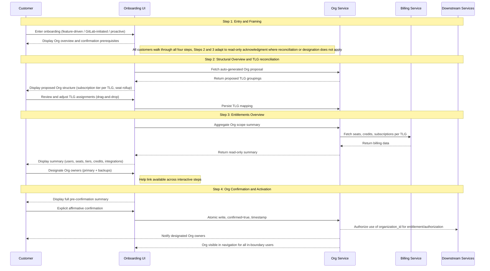

GitLab は、プロダクト全体で 3 つの役割を果たす基盤プリミティブとして Organizations を導入しています。それらは別々のものですが、実際には互いを補強します。

**正規のテナント境界。** Organization は顧客のトップレベルグループ、プロジェクト、ユーザーを共有データ境界の下にカプセル化します。これは下流システムが認可とエンタイトルメントに使用する境界であり、GitLab インフラストラクチャに Cells 間で移動できるポータブルで自己完結した単位を与えることで、Cells アーキテクチャを扱いやすくします。

**統一されたコントロールプレーンと構築・デプロイの単位。** Organization は、顧客が GitLab の利用範囲全体を管理する単一の画面であり、GitLab が構築しデプロイする正規の単位です。私たちは一度構築し、どこにでもデプロイします。同じデータモデル、機能、アプリケーション画面が、同じ概念の 3 つの異なる実装ではなく、GitLab.com、Self-Managed、Dedicated に出荷されます。Org は顧客が体験する統合コントロールプレーンでもあります。ユーザーライフサイクル管理、可視性コントロール、請求の可視性、設定、機能有効化は、時間とともにすべて Org レベルに統合され、すべてのデプロイタイプに同じガバナンス画面を与えます。今日の SaaS では、ガバナンスは TLG ごとに管理されており、SM と Dedicated と比べて技術的な分岐とプロダクトの断片化を生んでいます。共有プリミティブとして Org がなければ、GitLab は同じプロダクトの 3 つの実装に分岐し、その断片化は新しい機能が出荷されるたびに広がります。Org は、GitLab が構築する単位であり、顧客がガバナンスする画面でもあることで、それを防ぎます。

**クロスプラットフォーム移行の単位。** 顧客がデプロイタイプ間、GitLab.com から Dedicated、Dedicated から Self-Managed、または Cells 間を移動するとき、移動するのは Organization です。これは顧客のデータ、グループ、エンタイトルメントのポータブルなコンテナです。顧客は移行元プラットフォーム上に confirmed Org がなければクロスプラットフォーム移行を完了できません。これにより移行の経済性も扱いやすくなります。Org が自己完結していてポータブルであれば、移行は個別のエンジニアリング対応ではなく、ツール化され自動化されたものになります。

confirmed Org 境界は、この 3 つすべての前提条件です。この ADR は、顧客がその confirmed 境界に到達する方法を定義します。

この ADR は、Organization を unconfirmed から confirmed、active へ進める正規の 4 ステップオンボーディングワークフローを定義します。このワークフローはユニバーサルです。すべての顧客はデプロイタイプにかかわらず 4 ステップすべてを通ります。異なるのは、各ステップで顧客の操作が必要か、読み取り専用の確認でよいかです。Multi-TLG SaaS の顧客は Step 2 で構造を照合し、Step 3 でエンタイトルメントとオーナーセットをレビューします。Single-TLG SaaS の顧客は、同じ画面で事前入力された構造とエンタイトルメントを検証しますが、行うことは少なくなります。Self-Managed と Dedicated の顧客は Step 4 で同意する前に、同じ内容を読み取り専用の確認としてレビューします。つまりインスタンスの構造、エンタイトルメント、初期オーナーセットです。Org は定義された条件セットが true になったときにのみ有効になり、オンボーディングワークフローはすべての顧客についてそれらすべての項目を確認します。

このワークフローは、すべての暫定的な手動フローが構築される基盤です。これらのフローでオンボーディングされた顧客は、セルフサービスが出荷されたときにこのワークフローと完全に互換性のある状態に着地します。v1 は、選択された顧客向けに GitLab 管理のオンボーディングパスと並行して出荷されます。このパスでは、GitLab が Org を作成し、TLG を移転し、顧客の明示的な確認を得たうえで顧客に代わって confirm します。どちらのパスも、このワークフローと完全に互換性のある状態の Org を生成します。手動パスはセルフサービス機能が成熟するにつれて縮小します。

Org が active になった後に起こること、機能有効化、継続的な管理、isolated mode への任意のアップグレードは、この ADR のスコープ外です。isolation upgrade flow は別途指定されます。

---

## Org の状態マシン {#the-org-state-machine}

[Organization Lifecycle](../lifecycle.md) は、オンボーディングに関係する 3 つの状態を定義します。

**Unconfirmed:** Org は Org ID とデータ境界を持つインフラストラクチャとして存在します。顧客からは見えず、下流システムに対して inert です。GitLab はすべての顧客についてバックグラウンドで unconfirmed Organizations を自動作成します。

**Confirmed:** 顧客が Org の境界、エンタイトルメント、初期オーナーセットをレビューし、それらに明示的にコミットした状態です。Org の形はロックされます。

**Active:** Org は confirmed であり、下流での利用のために完全にプロビジョニングされています。confirmed Org 境界はスコープ内のユーザーに表示され、Org オーナーセットが記録され、下流システムはエンタイトルメントと認可のために organization_id を使うことを承認されます。

このワークフローの 4 ステップは、Org を unconfirmed から confirmed へ移動します。Confirmation は、Org を active にするために必要なバックエンド作業を開始します。

**Confirmed → Active 遷移。** Confirmation は、Org が active になる前に完了するプラットフォーム主導のバックグラウンド作業を開始します。Organization メンバーシップが作成され、TLG リソースが移転され（SaaS の場合）、下流システムが organization_id を認識することを承認されます。Org に紐付く機能（Artifact Registry など）は active 状態を必要とします。confirmation だけでは機能有効化には十分ではありません。有効化が失敗した場合、Org は confirmed 状態に残り、復旧はヘルプリンクからサポートへルーティングされます。この遷移中の顧客向け体験（進捗インジケーター、成功通知、失敗メッセージ）は UX 依存関係であり、ワークフロー出荷前に設計されなければなりません。

この ADR は、顧客オンボーディングと下流 activation に必要なレベルでオンボーディングライフサイクルを定義します。中間のプロビジョニング状態を含む、より詳細なバックエンド状態モデリングは [Organization Lifecycle](../lifecycle.md) blueprint にあります。

---

## 統治原則 {#governing-principle}

Organizations オンボーディングは境界を confirm します。内部のものを再構成しません。Org より前に存在する請求、エンタイトルメント、商務上の決定は、それまでどおり動作し続けます。新しい Org レベルの機能は confirmed Org 境界に紐付けられ、別途購入されます。オンボーディングは、請求システムや将来の Org レベルの請求設計に属する決定を開始、再構成、強制しません。

オンボーディング中に行われるすべてのデータモデル上の決定は、Org レベルのシートプール、Org に紐付く契約、将来の運用姿勢を制御するフラグなど、将来の Org レベルの機能と前方互換でなければなりません。このワークフローの実装選択によって、将来のモデルをサポートするための破壊的な移行が必要になってはなりません。

Confirmation は、すべてのデプロイタイプで能動的かつ十分な情報に基づく顧客の選択です。取り消しパスはありません。confirmation は Org を下流システムの信頼できる境界にし、実際の変更（instance admin とは別の Admin Area、新しいコントロールプレーン属性）を導入するため、顧客は同意する前に理解する必要があります。すべての顧客はデプロイタイプにかかわらず 4 ステップすべてを通ります。異なるのは各ステップが操作を求めるか確認だけを求めるかですが、顧客は同意する前に自分が何に同意するかを見ます。

**ワークフローがデプロイタイプ全体でユニバーサルである理由。** 操作が不要なステップであっても、すべての顧客は 4 ステップすべてを通ります。理由は 3 つあります。confirmation には取り消しパスがなく、顧客は見たことのない境界、エンタイトルメント、オーナーセットに合理的に同意できないため、操作がないステップをスキップすると、見せられていない内容へのコミットを求めることになります。同意を超えて、Org は GitLab の単一の構築、デプロイ、顧客向けガバナンスの単位です。ワークフローをデプロイタイプごとに切り分けると、顧客体験とエンジニアリングが保守すべきものの両方が断片化し、一度構築してどこにでもデプロイするレバレッジを失います。そして実務上、Step 2 と Step 3 は将来の顧客操作が着地する場所です。Org オーナーの指定、拡張された照合、より多くの Org レベルのガバナンスです。今日同じ形を保つことで、これらの機能は後で既知の場所に着地し、再構成されたワークフローにはなりません。

---

## 決定サマリー {#decision-summary}

| 決定 | 根拠 |
|---|---|
| ワークフローはデプロイタイプ全体でユニバーサル | すべての顧客が 4 ステップすべてを通ります。形はデプロイタイプによって変わらず、変わるのはステップが操作を必要とするか確認だけでよいかです。Single-TLG SaaS と SM/Dedicated の顧客は照合ではなく事前入力された内容を検証しますが、それでもそれを見て同意します。すべての confirmed Org は同じ条件を満たすことでその状態に到達します。 |
| Purchase は Org confirmation の後に完了し、前ではない | 顧客は confirmed Org 境界なしに Org レベルの機能を理解できません。confirmation 前に購入を強制すると、コミットされていない構造に対して請求レコードが作られます。 |
| Subscription Tier の照合は延期される | Billing はローンチ時点では TLG に紐付いたままです。Org レベルの請求メカニズムはまだ存在しません。Tier の調和を強制すると、対応するプロダクト上のメリットなしに顧客へ財務上または運用上のペナルティを課します。これは包括的な Org レベルの請求戦略を待つ意図的な延期です。 |
| Subscription と契約の照合は Organizations の成果物ではない | Organizations は UI に意思決定ポイントを表示できます。契約の統合、Tier の調和、クレジットプールの統合を実行するバックエンドは Billing and Fulfillment が構築し所有しなければなりません。 |
| Org owner の指定は Step 3 に存在する | 顧客はエンタイトルメント画面上で Org オーナーを指定します。そこでは、それらのオーナーが何をガバナンスするかも見ます。v1 では指定画面を Admin Area readiness と組み合わせた将来のワークストリームへ延期します。暫定的には、プラットフォームが TLG transfer/backfill 中の TLG owner 自動昇格によって初期オーナーセットを生成します。再割り当てリクエストは Admin Area が出荷されるまでヘルプリンクからサポートへルーティングされます。 |
| SM と Dedicated Organizations は 4 ステップすべてを通り、Step 2 と Step 3 は読み取り専用の確認 | インスタンス境界はすでに Org 境界であり、エンタイトルメントはインスタンス／ライセンスレベルに留まるため、Step 2 と Step 3 はプラットフォームによって事前入力されます。それでも顧客はそれらを見ます。Step 2 はインスタンスの構造ビュー（TLG、グループ、プロジェクト、namespace）を示します。Step 3 はエンタイトルメントと初期 Org オーナーセットを示し、これは既存のインスタンス管理者が自動昇格されたものです。顧客は自分が同意するものを見たうえで Step 4 で同意します。この操作には取り消しがありません。 |
| 途中フローの状態保持はしない | 顧客がワークフローを途中で離脱した場合、戻ったときには Step 1 から再開します。目標完了時間は 5 分未満であるため、再開時の摩擦は限定的です。状態キャッシュを避けることでワークフローはステートレスになり、エンジニアリングはより単純になります。顧客が opt in するにつれ、まだ confirmed でない顧客群は減り、実務上の影響もさらに小さくなります。 |

---

## ワークフロートリガーイベントと適格性の処理 {#workflow-trigger-events-and-eligibility-handling}

### トリガーイベント

3 つのイベントがオンボーディングフローを顧客に表示します。

このセクションでは、**confirmation 権限を持つユーザー** は confirmation 前の権限セットを指します。SaaS では TLG owner、SM と Dedicated ではインスタンス管理者です。Org owner ロールは confirmation まで存在しません。confirmation 権限を持つユーザーは unconfirmed Org に対して操作できる人々であり、confirmation 時に初期 Org オーナーセットになる人々です（v1 では TLG owner またはインスタンス管理者の自動昇格による）。

機能起点のトリガーは、顧客が Artifact Registry のような Org に紐付く機能を有効化または購入しようとし、プラットフォームが Organization が confirmed されているかを確認したときに発生します。Org が unconfirmed であれば、プラットフォームは有効化の試行をインターセプトし、購入または有効化を続行する前にオンボーディングフローを表示します。これは GitLab.com、Self-Managed、Dedicated に適用されます。ワークフローはすべてに同じ形で実行され、Step 2 と Step 3 は顧客が照合するものを持たない場合に読み取り専用の確認へ適応します。

直接ナビゲーションのトリガーは、顧客が特定の機能購入を開始操作とせず、`gitlab.com/o/new` または同等のオンボーディングエントリーポイントへ移動したときに発生します。このパスは Organizations がプロダクト画面でより見えるようになるにつれて成長すると見込まれます。

プラットフォーム起点のトリガーは、GitLab バックフィルプロセスが既存顧客に unconfirmed Organization を作成し、プラットフォームが次回ログインまたは予定された接点で confirmation 権限を持つユーザーにプロンプトを表示したときに発生します。

### ドロップインポイントのルーティング

Step 1 は、インタラクティブに操作するすべての顧客にとって常にエントリーポイントです。バックフィルプロセスによって unconfirmed Organization がすでに作成されている顧客でも、後続ステップが意味を持つ前に、Organization とは何か、何を求められているのかを理解する必要があります。構造上の作業がすでに行われている場合でも、Step 1 の方向付けは任意ではありません。

Organization の状態に基づいて変わるのは、Step 1 が顧客を案内する経路です。

Organization が存在しない場合、Step 1 は完全な照合フローのため Step 2 へ進みます。バックフィルがすでに実行され unconfirmed Organization が存在する場合、Step 1 は状況を説明し、レビューのため Step 2 へルーティングします。すべての顧客に対して 4 ステップすべてが実行されます。異なるのは Step 2 と Step 3 の内容と必要な操作です。Multi-TLG SaaS の顧客は構造を照合し（Step 2）、エンタイトルメントとオーナーセットをレビューします（Step 3）。Single-TLG SaaS の顧客は事前入力された構造を検証し（Step 2）、事前入力されたエンタイトルメントとオーナーセットをレビューします（Step 3）。SM と Dedicated の顧客はインスタンスの事前入力された構造ビューを見て（Step 2）、初期オーナーセットを含む事前入力されたエンタイトルメントビューを見ます（Step 3）。Step 4 はすべての顧客に対する統合された confirmation 前チェックポイントです。Organization がすでに confirmed の場合、onboarding は完全にバイパスされます。

| トリガー時の Organization の状態 | Step 1 の遷移先 |
|-------------------------------|------------------|
| Organization が存在しない | Step 2 → Step 3 → Step 4 |
| Unconfirmed Org が存在し、複数の TLG がある | Step 2（照合）→ Step 3（レビュー + オーナー指定）→ Step 4 |
| Unconfirmed Org が存在し、TLG が 1 つ | Step 2（構造検証）→ Step 3（レビュー）→ Step 4 |
| Organization はすでに confirmed | オンボーディングをバイパス |
| SM または Dedicated | Step 2（読み取り専用の構造レビュー）→ Step 3（読み取り専用のエンタイトルメント + オーナーセットレビュー）→ Step 4 |

Step 1 の内容は、インタラクティブな経路全体で同一ではありません。機能起点の顧客には、購入した機能へ責任を持ってできるだけ早く到達するための効率的な説明が必要です。バックフィル対象顧客には、GitLab が自分たちの入力なしに作成したものに対してなぜ操作を求められているのかを理解する必要があります。方向付けは常に必要であり、メッセージングは文脈固有です。

UX への注記: Step 1 には、上記のインタラクティブルーティングパスに対応する少なくとも 3 つの異なるコンテンツ状態が必要です。Step 1 の設計が確定される前に、コピーの ownership と各状態の DRI を解決するべきです。

### 対象外ユーザーの処理

顧客がオンボーディングエントリーポイントに到達したが進めない場合、プラットフォームは理由を表示し、明確な次の進み方を提供します。無言のゲートは受け入れられません。confirmation 権限を持たない顧客（SaaS で TLG owner ではない、SM/Dedicated で instance admin ではない）は、要件の説明と誰に連絡すべきかのガイダンスを見るべきです。SaaS では TLG owner、SM/Dedicated では instance admin です。サインアウトした顧客は、フローにアクセスする前にサインインへ誘導されるべきです。

confirmation 権限を持たないユーザーは unconfirmed Organizations を見ません。オンボーディング画面は、unconfirmed 状態の Org 境界に対して操作できるユーザーにだけ提示されます。

### Email はトリガーではない

Email はオンボーディングフローを開始する仕組みではありません。顧客はプロセスを開始するために email address を入力する必要はなく、outbound email はフローを表示する主要な手段ではありません。エントリーポイントはプロダクト内にあります。

---

## ワークフロー概要 {#workflow-overview}

これは Organizations の正規オンボーディングワークフローです。すべての顧客は 4 ステップすべてを通ります。異なるのは各ステップが顧客操作を必要とするか読み取り専用の確認でよいかです。Multi-TLG SaaS の顧客は Step 2 で構造を照合し、Step 3 でエンタイトルメントをレビューし、オーナーを指定します（将来の状態。v1 では指定は読み取り専用レビューとして出荷）。Single-TLG SaaS の顧客は同じ画面で事前入力された構造とエンタイトルメントを検証しますが、行うことは少なくなります。SM と Dedicated の顧客は同じ画面を読み取り専用の確認として見ます。インスタンスの構造ビュー、インスタンス／ライセンスレベルのエンタイトルメント、既存のインスタンス管理者からなる初期オーナーセットです。Net-new SaaS の顧客はバックグラウンドで静かに Org を受け取り、機能ゲートまたはプラットフォーム起点のプロンプトが表示されるまでフローに遭遇しない場合があります。Step 4 の confirmation は、すべてのデプロイタイプで能動的かつ十分な情報に基づく顧客の選択です。この操作には取り消しがなく、confirmation 後の状態は顧客が見て同意しなければならない実際の変更を導入します。

ヘルプリンクはすべてのステップ（Step 1〜Step 4）で利用できます。顧客はフローの任意の時点で支援を必要とする可能性があるためです。これは事前入力された Org コンテキスト（Org ID、デプロイタイプ、現在のステップ、TLG マッピング状態）を持つサポートキューへルーティングされ、提案された構造やサマリーの問題をフローの外で解決できるようにします。

---

### Step 1: エントリーと説明

**何をするか:** Organization とは何か、なぜ Org レベルの機能の前提条件として confirmation が必要なのか、オンボーディングプロセスに何が含まれるのかについて顧客を方向付けます。このステップではコミットメントは行われません。

**エントリーポイント:**

- 機能起点: 顧客が Org レベルの機能を購入またはアクセスしようとする。購入ゲートはトランザクションが完了する前に Org confirmation の要件を表示します。
- プラットフォーム起点: GitLab が提案した Org を既存顧客にレビューして confirm するよう促す。
- 直接ナビゲーション: 顧客が特定の機能ニーズに先立ち、独立してオンボーディングを開始する（例: gitlab.com/o/new 経由）。

**confirmation で変わること:**

1. **Organization ナビゲーション画面。** 新しい Organization オブジェクトがサイドパネルに Groups and Projects と同階層の概念として表示されます。顧客は Organization Settings ページ（Artifact Registry のような Org スコープの機能が有効化される場所）と Organization ランディングページ（パートナーチームが時間をかけて内容を追加するシェル画面）へ移動できます。
2. **Subscription とエンタイトルメントの紐付け。** Subscription、エンタイトルメント、Org に紐付く機能は TLG（SaaS）またはインスタンスライセンス（SM/Dedicated）ではなく organization_id に紐付きます。既存のエンタイトルメントは透過的に移行します。新しい Org に紐付く機能は Org が active になると有効化可能になります。
3. **Org Owner ロールの記録。** TLG owner（SaaS）またはインスタンス管理者（SM/Dedicated）は confirmation 時に Org owner へ自動昇格されます。v1 ではこれは記録のみのロールです。TLG／インスタンス権限が必要な操作を引き続きカバーします。Admin Area が出荷されると、Org owner は TLG owner または instance admin authority とは異なる Org スコープの管理権限（subscription、Org レベルでのユーザー管理、Org 全体の設定）を得ます。
4. **将来の Admin Area。** 新しい Admin Area は、顧客向けの Org オーナー指定と組み合わせて出荷予定です。これは instance admin（または SaaS 上の TLG owner authority）とは別であり、Org スコープのガバナンスを扱います。v1 には含まれません。
5. **取り消しなし。** Confirmation は一方向の操作です。confirmation 後の再構成は、Org merge tooling が利用可能になるまで support involvement が必要です。

**主な決定:**

- Purchase は Org confirmation 後に完了します。機能起点の顧客には開始前にこれを明示します。
- SM と Dedicated の顧客も SaaS と同じく 4 ステップすべてを進みます。方向付けは不可欠です。Organization とは何か、confirmation によって何が変わるのか（Admin Area は instance admin とは異なる）、何に同意するよう求められているのかを理解する必要があります。Step 2 と Step 3 はプラットフォームによって事前入力され読み取り専用の確認として提示されますが、Step 4 でコミットする前に同じ内容（構造、エンタイトルメント、オーナーセット）を見ます。
- Net-new SaaS の顧客はアカウント作成中に静かにプロビジョニングされた Org を受け取ります。機能ゲートまたはプラットフォーム起点のプロンプトが表示されるまで、それとやり取りしません。長期的な方向性はすべての顧客が confirmed Org を持つことです。ロールアウトは今のところゆっくりした opt-in であり、プロアクティブなオンボーディングの具体的なナッジの仕組みは Open Question 9 に記録されています。

**依存関係:** 状態マシン（unconfirmed / confirmed / active）は、このステップが出荷される前にファーストクラスの Org 属性として実装されなければなりません。購入ゲートの強制には関連する購入フローとの調整が必要です。

---

### Step 2: 構造概要と TLG 照合

**何をするか:** 顧客に、GitLab がまとめた Org 提案をレビューしてもらいます。これは Org として組み立てられたトップレベルグループ、サブグループ、プロジェクト、namespace の構造ビューです。画面上の問いは、これが GitLab において自分たちの組織に属するすべてを表しているかどうかです。照合はトップレベルグループレベルで行われます。TLG は Org 間を移動する単位であり、サブグループ、プロジェクト、namespace は TLG と一緒に移動するためです。

**適用対象:** やり取りは異なりますが、すべての顧客に適用されます。Multi-TLG SaaS の顧客はドラッグアンドドロップによって構造を照合します。Single-TLG SaaS の顧客は 1 つの TLG を持つ事前入力された構造を検証します。SM と Dedicated の顧客はインスタンスの事前入力された構造ビューを確認します（インスタンスが境界であるためグループ化の判断は存在しません）。すべての顧客は進む前に、自分の Org に構造的に何が含まれるかを見ます。

**主な決定:**

- GitLab が構造を提案します。顧客はそれをレビューし、任意で調整します。ウィザードは白紙の状態ではなく提案から始まります。
- ここでは請求または Subscription に関する決定は行われません。Subscription Tier は文脈情報として TLG ごとに表示されるだけです。Tier が異なる場合でも必要な対応はなく、競合としてフラグ付けもされません。
- シート集計とユーザー重複は情報提供のみとして表示されます。confirmation のゲートにはしません。
- Single-TLG の顧客にはファストパスがあります。構造概要はユーザーが Organization を検証するために表示されます。TLG が 1 つだけなので照合作業は不要です。目標完了時間は 2 分未満です。
- Multi-TLG の顧客はドラッグアンドドロップと明示的な選択により、提案された Organization 間でトップレベルグループを移動できます。
- 顧客は、自分が操作する権限を持つトップレベルグループだけを移動または confirm できます。照合フローは、ユーザーが権限外の任意の TLG を関連付けることを許しません。
- confirmation 後、SaaS の顧客は新しいトップレベルグループを作成できます。作成フローは、請求はローンチ時点で TLG に紐付いたままであり、新しく作成された TLG は兄弟 Subscription、クレジット、その他の商務状態を自動的に継承しないことを警告として表示するべきです。新しいトップレベルグループの請求は Org レベルの請求が存在するまで兄弟とは別のままです。したがって警告は、顧客が複数のトップレベルグループで Organization を構成することをブロックせず、境界を明示します。
- プラットフォームは confirmation 中に Org URL パスのデフォルト slug を自動生成します。SaaS では、slug は顧客の primary TLG 名に基づきます。SM と Dedicated では、slug はライセンスまたは契約にある顧客の登録済み組織名に基づきます。顧客はオンボーディング中に slug を選択または承認しません。競合処理ロジックは Open Question 4 によって制御されます。Slug の取得と編集は confirmation 後の Org ページで Org Owner が行うため、デフォルトは Step 4 でコミットされ、オンボーディングのやり直しなしで後から変更できます。

**データモデル制約:** ここで記録される organization_id の割り当て、TLG ごとの Subscription Tier、BillingAccount の関連付けは、将来の Org レベル請求モデルと前方互換でなければなりません。このステップが出荷される前に保存アプローチへのエンジニアリング承認が必要です。

**依存関係:** 前方互換のデータモデルへのエンジニアリング承認。TLG 作成ブロックの解除基準への Finance 確認。Multi-TLG の顧客向け提案ヒューリスティックへの UX 確認。

---

### Step 3: エンタイトルメントの概要

**何をするか:** 提案された Org の商務上の全体像、つまりユーザー、シート、Subscription Tier、クレジット、インテグレーション、Org スコープのエンタイトルメントを顧客に示します。顧客は初期 Org オーナーセットも見ます。これは Admin Area が出荷されたときに Org 全体の管理権限を持つ人々です。将来の状態では、顧客がここでそのセット（primary と backup）を指定します。v1 では、顧客が同意する前に誰が権限を持つかを知れるよう、自動入力された読み取り専用として表示されます。Step 3 は商務上の全体像とオーナーシップビューを同じ画面に置き、顧客がコミット前に両方を考えられるようにします。Step 2（構造）および Step 4（最終的な統合チェックポイント）とは別です。

**適用対象:** やり取りは異なりますが、すべての顧客に適用されます。SaaS の顧客は Step 2 の TLG マッピング全体で集約されたエンタイトルメントを見ます。SM と Dedicated の顧客はインスタンス／ライセンスレベルのエンタイトルメントを見ます。初期オーナーセットはすべての顧客に表示されます。SaaS では TLG owner からの昇格、SM と Dedicated ではインスタンス管理者からの昇格です。v1 では、オーナーセットはすべてのデプロイタイプで読み取り専用です。将来状態の指定は顧客操作としてここに存在します。

**主な決定:**

- サマリーは読み取り専用です。請求上の決定は不要です。Billing は今日と同じく TLG level で動作し続けます。
- サマリーには、ユーザー合計（重複排除済み）、シート合計、TLG ごとの Subscription Tier、該当する場合のクレジット残高、プロジェクト数とグループ数、アクティブなインテグレーション、Org スコープのアドオンエンタイトルメントが含まれます。
- AR エンタイトルメントは Org スコープです（アクセスは Org 内のすべてのトップレベルグループに適用されます）。AR の請求は、今日と同じく namespace_id を使い、購入された TLG を通じて流れます。オンボーディング中に顧客から TLG 請求アンカーの指定は不要です。
- 顧客はこの画面で初期 Org オーナーセットをレビューします。このセットは Admin Area が出荷された後、Subscription、ユーザー管理、クレジット、Org 全体の設定に対する管理権限を持ちます。将来の状態では、顧客がこのセット（主担当とバックアップ）を直接指定します。v1 では顧客向け指定を Admin Area の準備状況と組み合わせた将来のワークストリームへ延期します。その画面が出荷されるまでは、セットは自動入力され読み取り専用として表示されます。SaaS では confirmation に先立つ TLG の移転/バックフィル中の TLG owner、SM と Dedicated では confirmation 時のインスタンス管理者です。confirmation 後の再割り当てリクエストはヘルプリンクを通じてサポートへルーティングされます。スコープ外を参照してください。
- ヘルプリンクはこのステップと他のすべてのステップ（Step 1〜Step 4）で利用できます。サマリーまたは提案された Org 構造が正しく見えない場合のためです。これは Org ID、デプロイタイプ、現在のステップ、TLG マッピング状態が事前入力されたチケットを持つサポートキューへルーティングされます。ヘルプリンクの操作はプロダクトイテレーションの明示的なシグナルソースです。顧客がフラグするパターンは、サマリーまたは Org 構造が不明瞭または不正確な場所を示します。無言の離脱、つまり顧客がフローに入りながらヘルプリンクを使わず完了もしないことは、調査に値する摩擦またはためらいの暗黙のシグナルです。両方のシグナルタイプを集計してレビューするべきです。

**依存関係:** Org スコープのサマリーデータ集計が既存の namespace データからクエリ可能であることを確認。Step 2 の TLG マッピングは Step 3 の描画前に永続化されていなければならない（または集計はセッション状態から実行されなければならない）。クレジット残高の利用可否を Fulfillment と確認。インテグレーション画面の完全性をエンジニアリングと確認。ヘルプリンクのルーティングとチケット事前入力を Support と確認。

---

### Step 4: Org の確認と有効化

**何をするか:** 交渉不能なコミットステップです。顧客は Step 1〜3 で確立されたすべての内容の完全なサマリーをレビューし、明示的にコミットします。これは Org を unconfirmed から confirmed、active へ移し、下流サービスが organization_id を使用することを承認する操作です。

**主な決定:**

- Confirmation には明示的な肯定操作が必要です。passive scroll や default acceptance ではありません。
- Step 3 で指定された Org owner のセットは confirmation 時にコミットされます。confirmation 前のサマリーは指定済み owner を表示し、顧客が何にコミットしているかを理解できるようにします。（v1 暫定: 顧客向け指定が出荷されるまでは、プラットフォームが TLG owner の自動昇格によってオーナーセットを生成し、再割り当てリクエストはヘルプリンクを通じてサポートへルーティングされます。）
- confirmation 画面は、この操作が自動生成された Org パス（例: `/o/acme-org/`）を含む Org 構造を下流システムの信頼できる境界としてコミットすることを示します。Org Owner は confirmation 後の Org ページで slug を取得または編集できます。confirmation 後の構造再編は v1 ではセルフサービスではなく、Org merge tooling が利用可能になるまでサポートの関与が必要です。
- SM と Dedicated の confirmation は、SaaS と同じゲート原則である能動的かつ十分な情報に基づく顧客の選択です。顧客はすでに構造ビュー（Step 2）と初期オーナーセットを含むエンタイトルメント（Step 3）を読み取り専用の確認として見ています。Step 4 はそれらを統合し、顧客が明示的に opt in します。Confirmation は Org の有効化をゲートします。顧客の同意なしに SM または Dedicated Org が active になることはありません。
- 顧客が confirmation 前サマリーのエラーを特定した場合、各要素はそれが確立されたステップへリンクバックします。

**confirmation が生成するもの:**

- Org record 上の `state = STATES[:confirmed]`
- Confirmation timestamp が記録される
- 境界内のすべてのユーザーに Org がナビゲーションで表示される
- Org Admin Area は出荷時に有効になり、将来の owner 指定ワークストリームと組み合わされる
- 下流サービスがエンタイトルメントと認可のために organization_id を使用することを承認される
- 指定済み Org owner が通知される

**依存関係:** Org レコードの状態遷移のアトミックな書き込み保証をエンジニアリングと確認する必要があります。ナビゲーション表示の伝播タイミングを確認。戻りナビゲーションの無効化ロジック（Step 2 が変更された場合、Step 3 データの何が無効化されるか）をエンジニアリングと確認。

---

## 横断的な依存関係 {#cross-cutting-dependencies}

以下の依存関係は複数のステップに影響し、ワークフローが end-to-end で出荷される前に解決されなければなりません。

| 依存関係 | Owner | 影響範囲 |
|---|---|---|
| 状態マシン（unconfirmed / confirmed / active）がファーストクラスの Org 属性として実装されていること | Tenant Scale Engineering | Step 1、4 |
| 購入ゲートの強制: Org レベルの機能は unconfirmed Org に対して購入できない | Fulfillment, AR team | Step 1 |
| organization_id の割り当てと TLG メタデータの前方互換データモデル | Tenant Scale Engineering | Step 2、3 |
| TLG マッピングの永続化タイミング: Step 2 完了時に書き込まれるか、Step 4 confirmation 時だけか | Tenant Scale Engineering | Step 3 |
| 既存の namespace_id からの Org スコープのサマリーデータ集計 | Tenant Scale Engineering | Step 3 |
| confirmed フィールドと timestamp フィールドのアトミック書き込み保証 | Tenant Scale Engineering | Step 4 |
| confirmation 後の構造再編向け Org merge tooling | Tenant Scale Engineering | Step 4 |
| Step 3 の owner 指定画面と Admin Area readiness の組み合わせ。v1 の TLG から昇格されたオーナーセットは指定画面の出荷時に編集可能でなければならない | Tenant Scale Engineering, Tenant Scale Product | Step 3、Admin Area ローンチ |
| ヘルプリンクのルーティングとチケット事前入力（Org ID、デプロイタイプ、現在のステップ、TLG マッピング状態） | Support, Tenant Scale UX | すべてのインタラクティブステップ、特に Step 3 |
| Org Owner 向け slug 取得・編集画面を持つ confirmation 後の Org ページ | Tenant Scale Engineering, Tenant Scale UX | Step 2 の slug 自動生成、Step 4 の confirmation 出力 |
| オンボーディングフローのテレメトリ: ステップごとの進行、ヘルプリンク操作、無言の離脱（フローに入ったが、ヘルプリンクを使わず、完了もしなかった） | Tenant Scale Product, Analytics Instrumentation | すべてのインタラクティブステップ |

---

## スコープ外 {#out-of-scope}

以下はこのワークフローのスコープに明示的に含まれず、別途追跡されます。

**機能有効化とオンボーディング後の運用。** active Org が何を有効化するか、機能画面、Admin Area、継続的なガバナンスは confirmation の下流であり、confirmed 境界に到達する一部ではありません。

**isolation upgrade。** confirmed で active な non-isolated Org を isolated mode にアップグレードすることは ADR 012 で指定されます。このワークフローは isolation flag を設定、参照、依存しません。

**Org 形成時の Subscription Tier の照合。** Billing はローンチ時点で TLG に紐付いたままです。Org レベルの請求メカニズムは存在しません。オンボーディング中に Tier の調和を強制すると、対応するプロダクト上のメリットなしに顧客へ財務上または運用上のペナルティを課します。これを設計する前に包括的な Org レベルの請求戦略が必要です。

**Org merge tooling。** これはライブな Subscription と確立された境界を持つ 2 つのすでに active confirmed Organizations に作用します。これは Step 2 の照合ウィザードとはアーキテクチャ上別です。Step 2 は Org が confirmed される前に動作します。Merge tooling は別のエピックで追跡されます。

**Org レベルでの Credits の分割。** 使用量ベースのクレジットを Org 内の TLG レベルで分割できるかどうかはアーキテクチャ上未解決です。これはクレジットアーキテクチャがサポートすることを確認するまで延期されます。

**顧客向け Org owner 指定画面（Step 3）。** owner 指定の目標状態は、顧客がエンタイトルメントビューと並んで Org owner（primary と backup）を指定する Step 3 の顧客向け画面です。v1 はこの画面を Admin Area readiness と組み合わせた将来のワークストリームへ延期します。暫定的には、プラットフォームが自動昇格によって初期 Org オーナーセットを生成します。SaaS では confirmation に先立つ TLG transfer/backfill 中の TLG owner、SM と Dedicated では confirmation 時の instance admin です。このセットはすべてのデプロイタイプで Step 3 に読み取り専用として表示されるため、同意は Org 境界だけでなくオーナーセットにも適用されます。confirmation 後の再割り当てリクエストはヘルプリンクからサポートキューへルーティングされます。将来のワークストリームには、初期投入されたセット向けのセルフサービス再割り当て画面が含まれなければなりません。

---

## ワークフロー出荷前に解決が必要な未解決事項 {#open-questions-requiring-resolution-before-workflow-ships}

1. 前方互換なデータモデルの保存アプローチ。エンジニアリングの承認が必要。
2. TLG マッピングの永続化タイミング。Step 3 のクエリアーキテクチャに影響。
3. すべての Org レベル購入フローにわたる購入ゲートメカニズム。Fulfillment との調整が必要。
4. Slug の一意性スコープ、グローバルまたは BillingAccount スコープ。これは confirmation 中のプラットフォームの自動生成ロジック（衝突処理）と、Org ページ上の confirmation 後の slug 取得・編集画面を制御します。グローバル一意性にはより広い利用可能性チェックが必要です。BillingAccount スコープの一意性には顧客内の競合処理だけが必要です。解決内容は自動生成デフォルトと confirmation 後の Org ページ slug 画面の両方に影響します。
5. Multi-TLG 提案ヒューリスティック。GitLab の自動提案の正確なシグナルと信頼度しきい値。
6. TLG 作成ブロックの解除基準。マイルストーン、ケイパビリティしきい値、またはボリュームしきい値。
7. Org record 状態遷移のアトミック書き込み保証。エンジニアリングの確認が必要。
8. Admin Area のローンチ時期と範囲。Admin Area のローンチは、権限が実際に操作可能になったときに顧客向け指定が機能するよう、Step 3 の owner 指定画面と組み合わせられなければなりません。
9. 機能起点ではないオンボーディングのプラットフォーム起点トリガーメカニズム。意図は最終的にすべての顧客を Org confirmation へ促すことですが、ロールアウトは今のところゆっくりした opt-in です。機能ゲート経由で到達しない顧客向けの具体的なトリガー画面（管理者ログイン時のプロンプト、予定されたコミュニケーション、バナーなど）は未定義です。SM/Dedicated と、まだ機能ゲートに到達していない net-new SaaS に適用されます。

---

## 検討した代替案 {#alternatives-considered}

**段階的ワークフローなしの単一ステップ confirmation。** 却下しました。Multi-TLG の顧客に必要な決定、構造概要、エンタイトルメントの概要、owner 指定は、圧倒されやすくエラーを起こしやすい体験を作らずに単一画面へ折りたたむことはできません。段階的なワークフローはまた、何も決めることがない画面を提示するのではなく、SM と Dedicated に対して適用されないステップをプラットフォームがきれいに自動完了できるようにします。

**白紙から始める照合 UI。** 却下しました。Step 2 で顧客に Org 構造を一から組み立てさせると、想起の負担を顧客に置き、不整合な結果を生みます。GitLab はすでに顧客の TLG を知っているため、フローは顧客が入力しなければならない空の画面ではなく、顧客が修正する提案から始まります。

**Org confirmation 前の Purchase。** 却下しました。コミットされていない Org 構造に対して請求レコードを作ります。顧客は confirmed Org 境界なしに Org レベルの機能を理解できません。また、購入後にオンボーディングが放棄されると複雑な請求状態を作ります。

**Org formation 時に Subscription Tier の調和を要求する。** 却下しました。Billing はローンチ時点で TLG に紐付いています。Org は請求エンティティではありません。調和を強制すると、プラットフォームがまだ対処できない問題を解決するために財務上または運用上のペナルティを課します。.com 顧客の 2.7% が複数 TLG を持ち、これらの長期利用顧客は初期 AR 採用者である可能性が最も高いです。オンボーディングの時点で調和を課すと、AR のような初期の Org スコープ機能を最も必要とする顧客に摩擦を作ります。

**セルフサービスフローなしで全 SaaS 顧客を自動 confirmation する。** 却下しました。複数のトップレベルグループを持つ SaaS の顧客は、下流システムが Org を信頼できるものとして扱う前にグループ化が正しいことを confirm する必要があります。レビューなしの自動 confirmation は、顧客が認識または信頼しない可能性のある Org 構造を作ります。

**デプロイタイプによってワークフローをスキップまたは形状変更する。** 却下しました。2 つのバリエーションが検討され却下されました: (a) SM/Dedicated がワークフローを完全にスキップし、プラットフォームによる自動 confirmation を使う。これは十分な情報に基づく同意を迂回します。(b) SM/Dedicated が Step 1 と Step 4 だけを通り、Step 2 と Step 3 は見えない形で自動完了する。これはデプロイタイプ固有のワークフロー形状を作り、同意を弱めます。採用されたモデルはユニバーサルです。すべての顧客が 4 ステップすべてを通り、コンテンツは文脈（インタラクティブな照合、ファストパス検証、読み取り専用の確認）に適応しますが、構造は同じままです。これにより、デプロイタイプにかかわらずワークフローは単純で、顧客の同意は意味のあるものに保たれます。

---

## レビューと承認が必要 {#review-and-approval-required}

この ADR は、任意のステップの実装が始まる前に、以下からのレビューと承認を必要とします。

| レビュアー | 領域 | 必要な対象 |
|---|---|---|
| Tenant Scale Engineering Lead | データモデル、状態マシン、アトミック書き込み、前方互換性 | すべてのステップ |
| UX and Technical Writing | 方向付けコンテンツ、照合ウィザード、owner 指定を伴うエンタイトルメントサマリー画面、ヘルプリンクのアフォーダンス、confirmation 画面 | Step 1、2、3、4 |
| AR Team | organization_id へのエンタイトルメントスコープ設定、購入フロー統合 | Step 3 |

---

## 参考資料 {#references}

- New Isolation upgrade ADR: Isolation Upgrade Workflow (downstream of a confirmed Org)
- Organizations Onboarding Step Specs: Steps 1 through 4 (this initiative)
- Organizations and Billing issue: gitlab.com/gitlab-org/gitlab/-/work_items/597957
- Non-Isolated Organizations Onboarding epic: gitlab.com/groups/gitlab-org/-/work_items/21394
- Organizations Onboarding Workflow for Artifact Registry Enablement: gitlab.com/groups/gitlab-org/-/work_items/21393
- AR Usage Billing Integration MR: gitlab.com/gitlab-org/architecture/usage-billing/design-doc/-/merge_requests/27
- ADR 008: Non-Isolated Organizations on GitLab.com: https://handbook.gitlab.com/handbook/engineering/architecture/design-documents/organization/decisions/008_non_isolated_organizations_gitlab_com/
- Cells: Organization Migration design document: https://handbook.gitlab.com/handbook/engineering/architecture/design-documents/organization-data-migration/
- Cells: Organization Migration design document
