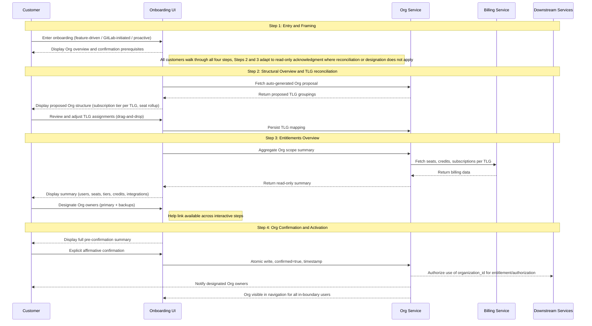

GitLab は、product 全体で 3 つの役割を果たす基盤 primitive として Organizations を導入しています。それらは別々のものですが、実際には互いを補強します。

**正規の tenant boundary。** Organization は customer の top-level groups、projects、users を共有 data boundary の下にカプセル化します。これは downstream systems が authorization and entitlement に使用する boundary であり、GitLab infrastructure に Cells 間で移動できる portable で self-contained な unit を与えることで、Cells architecture を扱いやすくします。

**統一されたコントロールプレーンと構築・デプロイの単位。** Organization は、顧客が GitLab footprint 全体を管理する単一の surface であり、GitLab が構築しデプロイする正規の単位です。私たちは一度構築し、どこにでもデプロイします。同じデータモデル、機能、アプリケーション surface が、同じ概念の 3 つの異なる実装ではなく、GitLab.com、Self-Managed、Dedicated に出荷されます。Org は顧客が体験する統合コントロールプレーンでもあります。ユーザーライフサイクル管理、visibility controls、billing visibility、settings、機能 enablement は、時間とともにすべて Org level に統合され、すべてのデプロイタイプに同じ governance surface を与えます。今日の SaaS では、governance は TLG ごとに管理されており、SM と Dedicated と比べて技術的な divergence と product fragmentation を生んでいます。共有 primitive として Org がなければ、GitLab は同じ product の 3 つの実装に分岐し、その fragmentation は新しい機能が出荷されるたびに広がります。Org は、GitLab が構築する単位であり、顧客が govern する surface でもあることで、それを防ぎます。

**cross-platform migration の単位。** customer が deployment types 間、GitLab.com から Dedicated、Dedicated から Self-Managed、または Cells 間を移動するとき、移動するのは Organization です。これは customer の data、groups、entitlements の portable container です。customer は source platform 上に confirmed Org がなければ cross-platform migration を完了できません。これにより migration economics も扱いやすくなります。Org が self-contained で portable であれば、migrations は bespoke engineering engagements ではなく、tooled and automated なものになります。

confirmed Org boundary は、この 3 つすべての前提条件です。この ADR は、customer がその confirmed boundary に到達する方法を定義します。

この ADR は、Organization を unconfirmed から confirmed、active へ進める正規の 4 step onboarding workflow を定義します。この workflow は universal です。すべての customer は deployment type にかかわらず 4 steps すべてを通ります。異なるのは、各 step で customer action が必要か、read-only acknowledgment でよいかです。Multi-TLG SaaS customers は Step 2 で structure を reconcile し、Step 3 で entitlements と owner set を review します。Single-TLG SaaS customers は、同じ surfaces で pre-populated structure and entitlements を verify しますが、行うことは少なくなります。Self-Managed and Dedicated customers は Step 4 で consent する前に、同じ content を read-only acknowledgments として review します。つまり instance の structure、entitlements、initial owner set です。Org は定義された conditions の set が true になったときにのみ live になり、onboarding workflow はすべての customer についてそれらすべての boxes を check します。

この workflow は、すべての interim manual flows が構築される foundation です。これらの flows で onboarded された customers は、self-service が出荷されたときにこの workflow と完全に互換性のある state に着地します。v1 は、選択された customers 向けに GitLab-managed onboarding path と並行して出荷されます。この path では、GitLab が Org を作成し、TLG を transfer し、customer の明示的な acknowledgment を得たうえで customer に代わって confirm します。どちらの path も、この workflow と完全に互換性のある state の Org を生成します。manual path は self-service capability が成熟するにつれて縮小します。

Org が active になった後に起こること、feature enablement、ongoing administration、isolated mode への optional upgrade は、この ADR の scope 外です。isolation upgrade flow は別途指定されます。

---

## Org State Machine {#the-org-state-machine}

[Organization Lifecycle](../lifecycle.md) は、onboarding に関係する 3 つの states を定義します。

**Unconfirmed:** Org は Org ID と data boundary を持つ infrastructure として存在します。customers からは見えず、downstream systems に対して inert です。GitLab はすべての customers について background で unconfirmed Organizations を自動作成します。

**Confirmed:** customer が Org の boundary、entitlements、initial owner set を review し、それらに明示的に commit した状態です。Org shape は locked されます。

**Active:** Org は confirmed であり、downstream use のために完全に provisioned されています。confirmed Org boundary は scope 内の users に visible になり、Org owner set が recorded され、downstream systems は entitlement and authorization のために organization_id を使うことを authorized されます。

この workflow の 4 steps は、Org を unconfirmed から confirmed へ移動します。Confirmation は、Org を active にするために必要な backend work を開始します。

**Confirmed → Active transition。** Confirmation は、Org が active になる前に完了する platform-driven background work を開始します。organization memberships が作成され、TLG resources が transfer され（SaaS の場合）、downstream systems が organization_id を recognize することを authorized されます。Org-anchored features（Artifact Registry など）は active state を必要とします。confirmation だけでは feature enablement には十分ではありません。activation が失敗した場合、Org は confirmed state に残り、recovery は help link から support へ route されます。この transition 中の customer-visible experience（progress indicator、success notification、failure messaging）は UX dependency であり、workflow 出荷前に design されなければなりません。

この ADR は、customer onboarding と downstream activation に必要な level で onboarding lifecycle を定義します。intermediate provisioning states を含む、より詳細な backend state modeling は [Organization Lifecycle](../lifecycle.md) blueprint にあります。

---

## Governing Principle {#governing-principle}

Organizations onboarding は boundary を confirm します。内部のものを restructure しません。Org より前に存在する billing、entitlements、commercial decisions は、それまでどおり動作し続けます。新しい Org-level features は confirmed Org boundary に attach され、別途 purchase されます。Onboarding は、billing system や将来の Org-level billing design に属する decisions を initiate、restructure、force しません。

onboarding 中に行われるすべての data model decisions は、Org-level seat pooling、Org-anchored contracts、将来の operational posture を govern する flags など、将来の Org-level capabilities と forward-compatible でなければなりません。この workflow の implementation choice によって、将来の models を support するための destructive migration が必要になってはなりません。

Confirmation は、すべての deployment type で active and informed customer choice です。undo path はありません。confirmation は Org を downstream systems の authoritative boundary にし、real changes（instance admin とは別の Admin Area、新しい control plane attributes）を導入するため、customer は同意する前に理解する必要があります。すべての customer は deployment type にかかわらず 4 steps すべてを通ります。異なるのは各 step が action を求めるか acknowledgment だけを求めるかですが、customer は同意する前に自分が何に同意するかを見ます。

**workflow が deployment types 全体で universal である理由。** action が不要な step であっても、すべての customer は 4 steps すべてを通ります。理由は 3 つあります。confirmation には undo path がなく、customers は見たことのない boundary、entitlements、owner set に合理的に consent できないため、action がない step を skip すると、見せられていない content への commit を求めることになります。consent を超えて、Org は GitLab の単一の build、deploy、customer-facing governance の単位です。workflow を deployment type ごとに切り分けると、customer experience と engineering が maintain すべきものの両方が fragment し、一度 build してどこにでも deploy する leverage を失います。そして実務上、Steps 2 and 3 は将来の customer actions が着地する場所です。Org owner designation、expanded reconciliation、より多くの Org-level governance です。今日同じ shape を保つことで、これらの features は後で known places に着地し、restructured workflow にはなりません。

---

## Decision Summary {#decision-summary}

| Decision | Rationale |
|---|---|
| workflow は deployment types 全体で universal | すべての customer が 4 steps すべてを通ります。shape は deployment type によって変わらず、変わるのは step が action を必要とするか acknowledgment だけでよいかです。Single-TLG SaaS と SM/Dedicated customers は reconcile ではなく pre-populated content を verify しますが、それでもそれを見て consent します。すべての confirmed Org は同じ conditions を満たすことでその state に到達します。 |
| Purchase は Org confirmation の後に完了し、前ではない | customers は confirmed Org boundary なしに Org-level features を理解できません。confirmation 前に purchase を強制すると、committed されていない structure に対して billing records が作られます。 |
| Subscription tier reconciliation は deferred | Billing は launch 時点では TLG-anchored のままです。Org-level billing mechanism はまだ存在しません。tier harmonization を強制すると、対応する product benefit なしに customers へ financial or operational penalties を課します。これは holistic Org-level billing strategy を待つ deliberate deferral です。 |
| Subscription and contract reconciliation は Organizations deliverable ではない | Organizations は UI に decision points を surface できます。contract merges、tier harmonization、credit pool consolidation を実行する backend は Billing and Fulfillment が build and own しなければなりません。 |
| Org owner designation は Step 3 に存在する | customers は entitlements surface 上で Org owners を designate します。そこでは、それらの owners が何を govern するかも見ます。v1 では designation surface を Admin Area readiness と組み合わせた future workstream へ defer します。interim では、platform が TLG transfer/backfill 中の TLG-owner auto-promotion によって initial owner set を生成します。Reassignment requests は Admin Area が出荷されるまで help link から support へ route されます。 |
| SM and Dedicated Organizations は 4 steps すべてを通り、Steps 2 and 3 は read-only acknowledgments | instance boundary はすでに Org boundary であり、entitlements は instance/license level に留まるため、Steps 2 and 3 は platform によって pre-populated されます。それでも customer はそれらを見ます。Step 2 は instance の structural view（TLGs、groups、projects、namespaces）を示します。Step 3 は entitlements と initial Org owner set を示し、これは existing instance admins が auto-promoted されたものです。customer は自分が同意するものを見たうえで Step 4 で consent します。この action には undo がありません。 |
| mid-flow state preservation はしない | customer が workflow を途中で abandon した場合、return 時には Step 1 から再開します。target completion time は 5 minutes 未満であるため、re-entry friction は bounded です。state caching を避けることで workflow は stateless になり、engineering はより simple になります。customers が opt in するにつれ、まだ confirmed でない population は減り、practical impact もさらに小さくなります。 |

---

## Workflow Trigger Events and Eligibility Handling {#workflow-trigger-events-and-eligibility-handling}

### Trigger events

3 つの events が onboarding flow を customer に surface します。

この section では、**users with confirmation authority** は pre-confirmation authority set を指します。SaaS では TLG owners、SM and Dedicated では instance admins です。Org owner role は confirmation まで存在しません。users with confirmation authority は unconfirmed Org に対して act できる人々であり、confirmation 時に initial Org owner set になる人々です（v1 では TLG-owner または instance-admin auto-promotion による）。

feature-driven trigger は、customer が Artifact Registry のような Org-anchored feature を enable または purchase しようとし、platform が Organization が confirmed されているかを check したときに発生します。Org が unconfirmed であれば、platform は enablement attempt を intercept し、purchase または activation を続行する前に onboarding flow を surface します。これは GitLab.com、Self-Managed、Dedicated に適用されます。workflow はすべてに同じ shape で実行され、Steps 2 and 3 は customer が reconcile するものを持たない場合に read-only acknowledgments へ adapt します。

direct navigation trigger は、customer が特定の feature purchase を initiating action とせず、`gitlab.com/o/new` または同等の onboarding entry point へ navigate したときに発生します。この path は Organizations が product surface でより visible になるにつれて成長すると見込まれます。

platform-initiated trigger は、GitLab backfill process が existing customer に unconfirmed Organization を作成し、platform が next login または scheduled touchpoint で confirmation authority を持つ user に prompt を surface したときに発生します。

### Drop-in point routing

Step 1 は、interactive に act するすべての customer にとって常に entry point です。backfill process によって unconfirmed Organization がすでに作成されている customer でも、subsequent step が意味を持つ前に、Organization とは何か、何を求められているのかを理解する必要があります。structural work がすでに行われている場合でも、Step 1 の orientation は optional ではありません。

Organization state に基づいて変わるのは、Step 1 が customer を渡す path です。

Organization が存在しない場合、Step 1 は full reconciliation flow のため Step 2 へ進みます。backfill がすでに実行され unconfirmed Organization が存在する場合、Step 1 は状況を frame し、review のため Step 2 へ route します。すべての customer に対して 4 steps すべてが実行されます。異なるのは Steps 2 and 3 の content と required interaction です。Multi-TLG SaaS customers は structure を reconcile し（Step 2）、entitlements and owner set を review します（Step 3）。Single-TLG SaaS customers は pre-populated structure を verify し（Step 2）、pre-populated entitlements and owner set を review します（Step 3）。SM and Dedicated customers は instance の pre-populated structural view を見て（Step 2）、initial owner set を含む pre-populated entitlements view を見ます（Step 3）。Step 4 はすべての customer に対する consolidated pre-confirmation checkpoint です。Organization がすでに confirmed の場合、onboarding は完全に bypass されます。

| Organization state at trigger | Step 1 exit path |
|-------------------------------|------------------|
| No Organization exists | Step 2 → Step 3 → Step 4 |
| Unconfirmed Org exists, multiple TLGs | Step 2 (reconciliation) → Step 3 (review + designate owners) → Step 4 |
| Unconfirmed Org exists, single TLG | Step 2 (structure verification) → Step 3 (review) → Step 4 |
| Organization already confirmed | Onboarding bypassed |
| SM or Dedicated | Step 2 (read-only structural review) → Step 3 (read-only entitlements + owner set review) → Step 4 |

Step 1 の content は、interactive paths 全体で同一ではありません。feature-driven customers には、purchased feature へ責任を持ってできるだけ早く到達するための効率的な framing が必要です。backfill customers には、GitLab が自分たちの input なしに作成したものに対してなぜ act を求められているのかを理解する必要があります。orientation は常に必要であり、messaging は context-specific です。

UX への note: Step 1 には、上記の interactive routing paths に対応する少なくとも 3 つの distinct content states が必要です。Step 1 design が finalize される前に、copy ownership と各 state の DRI を解決するべきです。

### Ineligible user handling

customer が onboarding entry point に到達したが proceed できない場合、platform は理由を surface し、clear path forward を提供します。silent gating は受け入れられません。confirmation authority を持たない customer（SaaS で TLG owner ではない、SM/Dedicated で instance admin ではない）は、requirement の説明と誰に連絡すべきかの guidance を見るべきです。SaaS では TLG owner、SM/Dedicated では instance admin です。signed out の customer は、flow に access する前に sign in へ誘導されるべきです。

confirmation authority を持たない users は unconfirmed Organizations を見ません。onboarding surface は、unconfirmed state の Org boundary に対して act できる users にだけ提示されます。

### Email is not a trigger

Email は onboarding flow を開始する mechanism ではありません。customers は process を開始するために email address を入力する必要はなく、outbound email は flow を surface する主要な vehicle ではありません。Entry points は in-product です。

---

## Workflow Overview {#workflow-overview}

これは Organizations の正規 onboarding workflow です。すべての customer は 4 steps すべてを通ります。異なるのは各 step が customer action を必要とするか read-only acknowledgment でよいかです。Multi-TLG SaaS customers は Step 2 で structure を reconcile し、Step 3 で entitlements を review し owners を designate します（future state。v1 では designation は read-only review として出荷）。Single-TLG SaaS customers は同じ surfaces で pre-populated structure and entitlements を verify しますが、行うことは少なくなります。SM and Dedicated customers は同じ surfaces を read-only acknowledgments として見ます。instance の structural view、instance/license level の entitlements、existing instance admins の initial owner set です。Net-new SaaS customers は background で静かに Org を受け取り、feature gate または platform-initiated prompt が surface するまで flow に遭遇しない場合があります。Step 4 の confirmation は、すべての deployment type で active and informed customer choice です。この action には undo がなく、post-confirmation state は customer が見て consent しなければならない real changes を導入します。

help link はすべての step（Step 1 through Step 4）で利用できます。customers は flow の任意の時点で help を必要とする可能性があるためです。これは pre-filled Org context（Org ID、deployment type、current step、TLG mapping state）を持つ support queue へ route され、proposed structure や summary の問題を flow の外で解決できるようにします。

---

### Step 1: Entry and Framing

**何をするか:** Organization とは何か、なぜ Org-level features の prerequisite として confirmation が必要なのか、onboarding process に何が含まれるのかについて customer の方向付けをします。この step では commitments は行われません。

**Entry points:**

- Feature-driven: customer が Org-level feature を purchase または access しようとする。purchase gate は transaction が完了する前に Org confirmation requirement を surface します。
- Platform-initiated: GitLab が proposed した Org を existing customer に review and confirm するよう prompt する。
- Direct navigation: customer が特定の feature need に先立ち、独立して onboarding を開始する（例: gitlab.com/o/new 経由）。

**What changes at confirmation:**

1. **Organization navigation surface。** 新しい Organization object が side panel に Groups and Projects と sibling concept として表示されます。customers は Organization Settings page（Artifact Registry のような Org-scoped features が enable される場所）と Organization landing page（partner teams が時間をかけて populate する shell surface）へ navigate できます。
2. **Subscription and entitlement anchoring。** Subscriptions、entitlements、Org-anchored features は TLG（SaaS）または instance license（SM/Dedicated）ではなく organization_id に attach されます。existing entitlements は transparently transition します。new Org-anchored features は Org が active になると enable 可能になります。
3. **Org Owner role recorded。** TLG owners（SaaS）または instance admins（SM/Dedicated）は confirmation 時に Org owners へ auto-promoted されます。v1 ではこれは record-only role です。TLG/instance permissions が必要な actions を引き続き cover します。Admin Area が出荷されると、Org owners は TLG owner または instance admin authority とは異なる Org-scoped administrative authority（subscriptions、user management at Org level、Org-wide settings）を得ます。
4. **Future Admin Area。** 新しい Admin Area は、customer-facing Org owner designation と paired で出荷予定です。これは instance admin（または SaaS 上の TLG owner authority）とは別であり、Org-scoped governance を扱います。v1 には含まれません。
5. **No undo。** Confirmation は one-way action です。post-confirmation restructuring は Org merge tooling が利用可能になるまで support involvement が必要です。

**主な決定:**

- Purchase は Org confirmation 後に完了します。Feature-driven customers には開始前にこれを明示します。
- SM and Dedicated customers も SaaS と同じく 4 steps すべてを進みます。Orientation は不可欠です。Organization とは何か、confirmation によって何が変わるのか（Admin Area は instance admin とは異なる）、何に同意するよう求められているのかを理解する必要があります。Steps 2 and 3 は platform によって pre-populated され read-only acknowledgments として提示されますが、Step 4 で commit する前に同じ content（structure、entitlements、owner set）を見ます。
- Net-new SaaS customers は account creation 中に silently provisioned Org を受け取ります。feature gate または platform-initiated prompt が surface するまで、それと interact しません。long-term direction はすべての customer が confirmed Org を持つことです。rollout は今のところ slow and opt-in であり、proactive onboarding の specific nudge mechanism は Open Question 9 に記録されています。

**依存関係:** state machine（unconfirmed / confirmed / active）は、この step が出荷される前に first-class Org attribute として実装されなければなりません。Purchase gate enforcement には relevant purchasing flows との coordination が必要です。

---

### Step 2: Structural Overview and TLG Reconciliation

**何をするか:** customer に、GitLab がまとめた Org proposal を review してもらいます。これは Org として組み立てられた top-level groups、subgroups、projects、namespaces の structural view です。screen 上の問いは、これが GitLab において their organization に属するすべてを表しているかどうかです。Reconciliation は top-level group level で行われます。TLGs は Orgs 間を move する unit であり、subgroups、projects、namespaces は TLG と一緒に移動するためです。

**適用対象:** interaction は異なりますが、すべての customers に適用されます。Multi-TLG SaaS customers は drag-and-drop によって structure を reconcile します。Single-TLG SaaS customers は 1 つの TLG を持つ pre-populated structure を verify します。SM and Dedicated customers は instance の pre-populated structural view を acknowledge します（instance が boundary であるため grouping decision は存在しません）。すべての customer は proceed する前に、自分の Org に構造的に何が含まれるかを見ます。

**主な決定:**

- GitLab が structure を propose します。customer はそれを review し、任意で adjust します。wizard は blank canvas ではなく proposal から始まります。
- ここでは billing or subscription decisions は行われません。Subscription tier は context として TLG ごとに表示されるだけです。tiers が異なる場合でも action は required ではなく、conflict も flagged されません。
- Seat rollup and user overlap は informational only として表示されます。confirmation を gate しません。
- Single-TLG customers には fast path があります。structural overview は user が Organization を verify するために表示されます。TLG が 1 つだけなので reconciliation work は不要です。target completion time は 2 minutes 未満です。
- Multi-TLG customers は drag-and-drop と explicit selection により、proposed Organizations 間で top-level groups を move できます。
- customers は、自分が act する権限を持つ top-level groups だけを move または confirm できます。reconciliation flow は、user が権限外の arbitrary TLGs を attach することを許しません。
- confirmation 後、SaaS customers は新しい top-level groups を作成できます。creation flow は、billing は launch 時点で TLG-anchored のままであり、新しく作成された TLG は sibling subscriptions、credits、その他の commercial state を自動的に inherit しないことを warning として surface するべきです。新しい top-level group の billing は Org-level billing が存在するまで siblings とは separate のままです。したがって warning は、customers が複数 top-level groups で Organization を構成することを block せず、boundary を明示します。
- platform は confirmation 中に Org URL path の default slug を auto-generate します。SaaS では、slug は customer の primary TLG name に基づきます。SM and Dedicated では、slug は license または contract にある customer の registered organization name に基づきます。customers は onboarding 中に slug を select または approve しません。conflict-handling logic は Open Question 4 によって govern されます。Slug claiming and editing は post-confirmation Org page で Org Owners が行うため、default は Step 4 で committed され、onboarding rework なしで後から変更できます。

**Data model constraint:** ここで記録される organization_id assignments、subscription tier per TLG、BillingAccount associations は、future Org-level billing models と forward-compatible でなければなりません。この step が出荷される前に storage approach への engineering sign-off が必要です。

**依存関係:** forward-compatible data model への engineering sign-off。TLG creation block lift criteria への Finance confirmation。multi-TLG customers 向け proposal heuristic への UX confirmation。

---

### Step 3: Entitlements Overview

**何をするか:** proposed Org の commercial picture、つまり users、seats、subscription tiers、credits、integrations、Org-scoped entitlements を customer に示します。customer は initial Org owner set も見ます。これは Admin Area が出荷されたときに Org-wide administrative authority を持つ人々です。future state では、customer がここでその set（primary plus backups）を designate します。v1 では、customer が consent する前に誰が authority を持つかを知れるよう、auto-populated and read-only として表示されます。Step 3 は commercial picture と ownership view を同じ surface に置き、customer が commit 前に両方を考えられるようにします。Step 2（structure）および Step 4（final consolidated checkpoint）とは別です。

**適用対象:** interaction は異なりますが、すべての customers に適用されます。SaaS customers は Step 2 の TLG mapping 全体で aggregate された entitlements を見ます。SM and Dedicated customers は instance/license level の entitlements を見ます。initial owner set はすべての customer に表示されます。SaaS では TLG-owner-promoted、SM and Dedicated では instance-admin-promoted です。v1 では、owner set はすべての deployment types で read-only です。future-state designation は customer action としてここに存在します。

**主な決定:**

- summary は read-only です。billing decisions は不要です。Billing は今日と同じく TLG level で動作し続けます。
- summary には、total users（deduplicated）、total seats、subscription tier per TLG、該当する場合の credits balance、project and group counts、active integrations、Org-scoped add-on entitlements が含まれます。
- AR entitlement は Org-scoped です（access は Org 内のすべての top-level groups に適用されます）。AR の billing は、今日と同じく namespace_id を使い、purchase された TLG を通じて流れます。onboarding 中に customer から TLG billing anchor designation は不要です。
- customer はこの surface で initial Org owner set を review します。この set は Admin Area が出荷された後、subscriptions、user management、credits、Org-wide settings に対する administrative authority を持ちます。future state では、customer がこの set（primary plus backups）を直接 designate します。v1 では customer-facing designation を Admin Area readiness と paired された future workstream へ defer します。その surface が出荷されるまでは、set は auto-populated され read-only として表示されます。SaaS では confirmation に先立つ TLG transfer/backfill 中の TLG owners、SM and Dedicated では confirmation 時の instance admins です。post-confirmation の reassignment requests は help link を通じて support へ route されます。スコープ外を参照してください。
- help link はこの step と他のすべての step（Step 1 through Step 4）で利用できます。summary または proposed Org structure が正しく見えない場合のためです。これは Org ID、deployment type、current step、TLG mapping state が pre-filled された ticket を持つ support queue へ route されます。Help link interactions は product iteration の明示的な signal source です。customers が flag する patterns は、summary または Org structure が不明瞭または不正確な場所を示します。silent abandonment、つまり customers が flow に入りながら help link を使わず完了もしないことは、調査に値する friction または hesitation の implicit signal です。両方の signal types を aggregate して review するべきです。

**依存関係:** Org scope summary data aggregation が existing namespace data から queryable であることを確認。step 2 の TLG mapping は step 3 の render 前に persisted されていなければならない（または aggregation は session state から実行されなければならない）。Credits balance availability を Fulfillment と確認。Integration surface completeness を engineering と確認。Help link routing and ticket pre-fill を Support と確認。

---

### Step 4: Org Confirmation and Activation

**何をするか:** 交渉不能な commit step です。customer は steps 1 through 3 で確立されたすべての complete summary を review し、明示的に commit します。これは Org を unconfirmed から confirmed、active へ移し、downstream services が organization_id を使用することを authorize する action です。

**主な決定:**

- Confirmation には明示的な affirmative action が必要です。passive scroll や default acceptance ではありません。
- Step 3 で designated された Org owners の set は confirmation 時に committed されます。pre-confirmation summary は designated owners を surface し、customer が何に commit しているかを理解できるようにします。（v1 interim: customer-facing designation が出荷されるまでは、platform が TLG-owner auto-promotion によって owner set を生成し、reassignment requests は help link を通じて support へ route されます。）
- confirmation screen は、この action が auto-generated Org path（例: `/o/acme-org/`）を含む Org structure を downstream systems の authoritative boundary として commit することを示します。Org Owner は post-confirmation Org page で slug を claim または edit できます。post-confirmation structural restructuring は v1 では self-serve ではなく、Org merge tooling が利用可能になるまで support involvement が必要です。
- SM and Dedicated confirmation は、SaaS と同じ gating principle である active and informed customer choice です。customer はすでに structural view（Step 2）と initial owner set を含む entitlements（Step 3）を read-only acknowledgments として見ています。Step 4 はそれらを consolidate し、customer が明示的に opt in します。Confirmation は Org activation を gate します。customer consent なしに SM or Dedicated Org が active になることはありません。
- customer が pre-confirmation summary の error を特定した場合、各 element はそれが確立された step へ link back します。

**What confirmation produces:**

- Org record 上の `state = STATES[:confirmed]`
- Confirmation timestamp recorded
- boundary 内のすべての users に Org が navigation で visible になる
- Org Admin Area は出荷時に enabled になり、future owner designation workstream と paired される
- downstream services が entitlement and authorization のために organization_id を使用することを authorized される
- designated Org owners が notified される

**依存関係:** Org record state transition の atomic write guarantee を engineering と確認する必要があります。Navigation visibility propagation timing を確認。Return navigation invalidation logic（step 2 が変更された場合、step 3 data の何が invalidated されるか）を engineering と確認。

---

## 横断的な依存関係 {#cross-cutting-dependencies}

以下の dependencies は複数の steps に影響し、workflow が end-to-end で出荷される前に解決されなければなりません。

| Dependency | Owner | Affects |
|---|---|---|
| State machine（unconfirmed / confirmed / active）が first-class Org attribute として実装されていること | Tenant Scale Engineering | Steps 1, 4 |
| Purchase gate enforcement: Org-level features は unconfirmed Org に対して purchase できない | Fulfillment, AR team | Step 1 |
| organization_id assignments と TLG metadata の forward-compatible data model | Tenant Scale Engineering | Steps 2, 3 |
| TLG mapping persistence timing: step 2 completion 時に write されるか、step 4 confirmation 時だけか | Tenant Scale Engineering | Step 3 |
| existing namespace_ids からの Org scope summary data aggregation | Tenant Scale Engineering | Step 3 |
| confirmed and timestamp fields の atomic write guarantee | Tenant Scale Engineering | Step 4 |
| post-confirmation restructuring 向け Org merge tooling | Tenant Scale Engineering | Step 4 |
| Step 3 owner designation surface と Admin Area readiness の pairing。v1 の TLG-promoted owner set は designation surface 出荷時に editable でなければならない | Tenant Scale Engineering, Tenant Scale Product | Step 3, Admin Area launch |
| Help link routing and ticket pre-fill（Org ID、deployment type、current step、TLG mapping state） | Support, Tenant Scale UX | All interactive steps, especially Step 3 |
| Org Owners 向け slug claiming/editing surface を持つ post-confirmation Org page | Tenant Scale Engineering, Tenant Scale UX | Step 2 slug auto-generation, Step 4 confirmation outputs |
| Onboarding flow telemetry: step-by-step progression、help link interactions、silent abandonment（entered flow, did not use help link, did not complete） | Tenant Scale Product, Analytics Instrumentation | All interactive steps |

---

## スコープ外 {#out-of-scope}

以下はこの workflow の scope に明示的に含まれず、別途 tracking されます。

**Feature enablement and post-onboarding operations。** active Org が何を enable するか、feature surfaces、Admin Area、ongoing governance は confirmation の downstream であり、confirmed boundary に到達する一部ではありません。

**The isolation upgrade。** confirmed で active な non-isolated Org を isolated mode に upgrade することは ADR 012 で指定されます。この workflow は isolation flag を set、reference、depend しません。

**Org formation 時の Subscription tier reconciliation。** Billing は launch 時点で TLG-anchored のままです。Org-level billing mechanism は存在しません。onboarding 中に tier harmonization を強制すると、対応する product benefit なしに customers へ financial or operational penalties を課します。これを design する前に holistic Org-level billing strategy が必要です。

**Org merge tooling。** これは live subscriptions と確立された boundaries を持つ 2 つのすでに active confirmed Organizations に作用します。これは step 2 の reconciliation wizard とは architecture 的に別です。step 2 は Org が confirmed される前に動作します。Merge tooling は別の epic で tracking されます。

**Org level での Credits partitioning。** usage-based credits を Org 内の TLG level で partition できるかどうかは architecture 的に未解決です。これは credits architecture が support することを確認するまで defer されます。

**Customer-facing Org owner designation surface（Step 3）。** owner designation の target steady state は、customer が entitlements view と並んで Org owners（primary plus backups）を designate する Step 3 の customer-facing surface です。v1 はこの surface を Admin Area readiness と paired された future workstream へ defer します。interim では、platform が auto-promotion によって initial Org owner set を生成します。SaaS では confirmation に先立つ TLG transfer/backfill 中の TLG owners、SM and Dedicated では confirmation 時の instance admins です。この set はすべての deployment types で Step 3 に read-only として表示されるため、consent は Org boundary だけでなく owner set にも適用されます。post-confirmation reassignment requests は help link から support queue へ route されます。future workstream には、initial seeded set 向けの self-serve reassignment surface が含まれなければなりません。

---

## Workflow 出荷前に解決が必要な未解決事項 {#open-questions-requiring-resolution-before-workflow-ships}

1. Forward-compatible data model storage approach。engineering sign-off が必要。
2. TLG mapping persistence timing。step 3 query architecture に影響。
3. すべての Org-level purchasing flows にわたる purchase gate mechanism。Fulfillment coordination が必要。
4. Slug uniqueness scope、global または BillingAccount-scoped。これは confirmation 中の platform の auto-generation logic（collision handling）と、Org page 上の post-confirmation slug claiming and editing surface を govern します。Global uniqueness にはより広い availability check が必要です。BillingAccount-scoped uniqueness には intra-customer conflict handling だけが必要です。resolution は auto-generation defaults と post-confirmation Org page slug surface の両方に影響します。
5. Multi-TLG proposal heuristic。GitLab の auto-proposal の正確な signals and confidence thresholds。
6. TLG creation block lift criteria。milestone、capability threshold、または volume threshold。
7. Org record state transition の atomic write guarantee。engineering confirmation が必要。
8. Admin Area launch timing and scope。Admin Area launch は、authority が actionable になったとき customer-facing designation が機能するよう、Step 3 owner designation surface と paired でなければなりません。
9. non-feature-driven onboarding の platform-initiated trigger mechanism。intent は最終的にすべての customer を Org confirmation へ nudge することですが、rollout は今のところ slow and opt-in です。feature gate 経由で到達しない customers 向けの specific trigger surface（admin login prompt、scheduled communication、banner など）は未定義です。SM/Dedicated と、まだ feature gate に到達していない net-new SaaS に適用されます。

---

## 検討した代替案 {#alternatives-considered}

**staged workflow なしの single-step confirmation。** 却下しました。Multi-TLG customers に必要な decisions、structural overview、entitlements overview、owner designation は、overwhelming and error-prone な experience を作らずに single screen へ collapse できません。staged workflow はまた、何も決めることがない screens を提示するのではなく、SM and Dedicated に対して applicable でない steps を platform がきれいに auto-complete できるようにします。

**Blank canvas reconciliation UI。** 却下しました。step 2 で customers に Org structure を一から assemble させると、recall の負担を customer に置き、inconsistent results を生みます。GitLab はすでに customer の TLGs を知っているため、flow は customer が populate しなければならない empty surface ではなく、customer が correct する proposal から始まります。

**Org confirmation 前の Purchase。** 却下しました。committed されていない Org structure に対して billing records を作ります。customers は confirmed Org boundary なしに Org-level features を理解できません。また、purchase 後に onboarding が abandoned されると messy billing state を作ります。

**Org formation 時に subscription tier harmonization を要求する。** 却下しました。Billing は launch 時点で TLG-anchored です。Org は billing entity ではありません。harmonization を強制すると、platform がまだ対処できない problem を解決するために financial or operational penalty を課します。.com customers の 2.7% が複数 TLG を持ち、これらの long-tenured customers は early AR adopters である可能性が最も高いです。onboarding の時点で harmonization を課すと、AR のような early Org-scoped capabilities を最も必要とする customers に friction を作ります。

**self-service flow なしで全 SaaS customers を auto-confirmation する。** 却下しました。複数 top-level groups を持つ SaaS customers は、downstream systems が Org を authoritative として扱う前に grouping が正しいことを confirm する必要があります。review なしの auto-confirmation は、customer が認識または信頼しない可能性のある Org structure を作ります。

**deployment type によって workflow を skip または shape-vary する。** 却下しました。2 つの variants が検討され却下されました: (a) SM/Dedicated が workflow を完全に skip し、platform auto-confirmation を使う。これは informed consent を bypass します。(b) SM/Dedicated が Steps 1 and 4 だけを通り、Steps 2 and 3 は invisible に auto-complete する。これは deployment-specific workflow shape を作り、consent を弱めます。採用された model は universal です。すべての customer が 4 steps すべてを通り、content は context（interactive reconciliation、fast-path verification、または read-only acknowledgment）に adapt しますが、structure は同じままです。これにより、deployment type にかかわらず workflow は simple で、customer の consent は meaningful に保たれます。

---

## Review and Approval Required {#review-and-approval-required}

この ADR は、任意の step の implementation が始まる前に、以下からの review and approval を必要とします。

| Reviewer | Area | Required for |
|---|---|---|
| Tenant Scale Engineering Lead | Data model, state machine, atomic writes, forward compatibility | All steps |
| UX and Technical Writing | Orientation content, reconciliation wizard, entitlements summary screen with owner designation, help link affordance, confirmation screen | Steps 1, 2, 3, 4 |
| AR Team | Entitlement scoping to organization_id, purchasing flow integration | Step 3 |

---

## 参考資料 {#references}

- New Isolation upgrade ADR: Isolation Upgrade Workflow (downstream of a confirmed Org)
- Organizations Onboarding Step Specs: Steps 1 through 4 (this initiative)
- Organizations and Billing issue: gitlab.com/gitlab-org/gitlab/-/work_items/597957
- Non-Isolated Organizations Onboarding epic: gitlab.com/groups/gitlab-org/-/work_items/21394
- Organizations Onboarding Workflow for Artifact Registry Enablement: gitlab.com/groups/gitlab-org/-/work_items/21393
- AR Usage Billing Integration MR: gitlab.com/gitlab-org/architecture/usage-billing/design-doc/-/merge_requests/27
- ADR 008: Non-Isolated Organizations on GitLab.com: https://handbook.gitlab.com/handbook/engineering/architecture/design-documents/organization/decisions/008_non_isolated_organizations_gitlab_com/
- Cells: Organization Migration design document: https://handbook.gitlab.com/handbook/engineering/architecture/design-documents/organization-data-migration/
- Cells: Organization Migration design document
