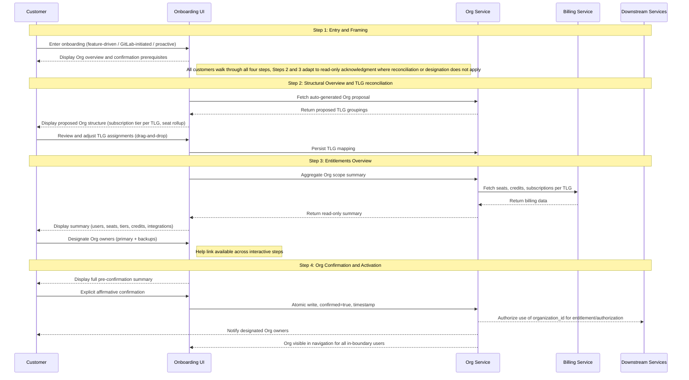

GitLab は、製品全体で 3 つの役割を担う基盤的なプリミティブとして Organizations を導入します。これらは別個のものですが、実際には互いを補強し合います。

**正規のテナント境界。** Organization は、顧客のトップレベルグループ、プロジェクト、ユーザーを共有データ境界の下に包含します。これは、下流のシステムが認可と権限付与に使用する境界であり、また GitLab のインフラストラクチャに Cells 間で移動できるポータブルで自己完結したユニットを与えることで、Cells アーキテクチャを扱いやすくします。

**統合されたコントロールプレーン、およびビルドとデプロイのユニット。** Organization は、顧客が自分の GitLab フットプリント全体を管理する単一の面であり、GitLab がビルドの対象とし、デプロイ先とする正規のユニットです。私たちは一度ビルドして、あらゆる場所にデプロイします。同じ概念の 3 つの分岐した実装ではなく、同じデータモデル、ケイパビリティ、アプリケーション面が GitLab.com、Self-Managed、Dedicated に出荷されます。Org はまた、顧客が体験する統合されたコントロールプレーンでもあります。ユーザーライフサイクル管理、可視性制御、課金の可視性、設定、機能の有効化はすべて、時間をかけて Org レベルに集約され、あらゆるデプロイメントタイプに同じガバナンス面を提供します。今日の SaaS では、ガバナンスは TLG ごとに管理されており、これが SM や Dedicated と比べて技術的な分岐と製品の断片化を生んでいます。共有プリミティブとしての Org がなければ、GitLab は同じ製品の 3 つの実装にフォークし、その断片化は出荷されるすべての新機能にわたって拡大します。Org は、GitLab がビルドの対象とするユニットであると同時に顧客がガバナンスを行う面でもあることによって、それを防ぎます。

**クロスプラットフォームマイグレーションのユニット。** 顧客がデプロイメントタイプ間を移動するとき（GitLab.com から Dedicated、Dedicated から Self-Managed、あるいは Cells 間）、移動するのは Organization です。これは、顧客のデータ、グループ、エンタイトルメントのためのポータブルなコンテナです。顧客は、移行元プラットフォーム上に confirmed の Org がなければクロスプラットフォームマイグレーションを完了できません。これはまた、マイグレーションの経済性を扱いやすくするものでもあります。Org が自己完結的でポータブルであれば、マイグレーションは個別のエンジニアリング案件ではなく、ツール化・自動化されたものになります。

confirmed の Org 境界は、これら 3 つすべての前提条件です。この ADR は、顧客がどのようにその confirmed 境界に到達するかを定義します。

この ADR は、Organization を unconfirmed から confirmed、そして active へと移行させる正規の 4 ステップのオンボーディングワークフローを定義します。このワークフローはユニバーサルです。すべての顧客は、デプロイメントタイプに関係なく 4 つのステップすべてを通過します。異なるのは、各ステップが顧客のアクションを必要とするか、読み取り専用の確認を必要とするかという点です。マルチ TLG の SaaS 顧客は、Step 2 で構造を調整し、Step 3 でエンタイトルメントとオーナーセットをレビューします。シングル TLG の SaaS 顧客は、同じ面で、対応すべきことがより少ない状態で、事前入力された構造とエンタイトルメントを検証します。Self-Managed と Dedicated の顧客は、Step 4 で同意する前に、同じコンテンツ（インスタンスの構造、エンタイトルメント、初期オーナーセット）を読み取り専用の確認としてレビューします。Org は、定義された一連の条件がすべて真になって初めてライブになります。そしてオンボーディングワークフローは、すべての顧客についてそれらの条件のすべてを確認するものです。

このワークフローは、すべての暫定的な手動フローが構築される基盤です。それらのフローを通じてオンボーディングされた顧客は、セルフサービスが出荷される際にこのワークフローと完全に互換性のある状態に着地します。v1 は、選定された顧客向けの並行する GitLab 管理オンボーディングパスと並んで出荷されます。このパスでは、GitLab が Org を作成し、TLG を移管し、顧客の明示的な確認のもとで顧客に代わって confirm します。どちらのパスも、このワークフローと完全に互換性のある状態の Org を生成します。手動パスは、セルフサービスのケイパビリティが成熟するにつれて縮小していきます。

Org が active になった後に起こること（機能の有効化、継続的な管理、isolated モードへのオプションのアップグレード）は、この ADR のスコープ外です。isolation アップグレードフローは別途定義されます。

---

## The Org State Machine

[Organization Lifecycle](../lifecycle.md) は、オンボーディングに関連する 3 つの状態を定義します。

**Unconfirmed:** Org は、Org ID とデータ境界を持つインフラストラクチャとして存在します。顧客には見えず、下流のシステムに対しては不活性です。GitLab はバックグラウンドですべての顧客のために unconfirmed の Organization を自動作成します。

**Confirmed:** 顧客は Org の境界、エンタイトルメント、初期オーナーセットをレビューし、それらに明示的にコミットしています。Org の形状はロックされています。

**Active:** Org は confirmed であり、下流での利用に向けて完全にプロビジョニングされています。confirmed の Org 境界はスコープ内のユーザーに見え、Org オーナーセットが記録され、下流のシステムはエンタイトルメントと認可のために organization_id を使用する権限を与えられています。

このワークフローの 4 つのステップは、Org を unconfirmed から confirmed へと移行させます。confirmation は、Org を active にするために必要なバックエンド作業を開始させます。

**Confirmed → Active の遷移。** confirmation は、Org が active になる前に完了する、プラットフォーム主導のバックグラウンド作業を開始させます。organization メンバーシップが作成され、TLG リソースが移管され（SaaS の場合）、下流のシステムが organization_id を認識する権限を与えられます。Org にアンカーされた機能（Artifact Registry など）は active 状態を必要とします。confirmation だけでは機能の有効化には不十分です。アクティベーションが失敗した場合、Org は confirmed 状態のままとなり、リカバリーはヘルプリンク経由でサポートにルーティングされます。この遷移中の顧客に見える体験（進行状況インジケーター、成功通知、失敗メッセージ）は UX 依存であり、ワークフローの出荷前に設計される必要があります。

この ADR は、顧客オンボーディングと下流のアクティベーションに必要なレベルでオンボーディングライフサイクルを定義します。中間的なプロビジョニング状態を含む、より詳細なバックエンドの状態モデリングは、[Organization Lifecycle](../lifecycle.md) ブループリントにあります。

---

## Governing Principle

Organizations オンボーディングは境界を confirm します。その内部にあるものを再構築するわけではありません。Org に先行する課金、エンタイトルメント、商業的決定は、これまでどおり機能し続けます。新しい Org レベルの機能は、confirmed の Org 境界にアタッチされ、別途購入されます。オンボーディングは、課金システムや将来の Org レベルの課金設計に属する決定を開始したり、再構築したり、強制したりしません。

オンボーディング中に行われるすべてのデータモデルの決定は、Org レベルのシートプーリング、Org にアンカーされた契約、将来の運用態勢を統制するあらゆるフラグを含む、将来の Org レベルのケイパビリティと前方互換でなければなりません。このワークフローにおける実装上の選択は、それらの将来のモデルをサポートするために破壊的なマイグレーションを必要とするものであってはなりません。

confirmation は、あらゆるデプロイメントタイプにおいて、能動的かつ情報に基づいた顧客の選択です。元に戻すパスはありません。confirmation は Org を下流のシステムにとっての権威ある境界とし、顧客が同意する前に理解しておく必要のある実際の変更（インスタンス管理とは別個の Admin Area、新しいコントロールプレーンの属性）を導入します。すべての顧客は、デプロイメントタイプに関係なく 4 つのステップすべてを通過します。異なるのは、各ステップがアクションを求めるか単なる確認を求めるかという点ですが、顧客は同意する前に、自分が何に同意しようとしているのかを目にします。

**なぜワークフローはデプロイメントタイプを越えてユニバーサルなのか。** すべての顧客は、たとえそのステップが彼らからのアクションを必要としない場合でも、4 つのステップすべてを通過します。理由は 3 つあります。confirmation には元に戻すパスがなく、顧客が一度も見たことのない境界、エンタイトルメント、オーナーセットに対して合理的に同意することはできません。したがって、アクションのないステップをスキップすることは、彼らが一度も見せられていないコンテンツへのコミットを求めることを意味します。同意の点を超えて、Org は GitLab の唯一のビルド、デプロイ、顧客向けガバナンスのユニットです。ワークフローをデプロイメントタイプごとに切り分けることは、顧客体験とエンジニアリングが保守しなければならないものの両方を断片化させ、私たちは一度ビルドしてあらゆる場所にデプロイするというレバレッジを失います。そして実務上、Step 2 と Step 3 は、将来の顧客アクション（Org オーナーの指定、拡張された調整、より多くの Org レベルのガバナンス）が着地する場所です。今日同じ形状を保つことは、それらの機能が後で、再構築されたワークフローではなく既知の場所に着地することを意味します。

---

## Decision Summary

| Decision | Rationale |
|---|---|
| ワークフローはデプロイメントタイプを越えてユニバーサルである | すべての顧客は 4 つのステップすべてを通過する。形状はデプロイメントタイプによって変わらず、変わるのはステップがアクションを必要とするか単なる確認を必要とするかだけである。シングル TLG の SaaS 顧客と SM／Dedicated の顧客は、事前入力されたコンテンツを調整するのではなく検証するが、それでもそれを目にして同意する。confirmed のすべての Org は、同じ条件を満たすことでその状態に到達する。 |
| 購入は Org confirmation の前ではなく後に完了する | 顧客は、confirmed の Org 境界なしには Org レベルの機能について判断できない。confirmation の前に購入を強制することは、コミットされていない構造に対する課金レコードを作成してしまう。 |
| サブスクリプションティアの調整は延期される | ローンチ時点では課金は TLG にアンカーされたままである。Org レベルの課金メカニズムはまだ存在しない。ティアの統一を強制することは、対応する製品上のメリットなしに顧客へ財務的または運用上のペナルティを課す。これは、包括的な Org レベルの課金戦略を待つための意図的な延期である。 |
| サブスクリプションと契約の調整は Organizations の成果物ではない | Organizations は UI で意思決定ポイントを提示できる。契約のマージ、ティアの統一、クレジットプールの統合を実行するバックエンドは、Billing と Fulfillment によって構築・所有されなければならない。 |
| Org オーナーの指定は Step 3 にある | 顧客は、それらのオーナーが何をガバナンスするかも見えるエンタイトルメント面で、Org のオーナーを指定する。v1 では、指定面は Admin Area の準備と対になった将来のワークストリームに延期される。その間、プラットフォームは TLG 移管／バックフィル中に TLG オーナーの自動昇格を通じて初期オーナーセットを生成する。再割り当てリクエストは、Admin Area が出荷されるまでヘルプリンク経由でサポートにルーティングされる。 |
| SM と Dedicated の Organization は 4 つのステップすべてを通過し、Step 2 と Step 3 は読み取り専用の確認となる | インスタンス境界は既に Org 境界であり、エンタイトルメントはインスタンス／ライセンスレベルにとどまるため、Step 2 と Step 3 はプラットフォームによって事前入力される。それでも顧客はそれらを目にする。Step 2 はインスタンスの構造ビュー（TLG、グループ、プロジェクト、ネームスペース）を表示する。Step 3 はエンタイトルメントと、自動昇格された既存のインスタンス管理者である初期 Org オーナーセットを表示する。顧客は、自分が何に同意しているかを見た上で Step 4 で同意する。このアクションは元に戻せない。 |
| フロー途中の状態保存はない | 顧客がフロー途中でワークフローを離脱した場合、戻ってきたときに Step 1 から再開する。目標完了時間は 5 分未満なので、再入場のフリクションは限定的である。状態のキャッシュを避けることで、ワークフローはステートレスに保たれ、エンジニアリングはよりシンプルになる。顧客がオプトインしていくにつれて、まだ confirm されていない母集団は減少し、実務上の影響はさらに小さくなる。 |

---

## Workflow Trigger Events and Eligibility Handling

### Trigger events

3 つのイベントが、顧客にオンボーディングフローを提示します。

このセクション全体を通して、**confirmation 権限を持つユーザー** とは、confirmation 前の権限セット、すなわち SaaS では TLG オーナー、SM と Dedicated ではインスタンス管理者を指します。Org オーナーロールは confirmation まで存在しません。confirmation 権限を持つユーザーとは、unconfirmed の Org に対してアクションを取れる人々であり、confirmation 時に（v1 では TLG オーナーまたはインスタンス管理者の自動昇格を通じて）初期 Org オーナーセットになる人々です。

feature-driven トリガーは、顧客が Artifact Registry のような Org にアンカーされた機能を有効化または購入しようとし、プラットフォームがその Organization が confirm されているかどうかをチェックするときに発生します。Org が unconfirmed の場合、プラットフォームは有効化の試みをインターセプトし、購入またはアクティベーションが進む前にオンボーディングフローを提示します。これは GitLab.com、Self-Managed、Dedicated に適用されます。ワークフローはそれらすべてで同じ形状で実行され、Step 2 と Step 3 は、顧客に調整すべきものがない場合には読み取り専用の確認に適応します。

direct navigation トリガーは、顧客が特定の機能購入を起点のアクションとせずに `gitlab.com/o/new` または同等のオンボーディングエントリポイントに移動するときに発生します。このパスは、Organizations が製品面でより可視化されるにつれて増加することが見込まれます。

platform-initiated トリガーは、GitLab のバックフィルプロセスが既存顧客のために unconfirmed の Organization を作成し、プラットフォームが次回ログイン時またはスケジュールされたタッチポイントで confirmation 権限を持つユーザーにプロンプトを提示するときに発生します。

### Drop-in point routing

Step 1 は、インタラクティブに行動するあらゆる顧客にとって常にエントリポイントです。バックフィルプロセスによって既に作成された unconfirmed の Organization を持って到着した顧客も、後続のステップが意味をなす前に、Organization とは何か、そして何を求められているのかを理解する必要があります。構造的な作業が既に彼らのために行われている場合でも、Step 1 のオリエンテーションは省略できません。

Organization の状態によって変わるのは、Step 1 が顧客に渡すパスです。

Organization が存在しない場合、Step 1 はフルの調整フローのために Step 2 へ進みます。バックフィルが既に実行され unconfirmed の Organization が存在する場合、Step 1 は状況を説明し、レビューのために Step 2 へルーティングします。4 つのステップすべてがすべての顧客に対して実行されます。変わるのは Step 2 と Step 3 のコンテンツと必要なインタラクションです。マルチ TLG の SaaS 顧客は構造を調整し（Step 2）、エンタイトルメントとオーナーセットをレビューします（Step 3）。シングル TLG の SaaS 顧客は事前入力された構造を検証し（Step 2）、事前入力されたエンタイトルメントとオーナーセットをレビューします（Step 3）。SM と Dedicated の顧客は、インスタンスの事前入力された構造ビュー（Step 2）と、初期オーナーセットを含む事前入力されたエンタイトルメントビュー（Step 3）を目にします。Step 4 は、すべての顧客にとって統合された confirmation 前のチェックポイントです。Organization が既に confirm されている場合、オンボーディングは完全にバイパスされます。

| Organization state at trigger | Step 1 exit path |
|-------------------------------|------------------|
| No Organization exists | Step 2 → Step 3 → Step 4 |
| Unconfirmed Org exists, multiple TLGs | Step 2 (reconciliation) → Step 3 (review + designate owners) → Step 4 |
| Unconfirmed Org exists, single TLG | Step 2 (structure verification) → Step 3 (review) → Step 4 |
| Organization already confirmed | Onboarding bypassed |
| SM or Dedicated | Step 2 (read-only structural review) → Step 3 (read-only entitlements + owner set review) → Step 4 |

Step 1 のコンテンツは、インタラクティブなパス全体で同一ではありません。feature-driven の顧客は、責任ある範囲で可能な限り速やかに購入した機能へ導く効率的なフレーミングを必要とします。バックフィルの顧客は、なぜ GitLab が自分のインプットなしに作成したものに対してアクションを求めているのかを理解する必要があります。オリエンテーションは常に必須ですが、メッセージングはコンテキスト固有です。

UX への注記: Step 1 には、上記のインタラクティブなルーティングパスに対応する少なくとも 3 つの異なるコンテンツ状態が必要です。各状態のコピーのオーナーシップと DRI は、Step 1 の設計が最終化される前に解決されるべきです。

### Ineligible user handling

顧客がいずれかのオンボーディングエントリポイントに到着したものの先へ進めない場合、プラットフォームはその理由を提示し、明確な進路を提供します。サイレントなゲーティングは許容されません。confirmation 権限を持たない顧客（SaaS で TLG オーナーでない、SM／Dedicated でインスタンス管理者でない）は、要件の説明と、誰に連絡すべきかのガイダンス（SaaS では TLG オーナー、SM／Dedicated ではインスタンス管理者）を目にするべきです。サインアウトした状態で到着した顧客は、フローにアクセスできるようになる前にサインインするよう案内されるべきです。

confirmation 権限を持たないユーザーは、unconfirmed の Organization を目にしません。オンボーディング面は、unconfirmed 状態の Org 境界に対してアクションを取れるユーザーにのみ提示されます。

### Email is not a trigger

Email はオンボーディングフローを開始するためのメカニズムではありません。顧客はプロセスを開始するためにメールアドレスを入力する必要はなく、アウトバウンドメールはフローを提示するための主要な手段ではありません。エントリポイントは製品内にあります。

---

## Workflow Overview

これは Organizations の正規のオンボーディングワークフローです。すべての顧客は 4 つのステップすべてを通過します。変わるのは、各ステップが顧客のアクションを必要とするか読み取り専用の確認を必要とするかという点です。マルチ TLG の SaaS 顧客は Step 2 で構造を調整し、Step 3 でエンタイトルメントをレビューしてオーナーを指定します（将来の状態において。v1 では指定は読み取り専用のレビューとして出荷されます）。シングル TLG の SaaS 顧客は、同じ面で、対応すべきことがより少ない状態で、事前入力された構造とエンタイトルメントを検証します。SM と Dedicated の顧客は、同じ面を読み取り専用の確認として目にします。インスタンスの構造ビュー、インスタンス／ライセンスレベルのエンタイトルメント、既存のインスタンス管理者からなる初期オーナーセットです。新規の SaaS 顧客はバックグラウンドでサイレントに Org を受け取り、機能ゲートやプラットフォーム起点のプロンプトがそれを提示するまでフローに遭遇しないことがあります。Step 4 での confirmation は、あらゆるデプロイメントタイプにとって能動的かつ情報に基づいた顧客の選択です。このアクションは元に戻せず、confirmation 後の状態は、顧客が見て同意しなければならない実際の変更を導入します。

ヘルプリンクはすべてのステップ（Step 1 から Step 4 まで）で利用できます。顧客はフローのどの時点でも助けを必要とする可能性があるからです。これは、Org コンテキスト（Org ID、デプロイメントタイプ、現在のステップ、TLG マッピング状態）が事前入力されたサポートキューにルーティングされ、提案された構造やサマリーに関する問題をフローの外で解決できるようにします。

---

### Step 1: Entry and Framing

**何をするか:** Organization とは何か、なぜ Org の confirm が Org レベルの機能の前提条件なのか、そしてオンボーディングプロセスには何が含まれるのかを顧客にオリエンテーションします。このステップではコミットメントは一切行われません。

**エントリポイント:**

- Feature-driven: 顧客が Org レベルの機能を購入またはアクセスしようとする。購入ゲートが、トランザクションが完了する前に Org confirmation の要件を提示する。
- Platform-initiated: GitLab が既存顧客に、提案した Org をレビューして confirm するよう促す。
- Direct navigation: 顧客が特定の機能ニーズに先立って自発的にオンボーディングを開始する（例: gitlab.com/o/new 経由）。

**confirmation 時に何が変わるか:**

1. **Organization ナビゲーション面。** 新しい Organization オブジェクトが、Groups と Projects の兄弟的な概念としてサイドパネルに表示されます。顧客は、Organization Settings ページ（Artifact Registry のような Org スコープの機能が有効化される場所）と、Organization ランディングページ（パートナーチームが時間をかけて埋めていくシェル面）に移動できます。
2. **サブスクリプションとエンタイトルメントのアンカリング。** サブスクリプション、エンタイトルメント、Org にアンカーされた機能は、TLG（SaaS）やインスタンスライセンス（SM／Dedicated）ではなく organization_id にアタッチされます。既存のエンタイトルメントは透過的に移行します。新しい Org にアンカーされた機能は、Org が active になると有効化できるようになります。
3. **Org Owner ロールの記録。** TLG オーナー（SaaS）またはインスタンス管理者（SM／Dedicated）は、confirmation 時に自動的に Org オーナーへ昇格されます。v1 では、これは記録のみのロールです。TLG／インスタンスのパーミッションが引き続き必要なすべてのアクションをカバーします。Admin Area が出荷されると、Org オーナーは TLG オーナーやインスタンス管理者の権限とは別個の、Org スコープの管理権限（サブスクリプション、Org レベルでのユーザー管理、Org 全体の設定）を得ます。
4. **将来の Admin Area。** 新しい Admin Area が、顧客向けの Org オーナー指定と対になって出荷される予定です。これはインスタンス管理者（SaaS では TLG オーナー権限）とは別個のもので、Org スコープのガバナンスを扱います。これは v1 では出荷されません。
5. **元に戻せない。** confirmation は一方向のアクションです。confirmation 後の再構築は、Org マージツールが利用可能になるまでサポートの関与を必要とします。

**主要な決定:**

- 購入は Org confirmation の後に完了する。feature-driven の顧客は、開始する前にこれを明示的に伝えられる。
- SM と Dedicated の顧客は、SaaS と同様に 4 つのステップすべてを進む。オリエンテーションは不可欠である。彼らは、Organization とは何か、confirmation で何が変わるか（Admin Area はインスタンス管理者とは別個である）、そして何に同意するよう求められているのかを理解する必要がある。彼らの Step 2 と Step 3 はプラットフォームによって事前入力され、読み取り専用の確認として提示される。それでも彼らは、Step 4 でコミットする前に同じコンテンツ（構造、エンタイトルメント、オーナーセット）を目にする。
- 新規の SaaS 顧客は、アカウント作成中にサイレントにプロビジョニングされた Org を受け取る。機能ゲートやプラットフォーム起点のプロンプトが提示されるまで、彼らはそれと対話しない。長期的な方向性は、すべての顧客が confirmed の Org を持つことであるが、現時点ではロールアウトは緩やかでオプトインであり、プロアクティブなオンボーディングのための具体的なナッジメカニズムは Open Question 9 に記載されている。

**依存関係:** 状態マシン（unconfirmed／confirmed／active）は、このステップが出荷される前にファーストクラスの Org 属性として実装されなければなりません。購入ゲートの強制には、関連する購入フローとの調整が必要です。

---

### Step 2: Structural Overview and TLG Reconciliation

**何をするか:** GitLab がまとめた Org の提案、すなわち彼らの Org として組み立てられたトップレベルグループ、サブグループ、プロジェクト、ネームスペースの構造ビューをレビューするよう顧客に求めます。画面上の問いは、これが GitLab における彼らの組織に属するすべてを表しているかどうかです。TLG が Org 間を移動するユニットであるため、調整はトップレベルグループのレベルで行われます。サブグループ、プロジェクト、ネームスペースは、それぞれの TLG とともに付いてきます。

**適用対象:** すべての顧客。ただしインタラクションは異なります。マルチ TLG の SaaS 顧客はドラッグ＆ドロップで構造を調整します。シングル TLG の SaaS 顧客は 1 つの TLG を持つ事前入力された構造を検証します。SM と Dedicated の顧客は、インスタンスの事前入力された構造ビューを確認します（インスタンスが境界であるため、グループ化の決定は存在しません）。すべての顧客は、先へ進む前に自分の Org に構造的に何が含まれているかを目にします。

**主要な決定:**

- GitLab が構造を提案する。顧客はそれをレビューし、任意で調整する。ウィザードは空白のキャンバスではなく提案で始まる。
- ここでは課金やサブスクリプションの決定は行われない。サブスクリプションティアは、コンテキストとして TLG ごとに表示されるだけである。アクションは不要であり、ティアが異なっていても競合はフラグされない。
- シートのロールアップとユーザーの重複は、情報提供のみとして表示される。これらは confirmation をゲートしない。
- シングル TLG の顧客には高速パスがある。ユーザーが自分の Organization を検証できるよう構造の概要が表示される。TLG が 1 つしかないため、調整作業は不要である。目標完了時間は 2 分未満である。
- マルチ TLG の顧客は、ドラッグ＆ドロップと明示的な選択により、提案された Organization 間でトップレベルグループを移動できる。
- 顧客は、自分がアクションを取る権限を持つトップレベルグループのみを移動または confirm できる。調整フローは、ユーザーが自分の権限外の任意の TLG をアタッチすることを許可しない。
- confirmation の後、SaaS 顧客は新しいトップレベルグループを作成できる。作成フローは、ローンチ時点では課金が TLG にアンカーされたままであること、そして新しく作成された TLG は兄弟のサブスクリプション、クレジット、その他の商業的状態を自動的に継承しないことを警告として提示すべきである。新しいトップレベルグループの課金は、Org レベルの課金が存在するまで兄弟とは別個のままなので、この警告は、顧客が複数のトップレベルグループで Organization を構造化することをブロックすることなく境界を明示的にする。
- プラットフォームは、confirmation 中に Org URL パス用のデフォルトのスラッグを自動生成する。SaaS の場合、スラッグは顧客のプライマリ TLG 名に基づく。SM と Dedicated の場合、スラッグはライセンスまたは契約に基づく顧客の登録組織名に基づく。顧客はオンボーディング中にスラッグを選択または承認しない。競合処理ロジックは Open Question 4 によって統制される。スラッグのクレーミングと編集は、confirmation 後の Org ページで Org Owner によって処理されるため、デフォルトは Step 4 でコミットされ、オンボーディングのやり直しなしに後で変更できる。

**データモデルの制約:** ここで記録される organization_id の割り当て、TLG ごとのサブスクリプションティア、BillingAccount の関連付けは、将来の Org レベルの課金モデルと前方互換でなければなりません。このステップが出荷される前に、ストレージのアプローチに関するエンジニアリングのサインオフが必要です。

**依存関係:** 前方互換なデータモデルに関するエンジニアリングのサインオフ。TLG 作成ブロックの解除基準に関する Finance の確認。マルチ TLG 顧客向けの提案ヒューリスティックに関する UX の確認。

---

### Step 3: Entitlements Overview

**何をするか:** 提案された Org の商業的な全体像（ユーザー、シート、サブスクリプションティア、クレジット、インテグレーション、Org スコープのエンタイトルメント）を顧客に表示します。彼らはまた、初期 Org オーナーセット、すなわち Admin Area が出荷されたら Org 全体の管理権限を持つことになる人々も目にします。将来の状態では、顧客はここでそのセット（プライマリとバックアップ）を指定します。v1 では、それは自動入力され読み取り専用で表示されるため、顧客は同意する前に誰が権限を持つことになるかを知ります。Step 3 は、顧客がコミットする前に両方を検討できるよう、商業的な全体像とオーナーシップビューを同じ面に配置します。これは Step 2（構造）および Step 4（最終的な統合されたチェックポイント）とは別個です。

**適用対象:** すべての顧客。ただしインタラクションは異なります。SaaS 顧客は、Step 2 の TLG マッピング全体で集約されたエンタイトルメントを目にします。SM と Dedicated の顧客は、インスタンス／ライセンスレベルのエンタイトルメントを目にします。初期オーナーセットはすべての顧客に表示されます。SaaS では TLG オーナーから昇格され、SM と Dedicated ではインスタンス管理者から昇格されます。v1 では、オーナーセットはすべてのデプロイメントタイプで読み取り専用です。将来の状態での指定は、顧客アクションとしてここに置かれます。

**主要な決定:**

- サマリーは読み取り専用である。課金の決定は不要である。課金は TLG レベルで今日どおり機能し続ける。
- サマリーには次が含まれる。総ユーザー数（重複排除済み）、総シート数、TLG ごとのサブスクリプションティア、該当する場合のクレジット残高、プロジェクトとグループの数、アクティブなインテグレーション、Org スコープのアドオンエンタイトルメント。
- AR エンタイトルメントは Org スコープである（アクセスは Org 内のすべてのトップレベルグループに適用される）。AR の課金は、今日どおり namespace_id を使用して、それが購入された TLG を通じて流れる。オンボーディング中に顧客から TLG 課金アンカーの指定を求めることはない。
- 顧客はこの面で初期 Org オーナーセットをレビューする。このセットは、Admin Area が出荷されたらサブスクリプション、ユーザー管理、クレジット、Org 全体の設定に対する管理権限を持つ。将来の状態では、顧客はこのセット（プライマリとバックアップ）を直接指定する。v1 では、顧客向けの指定を Admin Area の準備と対になった将来のワークストリームに延期する。その面が出荷されるまで、セットは自動入力され読み取り専用で表示される。SaaS では TLG オーナー（confirmation に先行する TLG 移管／バックフィル中）、SM と Dedicated ではインスタンス管理者（confirmation 時）。confirmation 後の再割り当てリクエストは、ヘルプリンク経由でサポートにルーティングされる。Out of Scope を参照。
- サマリーや提案された Org 構造が正しく見えない場合のために、このステップとその他すべてのステップ（Step 1 から Step 4 まで）でヘルプリンクが利用できる。これは、Org ID、デプロイメントタイプ、現在のステップ、TLG マッピング状態が事前入力されたチケットとともにサポートキューにルーティングされる。ヘルプリンクのインタラクションは、製品のイテレーションのための明示的なシグナルソースである。顧客がフラグするものに見られるパターンは、サマリーや Org 構造のどこが不明確または不正確かを示す。サイレントな離脱、すなわちフローに入ったがヘルプリンクを使わず完了もしなかった顧客は、調査に値するフリクションまたはためらいの暗黙のシグナルである。両方のシグナルタイプは、レビューのために集約されるべきである。

**依存関係:** Org スコープのサマリーデータの集約が、既存のネームスペースデータからクエリ可能であることの確認。Step 2 の TLG マッピングが Step 3 のレンダリング前に永続化されていなければならない（または集約がセッション状態から実行されなければならない）。クレジット残高の利用可能性に関する Fulfillment との確認。インテグレーション面の完全性に関するエンジニアリングとの確認。ヘルプリンクのルーティングとチケットの事前入力に関する Support との確認。

---

### Step 4: Org Confirmation and Activation

**何をするか:** 交渉の余地のないコミットステップです。顧客は、Step 1 から Step 3 で確立されたすべての完全なサマリーをレビューし、明示的にコミットします。これは、Org を unconfirmed から confirmed、そして active へと移行させ、下流のサービスが organization_id を使用することを認可するアクションです。

**主要な決定:**

- confirmation には明示的な肯定アクションが必要である。受動的なスクロールやデフォルトの受諾ではない。
- Step 3 で指定された Org オーナーのセットは、confirmation 時にコミットされる。confirmation 前のサマリーは、顧客が何にコミットしているかを知れるよう、指定されたオーナーを提示する。（v1 暫定: 顧客向けの指定が出荷されるまで、プラットフォームは TLG オーナーの自動昇格を通じてオーナーセットを生成する。再割り当てリクエストはヘルプリンク経由でサポートにルーティングされる。）
- confirmation 画面は、このアクションが、自動生成された Org パス（例: `/o/acme-org/`）を含め、下流のシステムにとっての権威ある境界として Org 構造をコミットすることを述べる。Org Owner は、confirmation 後の Org ページでスラッグをクレームまたは編集できる。confirmation 後の構造的な再構築は v1 ではセルフサービスではなく、Org マージツールが利用可能になるまでサポートの関与を必要とする。
- SM と Dedicated の confirmation は、SaaS と同じゲーティング原則に従う、能動的かつ情報に基づいた顧客の選択である。顧客は既に構造ビュー（Step 2）と、初期オーナーセットを含むエンタイトルメント（Step 3）を読み取り専用の確認として目にしている。Step 4 はそれらを統合し、顧客は明示的にオプトインする。confirmation は Org のアクティベーションをゲートする。SM または Dedicated の Org は、顧客の同意なしには active にならない。
- 顧客が confirmation 前のサマリーで誤りを特定した場合、各要素はそれが確立されたステップへ戻るリンクとなる。

**confirmation が生成するもの:**

- Org レコード上の `state = STATES[:confirmed]`
- confirmation のタイムスタンプの記録
- 境界内のすべてのユーザーに対するナビゲーション上での Org の可視化
- 出荷時、将来のオーナー指定ワークストリームと対になって有効化される Org Admin Area
- エンタイトルメントと認可のために organization_id を使用する権限を与えられた下流のサービス
- 指定された Org オーナーへの通知

**依存関係:** Org レコードの状態遷移に対するアトミックな書き込みの保証が、エンジニアリングと確認されなければなりません。ナビゲーションの可視性の伝播タイミングの確認。戻り先ナビゲーションの無効化ロジック（Step 2 が変更された場合にどの Step 3 データが無効化されるか）のエンジニアリングとの確認。

---

## Cross-Cutting Dependencies

以下の依存関係は複数のステップに影響し、ワークフローがエンドツーエンドで出荷される前に解決されなければなりません。

| Dependency | Owner | Affects |
|---|---|---|
| 状態マシン（unconfirmed／confirmed／active）がファーストクラスの Org 属性として実装される | Tenant Scale Engineering | Steps 1, 4 |
| 購入ゲートの強制: Org レベルの機能は unconfirmed の Org に対して購入できない | Fulfillment, AR team | Step 1 |
| organization_id の割り当てと TLG メタデータのための前方互換なデータモデル | Tenant Scale Engineering | Steps 2, 3 |
| TLG マッピングの永続化タイミング: step 2 完了時に書き込むか step 4 confirmation 時のみか | Tenant Scale Engineering | Step 3 |
| 既存の namespace_id からの Org スコープサマリーデータの集約 | Tenant Scale Engineering | Step 3 |
| confirmed フィールドと timestamp フィールドに対するアトミックな書き込みの保証 | Tenant Scale Engineering | Step 4 |
| confirmation 後の再構築のための Org マージツール | Tenant Scale Engineering | Step 4 |
| Admin Area の準備と対になった Step 3 のオーナー指定面。v1 の TLG 昇格オーナーセットは、指定面が出荷されるときに編集可能でなければならない | Tenant Scale Engineering, Tenant Scale Product | Step 3, Admin Area launch |
| ヘルプリンクのルーティングとチケットの事前入力（Org ID、デプロイメントタイプ、現在のステップ、TLG マッピング状態） | Support, Tenant Scale UX | All interactive steps, especially Step 3 |
| Org Owner 向けのスラッグのクレーミング／編集面を備えた confirmation 後の Org ページ | Tenant Scale Engineering, Tenant Scale UX | Step 2 slug auto-generation, Step 4 confirmation outputs |
| オンボーディングフローのテレメトリ: ステップごとの進行、ヘルプリンクのインタラクション、サイレントな離脱（フローに入った、ヘルプリンクを使わなかった、完了しなかった） | Tenant Scale Product, Analytics Instrumentation | All interactive steps |

---

## Out of Scope

以下はこのワークフローのスコープに明示的に含まれず、別途追跡されます。

**機能の有効化とオンボーディング後の運用。** active な Org が有効化するもの、機能面、Admin Area、継続的なガバナンスは confirmation の下流であり、confirmed 境界に到達することの一部ではありません。

**isolation アップグレード。** confirmed で active な非 isolated の Org を isolated モードへアップグレードすることは、ADR 012 で定義されています。このワークフローにおいて isolation フラグを設定、参照、またはそれに依存するものは何もありません。

**Org 形成時のサブスクリプションティアの調整。** ローンチ時点では課金は TLG にアンカーされたままです。Org レベルの課金メカニズムは存在しません。オンボーディング中にティアの統一を強制することは、対応する製品上のメリットなしに顧客へ財務的または運用上のペナルティを課します。これは、設計される前に包括的な Org レベルの課金戦略を必要とします。

**Org マージツール。** これは、ライブのサブスクリプションと確立された境界を持つ、既に active で confirmed な 2 つの Organization に対して動作します。これは、いずれの Org も confirm される前に動作する step 2 の調整ウィザードとはアーキテクチャ的に別個です。マージツールは別個のエピックで追跡されています。

**Org レベルでのクレジットの分割。** 使用量ベースのクレジットを Org 内の TLG レベルで分割できるかどうかは、アーキテクチャ的に未解決です。これは、クレジットアーキテクチャがそれをサポートすることが確認されるまで延期されます。

**顧客向けの Org オーナー指定面（Step 3）。** オーナー指定の目標とする定常状態は、顧客がエンタイトルメントビューと並んで Org のオーナー（プライマリとバックアップ）を指定する、Step 3 の顧客向けの面です。v1 では、この面を Admin Area の準備と対になった将来のワークストリームに延期します。その間、プラットフォームは自動昇格を通じて初期 Org オーナーセットを生成します。SaaS では TLG オーナー（confirmation に先行する TLG 移管／バックフィル中）、SM と Dedicated ではインスタンス管理者（confirmation 時）です。このセットは、すべてのデプロイメントタイプで Step 3 において顧客に読み取り専用で表示されるため、同意は Org 境界だけでなくオーナーセットにも適用されます。confirmation 後の再割り当てリクエストは、ヘルプリンク経由でサポートキューにルーティングされます。将来のワークストリームには、初期にシードされたセットのためのセルフサービスの再割り当て面が含まれなければなりません。

---

## Open Questions Requiring Resolution Before Workflow Ships

1. 前方互換なデータモデルのストレージアプローチ。エンジニアリングのサインオフが必要。
2. TLG マッピングの永続化タイミング。step 3 のクエリアーキテクチャに影響する。
3. すべての Org レベル購入フローにわたる購入ゲートメカニズム。Fulfillment との調整が必要。
4. スラッグの一意性のスコープ、グローバルか BillingAccount スコープか。これは、confirmation 中のプラットフォームの自動生成ロジック（衝突処理）と、Org ページ上の confirmation 後のスラッグのクレーミングおよび編集面を統制する。グローバルな一意性はより広範な利用可能性チェックを必要とする。BillingAccount スコープの一意性は顧客内の競合処理のみを必要とする。解決は、自動生成のデフォルトと confirmation 後の Org ページのスラッグ面の両方に影響する。
5. マルチ TLG 提案ヒューリスティック。GitLab の自動提案のための正確なシグナルと信頼度のしきい値。
6. TLG 作成ブロックの解除基準。マイルストーン、ケイパビリティのしきい値、またはボリュームのしきい値。
7. Org レコードの状態遷移に対するアトミックな書き込みの保証。エンジニアリングの確認が必要。
8. Admin Area のローンチタイミングとスコープ。Admin Area のローンチは、権限が実行可能になったときに顧客向けの指定が機能するよう、Step 3 のオーナー指定面と対にされなければならない。
9. 非 feature-driven オンボーディングのためのプラットフォーム起点のトリガーメカニズム。意図は、最終的にすべての顧客を Org confirmation へと促すことであるが、現時点ではロールアウトは緩やかでオプトインである。機能ゲート経由で到着しない顧客に対する具体的なトリガー面（管理者ログインプロンプト、スケジュールされたコミュニケーション、バナーなど）は未定義である。SM／Dedicated と、まだ機能ゲートに到達していない新規 SaaS に適用される。

---

## Alternatives Considered

**段階的なワークフローのないシングルステップの confirmation。** 却下。マルチ TLG 顧客に必要な決定、構造の概要、エンタイトルメントの概要、オーナー指定は、圧倒的でエラーの起きやすい体験を生むことなしに単一の画面に圧縮することはできません。段階的なワークフローはまた、何も決めることのない画面を提示するのではなく、SM と Dedicated のために適用されないステップをプラットフォームがクリーンに自動完了することを可能にします。

**空白のキャンバスの調整 UI。** 却下。step 2 で顧客に Org 構造をゼロから組み立てるよう求めることは、想起の負担を顧客に課し、一貫性のない結果を生みます。GitLab は既に顧客の TLG を知っているため、フローは、顧客が埋めなければならない空の面ではなく、顧客が修正する提案で始まります。

**Org confirmation の前の購入。** 却下。コミットされていない Org 構造に対する課金レコードを作成します。顧客は、confirmed の Org 境界なしには Org レベルの機能について判断できません。また、購入後にオンボーディングが離脱された場合、煩雑な課金状態を生みます。

**Org 形成時にサブスクリプションティアの統一を要求すること。** 却下。ローンチ時点では課金は TLG にアンカーされています。Org は課金エンティティではありません。統一を強制することは、プラットフォームがまだ対処できない問題を解決するために、財務的または運用上のペナルティを課します。.com 顧客の 2.7% が複数の TLG を持っており、これらの長期顧客は最も早期に AR を採用する可能性が高いです。オンボーディングの時点で統一を課すことは、AR のような早期の Org スコープのケイパビリティを最も必要とする可能性が高い、まさにその顧客にフリクションを生み出すことになります。

**セルフサービスフローなしですべての SaaS 顧客を自動 confirmation すること。** 却下。複数のトップレベルグループを持つ SaaS 顧客は、下流のシステムが Org を権威あるものとして扱う前に、グループ化が正しいことを confirm する必要があります。レビューなしの自動 confirmation は、顧客が認識または信頼しないかもしれない Org 構造を生み出します。

**デプロイメントタイプによってワークフローをスキップまたは形状を変えること。** 却下。2 つのバリアントが検討され却下されました。(a) SM／Dedicated はプラットフォームの自動 confirmation でワークフロー全体をスキップする。これは情報に基づいた同意をバイパスします。(b) SM／Dedicated は Step 1 と Step 4 のみを進み、Step 2 と Step 3 が不可視に自動完了する。これはデプロイメント固有のワークフロー形状を生み、同意を弱めます。採用されたモデルはユニバーサルです。すべての顧客が 4 つのステップすべてを通過し、コンテンツはコンテキストに適応する（インタラクティブな調整、高速パスの検証、または読み取り専用の確認）が、構造は同じままです。これにより、デプロイメントタイプに関係なく、ワークフローはシンプルに、顧客の同意は意味のあるものに保たれます。

---

## Review and Approval Required

この ADR は、いずれのステップでも実装が始まる前に、以下からのレビューと承認を必要とします。

| Reviewer | Area | Required for |
|---|---|---|
| Tenant Scale Engineering Lead | データモデル、状態マシン、アトミックな書き込み、前方互換性 | All steps |
| UX and Technical Writing | オリエンテーションコンテンツ、調整ウィザード、オーナー指定を含むエンタイトルメントサマリー画面、ヘルプリンクのアフォーダンス、confirmation 画面 | Steps 1, 2, 3, 4 |
| AR Team | organization_id へのエンタイトルメントスコーピング、購入フローのインテグレーション | Step 3 |

---

## References

- New Isolation upgrade ADR: Isolation Upgrade Workflow (downstream of a confirmed Org)
- Organizations Onboarding Step Specs: Steps 1 through 4 (this initiative)
- Organizations and Billing issue: gitlab.com/gitlab-org/gitlab/-/work_items/597957
- Non-Isolated Organizations Onboarding epic: gitlab.com/groups/gitlab-org/-/work_items/21394
- Organizations Onboarding Workflow for Artifact Registry Enablement: gitlab.com/groups/gitlab-org/-/work_items/21393
- AR Usage Billing Integration MR: gitlab.com/gitlab-org/architecture/usage-billing/design-doc/-/merge_requests/27
- ADR 008: Non-Isolated Organizations on GitLab.com: https://handbook.gitlab.com/handbook/engineering/architecture/design-documents/organization/decisions/008_non_isolated_organizations_gitlab_com/
- Cells: Organization Migration design document: https://handbook.gitlab.com/handbook/engineering/architecture/design-documents/organization-data-migration/
- Cells: Organization Migration design document
