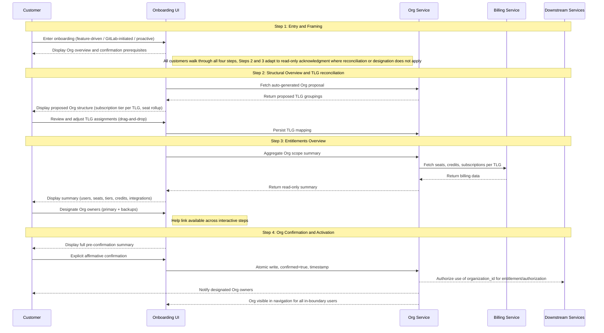

GitLab は、プロダクト全体で 3 つの役割を担う基礎的なプリミティブとして Organizations を導入しています。これらは別個のものですが、実際の運用では互いに補強し合います。

**正規のテナント境界。** Organization は、顧客のトップレベルグループ、プロジェクト、ユーザーを共有のデータ境界の下にカプセル化します。これは下流システムが認可とエンタイトルメントに使う境界であり、GitLab インフラストラクチャに対して Cell 間で移動できる、ポータブルで自己完結したユニットを提供することで Cells アーキテクチャを扱いやすくします。

**統一されたコントロールプレーンであり、ビルドとデプロイのユニット。** Organization は、顧客が GitLab のフットプリント全体を管理する単一のサーフェスであり、GitLab がビルドの対象としデプロイ先とする正規のユニットです。私たちは一度ビルドして、あらゆる場所にデプロイします。同じ概念に対する 3 つの異なる実装ではなく、同じデータモデル、ケイパビリティ、アプリケーションサーフェスが GitLab.com、Self-Managed、Dedicated に提供されます。Org はまた、顧客が体験する統合されたコントロールプレーンでもあります。ユーザーライフサイクル管理、可視性の制御、課金の可視性、設定、機能の有効化はすべて、時間をかけて Org レベルに集約され、あらゆるデプロイタイプに同じガバナンスサーフェスを提供します。今日の SaaS では、ガバナンスは TLG ごとに管理されており、これが SM や Dedicated と比べて技術的な乖離とプロダクトの断片化を生んでいます。共有プリミティブとしての Org がなければ、GitLab は同じプロダクトの 3 つの実装にフォークし、その断片化は新しく出荷されるすべての機能にわたって拡大していきます。Org は、GitLab がビルドの対象とするユニットであると同時に顧客がガバナンスを行うサーフェスでもあることで、これを防ぎます。

**クロスプラットフォーム移行のユニット。** 顧客がデプロイタイプ間を移動するとき（GitLab.com から Dedicated、Dedicated から Self-Managed、あるいは Cell をまたぐ移動）、移動するのは Organization です。これは顧客のデータ、グループ、エンタイトルメントのためのポータブルなコンテナです。顧客は、ソースプラットフォーム上に confirmed な Org がなければクロスプラットフォーム移行を完了できません。これはまた、移行の経済性を扱いやすくするものでもあります。Org が自己完結しポータブルであれば、移行はオーダーメイドのエンジニアリング対応ではなく、ツール化・自動化されたものになります。

confirmed な Org 境界は、これら 3 つすべての前提条件です。この ADR は、顧客がその confirmed な境界に到達する方法を定義します。

この ADR は、Organization を unconfirmed から confirmed、さらに active へと移行させる正規の 4 ステップオンボーディングワークフローを定義します。このワークフローは共通です。すべての顧客は、デプロイタイプにかかわらず 4 つのステップすべてを通過します。異なるのは、各ステップが顧客のアクションを必要とするか、それとも読み取り専用の確認のみで済むかです。マルチ TLG の SaaS 顧客は、Step 2 で自分の構造を調整し、Step 3 で自分のエンタイトルメントとオーナーセットをレビューします。シングル TLG の SaaS 顧客は、同じサーフェス上で事前に入力された構造とエンタイトルメントを検証しますが、対応すべきことは少なくなります。Self-Managed と Dedicated の顧客は、Step 4 で同意する前に、同じ内容（インスタンスの構造、エンタイトルメント、初期オーナーセット）を読み取り専用の確認としてレビューします。Org は、定義された一連の条件がすべて真になって初めてライブになります。オンボーディングワークフローは、すべての顧客についてそれらのボックスを 1 つ残らずチェックするものです。

このワークフローは、すべての暫定的な手動フローが構築される基盤です。それらのフローを通じてオンボーディングされた顧客は、セルフサービスが出荷されたときにこのワークフローと完全に互換性のある状態に着地します。v1 は、選定された顧客向けの並行する GitLab 管理オンボーディングパスとともに出荷されます。このパスでは、GitLab が Org を作成し、TLG を転送し、顧客の明示的な確認を得たうえで顧客に代わって確認します。どちらのパスも、このワークフローと完全に互換性のある状態の Org を生成します。手動パスは、セルフサービスのケイパビリティが成熟するにつれて段階的に縮小していきます。

Org が active になった後に起こること、すなわち機能の有効化、継続的な管理、隔離モードへの任意のアップグレードは、この ADR のスコープ外です。隔離アップグレードフローは別途定義されます。

---

## Org 状態マシン {#the-org-state-machine}

[Organization Lifecycle](../lifecycle.md) は、オンボーディングに関連する 3 つの状態を定義しています。

**Unconfirmed:** Org は、Org ID とデータ境界を持つインフラストラクチャとして存在します。顧客には見えず、下流システムに対しては不活性です。GitLab は、すべての顧客に対してバックグラウンドで unconfirmed な Organization を自動作成します。

**Confirmed:** 顧客が Org の境界、エンタイトルメント、初期オーナーセットをレビューし、それらに明示的にコミットしました。Org の形状はロックされます。

**Active:** Org は confirmed であり、下流での利用に向けて完全にプロビジョニングされています。confirmed な Org 境界はスコープ内のユーザーに見えるようになり、Org のオーナーセットが記録され、下流システムはエンタイトルメントと認可のために organization_id を使用することを認可されます。

このワークフローの 4 つのステップは、Org を unconfirmed から confirmed へと移行させます。confirmation は、Org を active にするために必要なバックエンドの作業を開始させます。

**Confirmed → Active への遷移。** confirmation は、Org が active になる前に完了するプラットフォーム主導のバックグラウンド作業を開始させます。organization メンバーシップが作成され、（SaaS では）TLG リソースが転送され、下流システムが organization_id を認識することを認可されます。Org にアンカーされた機能（Artifact Registry など）は active 状態を必要とします。confirmation だけでは機能の有効化には不十分です。有効化が失敗した場合、Org は confirmed 状態のままとなり、リカバリーはヘルプリンク経由でサポートへルーティングされます。この遷移中の顧客に見える体験（進捗インジケーター、成功通知、失敗メッセージ）は UX 依存であり、ワークフローが出荷される前に設計される必要があります。

この ADR は、顧客のオンボーディングと下流での有効化に必要なレベルでオンボーディングライフサイクルを定義します。中間的なプロビジョニング状態を含む、より詳細なバックエンドの状態モデリングは、[Organization Lifecycle](../lifecycle.md) ブループリントに記載されています。

---

## 統治原則 {#governing-principle}

Organizations のオンボーディングは境界を確認します。その内側にあるものを再構成するわけではありません。Org より前から存在する課金、エンタイトルメント、商業上の決定は、これまでどおり機能し続けます。新しい Org レベルの機能は confirmed な Org 境界にアタッチされ、別途購入されます。オンボーディングは、課金システムや将来の Org レベルの課金設計に属する決定を、開始させたり、再構成したり、強制したりすることはありません。

オンボーディング中に行われるすべてのデータモデルの決定は、Org レベルのシート共用、Org にアンカーされた契約、将来の運用姿勢を統治するあらゆるフラグを含め、将来の Org レベルのケイパビリティと前方互換でなければなりません。このワークフローにおけるいかなる実装上の選択も、それらの将来のモデルをサポートするために破壊的な移行を必要とすべきではありません。

confirmation は、あらゆるデプロイタイプにおいて、能動的で情報に基づいた顧客の選択です。取り消しパスはありません。confirmation は Org を下流システムにとって正規の境界とし、顧客が同意する前に理解しておく必要がある実際の変更（インスタンス管理とは別の Admin Area、新しいコントロールプレーン属性）をもたらします。すべての顧客は、デプロイタイプにかかわらず 4 つのステップすべてを通過します。異なるのは、各ステップがアクションを求めるか単なる確認を求めるかですが、顧客は同意する前に、自分が何に同意しようとしているのかを目にします。

**なぜワークフローがデプロイタイプを横断して共通なのか。** すべての顧客は、ステップに自分のアクションが不要な場合でも、4 つのステップすべてを通過します。理由は 3 つあります。confirmation には取り消しパスがなく、顧客はこれまで一度も見たことのない境界、エンタイトルメント、オーナーセットに合理的に同意することはできません。したがって、アクションが不要なステップをスキップすることは、見せられたことのない内容にコミットするよう求めることを意味してしまいます。同意の問題を超えて、Org は GitLab のビルド、デプロイ、顧客向けガバナンスの単一のユニットです。ワークフローをデプロイタイプごとに切り分けることは、顧客体験とエンジニアリングが維持しなければならないものの両方を断片化させ、一度ビルドしてあらゆる場所にデプロイするというレバレッジを失わせます。そして実務的には、Step 2 と Step 3 は将来の顧客アクションが着地する場所です。Org オーナーの指定、拡張された調整、より多くの Org レベルのガバナンスがそこに来ます。今日同じ形状を保つことは、それらの機能が後で再構成されたワークフローではなく、既知の場所に着地することを意味します。

---

## 決定の要約 {#decision-summary}

| 決定 | 根拠 |
|---|---|
| ワークフローはデプロイタイプを横断して共通である | すべての顧客が 4 つのステップすべてを通過する。形状はデプロイタイプによって変わらず、変わるのはステップがアクションを必要とするか単なる確認かだけである。シングル TLG の SaaS と SM/Dedicated の顧客は、事前に入力された内容を調整するのではなく検証するが、それでもそれを目にして同意する。すべての confirmed な Org は、同じ条件を満たすことでその状態に到達する。 |
| 購入は Org の confirmation より前ではなく後に完了する | 顧客は confirmed な Org 境界がなければ Org レベルの機能について判断できない。confirmation より前に購入を強制すると、コミットされていない構造に対する課金レコードが作られてしまう。 |
| サブスクリプションティアの調整は延期される | 課金はローンチ時点では TLG にアンカーされたままである。Org レベルの課金メカニズムはまだ存在しない。ティアの統一を強制することは、対応するプロダクト上のメリットなしに、顧客に金銭的または運用上のペナルティを課すことになる。これは、包括的な Org レベルの課金戦略を待つ、意図的な延期である。 |
| サブスクリプションと契約の調整は Organizations のデリバラブルではない | Organizations は UI 上で決定ポイントを表面化できる。契約のマージ、ティアの統一、クレジットプールの統合を実行するバックエンドは、Billing と Fulfillment が構築・所有しなければならない。 |
| Org オーナーの指定は Step 3 にある | 顧客は、それらのオーナーが何を統治するかも目にするエンタイトルメントサーフェス上で、Org のオーナーを指定する。v1 では指定サーフェスを Admin Area の準備と対になる将来のワークストリームに延期する。その間、プラットフォームは TLG の転送/バックフィル中に TLG オーナーの自動昇格を通じて初期オーナーセットを生成する。再割り当てのリクエストは、Admin Area が出荷されるまでヘルプリンク経由でサポートへルーティングされる。 |
| SM と Dedicated の Organization は 4 つのステップすべてを通過し、Step 2 と Step 3 は読み取り専用の確認となる | インスタンス境界はすでに Org 境界であり、エンタイトルメントはインスタンス/ライセンスレベルにとどまるため、Step 2 と Step 3 はプラットフォームによって事前に入力される。顧客はそれでもそれを目にする。Step 2 はインスタンスの構造ビュー（TLG、グループ、プロジェクト、namespace）を表示する。Step 3 はエンタイトルメントと、自動昇格された既存のインスタンス管理者である初期 Org オーナーセットを表示する。顧客は、自分が何に同意しようとしているのかを見たうえで Step 4 で同意する。このアクションに取り消しはない。 |
| フロー途中の状態保持はない | 顧客がフローの途中で離脱した場合、戻ったときに Step 1 から再開する。目標完了時間は 5 分未満なので、再入場の摩擦は限定的である。状態のキャッシュを避けることでワークフローはステートレスに保たれ、エンジニアリングはよりシンプルになる。顧客がオプトインするにつれて、まだ確認されていない母集団は減少し、実務的な影響はさらに小さくなる。 |

---

## ワークフローのトリガーイベントと適格性の処理 {#workflow-trigger-events-and-eligibility-handling}

### トリガーイベント {#trigger-events}

3 つのイベントが、オンボーディングフローを顧客に表面化させます。

このセクションを通じて、**確認権限を持つユーザー** とは、確認前の権限セット、すなわち SaaS では TLG オーナー、SM と Dedicated ではインスタンス管理者を指します。Org オーナーのロールは confirmation まで存在しません。確認権限を持つユーザーは、unconfirmed な Org に対してアクションを実行できる人々であり、confirmation 時に初期 Org オーナーセットになる人々です（v1 では TLG オーナーまたはインスタンス管理者の自動昇格による）。

機能主導のトリガーは、顧客が Artifact Registry のような Org にアンカーされた機能を有効化または購入しようとし、プラットフォームが彼らの Organization が確認されているかをチェックするときに発生します。Org が unconfirmed の場合、プラットフォームは有効化の試みをインターセプトし、購入または有効化を進めることを許可する前にオンボーディングフローを表面化します。これは GitLab.com、Self-Managed、Dedicated に適用されます。ワークフローはそれらすべてに対して同じ形状で動作し、顧客が調整すべきものがない場合は Step 2 と Step 3 が読み取り専用の確認に適応します。

直接ナビゲーションのトリガーは、顧客が特定の機能購入を起点とするアクションなしに `gitlab.com/o/new` または同等のオンボーディングエントリポイントにナビゲートするときに発生します。このパスは、Organizations がプロダクトサーフェスでより目立つようになるにつれて成長すると予想されます。

プラットフォーム起動のトリガーは、GitLab のバックフィルプロセスが既存顧客のために unconfirmed な Organization を作成し、プラットフォームが次回のログイン時または予定されたタッチポイントで確認権限を持つユーザーにプロンプトを表面化するときに発生します。

### 途中参加ポイントのルーティング {#drop-in-point-routing}

Step 1 は、インタラクティブにアクションするあらゆる顧客にとって常にエントリポイントです。バックフィルプロセスによってすでに作成された unconfirmed な Organization を持って到着した顧客でも、後続のいずれかのステップが意味をなす前に、Organization が何であり、何をするよう求められているのかを理解する必要があります。Step 1 のオリエンテーションは、構造的な作業がすでに彼らのために行われている場合でも、任意ではありません。

Organization の状態に基づいて変わるのは、Step 1 が顧客を渡すパスです。

Organization が存在しない場合、Step 1 は完全な調整フローのために Step 2 に進みます。バックフィルがすでに実行され、unconfirmed な Organization が存在する場合、Step 1 は状況を提示し、レビューのために Step 2 へルーティングします。4 つのステップすべてがすべての顧客に対して実行されます。変わるのは Step 2 と Step 3 での内容と必要なインタラクションです。マルチ TLG の SaaS 顧客は構造を調整し（Step 2）、エンタイトルメントとオーナーセットをレビューします（Step 3）。シングル TLG の SaaS 顧客は、事前に入力された構造を検証し（Step 2）、事前に入力されたエンタイトルメントとオーナーセットをレビューします（Step 3）。SM と Dedicated の顧客は、事前に入力されたインスタンスの構造ビュー（Step 2）と、初期オーナーセットを含む事前に入力されたエンタイトルメントビュー（Step 3）を目にします。Step 4 は、すべての顧客にとっての統合された confirmation 前チェックポイントです。Organization がすでに確認されている場合、オンボーディングは完全にバイパスされます。

| トリガー時の Organization 状態 | Step 1 の出口パス |
|-------------------------------|------------------|
| Organization が存在しない | Step 2 → Step 3 → Step 4 |
| Unconfirmed な Org が存在、複数 TLG | Step 2（調整）→ Step 3（レビュー + オーナー指定）→ Step 4 |
| Unconfirmed な Org が存在、単一 TLG | Step 2（構造検証）→ Step 3（レビュー）→ Step 4 |
| Organization がすでに confirmed | オンボーディングをバイパス |
| SM または Dedicated | Step 2（読み取り専用の構造レビュー）→ Step 3（読み取り専用のエンタイトルメント + オーナーセットレビュー）→ Step 4 |

Step 1 の内容は、インタラクティブなパスを横断して同一ではありません。機能主導の顧客には、購入した機能へできるだけ責任ある形で速やかに到達させる効率的な提示が必要です。バックフィルの顧客には、自分の入力なしに GitLab が作成したものに対してアクションを求められている理由を理解する必要があります。オリエンテーションは常に必要であり、メッセージングはコンテキスト固有です。

UX 向けの注記: Step 1 は、上記のインタラクティブなルーティングパスに対応する、少なくとも 3 つの異なる内容状態を必要とします。文言のオーナーシップと各状態の DRI は、Step 1 の設計が確定する前に解決されるべきです。

### 適格でないユーザーの処理 {#ineligible-user-handling}

顧客が任意のオンボーディングエントリポイントに到着したが先に進めない場合、プラットフォームは理由を表面化し、明確な前進のパスを提供します。サイレントなゲーティングは許容されません。確認権限を欠く顧客（SaaS で TLG オーナーでない、SM/Dedicated でインスタンス管理者でない）には、要件の説明と、誰に連絡すべきかのガイダンス（SaaS は TLG オーナー、SM/Dedicated はインスタンス管理者）が表示されるべきです。サインアウトした状態で到着した顧客は、フローにアクセスできるようになる前にサインインへ誘導されるべきです。

確認権限を持たないユーザーは、unconfirmed な Organization を目にしません。オンボーディングサーフェスは、Org 境界をその unconfirmed な状態で操作できるユーザーにのみ提示されます。

### メールはトリガーではない {#email-is-not-a-trigger}

メールは、オンボーディングフローを開始させるためのメカニズムではありません。顧客はプロセスを開始するためにメールアドレスを入力する必要はなく、アウトバウンドメールはフローを表面化させる主要な手段ではありません。エントリポイントはプロダクト内にあります。

---

## ワークフローの概要 {#workflow-overview}

これは Organizations の正規のオンボーディングワークフローです。すべての顧客は 4 つのステップすべてを通過します。変わるのは、各ステップが顧客のアクションを必要とするか読み取り専用の確認かです。マルチ TLG の SaaS 顧客は、Step 2 で構造を調整し、Step 3 でエンタイトルメントをレビューしてオーナーを指定します（将来の状態において。v1 では指定は読み取り専用のレビューとして出荷します）。シングル TLG の SaaS 顧客は、同じサーフェス上で事前に入力された構造とエンタイトルメントを検証しますが、対応すべきことは少なくなります。SM と Dedicated の顧客は、同じサーフェスを読み取り専用の確認として目にします。インスタンスの構造ビュー、インスタンス/ライセンスレベルのエンタイトルメント、既存のインスタンス管理者からなる初期オーナーセットです。完全に新規の SaaS 顧客は、バックグラウンドでサイレントに Org を受け取り、機能ゲートやプラットフォーム起動のプロンプトが表面化するまでフローに遭遇しないことがあります。Step 4 での confirmation は、あらゆるデプロイタイプにとって能動的で情報に基づいた顧客の選択です。このアクションに取り消しはなく、confirmation 後の状態は、顧客が必ず目にして同意しなければならない実際の変更をもたらします。

ヘルプリンクはすべてのステップ（Step 1 から Step 4 まで）で利用可能です。顧客はフローのどの時点でもヘルプが必要になる可能性があるためです。これは、事前に入力された Org コンテキスト（Org ID、デプロイタイプ、現在のステップ、TLG マッピングの状態）を持つサポートキューへルーティングされ、提案された構造やサマリーに関する問題をフロー外で解決できるようにします。

---

### Step 1: エントリと位置づけ {#step-1-entry-and-framing}

**何をするか:** Organization が何であるか、それを確認することがなぜ Org レベルの機能の前提条件になるのか、そしてオンボーディングプロセスに何が含まれるのかを顧客にオリエンテーションします。このステップではいかなるコミットも行われません。

**エントリポイント:**

- 機能主導: 顧客が Org レベルの機能を購入またはアクセスしようとします。購入ゲートが、トランザクションを完了できるようになる前に Org の confirmation 要件を表面化します。
- プラットフォーム起動: GitLab が、提案した Org をレビューして確認するよう既存顧客にプロンプトします。
- 直接ナビゲーション: 顧客が、特定の機能ニーズに先立って自発的にオンボーディングを開始します（例: gitlab.com/o/new 経由）。

**confirmation 時に何が変わるか:**

1. **Organization ナビゲーションサーフェス。** 新しい Organization オブジェクトが、グループやプロジェクトと兄弟的な概念としてサイドパネルに表示されます。顧客は、Organization Settings ページ（Artifact Registry のような Org スコープの機能が有効化される場所）と、Organization ランディングページ（パートナーチームが時間をかけて内容を埋めていくシェルサーフェス）にナビゲートできます。
2. **サブスクリプションとエンタイトルメントのアンカリング。** サブスクリプション、エンタイトルメント、Org にアンカーされた機能は、TLG（SaaS）やインスタンスライセンス（SM/Dedicated）ではなく organization_id にアタッチされます。既存のエンタイトルメントは透過的に遷移します。新しい Org にアンカーされた機能は、Org が active になると有効化できるようになります。
3. **Org Owner ロールの記録。** TLG オーナー（SaaS）またはインスタンス管理者（SM/Dedicated）は、confirmation 時に自動的に Org オーナーへ昇格されます。v1 では、これは記録のみのロールです。TLG/インスタンスの権限が必要なアクションすべてをカバーし続けます。Admin Area が出荷されると、Org オーナーは、TLG オーナーやインスタンス管理者の権限とは別の、Org スコープの管理権限（サブスクリプション、Org レベルのユーザー管理、Org 全体の設定）を獲得します。
4. **将来の Admin Area。** 顧客向けの Org オーナー指定と対になって出荷される予定の新しい Admin Area が計画されています。これはインスタンス管理（または SaaS では TLG オーナー権限）とは別個のものとなり、Org スコープのガバナンスを扱います。v1 では出荷されません。
5. **取り消しなし。** confirmation は一方向のアクションです。confirmation 後の再構成には、Org マージツールが利用可能になるまでサポートの関与が必要です。

**主要な決定:**

- 購入は Org の confirmation 後に完了します。機能主導の顧客には、開始前にこれが明示的に伝えられます。
- SM と Dedicated の顧客は、SaaS と同じく 4 つのステップすべてを進みます。オリエンテーションは不可欠です。彼らは、Organization が何であるか、confirmation で何が変わるか（Admin Area はインスタンス管理とは別個である）、そして何に同意するよう求められているのかを理解する必要があります。彼らの Step 2 と Step 3 はプラットフォームによって事前に入力され、読み取り専用の確認として提示されます。それでも彼らは、Step 4 でコミットする前に同じ内容（構造、エンタイトルメント、オーナーセット）を目にします。
- 完全に新規の SaaS 顧客は、アカウント作成時にサイレントにプロビジョニングされた Org を受け取ります。機能ゲートやプラットフォーム起動のプロンプトが表面化するまで、彼らはそれと対話しません。長期的な方向性は、すべての顧客が confirmed な Org を持つことです。ロールアウトは今のところ緩やかでオプトインであり、自発的なオンボーディングのための具体的なナッジメカニズムは Open Question 9 に記載されています。

**依存関係:** 状態マシン（unconfirmed / confirmed / active）は、このステップが出荷される前に第一級の Org 属性として実装されなければなりません。購入ゲートの強制には、関連する購入フローとの調整が必要です。

---

### Step 2: 構造の概要と TLG の調整 {#step-2-structural-overview-and-tlg-reconciliation}

**何をするか:** GitLab がまとめた Org の提案、すなわち彼らの Org として組み立てられたトップレベルグループ、サブグループ、プロジェクト、namespace の構造ビューを、顧客にレビューするよう求めます。画面上の問いは、これが GitLab における自分の組織に属するすべてを表しているか、ということです。調整はトップレベルグループのレベルで行われます。TLG は Org 間を移動するユニットだからです。サブグループ、プロジェクト、namespace は、それぞれの TLG とともに移動します。

**適用対象:** すべての顧客、ただしインタラクションは異なります。マルチ TLG の SaaS 顧客は、ドラッグ＆ドロップで構造を調整します。シングル TLG の SaaS 顧客は、1 つの TLG を持つ事前に入力された構造を検証します。SM と Dedicated の顧客は、事前に入力されたインスタンスの構造ビューを確認します（インスタンスが境界であるため、グルーピングの決定は存在しません）。すべての顧客は、進む前に構造的に自分の Org に何があるかを目にします。

**主要な決定:**

- GitLab が構造を提案します。顧客はそれをレビューし、任意で調整します。ウィザードは、白紙のキャンバスではなく提案とともに開きます。
- ここでは課金やサブスクリプションの決定は行われません。サブスクリプションティアは、コンテキストとしてのみ TLG ごとに表示されます。ティアが異なっても、アクションは不要であり、コンフリクトもフラグされません。
- シートのロールアップとユーザーの重複は、情報提供としてのみ表示されます。これらは confirmation をゲートしません。
- シングル TLG の顧客には高速パスがあります。構造概要は、ユーザーが自分の Organization を検証するために表示されます。TLG が 1 つしかないため、調整作業は不要です。目標完了時間は 2 分未満です。
- マルチ TLG の顧客は、ドラッグ＆ドロップと明示的な選択によって、提案された Organization 間でトップレベルグループを移動できます。
- 顧客は、自分が操作する権限を持つトップレベルグループのみを移動または確認できます。調整フローは、ユーザーが自分の権限外の任意の TLG をアタッチすることを許可しません。
- confirmation 後、SaaS 顧客は新しいトップレベルグループを作成できます。作成フローは、課金がローンチ時点では TLG にアンカーされたままであること、および新しく作成された TLG が兄弟のサブスクリプション、クレジット、その他の商業上の状態を自動的に継承しないことを警告として表面化すべきです。新しいトップレベルグループの課金は、Org レベルの課金が存在するまで兄弟とは別のままです。この警告は、顧客が複数のトップレベルグループで Organization を構造化することをブロックせずに、境界を明示します。
- プラットフォームは、confirmation 中に Org URL パスのデフォルトスラッグを自動生成します。SaaS では、スラッグは顧客のプライマリ TLG 名に基づきます。SM と Dedicated では、スラッグは顧客のライセンスまたは契約に登録された組織名に基づきます。顧客はオンボーディング中にスラッグを選択または承認しません。コンフリクト処理のロジックは Open Question 4 によって統治されます。スラッグのクレームと編集は、confirmation 後の Org ページで Org オーナーによって処理されるため、デフォルトは Step 4 でコミットされ、後でオンボーディングをやり直すことなく変更できます。

**データモデルの制約:** ここで記録される organization_id の割り当て、TLG ごとのサブスクリプションティア、BillingAccount の関連付けは、将来の Org レベルの課金モデルと前方互換でなければなりません。このステップが出荷される前に、ストレージのアプローチに関するエンジニアリングのサインオフが必要です。

**依存関係:** 前方互換なデータモデルに関するエンジニアリングのサインオフ。TLG 作成ブロック解除基準に関する Finance の確認。マルチ TLG 顧客向けの提案ヒューリスティックに関する UX の確認。

---

### Step 3: エンタイトルメントの概要 {#step-3-entitlements-overview}

**何をするか:** 提案された Org の商業的な全体像、すなわちユーザー、シート、サブスクリプションティア、クレジット、インテグレーション、Org スコープのエンタイトルメントを顧客に表示します。彼らはまた、初期 Org オーナーセット、すなわち Admin Area が出荷されると Org 全体の管理権限を持つことになる人々も目にします。将来の状態では、顧客はここでそのセット（プライマリ + バックアップ）を指定します。v1 では自動入力され、読み取り専用で表示されるため、顧客は同意する前に誰が権限を持つことになるのかを知ることができます。Step 3 は、商業的な全体像とオーナーシップのビューを同じサーフェスに置き、顧客がコミットする前に両方について考えられるようにします。これは Step 2（構造）および Step 4（最終的な統合チェックポイント）とは別個です。

**適用対象:** すべての顧客、ただしインタラクションは異なります。SaaS 顧客は、Step 2 からの TLG マッピングを横断して集約されたエンタイトルメントを目にします。SM と Dedicated の顧客は、インスタンス/ライセンスレベルのエンタイトルメントを目にします。初期オーナーセットはすべての顧客に表示されます。SaaS では TLG オーナーから昇格された人々、SM と Dedicated ではインスタンス管理者から昇格された人々です。v1 では、オーナーセットはすべてのデプロイタイプを横断して読み取り専用です。将来の状態における指定は、顧客のアクションとしてここに置かれます。

**主要な決定:**

- サマリーは読み取り専用です。課金の決定は不要です。課金は TLG レベルで今日どおり機能し続けます。
- サマリーには次が含まれます: 総ユーザー数（重複排除済み）、総シート数、TLG ごとのサブスクリプションティア、該当する場合のクレジット残高、プロジェクトとグループの数、アクティブなインテグレーション、Org スコープのアドオンエンタイトルメント。
- AR エンタイトルメントは Org スコープです（アクセスは Org 内のすべてのトップレベルグループに適用されます）。AR の課金は、今日どおり namespace_id を使って、AR が購入された TLG を通じて流れます。オンボーディング中に顧客から TLG 課金アンカーの指定を求めることはありません。
- 顧客はこのサーフェスで初期 Org オーナーセットをレビューします。このセットは、Admin Area が出荷されると、サブスクリプション、ユーザー管理、クレジット、Org 全体の設定に対する管理権限を持つことになります。将来の状態では、顧客はこのセット（プライマリ + バックアップ）を直接指定します。v1 では顧客向けの指定を、Admin Area の準備と対になる将来のワークストリームに延期します。そのサーフェスが出荷されるまで、セットは自動入力され、読み取り専用で表示されます。SaaS では TLG オーナー（confirmation に先立つ TLG の転送/バックフィル中）、SM と Dedicated ではインスタンス管理者（confirmation 時）です。confirmation 後の再割り当てリクエストは、ヘルプリンク経由でサポートへルーティングされます。Out of Scope を参照してください。
- サマリーや提案された Org 構造が正しく見えない場合に備えて、このステップとその他すべてのステップ（Step 1 から Step 4 まで）でヘルプリンクが利用可能です。これは、Org ID、デプロイタイプ、現在のステップ、TLG マッピングの状態が事前に入力されたチケットを伴うサポートキューへルーティングされます。ヘルプリンクのインタラクションは、プロダクトのイテレーションのための明示的なシグナルソースです。顧客がフラグするもののパターンは、サマリーや Org 構造がどこで不明瞭または不正確かを示します。サイレントな離脱、すなわちフローに入ったがヘルプリンクを使わず完了もしなかった顧客は、調査に値する摩擦やためらいの暗黙的なシグナルです。両方のシグナルタイプは、レビューのために集約されるべきです。

**依存関係:** Org スコープサマリーのデータ集約が、既存の namespace データからクエリ可能であることの確認。Step 2 からの TLG マッピングは、Step 3 がレンダリングされる前に永続化されていなければなりません（あるいは集約がセッション状態から実行されなければなりません）。クレジット残高の利用可能性に関する Fulfillment との確認。インテグレーションサーフェスの完全性に関するエンジニアリングとの確認。ヘルプリンクのルーティングとチケットの事前入力に関する Support との確認。

---

### Step 4: Org の確認と有効化 {#step-4-org-confirmation-and-activation}

**何をするか:** 交渉の余地のないコミットステップです。顧客は Step 1 から Step 3 で確立されたすべての完全なサマリーをレビューし、明示的にコミットします。これは、Org を unconfirmed から confirmed、さらに active へと移行させ、下流サービスに organization_id の使用を認可するアクションです。

**主要な決定:**

- confirmation には明示的な肯定アクションが必要です。受動的なスクロールやデフォルトの受諾ではありません。
- Step 3 で指定された Org オーナーのセットは、confirmation 時にコミットされます。confirmation 前のサマリーは、顧客が何にコミットしているのかを知ることができるよう、指定されたオーナーを表面化します。（v1 の暫定措置: 顧客向けの指定が出荷されるまで、プラットフォームは TLG オーナーの自動昇格を通じてオーナーセットを生成します。再割り当てリクエストはヘルプリンク経由でサポートへルーティングされます。）
- confirmation 画面は、このアクションが Org 構造を、自動生成された Org パス（例: `/o/acme-org/`）を含め、下流システムにとって正規の境界としてコミットすることを明示します。Org オーナーは confirmation 後の Org ページでスラッグをクレームまたは編集できます。confirmation 後の構造的な再構成は v1 ではセルフサービスではなく、Org マージツールが利用可能になるまでサポートの関与が必要です。
- SM と Dedicated の confirmation は、SaaS と同じゲーティング原則であり、能動的で情報に基づいた顧客の選択です。顧客はすでに構造ビュー（Step 2）と、初期オーナーセットを含むエンタイトルメント（Step 3）を読み取り専用の確認として目にしています。Step 4 はそれらを統合し、顧客が明示的にオプトインします。confirmation は Org の有効化をゲートします。顧客の同意なしに SM や Dedicated の Org が active になることはありません。
- 顧客が confirmation 前のサマリーで誤りを発見した場合、各要素はそれが確立されたステップへリンクバックします。

**confirmation が生成するもの:**

- Org レコード上の `state = STATES[:confirmed]`
- confirmation のタイムスタンプの記録
- 境界内のすべてのユーザーにとってナビゲーションに表示される Org
- 出荷時に有効化される Org Admin Area（将来のオーナー指定ワークストリームと対になる）
- エンタイトルメントと認可のために organization_id を使用することを認可された下流サービス
- 通知される、指定された Org オーナー

**依存関係:** Org レコードの状態遷移のためのアトミック書き込み保証は、エンジニアリングと確認されなければなりません。ナビゲーションの可視性伝播のタイミングの確認。戻りナビゲーションの無効化ロジック（Step 2 が変更された場合にどの Step 3 データが無効化されるか）に関するエンジニアリングとの確認。

---

## 横断的な依存関係 {#cross-cutting-dependencies}

以下の依存関係は複数のステップに影響し、ワークフローがエンドツーエンドで出荷できるようになる前に解決されなければなりません。

| 依存関係 | オーナー | 影響する対象 |
|---|---|---|
| 第一級の Org 属性として実装された状態マシン（unconfirmed / confirmed / active） | Tenant Scale Engineering | Step 1, 4 |
| 購入ゲートの強制: Org レベルの機能は unconfirmed な Org に対して購入できない | Fulfillment, AR team | Step 1 |
| organization_id の割り当てと TLG メタデータのための前方互換なデータモデル | Tenant Scale Engineering | Step 2, 3 |
| TLG マッピングの永続化タイミング: Step 2 完了時に書き込むか、Step 4 confirmation 時のみか | Tenant Scale Engineering | Step 3 |
| 既存の namespace_id からの Org スコープサマリーのデータ集約 | Tenant Scale Engineering | Step 3 |
| confirmed フィールドとタイムスタンプフィールドのためのアトミック書き込み保証 | Tenant Scale Engineering | Step 4 |
| confirmation 後の再構成のための Org マージツール | Tenant Scale Engineering | Step 4 |
| Admin Area の準備と対になる Step 3 のオーナー指定サーフェス。v1 の TLG から昇格されたオーナーセットは、指定サーフェスが出荷されたときに編集可能でなければならない | Tenant Scale Engineering, Tenant Scale Product | Step 3, Admin Area ローンチ |
| ヘルプリンクのルーティングとチケットの事前入力（Org ID、デプロイタイプ、現在のステップ、TLG マッピングの状態） | Support, Tenant Scale UX | すべてのインタラクティブなステップ、特に Step 3 |
| Org オーナー向けのスラッグのクレーム/編集サーフェスを持つ confirmation 後の Org ページ | Tenant Scale Engineering, Tenant Scale UX | Step 2 のスラッグ自動生成、Step 4 の confirmation 出力 |
| オンボーディングフローのテレメトリ: ステップごとの進行、ヘルプリンクのインタラクション、サイレントな離脱（フローに入り、ヘルプリンクを使わず、完了しなかった） | Tenant Scale Product, Analytics Instrumentation | すべてのインタラクティブなステップ |

---

## スコープ外 {#out-of-scope}

以下はこのワークフローのスコープに明示的に含まれず、別途追跡されます。

**機能の有効化とオンボーディング後の運用。** active な Org が有効化するもの、機能サーフェス、Admin Area、継続的なガバナンスは、confirmation の下流にあり、confirmed な境界に到達することの一部ではありません。

**隔離アップグレード。** confirmed で active な非隔離の Org を隔離モードへアップグレードすることは、ADR 012 で定義されます。このワークフロー内には、隔離フラグを設定、参照、または依存するものは一切ありません。

**Org 形成時のサブスクリプションティアの調整。** 課金はローンチ時点では TLG にアンカーされたままです。Org レベルの課金メカニズムは存在しません。オンボーディング中にティアの統一を強制することは、対応するプロダクト上のメリットなしに、顧客に金銭的または運用上のペナルティを課すことになります。これは、設計できるようになる前に包括的な Org レベルの課金戦略を必要とします。

**Org マージツール。** これは、有効なサブスクリプションと確立された境界を持つ、すでに active で confirmed な 2 つの Organization に対して動作します。これは、いかなる Org も確認される前に動作する Step 2 の調整ウィザードとは、アーキテクチャ的に別個です。マージツールは別の epic で追跡されます。

**Org レベルでのクレジットのパーティショニング。** 使用量ベースのクレジットを Org 内の TLG レベルでパーティショニングできるかどうかは、アーキテクチャ的に未解決です。これは、クレジットアーキテクチャがそれをサポートすると確認されるまで延期されます。

**顧客向けの Org オーナー指定サーフェス（Step 3）。** オーナー指定の目標とする定常状態は、顧客がエンタイトルメントビューと並んで Org のオーナー（プライマリ + バックアップ）を指定する、Step 3 の顧客向けサーフェスです。v1 では、このサーフェスを Admin Area の準備と対になる将来のワークストリームに延期します。その間、プラットフォームは自動昇格を通じて初期 Org オーナーセットを生成します。SaaS では TLG オーナー（confirmation に先立つ TLG の転送/バックフィル中）、SM と Dedicated ではインスタンス管理者（confirmation 時）です。セットは、すべてのデプロイタイプを横断して Step 3 で読み取り専用として顧客に表示されるため、同意は Org 境界だけでなくオーナーセットにも適用されます。confirmation 後の再割り当てリクエストは、ヘルプリンク経由でサポートキューへルーティングされます。将来のワークストリームには、初期にシードされたセットのためのセルフサービスの再割り当てサーフェスを含めなければなりません。

---

## ワークフロー出荷前に解決が必要な未解決事項 {#open-questions-requiring-resolution-before-workflow-ships}

1. 前方互換なデータモデルのストレージアプローチ。エンジニアリングのサインオフが必要。
2. TLG マッピングの永続化タイミング。Step 3 のクエリアーキテクチャに影響する。
3. すべての Org レベルの購入フローを横断する購入ゲートメカニズム。Fulfillment との調整が必要。
4. スラッグの一意性スコープ、グローバルか BillingAccount スコープか。これは、confirmation 中のプラットフォームの自動生成ロジック（衝突処理）と、confirmation 後の Org ページ上のスラッグのクレーム・編集サーフェスを統治する。グローバルな一意性にはより広範な利用可能性チェックが必要であり、BillingAccount スコープの一意性には顧客内のコンフリクト処理のみが必要である。解決は、自動生成のデフォルトと confirmation 後の Org ページスラッグサーフェスの両方に影響する。
5. マルチ TLG の提案ヒューリスティック。GitLab の自動提案のための正確なシグナルと信頼度の閾値。
6. TLG 作成ブロックの解除基準。マイルストーン、ケイパビリティの閾値、またはボリュームの閾値。
7. Org レコードの状態遷移のためのアトミック書き込み保証。エンジニアリングの確認が必要。
8. Admin Area のローンチタイミングとスコープ。Admin Area のローンチは、権限が操作可能になったときに顧客向けの指定が機能するよう、Step 3 のオーナー指定サーフェスと対になっていなければならない。
9. 機能主導でないオンボーディングのためのプラットフォーム起動トリガーメカニズム。意図は、最終的にすべての顧客を Org の confirmation へ向けてナッジすることである。ロールアウトは今のところ緩やかでオプトインである。具体的なトリガーサーフェス（管理者ログインプロンプト、予定された連絡、バナーなど）は、機能ゲート経由で到着しない顧客については未定義である。SM/Dedicated と、まだ機能ゲートに到達していない完全に新規の SaaS に適用される。

---

## 検討した代替案 {#alternatives-considered}

**段階的なワークフローなしのシングルステップ confirmation。** 却下。マルチ TLG 顧客に必要な決定、構造概要、エンタイトルメント概要、オーナー指定は、圧倒的でエラーを起こしやすい体験を生まずに単一の画面へ集約することはできません。段階的なワークフローはまた、決定すべきことが何もない画面を提示するのではなく、SM と Dedicated について該当しないステップをプラットフォームがきれいに自動完了させることを可能にします。

**白紙キャンバスの調整 UI。** 却下。顧客に Step 2 で自分の Org 構造をゼロから組み立てるよう求めることは、想起の負担を顧客に課し、一貫性のない結果を生みます。GitLab はすでに顧客の TLG を知っているため、フローは顧客が埋めなければならない空のサーフェスではなく、顧客が修正する提案とともに開きます。

**Org confirmation より前の購入。** 却下。コミットされていない Org 構造に対する課金レコードを作成します。顧客は confirmed な Org 境界がなければ Org レベルの機能について判断できません。また、購入後にオンボーディングが離脱された場合、煩雑な課金状態を作り出します。

**Org 形成時のサブスクリプションティア統一の要求。** 却下。課金はローンチ時点では TLG にアンカーされています。Org は課金エンティティではありません。統一を強制することは、プラットフォームがまだ対処できない問題を解決するために、金銭的または運用上のペナルティを課します。.com の顧客の 2.7% が複数の TLG を持っており、これらの長期にわたる顧客は最も早期の AR 採用者である可能性が高いです。オンボーディングの時点で統一を課すことは、AR のような早期の Org スコープのケイパビリティを必要とする可能性が最も高いまさにその顧客にとって、摩擦を生むことになります。

**セルフサービスフローなしのすべての SaaS 顧客に対する confirmation の自動実行。** 却下。複数のトップレベルグループを持つ SaaS 顧客は、下流システムが Org を正規のものとして扱う前に、グルーピングが正しいことを確認する必要があります。レビューなしの自動実行は、顧客が認識または信頼しないかもしれない Org 構造を作り出します。

**デプロイタイプによるワークフローのスキップまたは形状の変更。** 却下。2 つのバリアントが検討され、却下されました: (a) SM/Dedicated はプラットフォームによる confirmation の自動実行でワークフローを完全にスキップする。これは情報に基づいた同意をバイパスする。(b) SM/Dedicated は Step 1 と Step 4 のみを進み、Step 2 と Step 3 は見えない形で自動完了する。これはデプロイ固有のワークフロー形状を作り出し、同意を弱める。採用されたモデルは共通です。すべての顧客が 4 つのステップすべてを通過し、内容はコンテキストに適応する（インタラクティブな調整、高速パス検証、または読み取り専用の確認）が、構造は同じままです。これにより、デプロイタイプにかかわらず、ワークフローはシンプルに、顧客の同意は意味のあるものに保たれます。

---

## 必要なレビューと承認 {#review-and-approval-required}

この ADR は、いずれかのステップで実装が始まる前に、以下からのレビューと承認を必要とします。

| レビュアー | 領域 | 必要な対象 |
|---|---|---|
| Tenant Scale Engineering Lead | データモデル、状態マシン、アトミック書き込み、前方互換性 | すべてのステップ |
| UX and Technical Writing | オリエンテーション内容、調整ウィザード、オーナー指定を含むエンタイトルメントサマリー画面、ヘルプリンクのアフォーダンス、confirmation 画面 | Step 1, 2, 3, 4 |
| AR Team | organization_id へのエンタイトルメントスコープ設定、購入フローのインテグレーション | Step 3 |

---

## 参考情報 {#references}

- 新しい隔離アップグレード ADR: 隔離アップグレードワークフロー（confirmed な Org の下流）
- Organizations オンボーディングのステップ仕様: Step 1 から Step 4（このイニシアチブ）
- Organizations と Billing の Issue: gitlab.com/gitlab-org/gitlab/-/work_items/597957
- 非隔離 Organizations オンボーディング epic: gitlab.com/groups/gitlab-org/-/work_items/21394
- Artifact Registry 有効化のための Organizations オンボーディングワークフロー: gitlab.com/groups/gitlab-org/-/work_items/21393
- AR 使用量課金インテグレーション MR: gitlab.com/gitlab-org/architecture/usage-billing/design-doc/-/merge_requests/27
- ADR 008: GitLab.com 上の非隔離 Organizations: https://handbook.gitlab.com/handbook/engineering/architecture/design-documents/organization/decisions/008_non_isolated_organizations_gitlab_com/
- Cells: Organization 移行設計ドキュメント: https://handbook.gitlab.com/handbook/engineering/architecture/design-documents/organization-data-migration/
- Cells: Organization 移行設計ドキュメント
