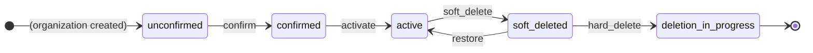

<!-- Design Documents often contain forward-looking statements -->
<!-- vale gitlab.FutureTense = NO -->

## 概要

Organization は 5 つの状態を遷移します: `unconfirmed` → `confirmed` → `active` → `soft_deleted` → `deletion_in_progress`。オーナーは `active` な Organization をソフト削除でき (UI と public API から非表示になる)、復元することができます。`soft_deleted` な Organization のハード削除へのエスカレーションができるのはインスタンス管理者のみで、ハード削除は取り消し不可能です。すべての遷移は `organization_details` の JSONB カラムに監査記録されます。

私たちは [`state_machine` gem](https://github.com/state-machines/state_machines) を使用し、`Gitlab::TenantContainerLifecycle::Stateful` モジュールを介して `Namespaces::Stateful` と低レベルのインフラを共有しています。根拠については [ADR 009](decisions/009_state_machine.md) を参照してください。

## ゴールと非ゴール

ゴール:

- 明示的に許可された遷移を持つ、マシンによって強制されるライフサイクル。
- Organization と一緒に格納される、すべての遷移のイミュータブルな監査証跡。
- オーナー向けには取り消し可能なソフト削除、法務/GDPR フォローアップ向けには管理者ゲート付きのハード削除。
- 重複を避けるための、namespace のステートマシンとのインフラ共有。

非ゴール:

- アーカイブ (namespace の概念)。
- セル間転送。
- 状態の継承 — Organization はルートです。

## ステート図



`deleted` 状態はありません — ハード削除が成功すると行が破棄されます。`unconfirmed` と `confirmed` から `soft_deleted` へのパスはありません: アクティベーションを完了していない Organization は削除できません。

### 状態 {#states}

| 状態 | 整数値 | 意味 |
|-------|:-:|---------|
| `unconfirmed` | 0 | 新しく作成された状態。まだ使用できません。 |
| `soft_deleted` | 1 | UI と public API から非表示。オーナーは復元でき、管理者はハード削除できます。 |
| `deletion_in_progress` | 2 | ハード削除ワーカーが実行中。成功すると行が破棄されます。 |
| `confirmed` | 3 | オーナーが確認済み。バックグラウンドプロビジョニングが実行中。 |
| `active` | 4 | プロビジョニング完了。完全に運用可能。 |

整数値は追加のみ可能で、ライフサイクル順ではなく導入順を反映しています。

### 遷移

| イベント | 元 → 先 | 必須引数 |
|-------|-----------------|--------------------|
| `confirm` | unconfirmed → confirmed | `transition_user`、`confirmed_by_user` |
| `activate` | confirmed → active | — |
| `soft_delete` | active → soft_deleted | `transition_user` |
| `restore` | soft_deleted → active | `transition_user` |
| `hard_delete` | soft_deleted → deletion_in_progress | `transition_user` |

すべての遷移は `update_state_metadata` を介して誰がトリガーしたかを記録します。失敗時には `update_state_metadata_on_failure` が呼ばれ、状態を変更せずに `last_error` を書き込み、構造化ログを出力します。

`soft_delete`、`restore`、`hard_delete` の認可は [サービス層](#service-entry-points) で強制されます。ステートマシンは `transition_user` が指定されていることのみをチェックします。

## データモデル

```sql
organizations
  state  SMALLINT  NOT NULL  DEFAULT 0

organization_details
  soft_deleted_at  TIMESTAMP WITH TIME ZONE
  state_metadata   JSONB  NOT NULL  DEFAULT '{}'
```

`state_metadata` は厳格な JSON Schema (`organization_detail_state_metadata.json`、`additionalProperties: false`) に対して検証されます:

```json
{
  "last_updated_at":         "<datetime>",
  "last_changed_by_user_id": <integer | null>,
  "last_error":              "<string | null>",
  "correlation_id":          "<string | null>",
  "soft_deleted_by_user_id": <integer | null>,
  "restored_at":             "<datetime | null>",
  "restored_by_user_id":     <integer | null>,
  "confirmed_at":            "<datetime | null>",
  "confirmed_by_user_id":    <integer>
}
```

フィールドは `jsonb_accessor` を介して `OrganizationDetail` 上の型付きアクセサとして公開されます。

## 新しい状態や遷移を追加する

ステートマシンの変更は 2 つのリポジトリにまたがります:

1. `gitlab-org/gitlab` 内で、単一の MR にて: `Organizations::Stateful` (state enum、`state_machine` ブロック、ガード、コールバック) **および** 新しい状態がメタデータフィールドを追加する場合は `organization_detail_state_metadata.json`。スキーマとコードは同時にマージする必要があります — そうしないと `additionalProperties: false` によって本番で保存が失敗します。
2. `gitlab-com/content-sites/handbook` (このリポジトリ) 内で: このブループリント — 状態テーブル、遷移テーブル、Future Work テーブル。

2 つの MR をクロスリンクし、同時にマージしてください。

整数値は追加のみ可能 — ライフサイクル位置に関係なく、次の空いている整数を割り当ててください。

## サービスエントリポイント {#service-entry-points}

ユーザー駆動の遷移はすべて、認可、冪等性、監査ログでステートマシンのイベントをラップする専用のサービスを持ちます。それぞれが同じ形に従います:

1. `OrganizationPolicy` を介して認可をチェックします。
2. 現在の状態がイベントの有効な元かどうかを検証します。
3. `transition_user: current_user` でイベントを呼び出します。
4. 遷移が発生しなかった場合、ステートマシンのエラーをサービスレスポンスとして表面化します。
5. 監査ログイベントを発行し、成功した `ServiceResponse` を返します。

| サービス | イベント | 権限 |
|---------|-------|---------|
| `Organizations::SoftDeleteService` | `soft_delete` | `:soft_delete_organization` |
| `Organizations::RestoreService` | `restore` | `:restore_organization` |
| `Organizations::HardDeleteService` | `hard_delete` | `:hard_delete_organization` (管理者のみ) |

注:

- `SoftDeleteService` は Organization が空である (グループもプロジェクトもない) ことを要求します — ソフト削除は非表示にするだけで、可逆です。
- `HardDeleteService` は成功時にバックグラウンドのハード削除ワーカーをエンキューします。ワーカーが行の破棄を実行します。ハード削除は法務/GDPR フォローアップのためのもので、標準の UI には公開されていません。

## エラー処理

遷移が失敗した場合 (ガードが `false` を返した場合):

- `update_state_metadata_on_failure` がエラーを `state_metadata['last_error']` に書き込み、detail レコードを保存します。
- `log_transition_failure` が構造化エラーログを出力します。
- `organizations.state` は失敗時に **絶対に** 変更されません。

ハード削除ワーカーが途中で失敗した場合、Organization は `last_error` が設定された状態で `deletion_in_progress` のままになります。リカバリは、ステートマシンの後方遷移ではなく、冪等なワーカーを再実行することによって行います。必要であれば、専用のリカバリ遷移を後で追加できます。

## 今後の作業

ステートマシンは整備されていますが、サービスと API サーフェスはまだ作業が必要です:

| 遷移 | サービス | GraphQL ミューテーション | REST エンドポイント |
|-----------|---------|-----------------|--------------|
| `confirm` | [#598074](https://gitlab.com/gitlab-org/gitlab/-/work_items/598074) | [#596669](https://gitlab.com/gitlab-org/gitlab/-/work_items/596669) | [#596669](https://gitlab.com/gitlab-org/gitlab/-/work_items/596669) |
| `activate` | [#597856](https://gitlab.com/gitlab-org/gitlab/-/work_items/597856) | N/A (バックグラウンド) | N/A (バックグラウンド) |
| `soft_delete` | [#594308](https://gitlab.com/gitlab-org/gitlab/-/work_items/594308) — リネーム保留 | [#594313](https://gitlab.com/gitlab-org/gitlab/-/work_items/594313) — リネーム保留 | [#599345](https://gitlab.com/gitlab-org/gitlab/-/work_items/599345) — リネーム保留 |
| `restore` | [#599343](https://gitlab.com/gitlab-org/gitlab/-/work_items/599343) | [#599344](https://gitlab.com/gitlab-org/gitlab/-/work_items/599344) | [#599346](https://gitlab.com/gitlab-org/gitlab/-/work_items/599346) |
| `hard_delete` | TBD — 管理者のみ | TBD — 管理者のみ | TBD — 管理者のみ |

「リネーム保留」の行は、もともと `schedule_deletion` / `cancel_deletion` / `start_deletion` を中心に組み立てられていた Issue で、soft-delete / restore / hard-delete の命名に再スコープが必要です。`soft_deleted` な Organization をオーナー以外から隠す Finder の変更は [#594312](https://gitlab.com/gitlab-org/gitlab/-/work_items/594312) で追跡されています。

## Organization Isolation との関係

ライフサイクルと [Isolation](isolation.md) は直交します。ライフサイクルは *「この Organization は運用可能か?」* に答え、isolation は *「データ境界がどのくらい厳格に強制されているか?」* に答えます。これらはステートマシンを共有せず、isolation フラグはソフト削除とは独立に設定できます。

1 つだけ依存関係があります: 最初の isolation ステップ (`isolation_desired`) は Organization が `active` であることを要求します。`unconfirmed` または `confirmed` で isolation をトリガーするのは時期尚早です。

## 未解決の質問

### 並行性とロック

2 人のアクターが同じ Organization を同時に遷移させようとする可能性があります — 例えば、オーナーが復元しようとし、管理者がハード削除しようとする場合などです。現在の方針: `lock_version` での楽観的ロックで十分。すべての遷移は人間が駆動するため、競合はまれであるべきです。実際の競合率が予想より高い場合は、カスタムの悲観的ロックヘルパーを追加するか、悲観的ロックをネイティブにサポートする [AASM](https://github.com/aasm/aasm#pessimistic-locking) に移行することができます。最初のユーザー向けサーフェスがリリースされる前に決定する必要があります。

### `confirmed` 状態の失敗からのリカバリ

`confirm` 後にバックグラウンドプロビジョニングが失敗した場合、Organization は無期限に `confirmed` のままになります — `unconfirmed` に戻るパスも、`failed` 状態に進むパスもありません。冪等なリトライに頼るのか、それともリカバリ遷移が必要なのか? 未定。

### ユーザーが作成する Organization の初期状態

`unconfirmed` は、GitLab が顧客のために Organization をプロビジョニングするケースに適しています。エンドユーザーが自分で Organization を作成するようになると (GA 後)、確認するプロビジョニングステップはありません。2 つのオプション:

- 作成サービス内で `confirm` + `activate` を同期的に実行し、`ConfirmationService` の副作用も実行されるようにします。
- 副作用が必要ない場合は、`unconfirmed → active` への直接遷移を許可するか、ユーザーが作成した行のデフォルトを `active` にします。

選択は、セルフサービスがリリースされる時点で確認に紐付けられている副作用 (もしあれば) が何かによります。[MR スレッド](https://gitlab.com/gitlab-com/content-sites/handbook/-/merge_requests/19693#note_3328588386) を参照してください。

### `soft_deleted` の保持期間

`restore` は無期限に利用可能とすべきか、それとも保持期間後に期限切れにすべき (その後は `hard_delete` のみが正当) か? 無期限が最もシンプルですが、固定期間 (例: 30 日) は以前の遅延削除動作と GDPR の期待に合致します。`restore` が UI 経由でリリースされる前に決定する必要があります。

## 代替ソリューション

ステートマシンをよりシンプルなデータモデルよりも採用する根拠については [ADR 009](decisions/009_state_machine.md) を参照してください。
