この設計では、Organization 固有のログインページをサポートする多段階アプローチを導入するために、
現在の GitLab のログインフローを変更します。

## 現在のログイン体験

### 現在のユーザーのサインイン方法

GitLab は現在、従来型のシングルステップ（または 2FA が設定されている場合は 2 ステップ）の
認証プロセスを使用しています:

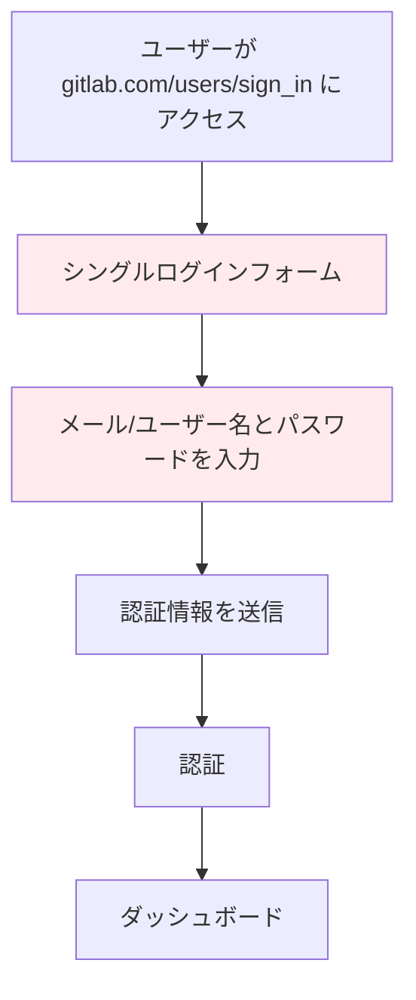

**現在のログインページ:**

```text
┌─────────────────────────────────────┐
│        GitLab Sign In               │
│                                     │
│  [Username/Email Field]             │
│  [Password Field]                   │
│  [Sign in Button]                   │
│                                     │
│  OAuth Options:                     │
│  [Google] [GitHub] [Other IdPs]     │
│                                     │
│  [Remember me] [Forgot password?]   │
└─────────────────────────────────────┘
```

### 現在のアプローチの制限

- すべてのユーザーに対する単一の認証エンドポイント
- 別の Cell の Organization へのサポートの欠如
- Organization 固有のブランディングやポリシーがない
- Organization 固有の認証方法への限定的なサポート
- ユーザーの Organization コンテキストに基づいたルーティングがない

## 新しい多段階認証システム

### 他の実装例

**Google の認証フロー:**

1. ユーザーがメールを入力 → システムがワークスペース/ドメインを特定 → ワークスペース固有の認証

**Slack の認証フロー:**

1. ユーザーがメールを入力 → システムがワークスペースを特定 → ワークスペース固有の認証
2. 代替方法: `company.slack.com` を経由した直接ワークスペースアクセス

**Microsoft の認証フロー:**

1. ユーザーがメールを入力 → システムがテナントを特定 → テナント固有の認証

**新しい GitLab の多段階フロー:**

1. ユーザーがメールを入力 → Topology Service が Organization を特定 → Organization 固有の認証
2. 代替方法: `gitlab.com/o/<org-path>/users/sign_in` を経由した直接 Organization ログインアクセス
3. 後方互換性のために `gitlab.com/users/sign_in` 経由のグローバルサインイン用ユーザー名ベースのログインを維持

### ステップ 1: メールベースのユーザー識別

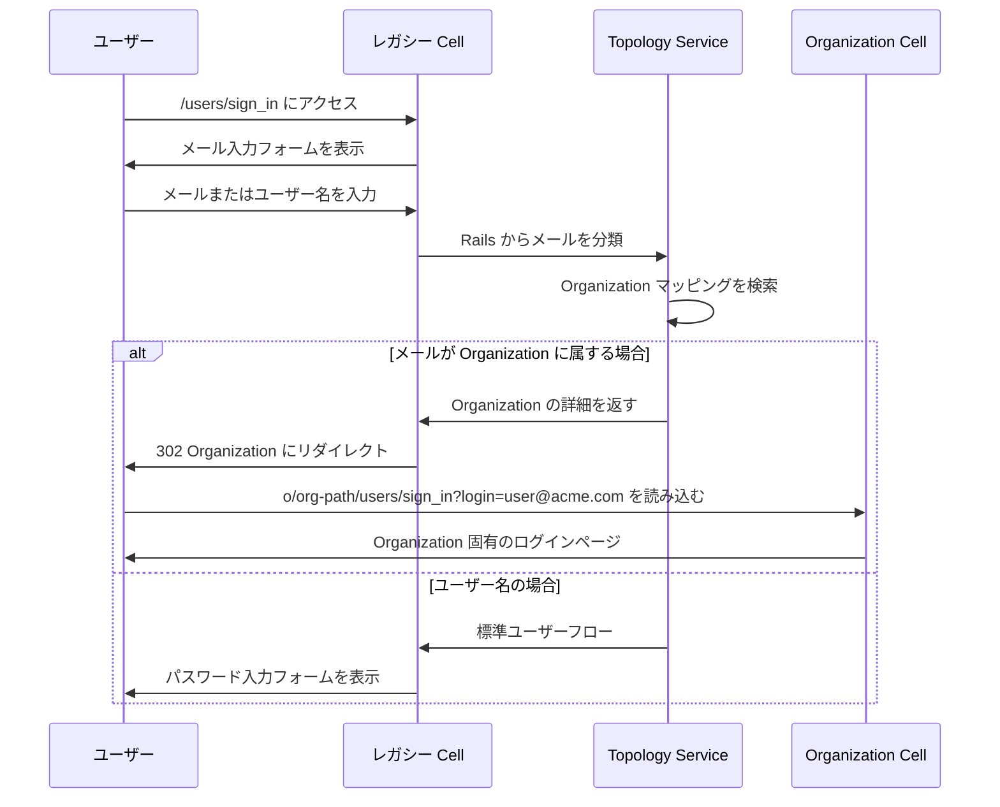

**新しい多段階ページ:**

```text
┌─────────────────────────────────────┐
│        Sign in to GitLab            │
│                                     │
│  [Email/Username Field]             │
│  [Continue Button]                  │
│                                     │
│  OAuth Options:                     │
│  [Google] [GitHub] [Other IdPs]     │
│                                     │
│  "Sign in with your organization"   │
└─────────────────────────────────────┘
```

**後方互換性:**

- **メール入力**: Topology Service 経由でユーザーの Organization にルーティング
- **ユーザー名入力**: レガシー Cell のデフォルト Organization ユーザーに対して引き続き機能
- **直接アクセス**: ユーザーはいつでも `o/<org-path>/users/sign_in` に直接アクセス可能

### ステップ 2: Organization 固有の認証

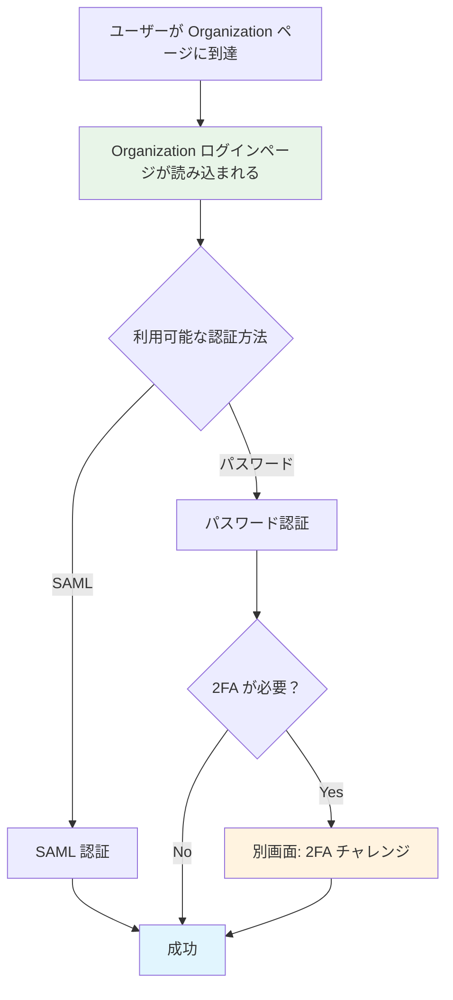

**Organization ログインページ:**

```text
┌─────────────────────────────────────┐
│     [Org Logo] Acme Corporation     │
│                                     │
│  user@acme.com (プリフィル済み)      │
│                                     │
│  ✓ SAML でサインイン                │
│  ┌─────────────────────────────────┐│
│  │ [SAML で続行]                   ││
│  └─────────────────────────────────┘│
│                                     │
│  ✓ パスワード認証                   │
│  ┌─────────────────────────────────┐│
│  │ [Password Field]                ││
│  │ [Sign in Button]                ││
│  └─────────────────────────────────┘│
│                                     │
│  [← メールアドレスを変更]            │
└─────────────────────────────────────┘
```

## メールのユニーク性

### 核となる原則

システムは、**各メールアドレスがすべての GitLab インスタンスと Cell にわたって正確に 1 つの Organization に属する**ことを強制します。

また、特定のメールドメインは 1 つの Organization にのみ属することができ、ユーザーはその Organization に属するメールドメインで別の Organization に登録することはできません。

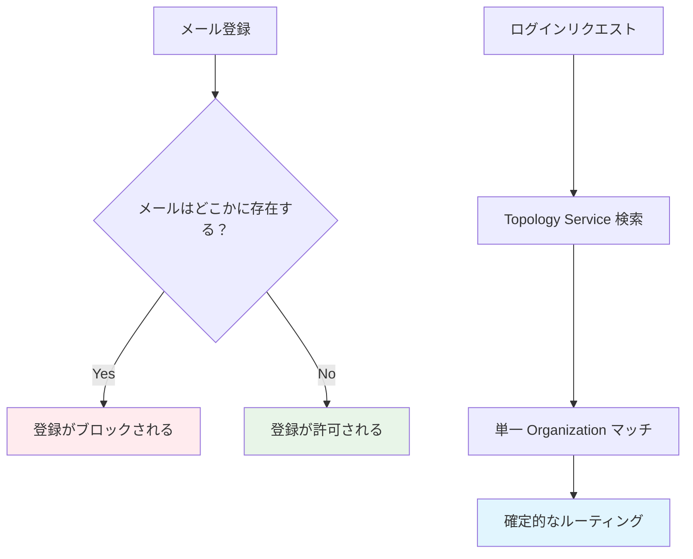

## 代替アクセス方法

### 直接 Organization アクセス

ユーザーは以下に直接アクセスすることでメール識別をバイパスできます:

- `o/<org-path>/users/sign_in` - Organization ログインに直接アクセス
- `o/<org-path>` - Organization ページ（プライベートの場合はログインにリダイレクト）

この場合、Organization ログインページはその特定の Organization へのログインのみに制限されます。

### 業界標準との比較

| 製品 | 主要アクセス | 代替アクセス | カスタムドメイン |
|---------|---------------|------------------|----------------|
| **Google** | メールベース | 直接ワークスペース URL | mail.company.com |
| **Slack** | メールベース | company.slack.com | カスタムドメイン |
| **Microsoft** | メールベース | テナント URL | カスタムドメイン |
| **GitLab** | メールベース | `o/org-path/users/sign_in` | 将来的なオプション |

### 将来: カスタムエイリアスドメイン

Gmail のエイリアスドメインと同様に、Organization は `gitlab.company.com` を設定できるようになります。

`gitlab.company.com` を Organization ページ（`gitlab.com/o/org-path`）にルーティングし、
Organization がパブリックかプライベートかに応じて、Organization ダッシュボードまたは Organization ブランドのログインページを表示します。

## ブラウザパスのワークフロー

### ワークフロー 1: メールを使用した Organization ユーザー

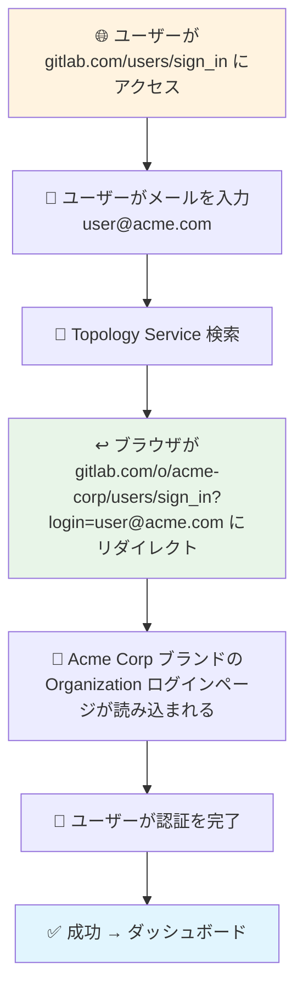

### ワークフロー 2: ユーザー名を使用したレガシーユーザー

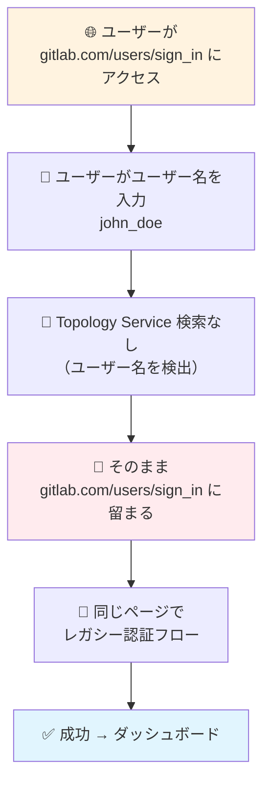

### ワークフロー 3: 直接 Organization アクセス

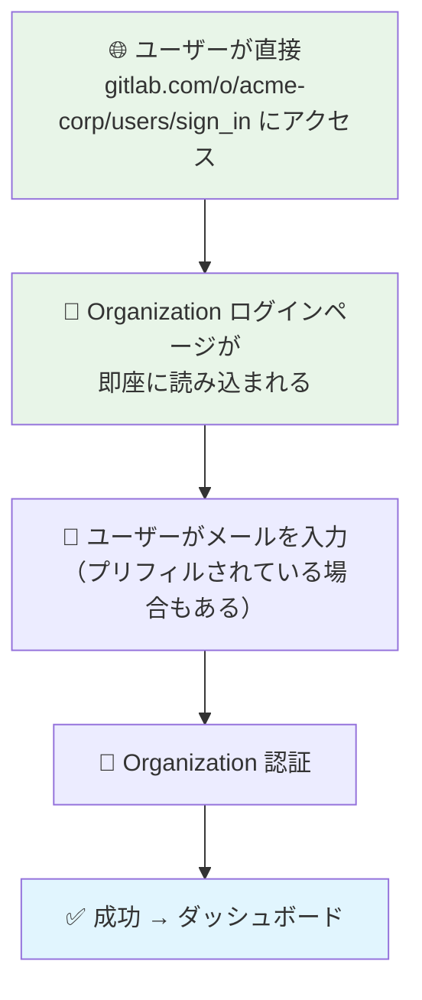

### ワークフロー 4: エンタープライズドメインのサインアップ

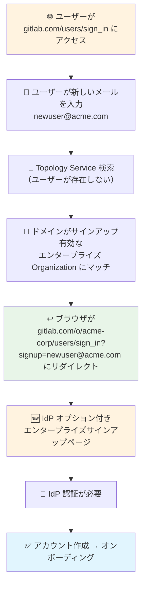

### ワークフロー 5: パブリックとプライベート Organization アクセス

#### パブリック Organization

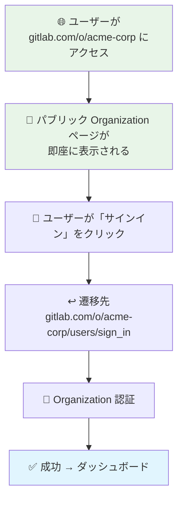

#### プライベート Organization

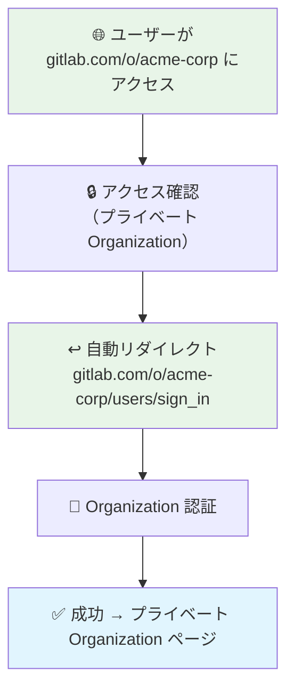

## 認証シナリオ

### URL パラメータのパターン

**Organization ユーザーのリダイレクト:**

- 変換前: `gitlab.com/users/sign_in`
- 変換後: `gitlab.com/o/acme-corp/users/sign_in?login=user@acme.com`

**エンタープライズサインアップのリダイレクト:**

- 変換前: `gitlab.com/users/sign_in`
- 変換後: `gitlab.com/o/acme-corp/users/sign_in?signup=newuser@acme.com`

**プライベート Organization アクセス:**

- 変換前: `gitlab.com/o/acme-corp`
- 変換後: `gitlab.com/o/acme-corp/users/sign_in`

### シナリオ 1: SAML 専用 Organization

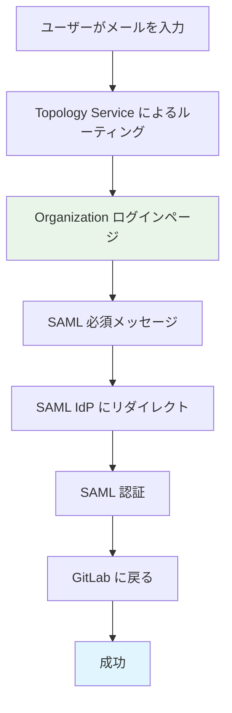

**ブラウザパス:**

1. `gitlab.com/users/sign_in` → ユーザーがメールを入力
2. `gitlab.com/o/org-path/users/sign_in?login=email` → Organization ページ
3. `idp.company.com/saml/sso` → SAML 認証
4. `gitlab.com/groups/my-group/-/saml/callback` → SAML から戻る（既存のコールバックを維持）
5. `gitlab.com/dashboard` → 成功

アプリケーションは Organization で設定されたすべての SAML アプリケーションのボタンを表示します。

### シナリオ 2: 複数の認証方法

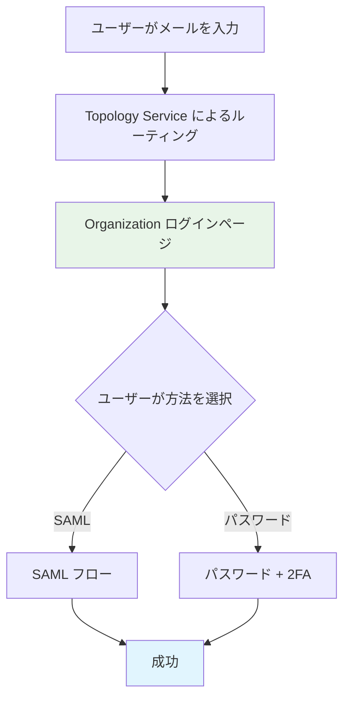

**ブラウザパス:**

*SAML パス:*

1. `gitlab.com/users/sign_in` → ユーザーがメールを入力
2. `gitlab.com/o/org-path/users/sign_in?login=email` → Organization ページ
3. `idp.company.com/saml/sso` → SAML 認証
4. `gitlab.com/groups/my-group/-/saml/callback` → 戻る（既存のコールバックを維持）
5. `gitlab.com/dashboard` → 成功

*パスワードパス（多段階）:*

1. `gitlab.com/users/sign_in` → ユーザーがメールを入力
2. `gitlab.com/o/org-path/users/sign_in?login=email` → Organization ページ
3. `gitlab.com/o/org-path/users/sign_in` → パスワード入力
4. `gitlab.com/dashboard` → 成功

*2FA ありパスワードパス（追加ステップ）:*

1. `gitlab.com/users/sign_in` → ユーザーがメールを入力
2. `gitlab.com/o/org-path/users/sign_in?login=email` → Organization ページ
3. `gitlab.com/o/org-path/users/sign_in` → パスワード入力
4. `gitlab.com/o/org-path/users/sign_in` → 2FA チャレンジ（別画面）
5. `gitlab.com/dashboard` → 成功

### シナリオ 3: エンタープライズドメインのサインアップ

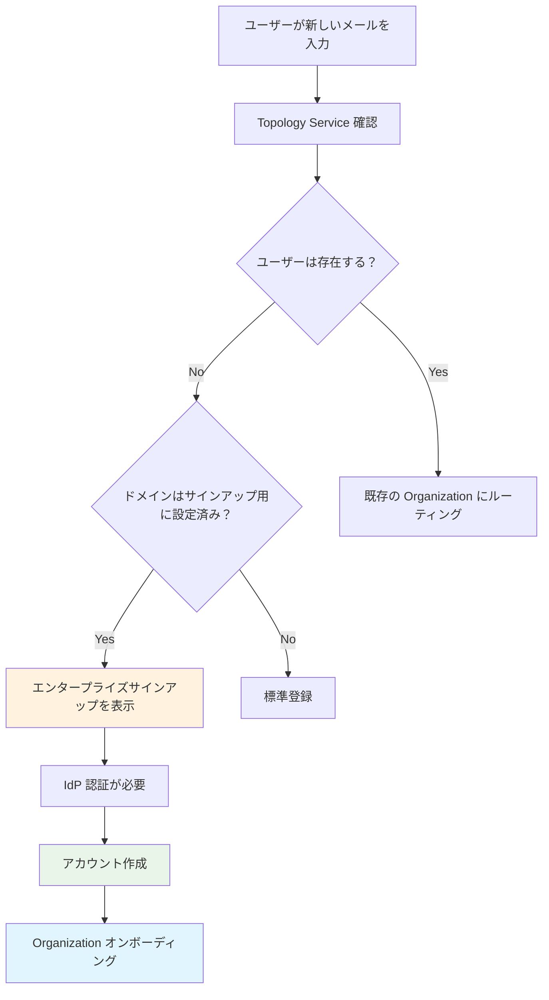

**エンタープライズサインアップのブラウザパス:**

1. `gitlab.com/users/sign_in` → ユーザーが新しいメールを入力
2. `gitlab.com/o/org-path/users/sign_up?login=newemail@company.com` → サインアップページ
3. `idp.company.com/oauth/authorize` → IdP 認証
4. `gitlab.com/oauth/callback` → アカウント作成（既存のコールバックを維持）
5. `gitlab.com/o/org-path` → Organization オンボーディング
6. `gitlab.com/dashboard` → 成功

**既存ユーザーのブラウザパス:**

1. `gitlab.com/users/sign_in` → ユーザーが既存のメールを入力
2. `gitlab.com/o/org-path/users/sign_in?login=user@company.com` → 通常のログイン
3. 通常の認証フローを継続

## コールバックパスの後方互換性

### OAuth コールバック

**現在の動作:** OAuth コールバックは `gitlab.com/oauth/callback` などの既存パスを使用

**将来の状態:** この設計では、破壊的変更を避けるために既存の OAuth コールバックパスを維持します。ユーザーはコールバック処理後に Organization のメンバーシップに基づいて適切にルーティングされます。

### SAML アプリケーション

**現在の動作:** SAML コールバックはグループスコープのパス `gitlab.com/groups/my-group/-/saml/callback` を使用

**後方互換性:** 既存の SAML コールバックパスは今日と全く同じように機能し続けます。

**将来の拡張:** システムはコールバックを適切なコンテキストにスコープします:

- グループレベルの SAML: `gitlab.com/groups/my-group/-/saml/callback`（変更なし）
- Organization レベルの SAML: `gitlab.com/o/org-path/-/saml/callback`（将来の拡張）

これにより、既存のインテグレーションとの完全な後方互換性を維持しながら、SAML 設定が定義された場所に対してコールバックが文脈的に適切であり続けることが保証されます。

アプリケーションは Organization で設定されたすべての SAML アプリケーションのボタンを表示します:

- Organization スコープの SAML アプリケーション（設定されている場合）。
- 複数の SAML アプリケーションを持つ複数のトップレベルグループを持つ Organization。

## 技術実装

- **レガシー Cell が提供:** 初期の `/users/sign_in` ページ
- **Rails インテグレーション:** レガシー Cell が Topology Service を呼び出す
- **シームレスなルーティング:** ユーザーはどの Cell が最初のページを提供するかを意識しない
- **ユーザー名の後方互換性:** ユーザー名入力はレガシー Cell のデフォルト Organization ユーザーに対して引き続き機能
- **Organization アクセス:** ユーザーは直接 Organization ログイン用に常に `o/<org-path>/users/sign_in` にアクセス可能
- **コールバック保持:** すべての既存の OAuth および SAML コールバックパスは変更されない

## メリット

### ユーザー体験

- **親しみやすいパターン:** Google、Slack、Microsoft の多段階ワークフローに合致
- **Organization ブランディング:** ブランド化されたログイン体験
- **柔軟な認証:** Organization 固有の認証方法

### 技術的メリット

- **クリーンなアーキテクチャ:** Organization 間の明確な分離
- **スケーラブルな設計:** 分散 Cell アーキテクチャをサポート
- **ステートレスなルーティング:** シンプルで信頼性の高いユーザー分類
- **破壊的変更なし:** 既存のコールバックパスとインテグレーションを維持

### セキュリティ上のメリット

- **確定的なルーティング:** 認証の曖昧さがない
- **セキュアなデフォルト:** Organization 固有のセキュリティポリシー
- **クリーンなトークン管理:** 複雑なクロス Cell トークン共有なし（例: CSRF）
- **スコープされたコールバック:** 将来のコールバックスコーピングが設定コンテキストと一致

## 追加ノートと備考

### 認証方法のカバレッジ

- **2FA の定義:** このドキュメントでは、「2FA」には TOTP、ハードウェアキー、パスキー、その他の多要素認証オプションなどのさまざまな方法が含まれます。
- **OAuth フロー:** OAuth 認証フローはこのドキュメントのスコープ外であり、後日定義される予定です。

### 技術的な考慮事項

- **コールバックパス:** すべての既存の OAuth および SAML コールバックパスは後方互換性を維持するために保持されます。
- **ユーザー体験:** 2FA チャレンジはパスワード認証成功後に別画面として表示されます。
- **Organization ルーティング:** Topology Service はメールまたはドメインマッピングに基づく確定的なルーティングを提供します。

### 将来の拡張

- GitLab が OAuth フローで SP として使用される場合の動作を定義する
- GitLab が OAuth フローで IdP として使用される場合の動作を定義する
- SAML の動作を検証する
