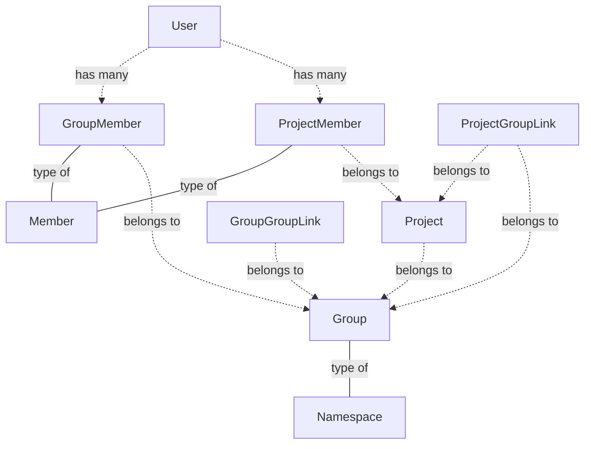
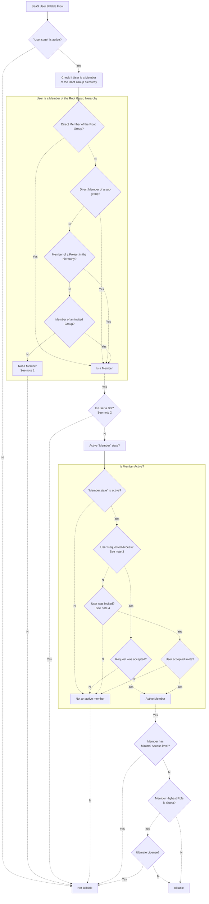
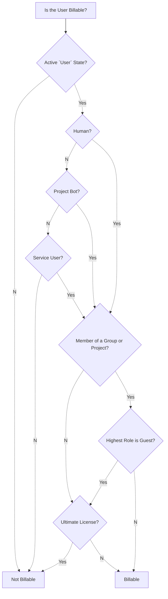

GitLab は設立当初から、シングルサーバー・グローバルユーザーアーキテクチャを採用してきました。GitLab.com のスケーリングの懸念とプラットフォーム間の製品機能セットの分化により、このモデルはもはや十分ではありません。これらの制限が、マルチ Cell・マルチテナントアーキテクチャという新時代への進化を促しています。私たちは現在、予測可能な顧客体験を維持しながら、現在のアーキテクチャと目指すアーキテクチャのギャップを埋めるという課題に直面しています。

以前のアーキテクチャは、単一のデータベース内の単一の Users テーブルを持つ単一の GitLab インスタンスを前提とし、すべてのトラフィックがこの 1 つのインスタンスにルーティングされていました。ユーザーはプライベートグループやプロジェクトによってセグメント化できましたが、ユーザーは常にグローバルなユーザープールの一部と見なされていました。

最終的な目的地では、複数の GitLab インスタンスが存在し、それぞれが Users テーブルを持ち、必要に応じてインスタンス間でトラフィックがルーティングされます。ユーザーは Organization によって完全に管理され、ユーザーが他の Organization にアクセスすることを防いだり、ユーザーアカウントを完全に削除したりする機能を持つことができます。レガシーユーザーは影響を受けず、新しいアーキテクチャに移行するオプションが提供されます。

## ユーザーのホーム Organization

ユーザーはホーム Organization として知られる 1 つの Organization に所属します。この Organization はユーザーに対して完全な権限を持ちます。

既存のユーザーは GitLab が管理するデフォルト Organization に所属します。私たちはユーザーがデフォルト Organization から移行して独自の Organization に入れるようにするマイグレーションパスを開発しています。

ユーザーが 1 つの Organization に所属するようになったため、`users` テーブルには `NOT NULL` の `organization_id` カラムが設けられます。この `organization_id` カラムは `users` テーブルをシャードするためにも使用され、ユーザーとその関連データ（`user_statistics` など）も Organization にスコープされます。

ユーザーはホーム Organization にのみアクセスできます。GitLab.com 上の GitLab チームメンバーの場合、複数の Organization にアクセスできる機能を有効にします（以下の[ドッグフーディング](#dog-fooding)セクションを参照）。最終的には、すべてのユーザーが OAuth のような認証メカニズムを通じて他の Organization と対話できるようになることが提案されています。

## ユーザー名

最終的な目標は Organization スコープのユーザーレコードであり、ユーザー名はグローバルではなく Organization 内でのみユニークであれば良くなります。これにより、Organization がユーザー名前空間の完全な制御を持ち、異なる Organization 間でユーザー名の再利用が可能になります。この状態の実現は、時間をかけてイテレーション的に行われます。

## 個人ネームスペース

ユーザーはホーム Organization 内に 1 つの個人ネームスペースを持ちます。個人ネームスペースは、そのネームスペースを所有するユーザーであっても、関連するホーム Organization の外からはアクセスできません。

## ドッグフーディング

ドッグフーディングのために、同じ Cell 内の複数の Organization にユーザーが存在することを可能にする対応を行います。ユーザーは `users.organization_id` を通じてまだ単一の Organization に所属しますが、複数の `organization_users` エントリを持ちます。これにより、GitLab チームが新しい Isolated Organization を作成しやすくなります。ただし、このタイプのドッグフード Organization は、デフォルト Organization と同じ Cell（レガシー Cell）にのみ存在できるという注意点があります。

ドッグフーディングでは、すべてのリクエストに Organization コンテキストが提供されることが保証され、チームがそれに応じて機能をスコープし始めることができます。

## グローバルボットユーザー

ユーザーが Organization に所属するようになったため、`@support-bot` や `@GitLabDuo` などのグローバルボットユーザーは Organization ごとに作成されます。Organization 全体でボットを複製すると、ユーザー名の衝突という問題が生じます。

この問題を解決するために、Organization ごとのボット ID の概念を導入し、`organization_user_details` テーブルを追加します。具体的には、Organization 内でユニークな `username` カラムを追加します。この `organization_user_details.username` は事実上、`users.username` に対するユーザー名エイリアスとなります。

## Organization メンバーシップ

ユーザーは以下の方法で Organization のメンバーになることができます:

- Organization オーナーがユーザーに代わってアカウントを作成し、そのユーザーと共有する。

Organization メンバーは、以下として Organization 内のグループとプロジェクトにアクセスできます:

- グループメンバー: グループとそのすべてのプロジェクトへのアクセスを付与します（公開設定に関わらず）。
- プロジェクトメンバー: プロジェクトへのアクセスと、公開設定に関わらず親グループへの限定的なアクセスを付与します。
- 非メンバー: その Organization のパブリックおよびインターナルなグループとプロジェクトへのアクセスを付与します。Organization 内のプライベートグループまたはプロジェクトにアクセスするには、ユーザーはメンバーになる必要があります。インターナル公開設定は最初は Organization に対して利用できません。

Organization メンバーは以下の方法で管理できます:

- [エンタープライズユーザー](https://docs.gitlab.com/ee/user/enterprise_user/index.html)として、Organization によって管理される。これにはユーザーアカウントの制御とユーザーをブロックする機能が含まれます。Protocells のコンテキストでは、Organization メンバーは本質的にエンタープライズユーザーとして機能します。
- 非エンタープライズユーザーとして、デフォルト Organization によって管理される。非エンタープライズユーザーは Organization から削除できますが、ユーザーはユーザーアカウントの所有権を保持します。これは Protocells 後にのみ考慮されます。

エンタープライズユーザーは Premium または Ultimate サブスクリプションを持つ Organization のみが利用できます。フリーティアの Organization は非エンタープライズユーザーのみをホストできます。

## ユーザーはどのようにして Organization に参加するのか？

ユーザーはすべての Organization にわたって表示されます。これにより、ユーザーは Organization 間を移動できます。ユーザーは以下の方法で Organization に参加できます:

1. Organization オーナーにアカウントを作成するよう招待される。

1. Organization 内に含まれるネームスペース（グループ、サブグループ、またはプロジェクト）のメンバーになる。ユーザーは以下の方法でネームスペースのメンバーになれます:

   - ユーザー名で招待される
   - メールアドレスで招待される
   - アクセスをリクエストする。これは Organization とネームスペースの公開設定が必要で、ネームスペースのオーナーによって承認される必要があります。プライベートグループやプロジェクトへのアクセスはリクエストできません。

1. Organization のエンタープライズユーザーになる。エンタープライズユーザーを Organization レベルに移行することは MVC 後に計画されています。Organization MVC では、エンタープライズユーザーはトップレベルグループに留まります。

Organization の作成者は自動的に Organization オーナーになります。例えば、すべての公開 Issue にコメントしたり作成したりするために、特定の Organization のユーザーになる必要はありません。既存のすべてのユーザーはすべての公開 Issue を作成したりコメントしたりできます。

## ユーザーはどのようにして Organization にサインインするのか？

TBD

## ユーザーはいつ Organization を見ることができるのか？

Organization の公開設定の詳細については、[公開設定](index.md#visibility) を参照してください。

## ユーザーは Organization 内で何を見ることができるのか？

ユーザーは Organization 内でアクセス権を持つものを見ることができます。例えば、Organization メンバーはメンバーであるプライベートグループとプロジェクトにのみアクセスできますが、すべてのパブリックグループとプロジェクトを見ることができます。Issue、マージリクエスト、To-do リストなどのアクション可能なアイテムは Organization のコンテキストで表示されます。これは、ユーザーが `Organization A` で 10 件の作成したマージリクエストと `Organization B` で 7 件の作成したマージリクエストを見ることができますが、合計では両方の Organization にわたって 17 件のマージリクエストを作成したことになることを意味します。

## 課金対象メンバーとは何か？

課金対象メンバーの定義は GitLab の 2 つの主要なオファリング間で異なります:

- セルフマネージド（SM）: [課金対象メンバーは SM ライセンスに対してシートを消費するユーザーです](https://docs.gitlab.com/ee/subscriptions/self_managed/index.html#subscription-seats)。ゲストロール以上に昇格されたカスタムロールはシートを消費します。
- GitLab.com（SaaS）: [課金対象メンバーはトップレベルグループの SaaS サブスクリプションに対してシートを消費する名前空間（グループまたはプロジェクト）のメンバーであるユーザーです](https://docs.gitlab.com/ee/subscriptions/gitlab_com/index.html#how-seat-usage-is-determined)。現在、[最小アクセス権を持つユーザー](https://docs.gitlab.com/ee/user/permissions.html#users-with-minimal-access) とグループのないユーザーはライセンスシートにカウントされますが、[それは変わりつつあります](https://gitlab.com/gitlab-org/gitlab/-/issues/330663#note_1133361094)。

これらの違いとその計算・表示方法は混乱を招くことがよくあります。SM と SaaS の両方において、ユーザーがシートを消費するかどうかを同じコアルールセットで評価します:

1. アクティブユーザーである
1. ボットユーザーでない
1. Ultimate ティアの場合、ゲストでない

（1）については、アクティブとは何かという点と、参照する基盤モデル（ユーザー vs メンバー）の違いにより、オファリングごとに異なる方法で判断されます。GitLab の課金対象メンバーに関する様々な関連を示すために、以下の関係図を用意しています:

GroupGroupLink は 2 つのグループレコード間の結合テーブルであり、一方のグループが他方を招待していることを示します。ProjectGroupLink はグループとプロジェクト間の結合テーブルであり、グループがプロジェクトに招待されていることを示します。

SaaS では、ユーザーが課金対象メンバーとみなされるかどうかを判断する関係が追加の複雑さを持ち、特にグループ/プロジェクトのメンバーシップに関連するもので混乱を招くことがあります。例として、別のグループやプロジェクトに招待されたグループのメンバーが課金対象になる場合があります。

フローはそれぞれ異なるため、2 つのチャートがあります:

- [SaaS チャート](#saas-chart)
- [SM チャート](#sm-chart)

（これらのチャートは長さの関係でページの下部に配置されています。）

## ユーザーはどのようにして異なる Organization を切り替えるのか？

Cells のコンテキストの Organization では、ユーザーは 1 つの Organization のみに所属できます。ユーザーが複数の Organization に参加したい場合、新しいユーザーアカウントで追加の Organization に参加する必要があります。

後ほど、Cells 1.5 のコンテキストで、ユーザーは[コンテキストスイッチャー](https://gitlab.com/gitlab-org/gitlab/-/issues/411637)を使用できるようになります。この機能により、異なる Organization のコンテンツと設定への簡単なナビゲーションとアクセスが可能になります。コンテキストスイッチャーをクリックして提供されたリストから特定の Organization を選択することで、ユーザーは表示と権限をシームレスに切り替えられ、選択した Organization のリソースと機能を操作できるようになります。

## ユーザーが削除された場合どうなるのか？

ユーザーが Organization から削除される場合の 3 つの異なるシナリオを特定しました:

1. 削除: ユーザーが organization_users テーブルから削除されます。これはユーザーが会社を離れることに似ていますが、アクセス承認後に再び Organization に参加できます。
1. バン: ユーザーがバンされます。これは不正行為の場合に起こりますが、バンが解除されるまでユーザーは Organization に再追加できません。この場合、organization_users エントリを保持し、権限を none に変更します。
1. アカウント削除: ユーザーが削除されます。ユーザーが作成したすべてのものをゴーストユーザーに割り当て、organization_users テーブルからエントリを削除します。

Organization MVC の一環として、Organization オーナーは Organization メンバーを削除できます。これは、ユーザーのメンバーシップエントリが Organization 内に含まれるすべてのグループとプロジェクトから削除されることを意味します。さらに、ユーザーエントリが `organization_users` テーブルから削除されます。

ユーザーのバンや削除などのアクションは、後で Organization に追加されます。

## Organization 非ユーザー

非ユーザーは Organization の外部にあり、パブリックプロジェクトなど Organization のパブリックリソースにのみアクセスできます。

## SaaS チャート

## SM チャート

