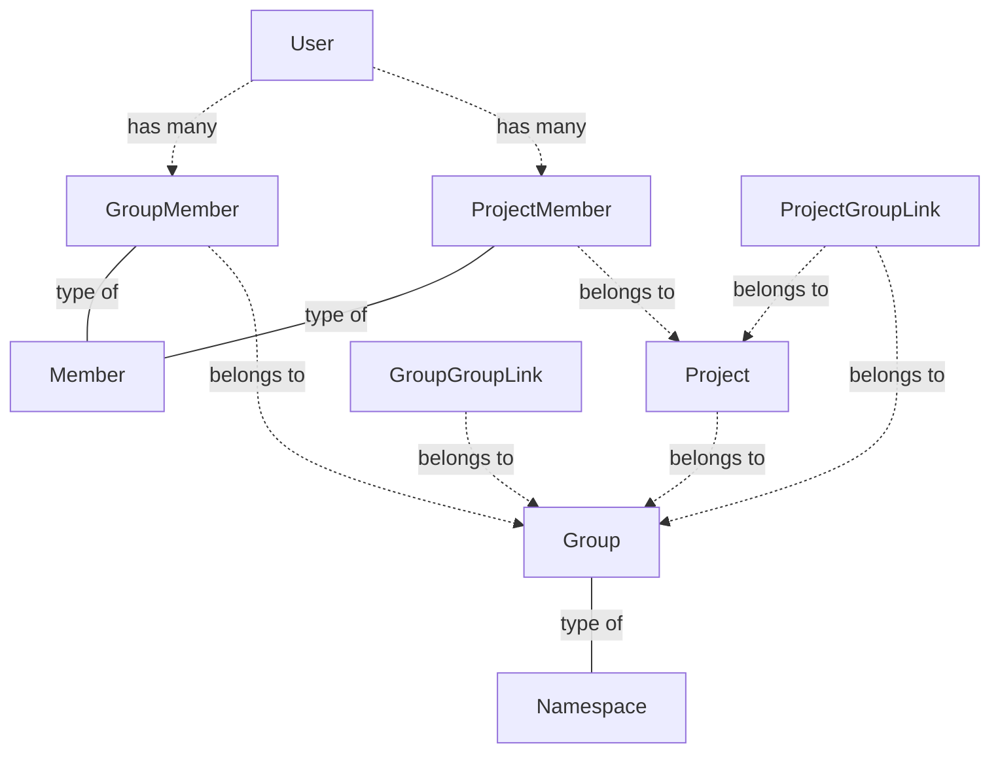
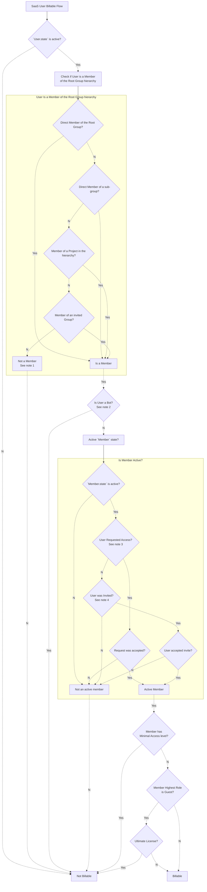
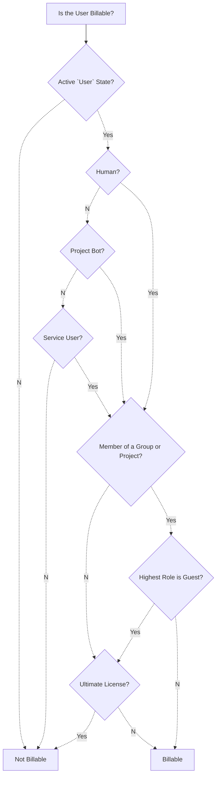

GitLab は設立当初から、シングルサーバー・グローバルユーザーアーキテクチャを採用してきました。GitLab.com のスケーリングの懸念とプラットフォーム間の製品機能セットの分化により、このモデルはもはや十分ではありません。これらの制限が、マルチ Cell・マルチテナントアーキテクチャという新時代への進化を促しています。私たちは現在、予測可能な顧客体験を維持しながら、現在のアーキテクチャと目指すアーキテクチャのギャップを埋めるという課題に直面しています。

以前のアーキテクチャは、単一のデータベース内の単一の Users テーブルを持つ単一の GitLab インスタンスを前提とし、すべてのトラフィックがこの 1 つのインスタンスにルーティングされていました。ユーザーはプライベートグループやプロジェクトによってセグメント化できましたが、ユーザーは常にグローバルなユーザープールの一部と見なされていました。

最終的な目的地では、複数の GitLab インスタンスが存在し、それぞれが Users テーブルを持ち、必要に応じてインスタンス間でトラフィックがルーティングされます。ユーザーは Organization によって完全に管理され、ユーザーが他の Organization にアクセスすることを防いだり、ユーザーアカウントを完全に削除したりする機能を持つことができます。レガシーユーザーは影響を受けず、新しいアーキテクチャに移行するオプションが提供されます。

## ユーザーのホーム Organization {#the-users-home-organization}

User のホーム Organization は、`User.organization_id` に記録された Organization です。このフィールドは必須で、Cells の `users` テーブルをシャードするためにも使用されます。すべての User の ID は常に 1 つの Organization に関連付けられます。つまり、所有権は常に排他的です。メンバーシップもその Organization に限定されるかどうかは、その Organization が隔離されているかによって決まります。非隔離 Organization ではメンバーシップは排他的になりません。User は同じアカウントで、任意の数の他の非隔離 Organization のメンバーにもなれ、User コンテキストはそれらすべてを横断して集約します。隔離 Organization ではメンバーシップが排他的になります。`organization_id` はその Organization に再割り当てされ、User の ID はその Organization の外部には存在しません。モデル全体については[リクエストコンテキスト](contexts.md)を、.com にとっての意味を含め、このフィールドのエンコード方法については [ADR 016](decisions/016_user_context.md)を参照してください。

既存のユーザーは GitLab が管理するデフォルト Organization に所属します。私たちはユーザーがデフォルト Organization から移行して独自の Organization に入れるようにするマイグレーションパスを開発しています。

`organization_id` は必須で null になることがないため、常に `users` テーブルを 1 つの Organization にシャードします。その Organization が排他的な境界として機能するのは隔離された後です。その時点で、User と `user_statistics` などの関連データは、実際にその Organization 内に限定されます。

## ユーザー名

最終的な目標は Organization スコープのユーザーレコードであり、ユーザー名はグローバルではなく Organization 内でのみユニークであれば良くなります。これにより、Organization がユーザー名前空間の完全な制御を持ち、異なる Organization 間でユーザー名の再利用が可能になります。この状態の実現は、時間をかけてイテレーション的に行われます。

## 個人ネームスペース

ユーザーはホーム Organization 内に 1 つの個人ネームスペースを持ちます。個人ネームスペースは、そのネームスペースを所有するユーザーであっても、関連するホーム Organization の外からはアクセスできません。

## グローバルボットユーザー

ユーザーが Organization に所属するようになったため、`@support-bot` や `@GitLabDuo` などのグローバルボットユーザーは Organization ごとに作成されます。Organization 全体でボットを複製すると、ユーザー名の衝突という問題が生じます。

この問題を解決するために、Organization ごとのボット ID の概念を導入し、`organization_user_details` テーブルを追加します。具体的には、Organization 内でユニークな `username` カラムを追加します。この `organization_user_details.username` は事実上、`users.username` に対するユーザー名エイリアスとなります。

## Organization メンバーシップ {#organization-membership}

Organization Owners は以下を制御します。

- どのユーザーを Organization のメンバーとして追加するか。
  非隔離 Organization では、デフォルトでこれを Group Owners と Project Owners に委任します。
  Organization Owners はこの委任を取り消せます。
- 追加されたユーザーがシートを消費するかどうか。
- 1 回の操作で行う、Organization からのユーザーの削除。

`organization_users` は、Organization 内のユーザーの完全なリストであり、
Organization メンバーシップの唯一の情報源です。
グループおよびプロジェクトの `members` は別のリストです。
`organization_users` は追加のアクセスチェックです。グループまたは
プロジェクトのメンバーシップを持っていても、`organization_users` に行がないユーザーは、
現在のブロックされたユーザーと同様に、そのメンバーシップによるアクセス権を得られません。
そのユーザーのアクセス権は、公開グループやプロジェクトへのアクセスなど、
[メンバーではないユーザー](#organization-non-users)のものに戻ります。

シート管理は、課金対象メンバーとは別の新機能です。
`organization_users` のカラム、またはこれを参照するテーブルとして構築する必要があります。

ユーザーはすべての Organization にわたって表示されます。これにより、ユーザーは
Organization 間を移動できます。ユーザーは以下の方法で Organization に参加できます。

1. Organization Owners がユーザーに代わってアカウントを作成し、
   そのユーザーに共有する。

1. Organization Owners が既存のユーザーを Organization に追加する。

1. Organization 内のネームスペース（グループ、サブグループ、またはプロジェクト）のメンバーになる。
   ただし、Organization Owner がこの委任を取り消している場合や、
   Organization が隔離されている場合を除きます。ユーザーは以下の方法で
   ネームスペースのメンバーになれます。

   - ユーザー名で招待される
   - メールアドレスで招待される
   - アクセスをリクエストする。これには Organization とネームスペースが見えることが必要で、
     ネームスペースのオーナーによる承認が必要です。プライベートなグループや
     プロジェクトへのアクセスはリクエストできません。

1. Organization の Enterprise User になる。Enterprise Users を
   Organization レベルに移行することは MVC 後に計画されています。Organization MVC では、
   Enterprise Users はトップレベルグループに留まります。

非隔離 Organization では、デフォルトで、ネームスペースのメンバーになると
そのユーザーは Organization にも追加されます。そのため Group Owners と Project Owners は、
招待を通じて誰を追加するかを決めます。Organization Owner がこの委任を取り消した場合、
ネームスペースのメンバーになっても Organization には追加されません。
隔離 Organization では、より厳格な制御が求められ、
自動的な追加は行わない想定です。

Organization の作成者は自動的に Organization Owner になります。
たとえば、公開 Issue にコメントしたり、公開 Issue を作成したりするために、
特定の Organization のユーザーになる必要はありません。既存のすべてのユーザーは、
すべての公開 Issue を作成したりコメントしたりできます。

Organization メンバーは、以下のように Organization 内のグループとプロジェクトにアクセスできます。
グループおよびプロジェクトのメンバーとしてのアクセス権は、
`organization_users` にも含まれているユーザーにのみ適用されます。

- グループメンバー：公開設定にかかわらず、グループとそのすべてのプロジェクトへの
  アクセス権を付与します。
- プロジェクトメンバー：公開設定にかかわらず、プロジェクトへのアクセス権と、
  親グループへの限定的なアクセス権を付与します。
- グループ/プロジェクトのメンバーシップを持たない Organization メンバー：その Organization の
  パブリックおよびインターナルなグループとプロジェクトへのアクセス権を付与します。
  Organization 内のプライベートなグループまたはプロジェクトにアクセスするには、
  ユーザーはメンバーになる必要があります。インターナル公開設定は、
  当初は Organization では利用できません。

## ユーザーはどのようにして Organization にサインインするのか？

TBD

## ユーザーはいつ Organization を見ることができるのか？

Organization の公開設定の詳細については、[公開設定](_index.md#visibility) を参照してください。

## ユーザーは Organization 内で何を見ることができるのか？

ユーザーは Organization 内でアクセス権を持つものを見ることができます。例えば、Organization メンバーはメンバーであるプライベートグループとプロジェクトにのみアクセスできますが、すべてのパブリックグループとプロジェクトを見ることができます。Issue、マージリクエスト、To-do リストなどのアクション可能なアイテムは Organization のコンテキストで表示されます。これは、ユーザーが `Organization A` で 10 件の作成したマージリクエストと `Organization B` で 7 件の作成したマージリクエストを見ることができますが、合計では両方の Organization にわたって 17 件のマージリクエストを作成したことになることを意味します。

## 課金対象メンバーとは何か？

課金対象メンバーの定義は GitLab の 2 つの主要なオファリング間で異なります:

- セルフマネージド（SM）: [課金対象メンバーは SM ライセンスに対してシートを消費するユーザーです](https://docs.gitlab.com/ee/subscriptions/self_managed/index.html#subscription-seats)。Guest ロールを超える権限を持つカスタムロールはシートを消費します。
- GitLab.com（SaaS）: [課金対象メンバーはトップレベルグループの SaaS サブスクリプションに対してシートを消費する名前空間（グループまたはプロジェクト）のメンバーであるユーザーです](https://docs.gitlab.com/ee/subscriptions/gitlab_com/index.html#how-seat-usage-is-determined)。現在、[最小アクセス権を持つユーザー](https://docs.gitlab.com/ee/user/permissions.html#users-with-minimal-access) とグループのないユーザーはライセンスシートにカウントされますが、[それは変わりつつあります](https://gitlab.com/gitlab-org/gitlab/-/issues/330663#note_1133361094)。

これらの違いとその計算・表示方法は混乱を招くことがよくあります。SM と SaaS の両方において、ユーザーがシートを消費するかどうかを同じコアルールセットで評価します:

1. アクティブユーザーである
1. ボットユーザーでない
1. Ultimate ティアの場合、ゲストでない

（1）については、アクティブとは何かという点と、参照する基盤モデル（ユーザー vs メンバー）の違いにより、オファリングごとに異なる方法で判断されます。GitLab の課金対象メンバーに関する様々な関連を示すために、以下の関係図を用意しています:

```mermaid
graph TD
    User
    GroupMember
    ProjectMember
    Member
    Group
    Project
    ProjectGroupLink
    GroupGroupLink
    Namespace

    User -.->|has many| GroupMember
    User -.->|has many| ProjectMember

    GroupMember ---|type of| Member
    GroupMember -.->|belongs to| Group

    ProjectMember ---|type of| Member
    ProjectMember -.->|belongs to| Project

    ProjectGroupLink -.->|belongs to| Project
    ProjectGroupLink -.->|belongs to| Group

    GroupGroupLink -.->|belongs to| Group

    Project -.->|belongs to| Group

    Group ---|type of| Namespace
```

GroupGroupLink は 2 つのグループレコード間の結合テーブルであり、一方のグループが他方を招待していることを示します。ProjectGroupLink はグループとプロジェクト間の結合テーブルであり、グループがプロジェクトに招待されていることを示します。

SaaS では、ユーザーが課金対象メンバーとみなされるかどうかを判断する関係が追加の複雑さを持ち、特にグループ/プロジェクトのメンバーシップに関連するもので混乱を招くことがあります。例として、別のグループやプロジェクトに招待されたグループのメンバーが課金対象になる場合があります。

フローはそれぞれ異なるため、2 つのチャートがあります:

- [SaaS チャート](#saas-chart)
- [SM チャート](#sm-chart)

（これらのチャートは長さの関係でページの下部に配置されています。）

## ユーザーはどのようにして異なる Organization を切り替えるのか？

User は同じアカウントですでに複数の非隔離 Organization に参加できます。[ユーザーのホーム Organization](#the-users-home-organization)を参照してください。User のホーム Organization が隔離されると、その Organization が User の ID を所有します。そこから別の Organization への切り替えは、ここで決定した内容ではなく、将来の隔離 Organization 切り替え UX に依存します。

後ほど、Cells 1.5 のコンテキストで、ユーザーは[コンテキストスイッチャー](https://gitlab.com/gitlab-org/gitlab/-/issues/411637)を使用できるようになります。この機能により、異なる Organization のコンテンツと設定への簡単なナビゲーションとアクセスが可能になります。コンテキストスイッチャーをクリックして提供されたリストから特定の Organization を選択することで、ユーザーは表示と権限をシームレスに切り替えられ、選択した Organization のリソースと機能を操作できるようになります。

## ユーザーが削除された場合どうなるのか？

ユーザーが Organization から削除される場合の 3 つの異なるシナリオを特定しました:

1. 削除: ユーザーが organization_users テーブルから削除されます。これはユーザーが会社を離れることに似ていますが、アクセス承認後に再び Organization に参加できます。
1. バン: ユーザーがバンされます。これは不正行為の場合に起こりますが、バンが解除されるまでユーザーは Organization に再追加できません。この場合、organization_users エントリを保持し、権限を none に変更します。
1. アカウント削除: ユーザーが削除されます。ユーザーが作成したすべてのものをゴーストユーザーに割り当て、organization_users テーブルからエントリを削除します。

Organization MVC の一環として、Organization Owners は Organization メンバーを削除できます。まず、ユーザーの `organization_users` エントリを削除済みとしてマークし、アクセス権を即座に失効させます。その後、Organization 内のすべてのグループとプロジェクトから、ユーザーのメンバーシップエントリを同期または非同期で削除します。アクセス権はこのクリーンアップの完了に依存しません。クリーンアップが完了すると、`organization_users` エントリを削除します。

ユーザーのバンや削除などのアクションは、後で Organization に追加されます。

## Organization 非ユーザー {#organization-non-users}

非ユーザーは Organization の外部にあり、パブリックプロジェクトなど Organization のパブリックリソースにのみアクセスできます。

## SaaS チャート {#saas-chart}

```mermaid
flowchart TD
        root[SaaS User Billable Flow]-->UserActive{`User.state` is active?}
        UserActive -.Yes.-> IsMember[Check if User is a Member <br/>of the Root Group hierarchy]
        UserActive -.No.-> NotBillable[Not Billable]

        IsMember --> DM
        Member -.Yes.->IsBot{Is User a Bot? <br/>See note 2}
        NotMember -.No.->NotBillable

        IsBot -.Yes.->NotBillable
        IsBot -.No.->Active[Active `Member` state?]

        Active --> MemberStateIsActive
        ActiveMember-.Yes.-> MinAccess{Member has <br/>Minimal Access level?}
        NotActive-.No.-> NotBillable

        MinAccess -.Yes.-> NotBillable

        MinAccess -.No.-> HighestRoleGuest?{Member Highest Role<br/> is Guest?}
        HighestRoleGuest? -.Yes.-> LicenseType{Ultimate License?}
        LicenseType -.No.-> Billable
        HighestRoleGuest? -.No.-> Billable

        LicenseType -.Yes.-> NotBillable

        subgraph in_hierarchy[User Is a Member of the Root Group hierarchy]
            DM{Direct Member of the Root Group?} -.No.->DMSub{Direct Member of a sub-group?}
            DM -.Yes.->Member[Is a Member]
            DMSub -.Yes.->Member
            DMSub -.No.->DMProject{Member of a Project in the hierarchy?}
            DMProject -.Yes.->Member
            DMProject -.No.-> InvitedMember{Member of an invited Group?}

            InvitedMember -.Yes.-> Member
            InvitedMember -.No.-> NotMember[Not a Member<br/>See note 1]
        end

        subgraph activesub[Is Member Active?]
            MemberStateIsActive{`Member.state` is active?} -.Yes.-> RequestedInvite{User Requested Access?<br/>See note 3}
            MemberStateIsActive -.No.-> NotActive

            RequestedInvite -.Yes.-> AcceptedRequest{Request was accepted?}
            AcceptedRequest -.No.-> NotActive[Not an active member]
            AcceptedRequest -.Yes.-> ActiveMember[Active Member]

            RequestedInvite -.No.-> Invited{User was Invited?<br/>See note 4}

            Invited -.No.-> NotActive
            Invited -.Yes.-> AcceptedInvite{User accepted invite?}
            AcceptedInvite -.No.->NotActive
            AcceptedInvite -.Yes.->ActiveMember
        end
```

## SM チャート {#sm-chart}

```mermaid
flowchart TD
        user[Is the User Billable?]
        user -->UserState{Active `User` State?}
        UserState -.Yes.-> H{Human?}
        UserState -.No.-> NotBillable

        H -.No.-> PB{Project Bot?}
        PB -.No.-> SU{Service User?}
        SU -.No.-> NotBillable[Not Billable]


        SU -.Yes.-> InGroupOrProject
        PB -.Yes.-> InGroupOrProject
        H -.Yes.-> InGroupOrProject{Member of a Group or Project?}

        InGroupOrProject -.No.-> LicenseType
        InGroupOrProject -.Yes.-> HighestRoleGuest?{Highest Role is Guest?}


        HighestRoleGuest? -.Yes.-> LicenseType{Ultimate License?}
        LicenseType -.No.-> Billable
        HighestRoleGuest? -.No.-> Billable

        LicenseType -.Yes.-> NotBillable
```
