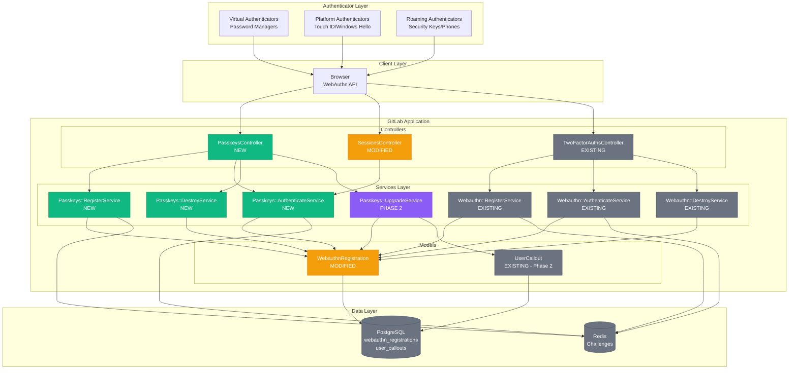
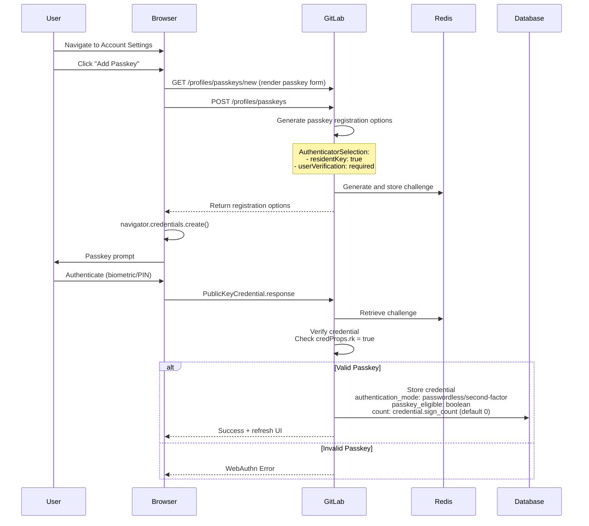
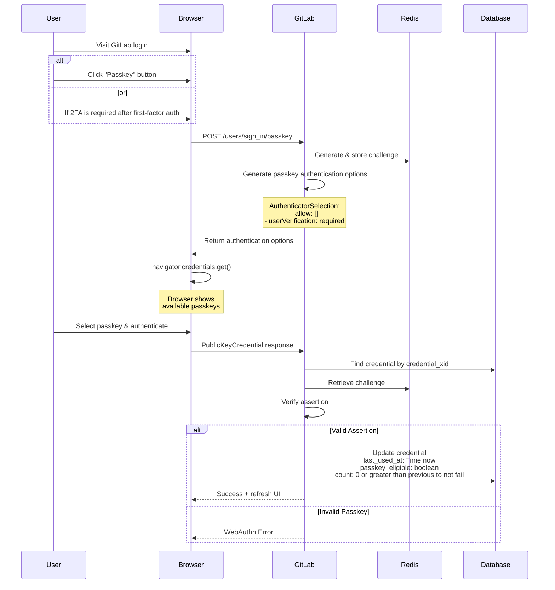

## 目次

- [概要](#summary)
- [動機](#motivation)
  - [ゴール](#goals)
    - [フェーズ 1](#phase-1)
    - [フェーズ 2](#phase-2)
  - [非ゴール](#non-goals)
- [提案](#proposal)
  - [技術的基盤](#technical-foundation)
  - [実装の詳細](#implementation-details)
- [設計と実装の詳細](#design-and-implementation-details)
  - [主要な設計決定](#key-design-decisions)
  - [UX 設計](#ux-designs)
  - [アーキテクチャ図](#architectural-diagram)
  - [シーケンス図](#sequence-diagrams)
    - [パスキー追加フロー](#add-passkey-flow)
    - [パスワードレス認証フロー](#passwordless-authentication-flow)
  - [開発](#development)
    - [データベース](#database)
    - [パスキーヒーロー](#passkey-heroes)
    - [対象 WebAuthn デバイスのパスキーへのアップグレード](#upgrading-eligible-webauthn-devices-to-passkeys)
  - [計測](#instrumentation)
  - [監査イベント](#audit-events)
  - [ドキュメント](#documentation)
- [アプリケーションセキュリティ](#application-security)
- [代替ソリューション](#alternative-solutions)
  - [マルチテーブル実装](#multi-table-implementation)
  - [ドメインバインディング](#domain-binding)

## 概要

このドキュメントは、GitLab に [FIDO2/WebAuthn](https://fidoalliance.org/fido2/) 準拠の[パスキー](https://developers.google.com/identity/passkeys)サポートを実装し、[パスワードレス認証](https://auth0.com/docs/authenticate/passwordless)を可能にし、[二要素認証](https://docs.gitlab.com/user/profile/account/two_factor_authentication/)の代替とすることを提案します。パスキーはユーザーの[認証器](https://www.w3.org/TR/webauthn-2/#authenticator)に保存された[暗号鍵](https://en.wikipedia.org/wiki/Public-key_cryptography)を活用することで、ユーザー名とパスワードよりもセキュアでユーザーフレンドリーな代替手段を提供します。

実装は既存の WebAuthn インフラを拡張し、現在の 2FA 実装との完全な後方互換性を維持しながら、ユーザーが[プラットフォーム](https://www.w3.org/TR/webauthn-2/#platform-authenticators)認証器（Touch ID、Windows Hello）、[ローミング](https://www.w3.org/TR/webauthn-2/#roaming-authenticators)認証器（セキュリティキー）、または[仮想認証器](https://developers.google.com/identity/passkeys/supported-environments#virtual-authenticators)（パスワードマネージャー）を使用してパスワードなしで認証できるようにします。

## 動機

認証の状況は、従来のパスワードからパスキーを使用したよりセキュアなパスワードレス認証へと進化しています。この変化は [DevSecOps 業界全体での早期採用](https://www.passkeys.io/who-supports-passkeys)によって加速されています。パスキーはフィッシング耐性のあるサインインを提供し、弱いパスワードの脆弱性や[認証情報の侵害](https://cybernews.com/security/billions-credentials-exposed-infostealers-data-leak)からユーザーを保護します。既存の互換性のあるインフラを考慮すると、パスキーの採用は論理的な次のステップです。

### ゴール

#### フェーズ 1

- パスキーを使用したパスワードレス認証の有効化
- 拡張された 2FA オプションとしてのパスキーのサポート
- ユーザーが少なくとも [1 つの Gitlab 2FA 方法](https://docs.gitlab.com/user/profile/account/two_factor_authentication/#enable-two-factor-authentication)を有効にした後、パスキーをデフォルトの 2FA 方法とする
- 既存の WebAuthn 2FA 認証情報との完全な後方互換性の維持
- パスキーのメール通知のサポート
- パスキーの採用をインストルメント化
- 制御されたロールアウト計画のためのフィーチャーフラグの裏に配置
- 必須 MFA に向けてユーザーベースを準備するための包括的なドキュメント

#### フェーズ 2

- `追加` と `アップグレード` パスキーヒーローの実装
- WebAuthn デバイスのパスキーへの `アップグレード` のサポート
- UX のための認証器名を取得するための WebAuthn 認証器アテステーションのサポート（[mds](https://fidoalliance.org/metadata/) および [non-mds](https://github.com/passkeydeveloper/passkey-authenticator-aaguids/blob/main/aaguid.json) 認証器）
- Gitlab 内の WebAuthn デバイスおよび/またはパスキーの削除が、ユーザーの認証器の認証情報も[削除する](https://developer.mozilla.org/en-US/docs/Web/API/PublicKeyCredential/signalUnknownCredential_static)ことを可能にする
- きめ細かいパスキー認証制御のための管理者/トップレベルグループオーナー設定の追加
- 監査イベントの実装
- 各サブ機能（追加・アップグレードパスキーヒーロー、WebAuthn デバイスのパスキーへのアップグレードなど）のための複数のフィーチャーフラグのサポート

注: この ADR はフェーズ 1 のゴールに焦点を当てます

### 非ゴール

- 既存の認証方法の廃止（パスワード/2FA は引き続き利用可能）
- パスキーファーストの認証採用の強制（任意のまま）
- 既存の WebAuthn 2FA ユーザー体験の変更（パスキーはその上に追加されるのみ）

## 提案

`authentication_mode` フィールドを通じて 2FA とパスキーの使用間の明確な分離を維持しながら、パスキーをサポートするために既存の `webauthn_registrations` テーブルを拡張します。このアプローチは既存のインフラを活用することでリスクを最小化し、明確なアップグレードパスを提供します。

### 技術的基盤

- [webauthn-ruby](https://github.com/cedarcode/webauthn-ruby) gem の継続使用
- パスキーおよび WebAuthn API 関連ドキュメントの中心的な情報源として [W3C WebAuthn Level 2](https://www.w3.org/TR/webauthn-2/) を使用
  - これはパスキーサポートがより充実した [W3C WebAuthn Level 3](https://www.w3.org/TR/webauthn-3/) の完全リリース後に変更されます
- これらのコミュニティ貢献を参照しながら、この [POC](https://gitlab.com/gitlab-org/gitlab/-/merge_requests/202701) を基に構築 [[1](https://gitlab.com/gitlab-org/gitlab/-/merge_requests/135324), [2](https://gitlab.com/gitlab-org/gitlab/-/merge_requests/169365)]
- パスキー関連の UX 設計の中心的な情報源としてこの [UX](https://www.figma.com/design/h8xsQafKqKr205RSsJU5Wk/Passkeys) ドキュメントに従う

### 実装の詳細

フェーズ化された作業はすべてこの[エピック](https://gitlab.com/groups/gitlab-org/-/epics/10897)を通じて管理・追跡され、実装は複数のマイルストーンにわたって処理されます。フルスタックとクロスチームの詳細については、以下のサブエピックを参照してください:

- [フェーズ 1](https://gitlab.com/groups/gitlab-org/-/epics/18185)
- [フェーズ 2](https://gitlab.com/groups/gitlab-org/-/epics/18887)

**メリット:**

- 既存の WebAuthn インフラとデータベーススキーマを活用し、リスクを最小化
- 既存の 2FA デバイスを持つユーザーのための明確なアップグレードパス
- POC が実証済みの実装パターンを提供
- 認証デバイスの単一ソースによりユーザーのメンタルモデルが簡素化

**デメリット:**

- webauthn_registrations が双重目的（2FA とパスキー）を果たすため、将来のクエリが複雑化しパフォーマンス問題が発生する可能性
- 認証タイプの混乱を防ぐための慎重なデータモデリングが必要
- 既存レコードの移行は慎重な検討が必要

## 設計と実装の詳細

### 主要な設計決定

**シングルテーブルアプローチ**

- データの重複を避けるために webauthn_registrations テーブルを再利用
- パスキーの適格性を示すブール値を格納するための `passkey_eligible` カラムを追加
- パスキー（パスワードレス）とその他の WebAuthn 認証情報（二要素）を区別するための列挙可能な属性を格納するための `authentication_mode` カラムを追加

**後方互換性**

- フィーチャーフラグの裏に配置
- デフォルトの `authentication_mode: 'second_factor'` により既存の 2FA 動作が維持
- 既存のクエリへの破壊的変更なし

### UX 設計

実装の詳細と同様に、UX フローはフェーズ化された作業にセグメント化されています。設計は[こちら](https://www.figma.com/design/h8xsQafKqKr205RSsJU5Wk/Passkeys)で確認できます。

### アーキテクチャ図



### シーケンス図

#### パスキー追加フロー



#### パスワードレス認証フロー



### 開発

#### データベース

```sql
ALTER TABLE webauthn_registrations
ADD COLUMN authentication_mode integer DEFAULT 0 NOT NULL,
ADD COLUMN passkey_eligible boolean DEFAULT false NOT NULL,
ADD COLUMN last_used_at timestamp with time zone,
```

```ruby
enum :authentication_mode, %i[passwordless second_factor].index_with(&:to_s)
```

```ruby
Feature.enabled?(:passkeys)      
Feature.enabled?(:passkey_upgrade)             
Feature.enabled?(:passkey_add_hero)
Feature.enabled?(:passkey_upgrade_hero)
```

#### パスキーヒーロー

以下のフローを実装するために [user_callouts](https://docs.gitlab.com/development/callouts/) を使用します:

- アカウントへのパスキー追加を促す
- スキップする
- 14 日後に再度確認する
- スキップする
- 二度と確認しない

#### 対象 WebAuthn デバイスのパスキーへのアップグレード

2FA 用の新しい WebAuthn デバイスの登録中に、[credProps](https://developer.mozilla.org/en-US/docs/Web/API/Web_Authentication_API/WebAuthn_extensions#credprops) クライアント拡張を取得するために WebAuthn API にリクエストを送信します。

`credProps.rk == true` が返された場合、ユーザーの認証情報が発見可能（パスキー）であり、認証器が `passkey_eligible` であることが確認されます。

これは、フェーズ 1 のリリース後、パスキーへのアップグレードを提案する前に、ユーザーが既存の 2FA WebAuthn デバイスを[再登録](https://www.w3.org/TR/webauthn-2/#sctn-authenticator-credential-properties-extension)する必要があることを意味します。

リクエストオプションは以下になります:

```ruby

def base_webauthn_request_params
  {
    user: { 
      id: current_user.webauthn_xid,
      name: current_user.username,
      displayName: current_user.name 
    },
    exclude: current_user.existing_webauthn_credentials,
    authenticator_selection: { 
      user_verification: 'discouraged',
      residentKey: 'preferred' # This will try to create a passkey if applicable, else non-discoverable (current default)
    },
    rp: { name: 'GitLab' },
    extensions: { credProps: true } # This will give us the credProps response hash to check if `rk: true` in the WebAuthn::RegistrationService
  }
end

```

`WebAuthn::RegistrationService` は `credProps.rk` を確認し、必要に応じて `passkey_eligible` を更新します。

最後に、ユーザーが WebAuthn デバイスをパスキーにアップグレードしたい場合、`passkey_eligible: true` であれば `WebAuthn::UpgradeService` が `authentication_mode: second_factor` を `authentication_mode: passwordless` に変更します。

### 計測

以下の推奨メトリクスでパスキーの採用を計測します:

- パスキーにサインアップしたユニークユーザー数
- パスキーで認証するユニークユーザー数
- パスキーにアップグレードしたユニークユーザー数

### 監査イベント

すべてのパスキー操作はコンテキストとともに監査イベントとしてログに記録されます。

### ドキュメント

フェーズ別のリリースについてユーザーベースを教育する包括的なドキュメントを作成するために、UX、テクニカルライティング、プロダクトチームと協力します。詳細については、この [Issue](https://gitlab.com/gitlab-org/gitlab/-/issues/569727) を参照してください。

## アプリケーションセキュリティ

https://gitlab.com/gitlab-org/gitlab/-/issues/532450 を参照してください。

## 代替ソリューション

### マルチテーブル実装

将来のユーザー成長とパスキーの採用に対応するために、各ユーザーに属する別個のパスキーテーブルを作成できます。重複では失うものを、スケーラブルな成長で得ることができます。

### ドメインバインディング

現在の WebAuthn 実装では暗黙のドメインバインディングを使用していますが、トップレベルグループオーナー（エンタープライズユーザーの検証済みドメイン）とセルフマネージド管理者（セルフホストドメイン）の制御のもとで、認証器アテステーションデータを使用してパスキーごとにドメインのリストを制限する機会があります。
