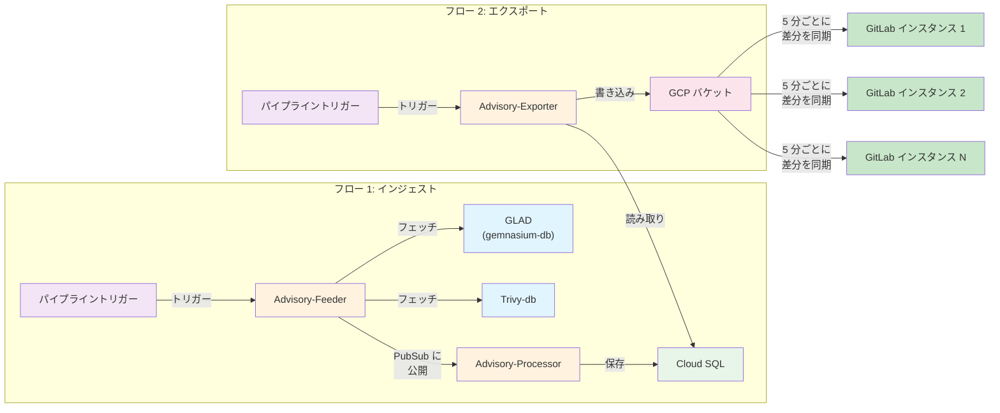

このページには今後予定されている製品・機能・機能性に関する情報が含まれています。ここに示す情報は参考目的のみです。購入・計画の決定にこの情報を使用しないでください。製品・機能・機能性の開発、リリース、タイミングは変更または延期される可能性があり、GitLab Inc. の独自の判断に委ねられています。

<table class="w-full text-sm border-collapse">
<thead>
<tr class="bg-gray-100 text-left">
<th class="px-3 py-2 border border-gray-300">Status</th>
<th class="px-3 py-2 border border-gray-300">Authors</th>
<th class="px-3 py-2 border border-gray-300">Coach</th>
<th class="px-3 py-2 border border-gray-300">DRIs</th>
<th class="px-3 py-2 border border-gray-300">Owning Stage</th>
<th class="px-3 py-2 border border-gray-300">Created</th>
</tr>
</thead>
<tbody>
<tr>
<td class="px-3 py-2 border border-gray-300">implemented</td>
<td class="px-3 py-2 border border-gray-300"><a href="https://gitlab.com/nilieskou" class="text-blue-600 hover:underline">@nilieskou</a></td>
<td class="px-3 py-2 border border-gray-300"></td>
<td class="px-3 py-2 border border-gray-300"><a href="https://gitlab.com/ifrenkel" class="text-blue-600 hover:underline">@ifrenkel</a>, <a href="https://gitlab.com/nilieskou" class="text-blue-600 hover:underline">@nilieskou</a></td>
<td class="px-3 py-2 border border-gray-300">~devops::secure</td>
<td class="px-3 py-2 border border-gray-300">2023-03-19</td>
</tr>
</tbody>
</table>

## 概要

このドキュメントでは、複数のソース（[GLAD/gemnasium-db](https://gitlab.com/gitlab-org/security-products/gemnasium-db) と trivy-db）からパッケージメタデータデータベース（[リポジトリ](https://gitlab.com/gitlab-org/security-products/license-db/deployment)を参照）にセキュリティアドバイザリをインジェストするためのアーキテクチャを説明します。インジェストされたアドバイザリは、[継続的な脆弱性スキャン](https://docs.gitlab.com/user/application_security/continuous_vulnerability_scanning/)をサポートするために GitLab Rails バックエンドが使用できるよう GCP バケットにエクスポートされます。

## 問題の定義

GitLab はタイムリーな脆弱性スキャンを可能にするために、Rails バックエンドの `vulnerability_advisories` テーブルを外部アドバイザリデータベースと同期し続ける必要があります。以前は、アドバイザリはデータベースに手動でシードされていましたが、このアプローチは継続的な更新に対してスケールしません。

### ゴール

1. **複数のソースからアドバイザリをインジェスト**: アプリケーション用の GLAD（GitLab アドバイザリデータベース）と OS アドバイザリ用の trivy-db
2. **データの同期を維持**: 新しいアドバイザリと更新されたアドバイザリを自動的に同期
3. **セルフマネージドインスタンスのサポート**: オフラインインスタンスが最小限の設定でアドバイザリデータベースのローカルコピーからアドバイザリをインジェストできるようにする
4. **データの正規化**: 異なるアドバイザリフォーマットを統合されたエクスポートフォーマットに変換
5. **効率的なスケール**: 過剰なリソース消費なしに数千のアドバイザリと影響を受けるパッケージを処理

### 非ゴール

1. **アドバイザリの削除**: PMDB はアドバイザリを追加または更新できるが、削除はできない

## 提案

PMDB アドバイザリインジェストシステムは、GitLab インスタンス全体でセキュリティアドバイザリを同期する 2 つの独立したデータフローで構成されています。

* フロー 1（インジェスト）では、2 つの別々のスケジュールされたパイプラインが Advisory-Feeder をトリガーします: 1 つのパイプラインはアプリケーション層のアドバイザリのために GLAD からアドバイザリをフェッチし、もう 1 つのパイプラインは OS 層のアドバイザリのために Trivy-db からフェッチします。両方のソースは PubSub に公開され、Advisory-Processor がそれを消費してデータを Cloud SQL に保存します。

* フロー 2（エクスポート）では、別のスケジュールされたパイプラインが Advisory-Exporter をトリガーして Cloud SQL からアドバイザリを読み取り、統合されたフォーマットに変換し、GCP バケットに書き込みます。最後に、GitLab インスタンス（SaaS とセルフマネージドの両方）がスケジュールされた間隔でアドバイザリバケットに接続し、インスタンスのアドバイザリデータが継続的スキャンのために最新かどうかを確認します。

## アーキテクチャの概要

### ハイレベルデータフロー

### コンポーネント

#### 1. Advisory-Feeder

**目的**: ソースデータベースから新しいアドバイザリと更新されたアドバイザリを抽出し、PubSub に公開します。

**主な責任**:

* GLAD と trivy-db ソースの変更を監視
* YAML（gemnasium-db）と JSON（trivy-db）フォーマットからアドバイザリデータを解析
* 生のアドバイザリデータを保持
* ダウンストリーム処理のためにメッセージを PubSub に公開
* 増分更新のためにカーソル位置を追跡

**設計上の決定**:

| 決定 | 理由 | 検討された代替案 |
|----------|-----------|-------------------------|
| **エクスポーターでの変換** | Feeder はアドバイザリを生のまま保持し、フォーマット処理をエクスポーターに任せる。このアプローチは、データベースに常に生データがあるため有益 | Feeder でのデータ変換 |
| **カーソルベースの増分更新** | 継続的な同期に効率的；データ転送と処理を削減 | 大規模なデータベースではリソース集中的な完全な再インジェスト |

#### 2. Advisory-Processor

**目的**: PubSub メッセージを消費し、アドバイザリを Cloud SQL に保存します。

**主な責任**:

* PubSub からメッセージを消費
* アドバイザリデータを検証
* 変換なしで Cloud SQL にアドバイザリを保存

#### 3. Advisory-Exporter

**目的**: Cloud SQL から GCP バケットに Rails バックエンドが消費できるフォーマットでアドバイザリをエクスポートします。

**主な責任**:

* Cloud SQL からアドバイザリをクエリ
* GLAD 構造に一致させるために trivy-db データ（CVE と影響を受けるパッケージ）を結合
* データを統合されたエクスポートフォーマットに正規化
* PURL タイプ別に整理された GCP バケットに書き込み
* 完全なエクスポートと増分エクスポートの両方をサポート

### データベーススキーマ

PMDB は変換なしにアドバイザリをそのまま保存するための柔軟なスキーマを使用しています:

**主要テーブル**:

* `trivy_db_advisories`: trivy-db 固有のアドバイザリデータを保存
* `trivy_db_affected_packages`: バージョン範囲付きでアドバイザリを影響を受けるパッケージにマッピング
* `glad_db_advisories`: GLAD アドバイザリを保存（CVE と影響を受けるパッケージの組み合わせ）

## 追加の設計上の決定事項

### 1. 生のアドバイザリを保存し、エクスポート時に変換する

**決定**: Cloud SQL にアドバイザリを変換なしでソース（GLAD または trivy-db）から受け取った通りに保存し、すべてのフォーマット正規化を Advisory-Exporter で実行します。

**理由**:

* **分離**: Feeder と Processor はエクスポートフォーマットの要件を理解する必要がない
* **柔軟性**: エクスポートフォーマットはすべてのデータを再インジェストすることなく進化できる（例: v1 から v2）
* **監査可能性**: 生のデータはデバッグと検証のためにデータベースに保存される
* **反復的な改善**: インジェストパイプラインに触れることなくエクスポートロジックを最適化できる
* **ソースの忠実性**: 潜在的な将来のユースケースのために元のデータ構造を維持

**検討された代替案**:

* Feeder での正規化: Feeder をエクスポートフォーマットに結合させ、フォーマット変更時に再インジェストが必要になる。データベースに SSOT がなくなる。

### 2. エクスポートフォーマットの進化（v1 から v2: CSV から NDJSON へ）

**決定**: 複雑なネスト構造を持つアドバイザリデータをより良くサポートするために、CSV から NDJSON（改行区切り JSON）に移行する新しいエクスポートフォーマット（v2）を実装します。

**理由**:

* **構造化データ**: NDJSON は複数の参照、CVSS ベクター、影響を受けるバージョンを持つアドバイザリメタデータをより良く表現
* **スケーラビリティ**: NDJSON は全ファイルをメモリに読み込まずにストリーミング処理を可能にする
* **柔軟性**: JSON 構造はデータをフラット化せずに GLAD と trivy-db の両方のデータに対応
* **後方互換性**: v1 フォーマットは移行期間中に v2 と共存できる
* **将来の拡張性**: JSON スキーマは追加のアドバイザリソースとメタデータをサポートするために進化できる

**検討された代替案**:

* CSV フォーマットを維持: 複雑なネストデータをフラット化する必要があり、情報が失われるか冗長な行が生まれる
* XML を使用: JSON より冗長で、ストリーミング処理が難しい
* Protocol Buffers を使用: より効率的だが人間が読みにくく、デバッグが難しい

### 3. GLAD と Trivy-db インジェストのための別々のパイプライン

**決定**: Advisory-Feeder をトリガーするために 2 つの別々のスケジュールされたパイプラインを使用します: GLAD（gemnasium-db）用とtrivy-db 用。

**理由**:

* **独立したスケジューリング**: 各ソースはリリースサイクルに基づいて異なる更新頻度を持てる
* **障害の分離**: 1 つのソースに問題がある場合、もう 1 つは独立してインジェストを続けられる
* **リソースの最適化**: ソース固有の特性に基づいて各パイプラインのリソースをチューニングできる
* **明確な所有権**: どのパイプラインがどのアドバイザリソースを処理するかを明確にする
* **デバッグの容易さ**: どのソースがインジェストパイプラインで問題を引き起こしたかを特定しやすい

**検討された代替案**:

* 両方のソースに対する単一のパイプライン: 複雑な分岐ロジックが必要で、ソース固有の Issue のデバッグが難しくなる
* 手動トリガー: 継続的なアドバイザリ更新にスケールしない

## スケーラビリティの考慮事項

### データ量

* **gemnasium-db**: 約 50,000 のアドバイザリ
* **trivy-db**: 約 1,000,000 以上のアドバイザリと影響を受けるパッケージ
* **PubSub メッセージの合計**: 初回の完全なインジェストで約 1,000,000 以上

### リソース使用量

**データベース**:

* 初回インジェストは Cloud SQL リソースの約 50% を消費
* Cloud Run のオートスケーリングで適切にスケール
* 増分更新の影響は最小限

**PubSub**:

* 1M 以上のメッセージを効率的に処理
* 自動スケーリングが負荷スパイクを処理

**GCP バケット**:

* 効率的なクエリのために PURL タイプ別に整理
* 完全なエクスポートと増分エクスポートの両方をサポート

## セルフマネージドのエアギャップインスタンスのサポート

**アプローチ**: ユーザーはアドバイザリデータベースのリポジトリを手動でコピーし、ローカルパスからインジェストするように GitLab を設定できます。
