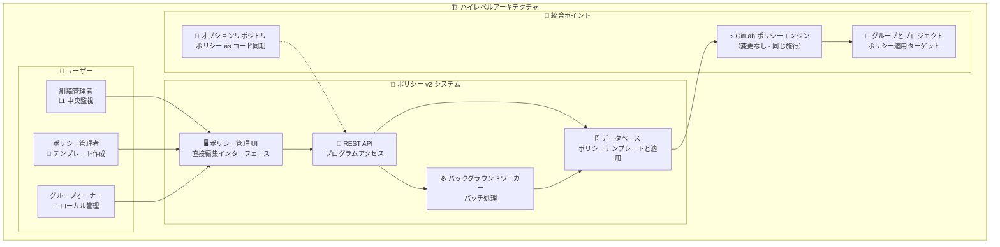
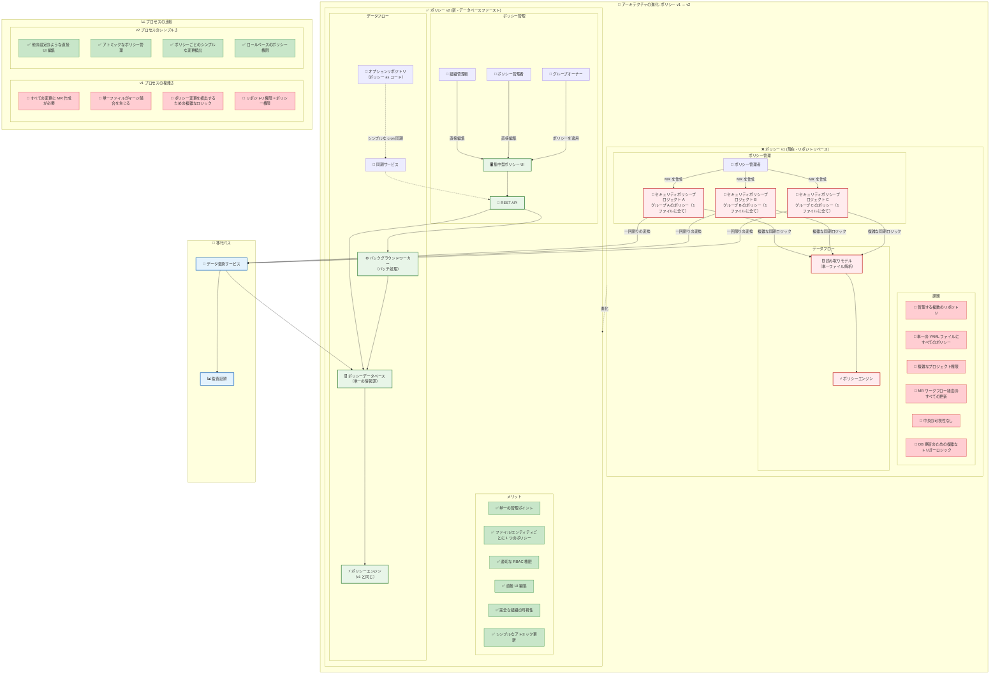
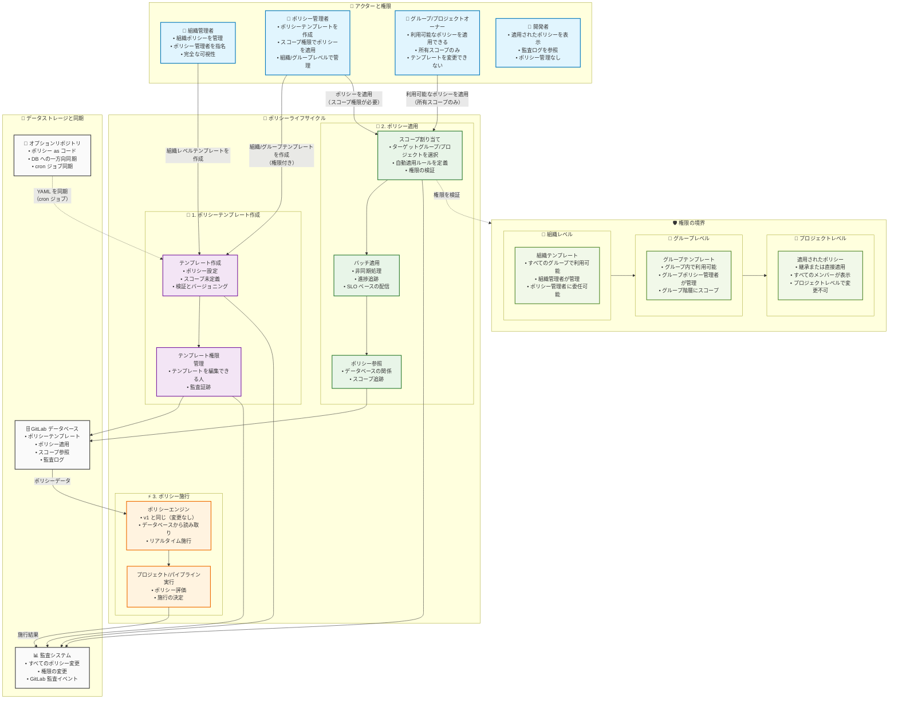
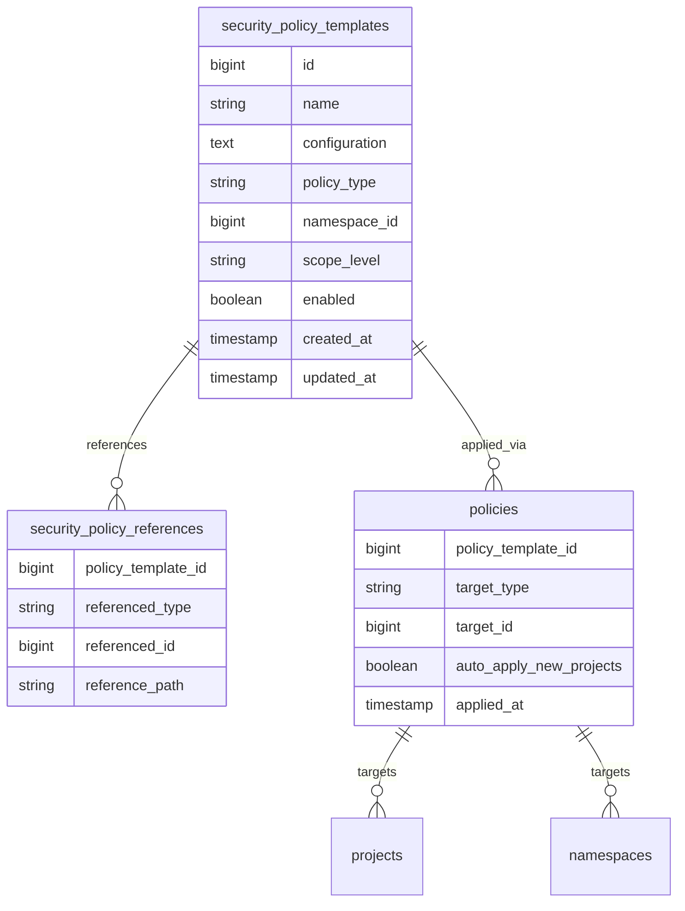




## 概要

セキュリティポリシーは現在、リポジトリベースのセキュリティポリシープロジェクト（SPP）を通じて管理されており、大規模にポリシーを管理する組織にとって複雑さとスケーラビリティの課題が生じています。このデザインドキュメントでは、セキュリティポリシー v2 を概説します。これは、ポリシー管理を分散したリポジトリ中心モデルから集中型のデータベース駆動アーキテクチャに変革するデータベースファーストのアプローチです。

このイニシアチブは、マージリクエストを通じて管理される単一の YAML ファイルにすべてのポリシーを保存することから、適切な RBAC 権限と直感的な UI 駆動のワークフローによるアトミックなポリシー管理へと移行します。ポリシーテンプレートは組織レベルとトップレベルグループレベルの両方で作成でき（サブグループのサポートは予定）、ポリシー設定（テンプレート）とポリシー適用（スコープの割り当て）が明確に分離されています。

このアーキテクチャの進化は、切り替え可能な v1/v2 モデルを通じた完全な可逆性を維持しながら、管理エクスペリエンスを大幅に簡素化し、組織がポリシーの採用をスケールできるようにします。

## 動機

### ポリシー v1 における現在の課題

GitLab セキュリティポリシーを使用している組織は、ポリシーの採用をスケールするにつれて重大な管理オーバーヘッドに直面しています:

- **リポジトリの断片化**: グループ全体に散らばった複数のセキュリティポリシープロジェクトにより、一貫性と可視性の維持が困難
- **複雑なワークフロー**: すべてのポリシー変更にマージリクエストの作成と承認が必要で、セキュリティチームの摩擦が生じる
- **単一ファイルのボトルネック**: リポジトリごとの 1 つの YAML ファイルにすべてのポリシーを保存することで、マージの競合と解析の複雑さが生じる
- **権限の複雑さ**: ポリシー管理権限がリポジトリアクセスに紐付けられており、適切な職務分離の実装が困難
- **可視性の制限**: 組織全体のポリシー適用とコンプライアンス状態の中央ビューがない
- **同期の複雑さ**: ファイル内のポリシー変更を検出して適切なデータベース更新をトリガーするための複雑なロジックが必要

これらの課題は、複数のグループにわたる数百のプロジェクトを管理するエンタープライズ顧客にとって特に深刻になります。

### ゴール

- **集中型で簡略化された管理**: 組織全体の可視性と制御を持つ組織レベルとトップレベルグループレベルでのポリシー作成を可能にする
- **分離された RBAC 権限**: GitLab リポジトリ階層から独立した専用のポリシーロールを実装し、適切な職務分離を可能にする
- **より良い UX**: 他の GitLab の設定のように機能する直接 UI 編集で MR ベースのワークフローを置き換える
- **簡略化された処理ロジック**: 複雑なファイル解析からシンプルなデータベース変更追跡によるアトミックなポリシー更新に移行する
- **API ファーストアプローチ**: プログラムによるポリシー管理と将来の統合を可能にする REST API を提供する
- **現在の摩擦を軽減**: 監査証跡とバージョン管理を維持しながらポリシー更新の MR オーバーヘッドを排除する
- **柔軟な採用モデル**: 組織レベルでのポリシー v1 と v2 の間でのリスクフリーな採用を可能にする可逆的な切り替えを有効にする
- **スケーラブルなアーキテクチャ**: バックグラウンド処理を通じて数千のポリシーを処理する基盤を準備する

### 非ゴール

- 基盤となるポリシー施行エンジンを変更したり、CI/CD 実行中にポリシーが評価される方法を変更することはしない
- 既存のポリシー YAML スキーマ、ポリシータイプ、またはその施行動作を変更することはしない
- グループレベルのポリシー管理機能を置き換えることはしない - 組織レベルとグループレベルの管理は共存する
- このイニシアチブはポリシーの**管理**のみに焦点を当て、ポリシーの**機能**や**施行**には焦点を当てない

## 提案

リポジトリ中心モデルから、施行の一貫性を維持しながらポリシー設定とポリシー適用を分離するデータベースファーストアーキテクチャへセキュリティポリシーを変革します。



### コアアーキテクチャの変更

**ポリシーテンプレート**: 組織またはトップレベルグループレベルで作成された再利用可能なポリシー設定（サブグループのサポートは将来の予定）。単一ファイルにバンドルされるのではなく、個別のデータベースエンティティとして保存されます。

**ポリシー適用**: テンプレートが適用される場所を定義するスコープ固有の割り当て。同じテンプレートを複数のグループやプロジェクトで使用できます。

**集中型データベースストレージ**: すべてのポリシーデータの単一の情報源。ポリシー as コードワークフローを望む顧客向けのオプションのリポジトリ同期付き。

**アトミック管理**: 個別の変更追跡を持つ個別のエンティティとして管理される各ポリシー。複雑なファイル解析ロジックを排除。

**バックグラウンド処理**: 進捗追跡とサービスレベル目標を持つ大きなスコープへのポリシーの非同期適用。

### ユーザーエクスペリエンスの変革

- **組織管理者**は完全な可視性を持つ中央ダッシュボードを取得し、ポリシー管理者を指名できる
- **ポリシー管理者**は再利用可能なテンプレートを作成し、許可されたスコープ全体に適用する
- **グループオーナー**はグループスコープのテンプレートを作成し、利用可能なテンプレートをプロジェクトに適用できる
- **プロジェクトオーナー**はテンプレートをプロジェクトに適用できるが、プロジェクトレベルのテンプレートは作成できない
- **すべてのユーザー**はマージリクエストワークフローを置き換える直接 UI 編集の恩恵を受ける

## 設計と実装の詳細

### システムの概要

ポリシー v2 システムは、同じ施行メカニズムを維持しながら、ポリシー管理を分散したリポジトリベースのアプローチから集中型のデータベースファーストアーキテクチャに変換します。

### アーキテクチャの進化: v1 → v2



| 側面 | ポリシー v1 | ポリシー v2 |
|--------|-------------|-------------|
| **データストレージ** | 複数のリポジトリ、単一の YAML ファイル | 集中型データベース、アトミックなポリシー |
| **ユーザーインターフェース** | MR の作成と承認 | 直接 UI 編集 |
| **権限** | リポジトリベースのアクセス | 専用の RBAC ロール |
| **変更検出** | 複雑なファイル解析ロジック | シンプルなデータベース変更追跡 |
| **スケーラビリティ** | リポジトリ同期によって制限 | SLO 付きのバックグラウンド処理 |
| **可視性** | リポジトリ全体に断片化 | 組織全体のダッシュボード |

### ポリシー管理ワークフロー



#### 組織管理者のジャーニー

1. **中央ダッシュボード**: 組織全体のすべてのポリシーを表示
2. **権限管理**: ポリシー管理者を指名してロールを管理
3. **テンプレート作成**: 組織全体のポリシーテンプレートを作成
4. **コンプライアンス監視**: ポリシーの適用を監視して変更を監査

#### ポリシー管理者のジャーニー

1. **テンプレート作成**: 組織またはトップレベルグループレベルで再利用可能なポリシー設定を定義
2. **スコープ適用**: 特定のグループ/プロジェクトにポリシーを適用（許可されたスコープ内）
3. **進捗モニタリング**: バッチ適用ステータスを追跡

#### グループオーナーのジャーニー

1. **グループテンプレート**: トップレベルグループにスコープされたポリシーテンプレートを作成
2. **ポリシー適用**: 利用可能なテンプレート（組織とグループ）を所有スコープに適用
3. **ステータス追跡**: プロジェクトでのポリシー施行を監視

### データモデルの概要



#### 主要な設計原則

- **ポリシーテンプレート**: 組織またはトップレベルグループレベルで作成された再利用可能な設定
- **ポリシー適用**: テンプレートのスコープ固有の割り当て（`policies` テーブルに保存）
- **ポリシー参照**: ポリシーで参照されるすべての GitLab エンティティを追跡
- **階層的なアクセス**: 組織テンプレートはすべてのグループで利用可能；グループテンプレートはグループ階層にスコープ
- **関心の分離**: テンプレート設定とアプリケーションスコープを分離

#### 実装ノート: データベーススキーマ

このブループリントは v2 のアーキテクチャビジョンを提示します。実装は適切な場合に既存のデータベーステーブルを活用できます:

- `security_policy_templates` は現在の `security_policies` テーブルの概念に対応
- `policies`（適用）は現在の `security_policy_project_links` の概念に対応
- 実際の実装は複雑さと互換性に基づいて既存テーブルを再利用するか新しいテーブルを作成するかを評価する必要がある

優先事項はアーキテクチャの概念の明確さです；既存の構造との統合は詳細な実装の決定です。

### REST API 設計

#### ポリシーテンプレート

```text
# 組織レベルのテンプレート
GET    /api/v4/organizations/:id/policy_templates
POST   /api/v4/organizations/:id/policy_templates
GET    /api/v4/organizations/:id/policy_templates/:template_id
PUT    /api/v4/organizations/:id/policy_templates/:template_id
DELETE /api/v4/organizations/:id/policy_templates/:template_id

# トップレベルグループテンプレート
GET    /api/v4/groups/:id/policy_templates
POST   /api/v4/groups/:id/policy_templates
GET    /api/v4/groups/:id/policy_templates/:template_id
PUT    /api/v4/groups/:id/policy_templates/:template_id
DELETE /api/v4/groups/:id/policy_templates/:template_id
```

#### ポリシー適用

```text
# 組織レベルの適用
GET    /api/v4/organizations/:id/policies
POST   /api/v4/organizations/:id/policies
DELETE /api/v4/organizations/:id/policies/:policy_id

# グループレベルの適用
GET    /api/v4/groups/:id/policies
POST   /api/v4/groups/:id/policies
DELETE /api/v4/groups/:id/policies/:policy_id
```

#### ポリシースコープ管理

```text
POST   /api/v4/policy_templates/:id/apply
GET    /api/v4/projects/:id/applied_policies
GET    /api/v4/groups/:id/applied_policies
GET    /api/v4/groups/:id/available_templates
GET    /api/v4/organizations/:id/available_templates
```

### 移行戦略: データ変換

#### 採用モデル: 可逆的なポリシー v1 ↔ v2

ポリシー v2 は切り替え可能なモデルを使用し、組織管理者が v1 と v2 を切り替えることができます:

**ポリシー v2 への切り替え:**

1. 組織管理者が v2 移行を開始
2. システムがデータ変換を実行: 既存のすべてのセキュリティポリシープロジェクトのポリシーを適切なスコープを持つ組織レベルのテンプレートに変換
3. システムが SPP とグループ/プロジェクト間のすべてのリンクを廃止
4. ポリシーを持つリポジトリファイルは監査証跡のために変更されない
5. すべてのポリシー施行が v2 データベース駆動モデルに切り替わる
6. いつでも完全な可逆性が利用可能

**ポリシー v1 への切り替え:**

1. 組織管理者が v1 への差し戻しを開始
2. システムがデータベースからすべての v2 ポリシーを削除
3. システムが元の SPP とグループ/プロジェクト間のリンクを再有効化
4. ポリシー施行がリポジトリベースのモデルに戻る
5. リポジトリ内の元の YAML ファイルが再びアクティブになる

**主要な原則:**

- v1 と v2 は移行期間中に共存できる（同じ組織で同時ではない）
- リポジトリファイルは移行中に削除されない
- 完全な監査証跡が全体を通じて維持される
- 組織が完全な v2 採用にコミットするまで両方向が可逆的

#### データ変換コンポーネント

**一回限りの変換サービス**

- **入力**: 既存のセキュリティポリシープロジェクト（v1）
- **処理**: YAML ファイルをデータベースエンティティに変換し、グループ/プロジェクトスコープを持つ組織レベルテンプレートを作成し、設定を検証
- **出力**: データベース内のポリシーテンプレートと適用（v2）
- **監査**: すべての変換の完全なログ

**フィーチャーフラグ戦略**

- **`policies_v2_enabled`**: 組織ごとの新しい UI と API エンドポイントへのアクセスを制御
- **可逆的なトグル**: 組織レベルでの v1 と v2 の簡単な切り替え
- **ロールバックメカニズム**: Issue が発見された場合の素早い差し戻し

### 監査とコンプライアンス

#### 包括的な監査ログ

すべてのポリシー関連の変更は GitLab 監査イベントにログされなければなりません:

**テンプレートの変更:**

- テンプレートの作成、変更、削除
- ポリシー設定の更新
- テンプレート権限の変更
- テンプレートの有効化/無効化イベント

**適用の変更:**

- ポリシー適用の作成
- ポリシースコープの変更
- ポリシー適用の削除
- 自動適用ルールの変更

**権限の変更:**

- ポリシー管理者の指名
- 権限の付与/取り消し
- ロールの割り当て

**施行イベント:**

- 初期ポリシーテンプレートの作成
- スコープへの各ポリシー適用
- 各 MR 承認ポリシーの施行

すべての監査エントリには以下が含まれます:

- 変更のタイムスタンプ
- 変更を行ったユーザー
- 組織/グループコンテキスト
- 詳細な変更の説明
- 該当する場合の以前の値と新しい値

### パフォーマンスとスケール要件

#### サービスレベル目標

以下のサービスレベル目標（SLO）は期待されるパフォーマンスターゲットを定義します:

**ポリシー適用の伝播:**

- 典型的なデプロイメント（10k〜100k プロジェクト）では、ポリシーの更新は 30 分以内にターゲットシステムの 95% に伝播する必要がある
- 大規模なデプロイメントやピーク負荷期間では、伝播時間は影響を受けるスコープ内の追加 100k プロジェクトごとに約 1 分スケール
- **初期リリース制限**: 組織ごとに各タイプ 20 ポリシー、トップレベルグループごとに各タイプ 20 ポリシー
- **長期ビジョン**: インフラストラクチャとパフォーマンスの最適化が許す限り数千のポリシーを処理できるシステムを準備

**API 応答時間:**

ポリシーの CRUD 操作は 2 秒以内に完了する必要があります

**UI の応答性:**

ポリシーダッシュボードは 3 秒以内に読み込まれる必要があります

**システムの信頼性:**

ポリシー管理サービスの 99.9% 稼働時間を目標とします

**注意事項:**

これらの SLO は標準的なインフラストラクチャ設定を前提としており、実際のデプロイメントパラメーター、ネットワークトポロジー、同時ポリシー操作に基づいて調整される場合があります。チームは実際の伝播パターンを評価した後、実装計画中に最終的な SLO を確立します。

#### スケーラビリティ設計

- **バックグラウンド処理**: すべての大規模な操作は非同期に処理
- **データベース最適化**: ポリシーの適用と参照に適切なインデックス
- **キャッシュ戦略**: 頻繁にアクセスされるポリシーデータの Redis キャッシュ
- **水平スケーリング**: Sidekiq ワーカーはキューの深さに基づいてスケール可能
- **スコープカバレッジ**: 単一の操作で 200k 以上のプロジェクトを持つグループを対象とするポリシー適用のサポート
- **初期制限**: 保守的な出発点（タイプごと、組織/グループごとに 20）と計画的な増加

### セキュリティと権限

#### RBAC モデル

| ロール | テンプレート作成 | テンプレート編集 | ポリシー適用 | 監査ログ表示 |
|------|------------------|----------------|----------------|-----------------|
| **組織管理者** | ✅ | ✅ | ✅ | ✅ |
| **ポリシー管理者** | ✅ (権限付き) | ✅ (スコープ付き) | ✅ (スコープ付き) | ✅ (スコープ付き) |
| **グループオーナー** | ✅ (グループレベル) | ✅ (自分のテンプレート) | ✅ (所有スコープ) | ❌ |
| **プロジェクト管理者** | ❌ | ❌ | ✅ (所有プロジェクト) | ❌ |
| **開発者** | ❌ | ❌ | ❌ | ❌ |

#### 権限の検証

- **組織テンプレート**: 組織レベルのポリシー管理ロールが必要
- **グループテンプレート**: グループオーナーシップまたは委任されたポリシー管理権限が必要
- **テンプレート操作**: ユーザーがテンプレートスコープに対して適切な権限を持っていることを検証
- **適用操作**: ユーザーがターゲットスコープへのアクセスを持っていることを検証
- **監査証跡**: すべてのポリシー変更と適用の完全なログ

### ユーザーインターフェースの変更

#### 新しいコンポーネント

- **組織ポリシーダッシュボード**: 組織レベルのすべてのポリシーとその適用の中央ビュー
- **ポリシーテンプレートエディター**: ポリシースコープ要素なしの現在のポリシー UI エディター（スコープは個別に処理）
- **アプリケーションマネージャー**: グループ/プロジェクトへのポリシー適用のための拡張・改善されたポリシースコープコンポーネント
- **権限管理**: ポリシー固有のロールを管理するためのメンバースタイルのコントロール（プロジェクト/グループメンバー UI と同様）

#### 変更されたコンポーネント

- **グループ/プロジェクトポリシーページ**: ローカルと適用されたポリシーの両方を表示
- **セキュリティとコンプライアンスの設定**: ポリシー管理との統合
- **組織の設定**: 組織のポリシー監視

#### UX の改善

- **直接編集**: ポリシー変更のための MR 作成が不要
- **リアルタイム検証**: ポリシー設定の即時フィードバック
- **進捗追跡**: ポリシー適用ステータスの視覚的インジケーター
- **監査の可視性**: すべてのポリシー変更の明確な履歴

## 実装上の考慮事項

実装を開始する前に、このブループリントのスコープを超えた詳細な設計作業が必要な以下の領域があります。これらはアーキテクチャレビューを通じて特定された一般的な実装上の課題であり、設計フェーズをガイドするものです:

### 重要な実装領域

**1. 状態の一貫性と可逆性プロトコル**

- 可逆的な v1 ↔ v2 切り替えメカニズムには詳細な状態遷移プロトコルが必要
- 設計は以下に対処する必要がある: 移行中の部分的な障害、切り替え中の進行中のポリシー適用、v1 に相当するものがない v2 で作成されたポリシー
- バッチ操作のチェックポイントベースの回復を実装
- 移行中のロック期間と切り替え後のモニタリングウィンドウを定義

**2. ポリシースコープの可変性と再評価**

- スコープの変更（縮小、拡大、置き換え、フィルター変更）には異なる処理戦略が必要
- 設計は以下に対処する必要がある: 影響を受けるプロジェクトの特定、既存の MR 承認ルールの処理、古い適用を置き換えるための猶予期間
- スコープのバージョニングと変更通知システムを実装

**3. 障害回復と部分的な状態管理**

- バックグラウンドのバッチ処理はさまざまな段階で失敗する可能性がある
- 設計は以下に対処する必要がある: ワーカーのクラッシュ回復、データベース接続の損失、権限の検証の失敗、リソースの枯渇
- チェックポイントシステム、サーキットブレーカー、補償戦略（ロールバック対部分受け入れ）を実装

**4. ポリシーの競合解決と構成**

- 異なる階層レベルからの複数のポリシーが同じプロジェクトに適用される可能性がある
- 設計は以下を定義する必要がある: ポリシータイプごとの優先順位ルール、構成戦略（最も制限的 対 結合）、競合の検出と監査
- UI での階層トラバーサルと競合の視覚化を実装

**5. API レート制限とクォータ管理**

- REST API エンドポイントには乱用とリソース枯渇に対する保護措置が必要
- 設計は以下を定義する必要がある: 組織ごとのクォータ、ユーザーごとのレート制限、バッチ操作のスロットリング、クォータ増加プロセス
- フェーズ 1 の推奨開始制限: 100 の組織テンプレート、組織ごと 500 の合計適用

**6. 階層の変更処理**

- グループの再編成（移動、サブグループの作成）でポリシーの適用が壊れてはならない
- 設計は以下に対処する必要がある: 階層の変更を検出し、ポリシースコープを再検証し、無効な適用を処理し、新しいサブグループにポリシーを自動適用
- グループ階層イベントにサブスクライブして適用を更新

**7. バージョン管理とロールバックメカニズム**

- ポリシーテンプレートは以前の変更にロールバックする機能でバージョン管理される必要がある
- 設計は以下を実装する必要がある: 不変のバージョン履歴、バージョン間のサイドバイサイド比較、すべてのプロジェクトに影響を与えないセレクティブなロールバック
- ポリシー適用でバージョン参照を使用（既存のプロジェクトを新しいバージョンに自動アップグレードしない）

**8. テストと段階的なロールアウト戦略**

- 可逆性メカニズムと状態遷移には特別なテストが必要
- 計画: 内部テスト（2 ヶ月）→ ベータオプトイン（2〜4 週間）→ 段階的なロールアウト（1〜3 ヶ月）→ 完全な提供
- v1→v2 移行と v2→v1 差し戻しの両方の検証チェックリストを定義

**9. 災害復旧とデータ保護**

- 実装: 30 日保持の毎日バックアップ、ポリシーのソフト削除（30 日の回復ウィンドウ）、不変の監査証跡
- 定義: RTO < 4 時間、RPO < 1 日、一括操作のセーフガード（10 以上のポリシー削除には確認が必要）

**10. フェーズ 1 を超えたスケーラビリティロードマップ**

- フェーズ 1 は意図的に保守的（100 の組織テンプレート、50 のグループテンプレート）で安定性を確保
- フェーズ 2 の計画（3 ヶ月）: 500/200 に増加、組織ごとの専用 Sidekiq キュー
- フェーズ 3 の計画（6 ヶ月）: 1000/500 テンプレートに達し、データベースシャーディングを実装

---

## 伝播の制限と考慮事項

ポリシー v2 はアトミックなデータベース更新によってポリシー管理を大幅に簡素化しますが、特定の伝播の課題は残存し、理解される必要があります:

### v2 が解決すること

- ポリシーの変更を検出するための複雑なファイル解析と差分ロジックを排除
- アトミックなデータベース操作による初期のポリシーとプロジェクトのリンクを簡素化
- MR オーバーヘッドなしの直接ポリシー変更を可能にする
- どのポリシーが変更されたかを素早く識別

### v2 が解決しないこと

- **MR 評価の複雑さ**: ポリシールールが変更された場合（例: 既存の `critical` ポリシーに `high` 重大度を追加）、影響を受けるプロジェクトのすべてのオープンマージリクエストは、新しい承認ルールで再評価・更新される必要がある
- **コンプライアンス Issue の発見**: 更新されたポリシールールに対して既存の発見を再評価することは、潜在的に大きなデータセットにわたる計算が必要
- **スコープの再評価**: ポリシースコープが変更された場合、関連するプロジェクトとその MR が再評価を必要とする可能性がある

### 関連作業

これらの残存する課題への改善は、**承認ルール v2 イニシアチブ**（Epic #12955）を通じて対処されています。これは個々の MR 承認ルールの更新オーバーヘッドを削減することを目指しています。ただし、この作業は独立しており、v2 採用のブロッカーではありません。

### 影響

組織は以下を期待する必要があります:

- 迅速なポリシー作成とテンプレートの変更（SLO で約 30 分の伝播）
- 新しいスコープへの迅速なポリシー適用（SLO で約 30 分の伝播）
- 既存の作業の再評価の潜在的な遅延（Epic #12955 の改善に従う）

---

## 代替ソリューション

### リポジトリベースのアプローチの継続（v1）

**メリット**:

- 移行の工数が不要
- 現在のユーザーにとって親しみやすいワークフロー
- ポリシー as コードが主要なワークフローとして維持

**デメリット**:

- スケーラビリティの Issue が未解決のまま
- 複雑な権限管理が続く
- 採用の拡大とともに管理オーバーヘッドが増加
- 可視性と集中的な制御の制限

### ハイブリッドリポジトリ・データベースアプローチ

**メリット**:

- 段階的な移行が可能
- 両方のワークフローを同時に維持

**デメリット**:

- 2 つのシステムの維持による複雑さの増加
- リポジトリとデータベース間の一貫性の問題の可能性
- 中核的なスケーラビリティと UX の問題を解決しない

提案されたデータベースファーストのアプローチと可逆的な v1/v2 切り替えは、オプションの差し戻しによる完全な後方互換性を維持しながら、スケーラビリティの改善、ユーザーエクスペリエンスの向上、アーキテクチャのシンプルさ、および採用の安全性の最良のバランスを提供します。

---

### 成功メトリクス

#### 採用メトリクス

- **移行成功率**: GA 後の最初の年以内に既存のポリシーの 80% が正常に移行
- **API 使用量**: プログラムによるポリシー管理の成長

#### パフォーマンスメトリクス

- **システムの信頼性**: ポリシー管理サービスの 99.9% 稼働時間
- **ユーザーエクスペリエンス**: ポリシー操作の平均応答時間 3 秒未満

#### ビジネスへの影響

- ポリシー管理オーバーヘッドの削減
- 組織全体のより速いポリシーデプロイメント
- セキュリティポリシーコンプライアンスでの摩擦の削減

### 将来の機会

#### 強化された機能

- **サブグループサポート**: サブグループスコープのテンプレートと適用へのポリシーの拡張（GA 後の計画）
- **GitLab MCP 統合**: LLM インターフェースを通じたポリシー管理をサポートするために既存の MCP サーバーを拡張
- **ポリシーテンプレート**: 一般的なユースケースのための事前構築されたポリシー設定
- **高度なスコーピング**: より柔軟なターゲティングのためのセキュリティ属性との統合
- **コンプライアンスレポート**: 組織全体のポリシーコンプライアンスダッシュボード

#### 組織エンティティの統合

データベースファーストアプローチは、将来の組織レベルの機能のためのクリーンな基盤を提供します:

- インスタンスレベルから組織スコープのポリシーへのシームレスな移行
- 大企業向けのマルチ組織ポリシー管理
- 組織間のポリシー共有とテンプレート

---

## 貢献者とレビュアー

このアーキテクチャブループリントは以下のフィードバックと入力を受けて共同で開発されました:

- **レビュアー**: @mcavoj (Martin Čavoj)、@sashi_kumar (Sashi Kumar Kumaresan)、@bauerdominic (Dominic Bauer)、@imam_h (Imam Hossain)、@Andyschoenen (Andy Schoenen)
- **チームメンバー**: @gitlab-org/security-risk-management/security-policies/backend、@gitlab-org/security-risk-management/security-policies/frontend、@g.hickman
- **アーキテクチャコーチ**: TBD
