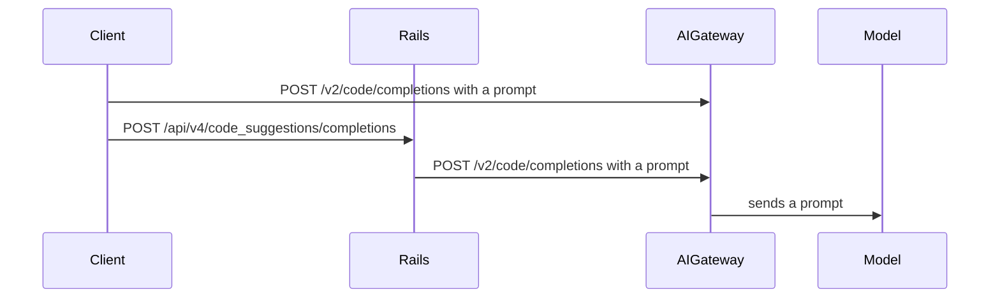
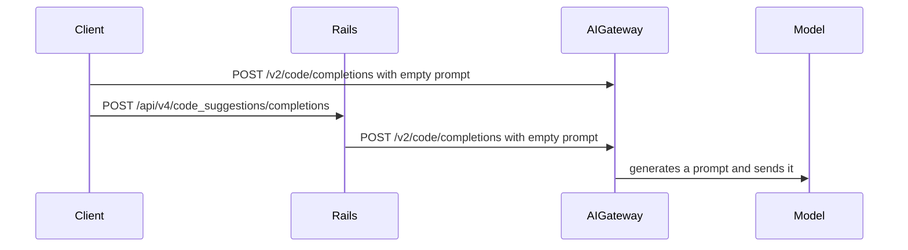
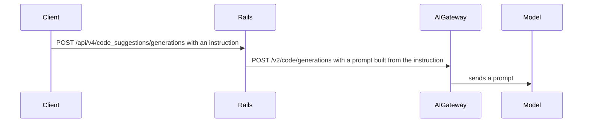
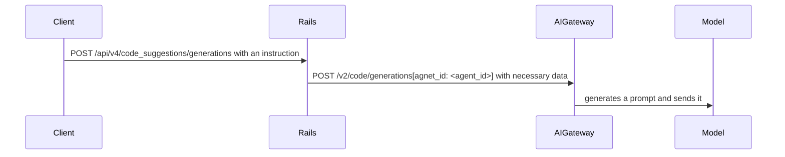
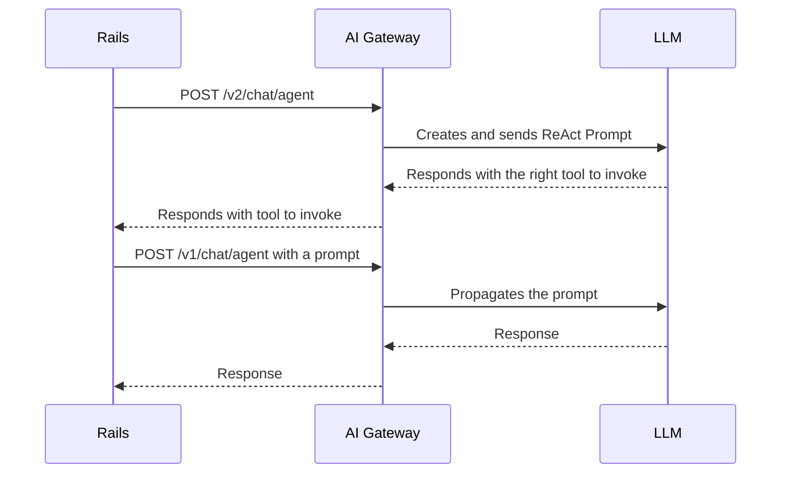
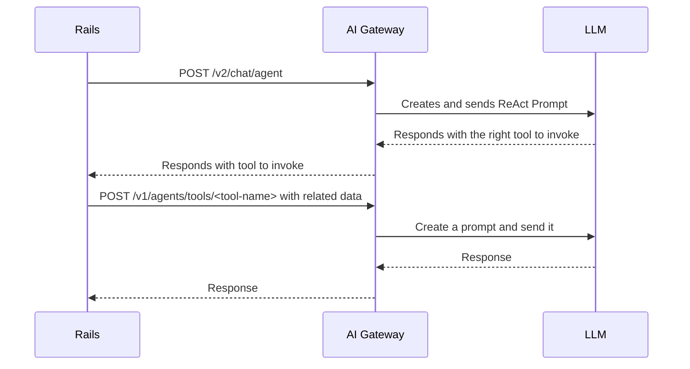

<div class="my-3 border-l-4 border-blue-500 bg-blue-50 px-4 py-3 rounded-r text-sm text-blue-800">
このページには今後予定されている製品・機能・機能性に関する情報が含まれています。ここに示す情報は参考目的のみです。購入・計画の決定にこの情報を使用しないでください。製品・機能・機能性の開発、リリース、タイミングは変更または延期される可能性があり、GitLab Inc. の独自の判断に委ねられています。
</div>

<div class="overflow-x-auto my-4">
<table class="w-full text-sm border-collapse">
<thead>
<tr class="bg-gray-100 text-left">
<th class="px-3 py-2 border border-gray-300">Status</th>
<th class="px-3 py-2 border border-gray-300">Authors</th>
<th class="px-3 py-2 border border-gray-300">Coach</th>
<th class="px-3 py-2 border border-gray-300">DRIs</th>
<th class="px-3 py-2 border border-gray-300">Owning Stage</th>
<th class="px-3 py-2 border border-gray-300">Created</th>
</tr>
</thead>
<tbody>
<tr>
<td class="px-3 py-2 border border-gray-300"><span class="inline-block rounded px-2 py-0.5 text-xs font-medium bg-gray-100 text-gray-700">ongoing</span></td>
<td class="px-3 py-2 border border-gray-300"><a href="https://gitlab.com/igor.drozdov" class="text-blue-600 hover:underline">@igor.drozdov</a></td>
<td class="px-3 py-2 border border-gray-300"><a href="https://gitlab.com/shekharpatnaik" class="text-blue-600 hover:underline">@shekharpatnaik</a></td>
<td class="px-3 py-2 border border-gray-300"><a href="https://gitlab.com/sean_carroll" class="text-blue-600 hover:underline">@sean_carroll</a>, <a href="https://gitlab.com/oregand" class="text-blue-600 hover:underline">@oregand</a></td>
<td class="px-3 py-2 border border-gray-300"><span class="inline-block rounded px-2 py-0.5 text-xs font-medium bg-gray-100 text-gray-700">~devops::ai-powered</span></td>
<td class="px-3 py-2 border border-gray-300">2024-07-22</td>
</tr>
</tbody>
</table>
</div>


## 概要

LLM プロンプトは既存の Ruby の専門知識を活用し、AI Gateway が進化する中で Rails コードベースで開発されました。AI Gateway が GitLab インフラストラクチャの安定した重要な部分となった今、プロンプトを Rails から AIGW に移行できます。Rails モノリスは永続性と制御のレイヤーとして残り、AI 機能は AI Gateway のプロンプトとラッパーコードを参照する薄いエントリポイントになります。Rails モノリスはまた、参照されるプロンプトに必要なすべてのパラメーターを渡す必要があります。プロンプト定義は Python ラッパー付きで AI Gateway の YAML ファイルに移動されます。GitLab AI 機能は評価中に変更されないことが期待されます。

## 動機

プロンプトを AI Gateway に移動することには以下の利点があります:

- Python で書かれたデータサイエンスライブラリへのネイティブアクセス
- Ruby コードを変更したり GitLab Rails をアップグレードしたりせずに AI 機能とプロンプトをイテレーションする機能
- AI Gateway への直接アクセスを持つクライアントは Rails に依存してプロンプトを取得したりプロンプトロジックを複製したりする必要がない
- 単一の場所に保存されたプロンプトデータを維持・分析する機能

### ゴール

- GitLab Rails Ruby コードからプロンプトの大部分を AI Gateway の YAML ファイルに移行する
- 既存の AI 機能を保持する: 製品カバレッジ、パフォーマンス、可観測性
- 使用されなくなったプロンプトをクリーンアップする（[例](https://gitlab.com/gitlab-org/gitlab/-/issues/469377)）

## 提案

[エージェント](https://docs.gitlab.com/ee/development/ai_features/#2-create-an-agent-definition-in-the-ai-gateway)を使用して、与えられた情報とエージェント定義に基づいてモデルリクエストを実行する機能を実装します。エージェント定義は YAML ファイルに保存されます: プロンプトテンプレート、モデルとクライアント情報、LLM パラメーター。

[エージェント](https://docs.gitlab.com/ee/development/ai_features/glossary.html#duo-workflow-terminology)はさまざまなタスクを実行する AI 駆動のエンティティです。このブループリントのコンテキストでは、AI Gateway で[実装された](https://gitlab.com/gitlab-org/modelops/applied-ml/code-suggestions/ai-assist/-/tree/main/ai_gateway/agents?ref_type=heads)エージェントを参照します: 基本的に定義されたプロンプトテンプレートを見つけ、渡されたパラメーターで実行するエンティティです。

エージェント機能は、汎用エンドポイントを使用する、個別のエンドポイントを定義する、または既存のエンドポイントを拡張してエージェントを使用するなどの方法で公開できます。

### 汎用エンドポイントの使用

[Issue の説明を生成する](https://gitlab.com/gitlab-org/gitlab/-/merge_requests/152429)は、エージェント ID と[パラメーター](https://gitlab.com/gitlab-org/modelops/applied-ml/code-suggestions/ai-assist/-/blob/61f45843f759345f884f4b902cf20390a4682cae/ai_gateway/api/v1/agents/invoke.py#L14)を受け付ける汎用の[`v1/agents/{agent_id}`](https://gitlab.com/gitlab-org/modelops/applied-ml/code-suggestions/ai-assist/-/blob/61f45843f759345f884f4b902cf20390a4682cae/ai_gateway/api/v1/agents/invoke.py#L25)エンドポイントを使用します。

エージェント ID はプロンプト定義の場所を示します。たとえば、`v1/agents/chat/explain_code` は `ai_gateway/agents/definitions/chat/explain_code` フォルダーにプロンプトを見つけることを期待します。プロンプトの新しいバージョンが導入された場合、新しいエンドポイントからアクセスできます。たとえば、`v1/agents/chat/explain_code/v1` は `ai_gateway/agents/definitions/chat/explain_code` フォルダーに定義を探します。

パラメーターはエージェント定義のプロンプトテンプレートに直接送信されます。パラメーターが欠落している場合はエラーが発生します。したがって、プロンプトテンプレートが新しいパラメーターを含むように変更された場合、それは破壊的な変更であり、プロンプトの新しいバージョンが推奨されます。

### 個別のエンドポイントの定義

[Duo Chat React](https://gitlab.com/gitlab-org/gitlab/-/issues/456258) は複雑な機能で前処理と後処理が必要なため、[`v2/chat/agent`](https://gitlab.com/gitlab-org/modelops/applied-ml/code-suggestions/ai-assist/-/blob/61f45843f759345f884f4b902cf20390a4682cae/ai_gateway/api/v2/chat/agent.py)を使用します。

プロンプトバージョンはエンドポイントに渡されるパラメーターで制御できます。

### 既存のエンドポイントの拡張

[コードコンプリーション](https://gitlab.com/gitlab-org/gitlab/-/issues/473156)は既存の[`v2/code/completions`](https://gitlab.com/gitlab-org/modelops/applied-ml/code-suggestions/ai-assist/-/blob/61f45843f759345f884f4b902cf20390a4682cae/ai_gateway/api/v2/code/completions.py#L150)エンドポイントを拡張してエージェントを使用します。これにより、既存の機能を壊すリスクを低減しながら、複雑な機能の段階的な移行が可能になります。

プロンプトバージョンは既存のまたは新しいパラメーターでエンドポイントに渡すことで制御できます。

## イテレーション計画

[AI Gateway へのプロンプト移行](https://gitlab.com/groups/gitlab-org/-/epics/14259)で進捗を追跡しています。

- [カスタムモデルのコードコンプリーション/生成プロンプトを移行](https://gitlab.com/groups/gitlab-org/-/epics/14430)。カスタムモデルがバックアップする機能は実験/ベータ段階であり、既存の顧客のエクスペリエンスを低下させるリスクが低い。
  - GA モデルのコードコンプリーション/生成プロンプトを移行する。
- Duo Chat ReAct プロンプトを移行する（現在[進行中](https://gitlab.com/gitlab-org/gitlab/-/issues/456258)）。
  - カスタムモデルの Duo Chat ReAct プロンプトを移行する
- [カスタムモデルの Duo Chat ツールプロンプトを移行](https://gitlab.com/groups/gitlab-org/-/epics/14431)。カスタムモデルがバックアップする機能は実験/ベータ段階であり、既存の顧客のエクスペリエンスを低下させるリスクが低い。
  - GA モデルのコードコンプリーション/生成プロンプトを移行する。
- 他の Duo 機能を移行する。

## 設計と実装の詳細

### プロンプト定義

エージェントは [AI Gateway](https://gitlab.com/gitlab-org/modelops/applied-ml/code-suggestions/ai-assist) の [ai_gateway/agents/definitions](https://gitlab.com/gitlab-org/modelops/applied-ml/code-suggestions/ai-assist/-/tree/main/ai_gateway/agents/definitions) で定義されています。定義は機能ごとのフォルダーに保存された `.yml` ファイルです: `generate_issue_description` または `chat/react` または `code_suggestions/generations/v2`。フォルダーがエージェント ID です。

YAML ファイルの名前は、プロンプトが定義されているモデルの名前または `base.yml` のいずれかです: `code_suggestions/completions/codegemma.yml` または `chat/react/base.yml`。モデルメタデータを渡すことで特定のモデルのエージェント定義がリクエストされた場合、そのモデルの定義が使用されます; それ以外の場合はベース定義が使用されます。

このフォルダー構造はバージョニングもサポートします。たとえば、`v2` サブフォルダーを機能フォルダーに作成し、すべてのモデルの新しいプロンプトを含めることができます: `code_suggestions/generations/v2/base.yml` と `code_suggestions/generations/v2/mistral.yml`。この機能は、フィーチャーフラグなどの条件に基づいて新しいプロンプトを指すために、`code_suggestions/generations` の代わりにエージェント ID として `code_suggestions/generations/v2` を使用します。

その結果、定義は以下の構造で保存されます:

```yaml
ai_gateway/agents/definitions

chat
  react
    base.yml
    mistral.yml
  explain_code
    base.yml
    mistral.yml
code_suggestions
  completions
    base.yml
    codegemma.yml
    codestral.yml
  generations
    v2
      base.yml
      mistral.yml
    base.yml
    mistral.yml
...
```

この構造には以下の利点があります:

- 関連する機能をグループ化できる。たとえば（`code-completions` と `code-generations`）
- 機能はフォルダー内にプロンプトの複数のバージョンを含められる
- 異なるフォルダーに機能を置くことで同じ名前の機能の曖昧さを解決できる: たとえば、`explain-code` ツールと `explain-code` 機能

定義は継承を導入することで潜在的に改善できます。機能がすべてのモデルでほぼ同じ定義を持つ場合、ベース定義から継承またはインクルードして拡張できます。

#### バージョニング

プロンプトをバージョン管理することで、機能開発者が使用するプロンプトを不変の値に固定でき、他の開発者がイテレーションを安全に行えるようになり、[これによりリグレッションが発生しないことが保証されます](https://gitlab.com/groups/gitlab-org/-/epics/15816)。たとえば、[Mistral プロンプトの上流 Claude プロンプトへの変更により、Duo Chat のカスタムモデルプロンプトが壊れました](https://gitlab.com/gitlab-org/gitlab/-/issues/498290)。

##### セマンティックバージョニングを使用する理由

プロンプトのバージョン管理にセマンティックバージョニングを使用します。各バージョンはターゲットプロンプト内のファイルです。セマンティックバージョンを使用することで、互換性に関する期待を伝えることができます:

- パッチバンプは後方互換性のあるプロンプトの修正を意味します。
  - 例: [不要な `\n` の削除](https://gitlab.com/gitlab-org/modelops/applied-ml/code-suggestions/ai-assist/-/merge_requests/1589)
- マイナーバンプは API の変更が不要な機能の追加を意味します
  - 例: テンプレートに新しいパラメーターが追加されるがデフォルトが提供される
- メジャーバンプは後方互換性のない変更を意味します:
  - 例: テンプレートプロンプトに新しいパラメーターがあるがデフォルトを提供できない

これらのバージョンはプロンプトの消費者に固定されているため、新しいイテレーションは既存のリリースされた機能に影響を与えません。

セマンティックバージョニングを使用することのもう 1 つの利点は、バージョンを解決するための豊富な[ツール](https://pypi.org/project/semantic-version/)が利用可能なことです。特定のバージョンを受け取る代わりに、AIGW はスペックに基づいてバージョンを解決できます（たとえば、`1.x` はメジャーが 1 の最も高い安定バージョンをフェッチします）。

##### バージョン構造

gpt のコンプリーションをサポートするプロンプトの `1.0.0` と `2.0.0`、claude_3 の `1.0.0` と `1.0.1`、デフォルトモデルの `1.0.0` のみがある場合、バージョン管理されたプロンプトディレクトリは次のようになります:

```yaml
definitions/
  code_suggestions/
    completion/
      gpt/
        1.0.0.yml
        1.0.0-rc.yml
        2.0.0.yml
      claude_3/
        1.0.0.yml
        1.0.1.yml
    partials/
      completion/
        user/
          1.0.0.yml
```

##### バージョンの固定

クライアントはプロンプトの特定の範囲を提供して、自動的に使用したい更新（パッチ、マイナー）を示す必要があります。ほとんどの AI 機能では、これは Rails アプリでバージョン範囲を設定することを意味します（例: `^1.0`）。これにより、フィーチャーフラグを使用してバージョン変更を制御することもできます。コードコンプリーションなどのいくつかの機能では、それぞれのクライアント（例: VSCode 拡張、GitLab Language Server など）で範囲を設定する必要があります。

##### 新しいバージョンのリリースとバージョンの期待値

リリース候補（`-alpha`、`-beta`、`-rc`）はバージョンリゾルバーによって無視され、手動で指定する必要があります。それらは不変である必要はなく、フィーチャーフラグの背後で新しい機能や修正をテストするのに役立ちます:

```ruby
def prompt_version
  return '1.0.1-rc' if Feature.enabled?(:feature_fix)

  '^1.0'
end
```

これにより、セルフホストインスタンスがテスト済みの更新を引き続き受け取ることができます: セルフホストは安定版のみをフェッチし、CEF での評価も同様です。

リリース候補プロンプトの結果が期待値に一致したら、サフィックスを削除できます。この時点でバージョンは不変になります。これはフィーチャーフラグで使用量がテストされ、かつ評価が実行・考慮された後に行うことができます。

一部のプロンプトは異なる機能にわたってパーツを再利用するためにテンプレートパーシャルも使用します: これらも変更が複数の異なる機能に影響を与える可能性があるため、バージョン管理が必要です。プロンプトパーシャルの新しいバージョンをリリースするには、まずパーシャルのリリースバージョンを作成し、そのパーシャルをメインプロンプトの新しいリリースバージョンで言及してください。

##### 移行プロセス

この変更は最初はフィーチャーチームによるアクションを必要としません。変更は自動化されます: 現在のプロンプトディレクトリは自動的に移行され、すべてのプロンプトに初期バージョンとして `1.0.0` が割り当てられます。クライアントによってリクエストされるバージョンも、提供されていない場合は `1.0.0` になります。この方法で、変更は最初はフィーチャーチームに対して透明です。ただし、プロンプトバージョニングへの移行が行われると、バージョニングの期待値が強制されます。

移行作業は[このエピック](https://gitlab.com/groups/gitlab-org/-/epics/15837)でハイライトされています

##### 欠点

- GitLab では連続するバージョン間の差分がありません。コマンドラインを使用してファイル間の差分を取ることは依然として可能です。

- プロンプトファイルの不変性はワークフローに合わない可能性があり、作成される新しいファイルが多すぎることになるかもしれません。代替として、パッチの要件を緩和して、マイナーアップデートでのみ新しいファイルを作成することができます。

両方の欠点は、バージョンアップデートが新しいファイルではなく新しいコミットになるように、プロンプトを独自のリポジトリに移動することで対処できます。

### コードコンプリーション

#### 現在の動作

コードコンプリーションリクエストは以下のいずれかで行われます:

- Rails を通じてプロンプトを生成し AI Gateway に送信
- 直接アクセスが有効な場合、AI Gateway に直接送信



#### 提案

コードコンプリーションは空または nil のプロンプトと、プロンプトが AI Gateway によって生成される必要があることを示す追加データを送信します。AI Gateway はリクエストデータを使用して自らプロンプトを生成し、モデルに送信します:



#### PoC

- この [MR](https://gitlab.com/gitlab-org/modelops/applied-ml/code-suggestions/ai-assist/-/merge_requests/1063) は、エージェントを使用してプロンプトをビルド・実行する既存の `/v2/code/completions` の拡張を示しています。
- この[コラボレーション Issue](https://gitlab.com/gitlab-org/gitlab/-/issues/473156)にはエンドポイント使用の詳細が含まれています。

### コード生成

#### 現在の動作

コード生成リクエストは Rails を通じてプロンプトを生成し、AI Gateway に送信します:



#### 提案

コード生成はユーザーの指示のみを含むリクエストと追加データを送信し、AI Gateway がモデルに送信するプロンプトを生成します。



コード生成では、コード生成の追加情報を渡すために `prompt` フィールドを使用できるため、エージェント使用を示すために null 化できません:

- エージェントの使用とプロンプトの場所を示すために `agent_id` フィールドを使用する
- 最終的に、`prompt` フィールドにはユーザーの指示のみを含む
- 最初のイテレーションでは、プロンプト全体を渡し、その後 Rails プロンプトのさまざまな部分を AI Gateway に段階的に移行できる

#### PoC

- この [PoC](https://gitlab.com/gitlab-org/modelops/applied-ml/code-suggestions/ai-assist/-/merge_requests/1096) は、エージェントを使用してプロンプトをビルド・実行する既存の `/v2/code/generations` の拡張を示しています。
- この[コラボレーション Issue](https://gitlab.com/gitlab-org/gitlab/-/issues/473394)にはエンドポイント使用の詳細が含まれています。

### Duo Chat ツール

#### 現在の動作

Rails は AI Gateway から呼び出すツールに関する情報を受け取り、プロンプトを生成して AI Gateway に送信します。



#### 提案

Rails は AI Gateway から呼び出すツールに関する情報を受け取り、プロンプトを生成するためのすべての関連データを AI Gateway に送信します。AI Gateway はプロンプトを生成して LLM にリクエストを送信します。



プロンプトの新しいバージョンが導入された場合（`ai_gateway/agents/definitions/chat/explain_code/v1` など）、`/v1/agents/tools/<tool-name>/<version>` エンドポイントが呼ばれます。

#### PoC

これらの [Rails](https://gitlab.com/gitlab-org/gitlab/-/merge_requests/160252) と [AI Gateway](https://gitlab.com/gitlab-org/modelops/applied-ml/code-suggestions/ai-assist/-/merge_requests/1132) の MR はエージェントを介したチャットツールの実行を示しています。

他のツールを移行することは以下に集約されます:

- [Rails](https://gitlab.com/gitlab-org/gitlab/-/merge_requests/160252/diffs?commit_id=94fe5361f0c9815639b0e0471f68189445c25f80) でユニットプリミティブを定義してフィーチャーフラグを作成する
- [AI Gateway](https://gitlab.com/gitlab-org/modelops/applied-ml/code-suggestions/ai-assist/-/merge_requests/1132/diffs?commit_id=aaaee478eddeccd4fb51cefc1491ec2ad3b7e36f) にプロンプトを追加する
- フィーチャーフラグが有効になった後に Rails 部分をクリーンアップする

## テストと検証の戦略

理想的には、移行はプロンプトや LLM パラメーターを変更すべきではありません。そのため、テストと検証の戦略は、移行の前後でモデルへのリクエストが同一であることを確認することに集約されます。

Anthropic モデルの場合、以下の環境変数を使用して AI Gateway を実行し、Anthropic サーバーに送信されるパラメーターが同じであることを確認します:

```bash
ANTHROPIC_LOG=debug poetry run ai_gateway
```

LiteLLM モデルの場合、[詳細デバッグ](https://docs.litellm.ai/docs/proxy/debugging#detailed-debug)を有効にして[プロキシ](https://docs.gitlab.com/ee/administration/self_hosted_models/litellm_proxy_setup.html#example-setup-with-litellm-and-ollama)を実行し、モデルに送信されるパラメーターが同じであることを確認します:

```bash
litellm --detailed_debug
```

プロンプトまたは LLM パラメーターが変更された場合、ロールアウト前に追加の評価が推奨されます（[例](https://gitlab.com/gitlab-org/gitlab/-/issues/470819)）。

## ロールアウト計画

ロールアウト計画は個々の機能によって異なりますが、以下のコラボレーション Issue を例として使用できます:

- [コード生成](https://gitlab.com/gitlab-org/gitlab/-/issues/473394)
- [コードコンプリーション](https://gitlab.com/gitlab-org/gitlab/-/issues/473156)

変更はフィーチャーフラグの背後で導入される必要があります:

- 機能が実験/ベータ段階で単一の論理セクション（カスタムモデルなど）にグループ化できる場合、単一のフィーチャーフラグを使用できます。
- 機能が GA の場合、機能ごとに個別のフィーチャーフラグが推奨されます。
