<div class="my-3 border-l-4 border-blue-500 bg-blue-50 px-4 py-3 rounded-r text-sm text-blue-800">
このページには今後予定されている製品・機能・機能性に関する情報が含まれています。ここに示す情報は参考目的のみです。購入・計画の決定にこの情報を使用しないでください。製品・機能・機能性の開発、リリース、タイミングは変更または延期される可能性があり、GitLab Inc. の独自の判断に委ねられています。
</div>

<div class="overflow-x-auto my-4">
<table class="w-full text-sm border-collapse">
<thead>
<tr class="bg-gray-100 text-left">
<th class="px-3 py-2 border border-gray-300">Status</th>
<th class="px-3 py-2 border border-gray-300">Authors</th>
<th class="px-3 py-2 border border-gray-300">Coach</th>
<th class="px-3 py-2 border border-gray-300">DRIs</th>
<th class="px-3 py-2 border border-gray-300">Owning Stage</th>
<th class="px-3 py-2 border border-gray-300">Created</th>
</tr>
</thead>
<tbody>
<tr>
<td class="px-3 py-2 border border-gray-300"><span class="inline-block rounded px-2 py-0.5 text-xs font-medium bg-gray-100 text-gray-700">proposed</span></td>
<td class="px-3 py-2 border border-gray-300"><a href="https://gitlab.com/patrickbajao" class="text-blue-600 hover:underline">@patrickbajao</a>, <a href="https://gitlab.com/igor.drozdov" class="text-blue-600 hover:underline">@igor.drozdov</a>, <a href="https://gitlab.com/jerasmus" class="text-blue-600 hover:underline">@jerasmus</a>, <a href="https://gitlab.com/iamphill" class="text-blue-600 hover:underline">@iamphill</a>, <a href="https://gitlab.com/slashmanov" class="text-blue-600 hover:underline">@slashmanov</a>, <a href="https://gitlab.com/psjakubowska" class="text-blue-600 hover:underline">@psjakubowska</a>, <a href="https://gitlab.com/thomasrandolph" class="text-blue-600 hover:underline">@thomasrandolph</a></td>
<td class="px-3 py-2 border border-gray-300"><a href="https://gitlab.com/ntepluhina" class="text-blue-600 hover:underline">@ntepluhina</a></td>
<td class="px-3 py-2 border border-gray-300"></td>
<td class="px-3 py-2 border border-gray-300"><span class="inline-block rounded px-2 py-0.5 text-xs font-medium bg-gray-100 text-gray-700">~devops::create</span></td>
<td class="px-3 py-2 border border-gray-300">2023-10-10</td>
</tr>
</tbody>
</table>
</div>


## 概要

GitLab の Diff は複数の場所にわたって存在しており、それぞれのエリアが独自の方法を使用しています。私たちはアプリケーション全体で Diff をレンダリングするための、単一で高パフォーマンスな方法を開発することを目指しています。私たちの目標は、バックエンドでの Diff 作成からフロントエンドでの Diff レンダリングまで、Diff レンダリングのすべてのエリアを改善することです。

このドキュメントに関連するすべての Diffs 機能は[専用ページ](features.md)に一覧化されています。

## 作業の内訳

[Rapid Diffs の作業](https://gitlab.com/groups/gitlab-org/-/epics/13236)は 3 つのステージに分割され、以下のエピックで追跡できます:

1. [ステージ 0 — 基盤](https://gitlab.com/groups/gitlab-org/-/epics/13764):
    - 基盤となるコンポーネントを整備する。
    - MR、コミット、リビジョン比較ページで Diff をストリームする。
1. [ステージ 1 — ベースライン機能](https://gitlab.com/groups/gitlab-org/-/epics/13765):
    - ほとんどの機能が動作している（ディスカッション、ナビゲーション、レビューなど）
1. [ステージ 2 — プロダクション対応](https://gitlab.com/groups/gitlab-org/-/epics/13767):
    - Rapid Diffs に対する Feature spec がパスする
    - 完全なアクセシビリティ準拠

## 動機

### 目標

- 知覚パフォーマンスの向上
- 保守性の向上
- すべてのシナリオの一貫したカバレッジ

### 非目標

<!--
Listing non-goals helps to focus discussion and make progress. This section is
optional.

- What is out of scope for this blueprint?
-->

この取り組みは以下を行いません:

- マージリクエストやリポジトリコミットにおける Diff の現在の実装の改善点の特定

### 目標の優先順位

一貫した選択をするための指針として、すべての目標が重要である中でもより重要な目標について示します。以下の順序を定めました。

**知覚パフォーマンス** > **保守性の向上** > **一貫したカバレッジ**

例:

- 提案が知覚パフォーマンスを犠牲にして保守性を向上させる: ❌ 代替案を検討すべきです。
- 提案が特定のコンテキストから機能を削除してカバレッジを損なわせ、知覚パフォーマンスや保守性に影響を与えない: ❌ 再検討すべきです。
- 提案が知覚パフォーマンスを向上させるが、特定の使用コンテキストから機能を削除する: ✅ 有効であり、Product/UX と議論すべきです。
- 提案が一貫したカバレッジを保証し、知覚パフォーマンスや保守性に影響を与えない: ✅ 有効です。

本質的には、各決定でどの目標も達成するよう努めますが、より優先度の高いものを優先します。

## プロセス

### ワークスペース & 成果物

- メトリクス、バジェット、開発 & アーキテクチャパターンなどの実装の詳細をここのドキュメントに保存します
- 大量の調査、監査の結果などを [RRD プロジェクト](https://gitlab.com/gitlab-com/create-stage/new-diffs)の[wiki](https://gitlab.com/gitlab-com/create-stage/new-diffs/-/wikis/home) に保存します
- 音声 & ビデオ録音を[コードレビュー / RRD プレイリスト](https://www.youtube.com/playlist?list=PL05JrBw4t0KpZ3yR2eN0Sh9Bn073HU093)の公開 YouTube チャンネルに保存します
- ドラフト、会議メモ、その他の一時的なドキュメントを公開 Google ドキュメントに保存します

## 提案

<!--
This is where we get down to the specifics of what the proposal actually is,
but keep it simple!  This should have enough detail that reviewers can
understand exactly what you're proposing, but should not include things like
API designs or implementation. The "Design Details" section below is for the
real nitty-gritty.

You might want to consider including the pros and cons of the proposed solution so that they can be
compared with the pros and cons of alternatives.
-->

ここで提案された新しいアプローチは、[過去に行ってきたこと](#alternative-solutions)を以下のように変更します:

1. Diff レンダリングに仮想スクロールを使用するのをやめる。
1. レンダリング作業のほとんどをサーバーに移動する。
1. クライアントでサーバーレンダリングされた HTML を拡張する。
1. Diff をレンダリングするすべてのページ（マージリクエスト、リポジトリコミット、リビジョン比較など）で Diffs コードベースを統一する。

## 定義

### 保守性

保守可能なプロジェクトはシンプルなプロジェクトです。

シンプルさは複雑さの反対です。これは Rich Hickey が ["Simple Made Easy"](https://www.infoq.com/presentations/Simple-Made-Easy/)（Strange Loop、2011）で説明したシンプルと複雑の定義を使用しています。

- 保守可能なコードはシンプルです（単一のタスク、単一の概念、他のものから分離されている）。
- 保守可能なプロジェクトはシンプルなコードに基づき、シンプルな構造を持ちます（フォルダが動作のクラスを定義する。例えば、コンポーネントディレクトリは視覚的な表示とデータアクセスを混在させることになるため、ネットワーク呼び出しを決して開始しないことが保証される）
- 保守可能なアプリケーションはシンプルな組織とシンプルなコードから生まれます。古い諺に「散らかった机は散らかった心の表れ」というものがあります。シンプルさに対する厳格な規律は私たちのアウトプット（製品）に反映されます。シンプルに取り組むことで、ユーザーが自分の行動をより簡単に推論できるアプリケーションを自然に生み出します。

### 完了

GitLab には MR がマージ準備できているかどうかを主に特定することを目的とした既存の[完了の定義](https://docs.gitlab.com/ee/development/contributing/merge_request_workflow.html#definition-of-done)があります。

GitLab の完了の定義の項目に加えて、RRD の作業は以下の要件にも準拠する必要があります:

- すべてのメトリクスを達成または超えている
  - 最小アクセシビリティメトリクスを達成または超えている（これらは定義された優先事項の一部ではありません。交渉の余地がないためです）
- すべての作業がエンジニア向けに完全にドキュメント化されている（ユーザードキュメントは標準的な完了の定義の要件です）

## 受け入れ基準

成功を測るために、意味のあるメトリクスを設定する必要があります。これらのメトリクスはエンドユーザーに意味のあるポジティブな影響を与える必要があります。

1. [WCAG 2.2 AA](https://www.w3.org/TR/WCAG22/) を達成または超えている。
1. [ATAG 2.0 AA](https://www.w3.org/TR/ATAG20/) を達成または超えている。
1. RRD アプリは 300 KiB 以下の JavaScript（圧縮済み / "伝送時"）を読み込む<sup>1</sup>。
1. RRD アプリは 150 KiB 以下のマークアップ、画像、スタイル、フォントなど（圧縮済み / "伝送時"）を読み込む<sup>1</sup>。
1. 最初の Diff 表示までの時間（`mr-diffs-mark-first-diff-file-shown`）は、1000 行以下の変更の Diff では 1.5 秒前に発生する。1000 行以上の変更では 2 秒。
1. 完全読み込み（すべての Diff がレンダリングされた）のメトリクスは、最大 20 ファイルおよび 700 行の変更の Diff で 25〜40% の改善を記録する。詳細は[改善計算式](#fully-loaded-improvement-formula)を参照。
1. RRD アプリは GitLab 製品の残りから完全に隔離された状態で実行できる:
   1. 「実行」とはアプリが読み込み、データを表示し、ユーザーインタラクションを許可する（「読み取り専用」）ことを意味する。
   1. アプリケーションの一部がマージリクエストまたは Diff でのみ使用される場合、Diffs アプリケーションの一部と見なされる。
   1. アプリケーションの一部が製品の残りから取り込まれる必要がある場合、Diffs の読み込み（メトリクス 3 と 4 で定義）の一部とは見なされない。
   1. アプリケーションの一部が製品の残りから取り込まれる必要がある場合、Diffs アプリケーションの機能をブロックしてはならない。
   1. アプリケーションの一部が製品の残りから取り込まれる必要がある場合、非同期で読み込まれる必要がある。
   1. アプリケーションの一部が 5.1〜5.5 を満たし（例: Markdown エディターはユーザーが Diff にコメントを残したいときに非同期で読み込まれる）、その組み込みがバジェットオーバーフローを引き起こす場合:
      - バジェット超過を受け入れ、私たちの制御範囲外であることを文書化した例外リストに追加される必要がある。
      - 例外リストはバジェット超過の継続的な価値を判断するために定期的に対処される必要がある。

---
<sup>1</sup>: [The Performance Inequality Gap, 2023](https://infrequently.org/2022/12/performance-baseline-2023/)

### 完全読み込み改善計算式 {#fully-loaded-improvement-formula}

<details>
<summary>クリックして展開</summary>

Diff 行に基づく改善の期待される進行は以下を使用して計算できます:

```math
Improvement(N) = 3 + 5.5 × ln(N)
```

ここで:

- `N` = Diff の行数
- `Improvement(N)` はパーセンテージで表される
- `ln(N)` は N の自然対数

例:

- `Improvement(60) => 25.5%`
- `Improvement(100) => 28.3%`
- `Improvement(250) => 33.4%`
- `Improvement(500) => 37.2%`
- `Improvement(700) => 39.0%`
- `Improvement(1000) => 41%`

</details>

### フロントエンド

理想的には、最初の試みで完了の定義と説明責任メトリクスを達成したいと思います。
また、前進するにつれてそれらの境界内に留まり続ける必要があります。これを確保するために、以下のアプリケーションアーキテクチャを設計する必要があります:

1. 以下である:
   1. スケーラブル。
   1. 柔軟性がある。
   1. 融通が利く。
1. GitLab 製品全体のミッションクリティカルな部分として自己認識する。
1. 製品の他の部分の副作用として対処できない懸念事項を持つ複雑なユニークなアプリケーションとして自己認識する。
1. UI の変更なしにデータアクセス/フォーマットの変更を処理できる。
1. データアクセス/フォーマットの変更なしに UI の変更を処理できる。
1. フック可能でインスペクタブルな API を提供し、コードの結合を避ける。
1. 以下を分離する:
    - 状態とアプリケーションデータ。
    - アプリケーションの動作と UI。
    - データアクセスとネットワークアクセス。

## 設計と実装の詳細

### 概要

再利用可能なラピッド Diffs はフロントエンドとバックエンドの両方の責任を変更します。

バックエンドは以下を行います:

1. Diffs データを準備する。
1. Diff 行をハイライトする。
1. Diffs を HTML としてレンダリングしブラウザにストリームする。
1. Diffs メタデータを最終レスポンスに埋め込む。

フロントエンドは以下を行います:

1. 既存および将来の Diffs HTML を拡張する。
1. ストリームされた Diffs HTML を処理する。
1. ユーザーインタラクションを可能にするダイナミックなコントロールで Diffs HTML を拡張する。

#### 静的と動的の分離

懸念の分離を達成するために、ページ上の静的と動的な UI を区別する必要があります:

- 静的なものはすべてサーバーで常にレンダリングされる必要がある。
- 動的なものはすべてクライアントで拡張される必要がある。

ページと共に提供されるべきデータ:

- 静的な Diff ファイルメタデータ: ビューアの種類、追加・削除された行など。
- 編集権限

追加のリクエストを通じて提供されるべきデータ:

- ディスカッション
- ファイルブラウザツリー
- 行拡張 HTML
- フルファイル HTML
- コード品質
- コードカバレッジ
- その他すべて

行拡張とフルファイル表示機能には HTML を返す必要があります。
他のリクエストは JSON 形式の正規化されたデータを返す必要があります。

コードサジェスト機能は、現在の実装と同様に Diff の既存の HTML を使用する必要があります。

#### パフォーマンス最適化

ページの知覚パフォーマンスを向上させるために、以下のテクニックを実装する必要があります:

1. 最初にページにレンダリングされる Diff の数を制限する。
1. [HTML ストリーミング](https://gitlab.com/gitlab-org/frontend/rfcs/-/issues/101)を使用して残りの Diff をレンダリングする。
   1. ページに表示される Diff ファイルにフックするために Web Components を使用する。
1. 再描画のオーバーヘッドを削減するために可能な限り `content-visibility` を適用する。
1. Diff ディスカッションを非同期でレンダリングする。

#### ページ & データフロー

これらのダイアグラムは Diff を表示し、ユーザーインタラクションとユーザー送信データを収集・保存するために必要なフローを文書化しています。
言い換えれば、このページは Diff を表示し、ユーザーが Diff でコラボレーションできる完全でインタラクティブなアプリケーションの双方向データフローを文書化しています。

##### クリティカルフェーズ

1. Gitaly
1. Database
1. Diff Storage
1. Cache
1. バックエンド
1. Web API
1. フロントエンド*

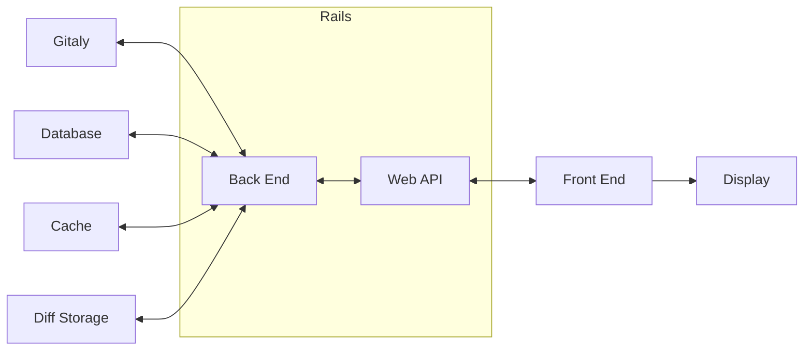

<sup>\*</sup>: フロントエンドは多くの未探索フェーズを隠しています。フロントエンドにはキャッシュ、データベース、API 抽象化（ネットワーク接続などのサブモジュールに対する）などが必要になる可能性があります。これらは拡張されていませんが、「フロントエンド」はここでそのすべての複雑さを表しています。

###### Gitaly

Diff を取得するために、Gitaly は 2 つの基本的なユーティリティを提供しています:

1. 一連のリビジョンに対して、関連する変更前後のイメージの blob ID と共に変更されたファイルのリストを取得する。
1. 変更前後のイメージの blob ID を使用して、指定されたファイルの任意のセットに対する Git diff のセットを取得する。

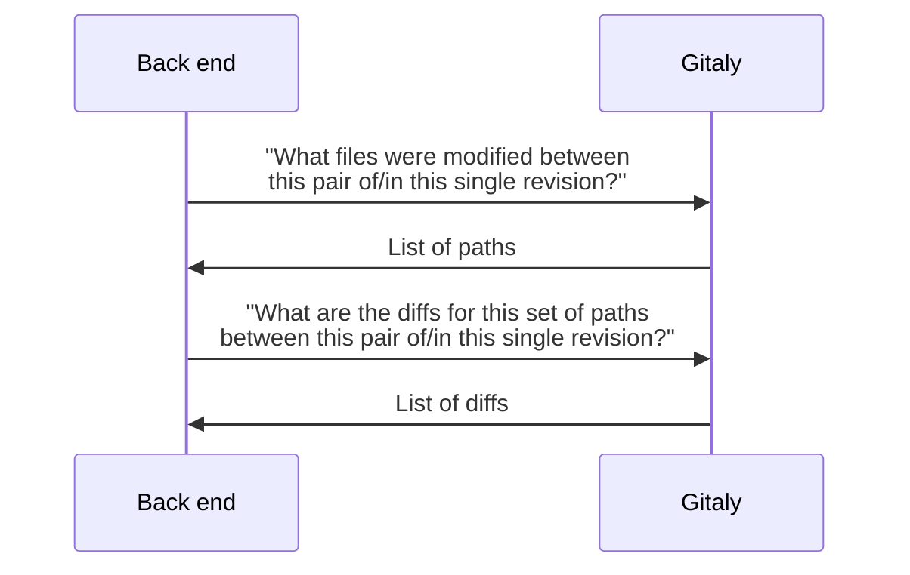

###### Database

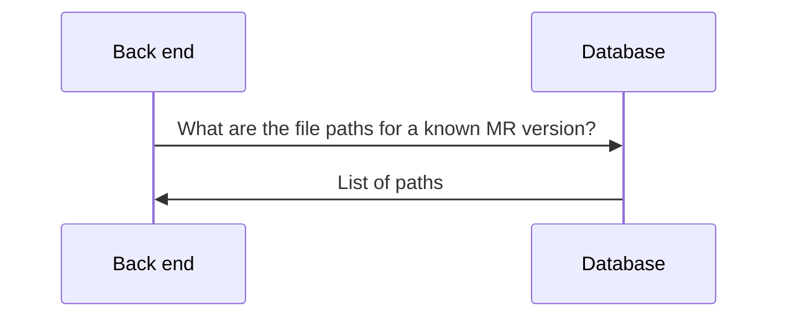

###### Cache

- Diff の新鮮なレンダリング

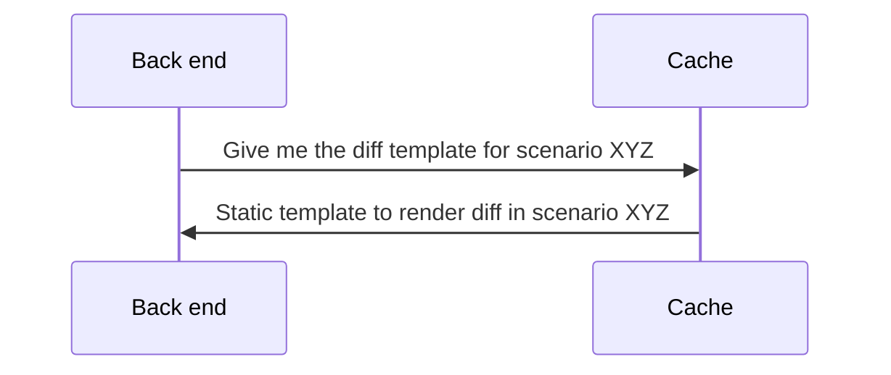

- Diff の繰り返しレンダリング

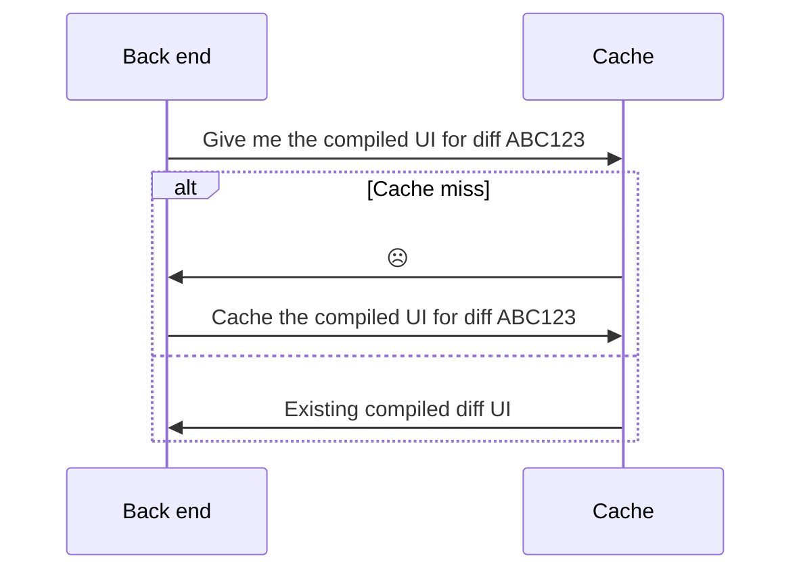

###### Diff Storage

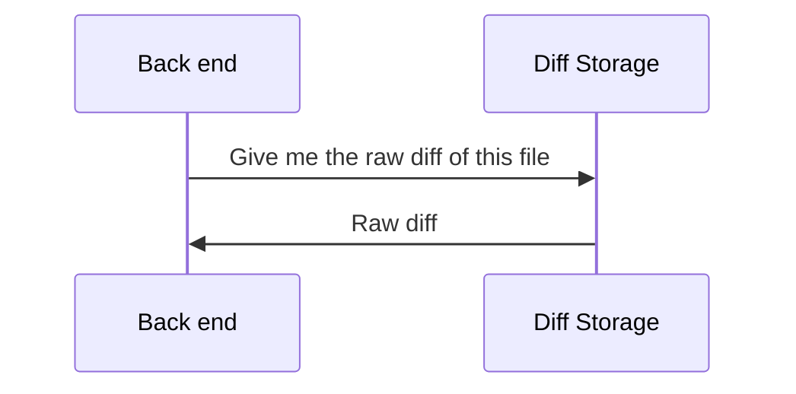

###### バックエンド

- ページロード時に最初にレンダリングされるファイル

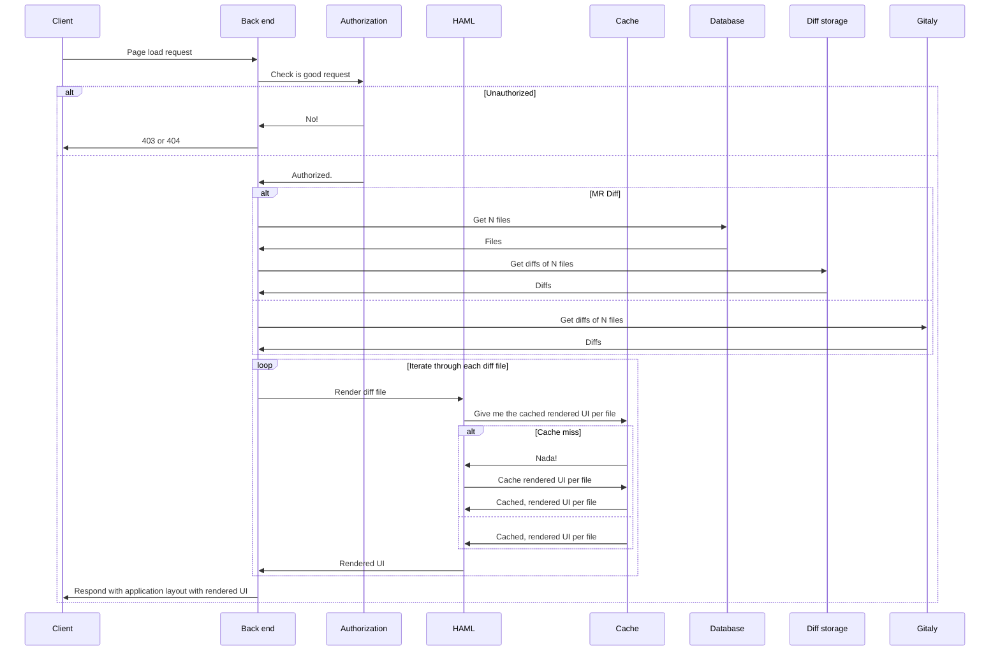

- フロントエンドにストリームされる将来のファイル

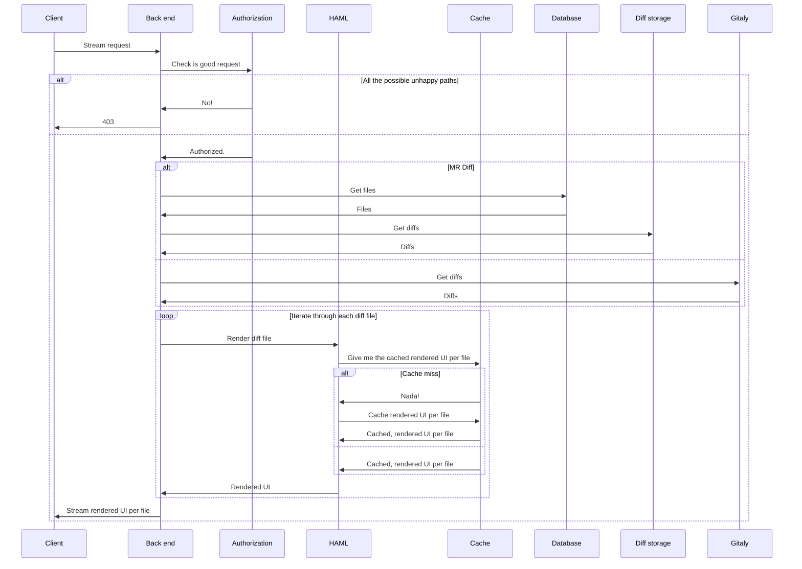

###### Web API

Web API は Diffs のバックエンド実装への内部および公開アクセスの両方を提供します。

最終的には、このダイアグラムは私たちのアプリケーションまたはユーザーがやり取りできる各エンドポイント、および各エンドポイントが期待し返すものを示すために展開（場合によっては分割）されるべきです。

これは業務ロジックと実装の詳細を詳述するバックエンドダイアグラムとは別であることに注意してください。
API エンドポイントはコンシューマー向けであるため、異なる要件と構造を持ちます。

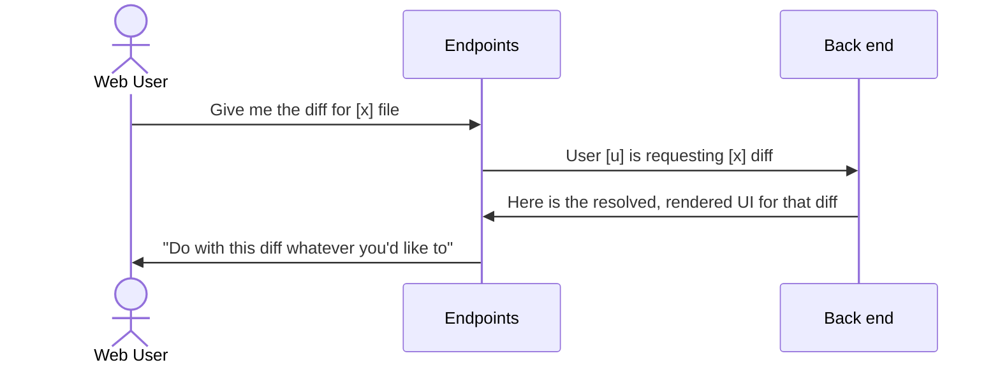

###### 完全な単一レンダリング

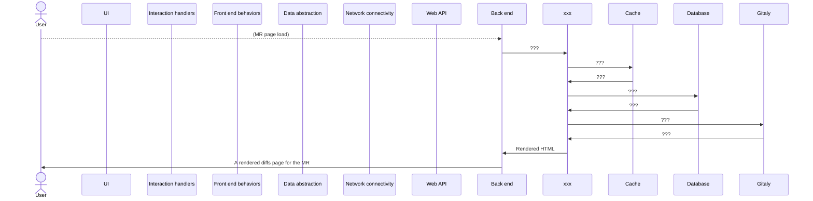

### アクセシビリティ

再利用可能なラピッド Diffs は、Web ベースのコンテンツに対して [Web Content Accessibility Guidelines 2.1](https://www.w3.org/TR/WCAG21/) レベル AA 準拠、ユーザーインターフェースに対して [Authoring Tool Accessibility Guidelines 2.0](https://www.w3.org/TR/ATAG20/) レベル AA 準拠の方法で表示される必要があります。

GitLab のコンテキストで Diff を使用してアクセシブルな体験をするためには、Diff の表示とインタラクションの両方について準拠を確保する必要があることを認識しています。そのため、アクセシビリティ監査とそれに続く推奨事項は、変更のレビューに使用されるコンテンツエディター機能も考慮します。

#### ATAG 2.0 AA

Diff の性質を考慮して、以下のガイドラインに主に焦点を当てます:

1. [ガイドライン A.2.1: （オーサリングツールのユーザーインターフェースに対して）著者に代替コンテンツを利用可能にする](https://www.w3.org/TR/ATAG20/#gl_a21)
1. [ガイドライン A.3.1: （オーサリングツールのユーザーインターフェースに対して）オーサリング機能へのキーボードアクセスを提供する](https://www.w3.org/TR/ATAG20/#gl_a31)
1. [ガイドライン A.3.4: （オーサリングツールのユーザーインターフェースに対して）コンテンツ構造によるナビゲーションと編集を強化する](https://www.w3.org/TR/ATAG20/#gl_a34)
1. [ガイドライン A.3.6: （オーサリングツールのユーザーインターフェースに対して）設定を管理する](https://www.w3.org/TR/ATAG20/#gl_a36)

#### HTML 構造

Diff の HTML 構造は支援技術をサポートする必要があります。
この理由から、テーブルは表示されたデータ間の論理的な関係を示すことができ、キーボードでスクリーンリーダーユーザーがナビゲートしやすいため、好ましい解決策となる可能性があります。ラベル付きの列により、行番号などの情報を編集されたコードの部分と関連付けることができます。

可能な構造は以下のようになります:

```html
<table>
  <caption class="gl-sr-only">Changes for file index.js. 10 lines changed: 5 deleted, 5 added.</caption>
  <tr hidden>
    <th>Original line number: </th>
    <th>Diff line number: </th>
    <th>Line change:</th>
  </tr>
  <tr>
    <td>1234</td>
    <td></td>
    <td>.tree-time-ago ,</td>
  </tr>
  […]
</table>
```

より多くの実装ガイドラインは [WAI チュートリアルのテーブル](https://www.w3.org/WAI/tutorials/tables/)を参照してください。

各ファイルテーブルには以下を読み上げる変更の短い要約が含まれる必要があります:

- 変更された行の総数、
- 追加された行数、
- 削除された行数。

テーブルコンテンツの要約は `<caption>` 要素内に配置するか、`aria-describedby` として参照される要素のテーブルの前に配置できます。
両方のアプローチの詳細については <abbr>WAI</abbr>（Web Accessibility Initiative）を参照してください:

- [`<caption>` 要素内に要約をネストする](https://www.w3.org/WAI/tutorials/tables/caption-summary/#nesting-summary-inside-the-caption-element)
- [`aria-describedby` を使用してテーブルの要約を提供する](https://www.w3.org/WAI/tutorials/tables/caption-summary/#using-aria-describedby-to-provide-a-table-summary)

ただし、そのような構造が Diff を表示する他の機能的側面を損なう場合、ARIA サポートを伴うより汎用的な要素を使用できます。

#### 視覚的インジケーター

各視覚的インジケーターには、そのインジケーターの意味を示すスクリーンリーダーテキストが必要です。必要に応じて `gl-sr-only`（必要に応じて `focus:gl-not-sr-only` と組み合わせて）クラスを使用して、スクリーンリーダーにはアクセス可能だが視覚ユーザーにはアクセスできないようにします。

支援技術の代替が必要な視覚的インジケーターの例:

- `+` または赤いハイライトは `added` として読み上げられる
- `-` または緑のハイライトは `removed` として読み上げられる

### 高レベル実装

<!--
This section should contain enough information that the specifics of your
change are understandable. This may include API specs (though not always
required) or even code snippets. If there's any ambiguity about HOW your
proposal will be implemented, this is the place to discuss them.

If you are not sure how many implementation details you should include in the
blueprint, the rule of thumb here is to provide enough context for people to
understand the proposal. As you move forward with the implementation, you may
need to add more implementation details to the blueprint, as those may become
an important context for important technical decisions made along the way. A
blueprint is also a register of such technical decisions. If a technical
decision requires additional context before it can be made, you probably should
document this context in a blueprint. If it is a small technical decision that
can be made in a merge request by an author and a maintainer, you probably do
not need to document it here. The impact a technical decision will have is
another helpful information - if a technical decision is very impactful,
documenting it, along with associated implementation details, is advisable.

If it's helpful to include workflow diagrams or any other related images.
Diagrams authored in GitLab flavored markdown are preferred. In cases where
that is not feasible, images should be placed under `images/` in the same
directory as the `index.md` for the proposal.
-->

## 代替案 {#alternative-solutions}

<!--
It might be a good idea to include a list of alternative solutions or paths considered, although it is not required. Include pros and cons for
each alternative solution/path.

"Do nothing" and its pros and cons could be included in the list too.
-->

### 歴史的コンテキスト

再利用可能なラピッド Diffs は Diff のレンダリングへのアプローチにパラダイムシフトをもたらします。この提案されたアーキテクチャの前に、Diff をレンダリングするための 2 つの異なるアプローチがありました:

1. マージリクエストはクライアントサイドレンダリングを多用していました。
1. 他のすべてのページは主にサーバーサイドレンダリングを使用し、JavaScript で追加の動作を実装していました。

マージリクエストでは、レンダリング作業のほとんどがクライアントで行われていました:

- バックエンドは Diffs データを含む JSON レスポンスのみを生成していました。
- クライアントは Diffs の描画とユーザー入力への反応の両方を担当していました。

これにより、クライアントサイドレンダリングのための[仮想スクロールソリューション](https://github.com/Akryum/vue-virtual-scroller/tree/v1/packages/vue-virtual-scroller)を採用することになり、大きな Diff ファイルリストの描画が大幅に高速化されました。

残念ながら、これは非常に高い保守コストと[常に発生するバグ](https://gitlab.com/gitlab-org/gitlab/-/issues/427155#note_1607184794)という欠点を伴いました。ユーザーエクスペリエンスも損なわれました。ページにアクセスしたときにすぐに Diff を表示できず、最初に JSON レスポンスを待つ必要があったためです。最後に、このアプローチは他のページで使用されるサーバーレンダリングの Diff と完全に並行して進み、Diff に対して 2 つの完全に別々のコードベースが生まれました。

### 試みた代替ソリューションの概要

過去に採用またはテストした戦略のリストを以下に示します:

- フルサーバーサイドレンダリング（採用され Vue アプリに置き換えられた）: マージリクエスト変更タブの Vue リファクタリング前、Diff はサーバーで完全にレンダリングされていました。これはページがレンダリングを開始する前に長い待機をもたらしました。
- フロントエンドテンプレート（Vue）サーバーサイドレンダリング（[テスト済み](https://gitlab.com/gitlab-org/gitlab/-/merge_requests/33052#note_350101205)）: 結果と影響は魅力的でなく、部分的な SSR の方向を示しました。（[PoC MR](https://gitlab.com/gitlab-org/gitlab/-/merge_requests/33052)）
- バッチ Diff（採用）: Diff を非同期ページネーションリクエストに分割し、サイズを増大させる（スロースタート）。ブートストラップ時間が不満足で、知覚パフォーマンスはコンテンツのないページで長時間を必要としていました。
- 仮想スクロール（採用）: ネイティブ検索機能を完全に使用できないなどの既知の副作用、要素にスクロールする際の干渉と奇妙な動作、ブラウザへの全体的な負荷。（[この Blueprint で提案されたアプローチとの比較](https://gitlab.com/gitlab-org/gitlab/-/issues/433015#note_1671675884)）
- リポジトリコミットが大きすぎる場合のページネーション（採用）: 暫定的な解決策として、リポジトリ内の非常に大きなコミット Diff は、複数のページにわたってファイルと変更を隠すという UX への悪影響を持つページネーションが導入されました。
- マイクロコードレビューフロントエンド PoC（テスト済み）: このアプローチは過去に使用されたアプリケーション設計と大幅に異なっていたため、前進する方法として真剣に探求されることはありませんでした。カスタム要素とイベントへの依存など、この設計の一部は代替アプローチに取り込まれています。（[マイクロコードレビューフロントエンド PoC](https://gitlab.com/gitlab-org/gitlab/-/issues/389282)）
- Node サーバーを使用した Diff のストリーミング（テスト済み）: ストリーミングと専用の Node.js サーバーを組み合わせる。この Blueprint で提案された SSR アプローチの前駆体。（[PoC: Streaming diffs app](https://gitlab.com/gitlab-org/gitlab/-/merge_requests/84563)）

## 提案された変更

これらの変更（「Design A」などの任意の名前で示される）は、この Blueprint の最終的な前進の道を提案していますが、権威あるコンテンツとしてまだ承認されていません。

- 最も高い階層の見出しにデザイン名をマークしてください。同じレベルで複数の見出しを変更する場合は、すべて同じ名前でマークしてください。これにより、推論しやすい高レベルの目次が作成されます。

### フロントエンド（Design A）

#### 高レベル実装

NOTE:
このドラフト提案は選択されない可能性がある 1 つの潜在的なフロントエンドアーキテクチャを提案しています。他の提案されたデザインと必ずしも相互排他的ではありません。

（このチャートのより良いビジュアルは [New Diffs: Technical Architecture Design](https://gitlab.com/gitlab-org/gitlab/-/issues/431276) を参照してください）

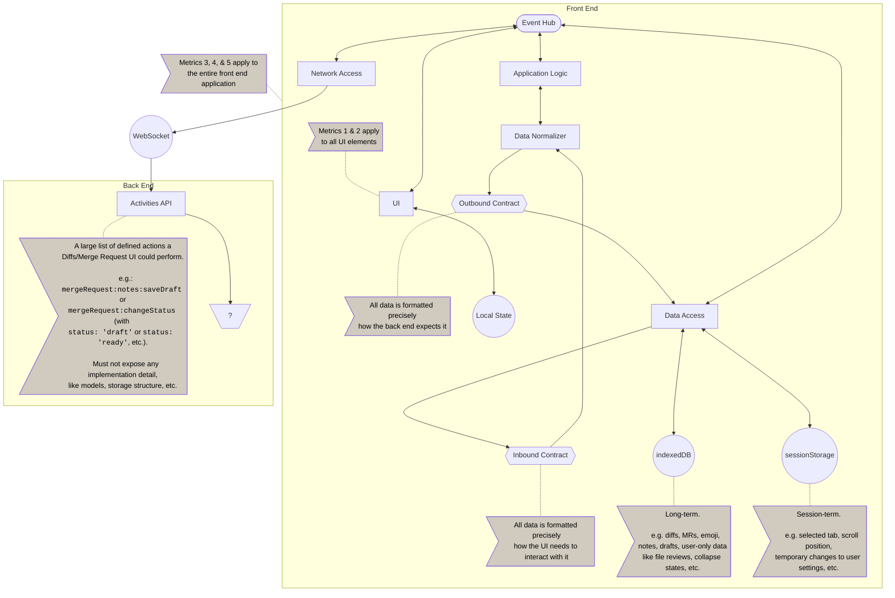
