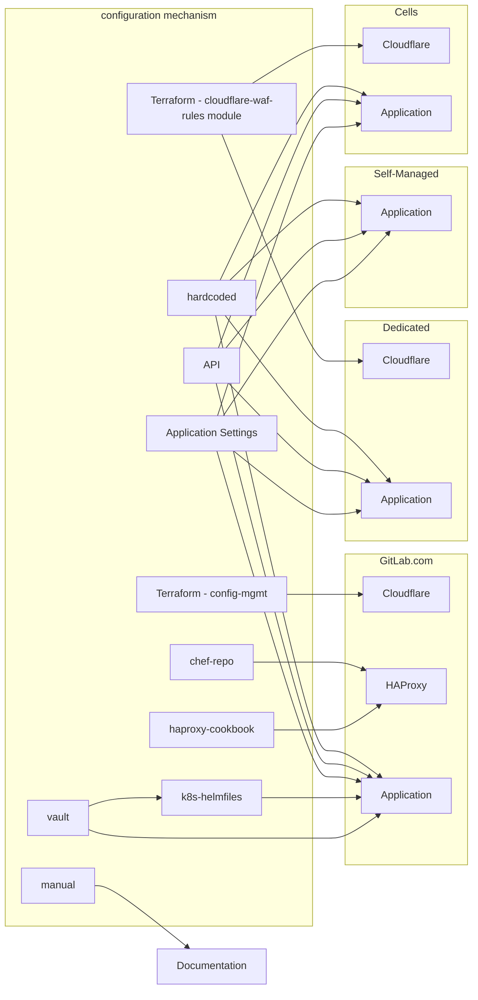
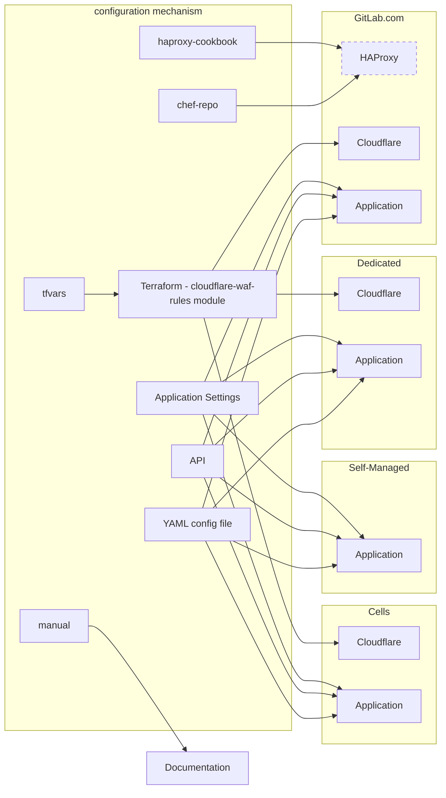
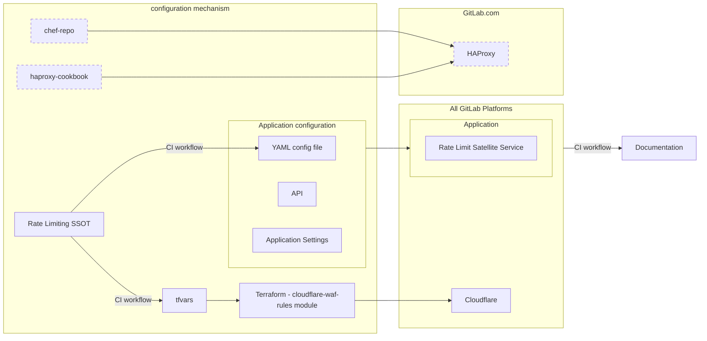

<!-- Design Documents often contain forward-looking statements -->
<!-- vale gitlab.FutureTense = NO -->

<!-- This renders the design document header on the detail page, so don't remove it-->



> **注:** フェーズ 2（アプリケーションレベルの統合）以降の技術設計は、[Unified Rate Limiting Architecture](../unified_rate_limiting/) 設計ドキュメントに詳述されています。このドキュメントは高レベルのロードマップとして残します。

## 概要

GitLab.com が進化するにつれて、プラットフォームのセキュリティとパフォーマンスを向上させ、可用性とユーザー満足度を望ましいレベルに保つために、多くの層でレート制限とスロットリング対策を導入してきました。これらの対策は多くの場合、反応的なものであり、これらの制限を定義・施行するための一貫した戦略はありませんでした。

この一貫性の欠如はユーザーに混乱をもたらし、エンジニアの生産性を損ない、新しい制限を定義・実装したい場合にも困難をもたらす可能性があります。この設計ドキュメントは、これらの制限に対する透明な戦略を導入することを目的としています。第一に、エンジニアが可用性目標を施行するための合理的なポリシーを導入できるようにし、第二にユーザーへの透明性を確保します。

[Cells](../cells/) の導入により、今後すべての層でレート制限を定義・管理する方法を簡素化するための積極的でイテレーティブなアプローチを取っています。

このドキュメントは、アプリケーション制限に焦点を当てた既存の[次世代レート制限アーキテクチャ](../rate_limiting/)をサポートするイテレーティブなステップを定義し、エッジネットワーク制限も包含するように拡張することを目的としています。

## 動機

現在、[GitLab.com のレート制限](../../../infrastructure-platforms/rate-limiting/)は複数の異なる場所でさまざまな方法で定義されています。これはお客様とチームメンバー双方にとっていくつかの課題をもたらしています。

まず、レート制限が存在する場所が分散していることで、リクエストにどの制限が適用されているかを理解することが困難になります。これによりユーザーに混乱が生じ、サポートエンジニアや本番エンジニアリングチームの生産性が低下します。どの制限に達したかを見つけるには（例えば Cloudflare または GitLab アプリケーションのどこで制限に達したかが常に明確でないため）、複数のツールを調査してコードベースを監査する必要がある場合があります。

次に、新しい制限を変更または導入することが困難で、可用性を保護するためのポリシーを定義することが難しくなっています。異なる制限が異なる場所で施行されているため、名前空間 / プロジェクト / ユーザー / 顧客に対してそれらを変更する単一の方法がありません。これは新しいサービスが展開されたときに不整合をもたらし、どの制限がリクエストに適用されているかの混乱をさらに増大させるか、レート制限なしでサービスが展開される可能性があります。サービスまたは API が展開された後にスロットリングを導入することはリスクを伴う可能性があり、顧客への予期しない中断を引き起こす可能性があります。

最後に、一部の主要な SaaS 顧客に対してレート制限バイパスを歴史的に許可してきましたが、これはプラットフォームとこれらの顧客にとってリスクを高め、長期的に管理が困難です。可用性を保護しながらこれらの顧客へのユーザー満足度を提供するために、より高い制限を設定できるようにしたいと考えています。

GitLab.com が Cells アーキテクチャに移行するにつれて、レート制限の単一の信頼できる情報源を作成するユニークな機会があります。長期的には、レート制限を設定するための集中した場所を目指し、合理的なデフォルト値を持ちつつ、必要に応じて名前空間 / プロジェクト / ユーザー / 顧客ごとのカスタマイズを可能にします。これにより、ユーザーに公開できる文書化・発見しやすいレート制限という利点も生まれます。

### 現在のレート制限設定方法

この図は、現在のスタックの各層とそれぞれの製品提供にわたって、レート制限を管理する複雑さを示すことを目的としています。

### 技術的ロードマップ

このイニシアチブは、レート制限設定をより管理しやすくし、設定されているレート制限の調査（上図のように）に必要な認知的オーバーヘッドを削減することで、GitLab のパフォーマンス、安定性、スケーラビリティを向上させることに焦点を当てています。これはエンジニアリングとサポート全体の共通の課題点と見なされており、この設定に対するイテレーティブな改善に焦点を当てることで、より安全な立場に立つことができます。

さらに、提案されたアーキテクチャは、複数のサイロ化されたバラバラな実装（これらはチームメンバーと顧客にとって複雑さと認知的オーバーヘッドを増やすだけです）よりも、一貫したレート制限のための単一の戦略的なクロスアプリケーション方法の開発を奨励します。

### 目標

GitLab エコシステム全体でレート制限を簡素化する。

- バージョン管理でレート制限を設定できる機能をサポートする。
- 新しいレート制限を定義するためのプロセスを導入する。
- 新しいサービスのための「デフォルト」レート制限のセットを導入し、自動化された方法で新しいサービスの展開時に制限を施行する。
- インシデント時などに本番エンジニアが制限を調整しやすくする。
- リクエストがどこで制限されているかとその理由をチームメンバーと顧客が理解するための透明性を作る。

#### 各フェーズの目標

- **フェーズ 1:** 1 か所に集中した場所でインフラのレート制限設定を統合する。
- **フェーズ 2:** 1 か所に集中した場所でアプリケーションのレート制限設定を統合する。
- **フェーズ 3:** 設定の管理と制限の公開を容易にするレート制限インターフェースを提供する。

### 非目標

- Cloudflare や Rack Attack やスロットリングサービスを再実装すること - これはスロットラーではなく、制限の統合と定義のためのインターフェースを意味します。

## 提案

GitLab の既存のレート制限アーキテクチャを変更してレート制限設定ファイルの渡しをサポートし、これがサポートされたら環境全体でこれらの制限の設定と管理を簡素化するインターフェースを作成します。

### フェーズ 1: エッジネットワークとバイパス設定を簡素化する

- **フェーズ 1.1: IP ベースのレート制限バイパスを 1 か所で管理する**
  - [バイパスヘッダーロジック](https://gitlab.com/gitlab-cookbooks/gitlab-haproxy/-/blob/65f8adc65b62db74714bd53dd48a50f7d9cfede3/templates/default/frontends/https.erb#L49)を HAProxy から Cloudflare に移行する。
  - Cloudflare カスタムルールは[変換ルール](https://developers.cloudflare.com/rules/transform/)アクションをサポートしており、これを可能にするはずです。
- **フェーズ 1.2: Cloudflare ルールの設定ファイルの渡しをサポートする**
  - [Cloudflare ルール](https://ops.gitlab.net/gitlab-com/gl-infra/config-mgmt/-/blob/main/environments/gprd/cloudflare-rate-limits-waf-and-rules.tf)を [cloudflare-waf-rules](https://ops.gitlab.net/gitlab-com/gl-infra/terraform-modules/cloudflare/cloudflare-waf-rules/-/tree/main?ref_type=heads) Terraform モジュールを使用するように移行する。
  - [terraform-vars](https://registry.terraform.io/providers/terraform-redhat/rhcs/latest/docs/guides/terraform-vars) を使用してこれらのルールの設定を管理する。

### フェーズ 2: アプリケーションレベルの設定を簡素化する

この時点で、この提案は[次世代レート制限アーキテクチャ](../rate_limiting/#framework-to-define-and-enforce-limits)で言及されているフレームワークを参照しています。構造化された方法で制限を定義するメカニズムを導入し、既存のコードパスがその制限を施行するためにそのフレームワークを利用するようにします。

- **RackAttack スロットルの設定ファイルの渡しをサポートする**
  - 一部は設定可能で、一部はハードコードされています [[ソース](https://gitlab.com/gitlab-org/gitlab/blob/master/lib/gitlab/rack_attack.rb#L85)]。
- **ApplicationRateLimiter スロットルの設定ファイルの渡しをサポートする**
  - 一部はアプリケーション設定 UI から設定可能で、一部は API から、一部はハードコードされています [[ソース](https://gitlab.com/gitlab-org/gitlab/-/blob/master/lib/gitlab/application_rate_limiter.rb#L17)]。
- **すべてのアプリケーション制限に設定ファイルを渡せる機能をサポートする**
  - アプリケーション制限の種類は 7 つあります（RackAttack と ApplicationRateLimiter を別々にカウントした場合）。最終的にはこれらを同じ設定メカニズムで設定できるようにしたいと考えています。
  - 制限実装の完全なリストについては[このメモ](https://gitlab.com/gitlab-com/gl-infra/scalability/-/issues/3775#note_2121412201)（機密）を参照してください。
- **GitLab Rails アプリケーション外のサービスにわたって制限を設定することをサポートする**
  - 一部のサービスは [Runway](https://docs.runway.gitlab.com/) でデプロイされており、標準化されたレート制限設定メカニズムをサポートする必要があります。
    - Runway サービスのレート制限に関する Issue は[こちら](https://gitlab.com/gitlab-com/gl-infra/platform/runway/team/-/issues/28)を参照してください。
  - Runway 外にデプロイされたサービスを考慮するためにさらなる調査が必要です。

### フェーズ 3: レート制限インターフェースを実装する

GitLab.com と Cells のすべての部分にわたるレート制限設定のためのレート制限インターフェースを作成します。このインターフェースは制限の施行を担当するわけではありません（スロットリングは Cloudflare またはアプリケーション自体で引き続き行われます）が、制限の統合されたカタログを提供し、名前空間ごとに制限をオーバーライドするメカニズムを提供します。この単一の情報源を提供するために、追加された新しいスロットルはデフォルト値とともにカタログに反映される必要があります。これらのデフォルト制限がアプリケーションに実装されている場合、カタログの値はセルフマネージド用のパッケージに同梱されます。

レート制限のシングルソースオブトゥルース（SSOT）は、基盤となるシステムにこれらのルールを適用するために使用されるメカニズムに関係なく、抽象化された方法でレート制限ルールと閾値を設定することに焦点を当てる必要があります。例えば、これは GitLab のドメイン固有のビュー（顧客、組織、セル、機能など）からのレート制限を定義する、よく定義された YAML ファイルとスキーマのようなものかもしれません。これはトランスポートセマンティクス（エンドポイントや HTTPS など）として直接ではなく、CI ワークフローとサポートスクリプトを使用して Cloudflare、GitLab アプリケーション（または将来の未決定の技術）への設定に変換されます。

実際にはどのように見えるかというと:

1. 新しいルールがレート制限ソースオブトゥルースにマージされ、新しいバージョンが生成される。
1. 自動化がそれぞれのリポジトリのレート制限設定を更新するための対応する MR を作成する。
1. マージ時に新しい制限が Cloudflare に適用されるか GitLab アプリケーションに読み込まれる設定を使用して適用される。
1. CI ワークフローの実行がドキュメント内のレート制限閾値を解析・更新する。

**注:** この実装の詳細は最初の 2 つのフェーズを経て、より多くのことを学ぶにつれて変更される可能性があります。

## 長所と短所

### 長所

- 制限の定義を 1 か所に統合する。これにより、レート制限の作成や変更が合理化されます。
- カタログをドキュメントに組み込んで公開できます。ここでの変更はドキュメントに反映され、ドキュメントプロセスを合理化し、ユーザーへの透明性を高め、ドキュメントを最新の状態に保ちます。
- スロットリング機能を書き直す必要はなく、製品の異なる層でのレート制限の多層防御モデルを維持します。
- 名前空間 / プロジェクト / ユーザー / 顧客ごとのレート制限のカスタマイズを可能にするように構築できます。
- これにより、顧客がどの制限にヒットしているかをサポートが特定しやすくなります: すべての制限が 1 か所で定義されているため、アプリケーションがリクエストが制限されている原因となるルールの識別子をアドバタイズできるようになります。

### 短所

- すべてのアプリケーションのレート制限設定が現在 API を通じて公開されているわけではありません。アプリケーションレベルの変更を実装するためにプロダクト / バックエンドエンジニアと協力する必要があります。

## 考慮事項

### スコープは既存の GitLab.com か Cells か?

両方です！作成するものは、これらの改善期間中に並行して実行される可能性が高いため、既存の GitLab.com と Cells アーキテクチャの両方でレート制限管理をシンプルにすることをサポートする必要があります。また、将来のみの改善に自分自身を限定したくありません。

顧客、組織、名前空間などのアクターの使用をサポートする改善は、レート制限設定に対して行われた改善が Cells 全体で機能することを確保するために不可欠です。

### Cloudflare レート制限の設定

GitLab.com、Cells、Dedicated はすべてネットワークのエッジで Cloudflare を利用しています。GitLab.com の設定を変更して [Cloudflare WAF ルール Terraform モジュール](https://gitlab.com/gitlab-com/gl-infra/terraform-modules/cloudflare/cloudflare-waf-rules)を使用するように変更できます。これは拡張可能に構築されているため、これを活用して設定を簡素化し、このコンセプトの素早い成果と概念実証を提供できます。

### アプリケーションのレート制限設定

アプリケーション内のレート制限設定は少し難しくなります。現在これらの制限は Rails アプリ内で設定されており、一部には API があるがすべてにはありません。今後は、API または設定ファイルのいずれかを通じて、すべての制限が同じ方法で設定・管理されることを強制する必要があります。次世代レート制限アーキテクチャの設計ドキュメントで概説されている[フレームワーク](../rate_limiting/#framework-to-define-and-enforce-limits)の実装がこの方向性を設定するのに役立ちます。

### レート制限の公開

GitLab.com へのリクエストに課せられる制限のための集中した信頼できる情報源に、すべてのレート制限を YAML で宣言することの利点の 1 つは、この YAML を解析してドキュメントや Handbook に公開し、ユーザーへの透明性を高めることができることです。おまけとして、サービスへの変更がドキュメントを自動的に更新し、手動更新の必要性を省き、公開されるドキュメントを最新の状態に保ちます。

### 機密レート制限

レート制限インターフェースを実装し、ドキュメントにレート制限ルールと閾値を公開する際に、悪意のあるアクターからの保護のために導入されたバイパスやルールなどの場合に、一部の設定を [SAFE](../../../../legal/safe-framework/) に保つメカニズムを導入する必要があります。このような場合、設定は機密と見なされる可能性があります。一部のルールには顧客の IP アドレスや、私たちが保護しようとしている攻撃の性質に関する詳細が含まれている可能性があるためです。

### 新しいサービス

新しいサービスが GitLab.com に追加されるとき、レート制限なしで作成されることがあり、後から制限を追加するとユーザーへの影響を伴う場合があります。作成されるすべての新しいサービスもレート制限インターフェースに追加される必要があります。これを本番準備チェックのステップとして追加し、新しいサービスのデフォルトのレート制限を提案します。

### Runway

[Runway](https://docs.runway.gitlab.com/guides/onboarding/) はエンジニアがメイン GitLab コードベースの外にプロジェクトをデプロイするプロセスを合理化できるようにします。作成するものは、これらのサービスが作成されたときに自動的にレート制限が設定されるように Runway との統合方法を考慮する必要があります。

### セルフマネージド

GitLab アプリケーションに対して行う改善は、設定ファイルをサポートするようにアプリケーション制限を変更した場合、セルフマネージドインスタンスで機能する必要があります。セルフマネージドの顧客はこれらの改善の恩恵を受けることができるはずです。

### Dedicated

Cells アーキテクチャは Dedicated のツールに基づいており、Cloudflare WAF モジュールを活用するための改善が行われることで、ここでのサポートの基盤も整います。

### Cloud Connector

[Cloud Connector](../../../infrastructure-platforms/rate-limiting/#cloud-connector) のレート制限は、AI ベンダー制限などの水平スケーラブルでないリソースの消費をスロットリングするために Cloudflare で設定されています。エッジネットワーク設定を簡素化するフェーズ 1 の一環として、Cloud Connector のレート制限がこれらの改善に含まれることを確認する必要があります。

## 代替案

この設計ドキュメントの提案フェーズ中に、多くの優れた議論が行われました。その多くは提案に含めるとスコープクリープにつながる可能性がありますが、後世のために重要なものです。

### HAProxy 対 Cloudflare

Cloudflare は GitLab.com、Dedicated、Cells で一貫して使用されています。したがって、HAProxy から Cloudflare に既存の設定を移行することに焦点を当てることは、既存の設定の即座の改善となります。

注意: Pages や Registry などの一部のサービスはまだ Cloudflare を通じてルーティングされていないため、HAProxy に依存しています。

### Cloudflare Workers を使用したレート制限サービスの構築

[HTTP ルーティングサービス](../cells/http_routing_service/)は、アプリケーション対応になると思われたため、このレート制限実装を格納する潜在的な場所として検討されました。しかし、HTTP ルーター（Cloudflare ワーカー）は既存の Cloudflare セットアップに比べて追加のインテリジェンスを提供しておらず、ルーティング決定を行うためにヘッダーとパスを読み取るため、既存のレート制限アーキテクチャと比較してメリットがありません。

### Cell ごとのレート制限

Cell ごとにレート制限を導入するというアイデアが提案されましたが、これは持続可能な解決策ではありません。例えば、顧客のニーズに基づいて 1 つの Cell により高いレート制限閾値を導入した場合、その顧客が後日別の Cell に移動した場合、レート制限の設定が見落とされるか古くなる可能性があります。したがって、Cell ごとにレート制限設定を結びつけることは私たちが提案する方向ではありません。

代わりに、組織、プロジェクト、または名前空間レベルでのレート制限に焦点を当てる必要があります。

[Cells の HTTP ルーター設定](https://gitlab.com/groups/gitlab-org/-/epics/12775)は、既存の GitLab.com Cloudflare ルールがすべての Cells にわたって自動的に適用されることを意味します。

#### Cell リファレンスアーキテクチャ

Cell のリファレンスアーキテクチャ/サイズは既存の GitLab.com プラットフォームよりも小さくなる可能性が高いため、この縮小されたキャパシティに基づいて異なる最大レート制限を導入することを検討すべきです。

### URL の組織 ID

この初期提案の範囲外の潜在的な将来の改善は、クエリパラメーターとして URL に組織 ID を含めることです。これを行うと、アプリケーションのレート制限としてではなく Cloudflare レイヤーで組織ベースのレート制限を導入できるようになります。

### アプリケーションからの認証と認可の切り出し

将来的な考えとして、GitLab アプリケーションから AuthN と AuthZ を切り出して独自のサービスにすることが考えられました。これを行えば、クォータまたはレート制限サービスをバンドルされた機能または補足サービスとして実装できます。これを行えば、API ゲートウェイ（HAProxy であれ、より最新のクラウドネイティブゲートウェイであれ）の組み合わせと認証サービスを活用して、GitLab アプリケーションの残りに到達する前にゲートウェイレベルで最も具体的なレート制限を施行できます。
