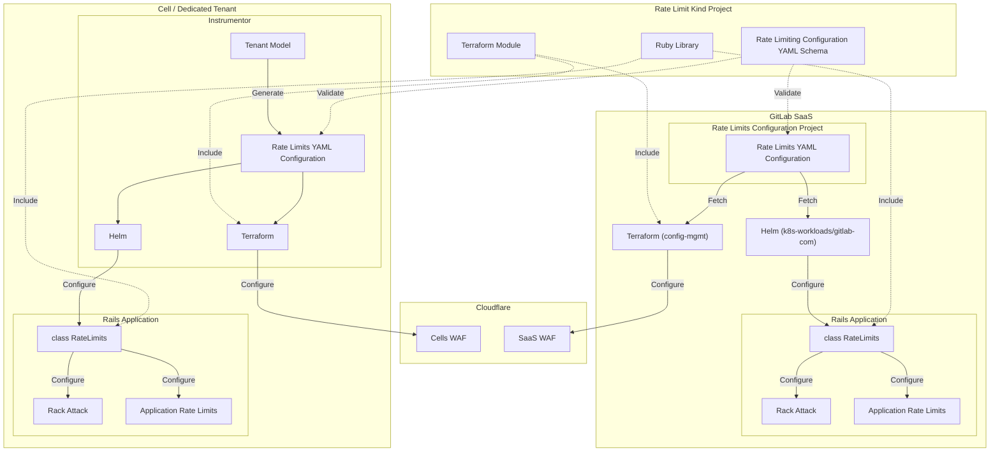

<!-- Design Documents often contain forward-looking statements -->
<!-- vale gitlab.FutureTense = NO -->

<!-- This renders the design document header on the detail page, so don't remove it-->




## 概要

この設計ドキュメントは、GitLab 全体のレート制限設定の単一の信頼できる情報源として機能する標準化された YAML スキーマを提案します。現在、レート制限は Cloudflare、HAProxy、RackAttack、Application Rate Limiters を含む複数のシステムにわたって一貫性なく定義されており、管理、文書化、トラブルシューティングが困難になっています。断片化されたアプローチはユーザーとサポートエンジニアに混乱をもたらし、新しい制限の実装に課題をもたらし、適用された制限の正確なインベントリを維持することを困難にしています。

提案されるスキーマは、GitLab.com、Dedicated 環境、セルフマネージドインスタンスで一貫して使用できる、バージョン管理された設定フォーマットにすべてのレート制限定義を統合します。この作業は「[レート制限設定の簡素化](../rate_limiting_simplification/)」設計ドキュメントのフェーズ 2 の重要なコンポーネントであり、レート制限の定義と施行を標準化する方法の具体的な実装パスを提供することで、より広範な「[次世代レート制限アーキテクチャ](../rate_limiting/)」ブループリントをサポートします。

レート制限設定を一元化することで、ユーザーとサポートチームへの透明性の向上、本番エンジニアの設定管理の簡素化、自動ドキュメント生成の有効化、すべての GitLab プラットフォームにわたって複数の層で制限する多層防御アプローチを維持しながらの一貫したポリシー施行を目指しています。

## 動機

GitLab アプリケーションは現在、レート制限設定を定義・維持するための標準化された方法を欠いています。この設計ドキュメントは、システム全体で一貫したレート制限定義の基盤として機能する YAML スキーマの作成に特化しています。

現在、標準化された YAML スキーマが対処するいくつかの課題があります:

- レート制限を定義するための正式なスキーマがなく、アプリケーションとインフラの異なる部分にわたって一貫性のない実装につながっています。
- 異なるレート制限実装（RackAttack、Application Rate Limiter など）は設定（ファイル、API など）に異なるフォーマットとアプローチを使用しており、制限を総体的に理解・管理することが困難です。
- 明確に定義されたスキーマがなければ、一貫性を維持しながらレート制限機能を拡張したり新しい種類の制限を追加したりすることが難しいです。
- 展開前にレート制限設定が正しいかどうかを検証する標準化された方法がなく、変更を加える際にエラーのリスクが高まります。
- スキーマがないため、ドキュメントを自動生成することが難しく、実際の設定と文書化されたものとの間の不一致につながります。
  - これはインシデント中に課題をもたらします。何かがレート制限されているかどうかを知ることが難しく、このレート制限をどのように変更するかもわかりません。
  - また、これはレート制限されているかどうか、その理由を理解することが非常に困難な顧客にとっての課題でもあります。

このドキュメントで提案された YAML スキーマは、GitLab システム全体で使用できるレート制限を定義するための明確な構造を提供します。制限の閾値、スコープ定義、施行アクション（スロットリング、ログ記録、または無効化）などの重要な属性の規約を確立します。

この作業は、フレームワークが構築される基盤となるスキーマを確立することで、「[次世代レート制限アーキテクチャ](../rate_limiting/)」ブループリントの「GitLab Rails で制限を定義・施行するフレームワークを構築する」という目標を直接サポートします。

### 目標

- 現在および将来のすべてのレート制限タイプをサポートできる包括的な YAML スキーマを定義する
- 人間が読みやすく、簡単に保守でき、適切にバージョン管理されたフォーマットを作成する
- 展開前に設定の検証を可能にしてエラーを防止する
- 初期は Rack Attack レート制限のみのサポートに焦点を当てる
- 将来のレート制限拡張（例: Cloudflare WAF）のために拡張可能なスキーマを設計する
- ユーザー向けドキュメントを正確に保つための自動ドキュメント生成をサポートするスキーマを確保する

### 非目標

- このスキーマを消費するコードの実装
- 既存のレート制限設定のこのスキーマへの移行
- このスキーマで定義された設定を管理するためのユーザーインターフェースの構築（[フェーズ 3](index.md#phase-3-implement-a-rate-limit-interface)）
- 特定のレート制限値の定義（スキーマは構造を定義し、実際の制限値ではありません）
- 集中型レート制限サービスの作成（[フェーズ 3](index.md#phase-3-implement-a-rate-limit-interface)）

## 提案

GitLab のさまざまなレート制限システムのレート制限パラメーターを定義する標準化された YAML スキーマを作成することを提案します。この集中型のスキーマは、基盤となるレート制限メカニズムを再実装または再設定しようとせずに、レート制限値の単一の信頼できる情報源として機能します。

スキーマはすべてのレート制限のリストとして整理され、新しいレート制限システムのために簡単に理解、保守、拡張できるシンプルな構造を持ちます。

### プロジェクト

GitLab 内の現在および将来のすべてのスキーマを表すグローバルな [`kind`](https://iximiuz.com/en/posts/kubernetes-api-structure-and-terminology/#kind) レジストリとして機能する新しいグループ `gitlab-com/kinds` を作成します。

このグループ内で、以下をホストする新しい `kind` プロジェクト `gitlab-com/kinds/rate-limits` を作成します:

- YAML スキーマ定義自体
- サンプル設定
- ドキュメント
- スキーマ検証と設定消費のためのツール（Ruby ライブラリ、Jsonnet ライブラリ、Terraform モジュール...）

このプロジェクトはレート制限スキーマの正規的なソースとなり、さまざまな GitLab コンポーネントがスキーマの特定のバージョンを参照しやすくなります。

これは公開され、セルフマネージドの顧客がレート制限設定の改善から恩恵を受けられるようにします。顧客はスキーマ自体を利用するオプションを持つことができます。

テストとリリースのツールは、既存の [`tenant-model-schema`](https://gitlab.com/gitlab-com/gl-infra/gitlab-dedicated/tenant-model-schema) プロジェクトのものに基づき、将来のすべての `kind` プロジェクトで再利用できるように [`common-ci-tasks`](https://gitlab.com/gitlab-com/gl-infra/common-ci-tasks) で標準化されます。

### セマンティックバージョニング

スキーマは厳格な[セマンティックバージョニング](https://semver.org/)の原則に従います:

- メジャーバージョン（X.y.z）: コンシューマーが実装を更新する必要がある破壊的変更のためにインクリメント。これらは慎重に検討され、可能な限り避けるべきで、[Expand/Contract パターン](https://blog.thepete.net/blog/2023/12/05/expand/contract-making-a-breaking-change-without-a-big-bang/)に従って複数のステージでロールアウトされるべきです。
- マイナーバージョン（x.Y.z）: スキーマへの後方互換性のある追加のためにインクリメント。
- パッチバージョン（x.y.Z）: 後方互換性のあるバグ修正またはドキュメント更新のためにインクリメント。

各リリースはリポジトリで適切にタグ付けされ、コンシューマーが特定のバージョンまたはバージョン範囲にピンできるようにします。

### 公開

各リリースでは、スキーマとそのドキュメントがスキーマ検証のための消費を容易にするために GitLab Pages 経由で静的サイトに公開されます。

### スキーマ構造の例

```yaml
$schema: https://gitlab-com.gitlab.io/kinds/rate-limits/v1.0.0/rate-limits.yaml
rate_limits:
  git_basic_auth:  # このレート制限のユニーク識別子
    description: Limits basic authentication requests per IP to prevent abuse
    actors:  # アクター (ip_address, user, group)
      - ip_address
    feature_category: system_access
    enabled: true
    action: block  # アクション (block, log)
    limit:
      threshold: 600  # リクエスト数
      period: "1m"  # 時間期間 (s=秒, m=分, h=時間, d=日)

  project_exports:  # このレート制限のユニーク識別子
    description: Limits number of project exports a user can initiate
    actors:  # アクター (ip_address, user, group)
      - user
    feature_category: importers
    enabled: true
    action: log  # アクション (block, log)
    limit:
      threshold: 5  # リクエスト数
      period: "1d"  # 時間期間 (s=秒, m=分, h=時間, d=日)
```

### レート制限設定フロー


