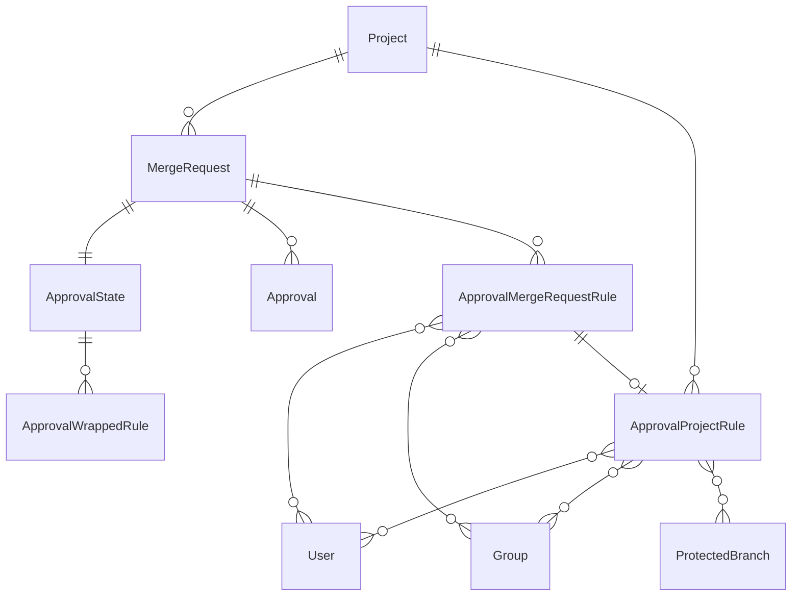
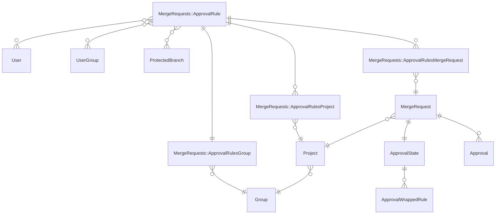

このページには今後予定されている製品・機能・機能性に関する情報が含まれています。ここに示す情報は参考目的のみです。購入・計画の決定にこの情報を使用しないでください。製品・機能・機能性の開発、リリース、タイミングは変更または延期される可能性があり、GitLab Inc. の独自の判断に委ねられています。

<table class="w-full text-sm border-collapse">
<thead>
<tr class="bg-gray-100 text-left">
<th class="px-3 py-2 border border-gray-300">Status</th>
<th class="px-3 py-2 border border-gray-300">Authors</th>
<th class="px-3 py-2 border border-gray-300">Coach</th>
<th class="px-3 py-2 border border-gray-300">DRIs</th>
<th class="px-3 py-2 border border-gray-300">Owning Stage</th>
<th class="px-3 py-2 border border-gray-300">Created</th>
</tr>
</thead>
<tbody>
<tr>
<td class="px-3 py-2 border border-gray-300">ongoing</td>
<td class="px-3 py-2 border border-gray-300"><a href="https://gitlab.com/ghinfey" class="text-blue-600 hover:underline">@ghinfey</a>, <a href="https://gitlab.com/jtapiab" class="text-blue-600 hover:underline">@jtapiab</a>, <a href="https://gitlab.com/jwoodwardgl" class="text-blue-600 hover:underline">@jwoodwardgl</a>, <a href="https://gitlab.com/j.seto" class="text-blue-600 hover:underline">@j.seto</a></td>
<td class="px-3 py-2 border border-gray-300"></td>
<td class="px-3 py-2 border border-gray-300"></td>
<td class="px-3 py-2 border border-gray-300">~devops::create</td>
<td class="px-3 py-2 border border-gray-300">2024-11-05</td>
</tr>
</tbody>
</table>

## 概要

このブループリントは、パフォーマンスと柔軟性を向上させることを目的とした GitLab の承認ルールシステムの大規模な再アーキテクチャの概要を示します。

提案された変更は、3 つの主要な目的に対処しようとしています:

- 多数のオープンマージリクエスト（MR）を持つプロジェクトにおける承認ルール変更の効率を向上させる。
- グループ、プロジェクト、MR を含むさまざまなレベルにわたる承認ルールの更新を合理化する。
- グループレベルの承認ルールの将来の実装のための基盤を築く。

## 動機

より効率的なアーキテクチャを実装することで、GitLab が承認ルール更新のパフォーマンスを向上させ、さまざまなレベルのエンティティにわたってそれらの変更を有効化・反映できることが期待されます。この再アーキテクチャはグループレベルの承認ルールなどの将来の実装の基盤も整え、GitLab が複雑な組織構造のニーズに応えるために進化できるようにします。ユーザーは承認ルール更新の高速化、さまざまな組織レベルにわたるルール管理の改善、全体的なパフォーマンスの向上、より seamless なワークフローの恩恵を受けます。

### 現在の制限事項

プロジェクトレベルのルールへの変更は、MR レベルのルールが作成された後にはそのルールに反映されません。この問題を軽減するために、プロジェクト管理者が MR レベルでの承認ルールの編集を制限することを許可しています。これはプロジェクトレベルのルールが MR に直接適用され、それへの更新は伝播しないことを意味します。詳細は[マージリクエストでの承認ルール編集の防止](https://docs.gitlab.com/ee/user/project/merge_requests/approvals/settings.html#prevent-editing-approval-rules-in-merge-requests)を参照してください。

### 目標

理想的には、以下のことができるようにしたいと考えています:

- グループ承認ルールの追加を可能にする。この新しいアーキテクチャなしに、サブグループ、プロジェクト、MR への[新しいおよび変更されたグループ承認ルールの伝播](https://gitlab.com/gitlab-org/gitlab/-/issues/509984#note_2291076614)は[非常にコストがかかる](https://gitlab.com/gitlab-org/gitlab/-/merge_requests/48511#note_469497257)でしょう。この新しいアーキテクチャにより、その操作はより管理しやすくなります。
- ユーザーが MR、プロジェクト、サブグループ内で継承されたルールを変更できるようにする。
- オーバーライドが許可されているがまだ発生していないプロジェクトレベルからオープン MR レベルのルールの更新を容易にする。詳細は https://gitlab.com/gitlab-org/gitlab/-/issues/254958 を参照。
- 変更された MR レベルで継承された承認ルールを保持する。
- 以下を含む既存の動作を保持する:
  - TODO: 保持したい現在のすべての動作をリストアップする。

### 非目標

TBD

## 提案

提案は新しいアーキテクチャを導入することで GitLab の承認ルールシステムのパフォーマンス、柔軟性、スケーラビリティを向上させることを目的としています。提案の主要なポイントは以下の通りです:

- システムのニーズをサポートする新しいモデルとテーブルを作成する。
- 関係構造を変更する: ルール属性をコピーする代わりに、マージリクエストと承認ルール間の関連付けを作成する。
- 既存の動作を維持する: 「マージリクエストでの承認ルール編集を防止する」が有効な場合、プロジェクトレベルのルールを直接使用し続ける。
- ルールのオーバーライドを処理する: ルールが MR レベルでオーバーライドされた場合、新しい `ApprovalRule` を作成してマージリクエストに関連付ける。
- コンプライアンス情報を保持する: マージリクエストがマージされたときの承認ルールの状態を保存するために既存の `ApprovalMergeRequestRule` テーブルを維持する。テーブルは目的をより適切に説明するために名前を変更する可能性がある。

[このコメント](https://gitlab.com/gitlab-org/gitlab/-/merge_requests/48511#note_477202833)で最初に `@patrickbajao` が提案した新しいデータモデル構造:

- `MergeRequests::ApprovalRule`.
- `MergeRequests::ApprovalRulesGroup` - `MergeRequests::ApprovalRule` を `Group` に関連付ける結合テーブル。
- `MergeRequests::ApprovalRulesProject` - `MergeRequests::ApprovalRule` を `Project` に関連付ける結合テーブル。
- `MergeRequests::ApprovalRulesMergeRequest` - `MergeRequests::ApprovalRule` を `MergeRequest` に関連付ける結合テーブル

### 既存のデータモデル

### 提案されたデータモデル

## 設計と実装の詳細

開発計画は[承認ルールの再アーキテクチャ](https://gitlab.com/groups/gitlab-org/-/epics/12955)エピックで定義されています。

## 代替案

TBD
