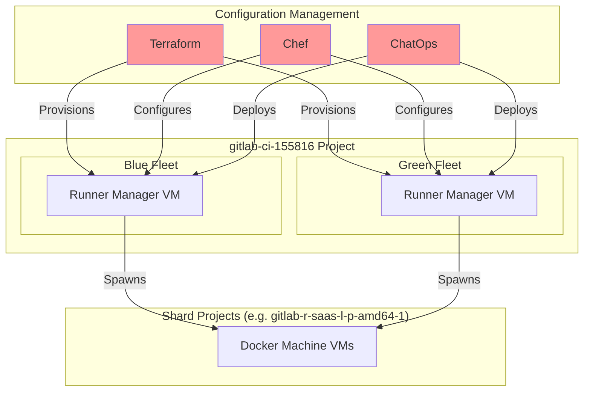
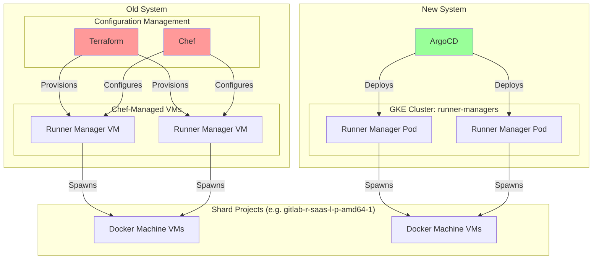
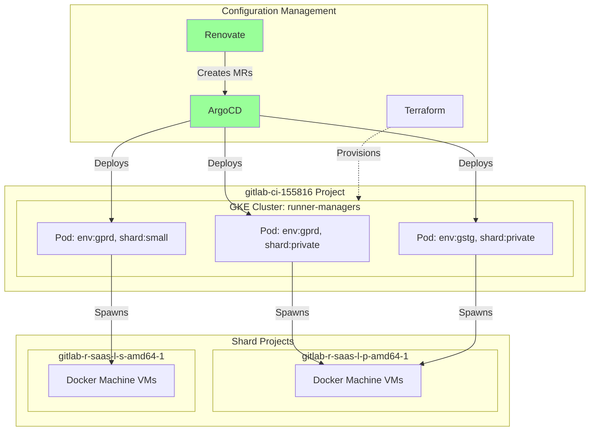

<!-- vale gitlab.FutureTense = NO -->


<div class="my-3 border-l-4 border-blue-500 bg-blue-50 px-4 py-3 rounded-r text-sm text-blue-800">
このページには今後予定されている製品・機能・機能性に関する情報が含まれています。ここに示す情報は参考目的のみです。購入・計画の決定にこの情報を使用しないでください。製品・機能・機能性の開発、リリース、タイミングは変更または延期される可能性があり、GitLab Inc. の独自の判断に委ねられています。
</div>

<div class="overflow-x-auto my-4">
<table class="w-full text-sm border-collapse">
<thead>
<tr class="bg-gray-100 text-left">
<th class="px-3 py-2 border border-gray-300">Status</th>
<th class="px-3 py-2 border border-gray-300">Authors</th>
<th class="px-3 py-2 border border-gray-300">Coach</th>
<th class="px-3 py-2 border border-gray-300">DRIs</th>
<th class="px-3 py-2 border border-gray-300">Owning Stage</th>
<th class="px-3 py-2 border border-gray-300">Created</th>
</tr>
</thead>
<tbody>
<tr>
<td class="px-3 py-2 border border-gray-300"><span class="inline-block rounded px-2 py-0.5 text-xs font-medium bg-gray-100 text-gray-700">proposed</span></td>
<td class="px-3 py-2 border border-gray-300"><a href="https://gitlab.com/igorwwwwwwwwwwwwwwwwwwww" class="text-blue-600 hover:underline">@igorwwwwwwwwwwwwwwwwwwww</a></td>
<td class="px-3 py-2 border border-gray-300"><a href="https://gitlab.com/josephburnett" class="text-blue-600 hover:underline">@josephburnett</a></td>
<td class="px-3 py-2 border border-gray-300"><a href="https://gitlab.com/kkyrala" class="text-blue-600 hover:underline">@kkyrala</a></td>
<td class="px-3 py-2 border border-gray-300"><span class="inline-block rounded px-2 py-0.5 text-xs font-medium bg-gray-100 text-gray-700">~team::Runners Platform</span></td>
<td class="px-3 py-2 border border-gray-300">2025-12-01</td>
</tr>
</tbody>
</table>
</div>


## まとめ

GitLab.com ホスト型ランナーマネージャーを Chef 管理の VM から Kubernetes 管理のデプロイメントへ移行することを提案します。現在のインフラでは月2エンジニア日の手動デプロイが必要であり、30〜50のランナー変更を**月1回のリスクの高いリリース**にまとめてバッチ処理しています。このデプロイのボトルネックは、ランナーインフラと依存製品に取り組む5チーム40人以上のエンジニアにとって**イノベーションのペースを制限**しています。

この移行は、**日次デプロイを可能にする**ことで即座に価値を提供します。現在数週間かかる設定変更が当日にデプロイできるようになります。バージョン更新は Renovate によって自動化されます。デプロイ作業に費やしている月2エンジニア日をより高い価値の作業に転換できます。

さらに、現在の Terraform/Chef の分離構成を単一の ArgoCD 管理システムに統合することで、インフラの理解と維持管理が容易になります。現在12シャードの管理は運用上実現不可能であり、[Duo Workflow](https://gitlab.com/gitlab-org/gitlab-runner/-/issues/38539)、[Runner Core](https://docs.google.com/document/d/1sDMsoUAidRv_U-vHdeDyASkeyDMkiOBUPbHYdRzM-DM/edit)、[Secure ステージ](https://gitlab.com/gitlab-org/gitlab/-/issues/571010)からのカスタムシャードリクエストを断らざるを得ない状況です。この移行によりデプロイのボトルネックが解消されます。

移行リスクは低く、同じエグゼキューターアーキテクチャを維持するリフトアンドシフトで、両システムを並行稼働させ、いつでもロールバック可能です。

## 動機

現在のランナーマネージャーインフラは Chef 管理の VM によるブルー/グリーンデプロイモデルです。デプロイ作業に約**月2エンジニア日**を消費しますが、戦略的なコストははるかに大きく、**5チーム40人以上のエンジニア**（Runner Core、CI Functions Platform、Runners Platform、Duo Agent Platform プロダクトチーム）のイノベーションペースを制限しています。

**デプロイ速度のミスマッチ:** GitLab Runner は月30〜50のマージ（平均1日1〜2件）がありますが、月次デプロイサイクルでは、これらの変更すべてを月1回のリスクの高いデプロイにまとめます。これにより機能と改善の迅速なイテレーションが妨げられます。

**GitLab 自身の原則への準拠:** GitLab の開発は CI インフラに大きく依存しており、安定性だけでなく、機能・パフォーマンス・開発者体験の継続的なイノベーションにも依存しています。GitLab は継続的デプロイを推進しています: [GitLab.com は1日12回デプロイ](https://about.gitlab.com/blog/continuously-deploying-the-largest-gitlab-instance/)しており、開発速度は遥かに高いです。ランナーインフラも同じ原則に従うべきです: 頻繁でリスクの低いデプロイが安定性を維持しながら迅速なイテレーションを可能にします。

**課題:**

- **手動デプロイプロセス**: 変更管理 Issue、ChatOps の枯渇、ブルー/グリーン連携
- **分割された設定**: VM は Terraform で provisioning（[config-mgmt](https://ops.gitlab.net/gitlab-com/gl-infra/config-mgmt)）、Chef で設定（[chef-repo](https://gitlab.com/gitlab-com/gl-infra/chef-repo)）— 断片化しており理解しにくい
- **デプロイ間の管理されないインフラ**: ランナーマネージャーの起動を防ぐために非アクティブフリートの Chef を無効化しており、次のデプロイまでそれらのホストは非管理状態（SSH キー更新なし、ユーザーアクセス変更なし、システム設定更新なし）になる
- **カスタム設定の拒否**: 既存12シャードの維持管理の複雑さから、[Duo Workflow](https://gitlab.com/gitlab-org/gitlab-runner/-/issues/38539)、[Runner Core](https://docs.google.com/document/d/1sDMsoUAidRv_U-vHdeDyASkeyDMkiOBUPbHYdRzM-DM/edit)、[Secure ステージ](https://gitlab.com/gitlab-org/gitlab/-/issues/571010)を含むチームからの新規シャードリクエストを断らざるを得ない状況であり、戦略的プロダクト施策を直接妨げている

### 目標

- 手動介入を最小限にした**日次デプロイ**（デプロイ1回あたり約2エンジニア日から削減）
- Terraform/Chef の分割を排除する ArgoCD への**設定の統合**
- Renovate による**バージョンの自動更新**
- **将来の自動化の基盤**: シャード作成、カスタム設定、場合によってはオートスケーリング

### 非目標

- **エグゼキューターアーキテクチャの変更**: 現時点では Docker Machine を維持し、Kata/Firecracker/gVisor の評価は範囲外
- **ランナー機能の変更**: ランナーがジョブを実行する方法や GitLab との連携方法に変更なし
- **Chef の即時廃止**: Chef のフットプリントは削減されるが、GitLab.com インフラ内の他の Chef 使用には対処しない
- **シャード作成の自動化**: GCP プロジェクト、クォータ、ランナートークンは引き続き手動プロビジョニングが必要

## 提案

ランナーマネージャーを Chef 管理 VM から Kubernetes へ**リフトアンドシフト移行**します。Docker Machine エグゼキューターは変更なく維持します — ランナーマネージャーのデプロイ方法のみ変更します。

### Unified Runners Platform v5 との関係

この作業は、より広範な [Unified Runners Platform v5](https://gitlab.com/groups/gitlab-com/gl-infra/-/epics/1611) イニシアチブのサブセットであり、特に [Block 0: Design and Foundation](https://gitlab.com/groups/gitlab-com/gl-infra/ci-runners/-/work_items/2) の一部です。これにより、今後のランナーデプロイの基盤が確立されます。完全な v5 ロールアウトを待たずに価値を早期に提供するため、独自スコープとして分離します。

**段階的な理由は?** ランナーマネージャーのデプロイとエグゼキューターの変更を分離することで、リスクを制限しながら即座の価値を提供します。複合的な移行は複雑さを増し、メリットを遅らせます。

**これが低リスクな理由:**

- 一時的なジョブ VM は同じネットワーク内に留まり、ランナーマネージャーからエグゼキューターへの接続性を検証するだけでよい
- 移行中は両方のランナーマネージャーアーキテクチャを並行稼働させ、レプリカ数と同時実行設定でトラフィックを制御する
- [双方向ドアの意思決定](/handbook/values/#make-two-way-door-decisions): 問題が発生した場合はいつでも Chef VM にロールバック可能

**変更される内容:**

- ArgoCD + GitLab Runner Helm チャート（Docker Machine サポート付き）を使用してランナーマネージャーをデプロイ
- Renovate による自動バージョン更新（MR マージ → デプロイ）
- 手動のブルー/グリーン連携が不要になる

### デプロイメソッドの選択

Kubernetes デプロイには GitLab Runner Helm チャートを使用します。これは Kubernetes 上でのアプリケーションデプロイの業界標準手法であり、Kubernetes 上のランナーで最も広く採用されているアプローチです。

**Helm チャートを選んだ理由:**

- **ドッグフーディング:** Kubernetes 上のランナーにお客様が使用しているものを自分たちで使用しています。GitLab 自体のデプロイにも Helm を使用しています。下記の[ドッグフーディング戦略](#ドッグフーディング戦略)を参照。
- **業界標準:** Helm は Kubernetes アプリケーションパッケージングの事実上の標準です。
- **実証された成熟度:** 広範なドキュメントとコミュニティサポートによるプロダクション実績。
- **エグゼキューターの柔軟性:** Docker Machine を含むすべてのエグゼキューターをサポートし、デプロイ機構の変更をエグゼキューター移行から切り離すことができます。

**評価:**

| メソッド | Kubernetes | 成熟度 | 採用度 | ドッグフーディング価値 | 備考 |
|--------|------------|----------|----------|------------------|-------|
| **Helm Chart** | Native | 高 | 高 | 高 - ほとんどの k8s ユーザーにメリット | 選択されたアプローチ |
| **Operator** | Native | 低 | 低（OpenShift 中心） | 低 - 限られたユーザーベース | 成熟度が低い。カスタムオートスケーリングが必要になった場合の将来候補。 |
| **GRIT** | Operator 経由 | 中程度（VM）、低（k8s） | 低 | 低 - 限られたユーザーベース | VM 優先、Kubernetes ネイティブではない。Docker Machine サポートなし。 |
| **Omnibus** | なし | 高 | 高（VM） | N/A - k8s でない | 現在のアプローチ。手動デプロイオーケストレーション、ネイティブローリングデプロイなし。 |

代替案セクションで詳細な分析を参照してください。

**採用度指標について:** どのデプロイメソッドにも定量的な採用データは存在しません。評価はドキュメントの位置づけやコミュニティエンゲージメントなどの定性的な指標に基づいています。

**将来の柔軟性:** 現在 Helm を使用することで、要件が発生した場合に将来 GitLab Runner Operator に移行できます。Operator が Helm チャートを提供する場合、明確な移行パスが存在します。

**将来のエグゼキューター移行:** [Docker Machine は非推奨](https://docs.gitlab.com/runner/executors/docker_machine/)となっており、GitLab 20.0（2027年5月）での削除が予定されています。この移行により、[docker-autoscaler](https://docs.gitlab.com/runner/executors/docker_autoscaler/) または [Kubernetes ベースのエグゼキューター](https://gitlab.com/groups/gitlab-com/gl-infra/ci-runners/-/epics/6)への将来の移行が簡素化されます。

### ドッグフーディング戦略

Runner Platform は Runner Core の「Customer-0」です。この移行に GitLab Runner Helm チャートを使用することで、セルフマネージドのお客様が Kubernetes デプロイに使用しているものをドッグフーディングしています。多くのお客様は私たちと同様の運用課題 — デプロイ速度、運用の複雑さ、スケール — に直面しています。このアプローチにより、GitLab.com スケールで遭遇した問題は社内ツールだけでなく、すべてのお客様にメリットをもたらします。

Helm チャートによるスケールでのランナー運用は、高度なユースケースでの検証につながり、より広い GitLab コミュニティへの改善をフィードバックします。これは一貫性を示します: [GitLab.com への GitLab のデプロイに Helm チャートを使用](https://about.gitlab.com/blog/continuously-deploying-the-largest-gitlab-instance/)しており、GitLab Dedicated も GitLab のデプロイに Helm チャートを使用しています。ランナーに Helm を使用することで、このパターンをインフラ全体に拡張します。

このデプロイアプローチにより、新しいランナー機能の迅速なイテレーションも可能になります。継続的なデプロイとデプロイの摩擦が大幅に低下したことで、毎日実験的な設定をテストし、一般公開前に GitLab.com スケールで新しいランナー機能を検証できます。早期採用によりエッジケースとパフォーマンス特性が明らかになり、すべてのお客様にメリットをもたらし、Runner Core にリアルワールドのスケールでの動作についての即時フィードバックを提供します。

### リスク

- **ネットワーク接続性**: Kubernetes 上のランナーマネージャーは既存の Docker Machine サブネットへの適切なネットワークアクセスを維持する必要がある
- **パフォーマンスとスケーリング**: Kubernetes デプロイは高負荷下で異なる動作を示す可能性があり、検証が必要
- **設定のパリティ**: 移行中の旧新システム間の正確なパリティが重要。移行後は旧システムを放置し、最終的には設定から削除する
- **単一クラスターの影響範囲**: クラスター全体の問題が複数のシャードに影響する可能性。マルチ AZ クラスターで軽減。必要であれば複数クラスターのデプロイも可能 — ArgoCD はマルチクラスター管理をネイティブにサポート
- **Kubernetes の運用複雑度**: Pod 固有の障害モード（OOM キル、イメージプルの失敗、エビクション）に Kubernetes 固有のトラブルシューティングの専門知識が必要
- **浅いヘルスチェック**: 既存のヘルスチェックは主にプロセスが実行中であることを確認するのみ。Helm チャートは追加で `gitlab-runner verify` を呼び出すが、ジョブ処理を妨げる無効なトークンや設定の問題は検出できない。継続的なデプロイには、ランナーが実際のジョブを正常に処理したことを確認するより深いヘルスチェックが理想的
- **Cilium ヘルスチェックのバグ**: Cilium を持つ GKE クラスターには、ヘルスチェックが不安定な Pod がネットワーク接続を失う[バグ](https://gitlab.com/gitlab-org/build/CNG/-/merge_requests/2653#note_2791709931)がある。[上流での修正](https://github.com/cilium/cilium/pull/42170)はマージ済みだが GKE にはまだ届いていない。回避策: 安定したヘルスチェックを確保する
- **Pod エフェメラルストレージ**: Pod が死ぬと、進行中のジョブは放棄される（転送不可）。孤立した VM は [ci-project-cleaner](https://ops.gitlab.net/gitlab-com/gl-infra/ci-project-cleaner/) によってクリーンアップされる

## 設計と実装の詳細

### アーキテクチャの概要

次の図は、ランナーマネージャーインフラの現在の状態、移行フェーズ、およびターゲット状態を示しています。

#### 現在の状態（移行前）



#### 移行中

注: 旧システムはデプロイに引き続き ChatOps を使用します。新システムは GKE クラスターのプロビジョニングに Terraform、デプロイに ArgoCD を使用します。



#### ターゲット状態（移行後）



### インフラ

**GKE クラスター:**

- 名前: `runner-managers`
- GCP プロジェクト: `gitlab-ci-155816`（既存プロジェクト）
- 既存の Docker Machine サブネットへのネットワークアクセス

**コストへの影響:**

GKE にはフラットな月額約80ドルのクラスター管理費が追加されます。[Docker Machine ジョブ VM は CI/CD インフラ支出の大部分を占めますが](https://gitlab.com/gitlab-com/gl-infra/production-engineering/-/issues/27820)、現在のランナーマネージャーフリート自体も相当なコストを占めます: **58台の c2-standard-30 マシンで月約5万ドル**。

最近の分析では、これらのマシンは大幅に過剰利用されていないことがわかっています: CPU が30%を超えることはなく、メモリは通常10%以下です。これは、ランナーマネージャーが[5年前に導入された](https://gitlab.com/gitlab-com/gl-infra/production-engineering/-/issues/12574)際に過剰にプロビジョニングされており、それ以降ワークロードの分散が変化したことを示しています。Kubernetes による適切なサイジングにより、運用上のメリットを超えた大幅なコスト削減が期待できます。

**デプロイメント構造:**

- `(environment, shard, project)` タプルごとに1つのランナーマネージャーデプロイメント
- シャードは水平スケーリングのために複数のプロジェクトを含む場合がある
- Docker Machine エグゼキューターは引き続きシャード固有の GCP プロジェクトに VM をプロビジョニング:
  - プライベートランナー用の `gitlab-r-saas-l-p-amd64-1`
  - amd64-small シャード用の `gitlab-r-saas-l-s-amd64-1`
  - 共有 `gitlab-ci-155816` プロジェクト内のネットワーク設定

### 設定管理

- [argocd/apps](https://gitlab.com/gitlab-com/gl-infra/argocd/apps) の単一 ArgoCD アプリケーション、`(environment, shard)` ごとの個別設定
- Docker Machine サポート付きの公式 [GitLab Runner Helm チャート](https://docs.gitlab.com/runner/install/kubernetes.html)を使用
- Helm チャートは `gitlab-runner register` を呼び出してテンプレートから設定を生成します — 私たちが直接管理する安定した設定ファイルを使用しません。移行中は慎重な検証が必要
- Renovate はバージョン更新の MR を作成します。人間によるレビューとマージがデプロイをトリガーします（信頼が高まったら完全自動化デプロイが可能）
- プレリリースイメージを追跡するように Renovate を設定 — ナイトリーリリースは現在 [packagecloud](https://packages.gitlab.com/runner/unstable) にプッシュされており（[Pulp に移行中](https://gitlab.com/groups/gitlab-org/-/epics/20018)）、コミットごとのナイトリーイメージタグは[コンテナレジストリ](https://gitlab.com/gitlab-org/gitlab-runner/container_registry/29383)で利用可能

**シャードごとの設定チューニング:**

- `request_concurrency`: ジョブリクエストの並列処理を制御（現在シャード間で10〜15の範囲）
- Kubernetes `terminationGracePeriodSeconds`: シャードの最大ジョブタイムアウトを超える必要がある（ローリングデプロイセクションを参照）
- デプロイメントロールアウトパラメーター: `maxUnavailable`/`maxSurge`（ローリングデプロイセクションを参照）

### ローリングデプロイとグレースフルシャットダウン

[レガシーのローリングデプロイアプローチ](https://gitlab.com/gitlab-org/ci-cd/runner-tools/grit/-/blob/main/docs/designs/rolling-deployments/README.md)とは異なり、Kubernetes は `maxSurge`/`maxUnavailable` 設定を使用して[ローリングデプロイをネイティブに処理](https://kubernetes.io/docs/concepts/workloads/controllers/deployment/#rolling-update-deployment)します。

**グレースフルシャットダウンのタイミング:**

現在の VM ベースのデプロイメントでは、グレースフルシャットダウンに2時間の systemd タイムアウト（`TimeoutStopSec=2h`、[cookbook-wrapper-gitlab-runner](https://ops.gitlab.net/gitlab-cookbooks/cookbook-wrapper-gitlab-runner)で設定）を使用しています。

**推奨:** シャードの最大ジョブタイムアウトにクリーンアップオーバーヘッドの5分を加えた値を `terminationGracePeriodSeconds` に設定します。gitlab-org プライベートの小さなシャードでは **14700秒**（4時間5分）、他のほとんどのシャードでは **11100秒**（3時間5分）が必要です。

**アイドル VM クリーンアップによる追加シャットダウン時間:** ランナーマネージャーは停止時にアイドル VM を順次削除します。大容量シャード（例: small-amd64 では600台のアイドル VM）はシャットダウンに20〜30分追加される可能性があります。`remove_machines_on_stop: false` を設定し、孤立クリーンアップを ci-project-cleaner に任せることを検討してください。

**設定:**

- **シャットダウンシグナル**: グレースフルランナーシャットダウンには `SIGQUIT` が必要（Helm チャートのデフォルトで設定済み）
- **終了グレース期間**: 最大ジョブタイムアウトに基づいてシャードごとに設定（上記のタイミングを参照）
- **maxSurge**: 現在のブルー/グリーン動作を再現するために100%に設定 — 旧 Pod がドレインする前に新 Pod が起動します。これによりデプロイ中のキャパシティ低下を回避
- **maxUnavailable**: ロールアウト中はキャパシティを維持するために0に設定
- **監視**: GitLab Runner Helm チャートは[メトリクス Service に `publishNotReadyAddresses: true` を設定](https://gitlab.com/gitlab-org/charts/gitlab-runner/-/merge_requests/532)しており、グレースフルシャットダウン中に終了中の Pod からも Prometheus が引き続きメトリクスをスクレイピングできます

**ArgoCD と長時間実行デプロイ:** ArgoCD は Pod が終了中でも新しい同期をブロックしません — 連続した高速デプロイはリソース負荷を引き起こす可能性があります（複数の Pod 世代が同時実行中）。Renovate の MR ベースのワークフローが自然なゲートを提供します。

### シャットダウン時の Docker Machine VM クリーンアップ

現在の VM ベースのデプロイメントには、**gitlab-runner 自体には含まれない**ポストシャットダウンクリーンアップ機構があります。これは systemd の `ExecStopPost` スクリプトとして実装されており、ランナーマネージャーが停止した後に古い Docker Machine VM を削除します:

```bash
#!/bin/bash
set -eo pipefail
parallel=${1:-1}
export MACHINE_STORAGE_PATH=${MACHINE_STORAGE_PATH:-/root/.docker/machine}
ls ${MACHINE_STORAGE_PATH}/machines/ | xargs -n 1 -P ${parallel} docker-machine rm -f
```

このスクリプトは gitlab-runner プロセスが割り当てられたすべてのジョブの処理を終了した**後にのみ**開始され、数分から数時間かかる場合があります。同時実行数3で実行されるため、大容量シャード（例: small-amd64 の600台アイドル VM は20〜30分かかる可能性）では遅くなります。エントリポイントラッパーを実装する際は、クリーンアップ時間を短縮するために同時実行数を増やしてください。

**Kubernetes の制限:** systemd の `ExecStopPost` とは異なり、Kubernetes には「ポストモーテム」フックがありません。`preStop` フックは SIGQUIT の送信*前*に実行され、送信後ではありません。コンテナが終了すると（グレースフルに、またはグレース期間後の SIGKILL で）、クリーンアップコマンドを実行する組み込みの仕組みはありません。

**Kubernetes の実装オプション:**

1. **docker+machine エグゼキューターに組み込む。** docker+machine エグゼキューターのシャットダウンシーケンスにクリーンアップロジックを直接実装する（[gitlab-runner!6330](https://gitlab.com/gitlab-org/gitlab-runner/-/merge_requests/6330)）。これが最もクリーンな解決策です: エグゼキューターはどのマシンが使用中かアイドル中かを知っているため、完全なジョブドレインを待たずにアイドルマシンを早期に削除できます。外部ラッパーは不要です。

2. **エントリポイントラッパー。** gitlab-runner をシャットダウンシグナルをトラップし、gitlab-runner に転送し、終了を待機してからクリーンアップを実行するスクリプトでラップします。systemd の `ExecStopPost` の動作を模倣します。制約: クリーンアップは `terminationGracePeriodSeconds`（ジョブドレイン時間と共有）内に完了する必要があります。

3. **外部クリーンアップ。** 孤立した VM を別のプロセス（例: 古い Docker Machine VM を定期的に削除する CronJob またはコントローラー）を介して非同期にクリーンアップします。トレードオフ: VM が必要以上に長く実行されることによるコストの可能性。

4. **StatefulSet による永続ステート。** docker-machine ステートを Pod の再起動をまたいで保持するために、永続ボリュームを持つ Kubernetes StatefulSet を使用します。新しい Pod はステートを引き継いで既存の VM の管理を継続します。トレードオフ: StatefulSet は逆の序数順でスケールダウンします — Kubernetes はジョブ負荷に関係なく常に最も高い序数の Pod を最初に削除します。これにより、ロールアウトはその特定の Pod がドレインするまで待機する必要があり、他の Pod がアイドル状態であってもデプロイが大幅に遅くなります。

**推奨:** オプション1（docker+machine エグゼキューターへの組み込み）が推奨アプローチです。最もクリーンな統合を提供し、アイドルマシンを早期に削除してクリーンアップを最適化できます。オプション3（外部クリーンアップ）は、Pod がクリーンアップ完了前にクラッシュまたは OOM キルされるエッジケースのための安全網として有用です。

**デプロイ時のアイドルプールチャーン:** Docker Machine ステートは Kubernetes ではエフェメラルであるため、各デプロイ時にアイドル VM プールがドレインされて再作成されます。Chef ベースのセットアップはディスク上にステートを保持し、VM をサイクルせずに設定変更ができます。デプロイ頻度が増えるほどチャーンが増加します — これはデプロイ速度の増加によるトレードオフです。

### シークレット管理

- ランナートークンはすでに Vault にあります。新しいランナー用に新鮮なトークンをプロビジョニングします
- ホストごとではなく `(environment, shard)` ごとに1つのトークン

### GCP 認証

ランナーマネージャーは Docker Machine VM をプロビジョニングするために GCP クレデンシャルが必要です。現在、Chef 管理の VM はディスク上の共有された長期サービスアカウントキーファイル（`/etc/gitlab-runner/service-account.json`、`runners-cache@gitlab-ci-155816.iam.gserviceaccount.com` を使用）を利用しています。

Kubernetes では、[Workload Identity](https://cloud.google.com/kubernetes-engine/docs/how-to/workload-identity) を使用して Kubernetes ServiceAccount を GCP サービスアカウントにマッピングします。これにより長期キーが不要になり、Pod が短期で自動的にローテーションされるクレデンシャルを使用して GCP API に認証できます。

### Production Change Lock (PCL)

フリーズ期間中のデプロイを防ぐために [change-lock](https://gitlab.com/gitlab-com/gl-infra/change-lock) と統合します。[PCL ガイド](https://gitlab-org.gitlab.io/release/docs/release_manager/pcl-guide/)を参照してください。

### GKE ノードのアップグレード

GKE ノードのアップグレードは Pod をエビクトします。これは4時間以上の終了グレース期間があると問題になります。ソーク時間 >= 終了グレース期間で[ブルー/グリーンノードプールアップグレード](https://cloud.google.com/kubernetes-engine/docs/concepts/node-pool-upgrade-strategies#blue-green-upgrade-strategy)を使用します。エビクション率を制御するために [PodDisruptionBudgets](https://kubernetes.io/docs/tasks/run-application/configure-pdb/) を設定します。ブルー/グリーンアップグレードはメンテナンスウィンドウを超えて実行でき、キャンセル/再開/ロールバックが可能で、PDB と終了グレース期間を考慮します。

現在の VM ブルー/グリーンデプロイとは異なり、GKE ブルー/グリーンノードプールアップグレードは完全自動化されており、アプリケーションに対して透明です — 手動連携は不要です。

### 監視と可観測性

- 新しいクラスター用に Prometheus/Mimir を設定
- Helm チャートで `metrics.enabled: true` を設定してメトリクスとデバッグエンドポイントを有効化（ポート9252で `/metrics`、`/debug/pprof/`、`/debug/jobs/list` を公開）
- JSON ログを有効化して Elasticsearch に送信
- 移行中の両フリートをサポートするために [runbooks](https://gitlab.com/gitlab-com/runbooks) の CI ダッシュボードを更新
- docker-machine プロセスを監視するために process-exporter の追加を検討（現在 VM ベースのランナーマネージャーにはなく、ブロッカーではない）

### 移行の実行

**移行順序:** 初期検証のために低リスクなシャード（例: `tamland`）から開始し、その後段階的に大きなシャードに移行します。

1. GKE クラスターを作成し、最小キャパシティで最初のランナーマネージャーをデプロイし、接続性、監視、デプロイを検証します
2. 追加のシャードを段階的にデプロイし、キャパシティを増やし、Chef 管理フリートとのパリティを検証します
3. Chef 管理 VM を廃止し、[config-mgmt](https://ops.gitlab.net/gitlab-com/gl-infra/config-mgmt) と [chef-repo](https://gitlab.com/gitlab-com/gl-infra/chef-repo) をクリーンアップします

### ロールバック手順

**移行中:** Kubernetes レプリカ数を0に削減し、Chef 管理 VM のキャパシティを増やします。ランナーマネージャーはステートレスです。

**完全移行後:**

- **バージョン/設定のロールバック:** Git の MR を元に戻します。ArgoCD が自動的に以前の状態を同期します
- **緊急時（Chef VM への回帰）:** Kubernetes デプロイメントを0にスケールダウンし、Chef 管理 VM を再有効化します。Chef 設定が維持されている限り、このパスは有効です

### プロセスの更新

更新または置き換えが必要な内部プロセス:

- [ChatOps ランナーコマンド](https://gitlab.com/gitlab-com/gl-infra/ci-runners/deployer)を更新または置き換える
- [CI ランブック](https://runbooks.gitlab.com/ci-runners/)を更新
- [デプロイメントプロセス](https://gitlab.com/gitlab-org/ci-cd/shared-runners/infrastructure/-/work_items/303)を更新（[runner-rollout-gen](https://gitlab.com/dbickford/runner-rollout-gen) も参照）
- [gameday テンプレート](https://gitlab.com/gitlab-com/gl-infra/production/-/blob/master/.gitlab/issue_templates/gameday_cirunners_zonal.md)を更新

注: 古い VM クリーンアップのための [ci-project-cleaner](https://ops.gitlab.net/gitlab-com/gl-infra/ci-project-cleaner/) は変更なし。

### 未解決の質問

- ランナーマネージャー Pod のサイジング: 現在の VM はシャードにより大幅に異なります — プライベートと shared-gitlab-org シャードは `n2d-standard-4` を使用し、大部分のフリートは `c2-standard-30` を使用します。メトリクスは大幅な適正化の余地を示しています。シャードごとの適切なリソースリクエスト/制限を決定する必要があります。
- docker-machine エグゼキューターとの Kubernetes デプロイメントの互換性を検証します。
- GKE Autopilot の互換性: GKE Autopilot は `terminationGracePeriodSeconds` を600秒（10分）に制限しており、3〜4時間のジョブタイムアウトと互換性がありません。[拡張期間 Pod](https://cloud.google.com/kubernetes-engine/docs/how-to/extended-duration-pods) はアノテーションを使用して最大7日間実行できますが、グレース期間の制限を延長するかどうかは不明です。Autopilot が実現可能かどうかを調査します。
- スコープ: macOS と Windows のシャードは異なるエグゼキューター（インスタンス/fleeting とカスタム/autoscaler）を使用します。macOS は fleeting 経由で AWS ベアメタル上で実行され、GKE クラスターへの VPN 接続が必要であり、ネットワーク配線と IP の競合に関する複雑さが追加されます。Windows ランナーマネージャーは現在 Windows VM 上で実行されていますが、いくつかのコード変更で Linux 上でデプロイ可能であり、同じ Kubernetes デプロイアプローチを使用できます。この移行のスコープに含めるか、別途処理するかを決定します。

### 現在のシャード設定

| シャード | エグゼキューター | インスタンスタイプ | Concurrent | Limit | IdleCount | ランナー数 | Privileged | MaxBuilds | DiskSize | ジョブタイムアウト |
|-------|----------|---------------|------------|-------|-----------|--------------|------------|-----------|----------|-------------|
| saas-linux-small-amd64 | docker+machine | c2-standard-30 | 1200 | 1300 | 600 | 12 | true | 1 | 30 GB | 3h |
| saas-linux-medium-amd64 | docker+machine | c2-standard-30 | 1200 | 1300 | 200 | 10 | true | 1 | 50 GB | 3h |
| saas-linux-large-amd64 | docker+machine | c2-standard-30 | 1200 | 1300 | 125 | 10 | true | 1 | 100 GB | 3h |
| saas-linux-xlarge-amd64 | docker+machine | c2-standard-30 | 375 | 1200 | 5 | 10 | true | 1 | 200 GB | 3h |
| saas-linux-2xlarge-amd64 | docker+machine | c2-standard-30 | 187 | 1200 | 2 | 10 | true | 1 | 200 GB | 3h |
| saas-linux-small-arm64 | docker+machine | c2-standard-30 | 220 | 220 | 40 | 6 | true | 1 | 30 GB | 3h |
| saas-linux-medium-arm64 | docker+machine | c2-standard-30 | 375 | 1200 | 15 | 6 | true | 1 | 50 GB | 3h |
| saas-linux-large-arm64 | docker+machine | c2-standard-30 | 375 | 1200 | 15 | 6 | true | 1 | 100 GB | 3h |
| saas-linux-medium-amd64-gpu-standard | docker+machine | c2-standard-30 | 1200 | 1300 | 25 | 6 | true | 1 | 50 GB | 3h |
| private (gitlab-org, small) | docker+machine | n2d-standard-4 | 1980 | 1125 | 10 | 16 | true | 40 | 100 GB | 4h |
| private (gitlab-org, medium) | docker+machine | n2d-standard-4 | 1980 | 625 | 10 | 16 | true | 40 | 100 GB | 3h |
| private (gitlab-org, large) | docker+machine | n2d-standard-4 | 1980 | 100 | 10 | 16 | true | 40 | 100 GB | 3h |
| private (gitlab-com) | docker+machine | n2d-standard-4 | 1980 | 150 | 10 | 16 | true | 40 | 100 GB | 2h |
| shared-gitlab-org | docker+machine | n2d-standard-4 | 1200 | 900 | 15 | 12 | false | 10 | 50 GB | 1.5h |
| shared-gitlab-org (dind) | docker+machine | n2d-standard-4 | 1200 | 100 | 15 | 12 | true | 1 | 50 GB | 1.5h |
| tamland | docker | n2d-standard-4 | 20 | 10 | - | 1 | - | - | - | - |
| saas-macos-medium-m1 | instance (fleeting) | c2-standard-30 | 40 | 40 | - | 4 | - | - | - | 3h |
| saas-macos-large-m2pro | instance (fleeting) | c2-standard-30 | 12 | 40 | - | 4 | - | - | - | 3h |
| saas-windows-medium-amd64 | custom (autoscaler) | n1-standard-4 | 100 | 100 | - | 2 | - | - | - | 2h |

- **エグゼキューター**: ランナーエグゼキューターの種類（docker+machine、instance、custom）
- **Concurrent**（gitlab-runner）: ランナーマネージャーあたりの最大同時ジョブ数
- **Limit**（gitlab-runner）: ランナー（マネージャー内）あたりの最大ジョブ数。プライベートシャードには制限の異なる複数ランナーがある
- **IdleCount**（docker-machine）: 事前ウォームされたアイドル VM。高値はシャットダウン時間に影響
- **ランナー数**: 現在のフリートサイズ（参考）
- **Privileged**（docker）: コンテナが特権モードで実行されるかどうか（Docker-in-Docker に必要）
- **MaxBuilds**（docker-machine）: VM が破棄される前に実行できるジョブ数。1 = エフェメラル VM、高値 = VM 再利用
- **DiskSize**（docker-machine）: ジョブ VM ディスクサイズ。ランナーサイズに応じてスケール（small は30GB、medium は50GB、large は100GB、xlarge/2xlarge は200GB）
- **ジョブタイムアウト**: GitLab で設定された最大ジョブ時間

## 代替ソリューション

### 何もしない

現在の Chef + Terraform セットアップを維持します。

**メリット:** 移行の手間なし、チームはツールに慣れている、既存のランブックが有効。

**デメリット:** 運用作業が残る（デプロイごとに約2エンジニア日）、日次デプロイへのパスなし。

**決定:** 却下。インフラプラットフォーム VP によって承認済み。

### 現在の VM ベースシステムの自動化を改善

現在の Chef + Terraform ワークフローを移行せずに自動化します。

**メリット:** 移行リスクが低い、Kubernetes の動作を検証する必要がない。

**デメリット:** 引き続き設定の分割（Terraform + Chef）を維持、ブルー/グリーンの複雑さが残る、インフラの方向性（ArgoCD、Kubernetes）に反する、カスタム自動化には多大な投資が必要。

**決定:** 却下。根本的な問題に対処しない。投資は移行に充てた方が良い。インフラプラットフォーム VP によって承認済み。

### GRIT（GitLab Runner Infrastructure Toolkit）の使用

Terraform モジュールでランナーインフラを管理するために [GRIT](https://docs.gitlab.com/runner/grit/) を使用します。GRIT は [Hosted Runners on GitLab Dedicated](https://gitlab.com/groups/gitlab-com/gl-infra/gitlab-dedicated/-/epics/459) に積極的に使用されています。

**メリット:**

- 標準化されたモジュールインターフェースを持つ GitLab Runner 専用設計
- 複数のクラウドプロバイダー（AWS、GCP）をサポート
- Dedicated チームによるグリーンフィールド AWS デプロイへの活用実績
- ゼロダウンタイム VM デプロイのためのデプロイヤーツールを含む

**デメリット:**

- **VM 優先、Kubernetes ネイティブではない。** GRIT の主なユースケースは docker-autoscaler で VM をプロビジョニングすることです。Kubernetes モジュールは存在しますが、GitLab Runner Operator を使用します（Helm チャートより成熟度が低い）。

- **Docker Machine エグゼキューターのサポートなし。** GRIT は docker-autoscaler、instance、shell、kubernetes エグゼキューターをサポートします。私たちは現在 Docker Machine を実行しているシャードがあります。Docker Machine から移行したいと思っていますが、エグゼキューターの移行とデプロイ機構の移行を組み合わせると不必要なリスクが生じます。Helm チャートは Docker Machine をサポートしており、これらの移行を独立して進めることができます。

- **Terraform ベース、GitOps ネイティブではない。** GRIT はインフラを管理するために Terraform モジュールを使用します。Kubernetes のターゲットは ArgoCD/GitOps であり、Production Engineering 組織の他の部分と一致しています。

- **デプロイの手間を解決しない。** GRIT のデプロイヤーは、カスタムオーケストレーション（ブルー/グリーン連携、SSH トンネル、gRPC プロセスラッパー）を通じて VM のゼロダウンタイムデプロイを提供します。Kubernetes はこれらの機能をネイティブに提供します（ローリングデプロイ、グレースフルターミネーション、ヘルスチェック）。私たちの目標は継続的なデプロイであり、カスタムデプロイツールの構築ではありません。

- **構成要素、ターンキーではない。** Dedicated は GRIT モジュールのサブセットを使用し、特定のニーズに合わせた追加インフラを構築しました。この柔軟性はグリーンフィールドデプロイには価値がありますが、統合作業が必要です。

- **Kubernetes での採用が限られている。** GRIT は主に内部チーム（Dedicated、Demo Architecture）が VM ベースのデプロイに使用していますが、一部の外部お客様も使用しています。Helm チャートは Kubernetes 上のランナーデプロイで最も広く採用されている方法です。

**決定:** 選択せず。GRIT の主なユースケースはスケジュールされたリリースを持つ VM ベースのランナーデプロイです。継続的なデリバリーには Kubernetes ネイティブデプロイが必要です。インフラプラットフォーム VP によって承認済み。

### Runway の使用

GitLab の内部 Platform as a Service である [Runway](/handbook/engineering/architecture/design-documents/runway/) を使用してランナーマネージャーをデプロイします。

**メリット:**

- GitLab によって構築・維持された内部プラットフォーム
- デプロイ、スケーリング、監視を自動的に処理
- デプロイのための GitLab CI 統合
- Vault によるシークレット管理がすでに統合済み

**デメリット:**

- **ステートレスサービスのみ。** Runway は「ステートレスでオートスケール可能なサテライトサービス」を対象としています。ランナーマネージャーはステートを維持し（Docker Machine VM への接続、進行中のジョブ）、長いグレースフルシャットダウン期間（3〜4時間）が必要です。

- **Cloud Run ランタイムの制限。** Runway は Cloud Run Services を使用しており、最大リクエストタイムアウトは60分です。ランナーマネージャーはグレースフルシャットダウンに3〜4時間以上必要です。[Cloud Run Jobs](https://cloud.google.com/run/docs/configuring/task-timeout) はより長いタイムアウト（最大7日間）をサポートしますが、Jobs は継続的にポーリングする長期実行サービスではなく、完了まで実行するバッチ作業向けに設計されています。

- **誤った実行モデル。** Runway は HTTP エンドポイントを公開し、受信リクエストに応答し、リクエストの同時実行数に基づいてスケールするサービスを想定しています。ランナーマネージャーはその逆で、ジョブのために GitLab API をポーリングし、Docker Machine VM に作業をプッシュします。リクエストベースのオートスケーリングはこのワークロードには意味がありません。

- **ネットワークの複雑さ。** ランナーマネージャーは複数の GCP プロジェクト内の Docker Machine サブネットへの直接ネットワークアクセスが必要です。Runway の Cloud Run ランタイムは独自のマネージド環境で動作します。

**決定:** 選択せず。Runway はステートレス HTTP サービス向けに設計されており、複雑なネットワーク要件を持つ長期実行インフラコンポーネントには適しません。
