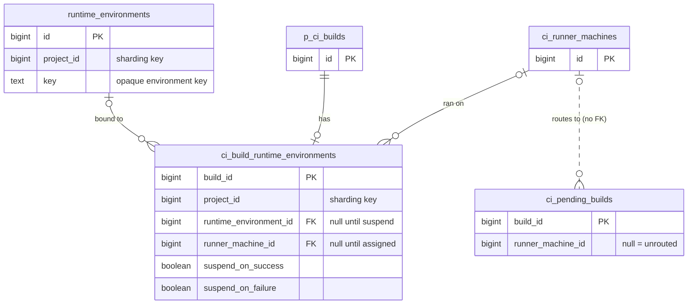



## 概要

現在の Runner 環境はエフェメラルです。ジョブが完了したとき、またはエージェントが人間に質問するために一時停止したとき、その環境は破棄されます。ディスク上のすべて、インストール済みの依存関係、作業中の状態のすべてが失われます。再開するには、プロビジョニング、clone、再ビルドを最初から行うコールドスタートが必要で、誰かが何かを始める前にそれらを完了する必要があります。

**サスペンド可能な環境**は、環境を解放するのではなく、その場でサスペンドすることでこれを解決します。再開すると、完全な状態を保ったまま環境を戻します。ジョブはサスペンショントリガーを設定することで opt in します。完了後、runner は環境をサスペンドし、環境キーを GitLab に報告します。次の実行はそのキーを受け取り、ディスク状態が保持された同じ環境で再開します。

この仕組みには 2 つの実装パスがあり、それぞれ個別のドキュメントで説明しています:

- **[Fleeting ベースのエグゼキューター](fleeting.md)**（Instance と Docker Autoscaler）: インスタンスはクラウドプロバイダー API 経由で停止されます。ディスクはインスタンス自身のストレージ上に保持されます。再開とは、インスタンスの電源を再び入れることです。
- **[Kubernetes エグゼキューター](kubernetes.md)**: Pod は削除されますが、PersistentVolumeClaim が作業ディレクトリを保持します。再開とは、同じ PVC をマウントする新しい Pod を作成することです。

### ユースケース

- **Human-in-the-Loop (HIL)**: エージェントは判断ポイントでサスペンドし、MR に再開リンクを表示します。開発者がそのリンクをクリックすると、数分ではなく数秒で、まったく同じ環境に入れます。
- **コスト効率のよいエージェントセッション**: 複数ステップのタスクを実行するエージェントは、自然なアイドル期間（CI 結果待ち、レビューフィードバック待ち）にサスペンドし、進捗を失うことなく再開します。常時稼働のセッションを、使った分だけ支払う形に変えます。

## 環境キーの設計

環境キーは、サスペンドされた環境の ID です。これは runner ID と system ID（ルーティング用）をプレフィックスとして持ち、それ以外は GitLab にとって opaque です:

```text
<runner-id>/<url-encoded-system-id>/<url-encoded-fields>
```

runner ID と system ID は先頭（2 つ目の `/` より前）に置かれるため、GitLab は残りを parse せずに再開ジョブをルーティングできます。runner ID は runner registration を識別し、system ID は特定の runner manager を識別します。これらを合わせることで、サスペンドされた環境を保持している runner manager process を一意に識別します。system ID は URL パスエンコードされるため、`/` などパス上で意味を持つ文字を含む値も正しく round-trip できます。2 つ目の `/` 以降は URL エンコードされた query string（Go の `url.Values.Encode()` が生成するものと同じ encoding: `key1=value1&key2=value2`、値は URL エスケープ）で、runner だけが parse します。新しいフィールドは外側の構造を変えたり既存 parser を壊したりせずに追加できます。parser は認識しないキーを無視します。

**2 つ目の `/` 以降の内容は executor 内部状態です。Runner Manager の外にあるどのコンポーネントも、その構造を parse、validate、index、または依存してはいけません。** GitLab Rails はルーティングのために runner ID と system ID のプレフィックスを読めますが、それ以降は opaque blob として扱わなければなりません。これにより GitLab API surface を最小限に保ち、コンポーネント横断の変更なしにキー形式を進化させられます。

## サスペンドと再開の挙動

GitLab Runner のすべての新しい変更は、feature flag `FF_SUSPENDABLE_ENVIRONMENTS` の背後に置きます。

### ジョブ完了時のサスペンド

サスペンショントリガーと環境キーは内部的なジョブ配管であり、CI 変数ではありません。これらは pipeline creation chain（例: Workload framework）によって設定され、ユーザーには見えず、group や project settings で上書きできず、CI 変数継承階層の対象にもなりません。

注: どちらも `build.options` には入りません。Options は重複排除された `Ci::JobDefinition`、つまり options storage を約 90% 削減した checksum 付き payload に供給されます。そこにインスタンスごとに一意な環境キーを入れると、一意な definition の数が爆発します。そのため、トリガーとキーは代わりに runtime-environment テーブルに置き、Rails が dispatch 時にそれらを job payload に注入します（[Persistence](#persistence)を参照）。

runner は 2 つのサスペンショントリガー、`suspend_on_success` と `suspend_on_failure` を検査します。ジョブが完了し、一致するトリガーが設定されている場合、runner は環境を解放せずにサスペンドします。ジョブ結果（成功または失敗）は保持されます。両方のトリガーを同時に設定できます。その場合、ジョブ結果に関係なく環境はサスペンドされます。ジョブが（ユーザー、timeout、または pipeline supersession によって）終了された場合、環境は通常どおり解放されます。終了はサスペンドをトリガーしません。サスペンドがすでに進行中のときに終了が到着した場合、終了が優先されます。runner は半端にサスペンドされた環境を残さないようにサスペンド完了を待ち、その後環境を tear down します。再開時、runner は job payload 内の環境キーを受け取り、それを使ってサスペンドされた環境を再開します。

### ジョブ dispatch 時の再開

環境キーが設定されたジョブが到着すると、runner はサスペンドされた環境を再開し、準備ができるまで待ちます。再開時には Git source fetching をスキップします。作業ディレクトリはサスペンドされたジョブから保持されます。git checkout を実行すると未追跡ファイル（build artifacts、インストール済み依存関係、エージェントの checkpoint）が削除され、suspend/resume の目的が損なわれます。`GIT_STRATEGY` は変更されません。source stage が単に実行されないだけです。Cache restore と artifact download の stage は通常どおり実行されます。

## Rails 連携

Rails は環境キーを永続化し、再開時の auth を強制し、再開ワークロードを正しい runner にルーティングします。これは [Runner Environment Service](../runner_job_router/) の一時的な代替です。Runner Environment Service が存在すれば、opaque key の背後で環境ライフサイクルを所有します。その時点で、これらのテーブルとルーティングルールはなくなります。以下の schema は意図的に最小限かつ使い捨てです。

### 永続化

サスペンドされた環境の背後にあるデータは大きく、インスタンス固有で、短命です。環境は TTL 後に tear down され、実際にサスペンドするジョブはごく一部です。これは専用テーブルに置きます。

**`runtime_environments`** - サスペンドされた環境ごとに 1 行: surrogate primary key の `id`、runner が報告する opaque な `key`、および `project_id` sharding key です。`id` は join 用の内部 handle にすぎません。意味を持つ識別子は `key` です。このテーブルは小さく、ライフサイクルに上限があるため、環境と同じ TTL で partition し drop できます。

**`ci_build_runtime_environments`** - suspend/resume に参加する build ごとに 1 行です。build のサスペンショントリガー（`suspend_on_success`、`suspend_on_failure`）と runtime environment へのリンクを保持します。行は、ジョブが opt in した場合にのみ作成されます:

- **サスペンドする可能性があるジョブ**（いずれかの trigger が設定済み）は、pipeline creation 時に `runtime_environment_id` がまだ `NULL` の行を取得します。環境はまだ存在しません。ジョブがサスペンドしてキーを報告すると、Rails は `runtime_environments` 行を作成し、リンクを埋めます。
- **再開** - orchestrator が環境キーを持つジョブを dispatch する場合 - は、pipeline creation 時点で既存環境を指す行を取得します。

1 つの環境は多数のジョブで再利用されます。human-in-the-loop の各 round は同じ環境上の新しいジョブです。そのため、これは多くの build から 1 つの environment への関係です。`runner_machine_id` は実際に build を実行した machine を記録し、assignment 時に設定されます。これは correlation と audit のためのものであり、ルーティング用ではありません。サスペンドしないジョブの行は `NULL` link のままになり、同じ TTL で sweep されます。

両方の新しいテーブルは、`p_ci_runner_machine_builds` にならって `project_id` を sharding key として持ちます。`runner_machine_id` は plain column であり、foreign key ではありません。`ci_runner_machines` は cell-local（異なる schema）なので、cross-schema FK は許可されません。これも `p_ci_runner_machine_builds` と同じです。

Instance runner と dedicated runner は cell-local なので、サスペンドされた環境とそれを保持する runner manager は同じ cell に留まります。ルーティングは intra-cell で、これらのテーブルは CI queue の他の部分と同じように organization とともに移動します。再開ルーティングでは `ci_pending_builds` 上の非正規化カラムを使います。[Job Routing](#job-routing)を参照してください。



注: これは `environment` ではなく `runtime_environment` です。CI はすでに `.gitlab-ci.yml` の deployment keyword に `environment` を使っており、この用語を再利用すると常に混乱の原因になります。

これらは `p_ci_runner_machine_builds` 上のカラムではなく別テーブルです。その理由は、あのテーブルには数十億行があり retention がない長期データだからです。そこに reference column を追加すると foreign key が必要になり、foreign key には対応する（partial ではない）index が必要で、その index は初日から巨大で構築に時間がかかります。ライフサイクルに上限のある別テーブルにより、storage cost と retention を本来あるべき場所に保ち、hot path を触らずに済みます。

### 再開時の認可

環境キーを持つジョブが dispatch されるとき、Rails が中央で auth を強制するため、orchestrator は同じ check を再実装する必要がありません:

- Project match: 環境をサスペンドした build は同じ project に属している。
- Permission: dispatch するユーザーは、環境をサスペンドした build に対して `:update_build` を持っている。

ユーザー単位の binding は強制されません。セッションは正当にユーザー間で transfer されることがあります（handoff、mob debugging）。orchestrator がユーザー単位の policy を必要とする場合、その制約は orchestrator が所有します。

### 再開時のキーフロー

orchestrator は、内部 API endpoint 経由でサスペンドした build の record から環境キーを読み取ります。これは GraphQL ではありません。現時点では public contract ではなく内部 contract だからです。その後、キーを持つ新しいジョブを dispatch します。Pipeline creation はその build を同じ runtime environment に bind します（[Persistence](#persistence)を参照）。アクセスはサスペンドした build に対する `:update_build` によって gate されるため、キーは再開を dispatch できる actor にだけ提供されます。

### ジョブルーティング

ルーティングは queue query 内で runner machine によって行います。

再開された build が `created` から `pending` に移るとき、Rails は環境キーの runner-and-system-id prefix を `runner_machine_id` に解決し、それを `ci_pending_builds` 行へ非正規化します。queue query には 1 つの predicate が追加されます:

```sql
AND (runner_machine_id IS NULL OR runner_machine_id = :requesting_machine_id)
```

`NULL` は、任意の eligible runner が build を取得できることを意味します。これが通常ケースです。値が設定されている場合、その machine だけが取得できます。これは Ruby での post-query check ではなく query predicate です。query が返すすべての行は、要求している runner にとってすでに有効です。これは重要です。queue は候補の bounded window を pull するため、routed build が後から filter out されると queue の先頭で poison pill として残ってしまいます。query 内で filter すればそれを避けられます。

ルーティングキーは machine です。1 つの registration は多くの worker を支え、それらは単一 token を共有します。サスペンドされた環境はそのうちのちょうど 1 つに存在するため、machine が適切な粒度です。query は単一の integer を比較するだけで、key を parse することはありません。key は build が queue に入るときに一度 machine id へ解決されます。

`ci_pending_builds` 行は、routing target がすでに設定された状態で作成されます。そのため、routed build が routing target なしで queue に現れることはありません。誤った machine がそれを取得する window はありません。

## 環境クリーンアップ

### Orchestrator によるクリーンアップ

workflow が環境を使い終えたら、orchestrator はサスペンショントリガーをどちらも設定せずに、環境キーを持つジョブを dispatch します。runner は環境上に再開して（no-op）ジョブを実行し、サスペンドする trigger がないため、再度サスペンドするのではなく解放します。ルーティングと auth は他の再開と同じです。別個の terminate API はありません。

### Runner TTL

runner は安全網として hard TTL を強制します。background loop が、N 日（設定可能、default 1 week）より古いサスペンド環境を tear down します。これにより、クラッシュした workflow、放置されたセッション、orchestrator のバグを捕捉できます。Rails との coordination は不要です。cleanup は local、self-contained、bounded です。

## セキュリティ

1. **環境キーは secret ではありません。** キーは、runner ID、system ID、acquisition UUID または PVC name、任意で container ID など、機微ではない識別子で構成されます。キーを持っているだけでは何も許可されません。認証は引き続き executor 自身の接続メカニズム（Fleeting connection details、Kubernetes API）を通ります。再開ジョブの dispatch にも project membership が必要です。キーをログで mask したり credential として扱ったりする必要はありません。

1. **Runner-local isolation。** 環境キーは、それを発行した runner process に対してのみ意味があります。攻撃者が resume を呼び出せる外部 API はありません。cross-runner replay は構造的に不可能です。runner A のキーは runner B に対して効果を持ちません。

1. **Same-project enforcement。** runner には、環境キーを持つジョブが、その環境をサスペンドした同じ project に属しているか検証する方法がありません。Rails が dispatch 時に project match を中央で強制します。これがなければ、別 project が保持された環境に attach して、その disk contents を読めてしまいます。

1. **Same-user enforcement。** ユーザー単位の binding は強制されません。同じ project 内の別ユーザーが環境上に再開できます。これは意図的です（handoff、mob debugging は正当な cross-user transfer です）。より厳格な user isolation が必要な orchestrator は、その policy を自ら所有します。

1. **サスペンド中の sensitive data at rest。** ジョブ中に環境へ書き込まれたデータ、つまり credentials、API tokens、中間 build secrets は、サスペンド window 全体にわたって保持されます。storage medium（instance disk または PVC）は cloud storage に残ります。侵害された cloud account はそのデータを読めます。workload は、runner の制御外で書き込まれた sensitive data（.git/config に保存された OAuth tokens など）をサスペンド前に cleanup する責任があります。

1. **`CI_JOB_TOKEN` は suspension boundary を越えて残りません。** `CI_JOB_TOKEN` は単一ジョブに scope され、ジョブ完了時に期限切れになります。再開ジョブは GitLab から新しい token を受け取ります。元の token は再利用されません。ただし、元のジョブが `CI_JOB_TOKEN` をディスクへ書き込んだ場合（例: git credential helpers、registry auth configs）、それらの stale credentials は再開環境の disk に残ります。期限切れで認証には使えませんが、at rest の sensitive data です。

1. **サスペンドされたジョブと active job の分離。** suspend/resume は executor の isolation model を変更しません。executor がすでに提供している境界を継承します。Instance executor では、ジョブは host filesystem を共有します。Docker Autoscaler では、各ジョブは独自の container を持ちますが Docker daemon を共有します。suspension window により、サスペンドされたジョブの状態が同じ instance 上の他ジョブと co-resident になる期間が延びます。cross-job isolation の水準は executor configuration（container boundaries、gVisor、privileged mode、`capacity_per_instance`）に依存します。

## スコープ外

1. **再開時の filesystem integrity verification**: runner にはジョブを戻す前に disk state を検証する仕組みがありません。破損または欠落した filesystem の検出や復旧はスコープ外です。
1. **nesting ありの Instance executor**: nesting は単一 instance 上で複数の isolated VM を実行します。個別の nested VM に対する suspend/resume はスコープ外です。Instance executor の suspend/resume steps は、instance 自体が環境である non-nested case に適用されます。
1. **Shell、Docker（standalone）、docker+machine executor**: これらの executor は legacy です。suspend/resume は実装しません。
1. **孤立した cloud resources**: サスペンド状態は disk に永続化され、runner restart 時に再構築されます。ただし、永続化された状態が失われた場合（disk failure、manual deletion）、基盤となる instance または PVC は管理するものがない状態で残ります。cloud-level orphan detection（例: 対応する runner state のない tagged resources）はスコープ外です。

## 未解決の質問

1. **Observability and metrics**: operator は、cost と capacity を管理するために suspend/resume operation への visibility を必要とします。どの metrics を公開すべきでしょうか（suspend/resume latency、failure rate、現在サスペンドされている環境数、time-in-suspension distribution、storage cost）？ これらは runner-level Prometheus metrics、GitLab への report、またはその両方にすべきでしょうか？

## 今後の作業

### GitLab によるサスペンド開始

GitLab からの signal によって実行中にサスペンドします。例えば UI から agent session を一時停止する場合です。これには GitLab から runner への signal channel が必要で、実行中の script を interrupt し、ジョブが exit する前に suspension を trigger します。

### Agent によるサスペンド開始

agent または script 自身がいつ一時停止するかを決める interactive workflow では、環境に in-band の suspension API が必要です。ここまで説明した job-completion trigger だけでは足りません。[Runner Environment Service](../runner_job_router/) はこの形を定義しています。environment lifecycle のための `Create`、`Stop`、`Start`、`Terminate` と、環境内で実行するための `Run`/`Exec` であり、[step-runner proto](https://gitlab.com/gitlab-org/step-runner/-/blob/e0f48aa3d1049f510c015878d93d08c410e6822d/proto/sandbox.proto) に sketched されています。この blueprint の suspend/resume mechanism は、その model における `Stop`/`Start` の実装です。これらの operation を環境内の agent に公開し、判断ポイントでサスペンドし、人間に質問を提示し、回答とともに再開できるようにすることは、その上に築く将来のイテレーションです。

### 取り外し可能なストレージ

Instance suspend は VM を停止したままにすることで、instance 自身の disk 上に state を保持します。dedicated volume は、instance が完全に解放されても存続する別管理の disk 上に state を永続化します。これらは独立して使うことも組み合わせることもできます。ジョブは instance をサスペンドし、追加 durability のために volume を attach したままにできます。または volume だけを使い、instance slot を完全に明け渡せます。これは、継続的な instance billing を受け入れられない長期サスペンドや、サスペンド中に reclaim される可能性がある spot/preemptible instance 上の workload にとって有用です。環境キー形式はすでにこれをサポートしています。外側の構造を変えずに、executor-specific fields と並べて `volume-id` field を追加できます。

### CI デバッグ

`suspend_on_failure` によって失敗ポイントでジョブをサスペンドします。開発者は pipeline を再実行せずに、保持された環境へ再開して調査できます。

## 参考資料

- [Resumable Jobs for CI and Agent Sessions](https://gitlab.com/groups/gitlab-org/-/work_items/21159)
- [Blueprint - Resumable Jobs for CI and Agent Sessions](https://gitlab.com/gitlab-org/gitlab/-/work_items/593314)
- [GitLab Runner Job Router](../runner_job_router/) - Runner Environment Service を定義します
- [Suspendable Environments on Kubernetes - Research](https://gitlab.com/-/snippets/5973444)
- [Provision a runner fleet with a modern executor for the duo tag](https://gitlab.com/gitlab-org/gitlab/-/work_items/597038)
