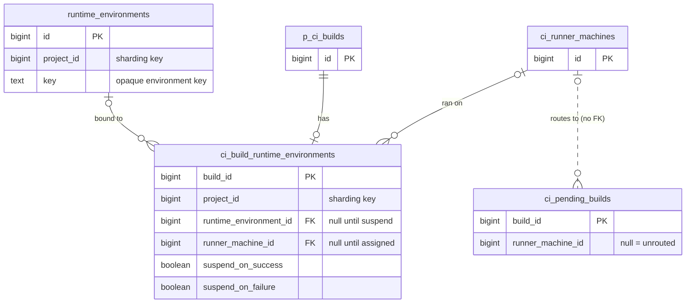



## 概要

現在の Runner 環境は一時的なものです。ジョブが終了したとき、またはエージェントが人間に質問するために一時停止したとき、環境は破棄されます。ディスク上のすべて、インストール済みのすべての依存関係、作業状態のすべてが失われます。再開するには、プロビジョニング、クローン、再ビルドを最初から行うコールドスタートが必要であり、それが終わるまで何もできません。

**サスペンド可能な環境**は、環境を解放する代わりにその場でサスペンドすることで、この問題を解決します。再開すると、すべての状態を保持したまま環境が復元されます。ジョブはサスペンドトリガーを設定して、この機能をオプトインします。ジョブ完了後、Runner は環境をサスペンドし、環境キーを GitLab に報告します。次の実行はそのキーを受け取り、ディスク状態が保持された同じ環境で再開します。

このメカニズムには 2 つの実装パスがあり、それぞれ個別のドキュメントで説明します。

- **[Fleeting ベースのエグゼキューター](fleeting.md)**（Instance と Docker Autoscaler）: クラウドプロバイダー API を介してインスタンスを停止します。ディスクはインスタンス自身のストレージに保持されます。再開とは、インスタンスの電源を再び入れることです。
- **[Kubernetes エグゼキューター](kubernetes.md)**: Pod は削除されますが、PersistentVolumeClaim が作業ディレクトリを保持します。再開とは、同じ PVC をマウントする新しい Pod を作成することです。

### ユースケース

- **Human-in-the-Loop（HIL）**: エージェントは意思決定ポイントでサスペンドし、MR に再開リンクを表示します。開発者がそれをクリックすると、数分ではなく数秒でまったく同じ環境に入れます。
- **コスト効率の高いエージェントセッション**: 複数ステップのタスクに取り組むエージェントは、自然なアイドル期間（CI の結果やレビューフィードバックを待つ間）にサスペンドし、進捗を失うことなく再開します。これにより、常時稼働のセッションを使用分だけ支払う方式に変えられます。

## 環境キーの設計

環境キーは、サスペンドされた環境の識別子です。先頭に Runner ID と system ID（ルーティング用）が付き、それ以外の部分は GitLab にとって不透明です。

```text
<runner-id>/<url-encoded-system-id>/<url-encoded-fields>
```

Runner ID と system ID は先頭（2 つ目の `/` より前）にあるため、GitLab は残りを解析せずに再開ジョブをルーティングできます。Runner ID は Runner の登録を識別し、system ID は特定のランナーマネージャーを識別します。この 2 つを組み合わせることで、サスペンドされた環境を保持するランナーマネージャープロセスを一意に識別します。system ID は URL パスエンコードされるため、パス上で意味を持つ文字（`/` など）を含む値も正しく往復変換されます。2 つ目の `/` より後はすべて、URL エンコードされたクエリ文字列（Go の `url.Values.Encode()` が生成するものと同じエンコード: `key1=value1&key2=value2`、値は URL エスケープ済み）であり、Runner だけが解析します。外側の構造を変更したり既存のパーサーを壊したりすることなく、新しいフィールドを追加できます。パーサーは認識しないキーを無視します。

**2 つ目の `/` より後の内容は、エグゼキューター内部の状態です。Runner Manager 以外のコンポーネントは、その構造を解析、検証、インデックス化したり、その構造に依存したりしてはなりません。** GitLab Rails はルーティングのために Runner ID と system ID のプレフィックスを読み取ることができますが、それ以降はすべて不透明な blob として扱わなければなりません。これにより GitLab API のサーフェスを最小限に保ち、コンポーネント間の変更なしにキーフォーマットを進化させられます。

## サスペンドと再開の動作

GitLab Runner のすべての新しい変更は、フィーチャーフラグ `FF_SUSPENDABLE_ENVIRONMENTS` の背後に置かれます。

### ジョブ完了時のサスペンド

サスペンドトリガーと環境キーはジョブ内部の仕組みであり、CI 変数ではありません。これらはパイプライン作成チェーン（Workload フレームワークなど）によって設定され、ユーザーには表示されず、グループやプロジェクトの設定で上書きできず、CI 変数の継承階層の対象にもなりません。

注: どちらも `build.options` には格納されません。options は重複排除された `Ci::JobDefinition`（チェックサム付きペイロードであり、options のストレージを約 90% 削減したもの）に渡されます。そこにインスタンス固有の環境キーを格納すると、一意な定義の数が爆発的に増加します。そのため、トリガーとキーは代わりにランタイム環境テーブルに格納され、Rails がディスパッチ時にジョブペイロードへ挿入します（[永続化](#persistence)を参照）。

Runner は `suspend_on_success` と `suspend_on_failure` という 2 つのサスペンドトリガーを検査します。ジョブが完了し、一致するトリガーが設定されている場合、Runner は環境を解放せずにサスペンドします。ジョブの結果（成功または失敗）は保持されます。両方のトリガーを同時に設定できます。その場合、ジョブの結果にかかわらず環境はサスペンドされます。ジョブが終了させられた場合（ユーザー、タイムアウト、またはパイプラインの置き換えによるもの）、環境は通常どおり解放されます。終了によってサスペンドがトリガーされることはありません。サスペンドがすでに進行中のときに終了要求が届いた場合、終了が優先されます。Runner は中途半端にサスペンドされた環境が残らないようサスペンドの完了を待ってから、環境を破棄します。再開時に Runner はジョブペイロード内の環境キーを受け取り、それを使用してサスペンドされた環境を再開します。

### ジョブディスパッチ時の再開

環境キーが設定されたジョブが到着すると、Runner はサスペンドされた環境を再開し、準備が整うまで待機します。再開時には Git ソースのフェッチをスキップします。作業ディレクトリはサスペンドされたジョブから保持されています。git checkout を実行すると、追跡されていないファイル（ビルドアーティファクト、インストール済みの依存関係、エージェントのチェックポイント）が削除され、サスペンド/再開の目的が損なわれます。`GIT_STRATEGY` は変更されず、ソースステージが実行されないだけです。キャッシュの復元とアーティファクトのダウンロードステージは、引き続き通常どおり実行されます。

## Rails との統合

Rails は環境キーを永続化し、再開時の認証を適用し、再開するワークロードを正しい Runner にルーティングします。これは [Runner Environment Service](../runner_job_router/) が存在するまでの一時的な代替です。このサービスができれば、不透明なキーの背後で環境ライフサイクルを管理し、その時点でこれらのテーブルとルーティングルールは廃止されます。以下のスキーマは、意図的に最小限かつ使い捨てにしています。

### 永続化 {#persistence}

サスペンドされた環境の背後にあるデータは大きく、インスタンス固有で、短命です。環境は TTL 後に破棄され、サスペンドするジョブはごく一部に限られます。このデータは専用のテーブルに格納されます。

**`runtime_environments`** - サスペンドされた環境ごとに 1 行です。代理主キー `id`、Runner が報告する不透明な `key`、およびシャーディングキー `project_id` を持ちます。`id` は JOIN 用の内部ハンドルにすぎず、意味を持つ識別子は `key` です。このテーブルは小さく、ライフサイクルに上限があるため、環境と同じ TTL でパーティショニングして削除できます。

**`ci_build_runtime_environments`** - サスペンド/再開に参加するビルドごとに 1 行です。ビルドのサスペンドトリガー（`suspend_on_success`、`suspend_on_failure`）と、ランタイム環境へのリンクを保持します。ジョブがオプトインした場合にのみ行を作成します。

- **サスペンドする可能性があるジョブ**（いずれかのトリガーが設定されている場合）は、パイプライン作成時に `runtime_environment_id` がまだ `NULL` の行を取得します。この時点では環境がまだ存在しません。ジョブがサスペンドしてキーを報告すると、Rails は `runtime_environments` 行を作成してリンクを設定します。
- **再開** - オーケストレーターが環境キーを持つジョブをディスパッチすると、パイプライン作成時に既存の環境をすでに指している行を取得します。

1 つの環境は多くのジョブで再利用されます。Human-in-the-Loop の各ラウンドは同じ環境上の新しいジョブになるため、多数のビルド対 1 つの環境という関係になります。`runner_machine_id` は、実際にビルドを実行したマシンを記録し、割り当て時に設定されます。これは相関分析と監査用であり、ルーティング用ではありません。ジョブが一度もサスペンドしなかった行は `NULL` のリンクを保持し、同じ TTL で削除されます。

両方の新しいテーブルは、`p_ci_runner_machine_builds` をモデルとして、`project_id` をシャーディングキーに持ちます。`runner_machine_id` は外部キーではなく、通常のカラムです。`ci_runner_machines` はセルローカル（別のスキーマ）であるため、スキーマをまたぐ FK は許可されません。これも `p_ci_runner_machine_builds` と同じです。

インスタンス Runner と専用 Runner はセルローカルであるため、サスペンドされた環境とそれを保持するランナーマネージャーは同じセルに留まります。ルーティングはセル内で行われ、これらのテーブルは CI キューの他の部分と同様に Organization とともに移動します。再開のルーティングでは、`ci_pending_builds` の非正規化されたカラムを使用します。[ジョブルーティング](#job-routing)を参照してください。



注: これは `environment` ではなく `runtime_environment` です。CI は `.gitlab-ci.yml` のデプロイキーワードですでに `environment` を使用しており、この用語を再利用すると混乱が絶えません。

これらを `p_ci_runner_machine_builds` のカラムではなく別のテーブルにするのは、そのテーブルに数十億行があり、保持期限がなく、長期データであるためです。そこに参照カラムを追加するには外部キーが必要で、外部キーには対応する（部分インデックスではない）インデックスが必要です。そのインデックスは初日から大きく、構築にも時間がかかります。ライフサイクルに上限がある別テーブルにすることで、ストレージコストと保持期間を適切な場所に置き、ホットパスに影響を与えずに済みます。

### 再開時の認証

Rails は環境キーを持つジョブがディスパッチされるときに認証を一元的に適用するため、オーケストレーターがチェックを再実装する必要はありません。

- プロジェクトの一致: 環境をサスペンドしたビルドが同じプロジェクトに属していること。
- 権限: ディスパッチするユーザーが、環境をサスペンドしたビルドに対する `:update_build` を持っていること。

ユーザー単位の紐付けは適用しません。セッションはユーザー間で正当に移行できるためです（引き継ぎ、モブデバッグ）。オーケストレーターがユーザー単位のポリシーを必要とする場合、その制約はオーケストレーターが担います。

### 再開時のキーフロー

オーケストレーターは、サスペンドしたビルドのレコードから内部 API エンドポイントを介して環境キーを読み取り、そのキーを持つ新しいジョブをディスパッチします。現時点では公開コントラクトではなく内部コントラクトであるため、GraphQL は使用しません。パイプライン作成時に、そのビルドを同じランタイム環境に紐付けます（[永続化](#persistence)を参照）。アクセスはサスペンドしたビルドに対する `:update_build` に制限されるため、そのキーを取得できるのは再開をディスパッチできるアクターだけです。

### ジョブルーティング {#job-routing}

ルーティングはキュークエリ内で Runner マシンを基準に行います。

再開するビルドが `created` から `pending` に移ると、Rails は環境キーの Runner と system ID のプレフィックスを `runner_machine_id` に解決し、それを `ci_pending_builds` 行に非正規化します。キュークエリには次の述語が 1 つ追加されます。

```sql
AND (runner_machine_id IS NULL OR runner_machine_id = :requesting_machine_id)
```

`NULL` は、通常どおり、適格な Runner ならどれでもビルドを取得できることを意味します。値が設定されている場合、そのマシンだけが取得できます。これは Ruby でのクエリ後チェックではなく、クエリの述語です。クエリが返すすべての行は、要求元の Runner に対してすでに有効です。キューが候補の限られた範囲を取得するため、これは重要です。ルーティングされたビルドを後からフィルタリングすると、キューの先頭にポイズンピルとして残り続けます。クエリ内でフィルタリングすることで、これを回避します。

ルーティングキーにはマシンを使用します。1 つの登録が多数のワーカーを支え、それらは 1 つのトークンを共有します。また、サスペンドされた環境はそのうちの厳密に 1 つに存在するため、マシンが適切な粒度です。クエリは 1 つの整数を比較するだけで、キーを解析することはありません。キーはビルドがキューに入るときに一度だけマシン ID に解決されます。

`ci_pending_builds` 行は、ルーティング先がすでに設定された状態で作成されるため、ルーティング対象のビルドがルーティング先なしでキューに現れることはありません。誤ったマシンが取得できる時間枠はありません。

## 環境のクリーンアップ

### オーケストレーターによるクリーンアップ

ワークフローが環境を使い終えると、オーケストレーターはサスペンドトリガーをどちらも設定せず、環境キーを持つジョブをディスパッチします。Runner はその環境上で再開し、（何もしない）ジョブを実行します。そしてサスペンドするトリガーがないため、再びサスペンドせずに環境を解放します。ルーティングと認証は他の再開と同じであり、独立した終了 API はありません。

### Runner の TTL

Runner は安全網として厳格な TTL を適用します。バックグラウンドループは、N 日（設定可能、デフォルトは 1 週間）より古いサスペンド済み環境をすべて破棄します。これにより、クラッシュしたワークフロー、放棄されたセッション、オーケストレーターのバグを捕捉します。Rails との連携は不要です。クリーンアップはローカルで自己完結し、範囲が限定されています。

## セキュリティ

1. **環境キーはシークレットではありません。** キーは、Runner ID、system ID、取得 UUID または PVC 名、オプションのコンテナ ID という機密性のない識別子で構成されます。キーを所有するだけでは何の権限も得られません。認証は引き続きエグゼキューター自身の接続メカニズム（Fleeting の接続詳細、Kubernetes API）を経由します。再開ジョブのディスパッチにもプロジェクトメンバーシップが必要です。キーをログ内でマスクしたり、認証情報として扱ったりする必要はありません。

1. **Runner ローカルの分離。** 環境キーは、それを発行した Runner プロセスにのみ意味があります。攻撃者が再開を呼び出せる外部 API はありません。Runner 間のリプレイは構造上不可能です。Runner A のキーは Runner B には何の効果もありません。

1. **同一プロジェクトの強制。** Runner には、環境キーを持つジョブが、その環境をサスペンドしたのと同じプロジェクトに属しているかを検証する方法がありません。Rails はディスパッチ時にプロジェクトの一致を一元的に適用します。これがなければ、別のプロジェクトが保持された環境に接続し、そのディスク内容を読み取れる可能性があります。

1. **同一ユーザーの強制。** ユーザー単位の紐付けは適用しません。同じプロジェクト内の別のユーザーがその環境上で再開できます。これは意図的な設計です（引き継ぎやモブデバッグは、ユーザー間の正当な移行です）。より厳格なユーザー分離を必要とするオーケストレーターは、そのポリシーを担います。

1. **サスペンド中の保存データに含まれる機密情報。** ジョブ中に環境へ書き込まれたすべてのデータ（認証情報、API トークン、中間的なビルドシークレット）は、サスペンド期間全体にわたって保持されます。ストレージ媒体（インスタンスディスクまたは PVC）はクラウドストレージに残ります。クラウドアカウントが侵害されると、そのデータを読み取られる可能性があります。サスペンド前に、Runner の制御外で書き込まれた機密データ（`.git/config` に永続化された OAuth トークンなど）をクリーンアップする責任はワークロードにあります。

1. **`CI_JOB_TOKEN` はサスペンド境界を越えて存続しません。** `CI_JOB_TOKEN` は 1 つのジョブにスコープされ、ジョブ完了時に期限切れになります。再開したジョブは GitLab から新しいトークンを受け取り、元のトークンは再利用されません。ただし、元のジョブが `CI_JOB_TOKEN` をディスクに書き込んでいた場合（git の credential helper、レジストリ認証設定など）、その古い認証情報は再開した環境のディスクに残ります。期限切れで認証には使えませんが、保存データとしては機密情報です。

1. **サスペンドされたジョブとアクティブなジョブ間の分離。** サスペンド/再開はエグゼキューターの分離モデルを変更せず、エグゼキューターがすでに提供している境界を継承します。Instance エグゼキューターでは、ジョブがホストファイルシステムを共有します。Docker Autoscaler では、各ジョブに独自のコンテナがありますが、Docker デーモンを共有します。サスペンド期間により、サスペンドされたジョブの状態が同じインスタンス上の他のジョブと共存する期間が延びます。ジョブ間の分離レベルはエグゼキューターの設定（コンテナ境界、gVisor、privileged モード、`capacity_per_instance`）によって異なります。

## スコープ外

1. **再開時のファイルシステム整合性検証**: Runner には、ジョブへ環境を戻す前にディスク状態を検証するメカニズムがありません。破損または欠落したファイルシステムの検出や復旧はスコープ外です。
1. **ネストを使用する Instance エグゼキューター**: ネストでは 1 つのインスタンス上で複数の分離された VM を実行します。個々のネストされた VM のサスペンド/再開はスコープ外です。Instance エグゼキューターのサスペンド/再開手順は、インスタンス自体が環境となるネストなしの場合に適用されます。
1. **Shell、Docker（スタンドアロン）、docker+machine エグゼキューター**: これらのエグゼキューターはレガシーです。サスペンド/再開は実装しません。
1. **孤立したクラウドリソース**: サスペンド状態はディスクに永続化され、Runner の再起動時に再構築されます。ただし、永続化された状態が失われた場合（ディスク障害、手動削除）、基盤となるインスタンスや PVC を管理するものがいなくなります。クラウドレベルの孤立検出（対応する Runner 状態がないタグ付きリソースなど）はスコープ外です。

## 未解決の質問

1. **可観測性とメトリクス**: オペレーターがコストとキャパシティを管理するには、サスペンド/再開操作を可視化する必要があります。どのメトリクスを公開すべきでしょうか（サスペンド/再開のレイテンシ、失敗率、現在サスペンドされている環境数、サスペンド時間の分布、ストレージコスト）? Runner レベルの Prometheus メトリクスにすべきか、GitLab に報告すべきか、またはその両方でしょうか?

## 今後の作業

### GitLab が開始するサスペンド

たとえば UI からエージェントセッションを一時停止する場合など、GitLab からのシグナルによって実行途中でサスペンドします。実行中のスクリプトに割り込み、ジョブが終了する前にサスペンドをトリガーする、GitLab から Runner へのシグナルチャネルが必要です。

### エージェントが開始するサスペンド

エージェントやスクリプト自体が一時停止するタイミングを決めるインタラクティブなワークフローでは、環境にインバンドのサスペンド API が必要です。前述したジョブ完了トリガーだけでは不十分です。[Runner Environment Service](../runner_job_router/) はこの形を定義しています。環境ライフサイクル用の `Create`、`Stop`、`Start`、`Terminate` と、環境内で実行するための `Run`/`Exec` であり、[step-runner proto](https://gitlab.com/gitlab-org/step-runner/-/blob/e0f48aa3d1049f510c015878d93d08c410e6822d/proto/sandbox.proto)に概要が示されています。このブループリントのサスペンド/再開メカニズムは、そのモデルにおける `Stop`/`Start` の実装です。これらの操作を環境内のエージェントに公開し、エージェントが意思決定ポイントでサスペンドして人間に質問を提示し、回答とともに再開できるようにすることは、このメカニズムを基盤とする今後のイテレーションです。

### デタッチ可能なストレージ

Instance のサスペンドでは、VM を停止状態に保つことで、インスタンス自身のディスク上に状態を保持します。専用ボリュームでは、インスタンスを完全に解放しても存続する、個別に管理されたディスク上に状態を保持します。これらは個別にも組み合わせても使用できます。ジョブはインスタンスをサスペンドし、耐久性を高めるためにボリュームを接続したままにすることも、ボリュームだけを使用してインスタンスのスロットを完全に解放することもできます。後者は、継続的なインスタンス課金を許容できない長期間のサスペンドや、サスペンド中に回収される可能性があるスポット/プリエンプティブルインスタンス上のワークロードに有用です。環境キーフォーマットはすでにこれをサポートしています。外側の構造を変更せずに、エグゼキューター固有のフィールドとともに `volume-id` フィールドを追加できます。

### CI のデバッグ

失敗したジョブを `suspend_on_failure` によって失敗時点でサスペンドします。開発者は保持された環境上で再開し、パイプラインを再実行せずに調査できます。

## 参考資料

- [CI とエージェントセッション向けの再開可能なジョブ](https://gitlab.com/groups/gitlab-org/-/work_items/21159)
- [ブループリント - CI とエージェントセッション向けの再開可能なジョブ](https://gitlab.com/gitlab-org/gitlab/-/work_items/593314)
- [GitLab Runner ジョブルーター](../runner_job_router/) - Runner Environment Service を定義します
- [Kubernetes 上のサスペンド可能な環境 - 調査](https://gitlab.com/-/snippets/5973444)
- [`duo` タグ向けに最新のエグゼキューターを使用する Runner フリートをプロビジョニングする](https://gitlab.com/gitlab-org/gitlab/-/work_items/597038)
