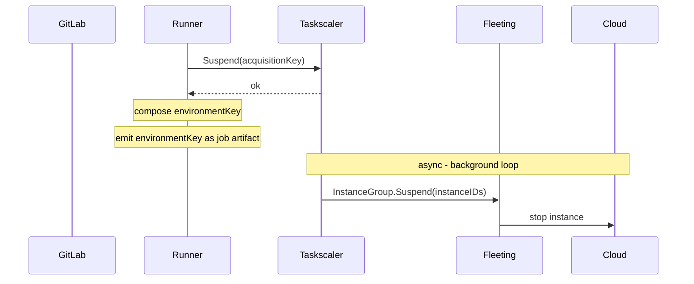
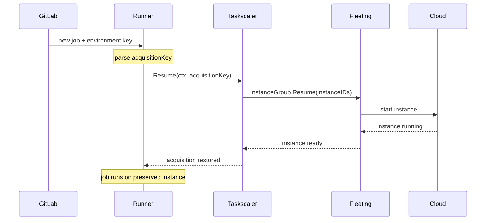
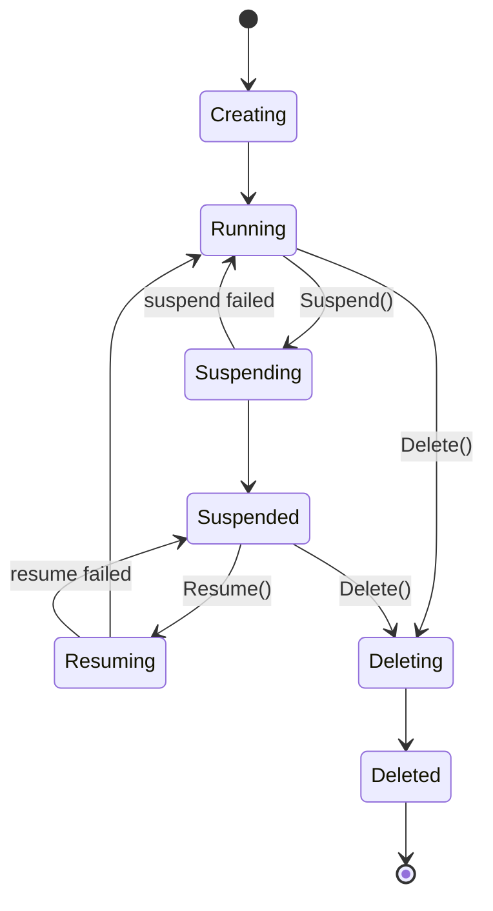

このドキュメントでは、Fleeting/Taskscaler stack を通じて管理される cloud VM 上で動作する **Instance および Docker Autoscaler エグゼキューター**向けの suspend/resume 実装を説明します。サスペンドとは、cloud provider API 経由で VM を停止することを意味します。disk は instance 自身の storage に保持されます。再開とは、instance の電源を再び入れることです。

共有設計（環境キー形式、security model、open questions）については、[main blueprint](_index.md)を参照してください。Kubernetes executor 実装については、[kubernetes.md](kubernetes.md)を参照してください。

## アーキテクチャ

Suspend/Resume は opt-in capability であり、bottom-up に伝播します。cloud plugin が capabilities で support を宣言し、fleeting がそれを taskscaler に公開し、taskscaler が同じ情報を runner に公開します。chain のいずれかの layer が suspension を support しておらず、job がそれを要求した場合、runner は job を失敗させます。

### サスペンドフロー



### 再開フロー



## アーキテクチャ設計記録 (ADR)

### ADR1: Instance suspension の遅延実行

acquisition を suspended として mark する処理は即座に行います。基盤となる instance stop は、その instance 上のすべての acquisition が suspended または released になるまで延期します。単一 instance が複数の concurrent jobs を処理することはよくあります。1 つをサスペンドしても他の job に影響してはいけません。

### ADR2: Cloud suspend 中の acquisition ブロック

instance に対する cloud suspend operation が in-flight の間、新しい acquisition はその instance に着地してから suspend を cancel するのではなく、その instance を完全に skip します。これにより、新しい job が進行中の cloud stop と競合するときに発生する cancel tracking と補償的な resume operation が不要になります。cost は、cloud stop が完了するまで instance の空き slot が一時的に使えないことです。ただし cloud stop は、その instance 上のすべての acquisition が suspended または released になったときにのみ始まるため、それらの slot はすでに idle でした。この window 中に demand が到着した場合、scaler は新しい instance を provision します。

## コンポーネント

### Fleeting

`StateSuspended` は長寿命の stable state です。instance は何時間、何日も suspended のままでいられます。これは `StateRunning` と同じ configurable slow rate で poll されます。transitional states（`StateSuspending`、`StateResuming`）だけが aggressive polling を trigger します。suspended instance は、最初に resumed されなくても直接 deleted できます。



Capabilities は、既存の `Init()` call から返される `ProviderInfo` の一部として plugin によって宣言されます。別個の RPC は不要です:

```go
type ProviderInfo struct {
    // existing fields unchanged...
    Capabilities []Capability
}

type Capability string

const (
    CapabilitySuspendResume Capability = "suspend_resume"
    // future capabilities added here
)
```

provisioner は init 時に `ProviderInfo.Capabilities` を一度読み取り、caller が abstraction を越えて参照しないように `HasCapability(cap)` を公開します。`HasCapability(CapabilitySuspendResume)` が true の場合にのみ、plugin の `Suspend`/`Resume` を invoke します。`HasCapability` は generic な capability check であり、`suspend_resume` と将来の任意の capability の両方で機能します。

`Suspend` と `Resume` は core `InstanceGroup` interface に追加されます。provisioner は plugin が `suspend_resume` capability を宣言した場合にのみこれらを呼び出します。capability を宣言しない plugin はこれらの method を呼び出されることがなく、実装を stub のままにできます。

```go
type InstanceGroup interface {
    // existing methods unchanged...
    Suspend(ctx context.Context, instances []string) (succeeded []string, err error)
    Resume(ctx context.Context, instances []string) (succeeded []string, err error)
}
```

サスペンドされたインスタンスはプールの一部のままです。停止中でもクラウドリソースを保持し、provisioner はそれらの代替インスタンスを起動しません。

instance の readiness signal は、instance が `StateRunning` を離れるたびに reset されます。これは `StateSuspended` に到達したときだけではありません。これにより、`StateSuspended` に到達しない `Running -> Suspending -> Running`（failed suspend revert）を含むすべての transition path で正しい挙動を保証します。resumed instance を待つ caller は、新しく provision された instance と同じ wait mechanism を使います。

fleeting state machine には `Suspending -> Resuming` transition がないため、resume は in-flight suspend がまず `StateSuspended` に到達するのを待つ必要があります。Fleeting はこれを内部で処理します。configured timeout に bound されながら suspended state を待ってから cloud resume を発行し、その後 instance が `StateRunning` に到達するのを待ってから return します。

### Fleeting プラグイン

plugin は `Init()` で `ProviderInfo.Capabilities` に値を設定し、`Suspend`/`Resume` を実装することで opt in します:

```go
func (g *InstanceGroup) Init(ctx context.Context, log hclog.Logger, settings provider.Settings) (provider.ProviderInfo, error) {
    // existing init logic...
    return provider.ProviderInfo{
        // existing fields...
        Capabilities: []provider.Capability{provider.CapabilitySuspendResume},
    }, nil
}

func (g *InstanceGroup) Suspend(ctx context.Context, instances []string) ([]string, error) {
    // 1. Move instances out of auto-scaling management
    // 2. Stop instances
    // 3. Return IDs of successfully suspended instances
    return succeeded, nil
}

func (g *InstanceGroup) Resume(ctx context.Context, instances []string) ([]string, error) {
    // 1. Start instances
    // 2. Re-add instances to auto-scaling management
    // 3. Return IDs of successfully resumed instances
    return succeeded, nil
}
```

opt in しない plugin は `Capabilities` を empty のままにします。provisioner はそれらに `Suspend`/`Resume` を呼び出しません。既存の precompiled plugins は、変更なしでそのまま動作します。

### Cloud provider プラグイン

各 cloud provider には同じ課題があります。managed auto-scaling group に属する instance を停止すると、その group の health checks が instance を unhealthy と mark し、replace します。各ケースの解決策は、instance を停止する前に active management から外し、resume 時に復元することです。stop step が部分的に失敗した場合は、影響を受けた instance について直前の step を rollback します。

| クラウド | サスペンド | 再開 | 注記 |
|---|---|---|---|
| AWS | `EnterStandby` (ASG) -> `StopInstances` (EC2) | `StartInstances` (EC2) -> `ExitStandby` (ASG) | |
| GCP | `abandonInstances` (MIG) -> `instances.stop` (CE) | `instances.start` (CE) -> `addInstances` (MIG) | |
| Azure | Enable instance protection (VMSS) -> `deallocate` (VMSS) | `start` (VMSS) -> Remove instance protection (VMSS) | suspend 時に instance を scaling group から外し、resume 時に戻す AWS や GCP と異なり、Azure は suspend/resume cycle 全体を通じて instance を VMSS 内に保持します。Instance protection は VMSS がそれを terminate することを防ぎますが、instance は VMSS autoscaling rules から見え続け、suspension と resumption の両方の間、scale set の capacity として count されます。Azure plugin は desired vs. actual capacity を reconcile するときにこれを考慮する必要があります。 |

instance を停止すると、すべての cloud で ephemeral public IP が release されます。resume 時には新しい public IP が割り当てられます。VPC/VNET 内の private IP は、すべての cloud で stop/start cycle をまたいで stable です。

runner は instance へ接続する前に常に connection details を再取得するため、resume 後は常に現在の IP を使います。plugin は stop/start cycle をまたいで address を cache してはいけません。

### Taskscaler

既存の `Taskscaler` interface に 3 つの method を追加します:

```go
type Taskscaler interface {
    // existing methods unchanged...
    // HasCapability returns true if the underlying fleeting provisioner supports the given capability.
    HasCapability(cap provider.Capability) bool
    // Suspend marks an acquisition as suspended and cancels its context with ErrAcquisitionSuspended.
    // Fails fast if the provisioner does not support suspend/resume.
    // The acquisition is preserved - not removed - for Resume.
    // The actual instance stop is deferred until the last non-suspended acquisition on the instance is
    // suspended or released, so suspending one job never disrupts other jobs on the same instance.
    Suspend(key string) error
    // Resume restores the acquisition by resuming the underlying instance via
    // fleeting and waiting for it to become ready. State inspection (running,
    // suspending, suspended) is handled by the fleeting provisioner internally.
    // If the context is cancelled, the acquisition stays suspended so the caller can retry.
    Resume(ctx context.Context, key string) (Acquisition, error)
}
```

suspended slot assignments は disk に永続化されます。restart 時、taskscaler は保存済み state から suspended acquisitions を再構築し、再 provision しません。graceful shutdown 中、runner は通常、active acquisition がすべて完了する（drain）まで待ってから exit します。suspended acquisitions はこの drain count から除外されます。実行中ではないため、runner はそれらを待ちません。同様に、suspended instances は teardown 中に skip されるため、解放されるのではなく runner restart をまたいで persist します。

suspended slots は、new provisioning を妨げない方法で scaling calculation から除外されます。suspended instance は active capacity として count されないため、その suspended slots が "unavailable" count を膨らませてはいけません。そうしないと、scaler の demand guard が active instances で処理可能な量を demand が超えていると誤って判断し、scale up を拒否してしまいます。suspended slots は idle capacity からも除外されるため、scaler はそれらを available として扱いません。suspended slots を持つ instance に対する new acquisitions は許可されます。acquisition loop は suspended slot indices を skip し、available slots に新しい job を配置します。in-flight cloud suspend を持つ instances は acquisition loop によって完全に skip されます（ADR2 を参照）。

suspended instances は runner の configured capacity（例: `MaxInstances`）に count されなければなりません。停止中の VM でも slot を保持しています。scaler が provision 可能な instance 数を評価するときに suspended instances を無視すると、無制限の suspension が configured capacity ceiling を使い切り、新しい instance の作成を妨げる可能性があります。

## GitLab Runner

GitLab Runner のすべての新しい変更は、feature flag `FF_SUSPENDABLE_ENVIRONMENTS` の背後に置きます。

### Executor の suspend/resume インターフェース

executor-specific な suspend/resume behaviour は、1 つの interface と 1 つの concrete struct を通じて provider から分離されます:

```go
// SuspendableExecutor is implemented by executors that can preserve a job's
// workload state across job boundaries.
type SuspendableExecutor interface {
    // Suspend persists the workload state and returns the fields needed to
    // restore it. These fields are carried in the EnvironmentKey to a future
    // resuming job.
    Suspend(ctx context.Context) (url.Values, error)
    // Resume rebuilds the workload state from the fields produced by a prior
    // Suspend call.
    Resume(ctx context.Context, fields url.Values) error
}

// EnvironmentKey identifies a suspended environment. The runner produces it
// when suspending a job and parses it when a follow-up job resumes. The
// runner-id and system-id route the resume back to the same runner instance
// that issued the suspension; the fields carry executor-specific state.
//
// Format: <runner-id>/<url-encoded-system-id>/<url-encoded-fields>
type EnvironmentKey struct {
    RunnerID int64
    SystemID string
    Fields   url.Values
}
```

provider は executor-agnostic です。suspension triggers に基づいて *suspend するかどうか* を決めますが、*どう suspend するか* は `SuspendableExecutor` 経由で executor に委譲します。provider は自身の routing fields（例: `acquisition-key`）を同じ `url.Values` に混ぜ込み、結果として得られる `EnvironmentKey` を emit します。resume 時、provider は wire-format string を `EnvironmentKey` に parse し、自身が所有する fields を取り出して、残りの fields を executor の `Resume` に渡します。

この interface は、suspend/resume framework を変更せずに、他の provider（例: Kubernetes）へ拡張できるように設計されています。

### ジョブ完了時のサスペンド

**Instance エグゼキューター**（non-nested。nesting については [Out of Scope](_index.md#out-of-scope) を参照）:

1. No-op（instance 自体が環境であり、workload-level の準備は不要）。
2. Provider が `scaler.Suspend(acquisitionKey)` を呼び出す - slot は保持され、pool へ戻されない。
3. Provider が runner ID、system ID、acquisition key で環境キーを構成する。
4. Runner が環境キーを job artifact として emit する。

**Docker Autoscaler**:

1. Executor が Docker API 経由で build container、helper container、すべての service container を concurrently に停止する（container は停止され、削除されない）。
2. Executor が保持されたすべての container の ID を env-key fields として返す: `build-container-id`、`helper-id`、`service-ids`（comma-separated）。
3. Provider が `scaler.Suspend(acquisitionKey)` を呼び出す - slot は保持され、pool へ戻されない。
4. Provider が runner ID、system ID、acquisition key、container IDs で環境キーを構成する。
5. Runner が環境キーを job artifact として emit する。

### ジョブ dispatch 時の再開

**Instance エグゼキューター**:

1. Runner が環境キーから acquisition key を parse する。
2. Runner が `scaler.Resume(acquisitionKey)` を呼び出し、instance が running and ready になるまで block する。
3. Executor level では no-op - instance はそのまま ready になっている。

**Docker Autoscaler**:

1. Runner が環境キーから acquisition key と container IDs を parse する。
2. Runner が `scaler.Resume(acquisitionKey)` を呼び出し、instance が running and ready になるまで block する。
3. Executor が ID で build container を inspect し、その inspect response から network と volume state を導出する。
4. Executor が各 service container を ID で restart し、healthy になるまで待つ。
5. Executor が build container と helper container の cache を populate し、以降の commands が保持された container 上で実行されるようにする。
6. 保持された resource が 1 つでも欠けている場合、resume は error で失敗する。

### 環境キーのフィールド

| Provider / Executor | キー形式 |
|---|---|
| Autoscaler / Instance | `<runner-id>/<system-id>/acquisition-key=<uuid>` |
| Autoscaler / Docker | `<runner-id>/<system-id>/acquisition-key=<uuid>&build-container-id=<id>&helper-id=<id>&service-ids=<id1>,<id2>` |

### 環境の永続化

**Instance エグゼキューター**: Suspension は環境を tear down せずに instance を停止します。filesystem、インストール済み依存関係、attached disk 上の build artifacts は intact に保持されます。resume 時、instance はすべてが所定の場所にある状態で起動します。これには persistent（non-ephemeral）storage が必要です。ephemeral volumes で backed された instances は stop/start で disk state を失うため、suspend/resume と互換性がありません。

**Docker Autoscaler**: build container、helper container、service containers は suspend 時に停止され（削除されず）、resume 時に restart されます。Named volumes と build network は VM 上に保持されます。containers の writable layers は cycle をまたいでも instance disk 上で intact です。Docker executor はすべての operation に Docker client connection を使用します。connector 経由で shell commands は実行されません。

## 障害モード

| Failure | 挙動 |
|---|---|
| Executor does not support suspension | `FF_SUSPENDABLE_ENVIRONMENTS` が enabled の場合、Runner は job を失敗させる。それ以外の場合、options は silently ignored される。 |
| Cloud plugin does not support suspension | `FF_SUSPENDABLE_ENVIRONMENTS` が enabled の場合、Runner は job を失敗させる。それ以外の場合、options は silently ignored される。 |
| Acquisition key not found (clean restart) | runner が restart し、disk 上の persisted state から suspended acquisitions を再構築する。通常運用であり、data loss はない。 |
| Acquisition key not found (state corruption) | runner の persisted state が破損または失われている（disk failure、manual deletion）。基盤となる instance は cloud 内で suspended のまま、管理者がいない状態で残る。manual cleanup または retention policy が必要。 |
| Instance terminated externally | Resume が失敗し、runner は job を失敗させる。dangling acquisition は cleanup しなければならない。 |
| Docker container not found | Runner は resume を試みる前に job を失敗させる。suspended instance と acquisition は intact のまま残る。 |
| Resume timeout | Acquisition は suspended のまま残る。caller は同じ環境キーで再送信して retry できる。 |
| Filesystem state lost on resume | instance は正常に起動するが disk state が失われている（例: ephemeral storage が stop/start で wiped された、または disk が手動で置き換えられた）。runner には disk integrity への visibility がない。job は壊れた環境へ resume し、behaviour は undefined。 |

## 検討した代替案

### 長寿命の instances

job 間で instance を解放せず running のままにします。suspend/resume machinery は不要で、環境は常に available です。

idle instance は full compute rate で課金されるため却下しました。どの scale でも、job 間で instance を warm に保つ cost は prohibitive です。

### ディスクスナップショット

job completion 時、instance の disk（AWS の EBS、GCP の Persistent Disk、Azure の Managed Disk）を snapshot し、snapshot ID を環境キーに保存します。instance は即座に release されます。resume 時、snapshot を volume として復元した新しい instance を provision します。

これにより instance pinning はなくなります。resume された job は pool 内のどの instance でも実行できます。また ASG Standby や MIG abandon が不要になります。snapshot storage cost は running instance の一部であり、この approach は spot termination にも special handling なしで耐えます。

ただし、これは one-job-per-instance model でのみきれいに機能します。複数の acquisition が instance を共有している場合、snapshot と release の前に他のすべての job が完了するのを待つ必要があります。これは lazy instance suspension と同じ待ちですが、resume は遅くなります（snapshot restore + new instance boot + lazy volume hydration に数分追加される可能性があります）。他の job が disk に書き込んでいる間に live snapshot を取ると、inconsistent state のリスクもあります。taskscaler が前提とする multi-job-per-instance case では、snapshot は instance suspend に対して意味のある利点がなく、resume が大幅に遅くなります。

ongoing instance billing が許容できない非常に長期の suspension では、disk snapshots は引き続き viable complement です。

### 永続的な共有ストレージ

network-attached filesystem（AWS EFS、GCP Filestore、Azure Files）を job の working directory、つまり cloned repository と job 中に書き込まれた files として mount します。"suspend" では job が完了し、instance は release されます。"resume" では任意の instance が同じ volume を mount します。

これには cloud-specific suspend logic も instance pinning も不要です。ただし、保持されるのは mounted directory だけです。installed packages、system libraries、Docker layers、mount point の外にあるものは resume 時に失われます。job は fresh instance に到着し、full toolchain を再インストールする必要があるため、主要な benefit が相殺されます。network storage は local SSD より大幅に遅く、build-heavy workloads の性能も低下します。

この approach は artifact persistence には適していますが、full environment preservation には適していません。

### プロセスレベルの checkpointing (CRIU)

Checkpoint/Restore In Userspace (CRIU) は、memory を含む full process tree state を disk に保存し、任意の host 上で復元します。instance suspend と異なり、in-memory state を保持し、特定の instance に縛られません。

userspace で実行されるにもかかわらず（名前は checkpoint logic が実行される場所を指し、privilege level を指すものではありません）、CRIU には elevated kernel capabilities（`CAP_SYS_PTRACE`、`CAP_SYS_ADMIN`）が必要です。また GPU workloads、特定の kernel features、multi-threaded programs との compatibility に制限があり、major cloud provider で native support されていません。operational complexity と workload restrictions により、CI 環境の general-purpose solution としては適していません。
