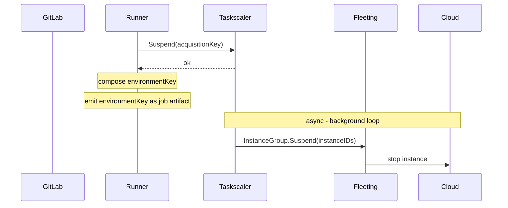
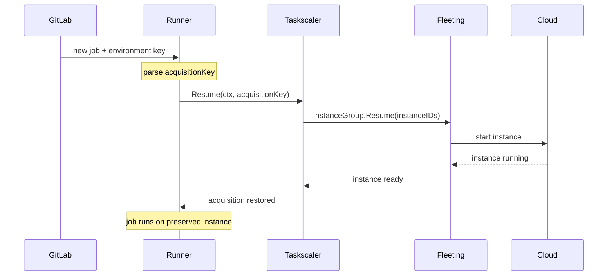
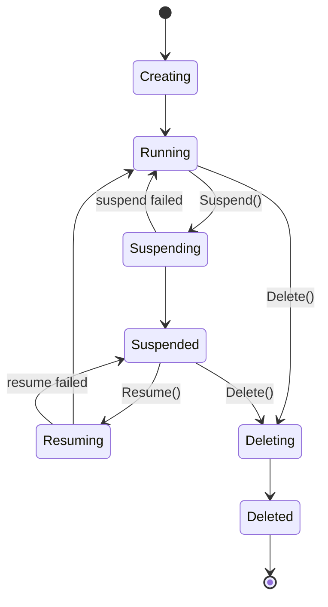

このドキュメントでは、Fleeting/Taskscaler スタックを介して管理されるクラウド VM 上で実行される、**Instance と Docker Autoscaler エグゼキューター**のサスペンド/再開の実装について説明します。サスペンドとは、クラウドプロバイダー API を介して VM を停止することです。ディスクはインスタンス自身のストレージに保持されます。再開とは、インスタンスの電源を再び入れることです。

共通設計（環境キーのフォーマット、セキュリティモデル、未解決の問題）については、[メインのブループリント](_index.md)を参照してください。Kubernetes エグゼキューターの実装については、[kubernetes.md](kubernetes.md)を参照してください。

## アーキテクチャ

サスペンド/再開は、ボトムアップで伝播するオプトイン機能です。クラウドプラグインがその機能でサポートを宣言し、Fleeting がそれを Taskscaler に公開し、Taskscaler が同じ情報を Runner に公開します。このチェーンのいずれかのレイヤーがサスペンドをサポートしていない状態でジョブがサスペンドを要求すると、Runner はジョブを失敗させます。

### サスペンドフロー



### 再開フロー



## アーキテクチャ設計記録（ADR）

### ADR1：遅延インスタンスサスペンド

取得をサスペンド済みとしてマークする処理は、即座に行われます。基盤となるインスタンスの停止は、そのインスタンス上のすべての取得がサスペンドまたは解放されるまで延期されます。1 つのインスタンスが複数のジョブを同時に処理することはよくあります。1 つの取得をサスペンドしても、他の取得に影響を与えてはなりません。

### ADR2：クラウドのサスペンド中は取得をブロック

インスタンスに対するクラウドのサスペンド操作が進行中の場合、新しい取得は、そのインスタンスに割り当ててからサスペンドをキャンセルするのではなく、そのインスタンスを完全にスキップします。これにより、新しいジョブと進行中のクラウド停止が競合するときに必要となる、キャンセルの追跡や補償的な再開操作を避けられます。代償として、クラウドの停止が完了するまでインスタンスの空きスロットは一時的に利用できません。ただし、クラウドの停止は、インスタンス上のすべての取得がサスペンドまたは解放された場合にのみ開始するため、これらのスロットはすでにアイドル状態です。この時間帯に需要が発生した場合、スケーラーは新しいインスタンスをプロビジョニングします。

## コンポーネント

### Fleeting

`StateSuspended` は長期間維持される安定状態です。インスタンスは、数時間または数日間サスペンド状態のままになることがあります。ポーリングは `StateRunning` と同じ設定可能な低頻度で行われます。積極的なポーリングをトリガーするのは、遷移状態（`StateSuspending`、`StateResuming`）だけです。サスペンドされたインスタンスは、先に再開しなくても直接削除できます。



機能は、既存の `Init()` 呼び出しから返される `ProviderInfo` の一部としてプラグインが宣言するため、個別の RPC は必要ありません。

```go
type ProviderInfo struct {
    // existing fields unchanged...
    Capabilities []Capability
}

type Capability string

const (
    CapabilitySuspendResume Capability = "suspend_resume"
    // future capabilities added here
)
```

プロビジョナーは初期化時に `ProviderInfo.Capabilities` を 1 回読み取り、呼び出し元が抽象化を越えてアクセスしないように `HasCapability(cap)` を公開します。`HasCapability(CapabilitySuspendResume)` が true の場合にのみ、プラグインの `Suspend`/`Resume` を呼び出します。`HasCapability` は、`suspend_resume` と将来追加されるすべての機能に対応する汎用的な機能チェックです。

`Suspend` と `Resume` は、コアの `InstanceGroup` インターフェースに追加されます。プロビジョナーがこれらを呼び出すのは、プラグインが `suspend_resume` 機能を宣言した場合だけです。この機能を宣言しないプラグインではこれらのメソッドが呼び出されないため、実装をスタブのままにできます。

```go
type InstanceGroup interface {
    // existing methods unchanged...
    Suspend(ctx context.Context, instances []string) (succeeded []string, err error)
    Resume(ctx context.Context, instances []string) (succeeded []string, err error)
}
```

サスペンドされたインスタンスはプールの一部として残ります。停止中もクラウドリソースを保持し、プロビジョナーはその代替インスタンスを起動しません。

インスタンスの準備完了シグナルは、`StateSuspended` に到達したときだけでなく、`StateRunning` から離れるたびにリセットされます。これにより、`StateSuspended` に到達しない `Running -> Suspending -> Running`（サスペンド失敗からの復帰）を含む、すべての遷移パスで正しい動作が保証されます。再開されたインスタンスを待つ呼び出し元は、新しくプロビジョニングされたインスタンスと同じ待機メカニズムを使用します。

Fleeting のステートマシンには `Suspending -> Resuming` 遷移がないため、再開するには、進行中のサスペンドが先に `StateSuspended` に到達するまで待つ必要があります。Fleeting はこれを内部で処理します。設定されたタイムアウトの範囲内で、サスペンド状態になるまで待ってからクラウドの再開を実行し、続いてインスタンスが `StateRunning` に到達するまで待ってから戻ります。

### Fleeting プラグイン

プラグインは、`Init()` 内で `ProviderInfo.Capabilities` に値を設定し、`Suspend`/`Resume` を実装することでオプトインします。

```go
func (g *InstanceGroup) Init(ctx context.Context, log hclog.Logger, settings provider.Settings) (provider.ProviderInfo, error) {
    // existing init logic...
    return provider.ProviderInfo{
        // existing fields...
        Capabilities: []provider.Capability{provider.CapabilitySuspendResume},
    }, nil
}

func (g *InstanceGroup) Suspend(ctx context.Context, instances []string) ([]string, error) {
    // 1. Move instances out of auto-scaling management
    // 2. Stop instances
    // 3. Return IDs of successfully suspended instances
    return succeeded, nil
}

func (g *InstanceGroup) Resume(ctx context.Context, instances []string) ([]string, error) {
    // 1. Start instances
    // 2. Re-add instances to auto-scaling management
    // 3. Return IDs of successfully resumed instances
    return succeeded, nil
}
```

オプトインしないプラグインでは、`Capabilities` を空のままにします。プロビジョナーがそのプラグインの `Suspend`/`Resume` を呼び出すことはありません。既存のコンパイル済みプラグインは、変更を加えなくてもそのまま動作します。

### クラウドプロバイダープラグイン

どのクラウドプロバイダーにも同じ課題があります。管理対象のオートスケーリンググループに属するインスタンスを停止すると、グループのヘルスチェックによって異常とマークされ、置き換えられます。各プロバイダーでは、停止前にインスタンスをアクティブな管理から外し、再開時に元に戻すことで解決します。停止ステップが部分的に失敗した場合、影響を受けたインスタンスに対して、その前のステップをロールバックします。

| クラウド | サスペンド | 再開 | 備考 |
|---|---|---|---|
| AWS | `EnterStandby` (ASG) -> `StopInstances` (EC2) | `StartInstances` (EC2) -> `ExitStandby` (ASG) | |
| GCP | `abandonInstances` (MIG) -> `instances.stop` (CE) | `instances.start` (CE) -> `addInstances` (MIG) | |
| Azure | インスタンス保護を有効化（VMSS） -> `deallocate` (VMSS) | `start` (VMSS) -> インスタンス保護を解除（VMSS） | サスペンド時にインスタンスをスケーリンググループから外し、再開時に再追加する AWS や GCP とは異なり、Azure はサスペンド/再開サイクル全体を通じてインスタンスを VMSS 内に保持します。インスタンス保護により VMSS がインスタンスを終了することを防ぎますが、インスタンスは VMSS のオートスケーリングルールに引き続き表示され、サスペンド時と再開時の両方でスケールセットのキャパシティにカウントされます。Azure プラグインは、必要なキャパシティと実際のキャパシティを調整する際に、この点を考慮する必要があります。 |

すべてのクラウドで、インスタンスを停止すると一時的なパブリック IP が解放されます。再開時には、新しいパブリック IP が割り当てられます。VPC/VNET 内のプライベート IP は、すべてのクラウドで停止/開始サイクルを通じて変わりません。

Runner はインスタンスに接続する前に必ず接続情報を再取得するため、再開後は常に現在の IP を使用します。プラグインは、停止/開始サイクルをまたいでアドレスをキャッシュしてはなりません。

### Taskscaler

既存の `Taskscaler` インターフェースに、3 つのメソッドが追加されます。

```go
type Taskscaler interface {
    // existing methods unchanged...
    // HasCapability returns true if the underlying fleeting provisioner supports the given capability.
    HasCapability(cap provider.Capability) bool
    // Suspend marks an acquisition as suspended and cancels its context with ErrAcquisitionSuspended.
    // Fails fast if the provisioner does not support suspend/resume.
    // The acquisition is preserved - not removed - for Resume.
    // The actual instance stop is deferred until the last non-suspended acquisition on the instance is
    // suspended or released, so suspending one job never disrupts other jobs on the same instance.
    Suspend(key string) error
    // Resume restores the acquisition by resuming the underlying instance via
    // fleeting and waiting for it to become ready. State inspection (running,
    // suspending, suspended) is handled by the fleeting provisioner internally.
    // If the context is cancelled, the acquisition stays suspended so the caller can retry.
    Resume(ctx context.Context, key string) (Acquisition, error)
}
```

サスペンドされたスロットの割り当てはディスクに永続化されます。再起動時に、Taskscaler は保存済みの状態からサスペンドされた取得を再構築し、再プロビジョニングは行いません。正常なシャットダウン中、Runner は通常、終了前にすべてのアクティブな取得が完了するまで待機します（ドレイン）。サスペンドされた取得は実行中ではないため、このドレインのカウントから除外され、Runner はそれらを待機しません。同様に、サスペンドされたインスタンスはティアダウン時にスキップされるため、解放されず、Runner の再起動をまたいで維持されます。

サスペンドされたスロットは、新しいプロビジョニングを妨げないようにスケーリング計算から除外されます。サスペンドされたインスタンスはアクティブなキャパシティとしてカウントされないため、そのサスペンドされたスロットによって「利用不可」のカウントを増やしてもなりません。増やすと、スケーラーの需要ガードが、需要がアクティブなインスタンスで提供可能な量を超えていると誤って判断し、スケールアップを拒否します。また、サスペンドされたスロットはアイドルキャパシティからも除外されるため、スケーラーがそれらを利用可能と見なすことはありません。サスペンドされたスロットがあるインスタンスでも新しい取得は許可されます。取得ループはサスペンドされたスロットのインデックスをスキップし、新しいジョブを利用可能なスロットに配置します。クラウドのサスペンドが進行中のインスタンスは、取得ループによって完全にスキップされます（ADR2 を参照）。

サスペンドされたインスタンスは、Runner に設定されたキャパシティ（例：`MaxInstances`）にカウントする必要があります。停止した VM もスロットを保持します。スケーラーがプロビジョニング可能なインスタンス数を評価する際にサスペンドされたインスタンスを無視すると、無制限のサスペンドによって設定済みのキャパシティ上限が枯渇し、新しいインスタンスを作成できなくなる可能性があります。

## GitLab Runner

GitLab Runner の新しい変更はすべて、フィーチャーフラグ `FF_SUSPENDABLE_ENVIRONMENTS` の背後に配置されます。

### エグゼキューターのサスペンド/再開インターフェース

エグゼキューター固有のサスペンド/再開の動作は、1 つのインターフェースと 1 つの具象構造体を介してプロバイダーから分離されます。

```go
// SuspendableExecutor is implemented by executors that can preserve a job's
// workload state across job boundaries.
type SuspendableExecutor interface {
    // Suspend persists the workload state and returns the fields needed to
    // restore it. These fields are carried in the EnvironmentKey to a future
    // resuming job.
    Suspend(ctx context.Context) (url.Values, error)
    // Resume rebuilds the workload state from the fields produced by a prior
    // Suspend call.
    Resume(ctx context.Context, fields url.Values) error
}

// EnvironmentKey identifies a suspended environment. The runner produces it
// when suspending a job and parses it when a follow-up job resumes. The
// runner-id and system-id route the resume back to the same runner instance
// that issued the suspension; the fields carry executor-specific state.
//
// Format: <runner-id>/<url-encoded-system-id>/<url-encoded-fields>
type EnvironmentKey struct {
    RunnerID int64
    SystemID string
    Fields   url.Values
}
```

プロバイダーはエグゼキューターに依存しません。サスペンドトリガーに基づいてサスペンドするか*どうか*を決定しますが、*どのように*行うかは `SuspendableExecutor` を介してエグゼキューターに委ねます。プロバイダーは自身のルーティングフィールド（例：`acquisition-key`）を同じ `url.Values` に混在させ、結果として得られる `EnvironmentKey` を発行します。再開時に、プロバイダーはワイヤーフォーマット文字列を解析して `EnvironmentKey` に戻し、プロバイダー自身が所有するフィールドを抽出して、残りのフィールドをエグゼキューターの `Resume` に渡します。

このインターフェースは、サスペンド/再開フレームワークを変更せずに、他のプロバイダー（例：Kubernetes）へ拡張できるように設計されています。

### ジョブ完了時のサスペンド

**Instance エグゼキューター**（ネストなし。ネストについては[スコープ外](_index.md#out-of-scope)を参照）：

1. 何もしません（インスタンス自体が環境であり、ワークロードレベルの準備は不要です）。
2. プロバイダーが `scaler.Suspend(acquisitionKey)` を呼び出します。スロットは保持され、プールには戻されません。
3. プロバイダーが、Runner ID、system ID、取得キーを含む環境キーを構成します。
4. Runner が、環境キーをジョブアーティファクトとして発行します。

**Docker Autoscaler**：

1. エグゼキューターが Docker API を介して、ビルドコンテナ、ヘルパーコンテナ、およびすべてのサービスコンテナを同時に停止します（コンテナは停止されますが、削除されません）。
2. エグゼキューターが、保持されたすべてのコンテナ ID を環境キーのフィールドとして返します。`build-container-id`、`helper-id`、`service-ids`（カンマ区切り）です。
3. プロバイダーが `scaler.Suspend(acquisitionKey)` を呼び出します。スロットは保持され、プールには戻されません。
4. プロバイダーが、Runner ID、system ID、取得キー、コンテナ ID を含む環境キーを構成します。
5. Runner が、環境キーをジョブアーティファクトとして発行します。

### ジョブディスパッチ時の再開

**Instance エグゼキューター**：

1. Runner が、環境キーから取得キーを解析します。
2. Runner が `scaler.Resume(acquisitionKey)` を呼び出します。この呼び出しは、インスタンスが実行中になり準備が整うまでブロックします。
3. エグゼキューターレベルでは何もしません。インスタンスはそのまま使用できる状態です。

**Docker Autoscaler**：

1. Runner が、環境キーから取得キーとコンテナ ID を解析します。
2. Runner が `scaler.Resume(acquisitionKey)` を呼び出します。この呼び出しは、インスタンスが実行中になり準備が整うまでブロックします。
3. エグゼキューターが ID によってビルドコンテナを検査し、その検査レスポンスからネットワークとボリュームの状態を導き出します。
4. エグゼキューターが各サービスコンテナを ID によって再起動し、正常な状態になるまで待機します。
5. エグゼキューターがビルドコンテナとヘルパーコンテナのキャッシュに値を設定し、後続のコマンドが保持されたコンテナ上で実行されるようにします。
6. 保持されたリソースが 1 つでも欠けている場合、再開はエラーで失敗します。

### 環境キーのフィールド

| プロバイダー / エグゼキューター | キーのフォーマット |
|---|---|
| Autoscaler / Instance | `<runner-id>/<system-id>/acquisition-key=<uuid>` |
| Autoscaler / Docker | `<runner-id>/<system-id>/acquisition-key=<uuid>&build-container-id=<id>&helper-id=<id>&service-ids=<id1>,<id2>` |

### 環境の永続化

**Instance エグゼキューター**：サスペンドでは、環境を破棄せずにインスタンスを停止します。接続されたディスク上のファイルシステム、インストール済みの依存関係、ビルドアーティファクトはすべて完全に保持されます。再開時に、インスタンスはすべてをそのまま保持した状態で起動します。これには永続的な（一時的ではない）ストレージが必要です。一時ボリュームを使用するインスタンスは停止/開始時にディスク状態を失うため、サスペンド/再開とは互換性がありません。

**Docker Autoscaler**：ビルドコンテナ、ヘルパーコンテナ、サービスコンテナは、サスペンド時に停止され（削除はされません）、再開時に再起動されます。名前付きボリュームとビルドネットワークは VM 上に保持されます。インスタンスディスク上にあるコンテナの書き込み可能レイヤーは、サイクル全体を通じてそのまま維持されます。Docker エグゼキューターは、すべての操作に Docker クライアント接続を使用します。コネクターを介してシェルコマンドが実行されることはありません。

## 失敗モード

| 失敗 | 動作 |
|---|---|
| エグゼキューターがサスペンドをサポートしていない | `FF_SUSPENDABLE_ENVIRONMENTS` が有効な場合、Runner はジョブを失敗させます。それ以外の場合、オプションは通知なく無視されます。 |
| クラウドプラグインがサスペンドをサポートしていない | `FF_SUSPENDABLE_ENVIRONMENTS` が有効な場合、Runner はジョブを失敗させます。それ以外の場合、オプションは通知なく無視されます。 |
| 取得キーが見つからない（正常な再起動） | Runner が再起動し、ディスクに永続化された状態からサスペンドされた取得を再構築します。正常な動作であり、データ損失はありません。 |
| 取得キーが見つからない（状態の破損） | Runner の永続化された状態が破損または失われています（ディスク障害、手動削除）。基盤となるインスタンスはクラウドでサスペンドされたままですが、管理するものがいないため、手動でのクリーンアップまたは保持ポリシーが必要です。 |
| インスタンスが外部から終了された | 再開が失敗し、Runner はジョブを失敗させます。参照先を失った取得をクリーンアップする必要があります。 |
| Docker コンテナが見つからない | Runner は再開を試みる前にジョブを失敗させます。サスペンドされたインスタンスと取得はそのまま維持されます。 |
| 再開のタイムアウト | 取得はサスペンドされたままになります。呼び出し元は、同じ環境キーを指定して再送信することで再試行できます。 |
| 再開時にファイルシステムの状態が失われた | インスタンスの電源は正常に入りますが、ディスクの状態が失われています（例：停止/開始時に一時ストレージが消去された、またはディスクが手動で交換された）。Runner はディスクの完全性を確認できません。ジョブは壊れた環境で再開され、動作は未定義です。 |

## 検討した代替案

### 長時間稼働インスタンス

ジョブ間でインスタンスを解放せず、実行状態を維持します。サスペンド/再開の仕組みは不要で、環境を常に利用できます。

アイドル状態のインスタンスにも完全なコンピューティング料金が発生するため、却下しました。規模を問わず、ジョブ間でインスタンスをウォーム状態に保つコストは法外です。

### ディスクスナップショット

ジョブ完了時にインスタンスのディスク（AWS の EBS、GCP の Persistent Disk、Azure の Managed Disk）のスナップショットを作成し、スナップショット ID を環境キーに保存します。インスタンスは即座に解放されます。再開時には、スナップショットをボリュームとして復元した新しいインスタンスをプロビジョニングします。

これによりインスタンスの固定が不要になり、再開されたジョブはプール内の任意のインスタンスで実行でき、ASG Standby や MIG abandon も不要になります。スナップショットのストレージコストは、実行中のインスタンスよりはるかに少なく、特別な処理をしなくてもスポットインスタンスの終了に対応できます。

ただし、この方法が適切に機能するのは、インスタンスごとに 1 ジョブのモデルだけです。複数の取得が 1 つのインスタンスを共有している場合、スナップショットを作成して解放する前に他のすべてのジョブが完了するまで待つ必要があります。これは遅延インスタンスサスペンドと同じ待機ですが、再開に時間がかかります（スナップショットの復元、新しいインスタンスの起動、遅延ボリュームハイドレーションによって数分余計にかかる場合があります）。他のジョブがディスクへ書き込んでいる間にライブスナップショットを作成すると、状態に不整合が生じるリスクもあります。Taskscaler が前提とするインスタンスごとに複数ジョブのケースでは、スナップショットはインスタンスのサスペンドより有意な利点がなく、再開に大幅に時間がかかります。

継続的なインスタンス課金を許容できない非常に長期間のサスペンドでは、ディスクスナップショットが依然として実用的な補完手段となります。

### 永続的な共有ストレージ

ネットワーク接続型ファイルシステム（AWS EFS、GCP Filestore、Azure Files）を、クローンしたリポジトリやジョブ中に書き込まれたすべてのファイルを格納するジョブの作業ディレクトリとしてマウントします。「サスペンド」時にはジョブが完了してインスタンスが解放されます。「再開」時には、任意のインスタンスが同じボリュームをマウントします。

この方法には、クラウド固有のサスペンドロジックもインスタンスの固定も必要ありません。ただし、保持されるのはマウントされたディレクトリだけです。インストール済みのパッケージ、システムライブラリ、Docker レイヤー、マウントポイント外にあるものは、再開時にすべて失われます。ジョブは新しいインスタンスに到着し、ツールチェーン全体を再インストールする必要があるため、主な利点が失われます。また、ネットワークストレージはローカル SSD よりも大幅に遅いため、ビルド負荷の高いワークロードの性能が低下します。

この方法はアーティファクトの永続化には適していますが、環境全体の保持には適していません。

### プロセスレベルのチェックポイント（CRIU）

Checkpoint/Restore In Userspace（CRIU）は、メモリを含むプロセスツリー全体の状態をディスクに保存し、任意のホスト上で復元します。インスタンスのサスペンドとは異なり、メモリ内の状態を保持し、特定のインスタンスに紐付きません。

ユーザー空間で実行されるにもかかわらず（この名称は、権限レベルではなくチェックポイントロジックの実行場所を指します）、CRIU には昇格されたカーネル機能（`CAP_SYS_PTRACE`、`CAP_SYS_ADMIN`）が必要です。また、GPU ワークロード、特定のカーネル機能、マルチスレッドプログラムとの互換性が限定的で、主要なクラウドプロバイダーではネイティブにサポートされていません。運用上の複雑さとワークロードの制約により、CI 環境向けの汎用ソリューションには適していません。
