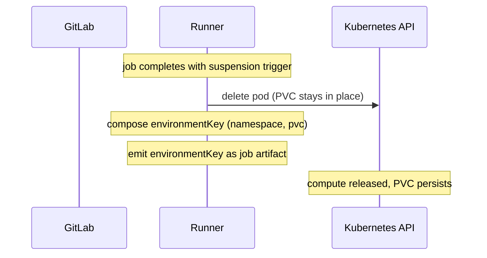
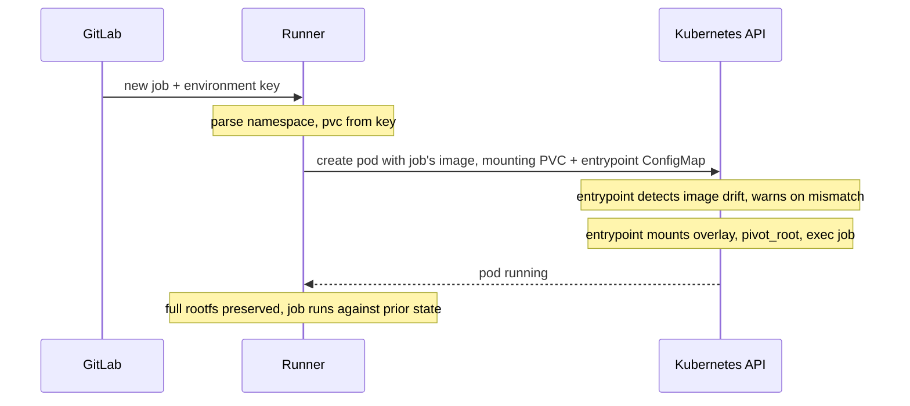

このドキュメントでは、**Kubernetes エグゼキューター**のサスペンド/再開の実装について説明します。サスペンドが VM の停止を意味する Fleeting ベースのエグゼキューターとは異なり、Kubernetes には同等のプリミティブがありません。Pod を削除すると、その書き込み可能レイヤーと emptyDir ボリュームは破棄されます。ここでのアプローチでは、上位ディレクトリと作業ディレクトリを PersistentVolumeClaim で永続化した overlayfs をコンテナ内にマウントし、その overlay に `pivot_root` します。これにより、すべてのファイルシステム変更（システムパッケージ、グローバルインストール、`/tmp`、`/home`、作業ディレクトリ）が PVC に保存され、Pod を削除しても保持されます。

共有設計（環境キーの形式、セキュリティモデル、未解決の質問）については、[メインのブループリント](_index.md)を参照してください。Fleeting ベースの実装（Instance と Docker Autoscaler）については、[fleeting.md](fleeting.md)を参照してください。

## アーキテクチャ

エントリーポイントスクリプトは、下位レイヤーにコンテナのベースイメージ（読み取り専用）を使用し、上位ディレクトリと作業ディレクトリを `/persist` にマウントされた PVC 上に配置した overlayfs をマウントします。overlay のマウント後、スクリプトは `/proc`、`/sys`、`/dev`、`/persist`、および kubelet が注入する `/etc/resolv.conf`、`/etc/hosts`、`/etc/hostname` をマージ済みツリーにバインドマウントし、`pivot_root` でマージ済みツリーをマウント名前空間の新しいルートにして、古いルートをアンマウントします。スクリプト自体は Kubernetes ConfigMap に格納されます。Runner は環境ごとに PVC とともに ConfigMap を作成し、両者は同じライフサイクルを共有します。その環境のすべての Pod（初回実行、サスペンド、再開）は ConfigMap を `/scripts` にマウントし、そのスクリプトをコマンドとして実行します。`/persist` と `/scripts` はどちらも Pod の起動時に kubelet によってマウントされるため、overlay のセットアップを実行する前からエントリーポイントで利用できます。

バインドマウントは、overlay だけではカバーできないパスを処理します。これには、イメージではなくカーネルによって設定されるカーネル疑似ファイルシステム（`/proc`、`/sys`）、ランタイムが提供するデバイスノード（`/dev`）、PVC 自体（pivot 後も `/persist` にアクセスできるようにするため）、および kubelet がコンテナの起動時に書き込むホスト注入型の Pod ネットワークファイル（`/etc/resolv.conf`、`/etc/hosts`、`/etc/hostname`）が含まれます。ファイルシステム内のその他すべて（`/etc`、`/usr`、`/var`、`/home`、`/tmp`、`/root` など）は overlay を経由します。

`pivot_root`（`chroot` ではなく）が不可欠です。Kubernetes エグゼキューターは、Kubernetes exec API（`kubectl exec` が使用するものと同じ API）を通じて、実行中のコンテナに各ジョブコマンドをストリーミングします。ジョブの実際の処理は、コンテナのエントリーポイントではなく、exec で起動されたプロセスを通じて行われます。

`chroot` はプロセス単位です。呼び出し元プロセスのルート表示だけを変更します。exec で起動されたジョブコマンドは元のコンテナルートで開始され、overlay を暗黙に迂回します。その書き込みは Pod の一時的な書き込み可能レイヤーに保存され、Pod を削除すると失われます。

`pivot_root` はマウント名前空間レベルで動作します。名前空間に入るすべてのプロセス（PID 1、exec で起動されたコマンド、デバッグシェル）は overlay を `/` として認識し、すべての書き込みが PVC 上の上位ディレクトリに保存されます。

サスペンド時には Pod が削除されますが、overlay の状態を保持する PVC は残ります。再開時には、同じ PVC をマウントする新しい Pod が作成されます。エントリーポイントは overlay の作業ディレクトリを消去し（管理情報はマウントごとに固有です）、同じ上位ディレクトリ上に overlay を再マウントして pivot します。以前のファイルシステム変更（クローンしたリポジトリ、ビルドアーティファクト、依存関係、システムパッケージ、グローバルな pip/gem/npm インストール、`/tmp`、`/home`、エージェントのチェックポイント）はすべて表示されます。

新しい環境の初回実行時には、Runner が PVC と ConfigMap をプロビジョニングし、エントリーポイントが空の上位ディレクトリ上に overlay をマウントして、ジョブが新しいベースイメージに対して実行されます。以降のサスペンドと再開では、上記のサイクルに従います。

このアプローチには、次の特徴があります。

- **ランタイムに依存しない** - containerd、CRI-O、runc、crun で動作します。ランタイム固有のツールは不要です。
- **ホストレベルの変更が不要** - DaemonSet、特権ヘルパー Pod、ノードレベルの設定変更は不要です。メカニズム全体がワークロード Pod 内に存在します。
- **明示的なスナップショット手順が不要** - 変更は発生時に永続化されます。作業が失われる可能性のあるチェックポイント期間はありません。
- すべてのクラスタ管理者が理解している**標準の Kubernetes プリミティブ**（Pod、PVC、ConfigMap）を使用します。

トレードオフは次のとおりです。

- overlay のマウントと `pivot_root` の実行には **`CAP_SYS_ADMIN` が必要**です。ユーザー名前空間（`hostUsers: false`、Kubernetes 1.36 で GA）を使用する場合、このケイパビリティは名前空間内に限定され、ホスト権限を付与しません。サンドボックス化されたランタイム（gVisor、Kata Containers）も同様に、システムコールがホストカーネルに直接到達しないため、サンドボックス境界内に制限します。これらをいずれも使用しない場合、これは実際のホストケイパビリティであり、信頼できる環境でのみ許容されます。
- **PVC のノードとゾーンのアフィニティ** - ゾーン単位のブロックストレージを使用する `ReadWriteOnce` PVC は、再開後の Pod を同じゾーンに固定し、一部のストレージドライバーでは同じノードにも固定します。再開時にノードをまたいだスケジューリングが必要な運用者は、`ReadWriteMany` ストレージ（NFS、CephFS）またはサスペンド/再開時のオブジェクトストレージ同期を使用する必要があります。
- **プロセス状態は保持されない** - ライブプロセス、メモリ、開いているファイルディスクリプタではなく、rootfs を保持します。再開時にはジョブスクリプトが最初から再実行されます。実行中の作業をチェックポイントすること（エージェントの状態ファイル、ビルドキャッシュなど）はユーザーの責任です。
- **イメージの一貫性はユーザーとの契約であり、Runner による強制ではない** - overlay の上位ディレクトリは、再開するジョブが指定したベースイメージ上に重ねられます。そのため、イメージドリフト（タグの変更、または同じタグをレジストリで再ビルドしたことにより、再開時のイメージがサスペンド時に使用したイメージと異なること）があると、わかりにくいランタイム障害が発生する可能性があります。エントリーポイントは再開時にドリフトを検出してジョブログに警告を出しますが、再開を拒否しません。運用経験に基づいて、より強力な緩和策（ダイジェストの自動解決、不一致時の再開の強制失敗）を将来の機能強化として検討する可能性があります。

## サスペンド/再開フロー

### サスペンド



### 再開



## GitLab Runner

GitLab Runner のすべての新しい変更は、フィーチャーフラグ `FF_SUSPENDABLE_ENVIRONMENTS` の背後に置かれます。

### エグゼキューターのサスペンド/再開インターフェース

Kubernetes エグゼキューターは、Fleeting ベースのエグゼキューターが使用するものと同じ `SuspendableExecutor` インターフェースを実装します。

```go
// SuspendableExecutor is implemented by executors that can preserve a job's
// workload state across job boundaries.
type SuspendableExecutor interface {
    // Suspend persists the workload state and returns the fields needed to
    // restore it. These fields are carried in the EnvironmentKey to a future
    // resuming job.
    Suspend(ctx context.Context) (url.Values, error)
    // Resume rebuilds the workload state from the fields produced by a prior
    // Suspend call.
    Resume(ctx context.Context, fields url.Values) error
}

// EnvironmentKey identifies a suspended environment. The runner produces it
// when suspending a job and parses it when a follow-up job resumes. The
// runner-id and system-id route the resume back to the same runner instance
// that issued the suspension; the fields carry executor-specific state.
//
// Format: <runner-id>/<url-encoded-system-id>/<url-encoded-fields>
type EnvironmentKey struct {
    RunnerID int64
    SystemID string
    Fields   url.Values
}
```

Kubernetes の場合、`Suspend` は `url.Values{"namespace": []string{ns}, "pvc": []string{pvcName}}` を返し、Runner はそれらを出力する `EnvironmentKey.Fields` に配置します。

### ジョブ完了時のサスペンド

サスペンド時、エグゼキューターは次の処理を行います。

1. Pod を削除してコンピュートリソースを解放します。overlay の状態を再開後の Pod に引き継ぐため、PVC はそのまま残します。`NamespacePerJob` が有効な場合、再開後の Pod を同じ名前空間に作成できるように、名前空間も保持します。
1. Runner ID、system ID、名前空間、PVC 名を使用して環境キーを構成します。
1. 環境キーをジョブアーティファクトとして出力します。

### ジョブディスパッチ時の再開

再開時、エグゼキューターは次の処理を行います。

1. キーから名前空間と PVC 名を解析します。
1. 再開するジョブに設定されたイメージを使用して新しい Pod を作成し、既存の PVC を `/persist` に、エントリーポイント ConfigMap を `/scripts` にマウントします。Pod のコマンドはエントリーポイントを指し、Runner は再開するイメージの参照をエントリーポイントに渡して、前回の実行からのドリフトを検出できるようにします。
1. その後、Pod 内の処理はエントリーポイントが引き継ぎます。再開するイメージが前回の実行で使用したものと異なるかどうかを検出し、異なる場合は stdout に警告を出力します（以前の参照が存在しない初回実行時はスキップします）。続いて、PVC 上の上位ディレクトリに overlay をマウントし、マージ済みツリーに `pivot_root` して、ジョブコマンドを exec します。
1. Pod が実行中かつ準備完了になるまで待機します。

### 環境キーのフィールド

| エグゼキューター | キー形式 |
|---|---|
| Kubernetes | `<runner-id>/<system-id>/namespace=<ns>&pvc=<pvc-name>` |

### PVC のライフサイクル

- **作成**: 最初のジョブが開始され、既存の環境が参照されていない場合、Runner はサスペンド可能な環境ごとに PVC と付随するエントリーポイント ConfigMap（overlay セットアップスクリプトを含む）を動的に作成します。PVC はクラスタのデフォルトの StorageClass または設定された StorageClass を使用します。2 つのリソースはライフサイクルを共有します。初回実行時に一緒に作成され、サスペンドと再開をまたいで一緒に保持され、環境の破棄時に一緒に削除されます。
- **PVC 上のレイアウト**: PVC は `/persist` にマウントされ、次の内容を含みます。
  - `upper/` - この環境の初回実行以降のすべてのファイルシステム変更。
  - `work/` - overlayfs の管理情報。マウントのたびに再作成されます。
  - `merged/` - pivot 中に使用される overlay のマウントポイント。
  - `.image-tag` - 上位ディレクトリの作成元となったイメージ参照（タグとダイジェスト）を記録します。
- **保持**: PVC と付随する ConfigMap は、Pod を削除しても保持されます。明示的に環境を終了した場合（TTL の期限切れまたは明示的な解放）にのみ削除されます。
- **StorageClass の要件**: StorageClass は `ReadWriteOnce` アクセスモードと動的プロビジョニングをサポートする必要があります。これは事実上すべての Kubernetes クラスタ（GKE Persistent Disk、EKS EBS、AKS Managed Disk、local-path-provisioner など）で利用できます。ノードをまたいで再開するには、`ReadWriteMany` StorageClass（NFS、CephFS）が必要です。

## 障害モード

| 障害 | 挙動 |
|---|---|
| 再開時に PVC が見つからない | 再開時、Runner はジョブを失敗させます。 |
| StorageClass が動的プロビジョニングをサポートしていない | ジョブ開始時、PVC の作成に失敗すると Runner はジョブを失敗させます。 |
| PVC が誤った可用性ゾーンまたはノードにある | 再開時のスケジューリングで、PVC のアフィニティを満たす適格なノードがないため、Runner はジョブを失敗させます。ゾーンストレージを使用する `ReadWriteOnce` PVC は 1 つのゾーンにバインドされ、一部のブロックストレージドライバーではさらに 1 つのノードに固定されます。ノードをまたいだ再開が必要な場合、運用者はリージョナルストレージクラスまたは `ReadWriteMany` ストレージクラスを使用する必要があります。 |
| 名前空間が削除された（`NamespacePerJob`） | 再開時、Runner はジョブを失敗させます。 |
| Runner が再起動してメモリ内の状態を失った | 影響はありません。環境キーには PVC 名と名前空間が含まれており、再接続にはそれで十分です。再開に Runner ローカルの状態は不要です。 |
| 再開するイメージがサスペンド時に使用したイメージと異なる | 再開時、エントリーポイントはジョブの stdout に警告を出力して続行します。Runner はイメージの一貫性を強制しません。ファイルシステムの状態がパッケージマネージャーの状態と微妙な形で同期しなくなる可能性があります（ABI ドリフト、古いパッケージ DB、隠れた drop-in 設定）。 |
| 正常でない Pod 終了後に overlayfs の作業ディレクトリが残っている | 再開時、エントリーポイントはマウント時に作業ディレクトリを再作成します。上位ディレクトリは保持されます。 |

## 評価した代替案

PVC で永続化した overlayfs と `pivot_root` を採用するまでに、Kubernetes のサスペンド/再開について複数のアプローチを評価しました。採用しなかった代替案を以下にまとめます。調査の全文については、[Kubernetes 上のサスペンド可能な環境](https://gitlab.com/-/snippets/5973444)および [`duo` タグ向けに最新エグゼキューターを使用した Runner フリートをプロビジョニング](https://gitlab.com/gitlab-org/gitlab/-/work_items/597038)を参照してください。

### Pod を稼働させ続ける

サスペンド中も Pod をアイドル状態（`sleep infinity`）で実行し続けます。すべてを保持できますが、コンピュートリソースは解放されません。これは使用分だけ支払うという目標に真っ向から反します。スポット環境にも対応できません。

### Docker commit でレジストリへ保存

`docker commit` を使用してコンテナの書き込み可能レイヤーを新しいイメージとして取得し、レジストリにプッシュします。コンテナランタイムへのアクセス（Docker ソケットまたは containerd ソケット）が必要ですが、標準の Kubernetes エグゼキューター Pod では利用できません。gVisor やその他のサンドボックス化されたランタイムとは互換性がありません。イメージの push/pull によって大きな遅延が加わります。

### Kubelet チェックポイント API（CRIU）

Kubelet チェックポイント API を使用して CRIU ベースのチェックポイントを作成します。`ContainerCheckpoint` フィーチャーゲートは alpha（Kubernetes 1.25 以降）であり、どのマネージド Kubernetes サービスでもデフォルトでは有効になっていません。Kubelet への直接の HTTPS アクセスが必要ですが、Runner Pod にはそのアクセス権がありません。

### gVisor rootfs tar スナップショット

gVisor の `runsc tar rootfs-upper` は overlay の上位レイヤー（すべてのファイルシステム変更）を取得し、対応するアノテーション（`dev.gvisor.tar.rootfs.upper.*`）が新しいサンドボックスに復元します。当初の障害は、GitLab.com の本番 gVisor 環境が **GKE Sandbox**（完全マネージド）を使用しているため、`runsc` の設定にアクセスできず、`--allow-rootfs-tar-annotation` フラグをすぐには有効にできないことでした。

[追加調査](https://gitlab.com/gitlab-org/gitlab/-/work_items/597038#note_3269895130)により、特権 `DaemonSet` でノードレベルの `runsc` 設定を変更してフラグを有効にすればこの問題を回避でき、GKE Sandbox でもこのアプローチを実行可能にできることが実証されました。概念実証はエンドツーエンドで動作しました。これは、検討した中で最も有力な gVisor ネイティブの代替案でした。

採用しなかった理由は次のとおりです。

- **gVisor 固有です。** gVisor を使用しない自己管理型 Kubernetes デプロイメントには、依然として別のソリューションが必要です。
- **ホストレベルの変更が必要です。** ノードレベルの `runsc` 設定を変更する特権 `DaemonSet` は、Runner のデプロイメントを運用者が管理するホスト変更に結び付けます。これはまさに、選択したアプローチが回避する特性です。
- **ノード間の調整。** tar ファイルはノードローカルの `/var/tmp/` に書き込まれます。再開した Pod をサスペンドしたノードとは異なるノードに配置できるようにするには、Kubernetes が再開 Pod をスケジュールした場所へ tar を転送する追加の仕組みが必要です。たとえば、サスペンド時に tar をオブジェクトストレージ（または共有ストア）にプッシュし、サンドボックスの起動前に再開ノードへプルします。これは構築可能ですが、別途設計、デプロイ、運用が必要なサブシステムです。

選択した PVC と overlayfs の設計自体が gVisor で動作するようになれば、このアプローチ全体は不要になります。現時点の障害は、gVisor のコンテナ内 overlay `mount(2)` が不完全であること（[google/gvisor#4768](https://github.com/google/gvisor/issues/4768)）です。アップストリームで [google/gvisor#12982](https://github.com/google/gvisor/pull/12982)による修正が進行中であり、パッチ適用済みの gVisor ビルドで、選択したアプローチがエンドツーエンドで動作することが確認されています。この修正はまだアップストリームに取り込まれていません。取り込まれた後、GKE Sandbox は独自のマネージドリリースのサイクルで修正を採用します。

### PVC にマウントした作業ディレクトリのみ

以前のイテレーションでは、PVC を `/builds` にマウントして作業ディレクトリのみを保持し、コンテナの書き込み可能レイヤー（システムパッケージ、グローバルインストール、`/tmp`、`/home`）は一時的なままにしていました。これはより単純で `CAP_SYS_ADMIN` も不要でしたが、再開するたびに新しい書き込み可能レイヤーから始まるため、ツールチェーンには事前ビルド済みのイメージが必要となり、保持する必要があるすべての状態には環境変数によるリダイレクト（`PIP_TARGET`、`npm_config_prefix`、`GEM_HOME`、`GOPATH`、`CARGO_HOME`）が必要でした。overlay ベースのアプローチは rootfs 全体を保持することでこれらの緩和策を完全に不要にするため、この方法に取って代わりました。
