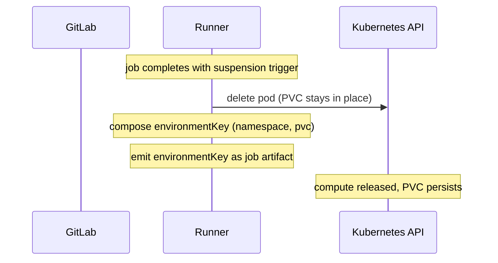
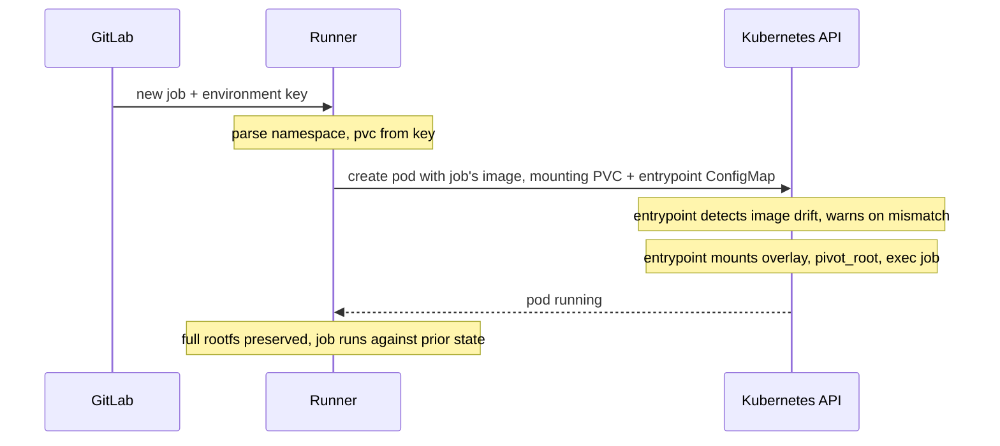

このドキュメントでは、**Kubernetes エグゼキューター**向けの suspend/resume 実装を説明します。suspension が VM の停止を意味する Fleeting-based executors と異なり、Kubernetes には同等の primitive がありません。pod が削除されると、その writable layer と emptyDir volumes は破棄されます。ここでの approach は、upper directory と work directory を PersistentVolumeClaim で backed した overlayfs を container 内で mount し、その overlay に `pivot_root` することで、すべての filesystem modification（system packages、global installs、`/tmp`、`/home`、working directory）を PVC に着地させ、pod deletion をまたいで保持するものです。

共有設計（環境キー形式、security model、open questions）については、[main blueprint](_index.md)を参照してください。Fleeting-based implementation（Instance と Docker Autoscaler）については、[fleeting.md](fleeting.md)を参照してください。

## アーキテクチャ

entrypoint script は、lower layer が container の base image（read-only）で、upper directory と work directory が `/persist` に mount された PVC 上にある overlayfs を mount します。overlay が mount された後、script は `/proc`、`/sys`、`/dev`、`/persist`、および kubelet が注入した `/etc/resolv.conf`、`/etc/hosts`、`/etc/hostname` を merged tree に bind-mount し、`pivot_root` を使って merged tree を mount namespace の新しい root にして、old root を unmount します。script 自体は、runner が environment ごとに作成する Kubernetes ConfigMap に入ります。これは PVC と並んで作成され、PVC と lifecycle を共有します。その environment のすべての pod（initial run、suspends、resumes）は ConfigMap を `/scripts` に mount し、その script を command として実行します。`/persist` と `/scripts` はどちらも pod startup 時に kubelet によって mount されるため、overlay setup が実行される前に entrypoint から利用できます。

bind-mount は、overlay だけでは cover できない paths を処理します。image ではなく kernel によって populate される kernel pseudo-filesystems（`/proc`、`/sys`）、runtime-provided device nodes（`/dev`）、PVC 自身（pivot 後も `/persist` にアクセスできるようにするため）、そして kubelet が container startup 時に書き込む host-injected pod networking files（`/etc/resolv.conf`、`/etc/hosts`、`/etc/hostname`）です。filesystem 内のそれ以外すべて（`/etc`、`/usr`、`/var`、`/home`、`/tmp`、`/root` など）は overlay 経由になります。

`pivot_root`（`chroot` ではありません）は必須です。Kubernetes executor は Kubernetes exec API（`kubectl exec` が使うものと同じ API）経由で各 job command を running container に stream します。job の実際の作業は container の entrypoint ではなく、exec された process を通じて行われます。

`chroot` は process ごとです。呼び出し元 process の root view だけを変更します。exec された job commands は元の container root で開始され、overlay を silently bypass します。その writes は pod の ephemeral writable layer に着地し、pod が削除されると消えます。

`pivot_root` は mount-namespace level で動作します。その namespace に入るすべての process、PID 1、exec された commands、debugging shells は overlay を `/` として認識し、すべての write は PVC 上の upper directory に着地します。

suspend 時、pod は削除されますが、overlay state を保持する PVC は retained されます。resume 時、新しい pod が同じ PVC を mount して作成されます。entrypoint は overlay work directory（bookkeeping は mount ごとです）を clean し、同じ upper の上に overlay を remount し、pivot します。以前の filesystem modifications、つまり cloned repo、build artifacts、dependencies、system packages、global pip/gem/npm installs、`/tmp`、`/home`、agent checkpoints はすべて visible です。

新しい environment の first run では、runner が PVC と ConfigMap を provision し、entrypoint が empty upper directory の上に overlay を mount し、job は fresh base image に対して実行されます。以降の suspends and resumes は上記の cycle に従います。

この approach は次の特徴を持ちます:

- **Runtime-agnostic** - containerd、CRI-O、runc、crun で動作します。runtime-specific tooling は不要です。
- **host-level changes なし** - DaemonSet、privileged helper pod、node-level config changes は不要です。mechanism 全体が workload pod 内にあります。
- **explicit snapshot step なし** - changes は発生した時点で persist します。work が失われる可能性のある checkpoint window はありません。
- すべての cluster administrator が理解している **standard Kubernetes primitives**（Pod、PVC、ConfigMap）を使います。

trade-offs は次のとおりです:

- overlay mount と `pivot_root` を実行するために **`CAP_SYS_ADMIN` が必要**です。user namespaces（`hostUsers: false`、Kubernetes 1.36 で GA）では、この capability は namespaced され、host privilege を付与しません。sandboxed runtimes（gVisor、Kata Containers）も同様に sandbox boundary 内に閉じ込めます。syscall が host kernel に直接到達しないためです。これらがどれもない場合、それは実際の host capability であり、trusted environments でのみ許容できます。
- **PVC node and zone affinity** - zonal block storage を持つ `ReadWriteOnce` PVC は、resumed pod を同じ zone に pin し、一部の storage driver では同じ node に pin します。resume 時に cross-node scheduling を必要とする operator には、`ReadWriteMany` storage（NFS、CephFS）または suspend/resume 時の object-storage sync が必要です。
- **Process state は保持されません** - これは rootfs を保持するものであり、live processes、memory、open file descriptors は保持しません。job script は resume 時に先頭から再実行されます。in-flight work の checkpoint（agent state files、build cache など）はユーザーの責任です。
- **Image consistency は user contract であり、runner enforcement ではありません** - overlay upper は resuming job が指定する base image に layer されるため、image drift（resuming image が suspend 時に使われたものと異なる、tag change または同じ tag の registry rebuild による差異）が subtle runtime failures を生む可能性があります。entrypoint は resume 時に drift を検出し、job log に warning を emit しますが、resume を拒否しません。より強い mitigation（automatic digest resolution、mismatch 時に resume を hard-fail すること）は、operational experience に基づく future enhancements として検討できます。

## Suspend/Resume フロー

### サスペンド



### 再開



## GitLab Runner

GitLab Runner のすべての新しい変更は、feature flag `FF_SUSPENDABLE_ENVIRONMENTS` の背後に置きます。

### Executor の suspend/resume インターフェース

Kubernetes executor は、Fleeting-based executors が使うものと同じ `SuspendableExecutor` interface を実装します:

```go
// SuspendableExecutor is implemented by executors that can preserve a job's
// workload state across job boundaries.
type SuspendableExecutor interface {
    // Suspend persists the workload state and returns the fields needed to
    // restore it. These fields are carried in the EnvironmentKey to a future
    // resuming job.
    Suspend(ctx context.Context) (url.Values, error)
    // Resume rebuilds the workload state from the fields produced by a prior
    // Suspend call.
    Resume(ctx context.Context, fields url.Values) error
}

// EnvironmentKey identifies a suspended environment. The runner produces it
// when suspending a job and parses it when a follow-up job resumes. The
// runner-id and system-id route the resume back to the same runner instance
// that issued the suspension; the fields carry executor-specific state.
//
// Format: <runner-id>/<url-encoded-system-id>/<url-encoded-fields>
type EnvironmentKey struct {
    RunnerID int64
    SystemID string
    Fields   url.Values
}
```

Kubernetes の場合、`Suspend` は `url.Values{"namespace": []string{ns}, "pvc": []string{pvcName}}` を返します。runner はそれらを、emit する `EnvironmentKey.Fields` に入れます。

### ジョブ完了時のサスペンド

suspend 時、executor は次を行います:

1. pod を削除して compute を release する。PVC は、resumed pod に overlay state を運ぶためにそのまま残す。`NamespacePerJob` が enabled の場合、resumed pod を同じ namespace に作成できるように namespace も retained する。
1. runner ID、system ID、namespace、PVC name で環境キーを構成する。
1. 環境キーを job artifact として emit する。

### ジョブ dispatch 時の再開

resume 時、executor は次を行います:

1. key から namespace と PVC name を parse する。
1. resuming job の configured image で新しい pod を作成し、既存 PVC を `/persist` に、entrypoint ConfigMap を `/scripts` に mount する。pod の command は entrypoint を指し、runner は resuming image reference を entrypoint に渡して、previous run からの drift を検出できるようにする。
1. entrypoint が pod 内で処理を引き継ぐ。resuming image が previous run で使われたものと異なるかを検出し、異なる場合は stdout に warning を emit する（prior reference がない first run では skip）。その後、PVC 上の upper directory の上に overlay を mount し、merged tree へ `pivot_root` し、job command を exec する。
1. pod が running and ready になるまで待つ。

### 環境キーのフィールド

| Executor | キー形式 |
|---|---|
| Kubernetes | `<runner-id>/<system-id>/namespace=<ns>&pvc=<pvc-name>` |

### PVC ライフサイクル

- **Creation**: 最初の job が開始され、既存 environment が参照されていない場合、runner は suspendable environment ごとに PVC と companion entrypoint ConfigMap（overlay setup script を含む）を dynamic に作成します。PVC は cluster の default StorageClass または configured one を使います。2 つの resource は lifecycle を共有します。first run で一緒に作成され、suspends and resumes をまたいで一緒に retained され、environment teardown 時に一緒に削除されます。
- **Layout on the PVC**: PVC は `/persist` に mount され、次を含みます:
  - `upper/` - この environment の first run 以降のすべての filesystem changes。
  - `work/` - overlayfs bookkeeping。mount のたびに再作成される。
  - `merged/` - pivot 中に使われる overlay mount point。
  - `.image-tag` - upper が最初に作られた image reference（tag と digest）を記録する。
- **Retention**: PVC と companion ConfigMap は pod deletion をまたいで retained されます。explicit environment termination（TTL expiry または explicit release）でのみ削除されます。
- **StorageClass requirements**: StorageClass は `ReadWriteOnce` access mode と dynamic provisioning を support している必要があります。これは事実上すべての Kubernetes cluster（GKE Persistent Disk、EKS EBS、AKS Managed Disk、local-path-provisioner など）で利用できます。cross-node resume には `ReadWriteMany` StorageClass（NFS、CephFS）が必要です。

## 障害モード

| Failure | 挙動 |
|---|---|
| PVC not found on resume | resume 時、runner は job を失敗させる。 |
| StorageClass does not support dynamic provisioning | job start 時、PVC creation が失敗すると runner は job を失敗させる。 |
| PVC in wrong availability zone or node | resume scheduling 時、PVC の affinity を満たす eligible node がないため runner は job を失敗させる。zonal storage を持つ `ReadWriteOnce` PVC は単一 zone に bound され、一部の block-storage drivers はさらに単一 node に pin する。cross-node resume が必要な場合、operator は regional または `ReadWriteMany` storage classes を使わなければならない。 |
| Namespace deleted (`NamespacePerJob`) | resume 時、runner は job を失敗させる。 |
| Runner restarts and loses in-memory state | 影響なし。環境キーには PVC name と namespace が含まれており、再接続には十分である。resume に runner-local state は不要。 |
| Resuming image differs from the image used at suspend | resume 時、entrypoint は job stdout に warning を emit して続行する。runner は image consistency を強制しない。filesystem state は package-manager state と subtle に desync する可能性がある（ABI drift、stale package DB、hidden drop-in configs）。 |
| Stale overlayfs work directory after ungraceful pod termination | resume 時、entrypoint は mount 時に work directory を再作成する。upper directory は保持される。 |

## 評価した代替案

Kubernetes suspend/resume では、PVC-backed overlayfs with `pivot_root` に落ち着く前にいくつかの approach を評価しました。却下した代替案を以下にまとめます。完全な research については [Suspendable Environments on Kubernetes](https://gitlab.com/-/snippets/5973444) と [Provision a runner fleet with a modern executor for the `duo` tag](https://gitlab.com/gitlab-org/gitlab/-/work_items/597038) を参照してください。

### Pod を存続させる

suspension 中、pod を running だが idle のまま保持します（`sleep infinity`）。すべてを保持しますが compute を release しません。これは pay-for-what-you-use goal に直接反します。spot-safe でもありません。

### Docker commit を registry に push する

`docker commit` で container の writable layer を新しい image として capture し、registry に push します。container runtime access（Docker socket または containerd socket）が必要ですが、standard Kubernetes executor pods では利用できません。gVisor や他の sandboxed runtimes と互換性がありません。image push/pull は大きな latency を追加します。

### Kubelet checkpoint API (CRIU)

kubelet checkpoint API を使って CRIU-based checkpoint を作成します。`ContainerCheckpoint` feature gate は alpha（Kubernetes 1.25 以降）であり、managed Kubernetes service では default で有効になっていません。kubelet への direct HTTPS access が必要ですが、runner pods にはありません。

### gVisor rootfs tar snapshot

gVisor の `runsc tar rootfs-upper` は overlay upper layer（すべての filesystem modifications）を capture し、paired annotation（`dev.gvisor.tar.rootfs.upper.*`）がそれを新しい sandbox に restore します。元々の obstacle は、GitLab.com の production gVisor environment が **GKE Sandbox**（fully managed）を使っており、`runsc` configuration にアクセスできず、`--allow-rootfs-tar-annotation` flag を標準では有効化できないことでした。

[follow-up exploration](https://gitlab.com/gitlab-org/gitlab/-/work_items/597038#note_3269895130) では、privileged `DaemonSet` で node-level `runsc` configuration を変更し flag を有効化することでこれを回避でき、この approach が GKE Sandbox 下でも viable になることが示されました。proof-of-concept は end-to-end で動作しました。これは検討した中で最も強力な gVisor-native alternative でした。

選択しなかった理由は次のとおりです:

- **gVisor-specific。** gVisor なしの self-managed Kubernetes deployments では、別の solution が引き続き必要です。
- **host-level changes required。** node-level `runsc` config を変更する privileged `DaemonSet` は、runner deployment を operator-managed host changes と結合します。これは選択した approach が避けている性質そのものです。
- **Cross-node coordination。** Tar files は node-local な `/var/tmp/` に書き込まれます。resumed pod が suspend 元とは異なる node に着地できるようにするには、Kubernetes が resume を schedule した場所へ tar を運ぶ追加の plumbing が必要です。例えば、suspend 時に tar を object storage（または shared store）へ push し、resume node で sandbox が開始する前に pull back する必要があります。これは構築可能ですが、design、deploy、operate が必要な別 subsystem です。

選択した PVC + overlayfs design 自体が gVisor 上で動くようになると、この approach 全体は不要になります。現在の blocker は gVisor の in-container overlay `mount(2)` が不完全であること（[google/gvisor#4768](https://github.com/google/gvisor/issues/4768)）です。upstream fix は [google/gvisor#12982](https://github.com/google/gvisor/pull/12982) で進行中で、patched gVisor build では選択した approach が end-to-end で動作することを確認済みです。この fix はまだ upstream に landed しておらず、land すれば GKE Sandbox は自身の managed-release cadence でそれを取り込みます。

### PVC に mount した working directory のみ

以前のイテレーションでは、PVC を `/builds` に mount して working directory だけを保持し、container の writable layer（system packages、global installs、`/tmp`、`/home`）は ephemeral のままにしていました。これはより単純で `CAP_SYS_ADMIN` を必要としませんでしたが、resume のたびに fresh writable layer から始まるため、toolchain には pre-baked images が必要になり、生き残る必要がある state には environment-variable redirection（`PIP_TARGET`、`npm_config_prefix`、`GEM_HOME`、`GOPATH`、`CARGO_HOME`）が必要でした。full rootfs を保持することでこれらの mitigation を完全に不要にできるため、overlay-based approach がこれを置き換えました。
