<div class="my-3 border-l-4 border-blue-500 bg-blue-50 px-4 py-3 rounded-r text-sm text-blue-800">
このページには今後予定されている製品・機能・機能性に関する情報が含まれています。ここに示す情報は参考目的のみです。購入・計画の決定にこの情報を使用しないでください。製品・機能・機能性の開発、リリース、タイミングは変更または延期される可能性があり、GitLab Inc. の独自の判断に委ねられています。
</div>

<div class="overflow-x-auto my-4">
<table class="w-full text-sm border-collapse">
<thead>
<tr class="bg-gray-100 text-left">
<th class="px-3 py-2 border border-gray-300">Status</th>
<th class="px-3 py-2 border border-gray-300">Authors</th>
<th class="px-3 py-2 border border-gray-300">Coach</th>
<th class="px-3 py-2 border border-gray-300">DRIs</th>
<th class="px-3 py-2 border border-gray-300">Owning Stage</th>
<th class="px-3 py-2 border border-gray-300">Created</th>
</tr>
</thead>
<tbody>
<tr>
<td class="px-3 py-2 border border-gray-300"><span class="inline-block rounded px-2 py-0.5 text-xs font-medium bg-gray-100 text-gray-700">ongoing</span></td>
<td class="px-3 py-2 border border-gray-300"><a href="https://gitlab.com/pedropombeiro" class="text-blue-600 hover:underline">@pedropombeiro</a>, <a href="https://gitlab.com/tmaczukin" class="text-blue-600 hover:underline">@tmaczukin</a></td>
<td class="px-3 py-2 border border-gray-300"><a href="https://gitlab.com/ayufan" class="text-blue-600 hover:underline">@ayufan</a></td>
<td class="px-3 py-2 border border-gray-300"><a href="https://gitlab.com/nicolewilliams" class="text-blue-600 hover:underline">@nicolewilliams</a></td>
<td class="px-3 py-2 border border-gray-300"><span class="inline-block rounded px-2 py-0.5 text-xs font-medium bg-gray-100 text-gray-700">~devops::verify</span></td>
<td class="px-3 py-2 border border-gray-300">2022-10-27</td>
</tr>
</tbody>
</table>
</div>


## まとめ

GitLab Runner は GitLab CI/CD の中核コンポーネントであり、信頼性の高い並行環境で
CI/CD ジョブを実行します。Ruby プログラムとしての始まりからずっと、ランナーは
登録トークン（ランダムに生成されたテキスト文字列）を使用して GitLab インスタンスに登録されます。
登録トークンは与えられたスコープ（インスタンス、グループ、またはプロジェクト）に対して
固有です。登録トークンは、ランナーを登録する側がそのランナーが登録される
インスタンス、グループ、またはプロジェクトへの管理アクセスを持つことを証明します。

このアプローチは初期の数年間はうまく機能していましたが、対象となるユーザー層が拡大するにつれて、
いくつかの主要な既知の問題が明らかになりました:

| 問題                                     | 症状                                                                                                                                                                                                                                                                                                                                                                                                                                                                                                                                                                               |
|---------------------------------------------|------------------------------------------------------------------------------------------------------------------------------------------------------------------------------------------------------------------------------------------------------------------------------------------------------------------------------------------------------------------------------------------------------------------------------------------------------------------------------------------------------------------------------------------------------------------------|
| スコープあたり1つのトークン                      | - 登録トークンは複数のランナーで共有される: <br/>- 単一のトークンは監査の価値を低下させ、トレーサビリティをほぼ不可能にする; <br/>- [ランナーの自己登録](https://docs.gitlab.com/runner/install/kubernetes.html#required-configuration)のために多くの場所にコピーされる; <br/>- セキュリティのないロケーションにトークンを保存するユーザーの報告あり; <br/>- トークンのローテーションのコストが高い。 <br/>- インスタンス全体に影響するセキュリティイベントが発生した場合、トークンのローテーションにはユーザーがプロジェクト/ネームスペースのテーブルを更新する必要があり、かなりの時間がかかる。 |
| 自動有効期限の規定なし       | 手動介入でトークンを変更する必要がある。[#30942](https://gitlab.com/gitlab-org/gitlab/-/issues/30942)で対処済み。                                                                                                                                                                                                                                                                                                                                                                                                                                        |
| 権限モデルなし                        | 保護ブランチの登録、およびあらゆるタグに使用される。この場合、登録トークンはすべてを行う権限を持つ。事実上、登録トークンを入手した人物はシークレットやソースコードを盗むことができる。                                                                                                                                                                                                                                                                                                                                                                       |
| トレーサビリティなし                             | トークンはユーザーによって作成されず、すべての管理者がアクセスできるため、漏洩したトークンのソースを知る可能性がない。                                                                                                                                                                                                                                                                                                                                                                                                                                  |
| 履歴記録なし                       | リセット時、以前の登録トークン値は保存されないため、より深い監査と調査を可能にする履歴データがない。                                                                                                                                                                                                                                                                                                                                                                                                                                        |
| プロジェクト/ネームスペースモデルに保存されたトークン     | トークンの意図しない開示の可能性がある。                                                                                                                                                                                                                                                                                                                                                                                                                                                                                                                                           |
| 登録ランナーが多すぎる                 | よく知られた登録トークンを使用した新しいランナーの登録が簡単すぎる。                                                                                                                                                                                                                                                                                                                                                                                                                                                                              |

これらの問題を踏まえ、トレーサビリティ、セキュリティ、パフォーマンスを保証できるように
ランナーを GitLab インスタンスに接続する方法を再設計することが重要です。

この新しいメカニズムを「次世代 GitLab Runner トークンアーキテクチャ」と呼びます。

## 提案

提案は、_スコープあたり1つのトークン_ と _トークンストレージ_ の問題を
登録トークンの必要性を排除することで対処します。ランナーの作成は、
認証済みユーザーのコンテキストで所定のスコープの GitLab ランナー設定ページで行われ、
トレーサビリティが提供されます。このページは、既存の `gitlab-runner register` コマンドを使用して
サポートされている環境で新しく作成されたランナーを設定する手順を提供します。

登録トークンの排除により、残りの懸念事項は問題でなくなります。

### 現在と新しいランナー登録フローの比較

```mermaid
graph TD
    subgraph new[<b>New registration flow</b>]
    A[<b>GitLab</b>: User creates a runner in GitLab UI and adds the runner configuration] -->|<b>GitLab</b>: creates ci_runners record and returns<br/>new 'glrt-' prefixed authentication token| B
    B(<b>Runner</b>: User runs 'gitlab-runner register' command with</br>authentication token to register new runner manager with<br/>the GitLab instance) --> C{<b>Runner</b>: Does a .runner_system_id file exist in<br/>the gitlab-runner configuration directory?}
    C -->|Yes| D[<b>Runner</b>: Reads existing system ID] --> F
    C -->|No| E[<b>Runner</b>: Generates and persists unique system ID] --> F
    F[<b>Runner</b>: Issues 'POST /runner/verify' request<br/>to verify authentication token validity] --> G{<b>GitLab</b>: Is the authentication token valid?}
    G -->|Yes| H[<b>GitLab</b>: Creates ci_runner_machine database record if missing] --> J[<b>Runner</b>: Store authentication token in .config.toml]
    G -->|No| I(<b>GitLab</b>: Returns '403 Forbidden' error) --> K(gitlab-runner register command fails)
    J --> Z(Runner and runner manager are ready for use)
    end

    subgraph current[<b>Current registration flow</b>]
    A'[<b>GitLab</b>: User retrieves runner registration token in GitLab UI] --> B'
    B'[<b>Runner</b>: User runs 'gitlab-runner register' command<br/>with registration token to register new runner] -->|<b>Runner</b>: Issues 'POST /runner request' to create<br/>new runner and obtain authentication token| C'{<b>GitLab</b>: Is the registration token valid?}
    C' -->|Yes| D'[<b>GitLab</b>: Create ci_runners database record] --> F'
    C' -->|No| E'(<b>GitLab</b>: Return '403 Forbidden' error) --> K'(gitlab-runner register command fails)
    F'[<b>Runner</b>: Store authentication token<br/>from response in .config.toml] --> Z'(Runner is ready for use)
    end

    style new fill:#f2ffe6
```



### 登録トークンの代わりに認証トークンを使用する

<!-- vale gitlab.Spelling = NO -->
この提案では、GitLab UI で作成されたランナーには
`glrt-` (**G**it**L**ab **R**unner **T**oken) プレフィックスを付けた
[認証トークン](https://docs.gitlab.com/ee/security/tokens/index.html#runner-authentication-tokens)
が割り当てられます。
<!-- vale gitlab.Spelling = YES -->
このプレフィックスにより、既存の `register` コマンドが現在の登録トークン
（`--registration-token`）の_代わりに_認証トークンを使用できるようになり、
既存のワークフローへの調整を最小限に抑えられます。
認証トークンはユーザーに一度だけ表示されます — 作成フローを完了した後 — 意図しない
再利用を防止します。

ランナーは GitLab UI を通じて事前に作成されているため、
ランナー作成フォームで公開される引数が提供された場合、`register` コマンドは失敗します。
例えば `--tag-list`、`--run-untagged`、`--locked`、`--access-level` などは、
管理者/オーナーが作成時に決定すべき機密パラメーターです。
ランナー設定は既存の `register` コマンドを通じて生成され、
`--registration-token` 引数に登録トークンまたは認証トークンのどちらが
提供されるかに応じて2つの異なる方法で動作します:

| トークンタイプ | 動作 |
| ---------- | -------- |
| [登録トークン](https://docs.gitlab.com/ee/security/tokens/index.html#runner-authentication-tokens) | `POST /api/v4/runners` REST エンドポイントを活用して新しいランナーを作成し、`config.toml` に新しいエントリを作成し、欠如している場合はサイドカーファイル（`.runner_system_id`）に `system_id` 値を作成します。 |
| [ランナー認証トークン](https://docs.gitlab.com/ee/security/tokens/index.html#runner-authentication-tokens) | `POST /api/v4/runners/verify` REST エンドポイントを活用して認証トークンの有効性を確保します。`config.toml` ファイルにエントリを作成し、欠如している場合はサイドカーファイル（`.runner_system_id`）に `system_id` 値を作成します。 |

### 移行期間

移行期間中、レガシートークン（「登録トークン」）は引き続き GitLab ランナーの
設定ページに表示され、`gitlab-runner register` コマンドによって受け付けられます。
ただし、レガシーワークフローは UI では推奨されません。
ユーザーは、UI でランナーを作成し、今日と同様に `gitlab-runner register` コマンドで
生成された認証トークンを使用する新しいフローに誘導されます。
このアプローチにより、ランナーのデプロイを担当するユーザーへの混乱を軽減します。

### 多くのマシンでランナー認証トークンを再利用する

既存のオートスケーリングモデルでは、新しいジョブを実行する必要があるたびに
新しいランナーが作成されます。これにより、ランナーが残されて古くなる状況が
多数生じています。

提案されたモデルでは、`ci_runners` テーブルエントリが複数のマシンで再利用できる
設定を記述し、各マシンからのランナー状態（例: IP アドレス、プラットフォーム、
またはアーキテクチャ）は別のテーブル（`ci_runner_machines`）に移動します。
ランナーアプリケーションが起動するか設定が保存されるたびに、一意のシステム識別子が
[自動的に生成されます](#system_id-値の生成)。
これにより、ランナーが使用されているマシンを区別できます。

`system_id` 値は、コマンドライン出力、CI ジョブログ、GitLab UI でランナーを識別するために
使用される短いランナートークンを補完します。

ランナーの作成にはユーザーインタラクションが含まれるため、スコープごとに
登録できる CI ランナーの計画ごとの制限を最終的に下げることが可能になります。

#### `system_id` 値の生成

`gitlab-runner` インストールには常に一意のシステム識別子が割り当てられることを
保証します。
ID は `/etc/machine-id`（Linux 上）などの既存のマシン識別子から派生して
プライバシーのためにハッシュ化され、その場合は `s_` プレフィックスが付きます。
ID が利用できない場合はランダムな文字列が使用され、その場合は `r_` プレフィックスが付きます。

この一意の ID は `gitlab-runner` プロセスを識別し、`config.toml` ファイルの
すべてのランナーの `POST /api/v4/jobs` リクエストで送信されます。

ID は `gitlab-runner` の起動時と設定がディスクに保存されるたびに生成・保存されます。
ただし、ID を `config.toml` のルートに保存する代わりに、その隣に存在する
新しいファイル（`.runner_system_id`）に保存します。この新しいファイルの目的は、
`config.toml` ファイルを手動でコピーしたことによる ID の再利用の可能性を
減らすことです。

```plain
s_cpwhDr7zFz4xBJujFeEM
```

### CI ジョブでのランナー識別

ジョブが実行されたマシンをユーザーが特定するために、一意の識別子は
CI ジョブコンテキストで見える必要があります。
最初のイテレーションとして、GitLab Runner は短いトークン SHA を公開する場所では
どこでもビルドログに一意のシステム識別子を含めます。

ランナーは異なる一意のシステム識別子で再利用される可能性があるため、
一意のシステム ID をデータベースに保存する必要があります。
これにより一意のシステム ID がランナートークンとともに GitLab Runner の `system_id` 値に
マッピングされます。新しい `ci_runner_machines` テーブルは各一意のランナーマネージャーに
関する情報を保持し、ランナーが最後に接続した時刻と、どのタイプのランナーだったかの情報を含みます。

長期的には、関連するフィールドを `ci_runners` から `ci_runner_machines` に移動します。
ただし、削除マイルストーンまでの間は、一致する `ci_runner_machines` レコードが
存在しない場合のフォールバックとして `ci_runners` に保持する必要があります。
これは期待されるシナリオで、テーブルが作成されてもランナーが GitLab インスタンスに
Ping していない場合（例えばランナーがオフラインの場合）です。

さらに、`ci_runners` に以下の列を追加する必要があります:

- `creator_id` 列でランナーを作成したユーザーを追跡する;
- ランナーがレガシーの `register` メソッドで作成されたか、新しい UI ベースの
  メソッドで作成されたかを示すための `registration_type` enum 列を `ci_runners` に追加する。
  可能な値は `:registration_token` と `:authenticated_user` です。
  これにより古いランナーのクリーンアップサービスがどのランナーをクリーンアップするかを
  決定でき、将来の明らかでない用途も可能にします。

```sql
CREATE TABLE ci_runners (
  ...
  creator_id bigint
  registration_type int8
)
```

新しい `p_ci_runner_machine_builds` テーブルは `ci_runner_machines` と `ci_builds` テーブルを
結合し、これらのテーブルへの負荷を避けます。
`contacted_at` を既存のレコードを更新する以外のより効率的な保存方法を検討するかもしれません。

```sql
CREATE TABLE p_ci_runner_machine_builds (
    partition_id bigint DEFAULT 100 NOT NULL,
    build_id bigint NOT NULL,
    runner_machine_id bigint NOT NULL
)
PARTITION BY LIST (partition_id);

CREATE TABLE ci_runner_machines (
    id bigint NOT NULL,
    system_xid character varying UNIQUE NOT NULL,
    contacted_at timestamp without time zone,
    version character varying,
    revision character varying,
    platform character varying,
    architecture character varying,
    ip_address character varying,
    executor_type smallint,
    config jsonb DEFAULT '{}'::jsonb NOT NULL
);
```

## メリット

- ユーザーがコンセプトを把握しやすくなります: 2種類のトークンの代わりに、
  1種類のトークン（ランナーごとの認証トークン）のみになります。2種類のトークンは
  Issue を議論する際にしばしば誤解を招きます;
- ランナーは常に監査ログを使用して作成したユーザーを追跡できます;
- CI ランナーの claims は作成時に既知であり、ランナーから変更できません
  （例えば `access_level`/`protected` フラグの変更）。ただし、認証済みユーザーは
  GitLab UI を通じてこれらの設定を編集できます;
- `ci_runner` テーブルに触れないため、古いランナーのクリーンアップが容易になります。

## 詳細

提案されたアプローチでは、移行期間中に現在の登録トークンメソッドと並行して
使用できる別の方法でランナーを設定します。アイデアは、Runner が
「神のような」単一のトークンを活用して新しいランナーを登録するための
API 呼び出しをできなくすることです。

新しいワークフローは以下のようになります:

1. ユーザーがランナー設定ページを開く（インスタンス、グループ、またはプロジェクトレベル）;
1. ユーザーが新しいランナーに関する詳細（説明、タグ、保護、ロックなど）を入力する;
1. ユーザーが `Create`（作成）をクリックする。これにより以下が発生します:

   1. `ci_runners` テーブルに新しいランナーを作成する（および対応する `glrt-` プレフィックスの認証トークン）;
   1. 異なるサポートされているデプロイシナリオ（例: シェル、`docker-compose`、Helm チャートなど）の
      可能性を示す、マシン上でこの新しいランナーを設定する方法の手順をユーザーに提示する。
      この情報にはユーザーに一度だけ表示されるトークンが含まれており、UI は同じランナーを
      複数回登録することは推奨されない（不可能ではないが）ことをユーザーに明確に示します。

1. ユーザーが対象のデプロイシナリオの手順（`register` コマンド）をコピー&ペーストし、以下のアクションが起きます:

   1. 手順内の新しい `gitlab-runner register` コマンドを実行すると、
      `gitlab-runner` は与えられたランナートークンで `POST /api/v4/runners/verify` を呼び出します;
   1. `POST /api/v4/runners/verify` GitLab エンドポイントがトークンを検証すると、
      `config.toml` ファイルが設定で埋められます;
   1. ランナーがジョブのために Ping するたびに、対応する `ci_runner_machines` レコードが
      ランナーに関する最新情報で["upsert"](https://en.wiktionary.org/wiki/upsert)されます
      （ランナーのハートビートと同様に Redis キャッシュを前置きして）。

移行期間の一部として、管理者とトップレベルグループオーナーには、レガシーの
登録トークン機能を無効化し新しいワークフローのみを強制するための
インスタンス/グループレベルの設定（`allow_runner_registration_token`）を提供します。
`gitlab-runner register` コマンドが登録トークンで新しいランナーを登録するために
`POST /api/v4/runners` エンドポイントを叩こうとするとすべて `HTTP 410 Gone` ステータスコードになります。

インスタンス設定はグループに継承されます。つまり、インスタンスメソッドでレガシーの
登録メソッドが無効化されると、子孫グループ/プロジェクトはレガシーの登録メソッドを
必然的に使えなくなります。

登録トークンワークフローは（`gitlab-runner register` コマンドによって出力される
非推奨通知とともに）非推奨化され、コンセプトが安定してお客様が新しいワークフローに
移行した後の将来のメジャーリリースで削除される予定です。

### レガシーランナーの処理

レガシーバージョンの GitLab Runner はリクエストに一意のシステム識別子を送信せず、
Workhorse で一意のシステム ID を処理するためのロジックを変更しません。これは
レガシーの登録システムが削除された後、ランナーが新しいバージョンにアップグレードされてから
改善できます。

そのようなレガシーランナーからのジョブ Ping は `<legacy>` `system_xid` フィールド値を
含む `ci_runner_machines` レコードになります。

一意のシステム ID を使用しないことは、正確なシステム識別子に一致するランナーだけでなく、
同じトークンを持つすべての接続されたランナーが通知されることを意味します。
理想的ではありませんが、本質的に問題ではありません。

### `ci_runner_machines` レコードのライフタイム

新しいレコードは2つの状況で作成されます:

- ランナーが `gitlab-runner register` コマンドの一部として `POST /api/v4/runners/verify`
  エンドポイントを呼び出す際、指定されたランナートークンが `glrt-` プレフィックスの場合。
  これにより、フロントエンドはユーザーが登録を正常に完了したかどうかを判断し、
  適切なアクションを取ることができます;
- GitLab が新しいジョブのために Ping された際、`token`+`system_id` に一致する
  レコードがまだ存在しない場合。

`ci_runner_machines` レコードの時間的減衰性により、それぞれのランナーからの
最後の接触から7日後に自動的にクリーンアップされます。

### 必要な適応

#### `ci_runner_machines` テーブルへの移行

`ci_runner_machines` の詳細が必要な場合、`ci_runner_machines` で一致が見つからない場合は
`ci_runner` の既存のフィールドにフォールバックする必要があります。

#### REST API

ランナートークンを受け取る API エンドポイントはオプションの `system_id` パラメーターも
取れるように変更する必要があります。これはランナートークンと一緒に送信されます
（多くの場合、リクエストボディの JSON パラメーターとして）。

#### GraphQL `CiRunner` 型

[`CiRunner` 型](https://docs.gitlab.com/ee/api/graphql/reference/index.html#cirunner)は
`ci_runners` モデルを密接に反映しています。これは提案されたアプローチでは
`ipAddress`、`architectureName`、`executorName` などのマシン情報が
単数値ではなくなることを意味します。
当面はこの事実を受け入れ、カンマ区切りの一意の値のリストを返すことを始めます。
それぞれの `CiRunner` フィールドは `ci_runner_machines` エントリの値を返す必要があります
（存在しない場合は `ci_runner` レコードにフォールバック）。

#### 古いランナーのクリーンアップ

[古いランナーをクリーンアップする](https://docs.gitlab.com/ee/ci/runners/runners_scope.html#clean-up-stale-group-runners)機能は
`ci_runners` レコードではなく `ci_runner_machines` レコードをクリーンアップするように
適応する必要があります。

登録トークンサポートの削除後のある時点で、登録トークンで作成された
古いランナーをクリーンアップするバックグラウンドマイグレーションを作成したいと思います
（`ci_runners` テーブルで作成した enum 列を活用）。

### API を通じたランナーの作成

自動化されたランナー作成は、新しい GraphQL ミューテーションと既存の
[`POST /user/runners` REST API エンドポイント](https://docs.gitlab.com/ee/api/users.html#create-a-runner-linked-to-a-user)
を通じて可能です。
これらのエンドポイントは指定されたスコープでランナーを
[作成することが許可されている](https://docs.gitlab.com/ee/user/permissions.html#gitlab-cicd-permissions)
ユーザーのみが利用できます。

## 実装計画

### ステージ1 - 非推奨化

| コンポーネント                        | マイルストーン | 変更 |
|----------------------------------|----------:|---------|
| GitLab Rails アプリ                 |    `15.6` | `17.0` に向けて `POST /api/v4/runners` エンドポイントを非推奨化。これはセキュリティ上の理由で REST API エンドポイントの非推奨化を許可する[提案](https://gitlab.com/gitlab-org/gitlab/-/issues/373774)に依存します。 |
| GitLab Runner                    |    `15.6` | `17.0` に向けて `register` コマンドの非推奨通知を追加。 |
| GitLab Runner Helm Chart         |    `15.6` | `17.0` に向けて `runnerRegistrationToken` コマンドの非推奨通知を追加。 |
| GitLab Runner Operator           |    `15.6` | `17.0` に向けて `runner-registration-token` コマンドの非推奨通知を追加。 |
| GitLab Runner / GitLab Rails アプリ |    `15.7` | `17.0` に向けて登録トークンのリセットの非推奨通知を追加。 |

### ステージ2 - `system_id` のための `gitlab-runner` を準備

| コンポーネント     | マイルストーン | 変更 |
|---------------|----------:|---------|
| GitLab Runner |    `15.7` | `system_id` 値を持つサイドカー TOML ファイルが存在することを確認。<br/>新しいシステム ID 値が割り当てられる際に `INFO` レベルでログに記録。 |
| GitLab Runner |    `15.9` | ビルドログに一意のシステム ID をログ記録。 |
| GitLab Runner |    `15.9` | 一意のシステム ID で Prometheus メトリクスにラベル付け。 |
| GitLab Runner |    `15.8` | 新しい `glrt-` トークンと一緒にランナーサーバーサイド設定オプションが渡された場合に `register` コマンドが失敗するよう準備。 |

### ステージ2a - GitLab Runner Helm Chart と GitLab Runner Operator の準備

| コンポーネント                | マイルストーン | 変更 |
|--------------------------|----------:|---------|
| GitLab Runner Helm Chart |  `%15.10` | 認証トークンを使用した登録をサポートするよう Runner Helm Chart を更新。 |
| GitLab Runner Operator   |  `%15.10` | 認証トークンを使用した登録をサポートするよう Runner Operator を更新。 |
| GitLab Runner Helm Chart |   `%16.2` | Runner Helm Chart に `systemID` を追加。 |

### ステージ3 - データベースの変更

<!-- markdownlint-disable MD056 -->

| コンポーネント        | マイルストーン | 変更 |
|------------------|----------:|---------|
| GitLab Rails アプリ | `%15.8` | `ci_runners` テーブルに列を追加するデータベースマイグレーションを作成。 |
| GitLab Rails アプリ | `%15.8` | `ci_runner_machines` テーブルを追加するデータベースマイグレーションを作成。 |
| GitLab Rails アプリ | `%15.9` | `ci_builds_metadata` テーブルに `ci_runner_machines.id` 外部キーを追加するデータベースマイグレーションを作成。 |
| GitLab Rails アプリ | `%15.8` | `application_settings` と `namespace_settings` テーブルに `allow_runner_registration_token` 設定を追加するデータベースマイグレーションを作成（デフォルト: `true`）。 |
| GitLab Rails アプリ | `%15.8` | `ci_runner_machines` テーブルに `config` 列を追加するデータベースマイグレーションを作成。 |
| GitLab Runner    | `%15.9` | `POST /jobs/request` リクエストと一意のシステムを識別する必要がある他のフォローアップリクエストで `system_id` 値の送信を開始。 |
| GitLab Rails アプリ | `%15.9` | `ci_runners` レコードの代わりに `ci_runner_machines` レコードをクリーンアップするために `StaleGroupRunnersPruneCronWorker` サービスに類似したサービスを作成。<br/>既存のサービスはレガシーランナーのみに焦点を当て続ける。 |
| GitLab Rails アプリ | `%15.9` | `create_runner_machine` [フィーチャーフラグ](https://docs.gitlab.com/ee/administration/feature_flags.html)を実装。 |
| GitLab Rails アプリ | `%15.9` | ランナートークンが `glrt-` プレフィックスの場合、`POST /runners/verify` リクエストで `ci_runner_machines` レコードを作成。 |
| GitLab Rails アプリ | `%15.9` | `ci_runner_machines` キャッシュ/テーブルを更新するための[ハートビートリクエスト](https://gitlab.com/gitlab-org/gitlab/blob/c73c96a8ffd515295842d72a3635a8ae873d688c/lib/api/ci/helpers/runner.rb#L14-20)で `POST /jobs/request` リクエストにランナートークン + `system_id` JSON パラメーターを使用。 |
| GitLab Rails アプリ | `%15.9` | `create_runner_workflow_for_admin` [フィーチャーフラグ](https://docs.gitlab.com/ee/administration/feature_flags.html)を実装。 |
| GitLab Rails アプリ | `%15.9` | `create_{instance|group|project}_runner` パーミッションを実装。 |
| GitLab Rails アプリ | `%15.9` | API で渡される `system_id` と一致するよう `ci_runner_machines.machine_xid` 列を `system_xid` に名前変更。 |
| GitLab Rails アプリ | `%15.10` | `ci_runner_machines.machine_xid` 列の無視ルールを削除。 |
| GitLab Rails アプリ | `%15.10` | `ci_builds_metadata.runner_machine_id` を新しい結合テーブルに置き換え。 |
| GitLab Rails アプリ | `%15.11` | `ci_builds_metadata.runner_machine_id` 列を削除。 |
| GitLab Rails アプリ | `%16.0` | `ci_builds_metadata.runner_machine_id` 列の無視ルールを削除。 |

<!-- markdownlint-enable MD056 -->

### ステージ4 - UI からのランナー作成

| コンポーネント        | マイルストーン | 変更 |
|------------------|----------:|---------|
| GitLab Rails アプリ | `%15.9` | [新しく生成されたランナー認証トークンにプレフィックスを追加](https://gitlab.com/gitlab-org/gitlab/-/issues/383198)。 |
| GitLab Rails アプリ | `%15.9` | 登録に使用されるトークンを持つ新しいランナーフィールドを追加 |
| GitLab Rails アプリ | `%15.9` | 新しいランナーを作成するための新しい GraphQL ユーザー認証 API を実装。 |
| GitLab Rails アプリ | `%15.10` | `/runners/verify` REST エンドポイントからトークンとランナー ID 情報を返す。 |
| GitLab Runner    | `%15.10` | [`glrt-` プレフィックスの認証トークンを使用した新しいフローをサポートするよう register コマンドを変更](https://gitlab.com/gitlab-org/gitlab-runner/-/issues/29613)。 |
| GitLab Runner    | `%15.10` | `gitlab-runner register` コマンドを単一操作で実行できるようにする。 |
| GitLab Rails アプリ | `%15.10` | グループとプロジェクトの「新しいランナー作成ワークフロー」のフィーチャーフラグとポリシーを定義。 |
| GitLab Rails アプリ | `%15.10` | ジョブのポーリング時にのみランナーの `contacted_at` と `status` を更新。 |
| GitLab Rails アプリ | `%15.10` | `CiRunner` の下のランナーマネージャーを表す GraphQL 型を追加。 |
| GitLab Rails アプリ | `%15.11` | 新しいインスタンスランナーを作成する UI を実装。 |
| GitLab Rails アプリ | `%15.11` | グループとプロジェクトを受け入れるようにサービスとミューテーションを更新。 |
| GitLab Rails アプリ | `%15.11` | 新しいグループ/プロジェクトランナーを作成する UI を実装。 |
| GitLab Rails アプリ | `%15.11` | CiJob GraphQL 型に `runner_machine` フィールドを追加。 |
| GitLab Rails アプリ | `%15.11` | ランナー詳細ビューの UI 変更（プラットフォーム、アーキテクチャ、IP アドレスなどの一覧表示）（?） |
| GitLab Rails アプリ | `%15.11` | 登録トークンの代わりにスコープを持つ認可済みユーザーからのリクエストを受け入れるよう `POST /api/v4/runners` REST エンドポイントを適応。 |
| GitLab Runner    | `%15.11` | `unregister` コマンドで `glrt-` ランナートークンを処理。 |
| GitLab Runner    | `%15.11` | `--token` に `glrt-` ランナートークンが渡された場合、ランナーが登録トークンを要求。 |
| GitLab Rails アプリ | `%15.11` | 「runner machine」の用語から「runner manager」に変更。 |

### ステージ5 - 登録トークンのオプション無効化

<!-- markdownlint-disable MD056 -->

| コンポーネント        | マイルストーン | 変更                                                                                                                                                                                                                                                                                                                            |
|------------------|----------:|------------------------------------------------------------------------------------------------------------------------------------------------------------------------------------------------------------------------------------------------------------------------------------------------------------------------------------|
| GitLab Rails アプリ | `%16.0`   | [アプリケーション設定](https://gitlab.com/gitlab-org/gitlab/-/issues/386712)を考慮するよう `register_{group|project}_runner` パーミッションを適応。 |
| GitLab Rails アプリ | `%16.1`   | `allow_runner_registration_token` 設定が登録トークンを無効化している場合、[`POST /api/v4/runners`](https://docs.gitlab.com/ee/api/runners.html#create-a-runner) エンドポイントを永続的に `HTTP 410 Gone` を返すようにする。Runners API v5 は `HTTP 404 Not Found` を返すべき。 |
| GitLab Rails アプリ | `%16.1`   | ランナーリストにランナーグループメタデータを追加。 |
| GitLab Rails アプリ | `%16.11`  | トップレベルグループ設定で登録トークンの使用を無効化できる UI を追加。                                                                                                                                                                                                                                                               |
| GitLab Rails アプリ | `%16.11`  | 管理パネルで登録トークンの使用を無効化できる UI を追加。 |
| GitLab Rails アプリ | `%16.11`  | トップレベルグループ設定または管理者によって無効化されている場合、登録トークンによる登録を示すレガシー UI を非表示にする。                                                                                                                                                                                                         |

<!-- markdownlint-enable MD056 -->

### ステージ6 - 強制適用

| コンポーネント        | マイルストーン | 変更 |
|------------------|----------:|---------|
| GitLab Rails アプリ |   `%17.0` | データベースマイグレーションを実行してすべてのグループの登録トークンを無効化（GitLab.com のみ） |
| GitLab Rails アプリ |   `%17.0` | データベースマイグレーションを実行してインスタンスレベルの登録トークンを無効化（GitLab.com を除く） |
| GitLab Rails アプリ |   `%16.3` | 完全な `api` スコープを必要としないよう新しい `:create_runner` PPGAT スコープを実装。 |
| GitLab Rails アプリ |           | 複数のマシンで[ランナートークンを自動ローテーション](https://docs.gitlab.com/ee/ci/runners/configure_runners.html#automatically-rotate-runner-authentication-tokens)する際の注意事項をドキュメント化。 |

### ステージ7 - 削除

2025年3月以前、削除計画では GitLab 18.0（2025年5月リリース）での Runner 登録トークン機能の削除が想定されていました。慎重な検討の末、18.0 リリース（2025年5月）では GitLab から Runner Registration Token 機能を削除しないことを決定しました。将来的に再検討する可能性があるため、現時点では削除の具体的なマイルストーンを設定していません。ランナー登録トークン方式にまだ依存しているお客様には、新しいランナーの登録にその方式の使用を停止し、代わりにランナー作成フローを採用することを推奨します。

| コンポーネント        | マイルストーン | 変更                                                                                                                                                                                                                                                                                                                                |
|------------------|----------:|----------------------------------------------------------------------------------------------------------------------------------------------------------------------------------------------------------------------------------------------------------------------------------------------------|
| GitLab Rails アプリ |    N/A | グループとインスタンスレベルで登録トークンを有効化する UI を削除。                                                                                                                                                                                                                                           |
| GitLab Rails アプリ |    N/A | 登録トークンによる登録を示すレガシー UI を削除。                                                                                                                                                                                                                                                   |
| GitLab Runner    |    N/A | `register` コマンドからランナーモデル引数を削除（例: `--run-untagged`、`--tag-list` など）                                                                                                                                                                                                           |
| GitLab Rails アプリ |    N/A | `application_settings` と `namespace_settings` テーブルから `allow_runner_registration_token` 設定列を削除するデータベースマイグレーションを作成。                                                                                                                                                  |
| GitLab Rails アプリ |    N/A | 以下を削除するデータベースマイグレーションを作成:<br/>- `application_settings` から `runners_registration_token`/`runners_registration_token_encrypted` 列;<br/>- `namespaces` テーブルから `runners_token`/`runners_token_encrypted`;<br/>- `projects` テーブルから `runners_token`/`runners_token_encrypted`。 |
| GitLab Rails アプリ |    N/A | `GITLAB_SHARED_RUNNERS_REGISTRATION_TOKEN` を削除。                                                                                                                                                                                                                                                 |

## FAQ

[ユーザードキュメント](https://docs.gitlab.com/ee/ci/runners/new_creation_workflow.html)に従ってください。

## ステータス

ステータス: RFC。

## 担当者

提案:

<!-- vale gitlab.Spelling = NO -->

| 役割                         | 担当者 |
|------------------------------|--------------------------------------------------|
| 著者                      | Kamil Trzciński、Tomasz Maczukin、Pedro Pombeiro |
| アーキテクチャ進化コーチ | Kamil Trzciński                                  |
| エンジニアリングリーダー           | Nicole Williams、Cheryl Li                       |
| プロダクトマネージャー              | Darren Eastman、Jackie Porter                    |
| ドメインエキスパート / Runner       | Tomasz Maczukin                                  |

DRI:

| 役割                         | 担当者                             |
|------------------------------|---------------------------------|
| リーダーシップ                   | Nicole Williams                 |
| プロダクト                      | Darren Eastman                  |
| エンジニアリング                  | Tomasz Maczukin、Pedro Pombeiro |

ドメインエキスパート:

| 分野                         | 担当者             |
|------------------------------|-----------------|
| ドメインエキスパート / Runner       | Tomasz Maczukin |

<!-- vale gitlab.Spelling = YES -->
