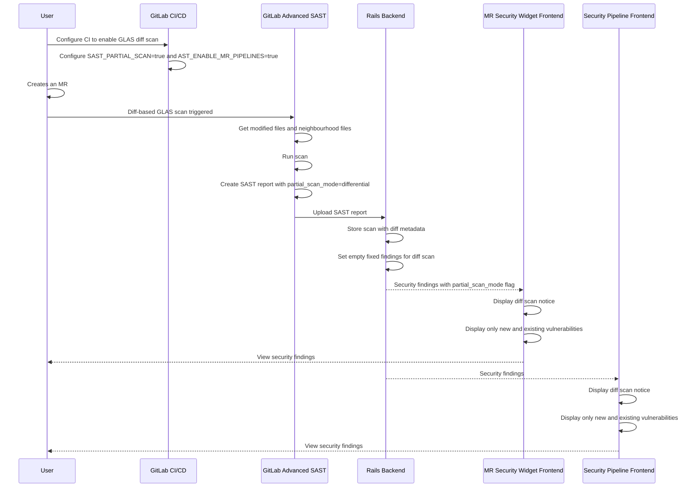
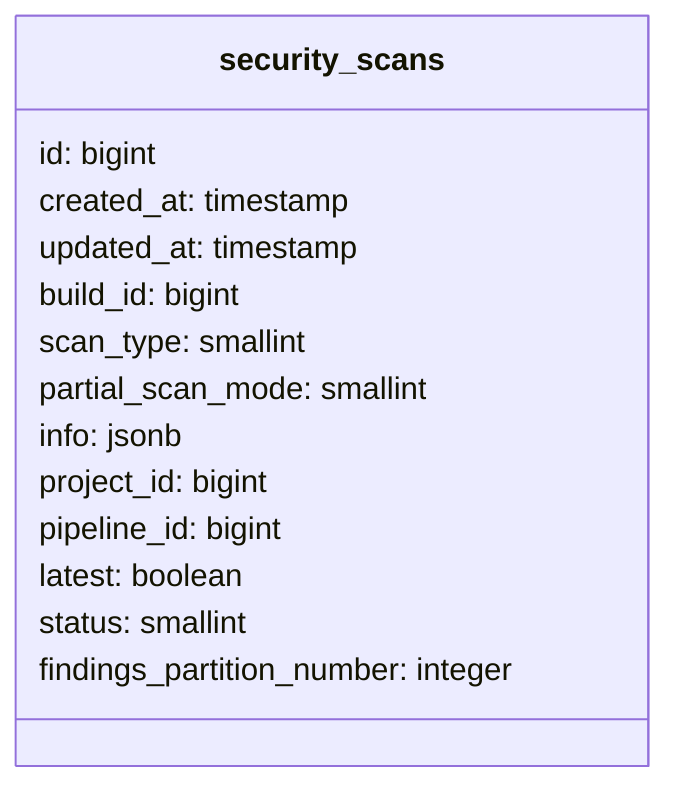




## まとめ

この設計ドキュメントは、GitLab Advanced SAST（GLAS）の差分ベーススキャン結果を表示するための `Security Widget`（セキュリティウィジェット）と `Security Pipeline Tab`（セキュリティパイプラインタブ）に加える変更を概説しています。差分ベーススキャンは、コードベース全体をスキャンするのではなく、マージリクエストで変更されたファイルと[設定されたネイバーフッド深度まで依存するファイル](#ネイバーフッド深度について)のみを分析することに焦点を当てています。このアプローチにより、スキャン時間が大幅に短縮され、多くのユースケースで実用的なセキュリティインサイトが提供されます。

使用している用語に不慣れな場合は、[GLAS の概念](#glas-の概念)セクションに進んで説明を確認することをお勧めします。

## 動機

特に大規模なコードベースでは、フルセキュリティスキャンに時間がかかることがあります。変更されたファイルとその直接の依存関係の分析に焦点を当てることで、マージリクエストのセキュリティ Issue についてより速いフィードバックを提供できます。

### 目標

- MR での GLAS スキャン時間を短縮
- **セキュリティウィジェット** と **セキュリティパイプラインタブ** でスキャンが差分ベースであることを明確に示す
- 修正された脆弱性が**セキュリティウィジェット**に**表示されない**ようにし、ユーザーに理由を明確に説明する
- 18.3 でのリリースをターゲット

### 非目標

- ステートフルインクリメンタルスキャン（将来のイテレーションで計画）
- フルスキャンを手動でトリガーする UI コンポーネントの作成（MVC では CI/CD 変数を使用）
- 修正された脆弱性の検出のサポート（MVC では非表示にする）
- ユーザーがネイバーフッド深度を設定できるようにする（将来のイテレーションで検討）

## 提案

### 差分ベーススキャン

**フルの GLAS スキャン**に対して `Security Widget` や `Pipeline Security Tab` に**変更はありません**。差分ベーススキャンは `SAST_PARTIAL_SCAN` CI/CD 変数で有効化できるため、**破壊的変更ではありません**。

#### GLAS 差分ベーススキャンにおける動作

- `SAST_PARTIAL_SCAN: differential` の CI/CD 変数を設定することで有効化
GLAS スキャナーは変更されたファイルと、設定された[ネイバーフッド深度](#ネイバーフッド深度について)に基づいてそれらに依存するファイルのみを分析します
- 結果の SAST レポートには `partial_scan_mode` フィールドが含まれ、`differential` に設定され、スキャンされたファイルに限定されたファインディング（検出結果）が含まれます
- `Security Widget` はこれが差分ベーススキャンであることを示す通知を表示し、**新規と既存のファインディングのみを表示し、[修正された脆弱性は除外](#差分スキャンにおける修正済み脆弱性)**します
- `Security Pipeline tab` に差分スキャン通知が表示されます

### 差分ベーススキャンプロセスのシーケンス図



### データベーススキーマ



### 主要設計決定

#### 1. 修正済み脆弱性を非表示にする

**決定: GLAS 差分ベーススキャンの修正済み脆弱性を表示しない**

MVC 実装の一部として、差分ベーススキャンが有効な場合、修正済み脆弱性はセキュリティウィジェットに**表示されません**。この制限はユーザーに明確に伝えられます。

*根拠:*

- 差分ベーススキャンはすべての修正済み脆弱性を確実に検出することができません。
- 背景と理由は[こちら](#差分スキャンにおける修正済み脆弱性)を参照してください

#### 2. セキュリティ承認機能を維持する

**決定: 既存のセキュリティ承認ルールを維持し、制限事項をドキュメント化する**

MVC では、差分ベーススキャンで承認ルールを使用する場合の潜在的な偽陰性について明確なドキュメントを提供しながら、既存のセキュリティ承認機能を維持します。

*根拠:*

- 混乱なく現在のワークフローを維持します
- MVC フェーズでの複雑な機能の相互作用を避けます
- 背景と理由は[こちら](https://gitlab.com/gitlab-org/gitlab/-/issues/536864#note_2485990368)を参照してください

#### 3. フルスキャンオプション

**決定: ユーザーはフルスキャンをトリガーするために差分ベーススキャンを無効化する必要がある**

差分ベーススキャンが設定されたユーザーが特定のパイプラインにフルスキャンをトリガーできるようにすることを検討しましたが、MR パイプラインの手動 CI 変数設定のサポートの欠如によりブロックされました。詳細はこの [Issue](https://gitlab.com/gitlab-org/gitlab/-/issues/543964) にあります。

*代替アプローチ:*

- セキュリティウィジェットにフルスキャンをトリガーするボタンを追加する

## 設計と実装の詳細

### GLAS アナライザーの変更

1. 以下の CI 変数が設定された場合に差分ベーススキャンをトリガーするよう [GLAS](https://gitlab.com/gitlab-org/security-products/analyzers/gitlab-advanced-sast) アナライザーを更新する:
    - `SAST_PARTIAL_SCAN=differential`
    - `AST_ENABLE_MR_PIPELINES=true`

1. GLAS アナライザーはデフォルトの[ネイバーフッド深度](#ネイバーフッド深度について)に基づいて変更されたファイルとネイバーフッドファイルのみを分析します

1. 差分ベーススキャンの場合、`GLAS` アナライザーは SAST レポートの `partial_scan_mode` フィールドを `differential` に設定します。

### レポートスキーマの変更

1. GLAS 差分ベーススキャンのために `differential` 値を持つ新しいオプションの `partial_scan_mode` enum フィールドをサポートするよう[セキュリティレポートスキーマ](https://gitlab.com/gitlab-org/security-products/security-report-schemas/-/blob/941f497a3824d4393eb8a7efced497f738895ab4/src/sast-report-format.json)を更新します。

    - すべてのアナライザーが部分スキャンモードをサポートしているわけではないため、このフィールドはオプションである必要があります。それを含まないレポートは null 値を持つと仮定できます。
    - [インクリメンタルスキャン](https://gitlab.com/groups/gitlab-org/-/epics/15545)が導入されると、`incremental` の新しい enum 値を追加できます。

### データベーススキーマの変更

- `security_scans` テーブルにデフォルト null の新しいフィールド `partial_scan_mode` を追加します。
- `partial_scan_mode` フィールドの新しい enum を定義するために [`Security::Scan`](https://gitlab.com/gitlab-org/gitlab/-/blob/d9105304152646f2b784b39d9ffe87a315eb787e/ee/app/models/security/scan.rb) モデルを更新し、`differential` 値のサポートを追加します。

### 差分ベーススキャンのデータ永続化

1. [セキュリティレポートパーサー](https://gitlab.com/gitlab-org/gitlab/-/blob/fb765f79de756ebe966cbec40b1d196f299d1776/lib/gitlab/ci/parsers/security/common.rb)に部分スキャンデータを追加します

1. [StoreScanService](https://gitlab.com/gitlab-org/gitlab/-/blob/fb765f79de756ebe966cbec40b1d196f299d1776/ee/app/services/security/store_scan_service.rb#L10) に部分スキャンメタデータを作成します

### フロントエンド向けデータの準備

#### MR セキュリティウィジェット

`Security Reports` エンドポイントを更新します:

- **ルート**: [security_reports エンドポイント](https://gitlab.com/gitlab-org/gitlab/-/blob/2d0b36b29b721ccd5e900f5ab9f878f8292c0038/ee/config/routes/merge_requests.rb#L17)（変更不要）
- **コントローラー**: [MergeRequestsController#security_reports](https://gitlab.com/gitlab-org/gitlab/-/blob/2d0b36b29b721ccd5e900f5ab9f878f8292c0038/ee/app/controllers/ee/projects/merge_requests_controller.rb#L97)（変更不要）
- **サービス**:[Security::MergeRequestSecurityReportGenerationService](https://gitlab.com/gitlab-org/gitlab/-/blob/2d0b36b29b721ccd5e900f5ab9f878f8292c0038/ee/app/services/security/merge_request_security_report_generation_service.rb)（変更不要）
- **モデル** [MergeRequest](https://gitlab.com/gitlab-org/gitlab/-/blob/2d0b36b29b721ccd5e900f5ab9f878f8292c0038/app/models/merge_request.rb#L2131)（変更不要）
- **サービス**: `get_report` メソッドにスキャンモードを追加 [CI::CompareSecurityReportsService](https://gitlab.com/gitlab-org/gitlab/-/blob/2d0b36b29b721ccd5e900f5ab9f878f8292c0038/ee/app/services/ci/compare_security_reports_service.rb#L73)
- **シリアライザー**: 部分スキャンを含む Scan を公開するために FindingEntity を更新 [Vulnerabilities::FindingEntity](https://gitlab.com/gitlab-org/gitlab/-/blob/a2043089920444e8ecf65e74d70ba9bfdc9465b1/ee/app/serializers/vulnerabilities/finding_entity.rb#L60)
- **フロントエンド** エンドポイントは [mr_widget_security_reports.vue](https://gitlab.com/gitlab-org/gitlab/-/blob/2d0b36b29b721ccd5e900f5ab9f878f8292c0038/ee/app/assets/javascripts/vue_merge_request_widget/widgets/security_reports/mr_widget_security_reports.vue#L173-179) で使用されます

#### パイプラインセキュリティタブ

1. 部分スキャンモードデータを含めるよう [pipelineSecuritySummary GraphQL クエリ](https://gitlab.com/gitlab-org/gitlab/-/blob/690e8f868bfb04d82d2be8f968dae4472ca1636e/ee/app/assets/javascripts/security_dashboard/graphql/queries/pipeline_security_report_summary.query.graphql)を更新します。

### フロントエンドの変更

#### MR セキュリティウィジェット

1. 新しい GraphQL クエリを呼び出して既存の `enabled_reports` データを置き換えるよう [WidgetSecurityReports](https://gitlab.com/gitlab-org/gitlab/-/blob/7cd9395aae0b89c6a0b916c1f8fc2d1f389824a7/ee/app/assets/javascripts/vue_merge_request_widget/widgets/security_reports/mr_widget_security_reports.vue) を更新します。新しい部分スキャンモードデータも含めます。

1. [設計 Issue](https://gitlab.com/gitlab-org/gitlab/-/issues/536041) を参照して新しい UI を実装します。

#### パイプラインセキュリティタブ

1. 部分スキャンモードデータを含む更新された GraphQL クエリを取得するよう [SecurityReportsSummary](https://gitlab.com/gitlab-org/gitlab/-/blob/57b71b4b0c4b683841a0562cb0b554edd10f0eb9/ee/app/assets/javascripts/security_dashboard/components/pipeline/security_reports_summary.vue) を更新します。

1. [設計 Issue](https://gitlab.com/gitlab-org/gitlab/-/issues/536041) を参照して新しい UI を実装します。

## GLAS の概念

### GLAS 差分ベーススキャンにおける「差分」とは何を意味するか?

GitLab Advanced SAST では、差分は git diff のような行ごとの比較ではありません。代わりに、マージリクエスト（MR）で追加または変更されたファイルを指します。これを以下では差分ファイルと呼びます。削除されたファイルはスキャンから除外されます — もう存在しないため、スキャンには関係ありません。

### ネイバーフッド深度について

ネイバーフッド深度は、変更されたファイルに依存するファイルの何レベルをスキャンすべきかを決定します。

- **深度 = 0**: 差分ファイルのみスキャン
- **深度 = 1**: 差分ファイル + 差分ファイルをインポート（依存）するファイル
- **深度 = 2**: 深度1のファイルとそれらをインポートするファイル

差分ファイルによってインポートされるファイルはスキャンしません — 依存するファイルのみをスキャンします。ファイルの変更は、それに依存するファイルにのみ影響するという考え方です。

#### 例

```txt
fileA:
  imports: fileB
fileB:
  imports: fileC
fileC:
  imports: fileD
fileD:
  imports: fileE
  note: diff file
fileE:
  imports: -
```

ネイバーフッド深度 = `2`、差分ファイル = `fileD` の場合:

- スキャンされたファイル: `fileD`、`fileC`、`fileB`
- スキャンされなかったファイル: `fileA`、`fileE`

### テイントシグネチャ（定義）

**テイントシグネチャ**は、潜在的に信頼されないデータがプログラムを通じて**ソース**（ユーザー入力など）から**シンク**（SQL クエリなどの危険な操作）へとどのように流れるかを表します。

差分ベーススキャンでは、変更されたファイルとその依存ファイルのみをスキャンします。なぜなら、変更されたファイルをインポートするファイルはインポートの結果として動作が変わらないからです。

### 差分スキャンにおける修正済み脆弱性

GLAS 差分ベーススキャンでセキュリティウィジェットがどのように機能するかを可視化するために、同じ例を使用し、今度は脆弱性の状態を加えてみましょう:

```txt
fileA:
  imports: fileB
  vuln: vulnA (new)
fileB:
  imports: fileC
  vuln: vulnB (present in target branch, gone in source branch)
fileC:
  imports: -
  note: diff file
fileD:
  imports: -
```

ネイバーフッド深度 = `2`。差分ファイル = `fileC`。\
スキャンされたファイル: `fileC`、`fileB`、`fileA`。\
スキャンされなかったファイル: `fileD`。

この場合:

- `vulnA` がソースブランチに新しく出現します。
- `vulnB` がターゲットブランチには存在したが、ソースブランチでは**検出されなくなりました**。

ソースブランチの GLAS SAST レポートは `vulnA` のみを検出します。

現在のセキュリティウィジェットは以下を表示します:

- **新規**: `vulnA`
- **修正済み**: `vulnB`

GLAS 差分ベーススキャンを使用したセキュリティウィジェットは（修正済み脆弱性を除外した）以下を表示します:

- **新規**: `vulnA`

差分ベーススキャンでは vulnB が本当に修正されたかどうかを判断するのが複雑なためです（[なぜ複雑かの背景](https://gitlab.com/gitlab-org/gitlab/-/issues/536864#note_2485990368:~:text=Approach%202%3A%20Filter,a%20later%20iteration.)）。そのため、GLAS 差分ベーススキャンでは紛らわしいまたは不正確な結果を避けるために、**修正済み脆弱性をセキュリティウィジェットから非表示にする予定です**。

### クロスファイル脆弱性

クロスファイル脆弱性は、脆弱性が複数のファイルにまたがって発生する場合に起きます — 例えば、信頼されていないデータの*ソース*が1つのファイルにあり、*シンク*（データが安全でない方法で使用される場所）が別のファイルにある場合です。

```txt
fileA:
  imports: fileB
  sink: vulnX
fileB:
  imports: fileC
fileC:
  imports: fileD
  source: vulnX
fileD:
  imports: -
```

ネイバーフッド深度 = `2`。差分ファイル = `fileC`。\
スキャンされたファイル: `fileC`、`fileB`、`fileA`。\
スキャンされなかったファイル: `fileD`。

この場合、**vulnX は検出されます**。なぜなら、ソースからシンクへの完全なテイントフローがスキャンに含まれているからです。

しかし `fileD` が差分ファイルである場合:

```txt
fileA:
  imports: fileB
  sink: vulnX
fileB:
  imports: fileC
fileC:
  imports: fileD
  source: vulnX
fileD:
  imports: -
  note: diff file
```

ネイバーフッド深度 = `2`。差分ファイル = `fileD`。\
スキャンされたファイル: `fileD`、`fileC`、`fileB`。\
スキャンされなかったファイル: `fileA`。

結果: **vulnX は検出されません**。スキャンが `fileA` のシンクに到達しなかったためです。

## 参考資料

- [Advanced SAST の差分ベーススキャンのスパイク](https://gitlab.com/gitlab-org/gitlab/-/issues/536864#note_2477867954)
- [より高速な Advanced SAST: MR での差分ベーススキャン](https://gitlab.com/groups/gitlab-org/-/epics/16790)
