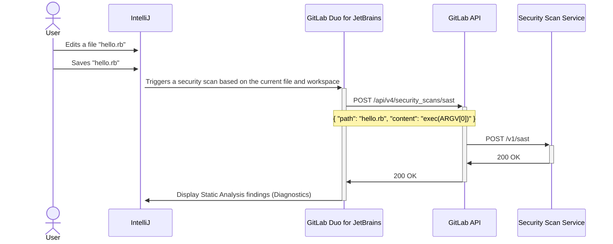

このページには今後予定されている製品・機能・機能性に関する情報が含まれています。ここに示す情報は参考目的のみです。購入・計画の決定にこの情報を使用しないでください。製品・機能・機能性の開発、リリース、タイミングは変更または延期される可能性があり、GitLab Inc. の独自の判断に委ねられています。

<table class="w-full text-sm border-collapse">
<thead>
<tr class="bg-gray-100 text-left">
<th class="px-3 py-2 border border-gray-300">Status</th>
<th class="px-3 py-2 border border-gray-300">Authors</th>
<th class="px-3 py-2 border border-gray-300">Coach</th>
<th class="px-3 py-2 border border-gray-300">DRIs</th>
<th class="px-3 py-2 border border-gray-300">Owning Stage</th>
<th class="px-3 py-2 border border-gray-300">Created</th>
</tr>
</thead>
<tbody>
<tr>
<td class="px-3 py-2 border border-gray-300">ongoing</td>
<td class="px-3 py-2 border border-gray-300"><a href="https://gitlab.com/erran" class="text-blue-600 hover:underline">@erran</a>, <a href="https://gitlab.com/jleasure" class="text-blue-600 hover:underline">@jleasure</a>, <a href="https://gitlab.com/julianthome" class="text-blue-600 hover:underline">@julianthome</a>, <a href="https://gitlab.com/theoretick" class="text-blue-600 hover:underline">@theoretick</a></td>
<td class="px-3 py-2 border border-gray-300"><a href="https://gitlab.com/theoretick" class="text-blue-600 hover:underline">@theoretick</a></td>
<td class="px-3 py-2 border border-gray-300"><a href="https://gitlab.com/connorgilbert" class="text-blue-600 hover:underline">@connorgilbert</a>, <a href="https://gitlab.com/dashaadu" class="text-blue-600 hover:underline">@dashaadu</a>, <a href="https://gitlab.com/tkopel" class="text-blue-600 hover:underline">@tkopel</a>, <a href="https://gitlab.com/kisha.mavryck" class="text-blue-600 hover:underline">@kisha.mavryck</a></td>
<td class="px-3 py-2 border border-gray-300">~devops::secure</td>
<td class="px-3 py-2 border border-gray-300">2024-06-21</td>
</tr>
</tbody>
</table>

## まとめ

開発者が[IDE から](https://gitlab.com/groups/gitlab-org/-/epics/10283) API ベースの静的解析セキュリティテスト（SAST）を実行できるようにサポートします。

## 動機

### 目標

**何を達成しようとしているのか?**

- GitLab Editor Extension を実行している Ultimate ユーザーに SAST 結果を提供する。

**成功をどのように判断するか?**

- 必要な接続性を持つユーザーが SAST ファインディングの診断を受け取る。

**他の定量化しにくい機会は?**

- IDE で将来的に非 SAST セキュリティスキャン結果がどのように表示されるかを定義する。
- 既存の SAST レポートから IDE 診断を入力する。

### 非目標

**このブループリントのスコープ外は何か?**

- オフラインユーザーがアナライザーをローカルで実行する方法を定義すること。

## 提案

現在の IDE ワークスペースに対してローカルと API ベースの両方のセキュリティスキャンを提供します。

メリット:

- GitLab Editor Extensions があるすべてのプラットフォームで SAST ファインディングをサポートします。
- スキャンサービス API は既存のローカル SAST レポートを使用するためにローカルサービスを通じて実装できます。
- オフラインユーザーはオフラインスキャンイメージまたはディストリビューションを使用できます。

デメリット:

- 新しいインフラをデプロイする必要があります。
- ユーザー、グループ、プロジェクトの設定に基づいてこの機能の表示/非表示を意図的に制御する必要があります。

## 決定事項

- [001: API ベースのセキュリティスキャンを提供する](decisions/001_provide_api-based_security_scans.md)

## 設計と実装の詳細

## リモートスキャン

## 代替ソリューション

### 何もしない

IDE での GitLab ユーザーの現在の体験は、コードをプッシュする前に個別に静的解析ツールをローカルで実行し、CI/CD パイプラインのセキュリティスキャン結果を待つ必要があるというものです。

### アナライザーをオフラインアナライザーとしてローカルで実行する

メリット:

- ローカルデータと実行によりパフォーマンスの最適化が容易になります
- 狭いユースケースにより、よりシンプルで密結合した設計が可能になります

デメリット:

- ルールの改善とバグ修正を配布する能力を制限するリリースサイクルとともに、バイナリディストリビューションのサポートを開始する必要があります
- 特に Mac OS では バイナリをコード署名する必要があります。
- インストールのためのドキュメントを提供する必要があります。
- インストールのためのツールを提供する必要があります。
