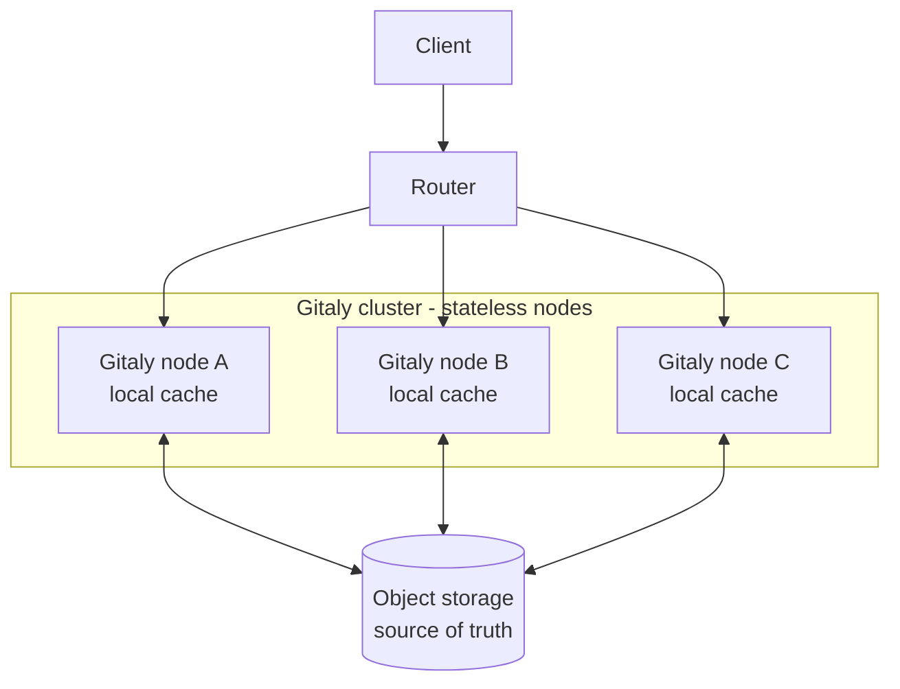
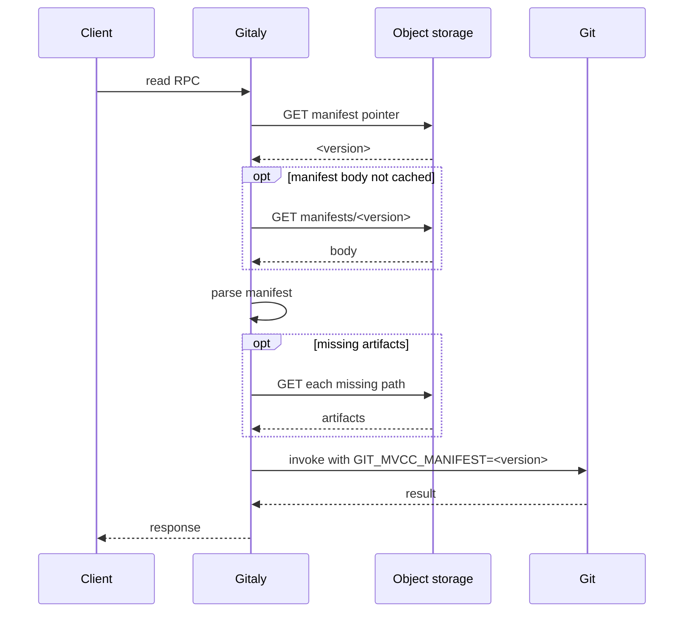
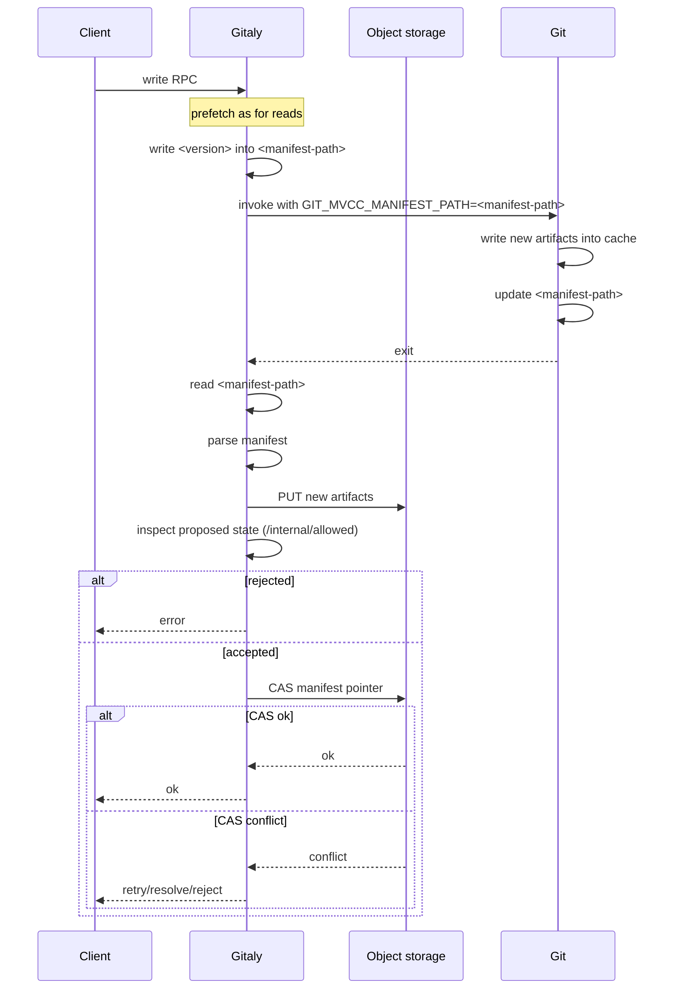



これは提案です。現在もイテレーション中であり、まだ確定した設計ではありません。

## 概要

Gitaly は、リポジトリの正式なコピーをサービス提供ノードのファイルシステムに保存します。そのため、コンピューティングとストレージが密結合しており、どちらの次元もスケーリングが困難です。

このブループリントでは、コンピューティングとストレージを分離し、両方のレイヤーを独立してスケーリングできる新しいアーキテクチャを提案します。

- **ストレージ**: オブジェクトストレージ（AWS S3、Google Cloud Storage、SeaweedFS など）をリポジトリデータの信頼できる唯一の情報源とします。
- **コンピューティング**: ステートレスな Gitaly ノードが、オブジェクトストレージから取得したアーティファクトのローカルキャッシュに対して Git を実行します。

この基盤となるのは、私たちが Git にアップストリームしてきた Git のプラガブルオブジェクトデータベース基盤です。この基盤により、参照およびオブジェクトのデータベース形式を私たちが管理し、Gitaly 固有のニーズに直接対応する専用のストレージ形式を作成できます。

この基盤をもとに、参照とオブジェクトを保存するための新しい多版型同時実行制御（MVCC）バックエンドを提案します。リポジトリの永続的な状態は、イミュータブルでコンテンツアドレス指定されたアーティファクトの集合です。イミュータブルなマニフェストは、現在どのアーティファクトがアクティブであるべきかを示します。現在アクティブなマニフェストは、ミュータブルなマニフェストポインターから参照されます。この設計では、一貫性のある読み取りとアトミックな更新が可能になり、同じリポジトリで実行される複数の Git プロセスが異なるバージョンを操作できます。

Gitaly はオーケストレーターです。アクティブなマニフェストで指定されたアーティファクトをローカルディスクに取得し、そのキャッシュに対して Git を実行し、新しいアーティファクトをオブジェクトストレージに公開したうえで、比較交換（CAS）によってポインターを進めます。

オブジェクトストレージが正式な状態を保持するため、キャッシュを満たした後はどのノードでも任意のリポジトリを提供でき、データを失うことなく必要に応じてノードを追加または破棄できます。ローカルディスクは実質的にキャッシュとしてのみ機能します。Gitaly ノードの前段にはオーケストレーションレイヤーが配置され、需要に応じてクラスターをスケーリングし、リクエストを効率的にルーティングします。

## 動機

現在、リポジトリのワークロードは単一ノードに拘束されています。リポジトリは 1 つのノードのファイルシステムに存在し、そのリポジトリへのすべてのリクエストはそのノードで処理されます。特定のリポジトリでより多くの負荷を処理する唯一の方法は、ノードのハードウェアをスケールアップすることです。しかし、垂直スケーラビリティには限界があり、最大規模のノードの一部ではすでにその限界に達しています。

そのため、私たちが提供する最も高コストな RPC の一部にかかるリソースコストによって、単一リポジトリで処理できるトラフィック量の上限が決まります。

- `gitlab-org/gitlab` のクローンに対する `git-pack-objects` は、約 4〜6 GB の匿名メモリを保持するため、CPU に関係なくノードごとの実行中クローン数が制限されます。
- ホットなリポジトリでの epoll 競合、ファイルディスクリプター不足、CPU 使用が、私たちのシステムで常にボトルネックを引き起こします。
- Slowloris 形式のクライアントは、レスポンスをゆっくり受信しながら `git-pack-objects` のメモリを保持します。
- 単一リポジトリに殺到する CI のフェッチによって、Gitaly は頻繁に機能不全に陥ります。

さらに、エージェント型ワークロードによる RPC 呼び出しが大幅に増加しており、今後さらに加速すると予想しています。リポジトリ単位の水平スケーラビリティがなければ、最もビジーなリポジトリの負荷は、どの単一ノードでも処理できる量を超えます。

したがって、リポジトリのワークロードをノードのクラスター全体で水平スケーリングできることが重要です。私たちは Praefect による読み取り分散でこの問題への対処を試みましたが、さまざまな問題により、その取り組みは水平スケーリング可能なクラスターを実現できず、実質的に失敗しました。

### 目標

- オブジェクトストレージをリポジトリデータの信頼できる唯一の情報源とします。
- Gitaly ノードをステートレスにします。ノードとそのディスクを失うとパフォーマンスは低下しますが（コールドキャッシュ）、データ損失や利用不能は発生しません。
- リポジトリの読み取りワークロードをノード全体で水平スケーリングします。
- 読み取りは、一貫性のある特定時点のスナップショットとして観測されます。
- 書き込みの公開はアトミックかつ分離され、マニフェストポインターに対するアトミックな比較交換によって直列化されます。
- ローカルワーキングセットのオーバーヘッドを小さく保ちます。ノードは特定のリポジトリに必要なアーティファクトだけを取得し、参照されなくなった古いデータをプルーニングします。

### 前提

- ほとんどのリポジトリは読み取り中心であり、読み取りのスケーリングは書き込みのスケーリングよりも緊急性が高いと想定します。そのため読み取りのスケーリングに重点を置きますが、この設計では複数のリーダーと複数のライターの両方が可能なので、書き込みスループットのボトルネックも移動できると考えています。
- リクエストごとのレイテンシーが多少増えても、スループットの向上には価値があります。キャッシュとキャッシュを考慮したルーティングによって、追加のレイテンシーを最小限に抑えます。
- オブジェクトストアは、単一キーのアトミックな書き込み、書き込み後読み取り整合性、および条件付き書き込みを提供します。

## 提案

このアーキテクチャでは、永続的なストレージ層をステートレスなコンピューティング層から分離し、クライアントとノードの間にルーティングレイヤーを配置します。



各リポジトリについて、オブジェクトストレージはすべてのアーティファクトとミュータブルなマニフェストポインターを信頼できる唯一の情報源として保持します。Gitaly ノードは、オブジェクトストレージから取り込んだローカルキャッシュディレクトリに対して Git を実行するステートレスなコンピューティングユニットであり、独自の正式な状態を保持しません。Git 自体はネットワーク I/O を行いません。ローカルファイルの読み書きだけを行い、Git から見えるファイルの集合はアクティブなマニフェストによって決まります。ノードの前段では、ルーターが各リクエストをノードに割り当て、対象リポジトリのウォームキャッシュをすでに保持しているノードを優先します。

## 設計と実装の詳細

### Git MVCC バックエンド

新しいストレージアーキテクチャの基盤は、参照とオブジェクト向けに専用設計されたストレージバックエンドです。このバックエンドには次の特性があります。

- 一貫性のある読み取りが可能です。
- 複数のリーダーが異なるバージョンのリポジトリを読み取れます
- アトミックな書き込みが可能です。
- 任意のスナップショットでリポジトリを読み取るために必要なすべてのファイルを明確に識別します。
- 完全に自己記述的であるため、マニフェストを使用して追加情報なしで完全な Git リポジトリをブートストラップできます。
- すべてのデータがコンテンツアドレス指定されるため、同時実行する 2 つのライターが互いに競合することはありません。

これらの特性を組み合わせることで、単一のマニフェストファイルから完全なリポジトリを構成できます。これにより、オーケストレーターは正式な状態をオブジェクトストレージに保持し、リポジトリの特定バージョンを提供するために必要なファイルだけをローカルキャッシュに取得し、別の特定バージョンに必要なファイルだけをアップロードできます。

#### ディレクトリレイアウト

すべてのアーティファクトは 1 つのキャッシュディレクトリ内に配置されます。単一のミュータブルな `manifest` ポインターを除き、すべてがイミュータブルでコンテンツアドレス指定されます。

```text
<commondir>/mvcc/
  manifest               mutable pointer (hash of the active manifest)
  manifests/<hash>       immutable manifest bodies
  pack/<hash>.pack       immutable packs
  pack/<hash>.idx
  pack/<hash>.rev
  refs/<hash>.ref        immutable reftables
```

ポインター以外はすべてコンテンツアドレス指定されるため、新しいファイルを既存ファイルと並べて安全に配置できます。同じアーティファクトを生成する 2 つのライターが衝突することはなく、中断された書き込みによって残されたファイルは参照されないだけなので、回収されるまで無害です。

#### マニフェスト形式

マニフェスト本体は、[`gitformat-chunk`](https://git-scm.com/docs/gitformat-chunk)フレームワークを基盤とするチャンクベースのバイナリファイルで、厳密に 1 つの一貫したスナップショットのアーティファクトを列挙します。ヘッダーには、`MVCC` シグネチャ、形式バージョン、チャンク数、`PATH` レコードの固定幅サイズ、リポジトリのオブジェクトハッシュアルゴリズム（SHA-1 または SHA-256）が格納されます。その後に 3 つのチャンクが続きます。

- `PATH` は、辞書順にソートされた固定幅で NUL 終端された相対パス（キャッシュディレクトリからの相対パス）のリストです。オーケストレーターがアーティファクトを取得およびアップロードするために使用する正規のアーティファクトリストです。
- `OBJS` は、オブジェクトストレージのアーティファクトを指定する `PATH` 内の `(start_index, count)` 範囲です。
- `REFS` は reftable スタック順の `PATH` インデックスのシーケンスで、同じ ref について後のテーブルが前のテーブルを上書きします。

本体の末尾に付く 32 バイトの SHA-256 は、解析時の破損検出を可能にするとともに、本体のコンテンツアドレス名として機能します。特定のスナップショットの依存関係を列挙するだけのコンシューマーは、`PATH` チャンクだけを読み取れば済みます。未知のチャンク ID は無視されるため、形式バージョンを上げたり Gitaly を変更したりせずに、将来新しい種類のアーティファクトを追加できます。

#### ピン留めとポインターの解決

Git は、次の固定された優先順位でアクティブなマニフェストを解決します。

1. `GIT_MVCC_MANIFEST` 環境変数により、呼び出し元は Git を特定のマニフェストバージョンにピン留めできます。これにより読み取り専用のスナップショットとなり、アーティファクトを書き込もうとすると Git は中止します。
2. `GIT_MVCC_MANIFEST_PATH` 環境変数により、呼び出し元は指定されたパスにあるマニフェストを読み取り、更新するよう Git に指示できます。
3. ほかのオーバーライドがアクティブでない場合は、リポジトリ自身の `<commondir>/mvcc/manifest` ポインターを使用します。

`GIT_MVCC_MANIFEST=<sha>` を設定すると、読み取りに対するすべてのディスク上のポインターがオーバーライドされ、プロセスの存続期間中はハンドルが読み取り専用になります。これにより、どのプロセスも一貫性のある特定時点のビューを取得できます。

書き込みの分離は、`GIT_MVCC_MANIFEST_PATH` をエクスポートし、複数の異なる一時マニフェストを使用することで実現できます。この環境変数は、一時マニフェストを使用するよう Git に指示します。これにより、Git は一時マニフェストを現在のマニフェストバージョンの信頼できる唯一の情報源として使用し、新しいデータを書き込む際は新しいマニフェストバージョンをそのパスに公開します。この仕組みにより、Gitaly は複数のライターを互いに分離し、未公開の状態が実行中のほかのプロセスから見えないようにできます。

Git が実行するフックには `GIT_MVCC_MANIFEST` 環境変数が設定されるため、親プロセスと同じマニフェストバージョンが見えます。これにより、子プロセスがデータを書き込めないことも保証されます。

最終的に、正式な信頼できる唯一の情報源がオブジェクトストレージに置かれた後は、Gitaly が `<commondir>/mvcc/manifest` を使用することはなくなります。代わりに、常に GET リクエストでバージョンを解決し、`GIT_MVCC_MANIFEST` を介してエクスポートするか、`GIT_MVCC_MANIFEST_PATH` に書き込むことが想定されます。

`GIT_MVCC_MANIFEST` と `GIT_MVCC_MANIFEST_PATH` のどちらも設定されていない場合、Git は `<commondir>/mvcc/manifest` のポインターを使用します。

#### スコープ

このバックエンド自体はネットワーク I/O を行いません。アクティブなマニフェストで指定されたすべてのオブジェクトがローカルに存在する必要があり、アーティファクトの欠落は取得のトリガーではなく重大なエラーになります。次に説明するように、オブジェクトストレージとのすべての通信はオーケストレーターの責任です。

### 信頼できる唯一の情報源としてのオブジェクトストレージ

各リポジトリについて、オブジェクトストレージは完全なアーティファクトセットと永続的なマニフェストポインターキーを保持します。Gitaly は各 RPC の開始時にこの永続的なポインターを解決し、ローカルキャッシュのポインターを正式なものとして扱うことはありません。

オブジェクトストレージプロバイダーには、いくつかの要件があります。

- 書き込み後読み取り整合性を備えた単一キーの PUT をサポートする必要があります。
- ポインターキーの条件付き更新をサポートする必要があります。
- ハウスキーピングを安全に行うため、条件付き削除をサポートする必要があります。
- オブジェクトの ETag 更新をサポートする必要があります。

解決されたマニフェストのすべての依存関係を Git の起動前に取得することは、オーケストレーターの責任です。さらに、アクティブ化されようとしている新しいマニフェストに必要なすべての依存関係をアップロードすることも、オーケストレーターの責任です。

### 読み取り RPC のライフサイクル

`GetCommit` や `FindRefs` などの読み取り RPC には一貫性のあるスナップショットが必要ですが、新しい状態は生成しません。



Gitaly は、`PATH` チャンクだけを通じて MVCC スナップショットに必要な依存関係を列挙し、ほかのチャンクを解釈する必要はありません。アーティファクトはイミュータブルでコンテンツアドレス指定されるため、プリフェッチは冪等です。`GIT_MVCC_MANIFEST` でピン留めすることで、ほかのライターがリポジトリを進めている最中でも、単一の RPC 内で起動されたすべての Git プロセスが同じ状態を観測できます。外部ポインターファイルは作成されず、読み取りによってキャッシュポインターが進むこともありません。

{}
同時実行するライターがいるときに不整合な読み取りを観測できないようにするには、各 RPC 呼び出しでマニフェストポインターを厳密に 1 回だけ特定のバージョンに解決し、すべての Git プロセスがその正確なバージョンを継承することが重要です。
{}

キャッシュがまだウォームアップされていない場合、欠落しているアーティファクトの取得に長い時間がかかる可能性があります。これは次の 2 つの仕組みで軽減します。

- ルーティングレイヤーは、ウォームキャッシュを持つノードにリクエストがルーティングされるようにする必要があります。
- リポジトリのハウスキーピングは、変化するデータ量に上限を設けられるよう、アーティファクトを不必要に書き換えないようにする必要があります。

### 書き込み RPC のライフサイクル

`UserCommitFiles` や `PostReceivePack` などの書き込み RPC は、永続化する必要のある新しい状態を生成します。



Gitaly はまず、読み取り専用 RPC と同じ方法でマニフェストを解決します。ただし、`GIT_MVCC_MANIFEST` でバージョンをピン留めする代わりに、解決したマニフェストバージョンを一時的なマニフェストパスへ書き込み、`GIT_MVCC_MANIFEST_PATH` を指定して Git を呼び出します。これにより、すべての更新が自己完結し、同時実行する書き込みに影響しません。

Git の処理が完了したら、Gitaly は新しい状態を検査しなければならない場合があります。検査の一部として Rails の `/internal/allowed` チェックを呼び出し、新しい状態に対して一連の読み取りを実行することがあります。これらの読み取りをノード間で分散できるようにするには、Gitaly は正式で永続的なマニフェストポインターを更新する前に、アーティファクトをオブジェクトストレージへアップロードする必要があります。このバージョンに対する後続のチェックでは、提案された新しいバージョンを指すように `GIT_MVCC_MANIFEST` を伝播する必要があります。

ここではトレードオフがあることに注意してください。

- アクセスチェック自体が高コストになる可能性があるため、ノード間に分散することでスループットが高くなる可能性があります。
- 読み取りを分散すると、ほかのノードが新しいアーティファクトを取得する必要があります。

アクセスチェック中の読み取り分散は、後続の読み取りを書き込みノードにピン留めして制限することが望ましい可能性があります。

{}
読み取り専用 RPC と同様に、マニフェストバージョンは厳密に 1 回だけ解決するものとします。それ以降は、変更を行う RPC 内の後続のすべての Git プロセスにおいて、一時マニフェストをマニフェストバージョンの信頼できる唯一の情報源とします。

さらに、正式なマニフェストポインターの更新は、_最大 1 回_にしなければなりません。そうしないと、変更を行う RPC で不整合な書き込みが発生する可能性があります。
{}

新しい状態が受け入れられ、アーティファクトがアップロードされると、Gitaly はマニフェストポインターに対して比較交換操作を実行します。複数のライターが存在できるため、この操作は競合によって失敗する可能性があります。その場合は次の 2 つのシナリオがあります。

- 1 つの参照を異なるバージョンへ更新しようとするため、論理的な競合が発生する場合があります。この場合は拒否され、更新は行われません。
- マニフェストポインターは変更されたものの、どの更新も競合しておらず、性質上の競合にすぎない場合があります。この場合、Gitaly は変更された参照を 3 ウェイマージして競合の解決を試みます。
