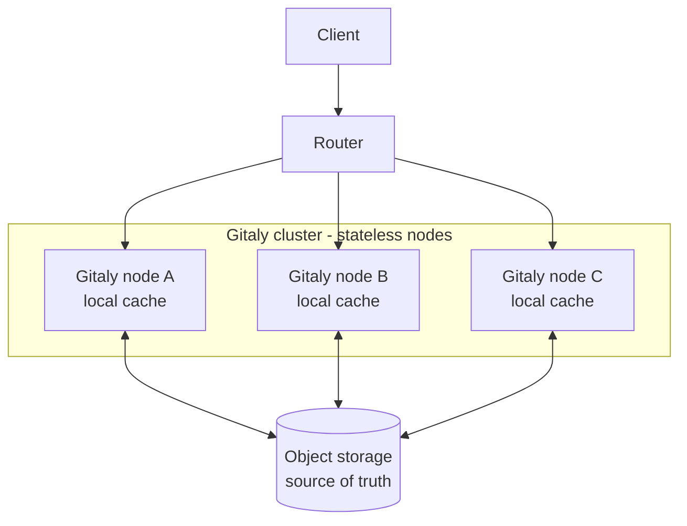
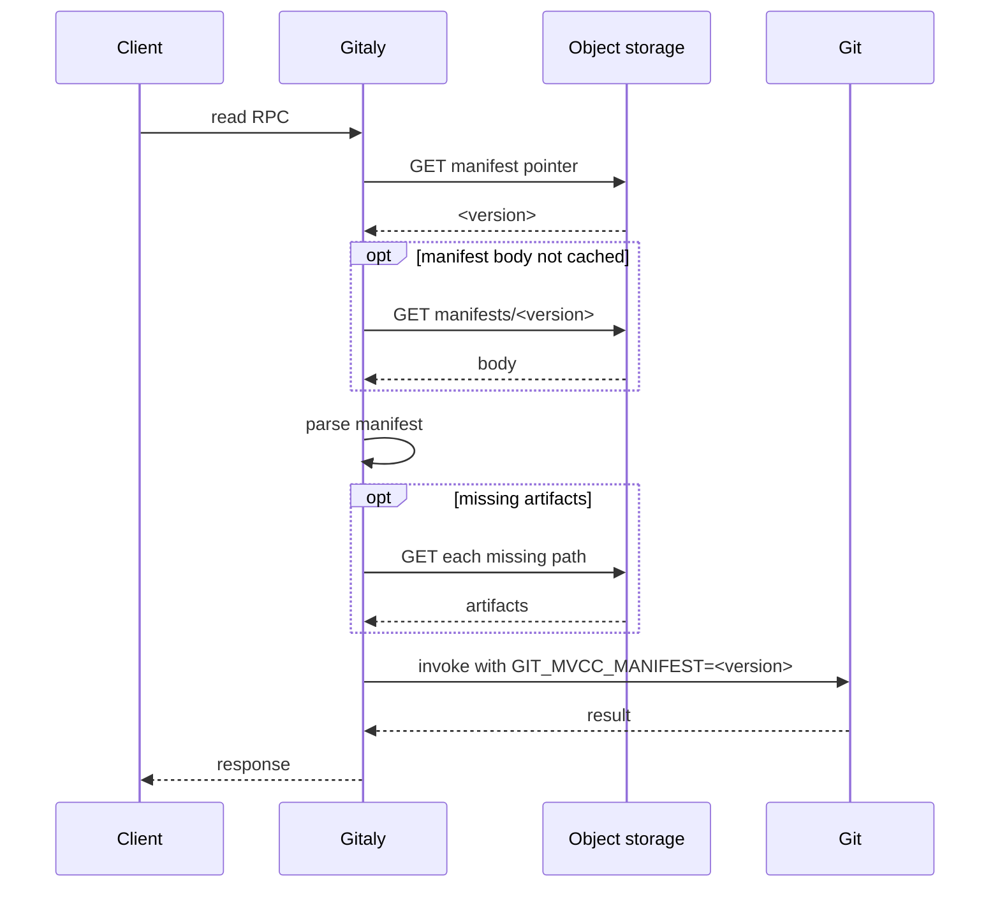
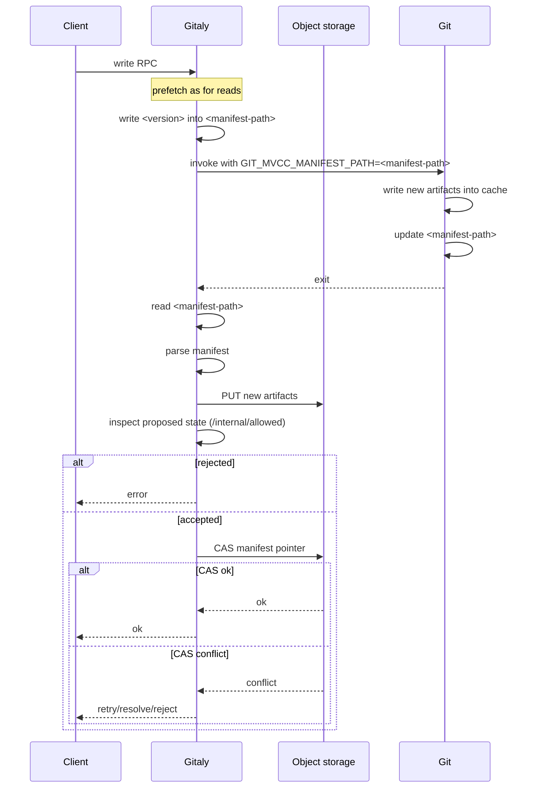
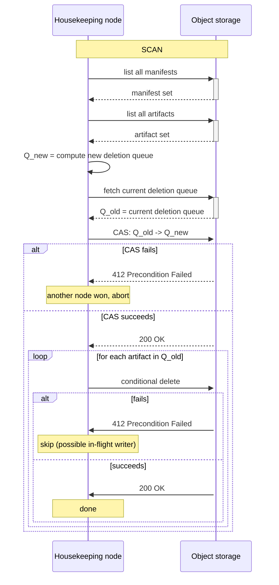
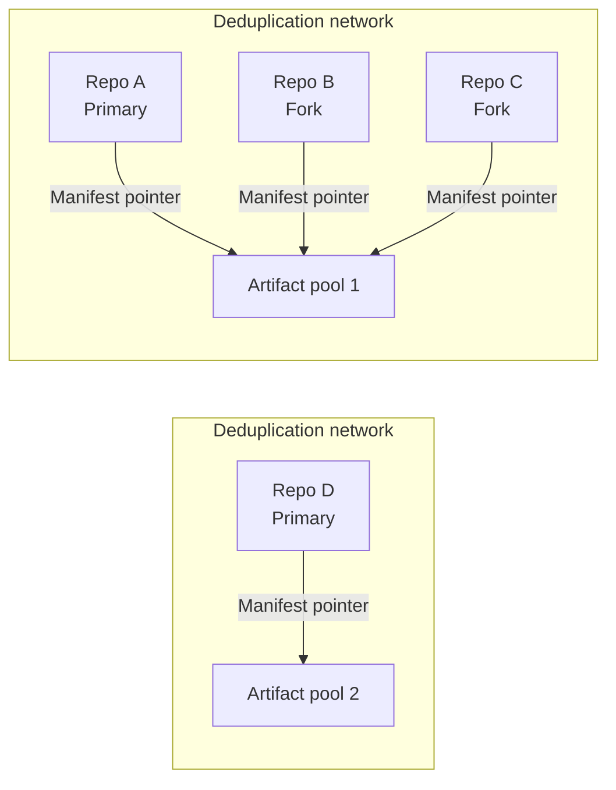



これは提案です。現在イテレーション中であり、まだ committed design ではありません。

## 概要

Gitaly は、リポジトリの authoritative copy を serving nodes のファイルシステムに保存します。そのため、コンピュートとストレージは互いに強く結合しており、どちらの次元もスケールしにくくなっています。

このブループリントは、両方の layer を独立してスケールできるように、コンピュートをストレージから分離する新しいアーキテクチャを提案します:

- **ストレージ**: object storage（例: AWS S3、Google Cloud Storage、SeaweedFS）をリポジトリデータの単一の信頼できる情報源にします。
- **コンピュート**: stateless な Gitaly nodes が、object storage から取得した artifacts の local cache に対して Git を実行します。

この基盤となるのは、私たちが Git に upstreaming してきた Git の pluggable object database infrastructure です。この基盤により、reference database と object database の形式を私たちが所有し、Gitaly の特別な needs に直接対応する custom-tailored な storage format を作成できます。

この基盤に基づき、references と objects を保存する新しい multi-version concurrency control (MVCC) backend を提案します。リポジトリの persistent state は、immutable かつ content-addressed な artifacts の集合です。immutable manifest は、これらの artifacts のうち現在 active であるべきものを示します。現在 active な manifest は、mutable manifest pointer から参照されます。この設計により、consistent reads と atomic updates が可能になり、同じリポジトリ内で実行される複数の Git processes が、そのリポジトリの異なる version に対して動作できます。

Gitaly は orchestrator です。active manifest が指す artifacts を local disk に pull し、その cache に対して Git を実行し、新しい artifacts を object storage に publish し、compare-and-swap (CAS) で pointer を進めます。

object storage が authoritative state を保持するため、どのノードでもキャッシュが埋まった後に任意のリポジトリを提供できます。また、データ損失なしで、需要に応じてノードを追加したり破棄したりできます。local disk は実質的に cache としてのみ機能します。Gitaly nodes の前段には orchestrating layer が置かれ、demand に応じた cluster の scale と、効率的な request routing を担います。

## 動機

現在、リポジトリの workload は単一 node に bind されています。リポジトリは 1 つの node のファイルシステム上に存在し、そのリポジトリへのすべての request はそこで serve されます。特定リポジトリの load をより多く処理する唯一の方法は、node の hardware を scale up することです。しかし vertical scalability には限界があり、私たちの最大級の nodes の一部ではすでにその限界に達しています。

そのため、私たちが serve する最も高コストな RPC の一部について、resource costs が、単一リポジトリに対して処理できる traffic 量の上限を作っています:

- `git-pack-objects` は `gitlab-org/gitlab` clone で約 4〜6 GB の anonymous memory を保持し、CPU に関係なく node あたりの in-flight clones を制限します。
- epoll contention、file-descriptor starvation、hot repositories 上の CPU が、私たちの system で定期的に bottleneck を作っています。
- Slowloris-style clients は response をゆっくり drain しながら `git-pack-objects` memory を保持します。
- 単一リポジトリに対する stampeding CI fetches は、しばしば Gitaly を膝から崩します。

加えて、agentic workloads による RPC calls が大きく増えており、今後さらに加速すると予想しています。per-repository horizontal scalability がなければ、最も busy な repositories は、どの単一 node でも serve できる量を超えます。

したがって、リポジトリの workload を node cluster 全体へ水平スケーリングできることが重要です。Praefect による read distribution でこの問題に対処しようとしましたが、その取り組みはさまざまな issue により、水平スケール可能な cluster を実質的に生み出せませんでした。

### 目標

- Object storage をリポジトリデータの単一の信頼できる情報源にする。
- Gitaly nodes は stateless である: node（とその disk）を失うと performance は degrade する（cold cache）が、data loss や unavailability は発生しない。
- リポジトリの read workload は nodes 全体で水平に scale する。
- Reads は consistent な point-in-time snapshot として observed される。
- write の publishing は atomic かつ isolated であり、manifest pointer 上の atomic compare-and-swap によって serialized される。
- local working set の overhead は小さく保つ: node は特定リポジトリに必要な artifacts だけを fetch し、参照されなくなった old data を prune する。

### 前提

- ほとんどの repositories は read-mostly です。writes の scaling より reads の scaling のほうが緊急です。そのため read-scaling に focus しますが、この設計は multiple readers と multiple writers の両方を許容するため、write throughput の bottleneck も移動できると見込んでいます。
- Higher throughput は、request ごとの latency が多少増える価値があります。Caching と cache-aware routing により、追加 latency を最小化します。
- object store は atomic single-key writes、read-after-write consistency、conditional writes を提供します。

## 提案

このアーキテクチャは durable storage tier を stateless compute tier から分離し、client と nodes の間に routing layer を置きます。



各リポジトリについて、object storage はすべての artifact と mutable manifest pointer を単一の信頼できる情報源として保持します。Gitaly node は stateless compute unit であり、object storage から populate された local cache directory に対して Git を実行し、それ自身の authoritative state を持ちません。Git 自体は network I/O を行いません。local files の読み書きだけを行い、Git から見える files の集合は active manifest によって決まります。nodes の前段では、router が各 request を node に map し、target repository の warm cache をすでに持つ node を優先します。

## 設計と実装の詳細

### Git MVCC バックエンド

新しい storage architecture の基盤は、references と objects のための custom-tailored storage backend です。この backend は次の properties を持ちます:

- consistent reads を可能にする。
- 複数の readers が異なる versions でリポジトリを read できる。
- atomic writes を可能にする。
- 任意の snapshot でリポジトリを read するために必要なすべての files を明確に識別する。
- 完全に self-describing であり、追加情報なしで manifest から full Git repository を bootstrap できる。
- すべての data が content-addressable であるため、2 つの concurrent writers が互いに conflict しない。

これらを合わせると、単一の manifest file から complete repository を assemble できます。これにより orchestrator は authoritative state を object storage に保持し、リポジトリの特定 version を serve するために必要な files だけを local cache に pull し、別の特定 version に必要な files だけを upload できます。

#### ディレクトリレイアウト

すべての artifacts は 1 つの cache directory 配下に存在します。単一の mutable な `manifest` pointer を除くすべては immutable かつ content-addressed です:

```text
<commondir>/mvcc/
  manifest               mutable pointer (hash of the active manifest)
  manifests/<hash>       immutable manifest bodies
  pack/<hash>.pack       immutable packs
  pack/<hash>.idx
  pack/<hash>.rev
  refs/<hash>.ref        immutable reftables
```

pointer 以外のすべてが content-addressed であるため、新しい files は既存のものと並んで安全に配置できます。同じ artifact を生成する 2 つの writers は collide できず、aborted write によって残された files は、reclaimed されるまで単に unreferenced で harmless です。

#### マニフェスト形式

manifest body は [`gitformat-chunk`](https://git-scm.com/docs/gitformat-chunk) framework の上に構築された chunk-based binary file であり、exactly one consistent snapshot の artifacts を列挙します。header は `MVCC` signature、format version、chunk count、`PATH` record の fixed-width size、そして repository の object hash algorithm（SHA-1 または SHA-256）を持ちます。3 つの chunks が続きます:

- `PATH` は fixed-width、NUL-terminated の relative paths（cache directory からの相対）の lexicographically sorted list です。orchestrator が artifacts を fetch/upload するために使う canonical artifact list です。
- `OBJS` は object-storage artifacts を指す `PATH` への `(start_index, count)` range です。
- `REFS` は reftable stack order の `PATH` indices の sequence で、later tables が同じ ref の earlier ones を shadow します。

body 末尾の 32-byte SHA-256 は parse-time corruption detection を提供すると同時に、body の content-addressed name として機能します。任意の snapshot の dependencies を列挙するだけでよい consumer は、`PATH` chunk だけを読めば済みます。unknown chunk IDs は ignored されるため、future artifact kind を format-version bump や Gitaly の変更なしに追加できます。

#### ピンニングとポインター解決

Git は fixed precedence で active manifest を resolve します:

1. `GIT_MVCC_MANIFEST` environment variable により、caller は Git を特定の manifest version に pin できます。これは read-only snapshot となり、artifact を write しようとすると Git は abort します。
2. `GIT_MVCC_MANIFEST_PATH` environment variable により、caller は指定 path にある manifest を read/update するよう Git に指示できます。
3. 他の override が active でない場合、repository 自身の `<commondir>/mvcc/manifest` pointer が使われます。

`GIT_MVCC_MANIFEST=<sha>` を設定すると、reads に対してすべての on-disk pointer を override し、process lifetime の間 handle を read-only にします。これにより、任意の process が consistent point-in-time view を取得します。

writes を isolate するには、`GIT_MVCC_MANIFEST_PATH` を export し、複数の異なる temporary manifests を持たせます。この environment variable は Git に temporary manifest を使うよう指示し、それを current manifest version の信頼できる情報源として使わせ、新しい data を write するときには新しい manifest version をその path に publish させます。これにより Gitaly は複数の writers を互いに isolate し、unpublished state が他の in-flight processes に見えないようにできます。

Git によって実行される hooks には `GIT_MVCC_MANIFEST` environment が設定されるため、parent process と同じ manifest version を見ます。これにより child processes が data を write できないことも保証されます。

最終的に canonical source of truth が object storage に置かれると、Gitaly は `<commondir>/mvcc/manifest` を二度と使わなくなる点に注意してください。代わりに、GET request で常に version を resolve し、それを `GIT_MVCC_MANIFEST` 経由で export するか、`GIT_MVCC_MANIFEST_PATH` に書き込むことが期待されます。

`GIT_MVCC_MANIFEST` と `GIT_MVCC_MANIFEST_PATH` のどちらも設定されていない場合、Git は `<commondir>/mvcc/manifest` の pointer を使います。

#### スコープ

backend はそれ自身では network I/O を行いません。active manifest が指すすべての object は local に存在していなければならず、missing artifact は fetch の trigger ではなく hard error です。object storage とのすべての communication は、次に説明する orchestrator の責任です。

### 信頼できる唯一の情報源としてのオブジェクトストレージ

各リポジトリについて、object storage は full artifact set と durable manifest-pointer key を保持します。Gitaly は各 RPC の開始時にこの durable pointer を resolve し、local cache pointer を authoritative として扱うことはありません。

object storage provider に対する requirements はいくつかあります:

- read-after-write consistency を持つ single-key PUTs を support すること。
- pointer key の conditional updates を support すること。
- housekeeping を safe にするための conditional deletes を support すること。
- objects の ETags 更新を support すること。

resolved manifest のすべての dependencies を Git の spawn 前に fetch することは orchestrator の責任です。さらに、activate されようとしている new manifest に必要なすべての dependencies を upload することも orchestrator の責任です。

### 読み取り RPC のライフサイクル

`GetCommit` や `FindRefs` などの read RPCs は consistent snapshot を必要としますが、新しい state は生成しません。



Gitaly は `PATH` chunk だけを通じて MVCC snapshot に必要な dependencies を列挙し、他の chunks を interpret する必要はありません。artifacts は immutable かつ content-addressed なので、prefetching は idempotent です。`GIT_MVCC_MANIFEST` による pinning により、他の writers が repository を advance している間でも、単一 RPC 内で spawn されたすべての Git process が同じ state を observe することを保証します。external pointer file は作成されず、reads が cache pointer を advance することはありません。

{}
任意の RPC call について manifest pointer を特定 version に resolve するのは exactly once であること、そしてすべての Git processes がその exact version を inherit することが重要です。これにより concurrent writers が存在するときに torn reads を observe できないようにします。
{}

missing artifacts の fetch は、cache がまだ warm になっていない場合、潜在的に長時間かかる可能性があることに注意してください。これは 2 つの mechanisms によって緩和します:

- routing layer は、warm cache を持つ nodes に requests が routed されるようにする必要があります。
- repository housekeeping は、changing data の量に upper bound があるように、artifacts を不必要に rewrite しないことを保証する必要があります。

### 書き込み RPC のライフサイクル

`UserCommitFiles` や `PostReceivePack` などの write RPCs は、durable になる必要がある new state を生成します。



Gitaly はまず、read-only RPCs と同じ方法で manifest を resolve します。ただし、`GIT_MVCC_MANIFEST` によって version を pin するのではなく、resolved manifest version を temporary manifest path に書き込み、`GIT_MVCC_MANIFEST_PATH` で Git を invoke します。これにより、すべての updates は self-contained になり、concurrent writes に影響しません。

Git が完了した後、Gitaly は new state を inspect しなければならない場合があります。inspection の一部では、Rails の `/internal/allowed` checks に reach out する可能性があり、それにより new state に対する reads の set が実行されます。これらの reads を nodes 全体へ distribute できるようにするには、canonical かつ persistent な manifest pointer を update する前に、Gitaly が artifacts を object storage にすでに upload している必要があります。この version に対する subsequent checks は、proposed new version を指すように `GIT_MVCC_MANIFEST` を propagate するべきです。

ここには tradeoff がある点に注意してください:

- access checks はそれ自体が expensive な場合があるため、それらを nodes 全体へ distribute すると potentially-higher throughput を確保できます。
- reads の distribution には、必然的に other nodes が new artifacts を fetch することが必要になります。

potentially、access checks 中の read distribution は、subsequent reads を writing node に pin することで restrict したくなるでしょう。

{}
read-only RPCs と同様に、manifest version は exactly once だけ resolve されるものとします。以降、temporary manifest が、mutating RPC 内の subsequent Git processes すべてにとって manifest version の単一の信頼できる情報源になります。

さらに、canonical manifest pointer は _at most once_ だけ update されなければなりません。そうしないと、mutating RPC が torn writes を引き起こす可能性があります。
{}

new state が accepted され、artifacts が upload されたら、Gitaly は manifest pointer の compare-and-swap operation を実行します。multiple writers が存在しうるため、この operation は conflict により fail する可能性があります。その場合、2 つの scenarios があります:

- 1 つの reference が異なる versions に update されようとしているため、logical conflict が発生する場合があります。これは reject となり、update は行われません。
- manifest pointer が changed されただけで、updates のどれも conflicting ではないという性質だけの conflict の場合があります。この場合、Gitaly は changed references の three-way merge を行って conflict を resolve しようとします。

three-way merge は、関連する 3 つの manifests を取ることで実行できます:

- Base。Gitaly が最初に temporary manifest pointer に書き込んだものです。
- Ours。mutating RPC によって computed された proposed update で、すべての writing Git commands が完了した後に temporary manifest pointer を一度読むことで derive できます。
- Theirs。canonical manifest pointer が指している current version で、concurrent writer によって advanced されたものです。

merge は、これら 3 つの異なる versions 間で changed された references を read し、それらを merge します。いずれかの reference が conflicting update を受けていれば logical conflict があり、write を reject します。そうでなく、複数回 write された reference がなければ accept できます。

objects については three-way merge が不要である点に注意してください。代わりに、conflict-free として扱い、常にそれらの union を取れます。

### リポジトリの housekeeping

この設計では、すべての single write で new packfiles と reftables が発生します。manifest が参照する files の数を制限し、fast data lookup を確保し、object deltification の良い機会を持つために、regular compaction を実行する必要があります。

この compaction は 2 つの needs のバランスを取る必要があります:

- fast lookups を保つため、files をできるだけ少なくしたい。
- other nodes で頻繁な cache miss が起きないように、files を定期的に rewrite することは避けたい。

この need は、packfiles の maximum size を持つ geometric compaction によって balance されます。特定の size threshold より小さいすべての files は、その size について geometric sequence を形成する必要があります。その property が成り立たない場合、それを restore するために可能な限り多くの files を repack します。file が size threshold に達したら、それ以上 repack しません。

frozen packfiles は重要な property も保証します。repository の cache が manifest A で warm になっていて、manifest B で snapshotted read を行い、B が A より古い場合、私たちは次を知っています:

- B に存在する任意の frozen pack は A にも存在する。
- すべての non-frozen packs が geometric sequence を形成することを知っている。
- geometric sequence の size は最大で $\frac{T r}{r - 1}$ である。ここで $T$ は threshold、$r$ は geometric sequence の ratio。

parameters を scale することで、fetch しなければならない data の upper bound を制限できます。threshold が 1GB、ratio が 2 の場合、fetch しなければならない data の upper bound は 2GB になります。

これは、unreachable objects を default ではもう delete しないことを前提としている点に注意してください。これはほとんどの repositories で acceptable と見込まれます。

### ガベージコレクション

MVCC backend はすべての modification で new artifacts を作成します。その結果、unreferenced artifacts は local disk と object storage の両方に時間とともに accumulate します。storage growth を control するため、これらの両方を regular に cleanup しなければなりません。

on-node data は cache としてのみ機能するため、local cleanups を eager に実行しても safe です。object storage の cleanup logic は、concurrent readers and writers に対して race-free な方法で実装する必要があります。

この system には 2 種類の garbage collection があります:

- old manifests の pruning は configurable であるべきです。これにより、例えば特定期間の point-in-time restores をいくつか保持できるため、specific policy の対象であるべきです。
- unreferenced artifacts の pruning は policy-based である必要はありません。

以下では、unreferenced artifacts の race-free deletion だけを考えます。これを実現するため、2-generation deletion queue を使います。



node が pruning を実行すると決めたら、available な manifest files をすべて scan し、existing artifacts をすべて list します。pruning の eligible candidates は、existing artifacts の list から、任意の manifest が参照している artifacts の list を取り除くことで computed されます。さらに、各 artifact の mtime が current time minus a given threshold より小さいことを check します。その結果が、pruning の eligible candidates の set です。

node は、その candidates の set から new deletion queue を作成します。queue には次が含まれます:

- delete されるべき artifacts の names。
- conditional delete に使える、これらの artifact それぞれの ETag。

node は current deletion queue を download し、新しい candidates list で update するために compare-and-swap operation を実行します。成功した場合、node は downloaded queue から pending deletions の list を verify します。各 entry について、deletion queue に保存された ETag を使ってその artifact の conditional delete を実行します。

writer が、以前はその manifest が reference していなかったが object storage にはすでに存在している artifact を reference し始める場合、他の manifest が参照していない場合に concurrent deletion されないよう、object storage 内の object の ETag を update しなければなりません。concurrent deletion により ETag update が fail した場合、writer は artifact を re-upload しなければなりません。

housekeeping run が swap の前、途中、後のどこで crash しても harmless です。future re-run が prune すべき candidates の set を再度 derive するためです。

### 重複排除ネットワーク

リポジトリが fork されると、upstream repository の identical copy として始まる新しい repository が作成されます。fork が upstream から diverge しても、通常は repositories 間で shared のまま残る common base history があります。この関係を知っていれば、fork と upstream repository の両方に存在する objects を deduplicate して overall storage footprint を reduce することが望ましいです。これは agentic workloads でよく見られる heavy fork-based workflows にとって crucial です。

現在のアーキテクチャでは、Gitaly は object pool repositories によって object deduplication を実現しています。object pool は、関連する他の repositories と共有することを意図した object set を含む separate Git repository です。これらの shared objects に依存する repositories は、Git alternates mechanism を通じて object pool に link します。

MVCC design では、各 Git repository は current MVCC artifacts（reftables、packfiles、manifest）を定義する manifest pointer を持ちます。repository の manifest pointer で指定された manifest は、Git がその repository の isolated snapshot/view を construct することを実質的に可能にします。related histories を持つ repositories（upstream とその forks）を associate することで、shared pool of MVCC artifacts を使って MVCC artifacts を deduplicate できるようになります。これは MVCC artifacts が content addressable かつ immutable であるため機能します。MVCC artifact pool を共有する repositories の set を deduplication network と呼びます。



new repository の作成では repo を新しい deduplication network に set up し、fork repository の作成では repo を existing deduplication network に join させる点に注意してください。これを機能させるには、individual repository が、自身が fetch する MVCC artifact pool と manifest pointer の両方を知る必要があります。この情報は、repository key と pool/manifest location の key-value mapping として保存できます。clustered setup では、同じ artifact pool を使う repositories は、local cache 内の artifact deduplication を enable し cold cache hits を reduce するため、おそらく同じ Gitaly node に route されたいでしょう。

artifact level の deduplication を effective にするには、artifacts がある時点で stable と見なされる必要があります。例えば repository housekeeping は、より compact にするために MVCC artifacts を rewrite することがあり、その結果、deduplication network 内の repositories 間で共通ではなくなった new distinct artifacts を produce します。packfile artifacts については、その size に upper limit を設定することで repacks を prevent できます。これにより "large" packfiles は repository writes をまたいで consistent のまま残り、deduplication network 内の repositories に再利用されます。これは、size limit 未満の packfile artifacts は repository histories の evolution に伴って deduplicated のまま残る可能性が低いことも意味します。また、deduplicate できる packfile artifacts の set は、time-of-fork で一度決まります。

reftable と manifest artifacts は、理論上は同じ pool に存在するため deduplicate できますが、実際には repository histories の evolution に伴って stable のまま残る可能性が低く、そのため deduplication network 内の repositories 間で commonly shared されることは少ない点に注意してください。

### ルーティングとクラスタリング

作業中

## 移行

プロジェクト全体を land させるには大きな effort が必要になります。system の異なる properties をできるだけ速く test できるように、この project を複数の stages に分割します:

1. MVCC references migration
2. MVCC objects migration
3. Object storage migration
4. Clustering

これらの各 stage は overall design の小さな部分を rollout し、そのほとんどがすでに customer に value を提供します。これにより fast time to production を確保し、design issues を早期に surface でき、project failure の risk を reduce します。

### ステージ 1: MVCC references の移行

最初の stage では、references のみについて MVCC backend を rollout します。これには Git 内の MVCC reference backend と、Gitaly 側で reads and writes を handle する logic が必要です。

この phase を objects migration から分離する benefit は、すでに migration path があり、reference backend が Git 内ですでに fully pluggable であることです。そのため、pluggable object databases の infrastructure がまだ finalized されている途中でも rollout でき、Gitaly 内の MVCC logic handling の verification を開始できます。

この phase は、Git の references を保存する backend として reftables へ migrate するという benefit を提供します。これは references deletion 時の long-standing scalability issue を解決します。ただし、それ以外で customers への benefit は limited です。そのため、私たちはこれを staging environment の repositories と、production-facing repositories の selection にのみ rollout すると想定しています。

### ステージ 2: MVCC objects の移行

2 番目の stage では、objects の MVCC backend を rollout し、references と objects の両方が MVCC に backed されるようにします。これには、pluggable object interfaces が Gitaly の needs に対応できる状態になっていることと、Git 内の MVCC object backend が必要です。Gitaly 側で reads and writes を handle する logic は、最初の stage ですでに実装済みになります。

この stage により、repositories は object storage に必要な exact layout を持つようになりますが、すべての data はまだ local disk 上にあります。これで Git 側に必要なすべての changes が完了します。

この phase は次の benefits を提供します:

- すべての reads は完全に consistent で、concurrent writers の影響を受けない。
- Writers は atomic である。
- 特定の points in time で snapshotted reads を行う ability を持つ。

この stage は object storage への smooth migration の prerequisite です。そのため、最終的にはすべての repositories をこの backend へ migrate すると見込んでいます。

さらに、この stage は non-enterprise customers 向けの final stage になります。

### ステージ 3: オブジェクトストレージへの移行

3 番目の stage では、repository data の source of truth を local disk から object storage に migrate します。本質的には、すべての repository が 1 つの Gitaly node の cluster によって hosted されることを意味します。

この phase は次の benefits を提供します:

- Globally consistent backups を object storage 経由で実行できるようになる。
- local disks から repository data を prune し始められ、storage costs を reduce できる。
- 単一の信頼できる情報源が object storage にあるため、任意の Gitaly node で任意の repository を trivial に serve できる。

GitLab.com 全体をこの stage に migrate すると expected されています。この migration は enterprise customers に対してのみ実行されます。

### ステージ 4: クラスタリング

4 番目の stage では、cluster management capabilities を Gitaly に導入します。これには intelligent routing と、load に応じて cluster を自動的に scale up/down する ability が含まれます。

この phase は次の benefits を提供します:

- 特定リポジトリの load に基づいて dynamic に scale up/down できる。

## 代替案

### Praefect

Praefect はすでに reads distribution を提供しています。しかし残念ながら、Praefect は実運用で operate しにくいことが証明されています:

- Postgres の使用により複数の sources of truth が生じ、backup が難しくなります。
- Transactional voting は実運用で unreliable であることが証明されています。
- Writes はすべての nodes で同時に発生する必要があります。そのため、特定リポジトリを serve する nodes の数が増えるほど、nodes の subset が fail する可能性が高くなります。
- failure mode は、concurrent writes に追いつけない replication runs につながることが多いです。その結果、reads distribution は ineffective になります。

したがって、この solution は failed design として扱います。

### ネットワークファイルシステム

Praefect を使う前、私たちは networked filesystems を使って複数の Gitaly nodes に data を distribute していました。しかし、increased access latency は課題であることが証明されました。さらに、networked filesystems は POSIX-compliant ではない edge cases を示す傾向があり、debug が難しい問題につながります。

### Git データをデータベースに保存する

検討した代替案の 1 つは、Git references and objects を proper database に保存することです。これには、data が任意の client から trivial に accessible になるという benefit があります。

しかし、Git の operations の多くは whole object graph とすべての references を read することを必要とし、それらを個別に読むことは network roundtrip times を考えると workable ではありません。

ここでの potential path forward は heavy caching layers を導入することです。しかし、project 全体の time criticality を考えると、この idea は unknowns が多すぎるため現時点では discarded されました。

## リスクと未解決の質問

新しい system にも独自の risks があります:

- added-latency-for-throughput tradeoff は、いくつかの scenarios では unacceptable と判明する可能性があります。potential mitigation strategy は、resolved manifest pointers を一定 timeframe cache することです。
- 多数または大きな files を持つ repositories の cold-cache fill latency は concern です。potential mitigation strategy は eager cache warming です。
- Compaction cadence と granularity は、cache-invalidation cost とのバランスを取る必要があります。
- object storage からの read と object storage への write に対する rate limiting が bottleneck を作る可能性があります。

これらの risks は early benchmarking によって address する必要があります。

## 参考資料

- Epic: gitlab-org&21711+
- Git MVCC backend PoC: gitlab-org/git!551+
- Gitaly integration PoC: gitlab-org/gitaly!8812+
- Routing mechanism: gitlab-org/gitaly#7214+
- Gitaly clustering and routing: gitlab-org&22205+
- Pooled MVCC artifacts: gitlab-org/gitaly#7250+
- Garbage Collection: gitlab-org/gitaly#7249+
