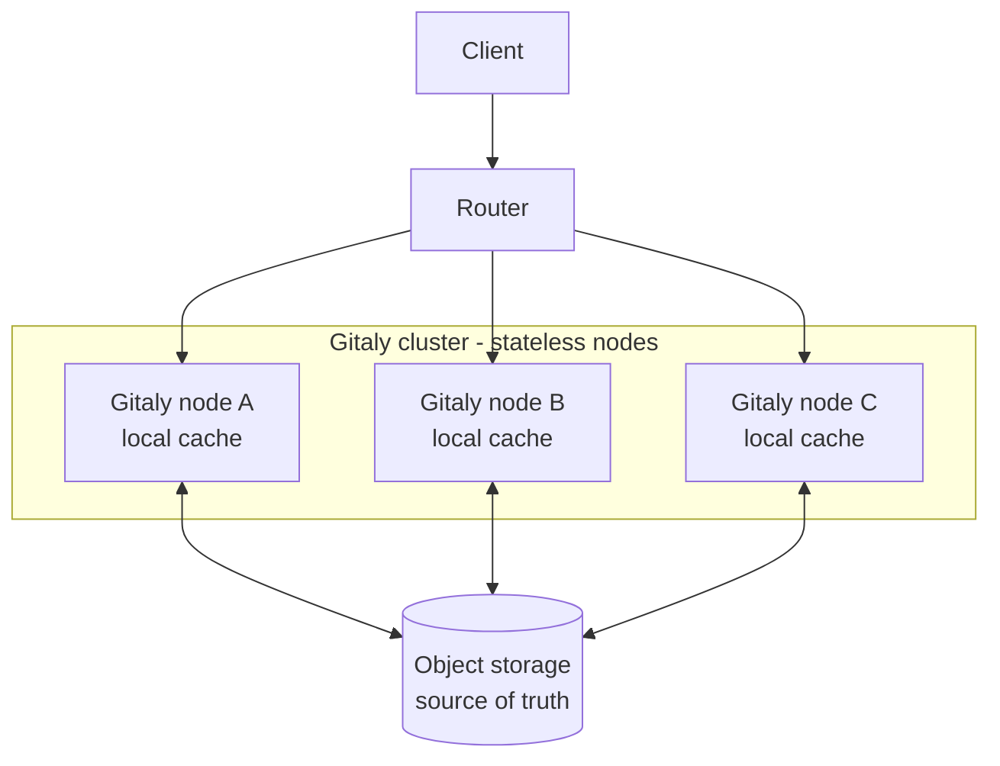
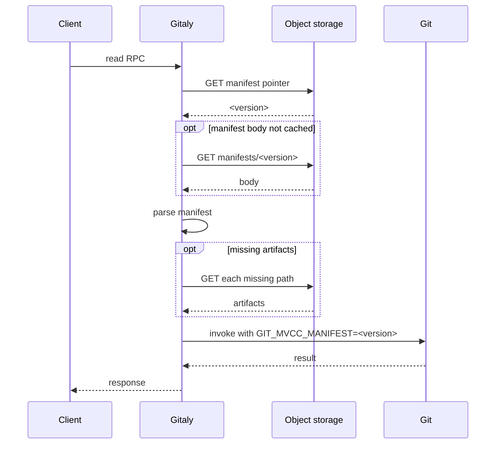
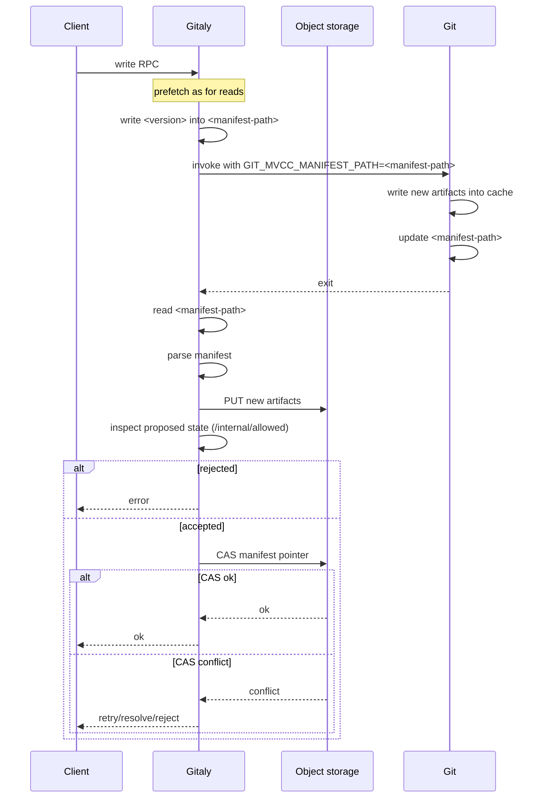
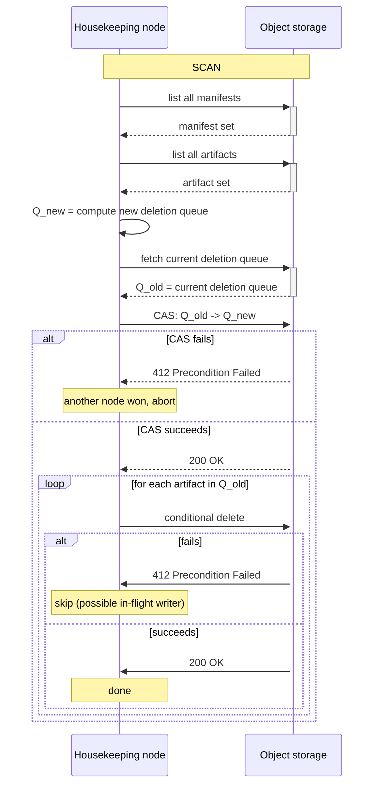
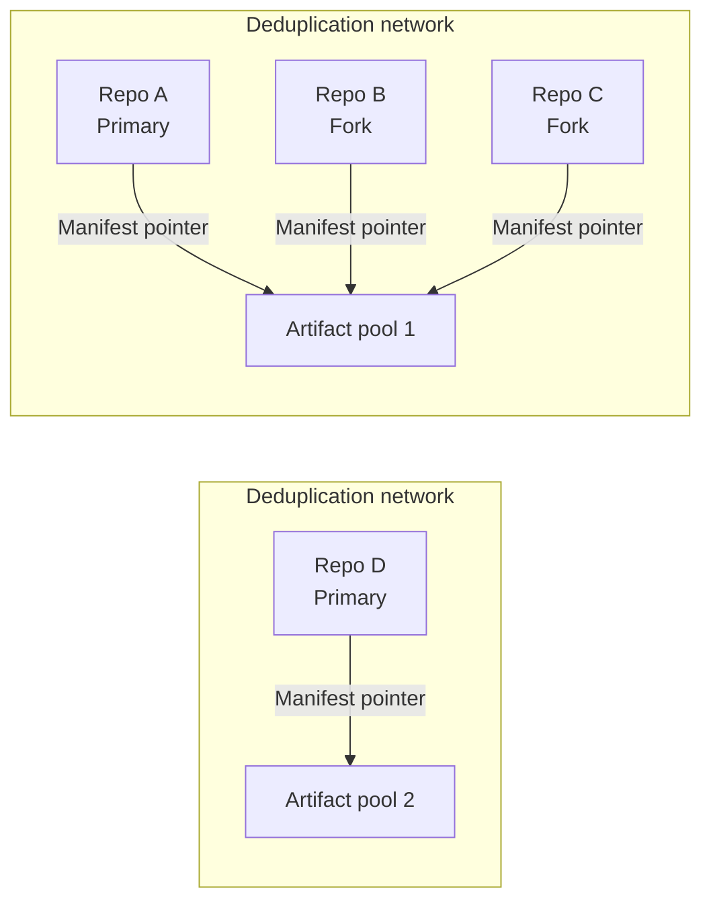



これは提案です。現在もイテレーション中であり、まだ確定した設計ではありません。

## 概要

Gitaly は、リポジトリの正式なコピーをサービス提供ノードのファイルシステムに保存します。そのため、コンピューティングとストレージが密結合しており、どちらの次元もスケーリングが困難です。

このブループリントでは、コンピューティングとストレージを分離し、両方のレイヤーを独立してスケーリングできる新しいアーキテクチャを提案します。

- **ストレージ**: オブジェクトストレージ（AWS S3、Google Cloud Storage、SeaweedFS など）をリポジトリデータの信頼できる唯一の情報源とします。
- **コンピューティング**: ステートレスな Gitaly ノードが、オブジェクトストレージから取得したアーティファクトのローカルキャッシュに対して Git を実行します。

この基盤となるのは、私たちが Git にアップストリームしてきた Git のプラガブルオブジェクトデータベース基盤です。この基盤により、参照およびオブジェクトのデータベース形式を私たちが管理し、Gitaly 固有のニーズに直接対応する専用のストレージ形式を作成できます。

この基盤をもとに、参照とオブジェクトを保存するための新しい多版型同時実行制御（MVCC）バックエンドを提案します。リポジトリの永続的な状態は、イミュータブルでコンテンツアドレス指定されたアーティファクトの集合です。イミュータブルなマニフェストは、現在どのアーティファクトがアクティブであるべきかを示します。現在アクティブなマニフェストは、ミュータブルなマニフェストポインターから参照されます。この設計では、一貫性のある読み取りとアトミックな更新が可能になり、同じリポジトリで実行される複数の Git プロセスが異なるバージョンを操作できます。

Gitaly はオーケストレーターです。アクティブなマニフェストで指定されたアーティファクトをローカルディスクに取得し、そのキャッシュに対して Git を実行し、新しいアーティファクトをオブジェクトストレージに公開したうえで、比較交換（CAS）によってポインターを進めます。

オブジェクトストレージが正式な状態を保持するため、キャッシュを満たした後はどのノードでも任意のリポジトリを提供でき、データを失うことなく必要に応じてノードを追加または破棄できます。ローカルディスクは実質的にキャッシュとしてのみ機能します。Gitaly ノードの前段にはオーケストレーションレイヤーが配置され、需要に応じてクラスターをスケーリングし、リクエストを効率的にルーティングします。

## 動機

現在、リポジトリのワークロードは単一ノードに拘束されています。リポジトリは 1 つのノードのファイルシステムに存在し、そのリポジトリへのすべてのリクエストはそのノードで処理されます。特定のリポジトリでより多くの負荷を処理する唯一の方法は、ノードのハードウェアをスケールアップすることです。しかし、垂直スケーラビリティには限界があり、最大規模のノードの一部ではすでにその限界に達しています。

そのため、私たちが提供する最も高コストな RPC の一部にかかるリソースコストによって、単一リポジトリで処理できるトラフィック量の上限が決まります。

- `gitlab-org/gitlab` のクローンに対する `git-pack-objects` は、約 4〜6 GB の匿名メモリを保持するため、CPU に関係なくノードごとの実行中クローン数が制限されます。
- ホットなリポジトリでの epoll 競合、ファイルディスクリプター不足、CPU 使用が、私たちのシステムで常にボトルネックを引き起こします。
- Slowloris 形式のクライアントは、レスポンスをゆっくり受信しながら `git-pack-objects` のメモリを保持します。
- 単一リポジトリに殺到する CI のフェッチによって、Gitaly は頻繁に機能不全に陥ります。

さらに、エージェント型ワークロードによる RPC 呼び出しが大幅に増加しており、今後さらに加速すると予想しています。リポジトリ単位の水平スケーラビリティがなければ、最もビジーなリポジトリの負荷は、どの単一ノードでも処理できる量を超えます。

したがって、リポジトリのワークロードをノードのクラスター全体で水平スケーリングできることが重要です。私たちは Praefect による読み取り分散でこの問題への対処を試みましたが、さまざまな問題により、その取り組みは水平スケーリング可能なクラスターを実現できず、実質的に失敗しました。

### 目標

- オブジェクトストレージをリポジトリデータの信頼できる唯一の情報源とします。
- Gitaly ノードをステートレスにします。ノードとそのディスクを失うとパフォーマンスは低下しますが（コールドキャッシュ）、データ損失や利用不能は発生しません。
- リポジトリの読み取りワークロードをノード全体で水平スケーリングします。
- 読み取りは、一貫性のある特定時点のスナップショットとして観測されます。
- 書き込みの公開はアトミックかつ分離され、マニフェストポインターに対するアトミックな比較交換によって直列化されます。
- ローカルワーキングセットのオーバーヘッドを小さく保ちます。ノードは特定のリポジトリに必要なアーティファクトだけを取得し、参照されなくなった古いデータをプルーニングします。

### 前提

- ほとんどのリポジトリは読み取り中心であり、読み取りのスケーリングは書き込みのスケーリングよりも緊急性が高いと想定します。そのため読み取りのスケーリングに重点を置きますが、この設計では複数のリーダーと複数のライターの両方が可能なので、書き込みスループットのボトルネックも移動できると考えています。
- リクエストごとのレイテンシーが多少増えても、スループットの向上には価値があります。キャッシュとキャッシュを考慮したルーティングによって、追加のレイテンシーを最小限に抑えます。
- オブジェクトストアは、単一キーのアトミックな書き込み、書き込み後読み取り整合性、および条件付き書き込みを提供します。

## 提案

このアーキテクチャでは、永続的なストレージ層をステートレスなコンピューティング層から分離し、クライアントとノードの間にルーティングレイヤーを配置します。


```mermaid
flowchart TB
  client[Client]
  router[Router]
  subgraph cluster[Gitaly cluster - stateless nodes]
    n1[Gitaly node A<br/>local cache]
    n2[Gitaly node B<br/>local cache]
    n3[Gitaly node C<br/>local cache]
  end
  os[(Object storage<br/>source of truth)]

  client --> router
  router --> n1
  router --> n2
  router --> n3
  n1 <--> os
  n2 <--> os
  n3 <--> os
```

各リポジトリについて、オブジェクトストレージはすべてのアーティファクトとミュータブルなマニフェストポインターを信頼できる唯一の情報源として保持します。Gitaly ノードは、オブジェクトストレージから取り込んだローカルキャッシュディレクトリに対して Git を実行するステートレスなコンピューティングユニットであり、独自の正式な状態を保持しません。Git 自体はネットワーク I/O を行いません。ローカルファイルの読み書きだけを行い、Git から見えるファイルの集合はアクティブなマニフェストによって決まります。ノードの前段では、ルーターが各リクエストをノードに割り当て、対象リポジトリのウォームキャッシュをすでに保持しているノードを優先します。

## 設計と実装の詳細

### Git MVCC バックエンド

新しいストレージアーキテクチャの基盤は、参照とオブジェクト向けに専用設計されたストレージバックエンドです。このバックエンドには次の特性があります。

- 一貫性のある読み取りが可能です。
- 複数のリーダーが異なるバージョンのリポジトリを読み取れます
- アトミックな書き込みが可能です。
- 任意のスナップショットでリポジトリを読み取るために必要なすべてのファイルを明確に識別します。
- 完全に自己記述的であるため、マニフェストを使用して追加情報なしで完全な Git リポジトリをブートストラップできます。
- すべてのデータがコンテンツアドレス指定されるため、同時実行する 2 つのライターが互いに競合することはありません。

これらの特性を組み合わせることで、単一のマニフェストファイルから完全なリポジトリを構成できます。これにより、オーケストレーターは正式な状態をオブジェクトストレージに保持し、リポジトリの特定バージョンを提供するために必要なファイルだけをローカルキャッシュに取得し、別の特定バージョンに必要なファイルだけをアップロードできます。

#### ディレクトリレイアウト

すべてのアーティファクトは 1 つのキャッシュディレクトリ内に配置されます。単一のミュータブルな `manifest` ポインターを除き、すべてがイミュータブルでコンテンツアドレス指定されます。

```text
<commondir>/mvcc/
  manifest               mutable pointer (hash of the active manifest)
  manifests/<hash>       immutable manifest bodies
  pack/<hash>.pack       immutable packs
  pack/<hash>.idx
  pack/<hash>.rev
  refs/<hash>.ref        immutable reftables
```

ポインター以外はすべてコンテンツアドレス指定されるため、新しいファイルを既存ファイルと並べて安全に配置できます。同じアーティファクトを生成する 2 つのライターが衝突することはなく、中断された書き込みによって残されたファイルは参照されないだけなので、回収されるまで無害です。

#### マニフェスト形式

マニフェスト本体は、[`gitformat-chunk`](https://git-scm.com/docs/gitformat-chunk) フレームワークを基盤とするチャンクベースのバイナリファイルで、厳密に 1 つの一貫したスナップショットのアーティファクトを列挙します。ヘッダーには、`MVCC` シグネチャ、形式バージョン、チャンク数、`PATH` レコードの固定幅サイズ、リポジトリのオブジェクトハッシュアルゴリズム（SHA-1 または SHA-256）が格納されます。その後に 3 つのチャンクが続きます。

- `PATH` は、辞書順にソートされた固定幅で NUL 終端された相対パス（キャッシュディレクトリからの相対パス）のリストです。オーケストレーターがアーティファクトを取得およびアップロードするために使用する正規のアーティファクトリストです。
- `OBJS` は、オブジェクトストレージのアーティファクトを指定する `PATH` 内の `(start_index, count)` 範囲です。
- `REFS` は reftable スタック順の `PATH` インデックスのシーケンスで、同じ ref について後のテーブルが前のテーブルを上書きします。

本体の末尾に付く 32 バイトの SHA-256 は、解析時の破損検出を可能にするとともに、本体のコンテンツアドレス名として機能します。特定のスナップショットの依存関係を列挙するだけのコンシューマーは、`PATH` チャンクだけを読み取れば済みます。未知のチャンク ID は無視されるため、形式バージョンを上げたり Gitaly を変更したりせずに、将来新しい種類のアーティファクトを追加できます。

#### ピン留めとポインターの解決

Git は、次の固定された優先順位でアクティブなマニフェストを解決します。

1. `GIT_MVCC_MANIFEST` 環境変数により、呼び出し元は Git を特定のマニフェストバージョンにピン留めできます。これにより読み取り専用のスナップショットとなり、アーティファクトを書き込もうとすると Git は中止します。
2. `GIT_MVCC_MANIFEST_PATH` 環境変数により、呼び出し元は指定されたパスにあるマニフェストを読み取り、更新するよう Git に指示できます。
3. ほかのオーバーライドがアクティブでない場合は、リポジトリ自身の `<commondir>/mvcc/manifest` ポインターを使用します。

`GIT_MVCC_MANIFEST=<sha>` を設定すると、読み取りに対するすべてのディスク上のポインターがオーバーライドされ、プロセスの存続期間中はハンドルが読み取り専用になります。これにより、どのプロセスも一貫性のある特定時点のビューを取得できます。

書き込みの分離は、`GIT_MVCC_MANIFEST_PATH` をエクスポートし、複数の異なる一時マニフェストを使用することで実現できます。この環境変数は、一時マニフェストを使用するよう Git に指示します。これにより、Git は一時マニフェストを現在のマニフェストバージョンの信頼できる唯一の情報源として使用し、新しいデータを書き込む際は新しいマニフェストバージョンをそのパスに公開します。この仕組みにより、Gitaly は複数のライターを互いに分離し、未公開の状態が実行中のほかのプロセスから見えないようにできます。

Git が実行するフックには `GIT_MVCC_MANIFEST` 環境変数が設定されるため、親プロセスと同じマニフェストバージョンが見えます。これにより、子プロセスがデータを書き込めないことも保証されます。

最終的に、正式な信頼できる唯一の情報源がオブジェクトストレージに置かれた後は、Gitaly が `<commondir>/mvcc/manifest` を使用することはなくなります。代わりに、常に GET リクエストでバージョンを解決し、`GIT_MVCC_MANIFEST` を介してエクスポートするか、`GIT_MVCC_MANIFEST_PATH` に書き込むことが想定されます。

`GIT_MVCC_MANIFEST` と `GIT_MVCC_MANIFEST_PATH` のどちらも設定されていない場合、Git は `<commondir>/mvcc/manifest` のポインターを使用します。

#### スコープ

このバックエンド自体はネットワーク I/O を行いません。アクティブなマニフェストで指定されたすべてのオブジェクトがローカルに存在する必要があり、アーティファクトの欠落は取得のトリガーではなく重大なエラーになります。次に説明するように、オブジェクトストレージとのすべての通信はオーケストレーターの責任です。

### 信頼できる唯一の情報源としてのオブジェクトストレージ

各リポジトリについて、オブジェクトストレージは完全なアーティファクトセットと永続的なマニフェストポインターキーを保持します。Gitaly は各 RPC の開始時にこの永続的なポインターを解決し、ローカルキャッシュのポインターを正式なものとして扱うことはありません。

オブジェクトストレージプロバイダーには、いくつかの要件があります。

- 書き込み後読み取り整合性を備えた単一キーの PUT をサポートする必要があります。
- ポインターキーの条件付き更新をサポートする必要があります。
- ハウスキーピングを安全に行うため、条件付き削除をサポートする必要があります。
- オブジェクトの ETag 更新をサポートする必要があります。

解決されたマニフェストのすべての依存関係を Git の起動前に取得することは、オーケストレーターの責任です。さらに、アクティブ化されようとしている新しいマニフェストに必要なすべての依存関係をアップロードすることも、オーケストレーターの責任です。

### 読み取り RPC のライフサイクル

`GetCommit` や `FindRefs` などの読み取り RPC には一貫性のあるスナップショットが必要ですが、新しい状態は生成しません。


```mermaid
sequenceDiagram
  participant C as Client
  participant G as Gitaly
  participant S as Object storage
  participant Git as Git

  C->>G: read RPC
  G->>S: GET manifest pointer
  S-->>G: <version>
  opt manifest body not cached
    G->>S: GET manifests/<version>
    S-->>G: body
  end
  G->>G: parse manifest
  opt missing artifacts
    G->>S: GET each missing path
    S-->>G: artifacts
  end
  G->>Git: invoke with GIT_MVCC_MANIFEST=<version>
  Git-->>G: result
  G-->>C: response
```

Gitaly は、`PATH` チャンクだけを通じて MVCC スナップショットに必要な依存関係を列挙し、ほかのチャンクを解釈する必要はありません。アーティファクトはイミュータブルでコンテンツアドレス指定されるため、プリフェッチは冪等です。`GIT_MVCC_MANIFEST` でピン留めすることで、ほかのライターがリポジトリを進めている最中でも、単一の RPC 内で起動されたすべての Git プロセスが同じ状態を観測できます。外部ポインターファイルは作成されず、読み取りによってキャッシュポインターが進むこともありません。

{}
同時実行するライターがいるときに不整合な読み取りを観測できないようにするには、各 RPC 呼び出しでマニフェストポインターを厳密に 1 回だけ特定のバージョンに解決し、すべての Git プロセスがその正確なバージョンを継承することが重要です。
{}

キャッシュがまだウォームアップされていない場合、欠落しているアーティファクトの取得に長い時間がかかる可能性があります。これは次の 2 つの仕組みで軽減します。

- ルーティングレイヤーは、ウォームキャッシュを持つノードにリクエストがルーティングされるようにする必要があります。
- リポジトリのハウスキーピングは、変化するデータ量に上限を設けられるよう、アーティファクトを不必要に書き換えないようにする必要があります。

### 書き込み RPC のライフサイクル

`UserCommitFiles` や `PostReceivePack` などの書き込み RPC は、永続化する必要のある新しい状態を生成します。


```mermaid
sequenceDiagram
  participant C as Client
  participant G as Gitaly
  participant S as Object storage
  participant Git as Git

  C->>G: write RPC
  Note over G: prefetch as for reads
  G->>G: write <version> into <manifest-path>
  G->>Git: invoke with GIT_MVCC_MANIFEST_PATH=<manifest-path>
  Git->>Git: write new artifacts into cache
  Git->>Git: update <manifest-path>
  Git-->>G: exit
  G->>G: read <manifest-path>
  G->>G: parse manifest
  G->>S: PUT new artifacts
  G->>G: inspect proposed state (/internal/allowed)
  alt rejected
    G-->>C: error
  else accepted
    G->>S: CAS manifest pointer
    alt CAS ok
      S-->>G: ok
      G-->>C: ok
    else CAS conflict
      S-->>G: conflict
      G-->>C: retry/resolve/reject
    end
  end
```

Gitaly はまず、読み取り専用 RPC と同じ方法でマニフェストを解決します。ただし、`GIT_MVCC_MANIFEST` でバージョンをピン留めする代わりに、解決したマニフェストバージョンを一時的なマニフェストパスへ書き込み、`GIT_MVCC_MANIFEST_PATH` を指定して Git を呼び出します。これにより、すべての更新が自己完結し、同時実行する書き込みに影響しません。

Git の処理が完了したら、Gitaly は新しい状態を検査しなければならない場合があります。検査の一部として Rails の `/internal/allowed` チェックを呼び出し、新しい状態に対して一連の読み取りを実行することがあります。これらの読み取りをノード間で分散できるようにするには、Gitaly は正式で永続的なマニフェストポインターを更新する前に、アーティファクトをオブジェクトストレージへアップロードする必要があります。このバージョンに対する後続のチェックでは、提案された新しいバージョンを指すように `GIT_MVCC_MANIFEST` を伝播する必要があります。

ここではトレードオフがあることに注意してください。

- アクセスチェック自体が高コストになる可能性があるため、ノード間に分散することでスループットが高くなる可能性があります。
- 読み取りを分散すると、ほかのノードが新しいアーティファクトを取得する必要があります。

アクセスチェック中の読み取り分散は、後続の読み取りを書き込みノードにピン留めして制限することが望ましい可能性があります。

{}
読み取り専用 RPC と同様に、マニフェストバージョンは厳密に 1 回だけ解決するものとします。それ以降は、変更を行う RPC 内の後続のすべての Git プロセスにおいて、一時マニフェストをマニフェストバージョンの信頼できる唯一の情報源とします。

さらに、正式なマニフェストポインターの更新は、_最大 1 回_にしなければなりません。そうしないと、変更を行う RPC で不整合な書き込みが発生する可能性があります。
{}

新しい状態が受け入れられ、アーティファクトがアップロードされると、Gitaly はマニフェストポインターに対して比較交換操作を実行します。複数のライターが存在できるため、この操作は競合によって失敗する可能性があります。その場合は次の 2 つのシナリオがあります。

- 1 つの参照を異なるバージョンへ更新しようとするため、論理的な競合が発生する場合があります。この場合は拒否され、更新は行われません。
- マニフェストポインターは変更されたものの、どの更新も競合しておらず、性質上の競合にすぎない場合があります。この場合、Gitaly は変更された参照を 3 ウェイマージして競合の解決を試みます。

3 ウェイマージは、関連する次の 3 つのマニフェストを使用して実行できます。

- ベース：Gitaly が最初に一時マニフェストポインターへ書き込んだものです。
- 自分側：変更を行う RPC によって計算された更新案です。書き込みを行うすべての Git コマンドが完了した後、一時マニフェストポインターを読み取ることで取得できます。
- 相手側：正式なマニフェストポインターが現在指しており、同時実行するライターによって進められたバージョンです。

マージでは、これら 3 つの異なるバージョン間で変更された参照を読み取り、マージします。いずれかの参照が競合する更新を受けている場合は論理的な競合となり、書き込みを拒否します。複数回書き込まれた参照がなければ、書き込みを受け入れられます。

オブジェクトには 3 ウェイマージが不要であることに注意してください。代わりに、競合がないものとして扱い、常に和集合を取得できます。

### リポジトリのハウスキーピング

この設計では、書き込みのたびに新しいパックファイルと reftable が生成されます。マニフェストから参照されるファイル数を制限し、高速なデータ検索を保証し、オブジェクトの差分圧縮に適した機会を確保するため、定期的に圧縮する必要があります。

この圧縮では、次の 2 つの要件のバランスを取る必要があります。

- 高速な検索を維持するため、ファイル数をできるだけ少なくします。
- ほかのノードで頻繁にキャッシュミスが発生することを避けるため、定期的なファイルの書き換えを避けます。

この要件は、パックファイルの最大サイズを設定した幾何学的圧縮を実行することで両立します。特定のサイズしきい値より小さいすべてのファイルは、サイズに関して等比数列を形成する必要があります。この性質を満たさない場合は、可能な限り多くのファイルを再パックして復元します。ファイルがサイズしきい値に達すると、再パックを停止します。

固定されたパックファイルは、もう 1 つの重要な性質も保証します。リポジトリのキャッシュがマニフェスト A でウォームアップ済みで、A より古いマニフェスト B を使用してスナップショット読み取りを行うと仮定すると、次のことがわかります。

- B に存在する固定済みパックは、すべて A にも存在します。
- 固定されていないすべてのパックが等比数列を形成することがわかります。
- 等比数列のサイズは最大で $\frac{T r}{r - 1}$ です。ここで、$T$ はしきい値、$r$ は等比数列の公比です。

したがって、パラメーターを調整することで取得するデータ量の上限を制限できます。しきい値が 1 GB で公比が 2 の場合、取得する必要があるデータ量の上限は 2 GB です。

これは、到達不能なオブジェクトをデフォルトで削除しないことを前提としている点に注意してください。ほとんどのリポジトリでは許容できると見込んでいます。

### ガベージコレクション

MVCC バックエンドは変更のたびに新しいアーティファクトを作成します。その結果、参照されていないアーティファクトがローカルディスクとオブジェクトストレージの両方に時間とともに蓄積します。ストレージの増加を制御するため、両方を定期的にクリーンアップする必要があります。

ノード上のデータはキャッシュとしてのみ機能するため、ローカルのクリーンアップは積極的に実行しても安全です。オブジェクトストレージのクリーンアップロジックは、同時実行するリーダーやライターと競合しないように実装する必要があります。

このシステムには、2 種類のガベージコレクションがあります。

- 古いマニフェストのプルーニングは設定可能にする必要があります。これにより、たとえば特定の期間について複数のポイントインタイムリストアを保持できるため、特定のポリシーに従う必要があります。
- 参照されていないアーティファクトのプルーニングは、ポリシーベースである必要はありません。

以下では、参照されていないアーティファクトを競合なく削除する方法のみを検討します。そのために、2 世代の削除キューを使用します。


```mermaid
sequenceDiagram
  participant H as Housekeeping node
  participant S as Object storage

  Note over H,S: SCAN
  H->>+S: list all manifests
  S-->>-H: manifest set
  H->>+S: list all artifacts
  S-->>-H: artifact set
  H->>H: Q_new = compute new deletion queue

  H->>+S: fetch current deletion queue
  S-->>-H: Q_old = current deletion queue

  H->>+S: CAS: Q_old -> Q_new
  alt CAS fails
    S-->>H: 412 Precondition Failed
    Note over H: another node won, abort
  else CAS succeeds
    S-->>H: 200 OK
    loop for each artifact in Q_old
      H->>S: conditional delete
      alt fails
        S->>H: 412 Precondition Failed
        Note over H: skip (possible in-flight writer)
      else succeeds
        S->>H: 200 OK
        Note over H: done
      end
    end
  end
```

ノードがプルーニングを実行することを決定すると、利用可能なすべてのマニフェストファイルをスキャンし、既存のすべてのアーティファクトを一覧化します。プルーニング対象の候補は、既存のアーティファクト一覧から、いずれかのマニフェストによって参照されているアーティファクト一覧を除いて計算します。さらに、各アーティファクトの mtime が、現在時刻から特定のしきい値を引いた時刻より前であることを確認します。その結果が、プルーニング対象となる候補の集合です。

次に、ノードはその候補の集合から新しい削除キューを作成します。キューには次のものが含まれます。

- 削除するアーティファクトの名前。
- 各アーティファクトの条件付き削除に使用できる ETag。

ノードは現在の削除キューをダウンロードし、新しい候補一覧へ更新するため比較交換操作を実行します。成功すると、ノードはダウンロードしたキュー内の保留中の削除一覧を検証します。各エントリについて、削除キューに保存されている ETag を使用して、そのアーティファクトを条件付きで削除します。

マニフェストから以前は参照されていなかったものの、オブジェクトストレージにはすでに存在するアーティファクトを参照し始めるライターは、ほかのマニフェストから参照されていない場合に同時削除されないよう、オブジェクトストレージ内のオブジェクトの ETag を更新する必要があります。同時削除によって ETag の更新に失敗した場合、ライターはアーティファクトを再アップロードする必要があります。

交換の前、最中、または後にハウスキーピングの実行がクラッシュしても問題はありません。将来の再実行で、プルーニング対象の候補集合が再び導出されるためです。

### 重複排除ネットワーク

リポジトリがフォークされると、アップストリームリポジトリと同一のコピーから始まる新しいリポジトリが作成されます。フォークがアップストリームから分岐した後も、通常はリポジトリ間で共有される共通の基礎履歴が残ります。この関係がわかっているため、ストレージ全体の使用量を減らすには、フォークとアップストリームリポジトリの両方に存在するオブジェクトを重複排除することが望まれます。これは、エージェント型ワークロードでよく見られる、フォークを多用するワークフローに不可欠です。

現在のアーキテクチャでは、Gitaly はオブジェクトプールリポジトリを使用してオブジェクトを重複排除します。オブジェクトプールは、関連するほかのリポジトリと共有することを意図したオブジェクトの集合を含む、独立した Git リポジトリです。これらの共有オブジェクトに依存するリポジトリは、Git の alternates の仕組みを通じてオブジェクトプールにリンクします。

MVCC 設計では、各 Git リポジトリに、現在使用中の MVCC アーティファクト（reftable、パックファイル、マニフェスト）を定義するマニフェストポインターがあります。リポジトリのマニフェストポインターで指定されるマニフェストにより、Git は実質的にリポジトリの分離されたスナップショット／ビューを構成できます。関連する履歴を持つリポジトリ（アップストリームとそのフォーク）を関連付けることで、MVCC アーティファクトの共有プールを使用して重複排除できるようになります。MVCC アーティファクトがコンテンツアドレス指定され、イミュータブルであるため、この仕組みが成り立ちます。MVCC アーティファクトプールを共有する一連のリポジトリを、重複排除ネットワークと呼びます。


```mermaid
flowchart LR
  subgraph network2[Deduplication network]
    r4[Repo D<br/>Primary]
    p2[Artifact pool 2]
  end
  subgraph network1[Deduplication network]
    r1[Repo A<br/>Primary]
    r2[Repo B<br/>Fork]
    r3[Repo C<br/>Fork]
    p1[Artifact pool 1]
  end
  r1 -->|Manifest pointer| p1
  r2 -->|Manifest pointer| p1
  r3 -->|Manifest pointer| p1
  r4 -->|Manifest pointer| p2
```

新しいリポジトリを作成すると、新しい重複排除ネットワーク内にリポジトリが設定される一方、フォークリポジトリを作成すると、既存の重複排除ネットワークへ参加するよう設定される点に注意してください。これを機能させるには、各リポジトリが取得元となる MVCC アーティファクトプールと、自身のマニフェストポインターを把握する必要があります。この情報は、リポジトリキーとそのプール／マニフェストの場所とのキーバリューマッピングとして保存できます。クラスター構成では、同じアーティファクトプールを使用するリポジトリを同じ Gitaly ノードへルーティングすることで、ローカルキャッシュでアーティファクトの重複を排除し、コールドキャッシュヒットを減らすことが望ましいと考えられます。

アーティファクトレベルの重複排除を効果的にするには、ある時点でアーティファクトが安定していると見なされる必要があります。たとえば、リポジトリのハウスキーピングで MVCC アーティファクトをよりコンパクトに書き換えると、結果として、重複排除ネットワーク内のリポジトリ間でもはや共通しない新しい別個のアーティファクトが生成される場合があります。パックファイルアーティファクトでは、サイズの上限を設定することで再パックを防止できます。これにより、「大きな」パックファイルをリポジトリへの書き込み後も一貫した状態に保ち、重複排除ネットワーク内のリポジトリで再利用できます。一方で、サイズ上限を下回るパックファイルアーティファクトは、リポジトリの履歴が変化するにつれて重複排除された状態を維持しにくくなります。また、重複排除できるパックファイルアーティファクトの集合は、フォーク時に一度だけ決まります。

reftable とマニフェストのアーティファクトも同じプールに存在するため理論上は重複排除できますが、実際にはリポジトリの履歴が変化するにつれて安定した状態を維持しにくいため、重複排除ネットワーク内のリポジトリ間で共通して共有される可能性は低いことに注意してください。

### クラスタリングとルーティング

Gitaly ノードは、水平スケーラビリティを実現するためにクラスターとして動作する必要があります。クラスタリングおよびルーティングレイヤーによって、ノードはピアを認識し、何らかの基準に従って正常なノードへリクエストをルーティングできます。このレイヤーはデプロイ環境に依存せず、Kubernetes の内外で同様に動作する必要があります。

ノードはどのリポジトリへのリクエストにも対応できるステートレスなキャッシュですが、次の理由から、そのような動作は最適ではありません。

- 対象ノードがまだ提供したことのないリポジトリでは、キャッシュのウォームアップ（つまり、永続ストレージから欠落しているアーティファクトをダウンロードすること）によるオーバーヘッドが発生します。
- 各ノードは存続期間中のある時点で、すべてのリポジトリを提供する可能性が等しくあるため、ローカルディスク使用量が多くなります。

代わりに、ルーターの主な目標は、特定のリポジトリへのリクエストがクラスター内のノードのサブセットに「固定」され続けるようにすることです。たとえば、`repo-a` へのリクエストは常に `gitaly-1` と `gitaly-4` に送られ、両方のノードが十分にウォームなキャッシュを維持できるようにします。

ルーターは、個々のノードの正常性を含むクラスター構成を維持するクラスタリングレイヤーによって支えられます。また、既存ノードを再設定せずにクラスターのサイズを変更できるようにします。

実装案の詳細については、[クラスタリングとルーティング](./clustering_routing.md)のサブページを参照してください。

## 移行

プロジェクト全体を完成させるには多大な作業が必要です。システムのさまざまな性質を可能な限り迅速にテストできるようにするため、このプロジェクトを複数のステージに分割します。

1. MVCC 参照の移行
2. MVCC オブジェクトの移行
3. オブジェクトストレージへの移行
4. クラスタリング

各ステージでは全体設計の一部を段階的に展開し、ほとんどのステージですでにお客様へ価値を提供します。これにより、迅速な本番投入が可能になり、設計上の問題を早期に明らかにできるため、プロジェクトが失敗するリスクを減らせます。

### ステージ 1：MVCC 参照の移行

最初のステージでは、参照に対してのみ MVCC バックエンドを展開します。これには、Git の MVCC 参照バックエンドと、Gitaly 側で読み取りと書き込みを処理するロジックが必要です。

このフェーズをオブジェクトの移行から分離する利点は、すでに移行パスがあり、参照バックエンドが Git で完全にプラガブルになっていることです。そのため、プラガブルオブジェクトデータベースの基盤をまだ仕上げている間にもこれを展開でき、Gitaly での MVCC ロジックの処理を検証し始められます。

このフェーズには、Git の参照を保存するバックエンドとして reftable へ移行できるという利点があり、参照を削除する際の長年のスケーラビリティ問題を解決します。ただし、それ以外にお客様が得られる利点は限られます。そのため、ステージング環境のリポジトリと、本番向けリポジトリの一部にのみ展開すると見込んでいます。

### ステージ 2：MVCC オブジェクトの移行

2 番目のステージでは、オブジェクト向け MVCC バックエンドを展開し、参照とオブジェクトの両方を MVCC で管理します。これには、プラガブルオブジェクトインターフェースが Gitaly のニーズに対応できる状態であることと、Git の MVCC オブジェクトバックエンドが必要です。Gitaly 側で読み取りと書き込みを処理するロジックは、最初のステージですでに実装されています。

このステージでは、リポジトリはオブジェクトストレージに必要なレイアウトを正確に備えますが、すべてのデータは引き続きローカルディスクに置かれます。これにより、Git 側で必要な変更がすべて完了します。

このフェーズには次の利点があります。

- すべての読み取りが完全に一貫し、同時実行するライターの影響を受けません。
- ライターはアトミックです。
- 特定時点でのスナップショット読み取りが可能になります。

このステージは、オブジェクトストレージへ円滑に移行するための前提条件です。そのため、最終的にはすべてのリポジトリをこのバックエンドへ移行すると見込んでいます。

さらに、このステージはエンタープライズ以外のお客様にとって最終ステージになります。

### ステージ 3：オブジェクトストレージへの移行

3 番目のステージでは、リポジトリデータの信頼できる唯一の情報源をローカルディスクからオブジェクトストレージへ移行します。基本的に、すべてのリポジトリを 1 つの Gitaly ノードからなるクラスターでホストすることになります。

このフェーズには次の利点があります。

- オブジェクトストレージを通じて、グローバルに一貫したバックアップを実行できるようになります。
- ローカルディスクからリポジトリデータのプルーニングを開始し、ストレージコストを削減できます。
- 信頼できる唯一の情報源がオブジェクトストレージに存在するため、任意の Gitaly ノードからどのリポジトリでも簡単に提供できます。

GitLab.com のすべてをこのステージへ移行すると見込んでいます。この移行はエンタープライズのお客様に対してのみ実行されます。

### ステージ 4：クラスタリング

4 番目のステージでは、クラスター管理機能を Gitaly に導入します。これには、インテリジェントなルーティング機能と、負荷に応じてクラスターを自動的にスケールアップまたはスケールダウンする機能が含まれます。

このフェーズには次の利点があります。

- 特定のリポジトリの負荷に基づいて、動的にスケールアップまたはスケールダウンできます。

## 代替案

### Praefect

Praefect はすでに読み取り分散を提供しています。しかし、Praefect は実際の運用が困難であることがわかっています。

- Postgres を使用すると信頼できる唯一の情報源が複数になり、バックアップが困難になります。
- トランザクション投票は実際には信頼性が低いことがわかっています。
- 書き込みはすべてのノードで同時に行う必要があります。そのため、特定のリポジトリを提供するノード数が増えるほど、ノードの一部で障害が発生する可能性が高まります。
- この障害モードでは、同時書き込みに決して追いつけないレプリケーション実行が発生することがよくあります。その結果、読み取り分散が機能しません。

したがって、この解決策は失敗した設計として扱います。

### ネットワークファイルシステム

Praefect を使用する前は、ネットワークファイルシステムを使用して複数の Gitaly ノード間にデータを分散していました。しかし、アクセスレイテンシーの増加が課題であることがわかりました。さらに、ネットワークファイルシステムでは POSIX に準拠しないエッジケースが発生しやすく、デバッグが困難な問題につながります。

### Git データをデータベースに保存する

検討した代替案の 1 つは、Git の参照とオブジェクトを適切なデータベースに保存することです。これには、どのクライアントからでもデータへ簡単にアクセスできるという利点があります。

しかし、Git の操作の多くではオブジェクトグラフ全体とすべての参照を読み取る必要があり、ネットワークのラウンドトリップ時間を考えると、それらを個別に読み取ることは現実的ではありません。

大量のキャッシュレイヤーを導入することで解決できる可能性があります。しかし、プロジェクト全体の時間的な緊急性を考慮すると、このアイデアには未知の要素が多すぎるため、現時点では採用しませんでした。

## リスクと未解決の問題

新しいシステムにも独自のリスクがあります。

- レイテンシーを増やしてスループットを高めるトレードオフが、一部のシナリオでは許容できない可能性があります。緩和策として、解決済みのマニフェストポインターを一定期間キャッシュすることが考えられます。
- ファイル数が多い、またはファイルサイズが大きいリポジトリでは、コールドキャッシュを満たすレイテンシーが懸念されます。緩和策として、積極的なキャッシュのウォームアップが考えられます。
- 圧縮の頻度と粒度は、キャッシュ無効化のコストとのバランスを取る必要があります。
- オブジェクトストレージへの読み書きに対するレート制限がボトルネックになる可能性があります。

これらのリスクには、早期のベンチマークを通じて対処する必要があります。

## 関連資料

- エピック: gitlab-org&21711+
- Git MVCC バックエンド PoC: gitlab-org/git!551+
- Gitaly 統合 PoC: gitlab-org/gitaly!8812+
- [クラスタリングとルーティング](https://gitlab.com/groups/gitlab-org/-/work_items/22229)
- プールされた MVCC アーティファクト: gitlab-org/gitaly#7250+
- ガベージコレクション: gitlab-org/gitaly#7249+
- [MVCC バックエンド脅威モデル（社内限定）](https://gitlab.com/gitlab-com/gl-security/product-security/appsec/threat-models/-/blob/master/gitlab-org/gitaly/Next%20Gen%20Git.md)
