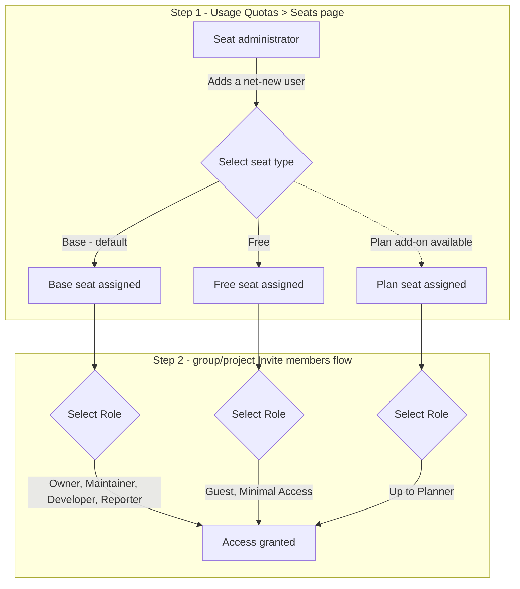

<!-- Design Documents often contain forward-looking statements -->
<!-- vale gitlab.FutureTense = NO -->

<!-- This renders the design document header on the detail page, so don't remove it-->


## 目次 {#table-of-contents}

- [概要](#summary)
- [背景](#motivation)
  - [目標](#goals)
    - [イテレーション 1](#iteration-1)
    - [後続のイテレーション](#later-iterations)
  - [目標外](#non-goals)
- [提案](#proposal)
- [設計と実装の詳細](#design-and-implementation-details)
  - [データモデル](#data-model)
  - [ロールアウトの仕組み](#rollout-mechanism)
  - [ロール制限の適用](#enforcement-of-role-restrictions)
  - [トップレベルより下で追加される新規ユーザー](#net-new-users-added-below-the-top-level)
  - [シートタイプの変更](#changing-seat-type)
  - [メンバーシップのライフサイクルとシートの保持](#membership-lifecycle-and-seat-retention)
  - [サブスクリプションティアの移行](#subscription-tier-transitions)
  - [UI と監査イベント](#ui-and-audit-events)
  - [既存の取り組みとの関係](#relationship-to-existing-work)
  - [未解決の問題](#open-questions)
- [代替案](#alternative-solutions)

## 概要 {#summary}

Seat Assignment Model（SAM）は、GitLab が現在採用している課金対象シートを決定する
「ロール優先」方式を、明示的な「シート優先」モデルに置き換えます。現在、
メンバーがシートを消費するのは、付与されたロールがたまたま課金対象である場合だけです。
課金対象かどうかは、ティア固有のルールを評価し、GitLab.com ではメンバーの名前空間階層全体を
たどって最高アクセスレベルを確認することで、*事後的に*導き出されます。課金対象外のロールを持つメンバー
（たとえば Ultimate の Guest）は、現在はシートをまったく消費しません。

SAM では、**シート管理者**（GitLab.com では名前空間の Owner、
Self-Managed ではインスタンスの Admin）が、各メンバーに**シート
タイプ**（たとえば `Base`、`Free`、`Plan`）を明示的に割り当てます。シートタイプによって、
メンバーが名前空間階層（GitLab.com）またはインスタンス（Self-Managed）の
どこで保持できるロールが決まります。シートタイプはシートコストに
直接対応するため、ユーザーが所属するすべてのグループとプロジェクトのロールを調べて
後から計算するのではなく、ロール選択の**前段階**でコストがわかります。

SAM はまず、GitLab が制御する Flex の必須要素として導入されます。
Flex サブスクリプションを利用する新規および既存のお客様には、最初の
イテレーションではお客様向けのオプトアウトを設けず、GitLab が段階的に SAM を有効にします。
これは出荷済みのバックエンド基盤の取り組みを土台とし（
[既存の取り組みとの関係](#relationship-to-existing-work)を参照）、最終的には同じデータモデルが
GitLab.com と Self-Managed の両方で一貫して機能するように設計されています。SAM が
Flex で実証された後、Flex を利用していない既存のお客様向けのセルフサービス型オプトインを
後に導入する可能性があります。SAM は特定ユーザーとサービスアカウントのシート分類を対象とし、
あらゆるリソース消費のための汎用基盤ではありません。

**最初のイテレーションのスコープ。** SAM が最初に対象とするのは GitLab.com、Ultimate、
Flex（EAP を含む）のみです。Self-Managed と Dedicated、Premium ティア、
Free Tier は最初のイテレーションでは明示的に対象外とし、
後続のイテレーションで対応します。

**EE のみ。** SAM は GitLab Enterprise Edition（EE）にのみ実装されます。
シートタイプの制限適用は EE にしか存在しないサブスクリプションと
請求のインフラストラクチャに依存するため、Community Edition（CE）のコードベースでは
利用できません。

## 背景 {#motivation}

GitLab の現在の課金対象メンバーモデルは、スケーラビリティと使いやすさの
限界に達しています。

**ビジネスへの影響**

1. 新しいシートタイプが近く登場する見込みですが、現在はシートタイプを管理するための
   適切な管理者向けページがまったくありません。適切なシートタイプ管理 UI がなければ、
   新しいシートタイプが増えるたびに、以下で説明する場当たり的で重複した課金対象判定ロジックの問題が
   さらに深刻になります。一貫性があり拡張可能な 1 つの画面で対応できません。
1. Enterprise Agile Planning（EAP）シートは現在、お客様の
   Ultimate シート数に単純に追加されるだけで、通常の Ultimate シートと
   EAP シートをデータレベルで区別できません。このため、EAP シートを Ultimate
   シートとは別に正確に追跡、レポート、請求することができません。
1. ユーザーが課金対象かどうかを判断するには、名前空間の
   グループ/サブグループ/プロジェクト階層全体をたどり、最高アクセスレベルを見つける必要があります。
   これは十分にスケールせず、大規模な名前空間でパフォーマンス問題を引き起こすことが知られています。
1. 課金対象メンバーのロジックは GitLab.com と Self-Managed で重複し、
   関連機能（たとえば GitLab Duo アドオンシートの対象者を判断する機能）ごとにも
   個別に再導出されています。
1. 新しいロールやカスタムロールを追加するたびに、複数の場所で課金対象判定ロジックを
   更新する必要があり、保守と正確性に継続的な負担が加わります。
1. シート数の照合は、サポートとデバッグに大きな負荷をもたらします
   （四半期/年次のトゥルーアップ、超過分への異議申し立て）。

**お客様への影響**

1. ロールの昇格は予期しない請求結果を招く可能性があり（「Ultimate の
   Guest は簡単に Guest 以外になれるため、結果としてコストが増える」）、
   ロール変更によって社内のコンプライアンス/職務分掌ポリシーに誤って
   違反することがあります。
1. Enterprise Agile Planning（EAP）のお客様には、メンバーを
   EAP の対象ロールに保つ確実な方法も、消費している EAP シート数を
   把握する方法もありません。
1. 一般に、メンバーシップの変更前にシート使用量を予測したり、
   その根拠を把握したりすることは困難です。
1. Project Maintainer は名前空間の Owner を経由せずに、課金対象ロールを持つ新規メンバーを
   追加できます。つまり、本来はサブスクリプションのシートコストに責任を持つ人に
   限定すべき請求上の判断を行えてしまいます。

SAM は、「誰が何をできるか」（ロール/権限）と
「このユーザーにいくらかかるか」（シートタイプ）を分離し、シート割り当てを派生値ではなく
明示的でクエリ可能な、管理者が制御するレコードにすることで、両方の側面に対処します。

### 目標 {#goals}

#### イテレーション 1 {#iteration-1}

1. ユーザーごとの明示的なシートタイプを、シート消費に関する信頼できる唯一の情報源として確立し、
   課金対象メンバーの計算で名前空間階層をたどる処理を置き換えます。名前空間で SAM が有効になると、
   課金対象ユーザー数は既存の課金対象メンバークエリではなく、
   `subscription_seat_assignments` テーブルを直接クエリして導出します。
1. シートコストがロール割り当ての**前段階**で決まるようにします。メンバーの
   シートタイプにより、名前空間階層のどこであっても付与できるロールを制限します。
1. 日常的なメンバーシップ変更から切り離し、名前空間の Owner が 1 人のユーザーに対する
   シートタイプの割り当てと変更を明示的に制御できるようにします。シートタイプの一括変更は
   イテレーション 1 の対象外で、後続イテレーションの目標として追跡します（
   [後続のイテレーション](#later-iterations)を参照）。
1. 通常の Ultimate シートとは別に Enterprise Agile Planning シートを追跡、
   レポート、請求するための基盤を整えます。場当たり的な
   ロールからの導出ではなく、信頼できるクエリ可能なシートタイプテーブルを土台とします。
1. まずは Flex の**GitLab が制御する必須要素**としてリリースします。Flex に移行する
   新規および既存のお客様には SAM が自動的に有効になり、最初のイテレーションでは
   オプトアウトできません。
1. 新規の課金対象メンバーの導入が、Project Maintainer が課金対象ロールを持つメンバーを
   追加した際の偶発的な副作用ではなく、サブスクリプションのシートコストに責任を持つ人
   （名前空間の Owner）による明示的な判断になるようにします。
1. 名前空間が SAM にオプトインした時点で、名前空間内の既存メンバー全員
   （bot、ブロック/禁止されたユーザーを含む）のシート割り当てレコードをバックフィルし、
   現在のロールをシートタイプにマッピングします。バックフィルは 2 回実行します。
   1 回目は SAM の有効化前、プロビジョニング時に実行し、制限適用の開始時点から
   シートレコードが存在するようにします。2 回目は SAM の有効化後に実行し、
   2 回の処理の間に発生したメンバーシップ変更を照合します。
1. SAM が有効な場合、外部グループ（名前空間階層外のグループ）からの招待を
   ブロックします。内部グループ（階層内のグループ）からの招待は SAM と互換性があります。
   最大ロールの仕組みにより、メンバーには既存のロールと招待元グループの最大ロールのうち
   低い方が維持されるため、シートタイプに違反しません。
1. CustomersDot が請求のために取得できるよう、GitLab.com のシート使用量データを
   公開します（
   [既存の取り組みとの関係](#relationship-to-existing-work)を参照）。

#### 後続のイテレーション {#later-iterations}

1. シートコストの決定、シートタイプの割り当て、新規の課金対象メンバーに関する判断
   （上記の目標 2、3、6）を Self-Managed と Dedicated に拡張します。そこでは
   GitLab.com の名前空間の Owner に相当する役割をインスタンスの Admin が担い、
   GitLab.com のトップレベル名前空間に相当するものはありません。
1. Premium ティアを対象に含め、Premium の異なるロール/請求ルールに応じて必要となる
   追加のシートタイプにも対応します（
   [未解決の問題](#open-questions)を参照）。
1. シートタイプのデータモデルと管理 UI を、将来のシートタイプとティア、
   Flex 以外のシートベースの価格設定/パッケージングにも拡張できるように設計します。
   これにより、新しいシートタイプの追加を、場当たり的で重複した課金対象判定ロジックの追加ではなく、
   一貫性のある 1 つの管理者向け画面の拡張として扱えるようにします。
1. SAM が Flex で実証された後、Flex を利用していない既存のお客様向けの
   セルフサービス型オプトインを検討します。
1. LDAP/SAML/SCIM でプロビジョニングされるシートタイプのマッピングをサポートします。
   これはイテレーション 1 ではまったく対応しません。
1. イテレーション 1 の単一ユーザー向け割り当ておよび変更フローに加え、
   UI でのシートタイプの一括変更をサポートします（
   [シートタイプの変更](#changing-seat-type)を参照）。
1. シートタイプ管理の全機能（単一および一括のシートタイプの割り当てと変更）を
   REST/GraphQL API で公開し、シート管理者が UI だけでなく自動化を使って
   シートタイプを管理できるようにします。イテレーション 1 の API は、共有の
   モデル/サービスレイヤーからロール制限の*適用*だけをそのまま継承します（
   [ロール制限の適用](#enforcement-of-role-restrictions)を参照）。
   シートタイプ管理自体の専用 API エンドポイントは後続のイテレーションで対応します。
1. シート管理者が、メンバーを定義するステップと同じステップ内でシートタイプを
   定義できるようにします。厳密に分離した事前ステップにはしません（
   [提案](#proposal)を参照）。これには、グループおよびプロジェクトの
   メンバーページを拡張し、シート管理者（GitLab.com の TLG Owner、
   Self-Managed のインスタンス Admin）が、最初に Usage Quotas > Seats を経由せず、
   ユーザーの招待時にシートタイプをインラインで割り当てられるようにすることも含まれます。
1. トップレベルより下で追加された（またはメールで招待された）新規ユーザーを
   イテレーション 1 で完全にブロックする方式を、承認待ちバケットに置き換えます。メンバーシップは、
   シート管理者がレビューして承認し、シートタイプを割り当てるまで、ロール/アクセスも
   アクティブなシートもない状態で作成されます（
   [トップレベルより下で追加される新規ユーザー](#net-new-users-added-below-the-top-level)を参照）。
1. ティアをまたぐシナリオが存在するようになった時点で、メンバーが新しいティアに「ロールを持ち込む」ことや、
   それに応じたシートタイプの再計算を含むサブスクリプションティアの移行（アップグレード/ダウングレード）に
   対応します（[サブスクリプションティアの移行](#subscription-tier-transitions)を参照）。
1. シートタイプが変更されるたびに、変更者、対象者、変更前後のシートタイプ、
   タイムスタンプを記録した監査イベントを出力します（
   [UI と監査イベント](#ui-and-audit-events)を参照）。
1. Usage Quotas > Seats にシートタイプの概要統計（タイプごとの使用シート数と購入シート数、
   超過インジケーター）を追加します（
   [UI と監査イベント](#ui-and-audit-events)を参照）。
1. シートタイプ変更時のアプリ内通知とメール通知、シートタイプによる並べ替えと CSV
   エクスポート、休眠シートの自動化、シートタイプ申請の管理者承認ワークフローを追加します。
   SAM が Flex のお客様以外にも移行する際には、より広範な GTM コミュニケーション
   （アプリ内バナーと制限適用前の通知）を追加します。
1. SAM を Free Tier に拡張し、簡略化したシートタイプモデル（たとえば、ユーザー数の上限が 5 人の
   無料の課金対象シートタイプと、bot/system シートタイプ）を導入します。現在の階層走査ベースの
   ユーザー数を、すべてのティアで一貫した SAM ベースの統一カウントに置き換えます。
1. `system` シートタイプを割り当てるべき自動化アイデンティティの全種類を含め、
   自動化アイデンティティのシートタイプの扱いを定義します。
1. 名前空間が Ultimate から Premium にダウングレードする、または Premium から
   Ultimate にアップグレードするといったティア変更も、シート割り当てに反映する必要があります。
   ティア変更時には、利用可能なシートタイプと関連する機能の権利が変わる可能性があるため、
   既存の割り当てを照合し、新しいティアで無効またはサポート対象外のシートタイプを
   保持するメンバーがいないようにする必要があります。これには、以前は有効だった Plan シートタイプが
   利用できなくなった場合に適切に処理し、Base または Free シートにフォールバックできるようにすることも含まれます。

### 目標外 {#non-goals}

1. SAM はロール/権限（RBAC）システムを置き換えません。メンバーが利用できるロールを
   制限しますが、ロールで何ができるかは変更しません。
1. イテレーション 1 では、新しく割り当てられた下位のシートタイプと互換性がなくなる
   既存のメンバーシップを、SAM が自動的に照合または調整することはありません。管理者自身が
   競合するメンバーシップを解決するまで、情報を示すエラーによってダウングレードをブロックします。
   ダウングレード時にメンバーシップを自動調整することは、実際の使用状況データが得られた後に検討する
   将来の機能強化候補です。
1. ロールだけの変更やメンバーシップの削除によって、シートタイプが自動更新されることはありません。
1. SAM が既存のサブスクリプションの請求をただちに変更することはありません。シートタイプに基づく
   請求の適用は、GitLab が段階的な Flex ロールアウトでお客様のサブスクリプションをオプトインした時点で
   有効になり（[ロールアウトの仕組み](#rollout-mechanism)を参照）、
   遡及的には適用されず、最初のイテレーションではお客様によるセルフサービス操作でもありません。
1. エージェントベースまたはクレジットプールのリソース消費。SAM の対象は、名前付きの
   人間のユーザーとサービスアカウントです。共有プール（クレジット、コンピューティング）のリソースを消費する
   AI エージェントやその他の自動化は、別の商業的概念であり、SAM の対象外です。

## 提案 {#proposal}

現在、メンバーの追加は 1 ステップです。シート管理者がロールを選択し、
そのロールが課金対象か（したがってコストがいくらか）は、ティア固有のルールによって
決まる副作用です。

SAM では、メンバーの追加または昇格は、**シートを先に、ロールを後に**決める 2 ステップの判断になります。

1. **シートタイプ**を選択します。これによってコストと利用可能なロールの集合が
   決まります。これは必ずシート管理者（GitLab.com では名前空間の Owner、
   Self-Managed ではインスタンスの Admin）が行い、Maintainer は行いません。
   これにより、日常的なメンバーシップ管理から請求上の判断を切り離します。
1. そのシートタイプで許可されるロールの集合から**ロール**を選択します。

これが採用した方式（Option 1：シート優先の割り当て）です。招待時にロールから
シートタイプを同期する代替案（Option 2）も検討しましたが、却下しました。Maintainer がロールを付けて
メンバーを追加できる限り、Maintainer が暗黙のうちに請求上の判断をすることになります。
Option 2 が機能する唯一の方法は、Maintainer による課金対象に関する判断を制限することですが、
これは事実上 Option 1 に収束します。また Option 1 は、Organizations チームが
進めてきた方向性とも一致しています。

後続のイテレーションでは、シート管理者がメンバーを定義するステップと
同じステップ内でシートタイプを定義できるようにする可能性があります（厳密に分離した事前ステップにはしません）。
これはイテレーション 1 には含まず、後続のイテレーションとして追跡します。

たとえば、Enterprise Agile Planning（EAP）のアドオンシートを利用する
Ultimate サブスクリプションのお客様は、次の中から選択します。

1. **Base シート**（Ultimate）— Developer、Maintainer、Owner を含む、
   Guest より上位のすべてのロール。
1. **Free シート** — Guest または Minimal Access のみ（追加コストなし。現在の
   Ultimate の無料 Guest の動作を反映）。
1. **Plan シート**（EAP）— `Planner` までのロール。

イテレーション 1 では、この 2 つのステップは 1 つの統合フローではなく、
2 つの異なるページで行います。

シートタイプの割り当てとロールの選択には関係がありますが、異なる関心事のままです。
管理者は、メンバーの現在のシートタイプの範囲内であればいつでもロールを変更でき、
メンバーのシートタイプも独立して変更できます。シートタイプを変更すると、
以後そのメンバーが利用できるロールの集合も変わります。

**イテレーション 1 でこれを行う場所。** 上記の 2 ステップの判断を行えるのは、
イテレーション 1 では Usage Quotas > Seats ページだけです。ここは、新規ユーザー
（名前空間内に既存のシートを持たない人）を追加して最初のシートタイプを
付与できる唯一の場所です。グループ/プロジェクトの「メンバーを
招待」フローは現在と同じように機能し続けますが、名前空間内のどこかに
すでにシートを持つユーザーに限定され、新規ユーザーの導入には使用できません。
サービスアカウントは `system` シートを保持しており、すでにシート保有者の制限を
満たすため影響を受けません。グループ/プロジェクトのメンバーページ自体を拡張して
シートタイプとロールの判断を直接すべてサポートすることは、後続のイテレーションで計画しています。
[トップレベルより下で追加される新規ユーザー](#net-new-users-added-below-the-top-level)を参照してください。

## 設計と実装の詳細 {#design-and-implementation-details}

### データモデル {#data-model}

SAM は、バックエンド基盤の取り組みとしてすでに導入された
`subscription_seat_assignments` テーブルと
`GitlabSubscriptions::SeatAssignment` モデルを土台とします
（名前空間 + ユーザー + Organization、`(namespace_id, user_id)` ごとに一意で、
`seat_type` enum は `base`、`free`、`plan`、`system`）。SAM の役割は、
このテーブルをシート消費に関する**信頼できる**情報源にし、その上に制限適用レイヤーと
管理者向けレイヤーを追加することです。事後的にメンバーシップの状態と同期される
読み取りモデルとして扱うことではありません。

1. `base` — すべてのロールを許可します。
1. `free` — 最大で Guest、コストはかかりません。
1. `plan` — Enterprise Agile Planning シート、`Planner` までのロールを許可します。
1. `system` — bot およびその他のサービスアカウント。常に割り当てられ、課金されません。

ユーザーのアドオンシート割り当て（たとえば GitLab Duo）は、現在は異なる動作をする点に
注意してください。メンバーシップが削除されると、アドオンシートの割り当ては
保持されるのではなく削除されます。SAM はアドオンシートのこの動作を変更しません。

次の表では、どのユーザー状態とメンバー状態にシートレコードが必要か、
また課金対象になるかを定義します。

**ユーザー状態**（`app/models/user.rb` のステートマシン）：

| ユーザー状態 | シートレコードが必要か？ | 課金対象か？ |
|---|---|---|
| `active` | ✅ はい | ✅ シートタイプによる |
| `blocked`、`ldap_blocked`、`deactivated`、`banned`、`blocked_pending_approval` | ✅ はい | ❌ いいえ |

**メンバー状態**（`app/models/member.rb` + `ee/app/models/ee/member.rb`）：

| メンバー状態 | シートレコードが必要か？ | 課金対象か？ |
|---|---|---|
| `active` | ✅ はい | ✅ シートタイプによる |
| `awaiting`、招待済み、アクセスリクエスト承認待ち | ⏳ 後続のイテレーション | ❌ いいえ |
| Bot / サービスアカウント | ✅ はい | ❌ いいえ |
| Guest、Minimal Access | ✅ はい | ✅ シートタイプによる |

### ロールアウトの仕組み {#rollout-mechanism}

**スコープ。** SAM の最初のイテレーションでは、GitLab.com、Ultimate、Flex
（EAP を含む）のみを対象とします。Self-Managed、Dedicated、Premium は
最初のイテレーションの対象外で、後続の取り組みとして計画しています。Free Tier は
最初のイテレーションの対象外で、後続のイテレーションで対応する予定です（
[後続のイテレーション](#later-iterations)を参照）。

**Flex（最初のイテレーション）。** SAM は、新しい Flex サブスクリプションと
Flex に移行する既存のお客様の両方に対し、Flex の有効化に固有の要素として
GitLab が自動的に有効にします。最初のイテレーションではお客様向けの切り替え設定はなく、
**オプトアウトできません**。Flex サブスクリプションには SAM が伴います。

そのうえで、最初のロールアウト自体は段階的に行います。新規および既存のすべての Flex のお客様に
SAM を一度に有効にするのではなく、GitLab が選んだタイミングで**お客様ごとに**
有効にします。これは GitLab 側のオプトイン（お客様向けの設定ではなく社内判断）なので、
上記の「オプトアウト不可」という位置づけと矛盾しません。GitLab がサブスクリプションを
オプトインすると、お客様は SAM を遅らせたり回避したりできませんが、サブスクリプションを
導入するペースは GitLab が制御します。既存のサブスクリプションを持つお客様の場合、
GitLab 主導のこのオプトインは、シートタイプに基づく請求の適用がそのサブスクリプションに
実際に有効になる時点でもあります（
[目標外](#non-goals)を参照）。

**お客様へのコミュニケーション。** イテレーション 1 の Flex のお客様には、購入メールと
オンボーディングメールに SAM の説明を含め、Flex の他の機能とあわせてシート割り当てを
ガイド付きで紹介します。アプリ内バナー、制限適用前の通知、より広範な GTM コミュニケーションは、
SAM をより広くロールアウトする後続のイテレーションで計画しています（
[後続のイテレーション](#later-iterations)を参照）。

オプトインしたお客様が Flex を有効にすると、次の処理を行います。

1. バックフィルジョブが既存メンバー全員の現在のロールをシートタイプにマッピングし
   （既存の `GitlabSubscriptions::SeatTypeCalculator` を拡張）、
   bot およびブロック/禁止されたユーザーを含む、名前空間内の**すべての**ユーザーに対して
   シート割り当てレコードを作成します。
1. SAM が有効になると、ただちに制限の適用を開始します。既存メンバー全員のシートレコードが
   最初から存在するよう、有効化前にバックフィルを実行します。その後、間に発生した
   メンバーシップ変更を捉えるため、有効化後に 2 回目の処理を実行します。予想される
   体験上の唯一の変更は、新規ユーザーを名前空間内のどこかのメンバーシップに付与する前に、
   ユーザーベースに追加してシートタイプを割り当てる必要があることです。

**既存の Flex 非利用のお客様、Premium、Self-Managed、Dedicated（将来の
検討事項）。** SAM が Flex で実証された後、Flex を利用していない
GitLab.com のお客様向けにセルフサービス型オプトインを導入する可能性があります。
オプトインを切り替え可能にする必要があるかは、まだ議論が必要です。オプトアウトを
許可する場合、オプトインのたびにバックフィルを再実行します。設定を切り替え可能にする場合は、
悪用を防ぐ設計が必要です。たとえば、大規模な名前空間で切り替えを繰り返すと、既存のリソースを
圧迫するほど多くのバックフィル（場合によってはクリーンアップ）ジョブがキューに入る可能性があります。
SAM の Self-Managed と Dedicated への拡張は、独自の未解決の問題を持つ、
別の後続の取り組みです（以下を参照）。

自動化アイデンティティとブロック/禁止されたアカウントを含むすべてのユーザーに
シートを割り当てることは、意図的な選択です。これにより、「この名前空間内のすべてのユーザーを検索する」
クエリが単純になり、ブロック/禁止解除時にはシートレコードがすでに存在するため、
ユーザーのブロック/禁止解除も容易になります。

`system` シートタイプは、GitLab が決して請求しないすべてのアイデンティティを対象とします。
「bot である」ことではなく「決して請求されない」ことによって定義するため、新しい
自動化アイデンティティの種類が導入されても安定します。bot アカウント（support bot、
project および group access token bot、alert、security、security policy、automation、
admin、visual review、Duo Code Review bot）、サービスアカウント、内部アカウントまたは
システムアカウント（Ghost User、placeholder user、import user）が対象です。

自動化アイデンティティは現在と同じように、引き続き管理者向け UI
（Usage Quotas > Seats、ユーザーリスト）から除外されます。非アクティブなユーザーは
リストに表示されたままなので、必要に応じて再アクティブ化時にシートを取り戻せます。

現在、ユーザーが課金対象外になる理由は、アイデンティティの種類だけではありません。
ロールについては `free` シートタイプ（Ultimate の Guest、Minimal
Access）で対応しますが、さらに 2 つのケースでシートタイプを定義する必要があります。
アカウントがブロック、非アクティブ化、禁止されたユーザーは、現在は課金対象外でも、
以前のシートタイプを保持します。また、シートに関係するメンバーシップを持たないユーザーには、
シートタイプを導出するロールがありません。どちらも
[未解決の問題](#open-questions)で追跡します。

### ロール制限の適用 {#enforcement-of-role-restrictions}

名前空間/インスタンスで SAM が有効になると、メンバーに現在のシートタイプで許可される
集合の範囲外のロールを付与する操作は、情報を示すエラー（たとえば、*「このユーザーは Free
シートを持っています。Developer ロールを割り当てるには、先にシートタイプを Base に
変更してください。」*）とともに拒否されます。これは、メンバー UI、REST/GraphQL API、
グループ/プロジェクトの招待フロー、アイデンティティプロトコル連携
（LDAP/SAML/SCIM グループ同期）など、メンバーシップを作成または変更できるすべてのコードパスで
一貫して適用する必要があります。

この一貫性を保証する最も単純な方法は、各サービス、API、プロトコル連携を個別に
修正するのではなく、`Member` 自体に**モデルレベルのバリデーション**を設けることかもしれません。
これらのパスはすべて、最終的に `Member` レコードを保存または更新する必要があるからです。
このレベルで発生したバリデーションエラーは、各パスに独自の制限適用ロジックを設けなくても、
変更を試みたレイヤー（サービスオブジェクト、API、プロトコル同期）に自然に現れます。
この単一のバリデーションポイントだけで十分か、または一部のエントリーポイントには
パス固有の追加処理（たとえば、生のバリデーション失敗ではなく、わかりやすい UI エラーを
表示するための処理）が必要かは、未解決の設計課題です。

### トップレベルより下で追加される新規ユーザー {#net-new-users-added-below-the-top-level}

イテレーション 1 では、これはできません。可能にすると、Project Maintainer と
サブグループの Owner がシート管理者を経由せずに、グループまたはプロジェクトへ新規ユーザーを
直接追加し、管理外でユーザーを課金対象の範囲に入れることができてしまいます。
事後的に軽減するのではなく、完全に防止します。新規ユーザー（名前空間に既存のシートを持たない人）は、
Usage Quotas > Seats ページからのみ追加でき（[提案](#proposal)を参照）、
グループ/プロジェクトの招待フローは、すでにシートを持つユーザーに限定されます。

Maintainer またはサブグループの Owner が招待対象者のシートタイプと互換性のないロールを
割り当てようとした場合は、そのロールがメンバーのシートタイプによって制限されていることを説明し、
変更について TLG Owner またはインスタンス Admin に案内する明確な警告メッセージを
表示する必要があります。これは https://gitlab.com/gitlab-org/gitlab/-/work_items/614257 で追跡しています。

**承認待ちバケット（後続のイテレーション）。** イテレーション 1 の完全なブロックに代わり、
後続のイテレーションでは、トップレベルより下で（または、以下を参照し、メールで）新規ユーザーを
追加できるようにする予定ですが、シート管理者がレビューして承認し、シートタイプを割り当てるまで、
そのメンバーシップを承認待ち状態（ロール/アクセスもアクティブなシートもない状態）に保ちます。
承認されて初めてメンバーシップとシートが有効になります。これは、以前検討した、より単純な
「Base シートを自動割り当てしてシート管理者に通知する」というセーフティネットを置き換えるものです。
イテレーション 1 には含まず、[後続のイテレーション](#later-iterations)として追跡します。

**メールで招待された未登録ユーザー（後続のイテレーション、同じ仕組み）。** 関連する
バケットには、メールで招待されたものの、まだ GitLab アカウントを登録していないユーザーが含まれます。
ユーザー名とメールのどちらで招待されたかにかかわらず、シートをまだ持たない招待済みユーザーは、
同じ承認待ちバケットに入ります。メールの場合、まずユーザーが登録して招待を承諾する必要があり、
その前後のいずれかで、メンバーシップとシートが有効になる前に、シート管理者がシートの割り当てを
承認する必要もあります。一般的な承認待ちバケットと同様、これはイテレーション 1 ではなく、
後続のイテレーションに延期します。

### シートタイプの変更 {#changing-seat-type}

シートタイプの変更は、必ずシート管理者が開始する明示的なアクションであり、
メンバーシップの CRUD から切り離されます。

1. イテレーション 1 では UI から単一ユーザーのシートタイプを変更します。UI からの一括変更と
   API ベースのシートタイプ管理はどちらもイテレーション 1 の対象外で、後続イテレーションの目標として
   追跡します（[後続のイテレーション](#later-iterations)を参照）。
1. **ダウングレード保護**：ユーザーが変更先のシートタイプと互換性のないメンバーシップを
   1 つでも保持している場合、ユーザーのメンバーシップを確認できる場所へ管理者を案内する、
   汎用的で対応方法が明確なエラーによってダウングレードをブロックします。互換性のないメンバーシップの
   自動調整や削除は意図的に延期します。まず最も単純で安全な動作から始め、ダウングレードがブロックされる
   頻度と理由に関する使用状況データが得られてから再検討します。
1. 期間の途中でシートタイプが変わる場合の課金対象ユーザー数のセマンティクスは、
   イテレーション 1 で既知の制限です。シートタイプごとの最高水準値を使い、1 日ごとの同時シートタイプ数を
   合計して、その合計の最高水準値を取れば、全体の合計を正確に算出できます。ただし、二重カウントせずに
   シートタイプごとの最高水準値を正確に算出するには、単なる数ではなく、シートタイプごと、日ごとに
   ユーザー ID を追跡する必要があります。これは小規模な名前空間では実現可能ですが、
   大規模環境では高コストになる可能性があります。これは後続のイテレーションに延期します。

### メンバーシップのライフサイクルとシートの保持 {#membership-lifecycle-and-seat-retention}

次の場合も、シート割り当てレコードは削除または自動的にダウングレードせず、**保持**します。

1. メンバーシップが削除された場合、
1. ユーザーがブロック、非アクティブ化、禁止された場合。

シートタイプを変更するのは、シート管理者の明示的なアクションだけです。これは意図的な
トレードオフです。予期しない副作用（たとえば、シート管理者があるプロジェクトからユーザーを削除し、
別のプロジェクトに追加し直そうとした際、途中でシートが暗黙のうちに失われたりダウングレードされたりすること）を
回避し、シートレコードがすでに存在するため、ブロック/禁止解除のフローを単純に保ちます。
実務上のコストとして、シートタイプと現在のメンバーシップが時間とともに乖離することがあります
（Guest より上位のメンバーシップが残っていないユーザーが `Base` シートを保持する場合があります）。
これは、SAM がシート管理者に代わって自動管理するものではなく、シート管理者がシートを回収するために
明示的に操作できる手段として扱います。

### サブスクリプションティアの移行 {#subscription-tier-transitions}

これは後続のイテレーションの課題で、イテレーション 1 には含まれません。Premium、
Self-Managed、Dedicated は最初のイテレーションの対象外なので、現時点では
Flex/Ultimate 内で SAM が処理すべきティアをまたぐ移行はありません。

ティア移行が対象になった後、サブスクリプションのアップグレードまたはダウングレード時にも、メンバーシップは変更しません。代わりに、新しいティアでも
既存のロールに対応できるよう、各メンバーのシートタイプを再計算します。たとえば、Ultimate サブスクリプションで
Guest ロールの Free シートを保持していたメンバーは、名前空間が Premium サブスクリプションに移行すると、
シートタイプが Base に移行します。
SAM が有効な Ultimate の名前空間から Premium へのダウングレードは、まだサポートしていません。
Premium は当初 SAM をサポートしないためです。この移行は実質的に SAM のオプトアウトに相当する可能性があり、
以下の未解決の問題として挙げています。
当面は、社内ポリシーによって Ultimate と Premium 間のアップグレードとダウングレードをブロックします。
Premium を SAM の対象に含めた後、Premium 向けの SAM サポートを実装し、続いてティア間の
円滑なアップグレードとダウングレード移行を実装します。

### UI と監査イベント {#ui-and-audit-events}

1. GitLab.com の Usage Quotas > Seats には、既存の「ユーザーを削除」アクション
   （単一および一括）に加えて、シートタイプ列、シートタイプフィルター、単一ユーザー向けの
   「シートを変更」アクションを追加します。一括の「シートを変更」は後続イテレーションの目標です
   （[後続のイテレーション](#later-iterations)を参照）。Self-Managed の同等の
   Admin Area / Subscription ページは、Self-Managed を対象に含める後続のイテレーションで対応します。
1. シートタイプの概要統計（タイプごとの使用シート数と購入シート数、超過インジケーター）は、
   イテレーション 1 には含まず、後続イテレーションの目標として追跡します。
1. シートタイプ変更の監査イベント（変更者、対象者、変更前後のシートタイプ、
   タイムスタンプの記録）は、イテレーション 1 には含まず、後続イテレーションの目標として追跡します。

### 既存の取り組みとの関係 {#relationship-to-existing-work}

SAM はゼロから始めるのではなく、これまでの投資を統合し、その上に構築します。

1. `subscription_seat_assignments` テーブルと
   `GitlabSubscriptions::SeatAssignment` / `SeatTypeCalculator` モデル。GitLab.com の
   名前空間に関する正確なシートデータの蓄積を開始するため、バックエンド基盤の取り組みとしてリリース済みです。
1. `Member.seat_assignable` と関連スコープにある既存の課金対象メンバーの概念。
   バックフィル時のロール → シートタイプのマッピングの基礎として使用します。
1. `Gitlab::SeatLinkData` / Seat Link。現在の Self-Managed の
   ライセンスレポートの仕組みです。GitLab.com のシート使用量データを公開し、CustomersDot が
   請求のために取得する方向を想定しています。`SeatLinkData` 自体もいずれ拡張し、
   Self-Managed の詳細なシート使用量を CustomersDot で利用できるようにする見込みです。
1. 既存の `GitlabSubscriptions::Members::ActivityService` は、
   `SeatAssignment` レコードに `last_activity_on` を書き込みます。これは既存の
   休眠グループメンバー機能で使用します。休眠シートの自動化に使用する前に、
   すべてのアクティビティタイプ（API、Git、CI、SSH）にわたる呼び出し箇所のカバレッジを監査する必要があります。

### 未解決の問題 {#open-questions}

1. セルフサービス型のオプトアウト（または Flex を利用していないお客様向けのオプトイン）を、
   そもそもサポートする必要があるでしょうか？その場合、どのような形になり、有効化/無効化のサイクルを
   またいでシートデータをどう扱うのでしょうか？
1. GitLab.com の大規模な名前空間、または Self-Managed の大規模なインスタンス
   （名前空間ごとではなくインスタンスレベルでバックフィルが実行される）で、バックフィルジョブの
   パフォーマンス特性はどうなるでしょうか？チャンク化、スロットリング、再開可能な処理が必要でしょうか？
1. 共有の制限適用ポイントとして `Member` のモデルレベルのバリデーションを想定した場合でも、
   追加のパス固有処理が必要なエントリーポイント（UI、API、LDAP/SAML/SCIM 同期）はあるでしょうか？
   たとえば、生のバリデーション失敗ではなく、わかりやすいエラーメッセージを表示する処理が必要でしょうか？
1. ほとんどのカスタムロールは課金対象（`base`）ですが、一部（たとえば Ultimate の
   Guest + `read_code`）は課金対象外です。カスタムロールをシートタイプにどうマッピングすべきでしょうか？
1. SAM が請求に関する信頼できる情報源になった後、Self-Managed インスタンスが更新時に
   シートタイプをレポートできるようにするには、`Gitlab::SeatLinkData` / Seat Link に
   どのような変更が必要でしょうか？CustomersDot は、SAM をまだ備えていない古い Self-Managed
   バージョンとの後方互換性を維持する必要があります。GitLab はそれ以外の点で、古いバージョンを
   実行しているインスタンスを考慮する必要はありません。
1. SAM は Block Seat Overages や課金対象外からの昇格承認キューといった、
   関連するシートコスト管理機能とどのように連携するのでしょうか？
1. LDAP/SAML/SCIM グループ同期は、シートタイプとどのように連携するのでしょうか？現在、
   これらの仕組みはロールに直接マッピングされます。アイデンティティプロトコル連携は延期し、
   後続イテレーションの目標として追跡します（
   [後続のイテレーション](#later-iterations)を参照）。
1. イテレーション 1 では、SAM と SAML/LDAP/SCIM は相互排他的でしょうか、それとも
   共存できるでしょうか？IdP でプロビジョニングされるシートタイプのマッピングを延期するだけでは、
   名前空間上のこれらの連携は無効になりません。お客様が以前から SAML、LDAP、SCIM の設定
   （SSO の強制を含む）を使用している場合、それらは SAM の有効化後も有効なままであり、
   これらを通したプロビジョニングまたはロール同期がシートタイプの制限適用と競合する可能性があります。
   共存できる場合、シート割り当てを保持する未リンクの SAML ユーザーの動作を定義する必要があります。
   たとえば、SSO の強制では未リンクのユーザーが招待検索から除外されますが、SAM のシート保有者フィルターだけでは除外されません。
   [この問題を提起したディスカッション](https://gitlab.com/gitlab-org/gitlab/-/merge_requests/249867#note_3753264450)を参照してください。
1. `base`、`free`、`plan`、`system` は適切なシートタイプ名でしょうか？また、
   お客様向けの名前を内部識別子から分離すべきでしょうか？
   https://gitlab.com/gitlab-org/gitlab/-/work_items/611488 で追跡しています。
1. Premium にはどのようなシートタイプが必要で、Premium のロール集合にどうマッピングすべきでしょうか？
   現在は、Minimal Access ロールだけに制限した `free` シートタイプ（Ultimate の `free` と異なり
   Guest は不可）を設け、課金対象シートを消費せずに Premium 名前空間のユーザーベースへ
   ユーザーを追加できるようにし、後に `Builder` シートタイプを追加する案を検討しています。
   Premium を対象に含める前に、Premium の実際のロール/請求ルールに照らして検証する必要があります。
1. Free Tier にはどのようなシートタイプが必要でしょうか？
1. ダウングレード保護のチェックを効率的に実装するにはどうすればよいでしょうか？単一ユーザーを対象とする
   メンバーシップの走査は実用上許容できる可能性がありますが、大規模な名前空間で検証する必要があります。
   代替案として、`subscription_seat_assignments` と `members` の間に結合テーブルを設け、
   各シート割り当てをメンバーシップレコードに直接関連付けて、走査を完全に回避する方法がありますが、
   これはまだ検証されていません。
1. ユーザーのシートタイプを競合なくダウングレードできる場合、管理者に通知すべきでしょうか？
   たとえば、Guest より上位のメンバーシップを持たない `base` シートのユーザーは、`free` に
   移行できます。これは実質的に、ダウングレード保護と同じクエリの問題です。
1. シートタイプのダウングレードを完全にブロックするのではなく、互換性のないメンバーシップを
   Minimal Access に自動設定すべきでしょうか？その場合も互換性のないメンバーシップを見つけるために
   メンバーシップを走査する必要があり、Minimal Access はルートグループレベルでしか利用できません。
1. SAM では**アクティブな**ユーザーだけが課金対象でしょうか？その場合、課金対象シートタイプを
   保持しているだけではユーザーは課金対象になりません。ブロック、非アクティブ化、禁止されたユーザーは、
   シートタイプを保持していても課金対象数から除外されます。そこから、いくつかの関連する問題が生じます。
   課金対象シートを利用できない状況で、ログイン時に非アクティブなユーザーが再アクティブ化された場合は
   どうなるでしょうか？非アクティブなユーザーは非アクティブ化中も権限を保持し、再アクティブ化時に
   すべてのメンバーシップを取り戻すのでしょうか？再アクティブ化されたユーザーは、課金対象または
   課金対象外のシートを自動的に受け取るべきでしょうか？
1. グループが新しいトップレベルグループに転送される場合、シート割り当てレコードを
   どう扱うべきでしょうか？現在は、ユーザーの最後のメンバーシップが削除された際のシートレコードの
   扱いと同様に、転送せず元の名前空間に保持する案を検討していますが、明示的な決定が必要です。
1. SAM をより早くリリースし、イテレーション 1 では `base` と `free` のシートタイプだけに
   するため、`plan` シートタイプ（EAP）をイテレーション 2 に延期すべきでしょうか？EAP を含まない
   イテレーション 1 でも、課金対象かどうかの明示的な制御とグローバルなユーザー概要を提供でき、
   EAP シートの導入前に初期のお客様に SAM を体験してもらえます。
1. SAM のスコープを、名前付きユーザーのプラットフォームシート分類だけに明示的に限定し、
   エージェントベースおよび自動化によるリソース消費（コンピューティングクレジット、エージェント時間）は
   別の仕組みで追跡すべきでしょうか？その場合、SAM は、シートとシート以外のリソースの両方を管理する
   将来の権利レイヤーとどう関連するのでしょうか？エージェントはシートを消費せず、クレジット消費は
   すでに別に処理されていますが、この設計ドキュメントでは、SAM（人間によるプラットフォームアクセス）と
   エージェント型ワークロード向けの将来の商業的プリミティブの境界をまだ定義していません。

イテレーション 1 の実装計画（ワークストリーム、同期ポイント、weight/マイルストーン容量の見積もり）については、
[Seat Assignment Model（SAM）：イテレーション 1 の実装計画](https://gitlab.com/gitlab-org/gitlab/-/work_items/607598)
および
[Seat Assignment Model（SAM）：イテレーション 1 の weight とマイルストーンの見積もり](https://gitlab.com/gitlab-org/gitlab/-/work_items/607536)
（どちらも機密）を参照してください。

## 代替案 {#alternative-solutions}

1. **何もしない/走査ベースの課金対象メンバー計算を継続する。**
   短期的には最も低コストですが、この提案の背景にあるスケーリング、重複、
   お客様の混乱という問題に対処できません。却下しました。
1. **シート/メンバーシップデータの同期** — メンバーシップイベントごとにシート割り当て行を
   自動的に作成、更新、削除し、シートデータが常にメンバーシップの状態を反映するようにします。
   これは 1 回限りのバックフィルジョブの代替案として検討しました（
   [ロールアウトの仕組み](#rollout-mechanism)を参照）。同時に発生する
   メンバーシップ変更や削除のエッジケースに関する大幅な複雑化を招くため、
   ここでは意図的に回避します。
1. 将来 Flex 以外を有効化する際、UI 設定の代わりに**フィーチャーフラグで制御するオプトイン**を
   使用します。最初にリリースするのはより簡単ですが、フィーチャーフラグの状態変更時に
   バックフィルジョブをトリガーする信頼性の高いフックがありません。また、UI 設定と同じように
   SAM を有効化するセルフサービスの制御をお客様に提供できません。（将来の）UI 設定を採用し、
   この案は却下しました。
1. GitLab が Flex の有効化の一環として SAM を自動的に有効にするのではなく、
   **Flex のお客様が制御するオプトイン**（たとえば、Flex のお客様自身が切り替えられる設定）を
   使用します。最初のイテレーションでは却下しました。SAM は Flex シートの記録と価格設定の
   基盤であり、任意にすると初日から Flex 向けに 2 つの請求モデルをサポートすることになります。
   GitLab が制御する必須の有効化により、最初のロールアウトのスコープを限定し、
   すべての Flex のお客様で一貫性を保てます。
1. ダウングレードをブロックする代わりに、シートタイプのダウングレード時に
   **互換性のないメンバーシップを自動調整する**（たとえば Developer ロールを Guest に変更する、
   またはサブグループのメンバーシップを削除する）方式です。管理者の体験は円滑になりますが、
   ワークフローを予期せず壊す形でユーザーのアクセスを暗黙のうちに変更または削除するリスクがあります。
   ダウングレードがブロックされる頻度と理由に関する実際の使用状況データが得られた後に検討する、
   将来の機能強化候補として延期します。
1. メンバーシップが削除された場合や、ユーザーがブロック/非アクティブ化/禁止された場合に、
   **シート割り当てレコードを自動的に削除またはダウングレードする**方式です。これは直感的な
   「メンバーシップがなければシートもない」というルールを反映しますが、同期処理の複雑さを再導入し、
   予期しない副作用（たとえば、管理者があるプロジェクトからメンバーを削除し、別のプロジェクトに
   追加し直そうとした際、途中で意図せずシートのダウングレードを引き起こすこと）を生みます。
   明示的な管理者アクションで変更するまでシート割り当てレコードを保持する方式を採用し、却下しました。
