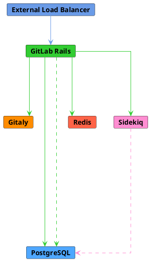
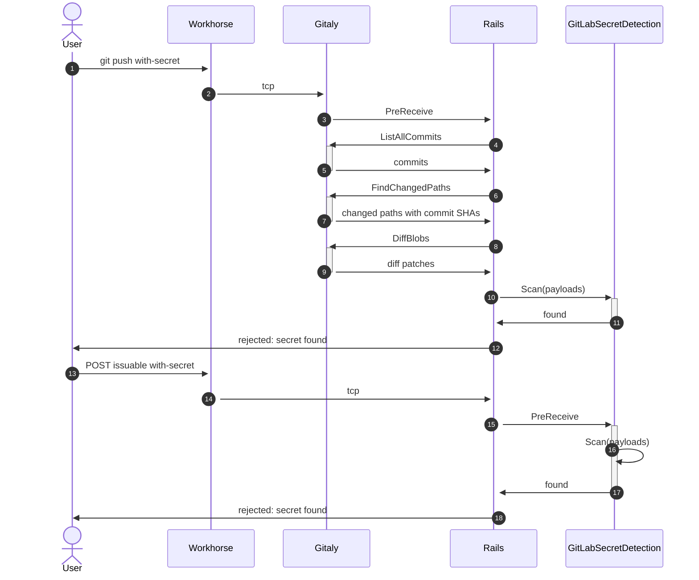
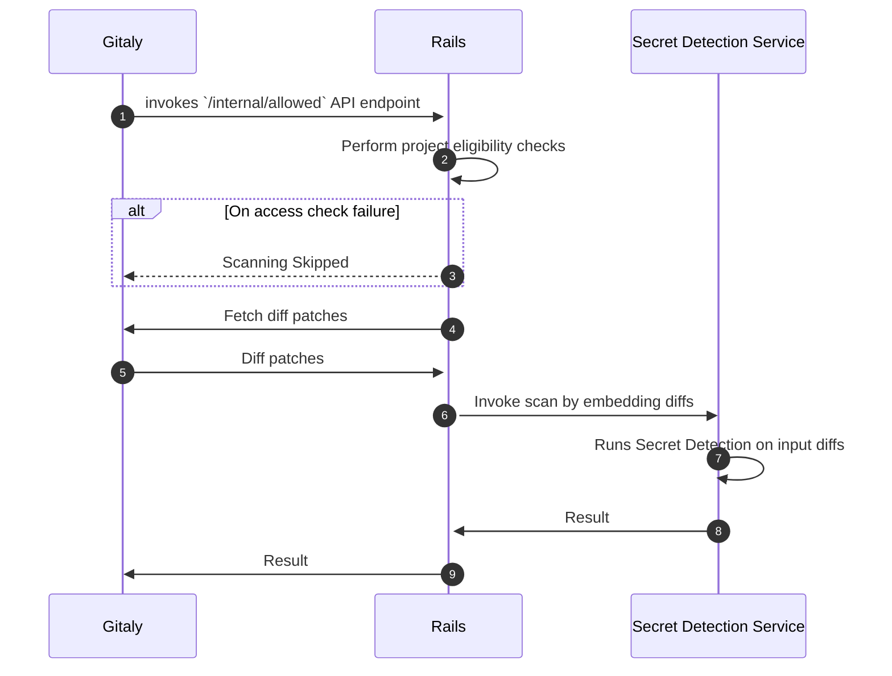
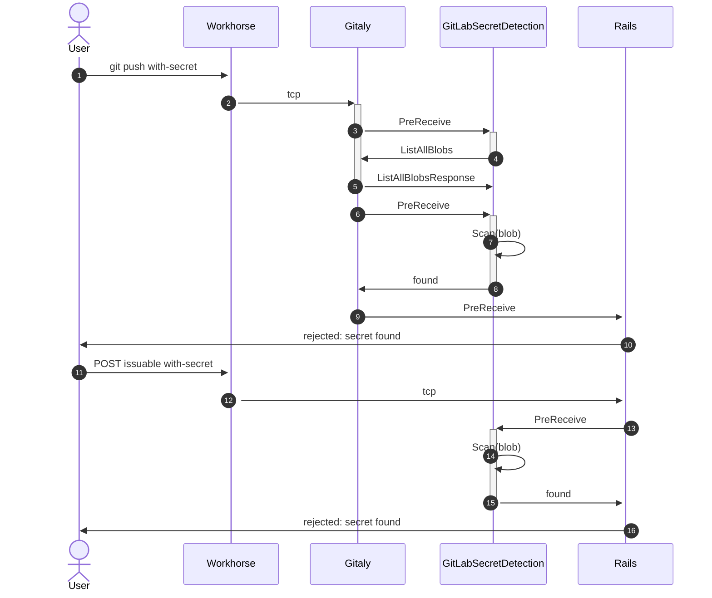

<!-- vale gitlab.FutureTense = NO -->




## 概要

現在のシークレット検出はパイプライン内でリポジトリをスキャンすることに焦点を当てています。私たちはシークレット検出のスコープを広げ、漏洩またはトークンの侵害が発生する可能性がある、より多くの領域をカバーすることを目指しています。

シークレット検出を包括的なプラットフォーム全体の体験へと進化させることで、高リスクなエリアへのカバレッジを拡大します。シークレット検出の機能セットを拡張し、プッシュ前のシークレット検出、ジョブログ内の検出、そしてIssue、エピック、マージリクエスト内の検出を実現します。

## 動機

### 目標

- トークンの漏洩を防ぐためのプラットフォーム全体での検出をサポートする
- 検出されたシークレットを拒否することで露出を防止する
- エンドユーザーの体験を損なうことなくスケーラブルな検出手段を提供する
- トークンパターンとマスキングの統一リスト

スキャン対象の優先順位については[対象タイプ](#target-types)を参照してください。

### 非目標

フェーズ1は[Prereceive Gitインタラクションとブラウザベースの検出](#iterations)の際の拒否のみで、プラットフォーム全体での検出とアラートに限定されます。

シークレットの失効と更新もこの新機能のスコープ外です。

このMVCのスコープ外のスキャン対象オブジェクトタイプは[対象タイプ](#target-types)に含まれています。

#### 管理UI

シークレットを管理するための独立したインターフェースの開発は、このブループリントのスコープ外です。検出されたものはすべて既存の脆弱性管理UIを使用して管理されます。

検出されたシークレットの管理は、[シークレット管理機能](https://docs.gitlab.com/ee/ci/secrets/index.html)とは区別されたままとなります。「検出された」シークレットは、積極的に「管理された」シークレットとはカテゴリーが異なります。検出されたシークレットが特定された場合、それは対象オブジェクト（つまりリポジトリ）に存在することですでに侵害されています。一方、管理されたシークレットは、暗号化や表示時のマスキング（ジョブログやUI上など）を含む、より厳格なセキュアストレージの基準に従って保存される必要があります。

長期的な優先事項として、2つのシークレットタイプの管理を統一することを検討すべきですが、その作業は現在のブループリントの目標のスコープ外です。現在の目標はアクティブな検出に焦点を当てています。

### 対象タイプ {#target-types}

対象オブジェクトタイプとは、漏洩したシークレットの検出のために優先されるスキャン対象を指します。

優先順位の高い順に以下が含まれます:

1. 1メガバイト未満の非バイナリGitブロブ
1. ジョブログ
1. コンテナイメージ
1. Issue、エピック、MRの作成と更新
1. Issue、エピック、MRへのコメント

現時点でスコープ外の対象:

- 1メガバイト超の非バイナリGitブロブ
- バイナリGitブロブ
- メディアタイプ（JPEG、PDFなど）
- スニペット
- Wiki
- 外部メディア（Youtubeプラットフォームの動画）

### トークンタイプ

既存のシークレット検出設定は、さまざまなプラットフォームにまたがる100以上のルールをカバーしています。実行の総コストと偽陽性の可能性を低減するために、専用サービスは明確に定義された低偽陽性（FP）のトークンのみを対象とします。

重要度順に識別するトークンタイプ:

1. 明確に定義されたGitLabトークン（個人アクセストークンとパイプライントリガートークンを含む）
1. 検証済みパートナートークン（AWSを含む）
1. 明確に定義された低FPのサードパーティトークン
1. シークレット検出アナライザーの設定に現在含まれている残りのトークン

明確に定義されたトークンとは、正確な定義を持つトークンのことで、ほとんどの場合、固定されたサブ文字列のプレフィックス（またはサフィックス）と固定長を持ちます。

GitLabとパートナートークンについては、私たち自身のトークンについてよく理解しており、パートナーとの協力により提供されたパターンの正確性を検証しています。

観測による低FPトークンはユーザーの報告と却下レポートに依存しています。[このデータIssue](https://gitlab.com/gitlab-data/product-analytics/-/issues/1225)の完了によってFP率の集計値が得られますが、現時点では主にユーザー報告のデータです。

偽陽性を最小限に抑えるため、高エントロピーの任意の文字列（例: `3lsjkw3a22`のようなパターン）を導入またはアラートする計画はありません。

#### ルール設定の統一性

ルールパターンの設定は `secrets` アナライザーのパッケージされた `gitleaks.toml` 設定に集中管理されたままにし、フェーズ1ではモノリスにベンダーとして組み込み、特定のリリースバージョンと一致することを確認するためにチェックサム検証を行ってドリフトを防ぎます。各トークンは `tags` でフィルタリングして、高信頼度と阻止グループの両方を形成できます。例:

```ruby
prereceive_blocking_rules = toml.load_file('gitleaks.toml')['rules'].select do |r|
  r.tags.include?('gitlab_blocking_p1') &&
    r.tags.include?('gitlab_blocking')
end
```

### 監査可能性

シークレット検出と[検出抑制](#detection-suppression)の両方において重要な側面は、管理者の可視性です。各フェーズでイベント発見を可能にするための監査機能（イベントまたはログ）を含める必要があります。

## 提案

実験的な機能の最初のイテレーションは、Railsアプリケーションに実装されたブロッキングpre-receiveフックを特徴とします。このイテレーションは実験的な状態で限定的なユーザーにリリースされ、専用サービスへの抽出を検討する前にチームが機能をプロファイリングする機会を提供します。

将来の状態として、さまざまなドメインオブジェクトに対してスケーラブルなシークレット検出を実現するために、GitLab配布物と並行してデプロイされる専用のスキャンサービスを作成する必要があります。これは `SecretScanningService` と呼ばれます。

このサービスは以下の特性を持つ必要があります:

- 高パフォーマンス
- 水平スケーラブル
- ドメインオブジェクトのスキャン機能において汎用的

プラットフォーム全体のシークレット検出は、GitLab SaaS と自己管理インスタンスの両方でデフォルトで有効化される必要があります。

### 決定事項

- [001: モノリス内でのRuby Push Checkアプローチの使用](decisions/001_use_ruby_push_check_approach_within_monolith)
- [002: シークレット検出 Gem を同じリポジトリに保存する](decisions/002_store_the_secret_detection_gem_in_the_same_repository)
- [003: サブプロセス内でスキャンを実行する](decisions/003_run_scan_within_subprocess)
- [004: スタンドアロンシークレット検出サービス](decisions/004_secret_detection_scanner_service)
- [005: サービスデプロイにRunwayを使用する](decisions/005_use_runway_for_deployment)
- [006: すべてのGitLab環境への統合SDサポート](decisions/006_support_for_all_environments)
- [007: VectorscanベースのGoスキャンエンジンへの切り替え](decisions/007_switch_to_go_scan_engine)
- [008: 統合SDスキャナー](decisions/008_unified_scanner)
- [009: 汎用シークレットの検出](decisions/009_generic_secrets)

## 課題

- GitLab.comインフラへのセキュアな認証
- 大きなブロブに対するスキャンのパフォーマンス
- ドメインオブジェクトの量（プッシュ頻度など）に対するスキャンのパフォーマンス
- スキャンリクエストのキューイング

### 大きなGitデータブロブの転送最適化

[GitalyのUpload-packトラフィックブループリント](https://docs.gitlab.com/ee/architecture/blueprints/gitaly_handle_upload_pack_in_http2_server/index.html#git-data-transfer-optimization-with-sidechannel)で説明されているように、gRPCを通じた大容量データ転送の処理で過去に問題が発生しています。シークレットの漏洩カバレッジを高めるために大きなブロブサイズへシークレット検出を拡張するにつれて、これが懸念事項となる可能性があります。1メガバイトのブロブサイズ制限でpre-receiveスキャンをロールアウトする予定で、これは境界内に十分収まる見込みです。[Protobufferのドキュメント](https://protobuf.dev/programming-guides/techniques/#large-data)より:

> 一般的な経験則として、それぞれが1メガバイトを超えるメッセージを扱う場合は、代替戦略の検討が必要になるかもしれません。

拡張フェーズでは、Gitalyが使用している最適化されたサイドチャネルアプローチのようなチャンキングや代替戦略を検討する必要があります。

## 設計と実装の詳細

検出機能は、モノリスに直接実装された実験的コンポーネントから、テキストブロブを汎用的にスキャンできるスタンドアロンサービスへの多段階ロールアウトに依存しています。

シークレットスキャンサービスの実装は、GitLab.comと[リファレンスアーキテクチャ](https://docs.gitlab.com/ee/administration/reference_architectures/index.html)の両方に対するベンチマーキングと容量計画の結果に大きく依存しています。スキャン機能はSaaSと自己管理インスタンスの両方でデフォルトで有効なコンポーネントである必要があるため、[各イテレーション](#iterations)のデプロイ特性によって、サービスがスタンドアロンコンポーネントとして動作するか、Railsアーキテクチャのサブプロセスとして実行されるか（Elasticsearch インデックスサービスの実装と同様）が決まります。

詳細な背景については[技術的調査](https://gitlab.com/gitlab-org/gitlab/-/issues/376716)を参照してください。

スケーリングアプローチに関する過去の議論については[このスレッド](https://gitlab.com/gitlab-org/gitlab/-/merge_requests/105142#note_1194863310)を参照してください。

### 検出エンジン

#### 初期の決定

現在のシークレット検出はパイプラインコンテキストでのすべてのシークレットスキャンに[Gitleaks](https://github.com/gitleaks/gitleaks/)を使用しています。`--no-git` 設定を使用することで、リポジトリコンテキスト外の任意のテキストブロブをスキャンし、非パイプラインスキャンに引き続き使用できます。

検出エンジンの変更は、ベンチマーキングによってパフォーマンス上の懸念が明らかになるまではスコープ外です。

GitLabシークレット検出の長期的な方向性において、そのスコープはGitleaksツールのスコープを超えています。そのため、Gitleaksドメインを関連するビルドコンテキストのみに限定するために、機能のカプセル化を検討すべきです。

pre-receive検出の場合、事前フィルタリングのためのキーワード/サブ文字列マッチと正規表現検出のための `re2` の組み合わせに依存しています。初期ベンチマークについては[スパイクIssue](https://gitlab.com/gitlab-org/gitlab/-/issues/423832)を参照してください。

注目すべき代替案には、[Hyperscan](https://github.com/intel/hyperscan)やそのポータブルフォーク[Vectorscan](https://github.com/VectorCamp/vectorscan)などの高性能正規表現エンジンがあります。パフォーマンス特性が既存のスタックを超える必要性を示している場合は、将来的にこれらのシステムを検討する価値があるかもしれません。ただし、実装言語の考慮事項については[ADR 001](decisions/001_use_ruby_push_check_approach_within_monolith)を参照してください。独立してスケーラブルで汎用的なスキャンエンジンを構築するチームのベロシティが優先されました。

#### 最近の考慮事項

スキャンエンジンとして、Goにポートされた[Vectorscan](https://github.com/VectorCamp/vectorscan)正規表現エンジンを使用します。言語とエンジンの考慮事項については[ADR 007](decisions/007_switch_to_go_scan_engine.md)を参照してください。

### 組織レベルのコントロール

設定とワークフローは[組織](https://docs.gitlab.com/ee/architecture/blueprints/organization/index.html)を中心に構成する必要があります。検出コントロールとガバナンスパターンは、共有アローリスト、組織全体のポリシー（プッシュオプションのバイパス無効化など）、監査可能性を強調する統一した方法で、複数のプロジェクトとグループにまたがって設定をサポートする必要があります。

インスタンスレベルから組織レベルのコントロールへのイテレーションとして、各フェーズで使用されるパラダイムを文書化します。

### フェーズ1 - Ruby pushcheck pre-receive統合

[上記の目標](#goals)に概説された重要なパスは、2つの主要なオブジェクトタイプをカバーしています: Gitテキストブロブ（プッシュイベントに対応）と任意のテキストブロブ。フェーズ1では、Gitテキストブロブのみに完全に焦点を当てます。

プッシュイベントの検出フローは、[PushCheckインターフェース](https://gitlab.com/gitlab-org/gitlab/blob/3f1653f5706cd0e7bbd60ed7155010c0a32c681d/lib/gitlab/checks/push_check.rb)を使用してコミットデータをスキャンするPreReceiveフックへのサブスクライブに依存しています。スキャンは（`DiffBlobs`を介して）フルブロブコンテンツではなくdiffパッチで動作し、スキャン対象を各コミット内の変更行のみに削減します。シークレットが検出されるとプッシュが拒否されます。シーケンスについては[プッシュイベント検出フロー](#push-event-detection-flow)を参照してください。

プッシュ検出の場合、コミットはインラインで拒否され、エラーがエンドユーザーに返されます。

#### 設定

このフェーズは、インスタンスレベルのアプリケーション設定を通じて顧客のオプトインを限定した「実験的」と見なされます。

#### 高レベルアーキテクチャ

フェーズ1のアーキテクチャは追加コンポーネントを含まず、Railsアプリケーションサーバーに完全にカプセル化されています。これにより、認証境界内での緊密な統合と配布調整なしに迅速なデプロイが可能になります。

主な欠点は、既存のアプリケーションノードへのCPU、メモリ、転送量、リクエストレイテンシの追加という、リソース利用に関するものです。



#### プッシュイベント検出フロー {#push-event-detection-flow}



#### Gemスキャンインターフェース

フェーズ1では、GitLab Railsプラットフォームの[Secrets Push Check](https://gitlab.com/gitlab-org/gitlab/-/blob/5dfcf7431bfff25519c05a7e66c0cbb8d7b362be/ee/lib/gitlab/checks/secrets_check.rb)によって呼び出される非公開の[シークレット検出RubyGem](https://gitlab.com/gitlab-org/gitlab/-/tree/5dfcf7431bfff25519c05a7e66c0cbb8d7b362be/gems/gitlab-secret_detection)を使用します。

非公開SDGemは、複数のペイロードでスキャンを実行することに加えて、以下のサポートを提供します:

- スキャン全体と各ブロブレベルに対する設定可能なタイムアウト。

- サブプロセス内でスキャンを実行する機能。リクエストごとにスポーンされるプロセス数は[`5`](https://gitlab.com/gitlab-org/gitlab/-/blob/5dfcf7431bfff25519c05a7e66c0cbb8d7b362be/gems/gitlab-secret_detection/lib/gitlab/secret_detection/scan.rb#L29)に制限されています。

Pre-receive シークレット検出スキャン中に参照されるルールセットファイルは[こちら](https://gitlab.com/gitlab-org/gitlab/-/blob/2da1c72dbc9df4d9130262c6b79ea785b6bb14ac/gems/gitlab-secret_detection/lib/gitleaks.toml)にあります。

Gemの詳細については[README](https://gitlab.com/gitlab-org/gitlab/-/blob/master/gems/gitlab-secret_detection/README.md)ファイルを参照してください。Gemコードの保存と配布方法については[ADR 002](decisions/002_store_the_secret_detection_gem_in_the_same_repository)も参照してください。

### フェーズ2 - スタンドアロンシークレット検出サービス

このフェーズは、一般提供に向けてモノリスの外にサービスをスケーリングし、機能のリソース消費を分離し、保守性を向上させることを重視します。[上記の目標](#goals)に概説された重要なパスは、2つの主要なオブジェクトタイプをカバーしています: Gitテキストブロブ（プッシュイベントに対応）と任意のテキストブロブ。フェーズ2では、Gitテキストブロブに引き続き焦点を当てます。

サービスの責任は、与えられた入力ブロブに対してシークレット検出スキャンを実行することに限定されます。サービスの詳細は[ADR 004: シークレット検出スキャナーサービス](decisions/004_secret_detection_scanner_service)に概説されています。

専用サービスの導入はシークレットプッシュ保護のワークフローに影響を与え、[`use_secret_detection_service` 運用機能フラグ](https://docs.gitlab.com/administration/feature_flags/list/#eeonlyproduct)によって制御されるモノリスの負荷を軽減するフォールバックを提供します。有効にすると、モノリスは[Runwayにデプロイされたスキャン](https://gitlab.com/gitlab-org/security-products/secret-detection/secret-detection-service)にスキャンをルーティングします。無効の場合、シークレットスキャンはモノリスにインストールされたSDGemで実行されます。このフラグはデフォルトで無効になっています。このフラグにより、モノリスの負荷が問題になった場合に、オペレーターはスキャンを専用サービスにオフロードできます。

シークレットプッシュ保護のワークフローは以下の通りです:



シークレット検出サービスは前のフェーズの機能スケーラビリティと共有リソース消費という制限に対処します。しかし、シークレットプッシュ保護ワークフローでは、Railsモノリスが大量のGitブロブをGitalyから自分のメモリに読み込んでからシークレット検出サービスに渡す必要があります。

### フェーズ2.1 - Gitalyから直接プッシュ保護を呼び出す

前のフェーズまで、特にシークレットプッシュ保護のためにGitalyとRailsの間で複数のホップが行われており、秘密スキャンのためにGemまたはサービスに渡すGitブロブを保持するためにかなりの量のRailsメモリが占有されています。この問題は、シークレット検出サービスとGitalyの間の[カスタムpre-receiveフック](https://docs.gitlab.com/ee/administration/server_hooks.html#create-global-server-hooks-for-all-repositories)またはGitalyの新しい[プラグインベースアーキテクチャ](https://gitlab.com/gitlab-org/gitlab/-/merge_requests/143582)などの標準インターフェースを通じた直接的なインタラクションによって軽減できます。この設定により、RailsがGitalyとサービスの間のブロブメッセンジャーである必要がなくなります。

Gitalyの新しい[プラグインベースアーキテクチャ](https://gitlab.com/gitlab-org/gitlab/-/merge_requests/143582)は、Gitブロブリポジトリへの合理的なアクセスを提供するため、GitalyとRPCサービスの間のインタラクションに適したインターフェースです。ただし、Gitalyチームはまだ開発に着手していません。

_プラグインアーキテクチャの開発に関する更新があり次第、フェーズ2.1の詳細が追加されます。_

### フェーズ3 - プッシュ保護サービスを超えた拡張

スタンドアロンシークレット検出サービスは現在GitLab.com環境でサポートされています。SDサービス（GitLab.com）と組み込みシークレット検出モジュール（自己管理/Dedicated）のハイブリッドアプローチを引き続き使用します。組み込みシークレット検出モジュールとは、GitLab Railsホストマシンにインストールされた、RubyGemまたは実行可能バイナリの形式のローカルホストのシークレット検出アプリケーションです。

シークレットプッシュ保護はgit差分（対象タイプ）に対してブロッキング方式でスキャンを実行し、即座にスキャン結果を提供する必要があります。このアプローチは他のスキャン対象タイプ（特にジョブアーティファクトやジョブログなど大きなサイズのもの）に対して技術的にスケーラブルではありません。そのため、Sidekiq経由の非ブロッキングスキャンをサポートすることにしました。

上記の決定の詳細は[こちら](./decisions/006_support_for_all_environments.md)で読めます。


#### 統合SDスキャナーの高レベル設計

すべてのスキャン対象タイプに対する単一のシークレット検出スキャナー。さまざまなスキャン対象タイプに対するシークレット検出の全体的な設計は、以下の図のようになります:


統合SDスキャナーの詳細については[こちら](decisions/008_unified_scanner.md)を参照してください。

#### ワークアイテムのSD検出フローの概要

Issue コメントなどの任意のテキストブロブの検出フローは、`Notes::PostProcessService`（または同等のサービス）へのサブスクライブに依存し、オブジェクトタイプとドメインオブジェクトの主キーによってテキストブロブを処理するために `SecretScanningService` へのSidekiqリクエストをキューに入れます。`SecretScanningService` は関連するテキストブロブを取得し、コンテンツをスキャンし、シークレットが検出されるとRailsアプリケーションに通知します。

#### ジョブログのSD検出フローの概要

ジョブログの検出フローは、オブジェクトストレージへのアーカイブ中にログを処理する必要があります。任意のトレースチャンクのルックバックのバッファリングにおける追加の複雑さと、ストリーミング中のスキャンについての議論は[このIssue](https://gitlab.com/groups/gitlab-org/-/epics/8847#note_1116647883)を参照してください。

#### 設定

このフェーズは「一般提供」として考慮され、デフォルトでオンとなり、組織レベルの設定による無効化設定があります。

#### 高レベルアーキテクチャ

フェーズ2で定義されたアーキテクチャに変更はありませんが、個々の負荷要件によって検出サービスのノード数のスケールアップが必要になる場合があります。

#### プッシュイベント検出フロー

フェーズ2で定義されたプッシュイベント検出フローに変更はありませんが、Railsから任意のテキストブロブを直接スキャンする追加機能により、Issuableの作成に対してもpre-receiveのような動作をエミュレートできます（優先オブジェクトタイプについては[対象タイプ](#target-types)を参照してください）。



### 将来のフェーズ

これらは常時オンの完全な機能体験を提供するための重要なアイテムですが、まだフェーズには優先的に組み込まれていません。

### 大きなブロブサイズ（1MB以上）

現在のフェーズには1MB以上のブロブサイズの拡張は含まれていません。主な制限は[将来のイテレーションのRPC転送制限に適合するため](#transfer-optimizations-for-large-git-data-blobs)に選択されましたが、追加のブロブサイズのサポートに拡張すべきです。これは2つの方法で実現できます:

1. _Post-receive処理_

    非ブロッキング方式でブロブを受け入れ、バックグラウンドジョブとしてスキャンを処理し、特定のシークレットの検出時に受動的にアラートを送信します。

1. _スキャンロジックのバッチ処理の改善_

    1MBの制約を維持することは主に、期待されるトランスポートプロトコルに合わせるための将来対応です。これは、別のトランスポート（http、ディスクからの読み込みなど）を使用するか、ブロブサイズをスライスすることで軽減できます。

### 検出抑制 {#detection-suppression}

検出の抑制と漏洩シークレットへの対応は、いくつかのレベルでサポートされます。

1. _グローバル抑制_ - シークレットが偽のトークン（例: `EXAMPLE`）である可能性が高い場合、ユーザーが著しく不便を感じるワークフローコンテキストでは抑制されるべきです。

    [監査イベント](#auditability)または[自動脆弱性解決](https://docs.gitlab.com/ee/user/application_security/sast/index.html#automatic-vulnerability-resolution)を通じて、これらの結果をトリアージするための手段を提供する必要があります。

1. _組織抑制_ - シークレットが組織のアローリストに一致する場合（または以前にフラグが立てられ無関係として対処された場合）、再発生すべきではありません。[組織レベルのコントロール](#organization-level-controls)を参照してください。

1. _インライン抑制_ - インラインアノテーションは後のフェーズでサポートされ、アノテーションを無視する組織レベルの設定が追加されます。

### 外部トークン検証

検出のポスト処理ステップとして、検出されたシークレットの検証を検討すべきです。これには、有効な漏洩と偽陽性を区別できるサポートトークンタイプごとのプロセッサーが必要です。[漏洩したシークレットへの自動対応](https://docs.gitlab.com/ee/user/application_security/secret_detection/automatic_response.html)と同様に、アラートの信頼性を高めるために外部からトークンを検証する必要があります。

トークンタイプには内部と外部の2種類があります:

- 内部トークンは `ScanSecurityReportSecretsWorker` ワーカーの一部として検証可能かつ失効可能
- 外部トークンには外部検証が必要で、[そのアーキテクチャ](https://docs.gitlab.com/ee/user/application_security/secret_detection/automatic_response.html#high-level-architecture)は[Secret Revocation Service](https://gitlab.com/gitlab-com/gl-security/engineering-and-research/automation-team/secret-revocation-service/)と密接に一致します

## イテレーション {#iterations}

- ✓ [検出カバレッジとアクションの要件](https://gitlab.com/gitlab-org/gitlab/-/issues/376716)の定義
- ✓ [コメント/IssueにおけるGitLabトークンのブラウザベース検出](https://gitlab.com/gitlab-org/gitlab/-/issues/368434)の実装
- ✓ [シークレットスキャンサービスのPoC](https://gitlab.com/gitlab-org/secure/pocs/secret-detection-go-poc/)
- ✓ [シークレットスキャンGemのPoC](https://gitlab.com/gitlab-org/gitlab/-/issues/426823)
- [pre-receive PoCの本番前パフォーマンスプロファイリング](https://gitlab.com/gitlab-org/gitlab/-/issues/428499)
  - サービス機能のプロファイリング
    - ✓ [RubyとGoアプローチ間の正規表現パフォーマンスのベンチマーキング](https://gitlab.com/gitlab-org/gitlab/-/issues/423832)
    - 転送レイテンシ、CPU、メモリフットプリント
- ✓ シークレットスキャンGem統合MVCの実装（個別コミットを対象）
- フェーズ1 - デプロイと監視
- サービスコンポーネントのリファレンスアーキテクチャのヘッドルームへの追加に向けた容量計画
- セキュリティとレディネスレビュー
- フェーズ2 - デプロイと監視
- シークレットスキャンサービスの実装（任意のテキストブロブを対象）
- フェーズ3 - デプロイと監視
- 高優先度ドメインオブジェクトのロールアウト（優先度 `TBD`）
  - Issuableコメント
  - Issuable本文
  - ジョブログ
