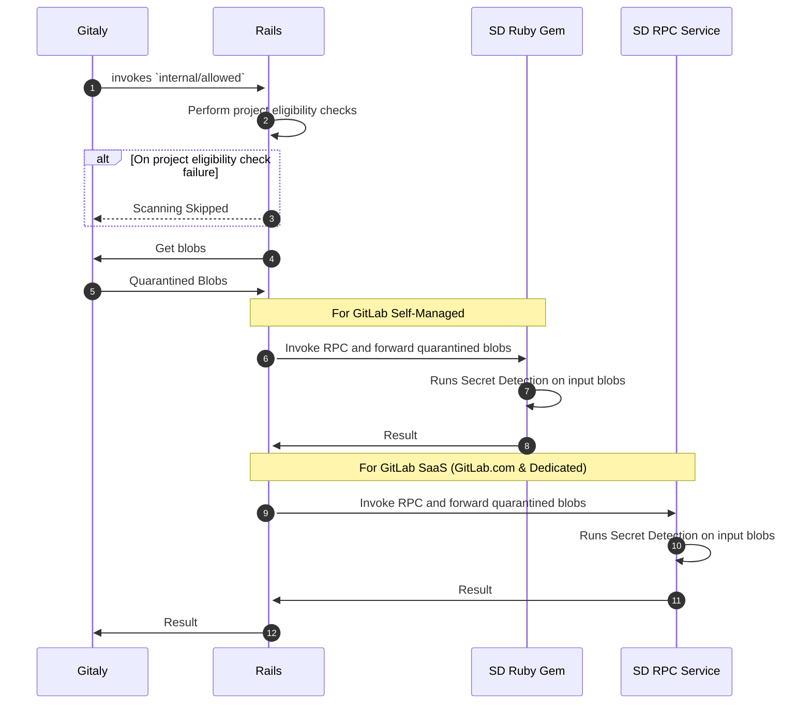

## 背景

[シークレット検出サービス](004_secret_detection_scanner_service.md)は、GitLab CI環境を通じた自動デプロイを実行するための戦略が必要です。

## 提案されたソリューション: Runway

[Runway](https://gitlab.com/gitlab-com/gl-infra/platform/runway#runway) - チームがサービスを迅速かつ安全にデプロイして実行できるようにすることを目的としたGitLab内部のPlatform as a Service - を使用できます。

### プラットフォームツールサポート

- **ロギング**: Runway ではGitLab管理のElasticsearch/KibanaスタックのJasonロギングが[利用できず](https://gitlab.com/gitlab-com/gl-infra/platform/runway/team/-/issues/84#top)、近い将来にサポートする[計画もないようです](https://gitlab.com/gitlab-com/gl-infra/platform/runway/team/-/issues/84#note_1691419608)。現時点での回避策は[Google Cloud Run UI](https://cloud.google.com/run/docs/logging)でログを確認することです。

- **可観測性**: Runwayは監視スタックとの統合によりサービスの可観測性をサポートしています。Runwayが提供する[デフォルトメトリクス](https://docs.runway.gitlab.com/reference/observability/#dashboards)（[ダッシュボードの例](https://dashboards.gitlab.net/d/runway-service/runway3a-runway-service-metrics?orgId=1)）は、監視に必要なすべてのシステムメトリクスをカバーしています。

- **障害時のページャーアラート**: Runwayはデフォルトで以下の異常に対して[アラート](https://docs.runway.gitlab.com/reference/observability/#alerts)を生成します。これで開始するには十分だと考えています:

  - `Apdex SLO violation`
  - `Error SLO violation`
  - `Traffic absent SLO violation`

- **サービスレベルインジケーター（SLI）**: Runwayが提供する[デフォルトメトリクス](https://docs.runway.gitlab.com/reference/observability/#dashboards)（[ダッシュボードの例](https://dashboards.gitlab.net/d/runway-service/runway3a-runway-service-metrics?orgId=1)）は必要な[SLI要件](004_secret_detection_scanner_service.md#service-level-indicatorsslis)をカバーしています。

- **インサイト**: ルールパターンのレイテンシ、使用回数、ソースなどの追加メトリクスが必要になる場合があります。カスタムメトリクスを使用する可能性があり、近日中にさらに評価を行います。

### 既知の制限（シークレット検出サービスに関連するもの）

- ~~GRPCプロトコルのサポートなし~~ 更新: [GRPCがサポートされるようになりました](https://gitlab.com/gitlab-com/gl-infra/platform/runway/runwayctl/-/merge_requests/421#note_1934369305)
- GitLab 自己管理環境のサポートなし（[参考](https://gitlab.com/gitlab-com/gl-infra/platform/runway/team/-/issues/236)）

### 制限への対応

Runwayが自己管理（SM）環境をサポートしていないという制限により、SM環境向けの他のソリューションを評価することになりました。[Cloud Connector](https://docs.gitlab.com/ee/architecture/blueprints/cloud_connector/index.html)のAPIベースのアプローチは、SM環境に対する不足しているデプロイソリューションを概ね解決します。しかし、シークレットプッシュ保護機能はGitalyとサービス間でリアルタイムに大量のデータを頻繁に転送する必要があるため、RESTベースのAPIはRPCリクエストでのデータストリーミングとは異なり大幅なネットワークオーバーヘッドを追加するため適切ではありません。Cloud Connectorのアプローチをある程度の追加の複雑さで最適化することもできますが、RunwayがSM環境向けの[デプロイソリューション](https://gitlab.com/gitlab-com/gl-infra/platform/runway/team/-/issues/236)を導入するまでの時間の問題です。SM環境向けの[もう1つの代替ソリューション](https://gitlab.com/gitlab-org/gitlab/-/issues/462359#note_1913306661)は、DockerイメージのアーティファクトをデプロイJasonの説明とともに顧客と共有すること（[カスタムモデルアプローチ](https://docs.gitlab.com/ee/architecture/blueprints/custom_models/index.html#ai-gateway-deployment)と同様）でしたが、水平スケーリングが懸念事項になる可能性がありました。

ハイブリッドソリューションを考案しました。GitLab SaaSのスケールに対応するために、[Runway](https://gitlab.com/gitlab-com/gl-infra/platform/runway)を使用してデプロイされた専用のRPCベースのシークレット検出サービスを持ちます。このサービスはSDのリソース使用量を他のサービス（RailsとGitaly）への影響なく分離し、必要に応じて独立してスケーリングできます。一方、自己管理インスタンスについては、そのアプローチが最大GET [50K リファレンスアーキテクチャ](https://gitlab.com/gitlab-org/quality/performance/-/wikis/Benchmarks/Latest/50k)まで[適切に機能した](https://gitlab.com/gitlab-org/gitlab/-/issues/431076#note_1755614298 "メトリクス（レイテンシ、メモリ、CPUなど）の有効化と収集")ため、現在のGemベースのアプローチを継続します。RunwayがデプロイJasonサポートを導入した時点で、最終的に自己管理環境をRunwayに移行します。

**まとめ:** GitLab SaaSにはRunwayを使用してデプロイされたRPCサービスを使用し、GitLab 自己管理インスタンスには現在のRuby Gemアプローチを継続します。

シークレットスキャンのコア実装を再利用するために、2つの異なる配布方式を持つ単一のソースコードを持ちます:

1. シークレット検出ロジックをRubyGemでラップし、Rails内で使用する（現在のGemを置き換える）。

1. シークレット検出ロジックをRPCサービスでラップし、[Runway](https://gitlab.com/gitlab-com/gl-infra/platform/runway)を使用してデプロイし、GitLab SaaSのRailsからサービスを呼び出す。

{width="1001" height="311"}

提案された変更を示すワークフロー:

## 参考リンク

- [Runway ドキュメント](https://docs.runway.gitlab.com/)
- [エピック: Runway - AIイノベーションをサポートするプラットフォームツール](https://gitlab.com/groups/gitlab-com/gl-infra/-/epics/969)
- [ブループリント: GitLabサービス統合: AIとその先へ](https://docs.gitlab.com/ee/architecture/blueprints/gitlab_ml_experiments/index.html)
