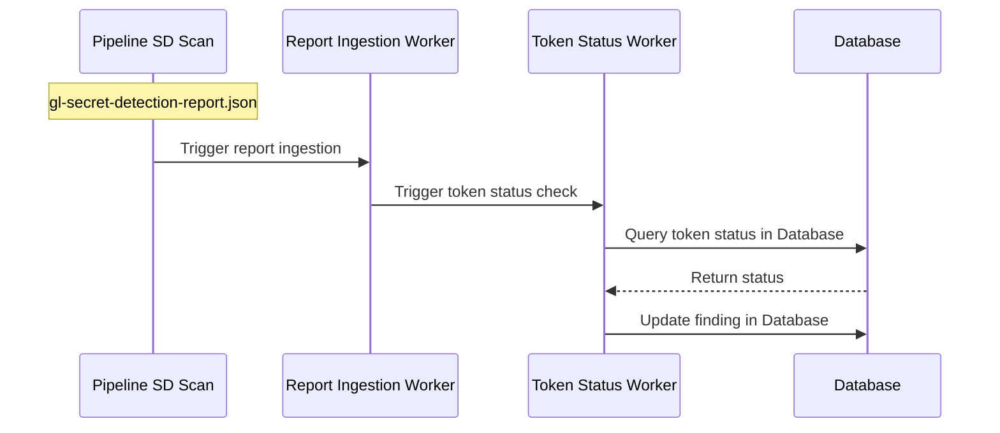
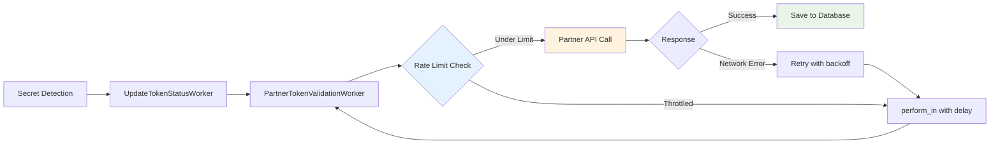
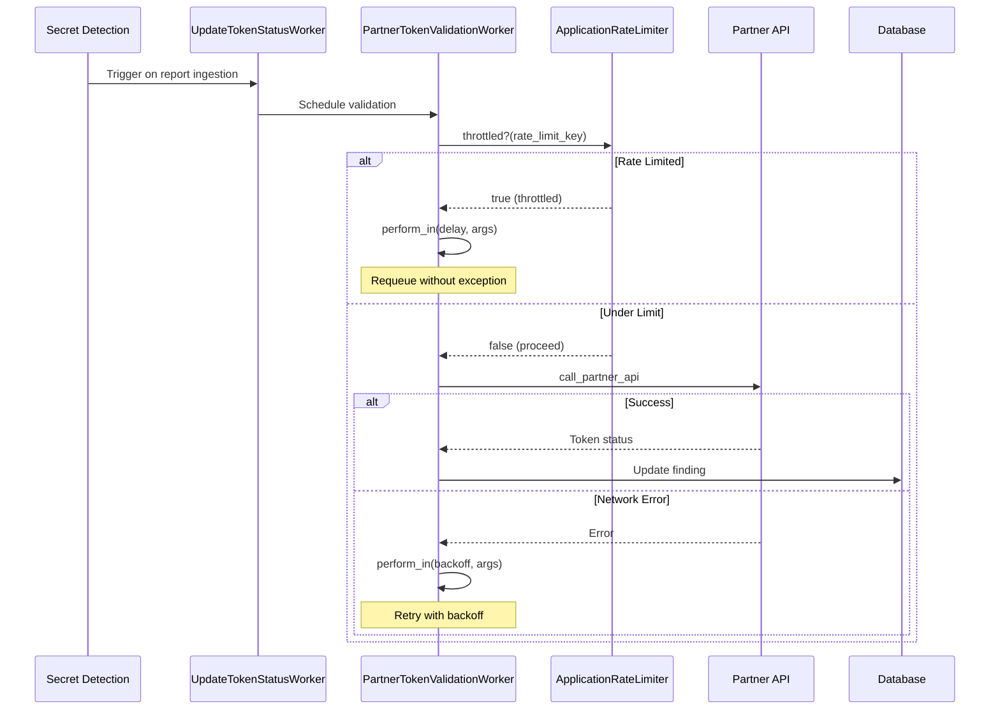



## 概要

Secret Detection の検出結果を、発行サービスに対してプログラムでチェックすることで、有効性と活性（liveness）を検証します。これにより、セキュリティチームは無効化または非アクティブな認証情報よりもアクティブなシークレットの修復を優先できます。

詳細については、[Secret Detection の検出結果の有効性/活性を検証するエピック](https://gitlab.com/groups/gitlab-org/-/epics/13988)を参照してください。

## モチベーション

### ゴール

- GitLab および partner トークンの両方に対して、Ultimate のお客様向けに**トークン有効性ステータスを提供する**
- 厳格なレート制限への準拠とともに、**partner トークンの検証を有効にする**（AWS、GCP、Postman 等）
- 追加インフラなしで **SaaS とセルフマネージドの両方のデプロイをサポートする**
- レート制限を障害ではなく期待される条件として扱うことで、**エラーバジェットを保全する**

### 非ゴール

- クロススキャナー統合（DAST への拡張）
- 他の[ターゲットタイプ](../secret_detection/#target-types)へのサポートの拡張
- 汎用 API ゲートウェイサービスの構築
- 任意のサードパーティ検証エンドポイントのサポート
- スキャン実行中のリアルタイム同期検証

## 提案

セキュリティスキャン中に検出されたトークンの検証プロセスを自動化します。この機能は以下を実現します。

- GitLab および partner トークンのトークンステータス（Active、Inactive、Unknown）を検証し、脆弱性ページに結果を表示する
- トークンステータスによる検出結果のソートとフィルタリングを可能にする
- GitLab および partner プラットフォームのトークンをサポートする
- クラウドおよびセルフマネージド/エアギャップインスタンスで動作する
- 使用状況と有効性を測定するテレメトリーを含む

お客様はセキュリティ設定を使用してオプトインできます。有効にすると、検出されたトークンは発行サービスに対して自動的に検証され、ステータス情報が脆弱性詳細ページとセキュリティダッシュボードに表示されます。これにより、セキュリティチームはアクティブな認証情報の修復を優先できます。

## 決定事項

- [001: トークンステータスチェックへの Sidekiq ワーカーアプローチの使用](decisions/001_use_sidekiq_worker_approach_for_token_status_checking.md)
- [002: SDRS 通信への gRPC より REST の使用](decisions/002_use_rest_over_grpc_for_sdrs_communication.md) *（廃止）*
- [003: Secret Detection Response Service の使用](decisions/003_use_sdrs_service.md) *（廃止）*
- [004: SDRS の代わりにダイレクト partner API 呼び出しの使用](decisions/004_use_direct_partner_api_calls.md)

## 課題

- **レート制限への準拠**: Partner API の制限は厳しい（例: Postman: 5 req/s）
- **エラーバジェットの保全**: レート制限と実際の障害を区別しなければならない
- **リフレッシュエンドポイントの乱用防止**: 手動のトークンステータスリフレッシュ機能は悪意のある過剰な使用から保護される必要がある
- **機能レベルの乱用防止**: 有効性チェック機能全体には、特に partner トークンのステータスチェックの量と頻度に関して、乱用を防ぐためのセーフガードが必要
- **将来のスケーラビリティ**: GitLab.com スケールに向けた dedicated な partner エンドポイントが必要になる場合がある

## 設計と実装の詳細

有効性チェック機能は、Experiment、Beta、GA の3フェーズのロールアウトに依存しています。各フェーズは前のフェーズを基に構築し、包括的なトークンステータスチェック体験を提供します。

### Experiment フェーズ - GitLab トークンのステータス表示

Experiment フェーズは GitLab トークンのみに焦点を当て、Sidekiq ワーカーアプローチを使用してトークンステータスチェックを実装します。
Secret Detection スキャンが実行され、そのレポートが取り込まれると、Sidekiq ワーカーが自動的にトリガーされます。このワーカーは以下を行います。

- スキャン中に検出されたすべての GitLab トークンを処理する
- データベースで各トークンの現在のステータスを確認する
- 対応する脆弱性の検出結果に以下の3つのステータス値のいずれかを割り当てる:
  - Unknown: ステータスチェックを完了できなかった
  - Active: トークンは現在アクティブ
  - Inactive: トークンはもはやアクティブではない

### Beta フェーズ - ユーザーエクスペリエンスとコントロールの強化

Beta フェーズでは、ユーザーエクスペリエンスの向上と有効性チェック機能に対する顧客コントロールの提供に焦点を当てます。

### GA フェーズ - Partner 統合

GA フェーズでは、トークンステータスの検証を partner プラットフォームのトークンに拡大し、GitLab と partner サービス全体にわたる包括的な可視性を提供します。

### アーキテクチャの概要

### 実行フロー

## セキュリティに関する考慮事項

[#562364](https://gitlab.com/gitlab-org/gitlab/-/issues/562364) のセキュリティ分析に基づき、以下のリスクを特定して対処しました。

### サービス拒否（DoS）対策

**リスク:** 悪意のあるユーザーが複数のパイプラインにわたって多数のシークレットを含む `gl-secret-detection-report.json` ファイルを生成することで、Sidekiq に検証リクエストを大量に送り込む可能性があります。

**緩和策:**

- トークン検証リクエストに対するプロジェクトごとのレート制限を実装する
- partner API 障害に対するサーキットブレーカーパターンを追加する
- 異常な検証パターンを監視してアラートを出す

### レスポンス解析のセキュリティ

**リスク:** サードパーティ API のレスポンスを解析すると、不正なデータインジェクションや予期せず大きなレスポンスにモノリスが晒されます。

**緩和策:**

- 厳格なレスポンスサイズ制限（レスポンスごとに最大 10KB）
- 解析前のレスポンススキーマ検証
- API 呼び出しのタイムアウト強制
- ストレージ前のすべてのデータのサニタイズ

### 認証情報の管理

**リスク:** モノリスに保存された Partner API キーがセルフマネージドインスタンスで露出する可能性があります。

**緩和策:**

- 現在の partner API（AWS、GCP、Postman）はパブリックエンドポイントを使用しており、認証情報は不要
- 将来のプライベート API には、キーローテーションを伴う暗号化された設定を使用する
- 許可された partner エンドポイントの許可リストを実装する
- すべての partner API 設定変更の監査ログ

### 入力検証

**リスク:** 悪意のあるまたは不正な形式のトークンが partner API または検証ロジックを悪用する可能性があります。

**緩和策:**

- API 呼び出し前のトークンフォーマット検証
- トークン値の長さ制限（最大 4KB）
- 文字セット検証
- 列挙を防ぐためのトークンパターンごとのレート制限

### 監視とアラート

セキュリティ問題を検出するための包括的な監視を実装します

## 代替ソリューション

### SDRS サービスアプローチ（見送り）

当初は別サービスアーキテクチャが提案されていましたが、以下の発見後に棄却されました。

- すべての partner API はパブリック
- 保護された認証情報は不要
- セルフマネージドのインフラ複雑さが増大する
