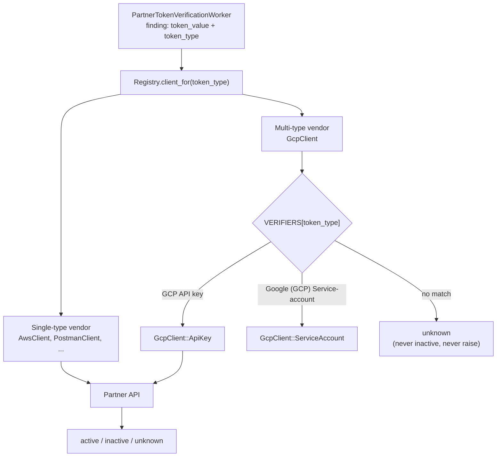

## 概要

検出ルールからすでに分かるトークンタイプを検証器に渡し、正しい API 呼び出しの選択に使うことを提案します。これにより、ベンダーの追加は、固定パターンに従う 1 つのクライアントクラスと 1 つのレジストリエントリで繰り返し可能になります。この方法なら、有効性チェックを現在の 3 ベンダーから、スコープ内の 39 ベンダーにまたがる 60 以上のトークンタイプへ拡大できます（[ベンダー拡張エピック 20343](https://gitlab.com/groups/gitlab-org/-/work_items/20343)）。

## コンテキスト

有効性チェックは、検出されたシークレットが有効かどうかを確認するためにパートナー API を呼び出します。現在のコードは、1 ベンダー = 1 エンドポイント = 1 つのチェック方法と仮定しています。各ベンダーは、1 つの `verify_partner_token` メソッドを持つ単一の `BaseClient` サブクラスです。

しかし、複数種類のトークンを発行するベンダーもあり、種類ごとに異なる API エンドポイントが必要です。たとえば、GitHub PAT と App トークンは異なるエンドポイントに送信され、返されるレスポンスの形も異なります。現在、各ベンダーには 1 つの検証器クラスがあり、受け取ったトークンの種類を判定するためにトークン文字列に対して正規表現マッチングを実行します。

実際にはトークンタイプが不明なわけではなく、検証器レイヤーがその情報を捨てています。各検出結果には一致した検出ルール（たとえば `GCP API key`）が保存され、レジストリはすでにそのルール ID を使って呼び出すクライアントクラスを選択しています。しかし、ルール ID はクライアントに渡されないため、クライアントは生の文字列から保持しているトークンの種類を推測しなければなりません。これは、パイプラインの残りがすでに把握していた情報です。

```ruby
# token_type picks the client class, then is never passed in
PartnerTokens::Registry.client_for(token_type).verify_token(token_value)
```

そのため、各クライアントは正規表現を使ってトークンの形からトークンタイプを再び推測する必要があります。この推測はバグを引き起こします。トークンが理解できないエンドポイントへ送られ、エンドポイントが拒否し、クライアントはその拒否を無効化されたトークンと誤認することがあります。その結果、なお有効な漏洩資格情報が無効と表示され、お客様は修正の優先度を下げられると判断してしまいます。

## 提案

1. 検証器メソッド（`BaseClient#verify_token`、`#valid_format?`、`#verify_partner_token`）に `token_type:` 引数を追加し、`PartnerTokensClient` から渡します。チェックを選択するのは、クライアントがトークン値から推測したタイプではなく、検出ルールが一致させたタイプです。
2. 複数のトークンタイプを持つベンダーには、タイプに対応する検証器を検索する 1 つのメインクラスと、サブディレクトリ内のトークンタイプごとに 1 つの小さな検証器クラスを用意します。各検証器は単一タイプのベンダーのクライアントと同じ形であるため、学ぶべきパターンは 1 つだけです。
3. トークンタイプが 1 つのベンダーは、現在の 1 クラス、1 メソッドという形を維持します。変更点は新しい引数を受け取ることだけです。
4. クライアントが処理できないトークンタイプ、または読み取れないレスポンスを受け取った場合は、`unknown` を返します。ベンダーから明確な「このトークンは無効化されている」というシグナルがない限り、`inactive` を返しません。たとえば、そのトークンで認証するエンドポイントからの `401` のように、ベンダーが資格情報の無効を意味すると文書化しているレスポンスであり、単なる拒否ではありません。
5. 共有の `BaseClient` コード（タイミング、エラー処理、Prometheus メトリクス）は、ベンダーレベルで検証ごとに 1 回だけ実行します。これにより、メトリクスラベルは検証器ごとではなくベンダーごと（たとえば `gcp`）に保たれます。

これはコードの構成方法だけを変更するものです。新しいインフラストラクチャ、キュー、サービスは追加しません。既存のワーカー、レジストリ、レート制限には変更を加えません。



## この結論に至った経緯

[意思決定スパイク、Issue 598278](https://gitlab.com/gitlab-org/gitlab/-/issues/598278)では選択肢を比較し、ここで提案する構成に決定しました。ベンダーごとに 1 つのメインクラスを置き、サブディレクトリ内にトークンタイプごとに 1 つの検証器を置きます。

複数タイプのベンダーに属するトークンタイプでは、トークンタイプごとに 1 つの検証器ファイルを追加し、ベンダーの検証器マップとレジストリにそれぞれ 1 つのエントリを追加します。

```ruby
# gcp_client.rb -- vendor class that picks the verifier
VERIFIERS = {
  'GCP API key'                  => GcpClient::ApiKey,
  'Google (GCP) Service-account' => GcpClient::ServiceAccount
}.freeze

def verify_partner_token(token_value, token_type:)
  verifier = VERIFIERS[token_type.to_s]
  return token_response(:unknown) unless verifier # type we don't handle: unknown, not inactive

  verifier.new.verify_partner_token(token_value)
end
```

## 結果

### メリット

1. 複数タイプのベンダーをきれいに扱えます。既知の 7 件すべてが同じパターンに従います。
1. [GCP 有効性チェックのバグ 588454](https://gitlab.com/gitlab-org/gitlab/-/issues/588454)の原因となったバグの種類を防ぎます。ベンダーから明確なシグナルがない限り、何も無効と報告されません。
1. ベンダーまたはトークンタイプの追加は、1 ファイルと 1 つのマップエントリだけで済むため、残り 60 以上のトークンタイプを扱う上で低コストに保たれます。
1. すべてのチェックは、ベンダーとトークンタイプごとに 1 か所、つまりレジストリを通過します。お客様ごとにベンダーを無効化すること、お客様ごとの使用量上限、料金計算のための使用量カウントといった想定されるプロダクト要望は、すべてそこへ接続できます。レジストリには、すでにトークンタイプごとの `enabled:` フラグがあります。
1. フォーマットの正規表現はトークンタイプごとにより厳密になるため、トークンらしく見えるだけの文字列に対する API 呼び出しを減らせます。
1. 後から移行することを妨げません。検証器クラスはモデル、ワーカー、その他のモノリス状態との結びつきがない単純な HTTP 呼び出しです。そのため、有効性チェックがイベント駆動、内部 API の背後、または別サービスへ移行する場合も、`partner_tokens/` ディレクトリをそのまま移せます。構成駆動型（YAML）の検証器にも同じインターフェースが必要であり、この作業が無駄になることはありません。

### デメリット

1. 2 つのルックアップテーブル（レジストリキーと各ベンダーの検証器マップ）が一致する必要があり、spec が一致を検証します。
1. 複数タイプのベンダーごとにファイル数が増え、ベンダークラスを経由するホップが 1 つ増えます。
1. ルーティングできてもまだ検証できないトークンタイプ（たとえば、対応するクライアント ID が必要な GCP OAuth クライアントシークレット）は、実際のチェックが存在するまで `unknown` と表示されます。これは意図的ですが、カバレッジの欠落に見える場合があります。ベンダークラスは結果が `unknown` である理由を常に把握しているため、お客様向けのステータスを後から分割する場合も新しい enum を追加するだけで済みます。検証器にはすでにその情報があります。

## 参考資料

1. [実装 Issue 604596](https://gitlab.com/gitlab-org/gitlab/-/issues/604596)
1. [意思決定スパイク Issue 598278](https://gitlab.com/gitlab-org/gitlab/-/issues/598278)
1. [GCP 有効性チェックのバグ 588454](https://gitlab.com/gitlab-org/gitlab/-/issues/588454)
1. [ベンダー拡張エピック 20343](https://gitlab.com/groups/gitlab-org/-/work_items/20343)
1. [事前にテストできないベンダーのロールアウト戦略、Issue 596643](https://gitlab.com/gitlab-org/gitlab/-/issues/596643)
1. [現在のエンドツーエンドフローのドキュメント、Issue 604600](https://gitlab.com/gitlab-org/gitlab/-/issues/604600)
