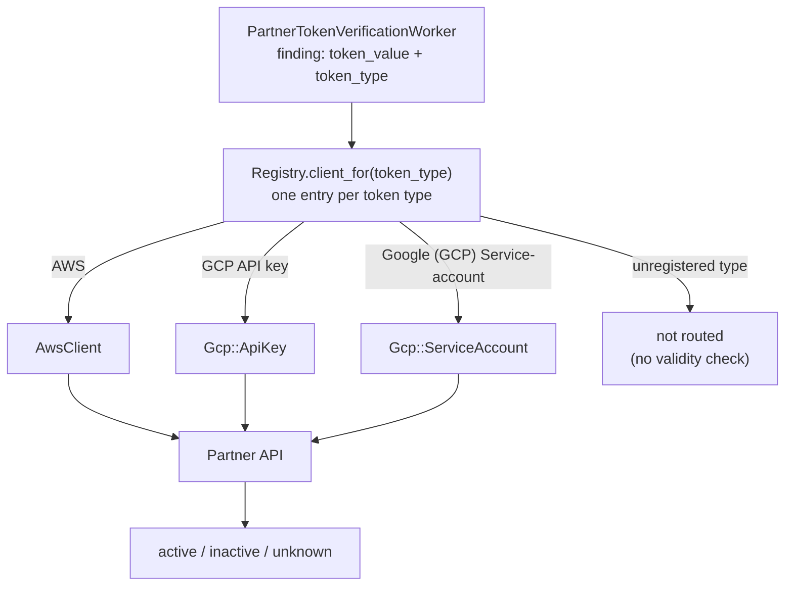

## ステータス {#status}

**承認済み**

## 概要 {#summary}

適切な API 呼び出しを選択するために、検出ルールからすでにわかっているトークンタイプを使用することを提案します。レジストリは、各トークンタイプを検証クラスに直接マッピングします。これにより、ベンダーの追加を固定パターンで繰り返せるようになります。トークンタイプごとに 1 つの検証クラスと 1 つのレジストリエントリを追加します。これによって、有効性チェックを現在の 3 ベンダーから、対象となる 39 ベンダーの 60+ のトークンタイプへ拡大できます（[ベンダー拡張エピック 20343](https://gitlab.com/groups/gitlab-org/-/work_items/20343)）。

この ADR は [ADR 005](005_use_token_type_for_verification_flow.md)を置き換えます。目標は変わらず、ルックアップをベンダーごとのディスパッチャーからレジストリに移します。

## コンテキスト {#context}

有効性チェックでは、検出されたシークレットが有効かどうかを確認するためにパートナー API を呼び出します。現在のコードは、1 ベンダー = 1 エンドポイント = 1 つの確認方法を前提としています。各ベンダーは、1 つの `verify_partner_token` メソッドを持つ単一の `BaseClient` サブクラスです。

しかし、複数種類のトークンを発行するベンダーがいくつかあり、種類ごとに異なる API エンドポイントが必要です。たとえば、GitHub PAT と App トークンは異なるエンドポイントに送られ、異なる形式のレスポンスを返します。現在、各ベンダーには 1 つの検証クラスがあり、トークン文字列に対して正規表現マッチングを行い、受け取ったトークンの種類を判断します。

実際にはトークンタイプが不明なのではありません -- 検証レイヤーがその情報を捨てています。すべての検出結果には、一致した検出ルール（たとえば `GCP API key`）が保存され、レジストリはすでにそのルール ID を使用して、呼び出すクライアントクラスを選択しています。しかし、ルール ID はクライアントに渡されないため、クライアントは保持しているトークンの種類を生の文字列から判別する必要があります -- これはパイプラインの他の部分ではすでにわかっている情報です。

```ruby
# token_type picks the client class, then is never passed in
PartnerTokens::Registry.client_for(token_type).verify_token(token_value)
```

そのため、各クライアントは正規表現を使用してトークンの形式からトークンタイプを再度推測する必要があります。この推測はバグを引き起こします。トークンがそれを理解できないエンドポイントに送られ、エンドポイントが拒否すると、クライアントがその拒否を失効済みトークンと誤認する可能性があります。すると、漏えいしたアクティブな認証情報が非アクティブとして表示され、お客様に修正の優先度を下げられると伝えてしまいます。

## 提案 {#proposal}

1. レジストリは、各トークンタイプ（検出ルール ID）を検証クラスに直接マッピングします。レジストリはレート制限と有効化のためにすでにトークンタイプをキーとしているので、ルーティングは 1 回のルックアップで済み、どのクライアントもトークン値からタイプを再導出しません。
1. 複数のトークンタイプを持つベンダーには、ベンダーのサブディレクトリ内でトークンタイプごとに 1 つの小さな検証クラス（たとえば `gcp/api_key.rb`）を設け、さらに共通コードとベンダーのメトリクスラベルのために、ベンダーごとに共有のベースクラスを設けます。各検証クラスは単一タイプのベンダーのクライアントと同じ形になるため、覚えるべきパターンは 1 つだけです。
1. 単一のトークンタイプを持つベンダーは、現在の 1 クラス、1 メソッドという形を変更せず維持します。
1. すべてのトークンタイプにクラスが 1 つだけあり、クラスにはそのタイプを知らせません。クラスを選択したレジストリエントリが両者を対応付けます。トークンタイプ間で検証ロジックを共有するベンダー（たとえば、複数種類のトークンを同じエンドポイントで検証する GitHub）は、共有ロジックをベンダーのベースクラスに配置します。各タイプのクラスは、ほぼ固有の形式パターンだけを保持します。クライアントのコンストラクターとメソッドシグネチャは、現在のまま維持します。
1. 検証クラスが読み取れないレスポンスを受け取った場合は、`unknown` を返します。ベンダーから「このトークンは失効済み」という明確なシグナルがない限り、`inactive` を返すことはありません。たとえば、トークンの認証先エンドポイントから返される `401` など、認証情報が無効であることを意味するとベンダーが文書化しているレスポンスであり、単なる拒否ではありません。
1. 共有の `BaseClient` コード（タイミング、エラー処理、Prometheus メトリクス）は、レジストリが解決したクラス上で検証ごとに 1 回実行されるため、メトリクスラベルはベンダーごとのままです（たとえば、ベンダーのベースクラスで 1 回設定する `gcp`）。

これはコードの編成方法だけを変更するものです。新しいインフラストラクチャ、キュー、サービスはありません。既存のワーカー、レジストリ、レート制限には手を加えません。



## この結論に至った経緯 {#how-we-arrived-here}

[意思決定のためのスパイク Issue 598278](https://gitlab.com/gitlab-org/gitlab/-/issues/598278)では、2 つの形を比較しました。1 つは単一のベンダークラス内で case によりディスパッチする形、もう 1 つは、ベンダーごとのディスパッチャークラスがトークンタイプから検証クラスへの 2 つ目のマップを持ち、クライアントメソッドに `token_type:` 引数を追加する形です。[ADR 005](005_use_token_type_for_verification_flow.md)ではディスパッチャーを選択しました。最初の実装マージリクエストのレビュー（[この形が提案された実装レビューのディスカッション](https://gitlab.com/gitlab-org/gitlab/-/merge_requests/245758#note_3559670985)）で、3 つ目の形が明らかになりました。レジストリはすでにトークンタイプごとにキー付けされているため、各タイプを検証クラスに直接マッピングして、ディスパッチャーの 2 つ目のマップとシグネチャ変更をなくせます。この ADR では、その 3 つ目の形を提案します。

複数タイプを持つベンダーのトークンタイプについては、トークンタイプごとに 1 つの検証ファイルと、1 つのレジストリエントリを追加します。

```ruby
# registry.rb -- one entry per token type, straight to its verifier
'GCP API key'                  => { client_class: Gcp::ApiKey, rate_limit_key: :partner_gcp_api, enabled: true },
'GCP OAuth client secret'      => { client_class: Gcp::ClientSecret, rate_limit_key: :partner_gcp_api, enabled: true },
'Google (GCP) Service-account' => { client_class: Gcp::ServiceAccount, rate_limit_key: :partner_gcp_api, enabled: true },
```

`Registry.client_for(token_type)` は現在のままです。エントリを検索し、クラスをインスタンス化します。

## 影響 {#consequences}

### 利点 {#benefits}

1. 複数タイプのベンダーが適切に収まるようになります。既知の 7 ベンダーがすべて同じパターンに従います。
1. [GCP の有効性チェックに関するバグ 588454](https://gitlab.com/gitlab-org/gitlab/-/issues/588454)の原因となった種類のバグを防ぎます。ベンダーから明確なシグナルがなければ、非アクティブとレポートしません。
1. ベンダーまたはトークンタイプの追加コストを低く保ちます（1 ファイルと 1 つのレジストリエントリ）。残り 60+ のトークンタイプを扱ううえで重要です。
1. レジストリが唯一のルーティングテーブルになります。1 つのページを見れば、各トークンタイプをどのクラスが検証するかわかります。
1. すべてのチェックが 1 か所、レジストリを通ります。考えられるプロダクト上の要望 -- お客様ごとのベンダーの無効化、お客様ごとの使用制限、価格設定のための使用量カウント -- は、すべてそこに組み込めます。レジストリには、トークンタイプごとの `enabled:` フラグがすでにあります。
1. 形式の正規表現がトークンタイプごとに厳密になるため、トークンのように見えるだけの文字列に対する無駄な API 呼び出しが減ります。
1. ここでの変更が、後の移行を妨げることはありません。検証クラスは単純な HTTP 呼び出しであり、モデル、ワーカー、その他のモノリスの状態との結びつきがありません。そのため、有効性チェックが将来イベント駆動になったり、内部 API の背後に配置されたり、別のサービスになったりしても、`partner_tokens/` ディレクトリをそのまま移動できます。設定駆動型（YAML）の検証クラスは、1 つのエンジンで多くのトークンタイプを扱い、検証対象のタイプを知る手段が必要になります。実現する場合、その仕組みはその取り組みとともに導入され、ここでの取り組みが無駄になることはありません。

### 欠点 {#drawbacks}

1. レジストリはトークンタイプごとに 1 エントリずつ増え（すべてを対象にすると 60+ のエントリ）、長いファイルになります。
1. ベンダーは単一の名前付きクラスではなく、名前空間と共有ベースクラスになります。ベンダー全体の動作（共有のレスポンス解析、メトリクスラベル）は、規約に従ってベースクラスに配置します。
1. 検証ロジックをトークンタイプ間で共有するベンダーにも、タイプごとに 1 クラスを設けます。共有ロジックはベンダーのベースクラスに置くので、タイプごとの重複はほぼ形式パターンだけです。例外のないルールと引き換えに、これを受け入れます。
1. ルーティングするもののまだ検証できないトークンタイプ（たとえば、対応するクライアント ID が必要な GCP OAuth クライアントシークレット）は、実際のチェックが存在するまで `unknown` と表示されます。これは意図した動作ですが、カバレッジ不足のように見える可能性があります。検証クラスは結果が `unknown` になる理由を常に把握しているので、後からお客様向けのステータスを分ける場合も、新しい enum を追加するだけで済みます。検証クラスはすでにその情報を持っています。

## 参考資料 {#references}

1. [ADR 005：検証フローにトークンタイプを使用する（置き換え済み）](005_use_token_type_for_verification_flow.md)
1. [実装 Issue 604596](https://gitlab.com/gitlab-org/gitlab/-/issues/604596)
1. [意思決定のためのスパイク Issue 598278](https://gitlab.com/gitlab-org/gitlab/-/issues/598278)
1. [この形が提案された実装レビューのディスカッション](https://gitlab.com/gitlab-org/gitlab/-/merge_requests/245758#note_3559670985)
1. [レジストリから直接マッピングする実装のマージリクエスト](https://gitlab.com/gitlab-org/gitlab/-/merge_requests/245937)
1. [GCP の有効性チェックに関するバグ 588454](https://gitlab.com/gitlab-org/gitlab/-/issues/588454)
1. [ベンダー拡張エピック 20343](https://gitlab.com/groups/gitlab-org/-/work_items/20343)
1. [事前にテストできないベンダーのロールアウト戦略、Issue 596643](https://gitlab.com/gitlab-org/gitlab/-/issues/596643)
1. [現在のエンドツーエンドフローのドキュメント、Issue 604600](https://gitlab.com/gitlab-org/gitlab/-/issues/604600)
