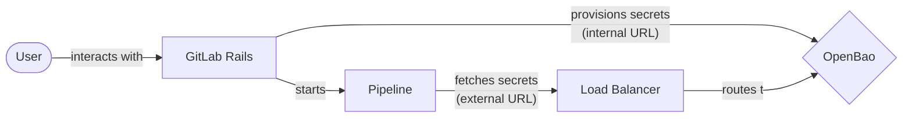
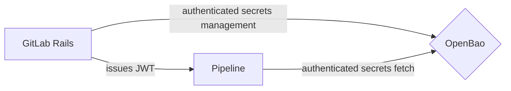
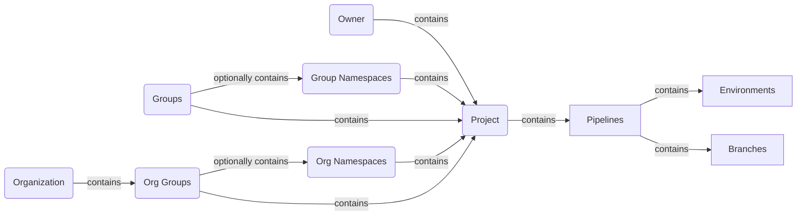
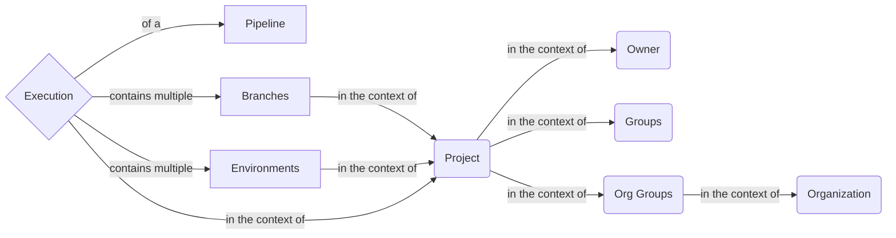
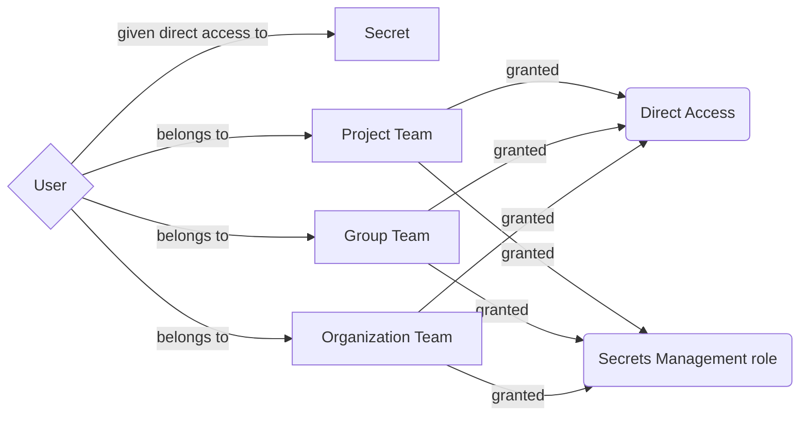
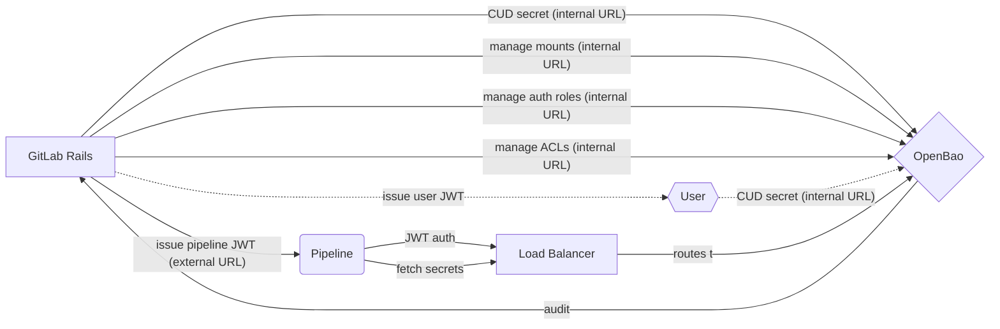




## 概要

GitLab ユーザーは、機密情報（「シークレット」）を保管するための安全で使いやすいソリューションを必要としています。GitLab Secrets Manager は、サードパーティツールにアクセスすることなく、その要件を満たす GitLab ユーザー向けの望ましいシステムです。

## モチベーション

GitLab に機密認証情報を保存するために多くの人が使用している現在の実質的なアプローチは、[マスクされた変数](https://docs.gitlab.com/ee/ci/variables/index.html#mask-a-cicd-variable)または[ファイル変数](https://docs.gitlab.com/ee/ci/variables/index.html#use-file-type-cicd-variables)を使用することです。しかし、変数（マスクされたまたはファイル変数）に保存されたデータは、マスキングによっても意図せず公開される可能性があります。より安全なソリューションは、HashiCorp Vault や Azure Key Vault などの外部シークレットマネージャーとのネイティブ統合を使用することです。

外部シークレットマネージャーとの統合では、GitLab がサードパーティ製品との統合を維持し、お客様が設定の問題をトラブルシューティングするのを支援する必要があります。さらに、これらの外部シークレットマネージャーを使用しているお客様のエンジニアリングチームは、これらのシステムを自分たちで維持する必要があり、運用負担が増加します。

GitLab ネイティブのシークレットマネージャーがあれば、お客様はサードパーティツールのオーバーヘッドなしに、安全な方法でシークレットを保存してアクセスでき、他の GitLab 機能との緊密な統合を活用できます。

### ゴール

GitLab ユーザーに以下の方法を提供します。

- GitLab にシークレットを安全に保存する
- GitLab コンポーネント（例: CI Runner）で保存されたシークレットを使用する
- 外部環境（例: 本番インフラ）で保存されたシークレットを使用する
- ルートネームスペース、サブグループ、プロジェクト全体でシークレットへのアクセスを管理する

#### ユースケース

アーキテクチャを設計するために、ユーザーがその役割においてシステムをどのように操作し使用するかを理解する必要があります。設計上の決定を推進するのに役立つ重要なユースケースシナリオを以下に示します。

1. コンプライアンスマネージャーまたはセキュリティオペレーションエンジニアとして、システムに追加のセキュリティレイヤーを提供するためにダイナミックシークレットを使用したい。
1. コンプライアンスマネージャーまたはセキュリティオペレーションエンジニアとして、システムに追加のセキュリティレイヤーを提供するために自動シークレットローテーションを使用したい。
1. コンプライアンスマネージャーまたはセキュリティオペレーションエンジニアとして、システムに追加のセキュリティレイヤーを提供するためにシークレットの有効期限ポリシーを設定したい。
1. 開発者として、機密認証情報が完全に暗号化されていることを望んでおり、成果物でこの情報が誤って漏洩しないようにしたい。
1. 開発者として、コード内にこの情報を保存しないようにするために、機密認証情報を保存するためにシークレットを使用したい。
1. GitLab 管理者および GitLab グループオーナーとして、組織がサードパーティツールの使用を必要とする場合に、シークレット管理機能を完全に無効にできるようにしたい。
1. コンプライアンスマネージャーまたはセキュリティオペレーションエンジニアとして、シークレットとその使用状況のステータスを表示する監査ツールが必要であり、疑わしい動作を識別し、機密認証情報のセキュリティとコンプライアンスを確保できるようにしたい。
1. コンプライアンスマネージャーとして、組織がコンプライアンスポリシーに従っていることを確認するために、シークレットの使用と管理の監査ログが必要。
1. DevOps エンジニアとして、デプロイプロセスがシークレットマネージャーからデプロイに必要なシークレットを直接取得できるようにしたい。
1. 規制された業界のお客様として、FIPS 要件を満たすために HSM サポートを持つシークレットマネージャーが必要。
1. 米国公共部門のお客様として、セキュリティ要件を満たすために FedRAMP 認定のシークレットマネージャーが必要。
1. エアギャップシステムを持つお客様として、ネットワーク要件を満たすためにオンプレミスにインストールしてオンサイトで管理できるシークレットマネージャーが必要。
1. シークレットオーナーとして、脆弱性がある場合にソフトウェアサプライチェーンのセキュリティを確保するためにシークレットを素早く更新またはローテーションする必要がある。
1. シークレットオーナーとして、誤った変更が発生した場合にシークレットへの変更をロールバックできる機能が必要。
1. セキュリティエンジニアとして、不要になったすべてのシークレットが適切に削除/破棄されるようにしたい。

#### 非機能要件

- セキュリティ
- コンプライアンス
- 監査可能性

### 非ゴール

このブループリントは以下をカバーしません。

- 個人アクセストークンなどの外部リソースが GitLab にアクセスできるようにするために GitLab 内で作成されたシークレット。

## 決定事項

- [ADR-005: OpenBao でのシークレットの非階層的なキー構造](decisions/005_secrets_key_structure/)
- [ADR-007: シークレット管理サービスとして OpenBao を使用する](decisions/007_openbao/)
- [ADR-008: Rails データベーステーブルなしでシークレットマネージャーを再設計する](decisions/008_no_database.md)
- [ADR-009: リクエストフローとアーキテクチャ図](decisions/009_request_flows.md)
- [ADR-010: シークレットローテーションメタデータに Rails ActiveRecord を使用する](decisions/010_secret_rotation_metadata_storage.md)
- [ADR-011: 顧客監査入力にストリーミング監査イベントを使用する](decisions/011_http_audit.md)
- [ADR-012: 別個の JWT ドメイン](decisions/012_jwt_separation.md)
- [ADR-013: OpenBao 別個の論理データベース](decisions/013_openbao_separate_database.md)
- [ADR-014: 非 CI/CD ワークロード向けの直接 API アクセス](decisions/014_non_ci_api_access.md)

### 廃止済み

これらのドキュメントは、このブループリントの初期イテレーションの一部です。

- [ADR-001: エンベロープ暗号化の使用](decisions/001_envelop_encryption/)
- [ADR-002: GCP Key Management Service の使用](decisions/002_gcp_kms/)
- [ADR-003: Secrets Manager を Go で構築する](decisions/003_go_service/)
- [ADR-004: ステートレス Key Management Service](decisions/004_stateless_kms/)
- [ADR-006: Rails と OpenBao 間で AppRole 認証メソッドを使用する](decisions/006_approle_authentication_rails/)

## 提案

シークレットマネージャー機能は SaaS とセルフマネージドの両方のインストールで利用可能であり、2つのコアコンポーネントで構成されます。

1. GitLab Rails
1. OpenBao Server



パイプラインは GitLab インフラの外部に存在する可能性があるため、OpenBao は外部からアクセス可能で ACL 保護されている必要があります。ただし、当初はマルチテナンシー拡張を OpenBao に組み込むまで、GitLab Rails UI を通じたシークレットと認証ロールのプロビジョニングを制限し、JWT トークンの作成をパイプラインの実行に限定します。

{}
技術的には、OpenBao を可視化する2つのアプローチがあります。

 1. API アドレスをグローバルにパブリックインターネットに開放する直接的な方法。
 2. GitLab Rails が呼び出し元に代わってリクエストをプロキシする方法。

特に後者の場合、将来的にバックエンドのシークレットストアを別のプロバイダーに置き換えるオプションがありますが、サポートするダイナミックシークレットプロバイダーごとに追加の労力が発生します。OpenBao API の薄いプロキシを実装するか（OpenBao に密結合するためスイッチングが難しくなる）、または呼び出しごとに独自の変換レイヤーを実装するかのどちらかです。

ダイナミックシークレットを提供するプロプライエタリなベンダーはごく一部しかないため、スイッチする場合はいずれにせよ機能をゼロから書き直す可能性が高いです。したがって、（クライアント向けに）おおまかに OpenBao/Vault 互換の API 設計を維持しながら、必要に応じて修正することができます。

このトレードオフを考慮し、スタティックな K/V シークレットを超えた拡張（データベース、クラウドプロバイダー、さらには GitLab トークンのダイナミックシークレット）への関心があることを踏まえて、OpenBao を公開して前者のアプローチを使用することを提案します。これにより、将来的に（ポリシー作成を GitLab Rails に任せながら単純にシークレットを読む）非パイプラインワークロードが可能になり、GitLab Rails 内の他のソリューションに Transit などのより高度な機能を使用できます。
{}

OpenBao では、2つの認証エンジンを使用します。

 1. [JWT](https://openbao.org/docs/auth/jwt/)。Rails から OpenBao への認証と、OpenBao への作成されたパイプラインジョブの認証に使用します。これらの JWT はすべて GitLab Rails によって発行され、既存の [HashiCorp Vault Runner 統合](https://docs.gitlab.com/ee/ci/secrets/hashicorp_vault.html)でサポートされている GitLab [OIDC ID トークン](https://docs.gitlab.com/ee/ci/secrets/id_token_authentication.html)を使用します。管理用途のトークンに対するクレームは GitLab の OIDC ID トークン用に発行されたものとは異なる値を持ちます。



重要なのは、GitLab Rails がパイプラインの特定のジョブの実行を承認する一方で、パイプラインのトークンは特定の実行コンテキストに適切にスコープされている必要があることです。パイプラインの実行コンテキストは以下のように定義されます。



グループと組織グループはどちらも多くのネストされたサブグループ（「ネームスペース」）を含むことができます。既存の OIDC ID トークンにはこれらの目的に十分なコンテキスト情報が含まれています。

パイプラインの実行コンテキストからは、シークレットは多くのソースから来る可能性があります。



ここで、パイプラインの実行は、ブランチまたは環境のマッチパターン（例: `main`、`*`、または `release/*`）のセットの制限の中で、以下からシークレットを取得できます。

 1. プロジェクト、
 1. プロジェクトの（ユーザー）オーナーと同等、または
 1. プロジェクトの組織オーナーまたは親グループ（組織の導入前）を含む上位の階層グループ。

つまり、シークレットが複数のプロジェクトで使用される場合は、1レベル上でプロビジョニングし、ブランチおよび/または環境を適切に制限して、関連する環境が表示されるべきでないプロジェクト間で競合しないようにします。

同様に、シークレットのユーザーアクセスと管理のコンテキストでは、以下の階層が適用されます。



どのレベル（プロジェクト、グループ、または組織）のチームも、そのレベル以下のすべてのシークレットを管理する権限を与えられます（上記の「シークレット管理機能」）。ただし、個々のシークレットに対しては、シークレット管理機能を持たないユーザーやチームにも直接アクセスを付与できます。

当初、ユーザーは GitLab Rails とその広範な特権 JWT トークンを通じてシークレットを管理しますが、長期的にはユーザーごとの JWT を使用し、最終的にはクライアントが OpenBao に直接アクセスする（GitLab Rails に接触する必要なく）ようにする意図があります。これにより、ユーザー混乱攻撃が実行不可能になり、GitLab Rails がプロビジョニング中にシークレットを見ることがなくなり、将来的に誤ってログに記録されるリスクが防止されます。ただし、特権 JWT トークンは ACL ポリシーへの変更を安全に制限するために引き続き使用されます。

### 設定オプション

```yaml
openbao:
  url: "https://openbao.example.com:8200"         # ランナー向けの外部 URL
  internal_host: "http://openbao-internal:8200"   # Rails 向けの内部 URL（オプション）
```

フォールバック動作: `internal_host` が設定されていない場合、Rails はすべての接続に標準の URL を使用します。

### シークレットと認証の階層

OpenBao のマウントパスの設計はセキュリティパラメーターに大きく影響します。ユーザー値（`{value}`）をエンコードする場合は16進数を使用します。これにより、パスに安全でない可能性のあるコンポーネントを個別のパスセグメントに変換するユニークで正規の変換が可能になります。動的な名前を持つコンポーネント（ユーザー、組織、グループ名など）の場合、それらはグロブ対応ではなく名前変更の対象となるため、人間が読めるパスや名前が変更された場合に基礎となるマウントの名前を変更せずに済むように、内部の整数データベース識別子を使用します。

#### テナントの定義

すべてのプロジェクトには親コンポーネントがあると仮定します。これはユーザー、グループ、または組織のいずれかです。`org_id=1` のレガシーグループの場合は、所有グループを使用します。

テナントを分離するために、[OpenBao ネームスペース](https://github.com/openbao/openbao/issues/787)を使用します。これらは以下のレベルに設定されます。

- `/{tenant}_{tenantid}`: 各テナントを他のテナントから分離するために、以下に記載されているように使用します。
- `/{tenant}_{tenantid}/{scope}_{scopeid}`: テナント内の個々のシークレットスコープ（グループやプロジェクトなど）を分離するために使用します。

トップテナントレベルでは、ネームスペースは将来的に[シールメカニズム](https://github.com/openbao/openbao/issues/1170)をネームスペースごとに持つことができ、マルチテナントの暗号鍵分離を可能にします。

スコープごとの追加ネームスペースにより、[Cells](#cells) のマウントの分割と移動を実現できます。

#### シークレット

ユーザー所有プロジェクトのマウント構造は以下のとおりです。

- `/user_{userid}/secrets`
- `/user_{userid}/proj_{projectid}/secrets`

組織所有プロジェクトの場合:

- `/org_{orgid}/secrets`
- `/org_{orgid}/{namespace}_{nsid}/secrets`
- `/org_{orgid}/proj_{projectid}/secrets`

既存のグループベースシステムを使用するグループの場合、トップレベルのエンティティは親グループになります。

- `/group_{groupid}/secrets`
- `/group_{groupid}/{namespace}_{nsid}/secrets`
- `/group_{groupid}/proj_{projectid}/secrets`

ここで、最初の `group_{groupid}` は最上位のグループ ID になりますが、ネストされたサブグループのシークレットには繰り返されません。

`{namespace}_{nsid}` はネストされたエンティティ（トップレベルの組織またはグループ内のグループ、サブグループ、またはユーザーネームスペース）を示します。組織の導入後、`org_id=1` のメタ組織に属するグループにはグループベースのテナント分離を使用します。

まとめると、このパス構造は一般的なテンプレートの意味で `{tenant}_{tenantid}/{scope}_{scopeid}` と呼ばれます。ここで `group`、`user`、および `org` はテナントの例であり、`proj` および `group` はスコープの例です。

各 `secrets` フォルダーには、当初は `/kv` に K/V シークレットエンジンをマウントします。将来的には、他のタイプのシークレットエンジンをマウントしてダイナミックシークレットを提供できます（エンジンの命名に関する考慮事項あり）。

各 K/V シークレットエンジン内では、パイプラインで（指定された `<name>` で）シークレットへのアクセスを制限するために以下のネスト構造を使用します。

- `.../secrets/kv/data/explicit/<name>`

同様に、ロールを持つダイナミックシークレットエンジンを使用する場合は、以下のマウント構造を提案し、指定されたダイナミックシークレットエンジンに適したシークレット名をこれらのマウント内で設定することを許可します。

- `.../secrets/<mount-name>/.../explicit-<role-name>`

簡潔に言えば、シークレットが存在できる任意のパスはプレフィックスフリーである必要があります。`explicit` を使用して、プロビジョニング認証エンジンが特定のフィールドへのシークレットレベルアクセスを_明示的に_付与する必要があることを示します。後で他のタイプのシークレット保護スキームを使用する場合（そのブランチまたは環境のいずれかのシークレットへの広いアクセスを許可するために URL に環境またはブランチの保護を配置するなど）は、プレフィックスとして `env-` と `branch-` を使用することを提案します。

#### 認証

JWT トークンの詳細については、[ADR-012: 別個の JWT ドメイン](decisions/012_jwt_separation.md)を参照してください。

認証には3つのマウントセットを使用します。

- `/auth/{tenant}_{tenantid}/{scope}_{scopeid}/pipeline_jwt`
- `/auth/{tenant}_{tenantid}/{scope}_{scopeid}/user_jwt`
- `/auth/gitlab_jwt`

特に、パイプラインはネストされたシークレットへのアクセスが必要な場合がありますが、特定のスコープ外のものにはアクセスする必要がないため、スコープネームスペース（`proj_` または `group_`）で ACL ポリシーと認証をプロビジョニングします。ネームスペースを使用することで、パイプラインがサンドボックスを脱出して他のテナントやスコープのシークレットにアクセスするのを防ぐのに役立ちます。

後で、各スコープにユーザー認証を追加することもできます（例: `/auth/org_{orgid}/project_{projectid}/user_jwt` で）。ユーザーはスコープを絞った JWT（および後続の OpenBao トークン）をリクエストでき、変更しているシークレットのスコープを超えた広いアクセスを持つトークンをリクエストしないようにできます。

補足: 現在の順序は auth そしてテナントセグメントですが、適切なネームスペースのサポートを追加する場合、auth マウントはテナント内に配置されるため、順序は例えば `/user_{userid}/proj_{projectid}/auth/pipeline_jwt` のように入れ替わります。

##### GitLab 特権 JWT

当初は同じ JWT 発行者を使用し（ただし将来的に専用の発行者に移行する可能性あり）、GitLab は特権 `/auth/gitlab_jwt` パスに対して認証するための JWT を自己発行します。このトークンのサブジェクトと他のフィールドは、パイプラインに発行された OIDC ID トークンとは独自に異なり、このエンドポイントに対して正常に認証されることを防ぎます。

長期的には、カスタムクレームを通じて受信 GitLab Rails リクエストとユーザー開始の管理アクションを結びつけることを試み、ソースリクエストから OpenBao までの監査と帰属を可能にします。

AppRole の代わりに JWT を使用することで、GitLab Rails の運用側で追加の外部シークレット管理が不要になります。プロビジョニングされた JWT 発行者へのアクセスがすでにあるため、設計の特権的な場所に留まりながら OpenBao に対して自己発行 JWT で認証できます。

#### ACL の設計

ACL ポリシーに対するグループベースのアプローチを提案します。各スコープ（パイプライン用）とロール（ユーザー用、明示的な付与を使用しない場合）は特定のシークレットのサブセットへのアクセスを付与します。これらのポリシーは OpenBao に維持・保存されますが、GitLab Rails がそれらを管理・プロビジョニングする役割を担います。

特に、Rails が開始する[操作](decisions/008_no_database.md#types-of-operations)は複数のテナントコンテキストにまたがることが期待されません。これにより、将来的にネームスペースごとの ACL を追加し、より小さな `path->policy` インデックスを作成することができます。さらに、ネストされたパスを使用して異なるポリシーをセグメント化し、セグメントごとのインデックスを構築することで、リスト操作のオーバーヘッドも削減できます。

各ポリシーに対して、Rails が発行した JWT の `groups_claim` が適用可能な ACL ポリシーを選択できるように、[グループエイリアス](https://openbao.org/api-docs/secret/identity/group-alias/)を作成します。[将来の拡張](decisions/008_no_database.md#jwt-direct-profiles)により、[グロブベースのグループマッチ](decisions/008_no_database.md#group-alias-glob-matching)以外のすべてを排除できます。

##### ポリシーの階層

ポリシーはそれぞれのテナント（例: `user_{id}/`）とスコープネームスペース（例: `user_{userid}/proj_{projectid}/`）に配置されます。

将来的には、`group_{id}` および他の構造をトップレベルのカテゴリーとしてサポートすることで、階層的なシークレットをサポートできます。マルチテナントのサポートにより、トップレベルのアイテムが少なくなり（テナントとスコープによって明示的に境界が設定されるため）、すべてのアイテムを反復処理しやすくなります。ただし、各スコープ内のアイテムは通常比較的少数です。階層的なシークレットは、パイプライン JWT が複数のコンテキスト（例: グループとプロジェクトの両方のレベル）で有効である必要があります。

これらは必ずしもシークレットのパス（ACL ポリシーの内容）を反映するものではなく、OpenBao 内で ACL ポリシーが_存在する場所_を示すだけであることに注意してください。

##### パイプライン ACL

パイプラインの JWT トークンを許可されたパスのみに制限するために、GitLab Rails を使用してパイプラインの ACL ポリシーと、[トークンメタデータ](https://openbao.org/api-docs/auth/jwt/#acl-policy-templating-examples)に基づいてポリシーのテンプレート化を許可する JWT ロールをプロビジョニングします。将来的には、[CEL JWT ポリシーエンジン](https://openbao.org/docs/rfcs/cel-jwt/)を使用してより細かい認証の決定が可能になります。

OpenBao の ACL は[ディスクに直接保存](https://github.com/openbao/openbao/blob/7fca5c0baebd3f55254da06d26bc160f465a7e1a/vault/policy_store.go#L287-L345)されており、最近使用されたポリシーには[適度なキャッシュ](https://github.com/openbao/openbao/blob/7fca5c0baebd3f55254da06d26bc160f465a7e1a/vault/policy_store.go#L28-L29)があります。ポリシーは[リクエスト検証時](https://github.com/openbao/openbao/blob/7fca5c0baebd3f55254da06d26bc160f465a7e1a/vault/policy_store.go#L605-L629)にロードおよび評価されます。つまり、パイプライン ACL 名が変更されて再使用された場合、リクエスト時点の最新バージョンが優先されます。

ロールの命名には、auth マウントがプロジェクトスコープ内にあるため `all-pipelines` という識別子を提案します。

###### レイアウト

`project_{id}/` スコープのネームスペース内では、追加のパスセグメント `pipelines/` をプロビジョニングして、プロジェクトのパイプライン関連のポリシーを他のタイプのアクセスから分離します。

Rails で以下のタイプのパイプラインポリシーを作成します。

- `global`: 任意のパイプラインがアクセスできるシークレット
- `env/{context}`: 環境制限ポリシー
- `branch/{context}`: ブランチ制限ポリシー
- `combined/env/{context}/branch/{context}`: 環境とブランチの組み合わせ制限（`AND`）

ACL の完全なパスは以下の例のようになります。

- `pipelines/global`
- `pipelines/env/prod-*`
- `pipelines/branch/release/*`
- `pipelines/combined/env/prod-*/branch/release/*`

これらはネームスペースポリシーストア（この例では）`user_2341/project_12345/sys/policies/acl/:path` からアクセスできます。

制限をパスに直接エンコードすることで、[同じエンコーディング](decisions/008_no_database.md#group-alias-glob-matching)のグループを作成できます。これにより、GitLab Rails が JWT を発行する前に制限のセットをクエリする必要が減ります。`combined` をプレフィックスとして使用することで、名前の付け方が悪い環境とブランチによる混乱攻撃を防ぐことができます。

将来的には明示的な付与も可能になります。ステージにはパスセグメントとポリシー（`stages/{name}/global`）を持たせ、ステージ内の各ジョブにも直接シークレットアクセスを持たせることができます（`stages/{name}/job/{name}/global`）。また、これらの制限（環境/ブランチ）とステージ、名前の間の AND 演算をサポートして、これらのジョブにより細かい実行コンテキストをサポートすることもできます。この情報（ステージ/ジョブ名）は現在 ID トークンに存在しないため、ACL に使用できません。ただし、情報は `Ci::Build` オブジェクト（`stage` および `name` フィールド）に存在するため、簡単に追加できます。

###### コンテンツ

各 ACL ポリシーはパスに対するケイパビリティの明示的な付与になります。GitLab Rails でこれらを設定し、複数のシークレットへのアクセスを付与するためのグロビング（`+` または `*`）は使用しません。特定のシークレットへのアクセスのみを許可します。

例えば、`env/prod-<DATE>` コンテキストで実行される任意のパイプラインが本番データベース認証情報にアクセスできるようにするには、以下の内容で `pipelines/env/prod-*` という名前のポリシーを作成します。

```hcl
path "secrets/kv/data/explicit/PROD_DB_PASS" {
    capabilities = [ "read" ]
}
```

ネームスペースへのパスは [OpenBao によって暗黙的に追加](https://github.com/openbao/openbao/blob/fork-point/vault/policy.go#L401-L402)されるためです。

パイプラインは異なる ACL ポリシーをプロビジョニングする可能性のある複数のコンテキストを持つことになるため、最終的には[ポリシーユニオン](decisions/008_no_database.md#policy-unions)または[CEL](https://openbao.org/docs/rfcs/cel-best-practices/)を使用した同様のソリューションを実装したいと考えます。

##### ユーザー ACL

ユーザーは当初は OpenBao に直接コンタクトせず（代わりに GitLab Rails を通じてシークレット管理操作をプロキシする）、GitLab Rails をスコープを絞ったユーザーレベルの JWT に切り替え、最終的にはクライアントが OpenBao に直接アクセスできるようにしたいと考えています（GitLab Rails に必ずしも連絡する必要なく）。これにより、ユーザー混乱攻撃が実行不可能になり、GitLab Rails がプロビジョニング中にシークレットを見ることがなくなり、将来的に誤ってログに記録されるリスクが防止されます。

特に、ユーザートークンはかなり特権的であることになります。ユーザーの範囲内のすべてのシークレットへの完全なアクセスを持つため、潜在的なサイドチャネル攻撃を避けるために十分に短命である必要があります。さらなる強化（[CIDR への自動バインディング](https://github.com/openbao/openbao/issues/32)など）により、これらの問題を回避できます。これを解決するには、チームライン（特定のカテゴリーのシークレットを管理するアクセス権を持つチームはすべて別の ACL ポリシーを持つ）に沿ってアクセスをスコープし、特定のビューで付与された場所固有のシークレットとともに、OpenBao を拡張してプロファイルのテンプレート化を許可する（JWT がこのユーザーに付与する具体的なプロファイルのリストを含むことができるように）必要があります。これはかなり複雑ですが、ユーザー JWT をより具体的にスコープするのに役立ちます。

アップグレードパス（特権 JWT トークンから増分的にタイトにスコープされたポリシーの使用へ）は、ユーザー JWT を生成するように Rails コードを変更し、特権 JWT トークンの代わりに特定のリクエストに対して認証して後続のトークンを使用するように Ruby クライアントのリクエストを更新するだけです。

ユーザーは実際のシークレットの読み取り権限がないことに注意してください。値を設定することしかできません。ダイナミックシークレットを展開する場合、ユーザーはロールに対する完全なアクセス許可を付与されますが、ダイナミックシークレットエンドポイントへのアクセス許可は付与されません（例: PKI の場合、`pki/roles/:name` に対する完全なアクセス許可はありますが、`pki/issue/:name` に対するアクセス許可はありません）。

###### レイアウト

パイプラインと同様に、関連するトップレベルのパスの下に `roles/` または `direct/` サブコンポーネントを持つポリシーを作成します。ここで `roles/` には、さまざまなレベルでシークレットへのアクセスを取得するデフォルトまたはカスタムロールがあります。例えば、`roles/maintainers` や `roles/owners`: これにより、各プロジェクトはデフォルトが理想的でない場合にこれらのロールがどのスコープのアクセスを取得するかを制御できます。

さらに、`direct/user_{id}` ロールを使用して、ユーザーは通常のロールで見ることができるもの以外の特定のシークレットへの明示的な付与を受けます。

###### コンテンツ

ロールと直接アクセスの両方に対して、2種類の付与があります。

1. シークレットのカテゴリー全体への広い付与。
2. 個々のシークレットへの特定の付与。

前者の場合、ポリシーは次のようになります。

```hcl
path "secrets/kv/data/explicit/+" {
    capabilities = [ "sudo", "create", "update", "patch", "delete", "list" ]
}
```

読み書きアクセスには以上のポリシーを使用し、

```hcl
path "secrets/kv/data/explicit/+" {
    capabilities = [ "list" ]
}
```

閲覧のみのアクセスには以上のポリシーを使用します。

後者（特定の付与）の場合、ポリシーは上記と同様ですが、明示的な名前が含まれます（例: `DB_PASS_PROD`）。

シークレット管理ページにアクセスする際、GitLab Rails は関連するユーザーの詳細を含む JWT を内部で発行します。この JWT には、プロジェクト内の特定のポリシーを持つグループへの関連する `groups_claims` が含まれます。Rails はその後、この JWT を OpenBao へのアクセスに内部で使用し、ユーザーが見ることができるものだけにアクセスのスコープを効果的に制限します。将来的に、OpenBao は外部からアクセス可能になるため、このトークンをユーザーに渡して、GitLab Rails がアクセスする必要なく、基礎となるシークレットを直接プロビジョニングできます。

##### ACL ポリシーの変更

ACL ポリシーは HCL で記述されています。[Ruby には優れた HCL サポートがない](https://rubygems.org/search?query=hcl)ため、これが問題になります。ただし、[HCL は JSON 互換](https://developer.hashicorp.com/vault/tutorials/policies/policies#hashicorp-configuration-language-hcl)です。

つまり、上記の任意の ACL ポリシーに対して、その JSON 等価物を構築できます。これにより、GitLab Rails は別の依存関係を取り込んだり、独自のパーサーを構築したりすることなく、ネイティブにこれを編集できます。

例えば、HCL のポリシー:

```hcl
path "secrets/kv/data/explicit/+" {
    capabilities = [ "list" ]
}
```

は以下の JSON に相当します。

```json
{
    "path": {
        "secrets/kv/data/explicit/+": {
            "capabilities": [
                "list"
            ]
        }
    }
}
```

これにより、GitLab Rails がクエリと更新を行うのがはるかに容易になります。関連する [OpenBao ドキュメント](https://openbao.org/docs/concepts/policies/#policy-syntax)を参照してください。

### スタティックシークレットとダイナミックシークレット

GitLab Secrets Manager は当初、KVv2 エンジンに保存されたスタティックシークレットのみをサポートします。スタティックシークレットには OpenBao への改善を加えることができます。

 1. リースを使用して、ワンタイムユーズシークレットをサポートする。これらは別のワークフローによって書き込まれ、使用時に削除されます。
 1. シークレットの自動削除をサポートする: 指定された有効期限を厳密に強制し、シークレットの使用を防止し、長命の手動シークレットであっても更新を必要とします。

ただし、最終的には自動ローテーションが重要な考慮事項です。完全にダイナミックなシークレットを使用することで、ローテーションの問題を回避できます。シークレットは特定のアクセスにスコープされ、パイプラインまたはアクセスが終了すると自動的に取り消されます（リースの期限切れまたは取り消しを通じて）。これにより、スタティックな値への依存を防ぎ、値の侵害には時間制限のある使用が必要になり、永続化を防止します。ダイナミックシークレットの採用を支援するために、OpenBao にいくつかの改善を加えることができます。

 1. カスタム外部プラグインを許可したり、プラグインのコンテナ化された実行を許可したりするプラグインレジストリを追加する。
 1. データベース以外の追加のバックエンドプラグイン可能なプラグインタイプを作成する: これにより、標準化された形式で共通 API を公開することで、さまざまなアクセストークンプロバイダーをより簡単に作成できます。

最終的には、より多くのユーザーをダイナミックシークレットに向けたいと考えています。これらはより安全で、長期的なデータ保持やセキュリティの懸念がありません。

### 真実の情報源

GitLab Rails は以下の真実の情報源です。

- OIDC を介した JWT 発行
  - パイプライン発行
  - ユーザーレベルの発行（将来的に）

OpenBao は以下の真実の情報源です。

- シークレットの定義
  - パイプライン定義とプロジェクト、ネームスペースなどのコンテキスト情報から推測できる正規の場所
  - 所有権情報（直接アクセス、ロールアクセスなど）
  - パイプラインアクセスのスコープ（環境、ブランチなど）
  - オペレーターが利用できるシークレットのテキスト説明
- シークレットの値
- ACL ポリシー: これらは所有権情報に基づいて GitLab Rails からプッシュされます（パイプラインの場合は使用直前）。
- ワンタイムユーズシークレットのための K/V 拡張機能や自動削除を含む、ダイナミックシークレットの設定。

### GitLab Rails

GitLab Rails は、Secrets Manager 機能を使用してシークレットを管理する際にユーザーが操作するメインインターフェースです。

このコンポーネントは OpenBao サーバーへのファサードであり、OpenBao への複数のリクエストとワークフローを開始します。



当初はシークレットへの CUD 操作を含むすべての操作が GitLab Rails を通じて行われますが、パイプラインからのシークレットのリクエストはそうではありません（したがって CRUD の R を除く — ただし、このアクションはもちろん GitLab Rails から開始され、GitLab Rails によって発行された JWT を持つパイプラインジョブによって開始されます）。最終的に CUD 操作の特権トークンはユーザー JWT に置き換えられ、その後直接ユーザーに（GitLab UI のコンテキストで実行される JavaScript OpenBao クライアントを通じて）置き換えられます。

[GitLab Rails モノリス](https://docs.gitlab.com/ee/development/architecture.html#component-diagram)内では、2つのコンポーネントがシークレットマネージャーへのアクセスを必要とします。[Puma](https://docs.gitlab.com/ee/development/architecture.html#puma)（GitLab バックエンドコードのほとんどが実行される場所）と [Sidekiq](https://docs.gitlab.com/ee/development/architecture.html#sidekiq)（長命のバックグラウンド操作を許可するバックグラウンドジョブプロセッサ、OpenBao と シークレットエンジンマウントの初期プロビジョニングなど）です。

より多くのリクエストフロー図については、[ADR 009](decisions/009_request_flows.md) を参照してください。

#### シークレットの管理

OpenBao は多くの決定の真実の情報源であるため、GitLab はプロジェクト上のシークレットの有効化ステータスを示す最小限のテーブルのみを保持できます。

`SQL` では以下のようになります。

```sql
CREATE TABLE secrets (
    id bigint NOT NULL,

    // スコープ情報; 1つのみ設定される。現在はプロジェクトレベルの
    // シークレットのみ許可。
    // user_id bigint,
    // organization_id bigint,
    // group_id bigint,
    project_id bigint,

    // 有効化ステータス: provisioning、active、または disabled。
    status state_machine,
);
```

ここで、`group_id` はシークレットインスタンスを所有する最も近いサブグループを参照します。親のサブグループとネームスペースはその後クエリできます。

#### 認証の管理

GitLab Rails は3種類の JWT を発行する必要があります。

1. 特定のパイプライン実行のプロジェクトスコープ内の JWT。
1. ユーザー認証用の JWT。
1. ポリシーやマウントの作成などの特権操作のための独自の JWT。

GitLab はすでに [CI/CD](https://docs.gitlab.com/ee/ci/secrets/id_token_authentication.html) の OIDC と [Identity Provider (IDP)](https://docs.gitlab.com/ee/integration/openid_connect_provider.html) として、両方の JWT タイプの発行をサポートしています。各[認証メソッド](#authentication)内では、OIDC トークンが適切な JWT 固有のポリシーが付与された OpenBao トークンと交換されるようにするために必要なロールを作成する必要があります。[ADR-008: Rails データベーステーブルなしでシークレットマネージャーを再設計する](decisions/008_no_database.md)で説明されているように、これには OpenBao への簡単な拡張が必要です。

#### 必要なクリーンアップフック

以下の場所では、シークレット（データベース内と OpenBao の両方）を更新するためにフックが必要です。

- プロジェクトの削除
- グループの削除
- 組織の削除
- ユーザーの削除
- パイプラインのキャンセル
- プロジェクト上のシークレットの無効化
- シークレット管理サブスクリプションの非更新

名前の代わりに ID が使用されているため、初めてマルチテナントネームスペースを有効にする場合を除いて、マウントの移動操作はほとんど発生しません。

### OpenBao サーバー

[OpenBao](https://openbao.org/) サーバーは GitLab の全体アーキテクチャの新しいコンポーネントになります。このコンポーネントはシークレット自体の保存を含むすべてのシークレット管理機能を提供します。[内部の概要](https://openbao.org/docs/internals/)と[脅威モデル](https://openbao.org/docs/internals/security/)はプロジェクトのウェブサイトで利用可能です。

要約すると、ストレージはルートキーで暗号化され、ルートキーはバリアキーリングを暗号化し、バリアキーリングはストレージを暗号化します。ルートキーへのアクセスは、[Shamir の派生 AES キー](https://openbao.org/docs/concepts/seal/#shamir-seals)（アンシールするためのクォーラムが必要）または自動アンシールメカニズム（[GCP KMS](https://openbao.org/docs/configuration/seal/gcpckms/) など）によって保護されます。

#### ストレージバックエンド

Runway 上の OpenBao は当初、[PostgreSQL エンジン](https://openbao.org/docs/configuration/storage/postgresql/)でデプロイされます。これはセルフホスティングのデフォルトとして適切です。GitLab Rails はすでにデータベースを必要とし、その中にテーブルを作成できます。ただし、将来的により広く展開されている Raft バックエンドのサポートも比較的簡単に追加できます。

#### シールメカニズム

GitLab.com のデプロイでは、OpenBao は [GCP KMS 自動アンシールメカニズム](https://openbao.org/docs/configuration/seal/gcpckms/)を使用します。セルフホスティング環境では、既存のサポートされている KMS メカニズムが提供されない場合、Kubernetes でのようなシークレットマネージャーを使用して[スタティックシール](https://openbao.org/docs/configuration/seal/static/)を使用できます。

#### 監査ログ

OpenBao はファイル、syslog、またはソケットメカニズムを通じた監査ログをサポートしています。OpenBao は必ずしも GitLab Rails または監査ログ（Postgres 内）と同じ場所にある必要はないため、ファイル（`/dev/stdout` へ）とカスタム監査ログバックエンド（お客様が利用できる[ストリーミング監査イベント](https://docs.gitlab.com/administration/compliance/audit_event_streaming/)を発行するため）の両方を使用することが提案されます。

監査ログが停止した場合、OpenBao はこれが修正されるまでリクエストを処理できなくなることに注意してください。

詳細については、[ADR-011: 顧客監査 Ingress にストリーミング監査イベントを使用する](decisions/011_http_audit.md)を参照してください。

#### 高可用性

GitLab Rails にはセルフホストクラスタリングのための [Geo サポート](https://docs.gitlab.com/ee/administration/geo/)が含まれており、それぞれが独自のノードセットを持つ複数のサイトが存在できます。各サイトには独自の [PostgreSQL レプリカ](https://docs.gitlab.com/ee/administration/geo/#architecture)があります。1つのサイトがプライマリに指定され、そのサイトのノードは Postgres データベースへの書き込み操作を実行できます。すべての PostgreSQL データはすべてのサイトで利用可能です。Gitaly はリポジトリデータの選択的同期を行いますが、プロジェクトはすべてのサイトとノードからグローバルにアクセス可能です。現在は Secondary ノードのみがプライマリサイトと通信しますが、[双方向チャンネルであるべき](https://docs.gitlab.com/ee/administration/geo/replication/multiple_servers.html#architecture-overview)です。

OpenBao はネイティブに[高可用性](https://openbao.org/docs/internals/high-availability/)をサポートしています。これは [Raft](https://openbao.org/docs/internals/integrated-storage/) または [PostgreSQL](https://openbao.org/docs/configuration/storage/postgresql/) ストレージバックエンドによって提供されます。後者はロックテーブルを使用してリーダー選出を実装します。1つのノードのみがアクティブとしてマークされ、Secondary ノードはリクエストをプライマリに転送するだけで操作を実行しません。

特に、Geo と OpenBao のセマンティクスはほぼ一致しています。Geo は GitLab Secrets Manager をサポートするために追加の拡張を必要とせず、PostgreSQL を使用する場合はレプリケーションが Geo によって処理されることを提案します。

すべてのフロントエンドサービスノードで、セルフホスティングの OpenBao サーバーインスタンスを起動します。1つのノードが OpenBao HA 選出によってプライマリに指定されます。これはプライマリサイトのランダムなノードです。Secondary の Geo サイトは読み取り専用の PostgreSQL レプリカを持ち、OpenBao ロックを取得できないためです。

ランナーが OpenBao インスタンスに接続する場合、リクエストがアクティブなノードに当たらなければ、OpenBao は GRPC リクエスト転送メカニズムを通じてリクエストをルーティングします。これは、Geo プライマリサイトまたは Secondary サイトに当たるかどうかに関わらず、既存の OpenBao HA サポートで動作します。

フェイルオーバーの場合、Geo は新しいサイトをプライマリとして起動できます（PostgreSQL データベースが書き込み可能としてマークされているため）。データはすでにレプリケートされており（PostgreSQL レプリケーションを通じて）、OpenBao の設定変更は不要です。

最終的な結果として、Geo は既知の PostgreSQL データベース（お客様が独自のデータベースを持参しない限り）を使用して OpenBao のデータレプリケーションを担当し、OpenBao は Geo のセマンティクスと統合されます。

#### Cells

当初は、インスタンスごとに1つのグローバルな OpenBao クラスターをサポートします。将来的に [Cells](/handbook/engineering/architecture/design-documents/cells/) を使用する場合、各テナントにクラスターアフィニティを持たせることを期待します。各 GitLab Cell は独自の OpenBao クラスターを持ちます。各 Cell には独自のローカルデータベース（中央データベースの一部またはシークレットマネージャー用の Secondary PostgreSQL インスタンス）があります。エンジニアリングの観点からは、すべてのデータは現在プロジェクトまたはグループ内に分離されており、1つの Cell に存在するため、クロス Cell データアクセスパターンは存在しません。したがって、Cells の統合はほぼ運用上のものです。

最大の課題は、お客様を Cells アーキテクチャに[移行](/handbook/engineering/architecture/design-documents/cells/iterations/cells-1.5/)して、オペレーターが Cells を再バランスできるようにする機能のサポートです。これには2つの部分が必要です。

1. シークレットを持つ既存の組織またはリポジトリセットを[分割](https://gitlab.com/gitlab-org/gitlab/-/issues/543014)できること。
2. さまざまな Cells 間で組織を[移動](https://gitlab.com/gitlab-org/gitlab/-/issues/543001)できること。

Tenant Scale チームとの議論から、この機能を OpenBao にプッシュすることを選択しました。これにより、2つのアップストリーム [RFC](https://gist.github.com/cipherboy/d658f06b871d5bee0d9a5cd130b1173b)（ネームスペースのフェデレーションとクロスクラスターネームスペース移動）が生まれ、ほぼゼロダウンタイムの移行が可能になります。

現在は実行中のパイプラインのみに焦点を当てています。組織が Cells 間を移動している際、[Org Mover](https://gitlab.com/groups/gitlab-org/-/epics/12859) はまず、既存の親 Cell のネームスペースに戻すフェデレーションを宛先 Cell のすべてのネームスペースに設定できます。これにより、パイプラインはどちらの Cell でもシームレスに実行でき、Rails は [インラインauth](https://openbao.org/docs/rfcs/inline-auth/) を使用して OpenBao への読み取り専用アクセスを維持できます。

組織の残りの部分が移動した後、Org Mover は OpenBao データ移動をトリガーできます。これは上記のクロスクラスターネームスペース移動 RFC を通じて OpenBao によって処理されます。完了したら、Org Mover または Rails は移動を最終化し、宛先 Cell の OpenBao インスタンスのクローンされたネームスペースを有効化して、元のソース Cell の OpenBao インスタンスからネームスペースを削除できます（残留するジョブが新しい OpenBao インスタンスのネームスペースと通信し続けられるように、ソース Cell インスタンスにリバースフェデレーションを維持する可能性があります）。

分割をサポートするために、OpenBao に追加のネームスペースを導入します。GitLab テナントレベルの単一のネームスペースではなく、各シークレットのスコープ（プロジェクトまたはグループ）にも独自のネームスペースが存在します。これにより、ネームスペースは分割されず、アトミックに保たれます。このアプローチは上記の階層に反映されています。

#### デュアルネットワークパスアーキテクチャ

OpenBao は、2つの異なるネットワークルートを通じてアクセス可能な単一のサービスエンドポイントで動作します。

1. **内部ルート（Rails）**: 外部インフラをバイパスした直接クラスター通信
2. **外部ルート（Runners）**: ロードバランサーとパブリックエンドポイントを通じたインターネットアクセス可能なパス

このアーキテクチャにより、同じ OpenBao インスタンスが内部の GitLab Rails リクエストを効率的に処理しながら、適切なネットワークインフラを通じて外部のランナーからもアクセス可能になります。

#### 必要な拡張

この機能の GA 前にセキュリティを向上させるために OpenBao の拡張が必要です。これらについては以下で詳しく説明します。

##### マルチアンシール機能

アンシールメソッドが障害を起こして回復不能な状態になった場合、OpenBao は今日ではシークレットを復号化できず、起動に失敗します。インフラの停止の場合、これにより回復が困難になります。アップストリームの Vault Enterprise は [Seal HA 機能](https://developer.hashicorp.com/vault/docs/configuration/seal/seal-ha)を導入しており、その設計は [Seal Wrapping](https://developer.hashicorp.com/vault/docs/enterprise/sealwrap) の追加要件によって影響を受けています。OpenBao には Seal Wrapping がなく、[以前の撤回された PR](https://github.com/hashicorp/vault/pull/18683) に似た設計に依存できます。

複数の並列アンシールメカニズムを許可し、それぞれが同じルートキーを暗号化することができます。これにより、自動アンシールと Shamir の混合が可能になり、自動アンシールメカニズムが利用できなくなったり、キーが失われたりした場合のハイブリッド回復手順が可能になります。特に、ルートキーの再利用は問題ありません。別個のルートキーを持つアンシールキーマテリアルの損失（ルートキーの整合性を侵害する）は、バリア暗号化キーの回復を依然として可能にします。ルートキーのローテーションには、すべてのアンシールメカニズムがオンラインであるか、使用前に削除される必要があります。ただし、暗号化されたエントリはルートキーだけであるため、メカニズムの組み合わせで暗号化されたシークレットに対処する必要はありません。

##### ネームスペースによるマルチテナンシー

これは [OpenBao v2.3.0 でランディング](https://github.com/openbao/openbao/releases/tag/v2.3.0)しました。

{}
現在の設計ドキュメントでは、別個のテナントのシークレットは同じバリア暗号化キーを使用して暗号化されます。これは、単一のテナントの侵害がすべてのテナントの侵害につながることを意味します。

OpenBao には [Vault Enterprise のネームスペース](https://developer.hashicorp.com/vault/docs/enterprise/namespaces)がありません。これらはアップストリームで議論されているように、[テナントの論理的な分離](https://github.com/orgs/openbao/discussions/293)を可能にします。特に、ネームスペース内の管理者に限定されたスコープの `sys/` 機能を付与できます。

- [`sys/auth`](https://openbao.org/api-docs/system/auth/): 新しい auth プラグインをマウントするため。
- [`sys/mounts`](https://openbao.org/api-docs/system/mounts/): 新しいシークレットエンジンプラグインをマウントするため。
- [`sys/namespaces`](https://openbao.org/api-docs/system/namespaces/): ネストされたネームスペースを許可するため。
- [`sys/policies`](https://openbao.org/api-docs/system/policies/): ネームスペース制限されたポリシーを制御するため。
- オプションとして [`sys/quotas/config`](https://openbao.org/api-docs/system/quotas-config/) と [`sys/quotas/rate-limit`](https://openbao.org/api-docs/system/rate-limit-quotas/): ネームスペース制限されたクォータを制御するため（テナントが独自のクォータを設定したい場合、グローバルクォータの制限に従います）。

この変更の目的は、お客様が OpenBao インスタンスと直接インタラクションできるようにし、パイプライン以外のワークロードを同じシークレットストアに持ち込めるようにすることです。

さらに、ネームスペースにレイヤードシール暗号化を追加し、別個のルートキーとバリアキーリングを作成し、親ネームスペースのバリアキーと別個のアンシールメカニズムの両方で暗号化することができます。これにより、ネームスペース内で以下のスコープされた `sys/` ルートが公開される可能性があります。

- [`sys/rotate`](https://openbao.org/api-docs/system/rotate/): ネームスペースごとのバリア暗号化キーのローテーション。
- [`sys/rekey`](https://openbao.org/api-docs/system/rekey/) と [`sys/rekey-recovery-key`](https://openbao.org/api-docs/system/rekey-recovery-key/): ネームスペースごとのルートと回復キーのローテーション（ある場合）。
- [`sys/seal`](https://openbao.org/api-docs/system/seal/) と [`sys/unseal`](https://openbao.org/api-docs/system/unseal/): ネームスペースのシールとアンシール。自動アンシールマウントをシールするには回復キーが必要です。

お客様が GitLab からシークレットへのアクセスを取り消したい場合、ネームスペースをシールして GitLab が選択したアンシールメカニズムにアクセスできないようにすることができます。

最後に、プラグインの多重化をネームスペース内でのみ許可することで、お客様のメモリ分離を強化できます。プラグインの外部ランナー（コンテナや cgroups など）と組み合わせることで、テナントデータをメモリ内でさらに分離できます。
{}

##### 選択されたリーダー

Geo クラスターで動作する場合、OpenBao のプライマリノードが Geo クラスターのプライマリサイトの定義と一致するようにしたいと考えます。Secondary サイトの OpenBao がリーダーになろうとしないように、PostgreSQL の読み取り専用レプリカで非投票ステータスを与えるように OpenBao を更新したいと思います。

これは[アップストリームの PR](https://github.com/openbao/openbao/pull/1284) で提案されています。

### デプロイメントシナリオ

シングルインスタンスのデプロイメント:

```yaml
openbao:
  url: "https://secrets.gitlab.com"
  # internal_host は不要 - Rails とランナーが同じ URL を使用
```

Kubernetes デプロイメント:

```yaml
openbao:
  url: "https://secrets-manager.example.com"                     # ランナー向け外部ロードバランサー
  internal_host: "http://secrets-manager-internal.example.net"   # Rails 向け Kubernetes サービス
```

GitLab.com 本番:

```yaml
openbao:
  url: "https://secrets.gitlab.com"                            # パブリックエンドポイント
  internal_host: "http://secrets-manager-internal.gitlab.net"  # 内部クラスター
```

### バックアップと復元

このソリューションのバックアップと復元は2つの側面に集約されます。

1. データベース
2. シールメカニズム

[PostgreSQL の選択](#storage-backend)をストレージバックエンドとして選択したため、データベースのバックアップと復元については、データベースプロバイダーの[ドキュメント](https://www.postgresql.org/docs/current/backup.html)を参照してください。例えば、Runway ではこれは[自動的に実行](https://docs.runway.gitlab.com/runtimes/cloud-run/reference/blueprints/cloudsql-for-postgres/#backup-for-an-instance)されます。

外部の自動アンシールメカニズムの場合は、プロバイダーのドキュメントを参照してください。Kubernetes シークレットを使用して `static` 自動アンシールメカニズムを透過的に使用する場合は、Kubernetes シークレットマネージャープロバイダーのドキュメントを参照してください。

データベースとシールのバックアップの組み合わせは、[トランザクション](https://openbao.org/docs/rfcs/transactions/)の使用により、OpenBao のバックアップと復元に十分です。

復元後、新しいデータを取り込むために OpenBao サービスを再起動してください。

### ユースケーススタディ

- [CI ジョブでシークレットを使用する](studies/ci_job_secrets/)

### さらなる調査が必要な事項

1. GitLab Runner 以外のクライアントの認証。GitLab Runner は JWT を使用して認証しますが、他のタイプのクライアントには、シークレットを復号化するリクエストを認証するための安全で信頼性の高いメソッドが必要です。
1. OpenBao のセルフマネージドインスタンスへのインストール方法を含むインフラのセットアップ。
1. GitLab の複数のグループ間でシークレットを共有する最善の実装方法。
1. シークレットボールトをシールする必要があるインシデントのためのプロトコルとプロセスの確立。
1. シークレットの保護と環境固有のルールをサポートする方法。
1. プロジェクトまたはサブグループが別のトップレベルグループ/組織に移動された場合、シークレットを取り消すべきか？

## 代替ソリューション

検討した他のソリューション:

- 意図しない公開を避けるために、シークレットを CI/CD 変数とは別のモデルとして分離し、アクセスを制限する。
- [セキュアファイル](https://docs.gitlab.com/ee/ci/secure_files/index.html)
- ゼロからシークレット管理を実装する（[廃止済み](#superseded)を参照）。

## 参照

以下のリンクはシークレット管理の概念に関連する追加情報を提供します。

- [OWASP Secrets Management Cheat Sheet](https://cheatsheetseries.owasp.org/cheatsheets/Secrets_Management_Cheat_Sheet.html)
- [OWASP Key Management Cheat Sheet](https://cheatsheetseries.owasp.org/cheatsheets/Key_Management_Cheat_Sheet.html)

## 担当者

DRI:

<!-- vale gitlab.Spelling = NO -->

| 役割                | 担当者                                            |
|---------------------|------------------------------------------------|
| 著者              | Erick Bajao, Senior Engineer                   |
| 共著者           | Alex Scheel, Staff Engineer                    |
| 推薦者         | Fabio Pitino, Principal Engineer               |
| プロダクトリーダーシップ  | Jocelyn Eillis, Product Manager               |
| エンジニアリングリーダーシップ | Scott Hampton, Engineering Manager          |
| リードエンジニア       | Erick Bajao, Senior Backend Engineer           |
| シニアエンジニア     | Maxime Orefice, Senior Backend Engineer        |
| エンジニア            | Shabini Rajadas, Backend Engineer              |

<!-- vale gitlab.Spelling = YES -->
