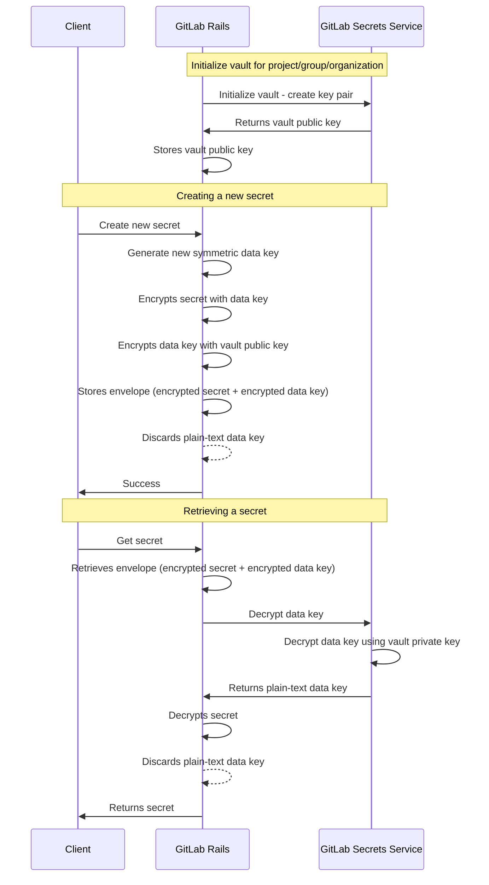

## コンテキスト

GitLab Secrets Manager でシークレットを安全に保存するために、GitLab システムへのセキュリティ侵害が発生した場合でも、暗号化されていないシークレットが漏洩しないようなシステムが必要です。

## 決定事項

エンベロープ暗号化を使用します。GitLab Rails は暗号化されたシークレットを、暗号化されたデータキーとともに保存します。シークレットを復号化するために、GitLab Rails は GitLab Secrets Service を通じて GCP キーマネージャーに復号化リクエストを行い、復号化されたデータキーを取得する必要があります。データキーは次に暗号化されたシークレットを復号化するために使用されます。

## 結果

このアプローチにより、エンベロープを含む GitLab データベースにアクセスした攻撃者は、シークレットのコンテンツを復号化できません。必要な秘密鍵がそこには保存されていないためです。

また、各 vault に使用される非対称鍵ペアを安全に生成・保存する方法も検討する必要があります。

さらに、以下のリソースが必要です。

1. 複数の非対称鍵ペア。プロジェクト、グループ、または組織に属する各 vault に固有の非対称鍵ペアが必要です。
1. 複数の対称鍵。各シークレットに固有のキーが必要です。

## 代替案

シークレットの暗号化と復号化を GitLab Secrets Service で行いながら、暗号化されたデータを GitLab Rails に保存することを検討しました。しかし、これはシークレットと暗号化キーが GitLab Secrets Service に同時に存在する時間が生まれることを意味します。
