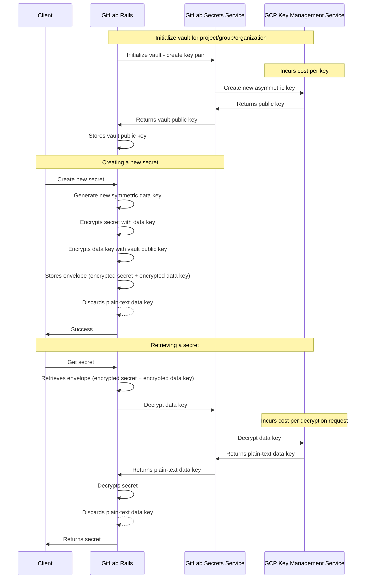

## コンテキスト

[ADR 001: エンベロープ暗号化の使用](../001_envelop_encryption/)に続き、各 vault に属する非対称鍵を安全に保存するソリューションを見つける必要があります。

## 決定事項

GitLab Secrets Manager の vault で使用される非対称鍵を管理するために、Google Cloud Platform（GCP）Key Management Service（KMS）に依存することにしました。

GCP を使用することにはいくつかの利点があります。

1. 暗号化キーの独自の安全なストレージを実装する必要がなくなります。
1. Hardware Security Module（HSM）のサポート。

セキュリティ上の目的から、GCP KMS のキーを保護するために Hardware Security Module（HSM）を使用することにしました。

## 結果

### 認証

キーが GCP KMS に保存されることにより、GCP KMS で設定された ID と GitLab で定義された ID の間のデマルチプレックスを行い、復号化リクエストを適切に認証する必要があります。

### コスト

GCP KMS を使用する場合、以下のコストを考慮する必要があります。

1. 必要なキーの数
1. キー操作の数
1. HSM 保護レベル

必要なキーの数は、この機能を使用するプロジェクト、グループ、組織の数によって異なります。各プロジェクト、グループ、または組織には1つの非対称キーが必要です。

各暗号化キー操作にもコストが発生し、保護レベルによって異なります。上記の提案された設計に基づくと、各シークレット復号化リクエストでコストが発生します。

異なるユーザーに対して異なる保護タイプをサポートするマルチティアの保護レベルを実装することもあります。

GCP KMS の料金表は[こちら](https://cloud.google.com/kms/pricing)で確認できます。

### セルフマネージドのお客様への機能の可用性

GCP KMS をバックエンドとして使用することは、このソリューションがセルフマネージド環境にデプロイできないことを意味します。この機能をセルフマネージドのお客様が利用できるようにするには、この機能を GitLab Cloud Connector 機能にする必要があります。

## 代替案

GitLab Secrets Service 内で秘密鍵を生成・保存することを検討しましたが、これは [FIPS コンプライアンス](https://docs.gitlab.com/ee/development/fips_compliance.html)の要件を満たさないでしょう。

一方、GCP HSM Keys は [FIPS 140-2 Level 3](https://cloud.google.com/docs/security/key-management-deep-dive#fips_140-2_validation) に準拠しています。
