## コンテキスト

オフサイトの一環として、以下のリクエストフローと Kubernetes 固有のアーキテクチャ図が作成されました。

## リクエストフロー

### Runner によるシークレット取得

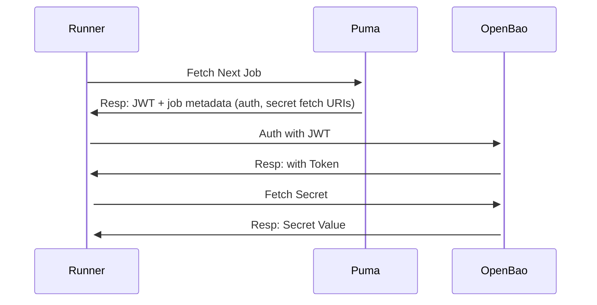

### ユーザー→Rails 管理インタラクション

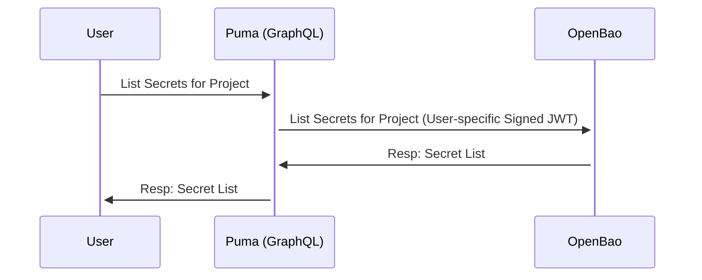

### ユーザー→Rails プロビジョニングステップ

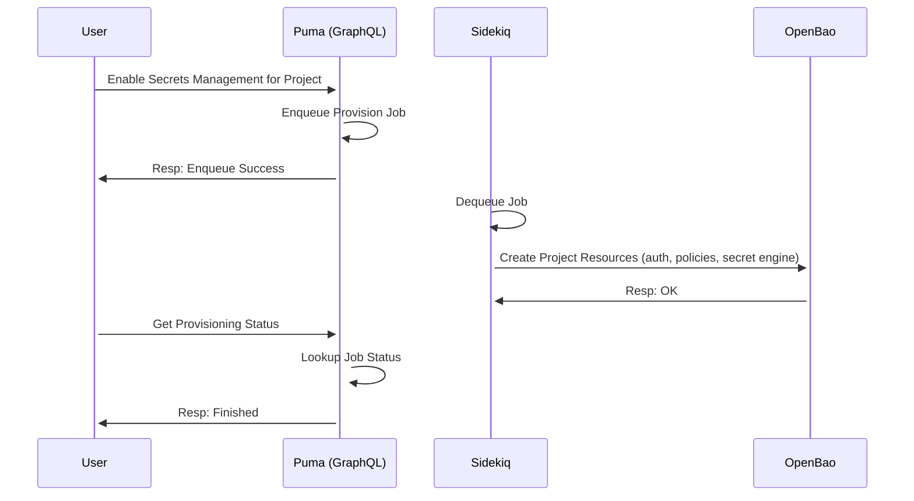

### リクエスト転送フロー

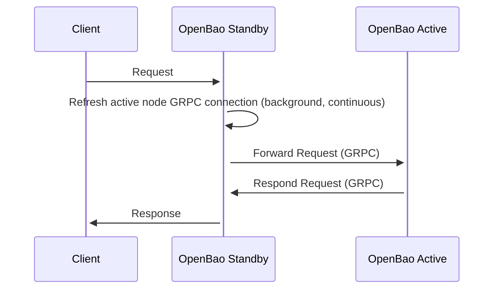

現時点（OpenBao v2.3.0 まで、おそらく v2.4.0 終了時）では、このフローはリクエストの種類に関わらず発生します。すべてのリクエストはアクティブノードによってのみ処理されます。

### アクティブノードの内部リクエストフロー

GitLab では、`OpenBao` とラベル付けされているすべてのものが単一のアクティブノードプロセスの一部となります。

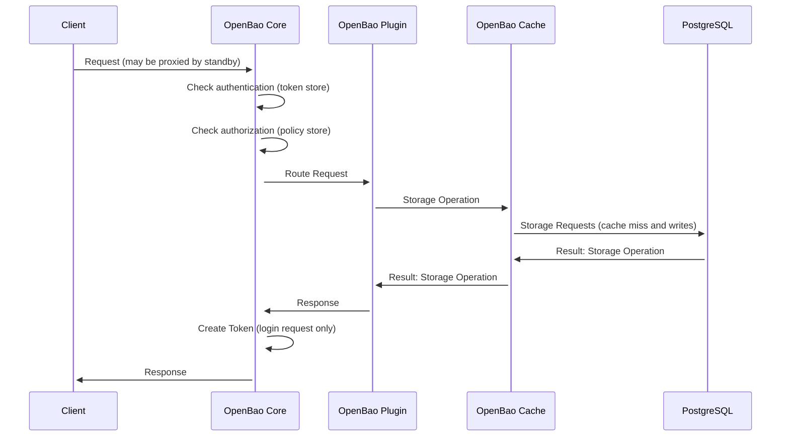

キャッシュは分離されており、スケーラブルな環境においてストレージが変更された場合にキャッシュ無効化を処理する必要があることを把握しています。今日は Raft によってクラスタ化された方法で処理されています。PostgreSQL では、そのためのメカニズムがありません。これは GRPC になる可能性がありますが、アップストリームの OpenBao 水平スケーラビリティワーキンググループによって決定されます。

### OIDC 登録の動作

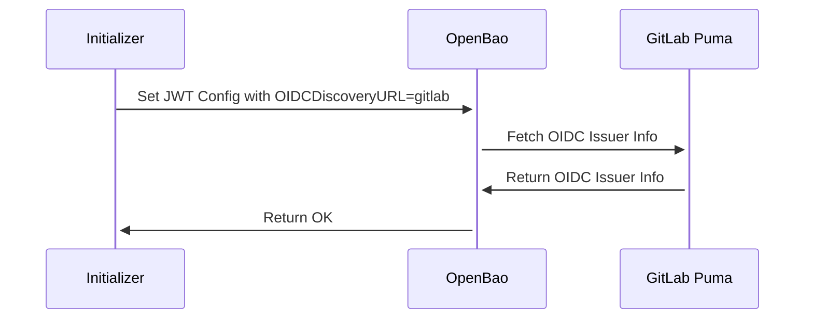

認証時：

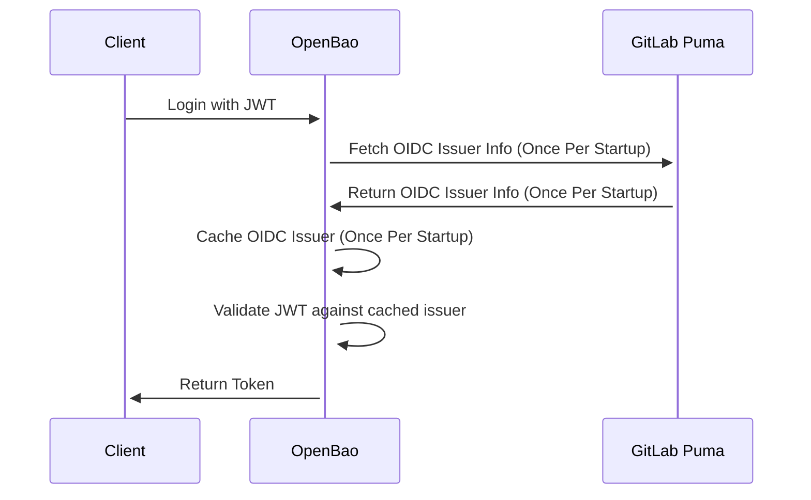

---

将来的には、以下のようにしたいと考えています：

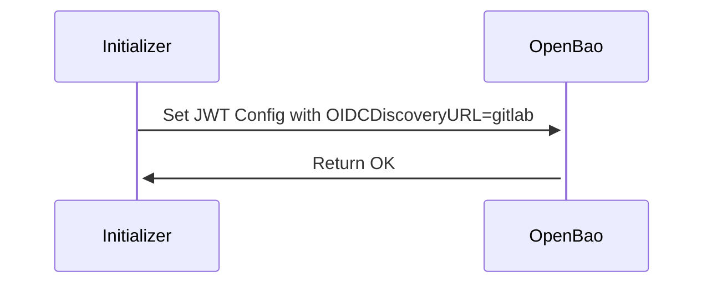

認証時またはマニュアルの `jwt/config/verify` エンドポイントでのみ発行者情報を取得するようにします。これは [openbao#1306](https://github.com/openbao/openbao/pull/1306) によって処理され、v2.3.0 の一部となる予定です。

### 監査ログ

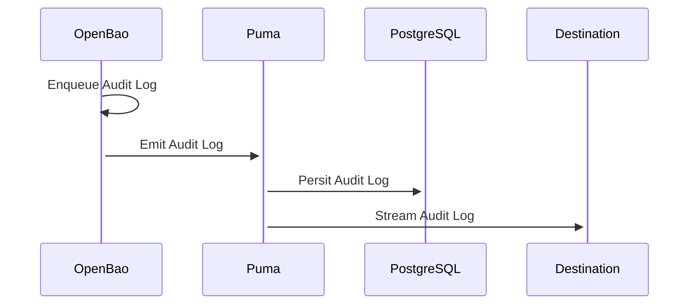

詳細については、[監査イベントストリーミング](https://docs.gitlab.com/administration/compliance/audit_event_streaming/)ドキュメントを参照してください。

## アーキテクチャ

### KMS なしの Kubernetes

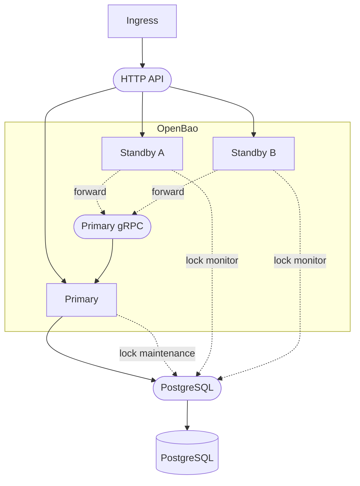

この場合、Kubernetes シークレットを使用してデータベースアクセス認証情報に加え、自動アンシール用の静的シークレットをプロビジョニングします。

### KMS ありの Kubernetes

KMS または HSM を含む追加図：

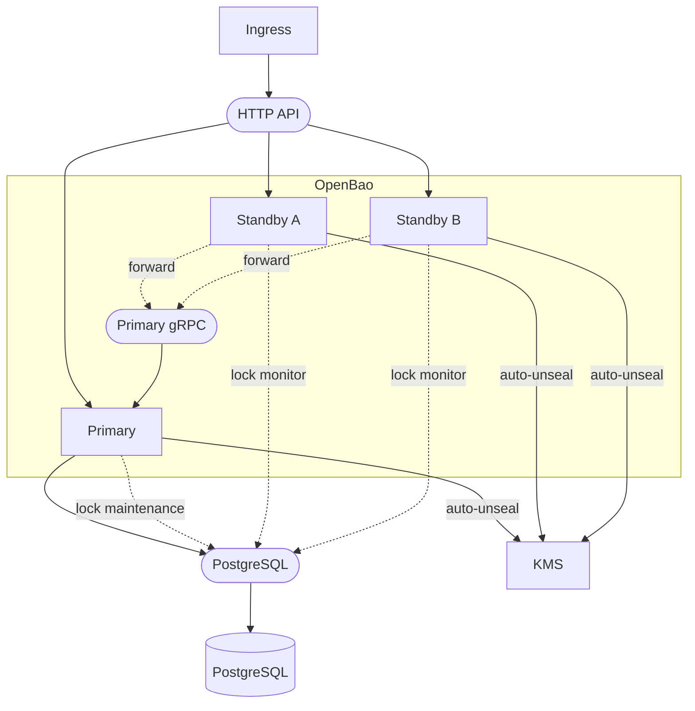

機能的には、すべての KMS/HSM フローは同等です。KMS は、すべての鍵マテリアルが同じである限り、別々のインスタンスを使用できます。

スタンバイノードは、タイムリーなフェイルオーバー耐障害性への参加準備を確保するために、自動アンシール機能が必要です。
