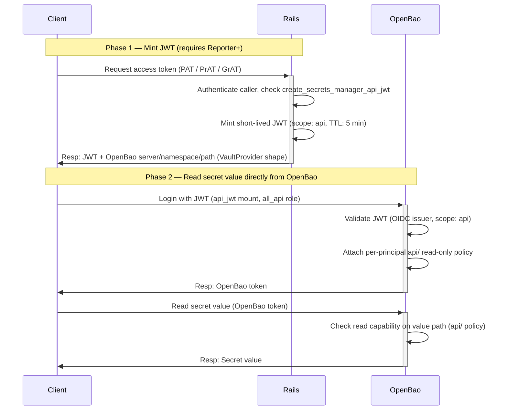

## コンテキスト

GitLab Secrets Manager（SM）は当初、GitLab Rails が発行し、OpenBao の `pipeline_jwt` マウントで検証される Runner JWT を介した **CI/CD パイプライン**という 1 つのパスでのみ、シークレット値へのアクセスをサポートしていました。

Kubernetes ランタイム pod（たとえば External Secrets Operator 経由）、Terraform/OpenTofu データソース、サービスアカウントの自動化スクリプトなどの非 CI ワークロードには、GitLab パイプラインに紐づけられず、GitLab 固有の SDK も使わずにシークレット値を読む方法がありませんでした。

このギャップはベータ顧客から表面化し、[gitlab-org/gitlab#594090](https://gitlab.com/gitlab-org/gitlab/-/work_items/594090)で議論されました。設計は[その議論スレッド](https://gitlab.com/gitlab-org/gitlab/-/work_items/594090#note_3391198730)で合意され、[!240364](https://gitlab.com/gitlab-org/gitlab/-/merge_requests/240364)と[!241443](https://gitlab.com/gitlab-org/gitlab/-/merge_requests/241443)で実装されました。

## 決定

### 新しい `api_jwt` OpenBao マウント

既存の認証タイプごとに 1 つのマウントを持つパターン（runner 用の `pipeline_jwt`、UI 用の `user_jwt`）に従い、非 CI API アクセス向けに、専用の新しい `api_jwt` マウントと独自の CEL ロール（`all_api`）を追加します。既存のマウントには手を加えません。

`user_jwt` に新しいロールを追加するのではなく、新しいマウントを作る理由は次のとおりです。

- **異なる監査アイデンティティ。** OpenBao 監査ログは、マウントとロールによって API アクセスと UI アクセスを区別できます。`user_jwt` を再利用すると、それらが曖昧になります。
- **独立した調整項目。** トークン TTL、bound audience、ポリシー割り当てを、UI パスに触れずにマウントとロールごとに調整できます。
- **既存パターンとの一貫性。** Pipeline と user にはすでに専用マウントがあります。API アクセスにも専用マウントを持たせます。

### 新しい Rails エンドポイント

新しい REST エンドポイントは、呼び出し元のプロジェクトまたはグループ向けに短命 JWT を発行し、OpenBao 接続の詳細を返します。

```plaintext
POST /api/v4/projects/:id/secrets_manager/access_token
POST /api/v4/groups/:id/secrets_manager/access_token
```

レスポンスは `external-secrets.io/v1.VaultProvider` の形に合わせています。これにより、クライアント（ESO、Terraform、スクリプト）は標準的な Vault 互換ツールで利用できます。`expires_at` はトップレベルに含まれるため、クライアントは JWT をパースせずにトークン更新を管理できます。

```json
{
  "expires_at": "2026-06-12T10:35:00Z",
  "provider": {
    "vault": {
      "server": "https://openbao.example.com",
      "namespace": "org_5/ns_42/project_99",
      "path": "secrets/kv",
      "version": "v2",
      "auth": {
        "jwt": {
          "path": "api_jwt",
          "role": "all_api",
          "token": "<encoded JWT>"
        }
      }
    }
  }
}
```

この endpoint は**トークンを発行しますが、シークレット値は決して読みません**。値の読み取りは、クライアント側で OpenBao に対して直接行われます。

### JWT scope と claim

発行される JWT は次を持ちます。

- `secrets_manager_scope: "api"` — [ADR-012](012_jwt_separation.md)を拡張する新しい scope 値です。ADR-012 では `privileged`、`pipeline`、`user` を定義しました。`api` scope は `api_jwt` CEL ロールで検証され、他のすべての mount では拒否されます。
- `auth_via` claim — 監査フォレンジックのために、endpoint の呼び出しに使われたトークンタイプ（`personal_access_token`、`resource_access_token`、`service_account`、`oauth`、または `session`）を記録します。
- TTL: 5 分。

### 新しい `read_value` シークレット権限

この変更以前、プリンシパルごとのシークレット権限は `read`（メタデータのみ）、`write`、`delete` でした。いずれもシークレット値パスへの読み取りを付与しないため、CI フローの外では値を読めませんでした。

新しい明示的な `read_value` 権限を追加します。

| Permission | Action | OpenBao capability | Path |
|---|---|---|---|
| Read metadata（"Read" から名称変更） | `read_metadata` | `read` | メタデータパス |
| Write | `write` | `create` + `update` | 値パス + メタデータパス |
| Delete | `delete` | `delete` | 値パス + メタデータパス |
| **Read value（新規）** | `read_value` | 値パスへの `read` + メタデータパスへの `list` | 値パス + メタデータパス |

既存の `read` action は、`read_metadata` の非推奨 alias として保持します（入力では受け付け、読み戻しでも引き続き出力します）。これにより、フロントエンドは独立して移行できます。データマイグレーションは不要です。action は読み戻し時に OpenBao capability から導出されます。

`read_value` は追加的なものです。バックエンドは `read_metadata` への依存関係を強制しません。`read_value` は単独で有効です。`api/` ポリシーは、`read_value` が付与されている場合、探索のためにメタデータパスへの `list` を自動的に付与します。前提条件として `read_metadata` を要求することは、[gitlab-org/gitlab#602726](https://gitlab.com/gitlab-org/gitlab/-/work_items/602726)に延期された UI レベルのルールです。既存の付与は変更されず、Owner が明示的に opt in するまで何も得ません。

### プリンシパルごとの 2 ポリシー構造

値の読み取りを UI マウントから切り離すため、各プリンシパルには 2 つの OpenBao ポリシーを持たせます。

- 既存の `user_jwt` マウントで使われる **管理ポリシー**（`users/` 配下）: metadata read、write、delete。値パスへの読み取りは決して付与しないため、UI フローは引き続き値を読めません。
- 新しい `api_jwt` マウントで使われる **専用の読み取り専用ポリシー**（`api/` 配下）: 値パスへの read のみ。`read_value` が付与されたときに書き込まれ、付与されていないときに削除されます。

各マウントの CEL ロールは、それぞれ独自のポリシーセットをアタッチします。そのため API トークンは、プリンシパルの他の付与にかかわらず、値を読めますが書き込むことはできません。

### 認可モデル

アクセスは 2 つの独立したレイヤーで強制されます。

1. **トークンの発行**は `create_secrets_manager_api_jwt` によって gate されます。これはロール権限 YAML（`config/authz/roles/reporter.yml`）を通じて Reporter 以上に付与され、namespace で Secrets Manager が有効であることを条件とします。トークンスコーピング（granular token がどの namespace 向けに発行できるか）は、エンドポイントの `route_setting :authorization` 宣言によって強制されます。
2. **シークレット値の読み取り**は、値パスへの `read` capability によって OpenBao 内で別途 gate されます。`read_value` が付与されると Rails はプリンシパルごとの `api/` ポリシーへこれを書き込み、付与されていないときは削除します。プリンシパルに `read_value` の付与がない状態で発行された JWT には、その `api/` ポリシー内の値パスへの `read` capability がなく、OpenBao はすべての読み取り試行を拒否します。

Reporter が発行できることは意図的です。`read_value` は任意の Reporter+ メンバーに付与できるため、発行も同じ人々に開かれている必要があります。発行時に「どこかで `read_value` を持っているか」を確認することは現実的ではありません。`read_value` は OpenBao に存在し、GitLab データベースには存在しないためです。

メンバーシップレベルごとの期待される影響は次のとおりです。

- **非メンバー**: トークンを発行できません。endpoint は 404 を返します（リソースを隠します）。
- **Guest / Planner**: トークンを発行できません。endpoint は 403 を返します（メンバーだが権限が付与されていません）。
- **Reporter 以上**: トークンを発行できます。値を読めるのは、その人（またはその人が属するロール/グループ/メンバーロール）に `read_value` が明示的に付与されたシークレットだけです。

### 受け付けるトークンタイプ

このエンドポイントは、Rails auth pipeline を通じて `User` row に解決される任意の認証情報を受け付けます。PAT、サービスアカウント PAT、スタンドアロンのプロジェクトアクセストークン（PrAT）、スタンドアロンのグループアクセストークン（GrAT）、OAuth token、ブラウザーセッションです。CI job token は明示的に除外します。CI ワークロードにはすでに `pipeline_jwt` パスがあるためです。

Session と OAuth は、エンドポイントが標準的な Rails API route であるため、現時点では受け付けます。トークンのみに制限するかどうかは、OpenBao をブラウザーから直接到達可能にすることがあるかどうかに紐づく未解決の問いです。もしそうする場合、ブラウザーセッションが JWT を発行し OpenBao から直接値を読むことで、非 CI フローと同じように値を Rails の外に保てます。現時点で制限は予定していません。

専用の token scope（`read_secrets_via_openbao`）は、`~group::authorization` と連携して GA maturity まで延期します。ベータでは既存の `api` scope を使います。

### プロビジョニング範囲

`api_jwt` マウントと `all_api` CEL ロールは、この変更の一部として**新規** SM enrollment にプロビジョニングされます。すでに enrollment 済みの namespace へのマウントとロールの backfill は、[gitlab-org/gitlab#602549](https://gitlab.com/gitlab-org/gitlab/-/work_items/602549)で別途追跡されています。

## リクエストフロー

### 非 CI クライアントのシークレットアクセス

このフローには 2 つのフェーズがあります。クライアントはまず Rails を呼び出して短命 JWT を発行し、OpenBao 接続の詳細を受け取ります。その後、その JWT を使って OpenBao に直接アクセスし、シークレット値を読みます。Rails はシークレット値のパスには決して入りません。



## 結果

### メリット

- 非 CI ワークロード（ESO、Terraform、スクリプト）は、標準的な Vault 互換ツールと、すでに持っている GitLab トークンを使って GitLab 管理のシークレットを読めます。
- 読み取りは Rails から切り離されます。シークレットの可用性は GitLab Rails とは独立して OpenBao とともにスケールします。
- `api_jwt` マウントは OpenBao ログ内で異なる監査アイデンティティを提供し、API アクセスを pipeline および UI アクセスから分離します。
- 値へのアクセスは `read_value` によってプリンシパルごとに opt-in され、デフォルトでセキュアです。メンバーシップだけでは値は公開されません。
- レスポンス形状（`external-secrets.io/v1.VaultProvider`）は ESO の HashiCorp Vault provider config に直接対応し、顧客の統合作業を最小化します。

### トレードオフとリスク

- **保存される長命 credential。** ESO パターンでは、Kubernetes Secret（etcd）に保存されるサービスアカウントトークンが必要です。これが主な新しいリスクです。緩和策: 個人 PAT ではなくサービスアカウントトークンを使う、token Secret に対する K8s RBAC を厳格化する、etcd を保存時に暗号化する、トークンを定期的にローテーションする。Workload identity federation（[gitlab-org/gitlab#601894](https://gitlab.com/gitlab-org/gitlab/-/work_items/601894)）は、保存 credential を完全に取り除く長期的な方向性です。
- **JWT TTL は fulfillment の調整項目です。** JWT が発行されると、呼び出し元は期限切れまで読み取りを続けられます。強制の粒度は JWT TTL（提案値 5 分）で制限されます。使用量 quota の強制は発行時に行われ、読み取りレベルの追跡戦略は、より広い fulfillment スレッド（[gitlab-org/gitlab#600967](https://gitlab.com/gitlab-org/gitlab/-/work_items/600967)）に延期されます。
- **JWT はステートレスで、有効期間中に取り消せません。** 盗まれた JWT は、発行元のプロジェクトまたはグループにスコープされ、最大でも JWT TTL の間、プリンシパルに明示的に付与された値の読み取りを許可します。
- **既存 namespace には backfill が必要です。** `api_jwt` マウントは新規 enrollment にのみプロビジョニングされます。既存の SM 有効 namespace には、別個の backfill operation（[gitlab-org/gitlab#602549](https://gitlab.com/gitlab-org/gitlab/-/work_items/602549)）が必要です。
- **`read_value` UI はまだ利用できません。** `read_value` を付与するための GraphQL 公開と UI toggle は別途出荷されます（[gitlab-org/gitlab#602726](https://gitlab.com/gitlab-org/gitlab/-/work_items/602726)）。それが出荷されるまで、`read_value` は API 経由でのみ付与できます。

## 検討した代替案

### シークレット値を返す Rails proxy

却下しました。シークレット値が Rails（メモリ、ログ、エラートラッキング、APM、リクエストトレース）を通過するためです。JWT 発行の形にすることで、Rails をシークレット値のパスから完全に外せます。また、すべての読み取りが Rails の可用性とスケールに結合されます。一方で JWT 発行は頻度が低く、クライアントは TTL の間トークンをキャッシュできます。

### Rails が JWT と Vault token の交換を行い、Vault token を返す

却下しました。発行時に Rails-to-OpenBao の依存関係を追加します。また、明示的な JWT login が ESO にもたらす高ファンアウトの最適化（1 回の login、多数の read）も失われます。

### 既存の `user_jwt` マウントに新しいロールを追加する

却下しました。UI アクセスと API アクセスの監査アイデンティティが曖昧になり、2 つのアクセスパターンの TTL とポリシー設定が結合されます。

### REST の代わりに GraphQL エンドポイント

初期実装では選択しませんでした。主な利用者（ESO、Terraform provider、`vault` CLI、curl スクリプト）はすべて REST を想定しています。GraphQL フィールドは将来追加する可能性があります。

## 参考資料

- Issue: [gitlab-org/gitlab#594090](https://gitlab.com/gitlab-org/gitlab/-/work_items/594090)
- 設計議論: [note_3391198730](https://gitlab.com/gitlab-org/gitlab/-/work_items/594090#note_3391198730)
- 実装 MR: [gitlab-org/gitlab!240364](https://gitlab.com/gitlab-org/gitlab/-/merge_requests/240364)
- GraphQL `READ_VALUE` enum: [gitlab-org/gitlab!241443](https://gitlab.com/gitlab-org/gitlab/-/merge_requests/241443)
- `read_value` 権限 UI: [gitlab-org/gitlab#602726](https://gitlab.com/gitlab-org/gitlab/-/work_items/602726)
- 既存 namespace の backfill: [gitlab-org/gitlab#602549](https://gitlab.com/gitlab-org/gitlab/-/work_items/602549)
- QA spec: [gitlab-org/gitlab#602550](https://gitlab.com/gitlab-org/gitlab/-/work_items/602550)
- Workload identity federation: [gitlab-org/gitlab#601894](https://gitlab.com/gitlab-org/gitlab/-/work_items/601894)
- 使用量追跡と請求: [gitlab-org/gitlab#600967](https://gitlab.com/gitlab-org/gitlab/-/work_items/600967)
- 関連 ADR: [ADR-012: 別個の JWT ドメイン](012_jwt_separation.md)
