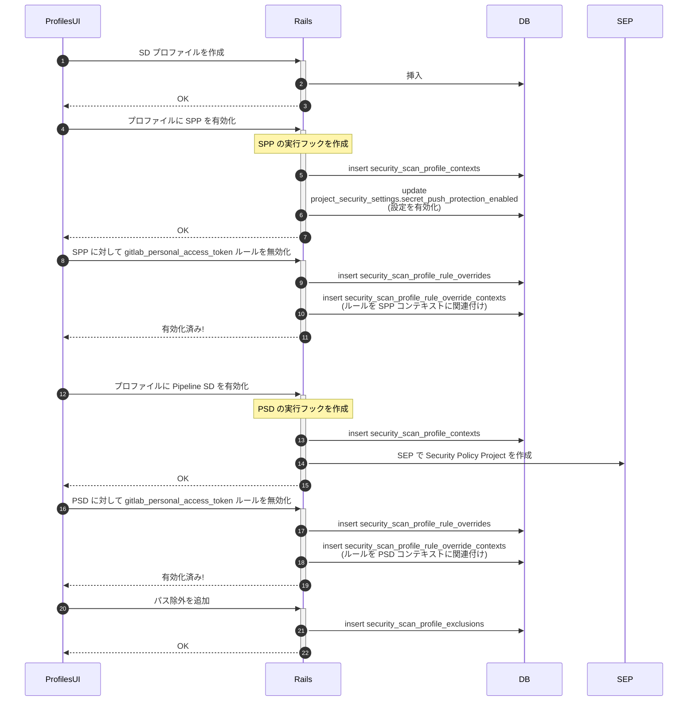
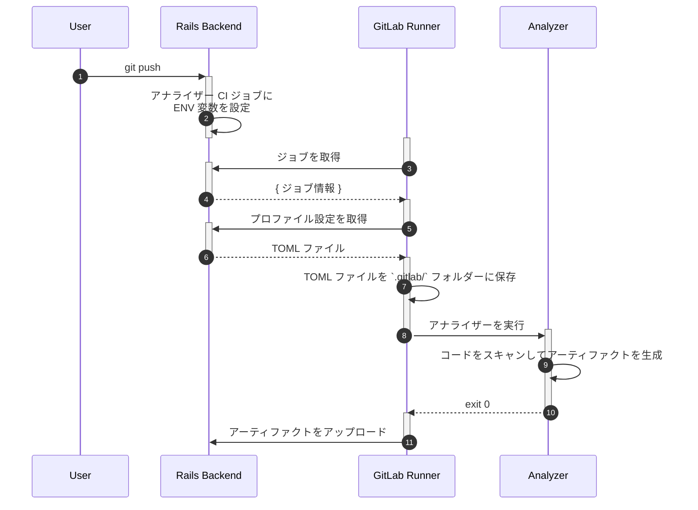
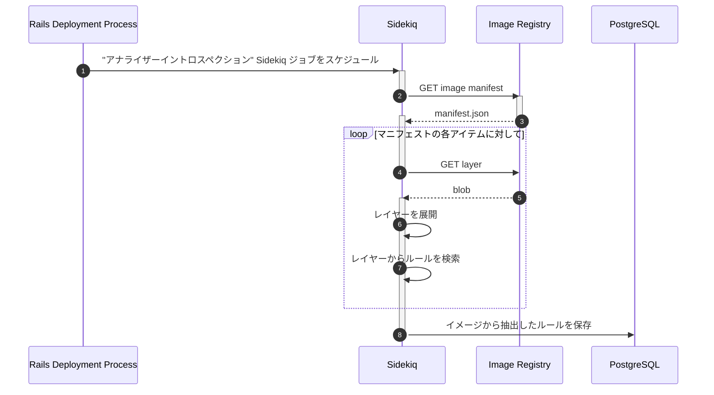
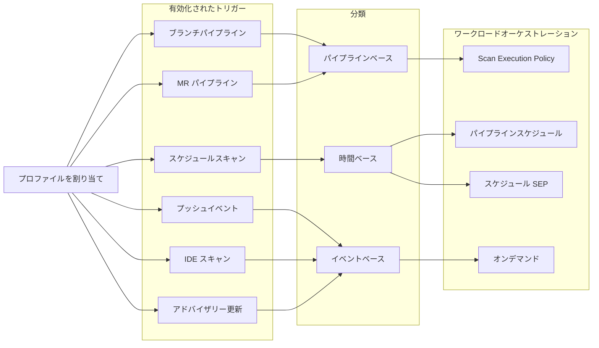
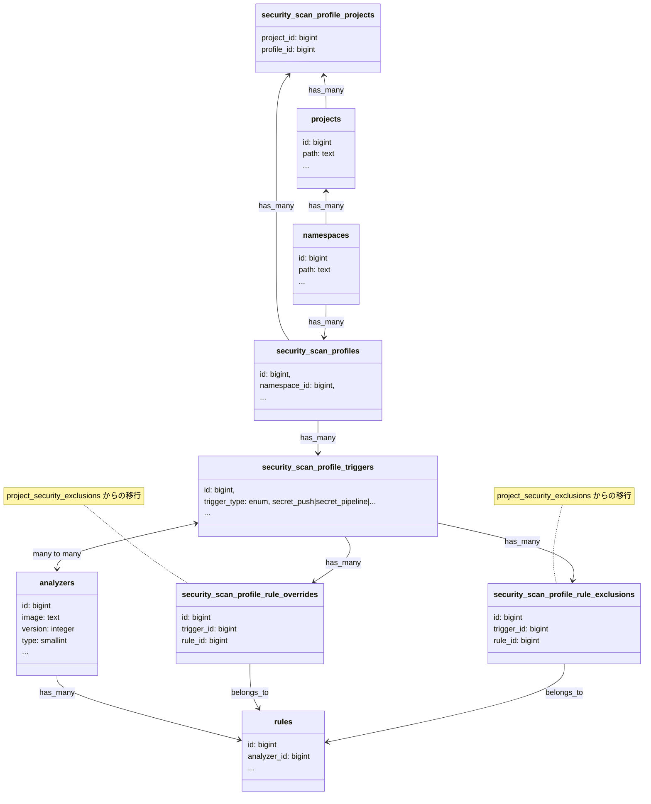

<div class="my-3 border-l-4 border-blue-500 bg-blue-50 px-4 py-3 rounded-r text-sm text-blue-800">
このページには今後予定されている製品・機能・機能性に関する情報が含まれています。ここに示す情報は参考目的のみです。購入・計画の決定にこの情報を使用しないでください。製品・機能・機能性の開発、リリース、タイミングは変更または延期される可能性があり、GitLab Inc. の独自の判断に委ねられています。
</div>

<div class="overflow-x-auto my-4">
<table class="w-full text-sm border-collapse">
<thead>
<tr class="bg-gray-100 text-left">
<th class="px-3 py-2 border border-gray-300">Status</th>
<th class="px-3 py-2 border border-gray-300">Authors</th>
<th class="px-3 py-2 border border-gray-300">Coach</th>
<th class="px-3 py-2 border border-gray-300">DRIs</th>
<th class="px-3 py-2 border border-gray-300">Owning Stage</th>
<th class="px-3 py-2 border border-gray-300">Created</th>
</tr>
</thead>
<tbody>
<tr>
<td class="px-3 py-2 border border-gray-300"><span class="inline-block rounded px-2 py-0.5 text-xs font-medium bg-gray-100 text-gray-700">proposed</span></td>
<td class="px-3 py-2 border border-gray-300"><a href="https://gitlab.com/theoretick" class="text-blue-600 hover:underline">@theoretick</a>, <a href="https://gitlab.com/ahmed.hemdan" class="text-blue-600 hover:underline">@ahmed.hemdan</a>, <a href="https://gitlab.com/minac" class="text-blue-600 hover:underline">@minac</a></td>
<td class="px-3 py-2 border border-gray-300"></td>
<td class="px-3 py-2 border border-gray-300"><a href="https://gitlab.com/or-gal" class="text-blue-600 hover:underline">@or-gal</a>, <a href="https://gitlab.com/g.hickman" class="text-blue-600 hover:underline">@g.hickman</a></td>
<td class="px-3 py-2 border border-gray-300"><span class="inline-block rounded px-2 py-0.5 text-xs font-medium bg-gray-100 text-gray-700">~sec::security risk management</span></td>
<td class="px-3 py-2 border border-gray-300">2024-10-31</td>
</tr>
</tbody>
</table>
</div>


## 概要

セキュリティアナライザーと GitLab Rails 間でアナライザー設定を保存・注入するためのスケーラブルな方法が必要です。永続化された設定プロファイルを導入することで、セキュリティスキャンの実行時に使用する設定オプションの明示的かつ注入可能なリストを提供できます。

## 動機

設定とは、GitLab のセキュリティスキャン実行に関するすべてのユーザー変更可能な動作の包括的なカテゴリ定義です。これにはログレベル、ファイルパスの除外、使用コア数、テスト対象のルールなどが含まれます。

アナライザー設定は当初 CI ベースのスキャン向けに設計されましたが、GitLab のセキュリティアナライザーはパイプライン外への移行が進んでいます。CI ベースのアナライザーでは、従来は各アナライザーに渡して対応するコンポーネントおよびテンプレートで CI 変数を公開することでスキャン実行を設定していました。

このアプローチにはいくつかの課題があります。

- CI コンテキスト外のスキャン（例: Secret Push Protection や Continuous Vulnerability Scanning）の設定が困難
- スキャンコンテキスト間での設定プロファイルの一貫性がない
- ユーザー定義の設定を統一的に保存できない
- 共有設定を組織全体のレベルにスケールさせることができない

設定を標準化し、ユーザー定義の設定を一貫性のあるスケーラブルな方法で保存するニーズも高まっています。

### 目標

GitLab ユーザーに以下の手段を提供します。

- ユーザー定義のアナライザー設定を GitLab 内に安全に保存する
- 複数の設定プロファイルを管理する
- 設定プロファイルをすべての可能なスキャンコンテキストに注入する
- 各サポートアナライザーに対してすべての可能な設定値を検証する
- グループおよびプロジェクトレベルで設定プロファイルを管理する
  - 組織プロファイルを除く
- 何が設定されているか、その設定がどのプロジェクトに適用されているかの可視性を得る

#### ユースケース

### プロファイルスキャンコンテキスト設定のシーケンス



### カスタムルール除外を利用した CI ベーススキャンのシーケンス

ここでは、アナライザー側への変更を一切必要とせずにアナライザーを設定するプロセスを説明します。

**注意:** このアプローチはアナライザーへの変更を必要としませんが、アナライザーチームは各アナライザーバージョンのルールのフォルダー構造をドキュメント化する必要があります。ルール抽出ジョブがこの情報を基にイメージレイヤー内のルールを探すためです。



各アナライザーの CI テンプレートには、設定を取得するための以下の `script` セクションが含まれます。

```yaml
script:
  - wget ${CI_API_V4_URL}/projects/${CI_PROJECT_ID}/security_profiles/${PROFILE_ID}/configurations -O .gitlab/analyzer-config.toml
  - /analyzer run
```

### カスタム設定パラメーターを利用した CI ベーススキャンのシーケンス

ここでは、アナライザー側への変更を一切必要とせずにアナライザーからルールセットを保存するプロセスを説明します。



上記プロセスは、インスタンスがイメージレジストリにアクセスできる限り、セルフホスト型インストールでも動作します。

### 非目標

- 設定プロファイルはアナライザーがスキャンを実行する方法に焦点を当てています。結果の設定とトリアージは初期設計のスコープ外です。
- 設定プロファイルはサードパーティスキャンには適用されませんが、準拠したスキャンが使用したい場合は利用可能です。

## 用語集

- *スキャン* - 脆弱性をスキャンするソフトウェアの実行（[アナライザーとスキャナーの用語集](https://docs.gitlab.com/user/application_security/terminology/#analyzer)を参照）

- *ルール変更* - アナライザーが使用する単一の定義済みルールへの変更（例: 深刻度のオーバーライドやルールパターンの拡張）
- *ルールセット* - 単一のアナライザーが使用するルールのコレクション（例: "GitLab Advanced SAST のルールセットは 100 のルールで構成されています"）
- *ルール* - 特定可能な脆弱性に関連するパターンのコレクション。ルールには一意の識別子とメタデータ（例: 深刻度）があります。
- *ルール拡張* - 検出の特定性またはスコープを高めるためにパターンが変更されたルール
- *ルール除外* - 特定のスキャンプロファイル設定に対して無効化されたルール
- *ルールオーバーライド* - メタデータプロパティがオーバーライドされたルール（例: 深刻度の変更）

- *有効化* - アナライザーが特定のプロジェクトと検出コンテキストでデフォルトで実行するよう設定された状態
- *強制* - アナライザーが「有効化」され、昇格したパーミッションによってのみ無効化できる状態
- *実行* - 特定のアナライザーに対してスキャンがトリガーされた状態

### 使用を避けるべき用語

以下の用語は幅広く多面的であり、重複した意図で混乱を引き起こす可能性があります。修飾語なしでは使用しないようにしてください。

- 設定（Configuration）
- カスタマイズ（Customization）

例えば:

- 推奨: "Q1 では Scan Configuration Profiles をサポートします。Q2 では Scan Configuration Enforcement をサポートします"
  - 非推奨: "Q1 では Scan Configuration をサポートします"
- 推奨: "Q1 では Rule Exclusions をサポートします。Q2 では Rule Overrides をサポートします"
  - 非推奨: "Q1 では Rule Customization をサポートします"

## 提案

1. 永続化設定プロファイル
    1. カスタマイズ可能なグループレベルの設定プロファイルを永続化するためのデータモデルを定義する
    1. 除外をサポートする
        1. パスおよび値ベースの除外を設定プロファイルと関連付ける
        1. ルールのカスタマイズを設定プロファイルと関連付ける
1. スキャンルールセット管理
    1. スキャンルールを GitLab Rails に永続化するための同期メカニズムを定義する
1. スキャン設定
    1. サポートされているすべてのスキャン設定オプションを網羅する JSON スキーマを定義する
    1. ユーザー設定を設定プロファイルとして永続化・管理するための API を開発する（スキーマに対して検証）
    1. ユーザー設定を設定プロファイルとして永続化・管理するための UI を開発する（スキーマに対して検証）
    1. 選択した** 設定プロファイルをスキャンコンテキスト（まず CI から）に注入する
    1. アナライザーを更新し、注入された設定を ENV やデフォルトよりも優先して使用するようにする
    1. アナライザーを更新し、各スキャンの実行に使用した `configuration` を提供するようにする
    1. 設定プロファイル変更時の監査イベントを生成する
    1. スキャン設定プロファイルの変更に対して新しいデフォルトロールと新しいカスタムロールの両方を作成する

### 要件

1. [コアデータモデル](#profiles-db-schema)
1. [スキャントリガーのワークロードオーケストレーション](#workload-orchestration-of-scan-triggers)
1. 移行戦略 - 既存の有効化からプロファイルへ
1. 移行戦略 - プロファイルから高度な設定へ
1. 設定パラメーターオーバーライドの永続化 - [フロー](#sequence-for-ci-based-scans-utilizing-custom-configuration-parameters)はほぼ定義されていますが、データモデルはさらなる定義が必要です。これは DAST と DS 自動修復のブロッカーですが、一般的な動作設定にとっては nice to have です。

### フェーズ 1 - 有効化専用プロファイル

このフェーズでは、迅速なオンボーディングを促進するための読み取り専用プロファイルを提供します。

1. スキャナーごとに定義された、インスタンス全体の定義済み設定プロファイル
1. プロファイルは個々のプロジェクトに関連付けられる
1. プロファイルには*定義済みスキャントリガー*がある（例: "Secret Detection Push Protection Profile" と "Secret Detection Pipeline Protection Profile"）
1. プロファイルは除外、テスト対象のルール、スキャナーパラメーターをカスタマイズ*できない*
1. プロファイルが適用されると、即座にオンデマンドスキャンがトリガーされます。その後、[トリガー条件](#workload-orchestration-of-scan-triggers)が将来のスキャンに使用されます。

### フェーズ 2 - カスタマイズ可能なプロファイル

各プロジェクトで有効化できる、スキャナーごとのカスタマイズ可能な設定プロファイルです。

1. プロファイルはグループレベルで定義され、サブグループに継承可能
1. プロファイルは複数のスキャントリガーを持つことができる
1. プロファイルは除外、テスト対象のルール、スキャナーパラメーターをカスタマイズできる
1. プロファイルが適用されると、即座にオンデマンドスキャンがトリガーされます。その後、[トリガー条件](#workload-orchestration-of-scan-triggers)が将来のスキャンに使用されます。

### スキャントリガーのワークロードオーケストレーション

プロファイルにはスキャンを実行するトリガーの定義が含まれます。[トリガー条件の永続化](#profiles-db-schema)とともに、以下のいくつかの基準を使ってスキャンをスケジュール・開始できるオーケストレーション層が必要です。

1. イベントベースの実行（git プッシュイベント、アドバイザリー更新、デプロイなど）
1. 時間ベースの実行（スケジュールされたパイプラインなど）
1. パイプラインベースの実行（ブランチおよび MR パイプラインなど）

これらの戦略は [[Spike] Profile Workload Orchestration](https://gitlab.com/gitlab-org/gitlab/-/issues/573723) でさらに詳しく検討されます。



### 設定 JSON スキーマ

スキーマの例:

```json
{
  "$schema": "https://json-schema.org/draft/2020-12/schema",
  "$id": "",
  "title": "Security Scan Configuration Options",
  "description": "Mapping of all possible configuration options for GitLab security scans",
  "type": "object",
  "properties": {
    "additional_ca_cert_bundle": {
        "description": "Bundle of CA certs that you want to trust.",
        "type": "string"
    },
    "log_level": {
        "description": "Set the minimum logging level. Messages of this logging level or higher are output. From highest to lowest severity, the logging levels are: fatal, error, warn, info, debug",
        "type": "string",
        "enum": ["fatal, error, warn, info, debug"],
        "default": "info"
    },
    "secret_detection_historic_scan": {
        "description": "Flag to enable a historic Gitleaks scan",
        "type": "boolean",
        "default": false
    },
  }
}
```

### プロファイル DB スキーマ


