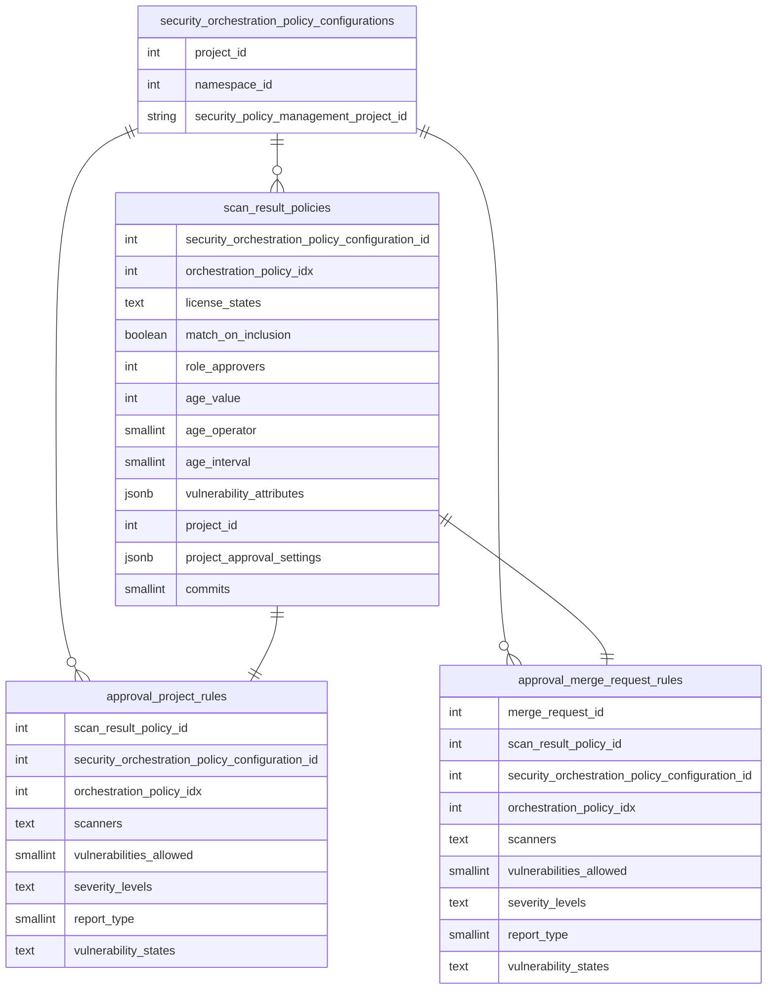
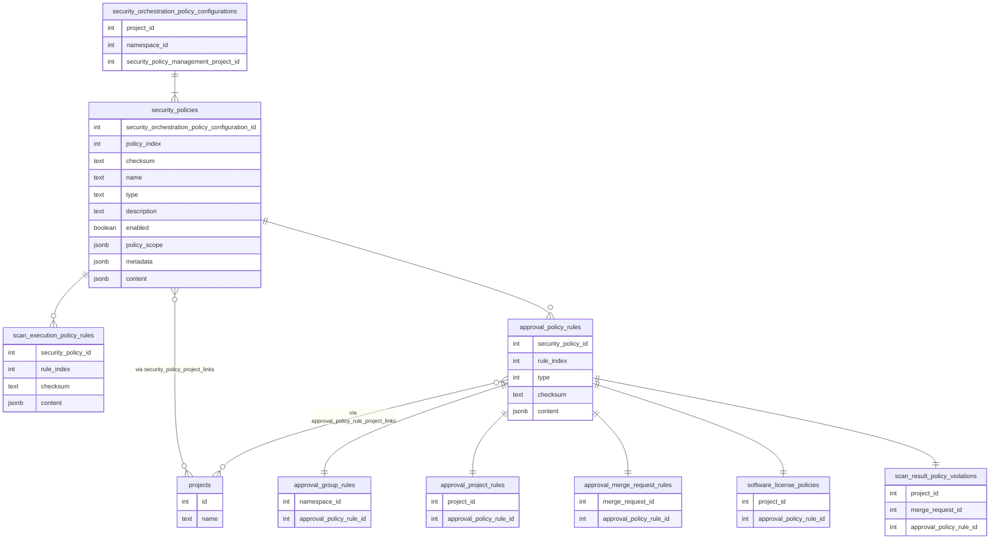

このページには今後予定されている製品・機能・機能性に関する情報が含まれています。ここに示す情報は参考目的のみです。購入・計画の決定にこの情報を使用しないでください。製品・機能・機能性の開発、リリース、タイミングは変更または延期される可能性があり、GitLab Inc. の独自の判断に委ねられています。

<table class="w-full text-sm border-collapse">
<thead>
<tr class="bg-gray-100 text-left">
<th class="px-3 py-2 border border-gray-300">Status</th>
<th class="px-3 py-2 border border-gray-300">Authors</th>
<th class="px-3 py-2 border border-gray-300">Coach</th>
<th class="px-3 py-2 border border-gray-300">DRIs</th>
<th class="px-3 py-2 border border-gray-300">Owning Stage</th>
<th class="px-3 py-2 border border-gray-300">Created</th>
</tr>
</thead>
<tbody>
<tr>
<td class="px-3 py-2 border border-gray-300">implemented</td>
<td class="px-3 py-2 border border-gray-300"><a href="https://gitlab.com/mcavoj" class="text-blue-600 hover:underline">@mcavoj</a>, <a href="https://gitlab.com/sashi_kumar" class="text-blue-600 hover:underline">@sashi_kumar</a></td>
<td class="px-3 py-2 border border-gray-300"><a href="https://gitlab.com/theoretick" class="text-blue-600 hover:underline">@theoretick</a></td>
<td class="px-3 py-2 border border-gray-300"><a href="https://gitlab.com/g.hickman" class="text-blue-600 hover:underline">@g.hickman</a>, <a href="https://gitlab.com/alan" class="text-blue-600 hover:underline">@alan</a></td>
<td class="px-3 py-2 border border-gray-300">~devops::security risk management</td>
<td class="px-3 py-2 border border-gray-300">2023-12-07</td>
</tr>
</tbody>
</table>

このドキュメントは作業中であり、最適化されたポリシー更新と伝播を可能にする新しいセキュリティポリシーアーキテクチャの提案を表しています。

## 概要

セキュリティポリシーは YAML ファイルとしてセキュリティポリシープロジェクトに保存されています。このアプローチには多くの利点（Git を使ったポリシーのバージョン管理、監査可能性など）がありますが、パフォーマンス上の欠点もあります。Git リポジトリからの読み取りには Gitaly への呼び出しが必要なため、柔軟な機能構築の妨げになる可能性があります。

## 動機

YAML から DB の承認ルールへポリシーを同期する現在のアーキテクチャは、再同期をトリガーするイベントが承認ルールを完全に再処理する必要がない場合でも（例: プロジェクトに追加されたユーザーは承認者ルールの承認者を更新するだけでよい）、承認ルールの削除と再作成のプロセスを伴うため、あまりパフォーマントではありません。現在のアーキテクチャには以下の制限があります。

- [新機能の構築が困難](https://gitlab.com/groups/gitlab-org/-/epics/8084)
  - 何かが更新されるたびに Gitaly から YAML を読み取るという制限のため、設定されるポリシーの数に上限を設けています。しかしこの上限は多くのユースケースには不十分です。
- 高いリソース消費
  - `Security::ProcessScanResultPolicyWorker` は長時間実行ワーカーで、Gitaly を呼び出し、承認ルールを削除・作成し、プロジェクトのすべてのオープン MR を更新します。プロジェクトの MR 数が非常に多い場合、完了まで数分かかる場合があります。現在はポリシーを選択的に同期する方法がありません。
- フォールトトレランスが低い
  - ワーカーが実行するすべての操作はアトミックである必要があるため、1 つのステップが失敗するとシステムの最終状態が不整合になる可能性があります。
- 承認ルールテーブルと `scan_result_policies` に冗長データが保存されている
  - すべての MR に対して承認ルールテーブルに YAML のフィールドを保存しているため、冗長で多くの追加ディスクスペースを消費します。
  - `scan_result_policies` に `project_id` を保存しているため、セキュリティポリシーリポジトリに実際にある少数のポリシーに対して膨大な数のレコードが存在します。
- [アクセス管理のためのセキュリティポリシーリストの取得の困難](https://gitlab.com/gitlab-org/gitlab/-/issues/432141)
  - 現在、ユーザーはすでにアクセス権を持つプロジェクトに適用可能なポリシーを見るためにセキュリティポリシープロジェクトへのアクセスが必要です。ポリシーをデータベースから読み取るようにすれば解決します。

### ポリシー同期をトリガーするイベント

以下のイベントが発生するたびにセキュリティポリシーを更新する必要があります。

- [プロジェクト/グループのポリシーが作成/更新/削除された場合](https://gitlab.com/gitlab-org/gitlab/-/blob/89a11e689b1c45bd3ed6f9a9b92d541f0d67116b/ee/app/services/ee/merge_requests/post_merge_service.rb#L83)
- [ポリシーが設定されたグループ内にプロジェクトが作成された場合](https://gitlab.com/gitlab-org/gitlab/-/blob/89a11e689b1c45bd3ed6f9a9b92d541f0d67116b/ee/app/services/ee/projects/create_service.rb#L129)
- [ポリシーが設定されたグループにプロジェクトが転送された場合](https://gitlab.com/gitlab-org/gitlab/-/blob/89a11e689b1c45bd3ed6f9a9b92d541f0d67116b/ee/app/services/ee/projects/transfer_service.rb#L70)
- [プロジェクト/グループの保護ブランチが追加/削除された場合](https://gitlab.com/gitlab-org/gitlab/-/blob/89a11e689b1c45bd3ed6f9a9b92d541f0d67116b/ee/app/services/ee/protected_branches/base_service.rb#L11-21)
- [ポリシーが設定されたプロジェクトのデフォルトブランチが変更された場合](https://gitlab.com/gitlab-org/gitlab/-/blob/89a11e689b1c45bd3ed6f9a9b92d541f0d67116b/ee/app/services/ee/projects/update_service.rb#L138)
- [プロジェクトのコンプライアンスフレームワークラベルが追加/削除された場合](https://gitlab.com/gitlab-org/gitlab/-/blob/89a11e689b1c45bd3ed6f9a9b92d541f0d67116b/ee/app/workers/security/refresh_compliance_framework_security_policies_worker.rb#L25)
- [保留中の policy_configuration を同期するクーロンジョブ](https://gitlab.com/gitlab-org/gitlab/-/blob/89a11e689b1c45bd3ed6f9a9b92d541f0d67116b/ee/app/workers/security/sync_scan_policies_worker.rb#L22)

### 目標

1. Gitaly への呼び出しを減らし、データベースからの読み取りに依存する。YAML データはデータベーステーブルにミラーリングされ、読み取り専用の ActiveRecord モデルがパフォーマンスの懸念なしに機能を構築できるようにします。
1. `approval_project_rules` と `approval_merge_request_rules` のマージリクエスト承認ポリシーに関連する重複したカラムを削除する
1. [UpdateOrchestrationPolicyConfiguration](https://gitlab.com/gitlab-org/gitlab/-/blob/master/ee/app/workers/concerns/update_orchestration_policy_configuration.rb) の現在のプロセスを変更し、関連するすべてのレコードを削除・再作成するのではなく、影響を受けるレコードのみを更新/再作成するようにする
1. マージリクエスト承認ポリシー変更の平均伝播時間を短縮する
1. セキュリティポリシーのワーカーがデータベースに対して実行するクエリ数を削減する

## 提案

### セキュリティポリシーの現在のアーキテクチャ

グループまたはプロジェクトにリンクされたセキュリティポリシープロジェクトは `security_orchestration_policy_configurations` テーブルに対応するエントリを持っています。ポリシーを読み取り/クエリするには、ポリシープロジェクトから YAML を読み取る必要があり、Gitaly への RPC 呼び出しが伴います。これはセキュリティポリシーが設定されたプロジェクト/グループが多数ある場合にパフォーマントではありません。

ポリシープロジェクトに YAML ファイルとして保存されたマージリクエスト承認ポリシーは、`approval_project_rules` テーブルを通じて承認ルールに同期されます。現在、マージリクエスト承認ポリシーに関連するこれらのフィールドをテーブルに保存しています。

- `scanners`
- `vulnerabilities_allowed`
- `severity_levels`
- `report_type`
- `vulnerability_states`

同じフィールドは `approval_merge_request_rules` にも重複しており、各マージリクエストに関連付けられています。これらのフィールドの値が `approval_project_rules` で変更されると `approval_merge_request_rules` も更新されるため、冗長です。

`Security::ProcessScanResultPolicyWorker` はポリシープロジェクトからポリシーを読み取り、承認ルールに変換する役割を担っています。ワーカーは以下の操作を順番に実行します。

- `approval_project_rules` と `approval_merge_request_rules` を削除する
- ポリシープロジェクトから YAML を読み取る（Gitaly への呼び出し）
- YAML を変換して `approval_project_rules` に行を作成する
- オープンなマージリクエストの各 `approval_merge_request_rules` を更新する

YAML からポリシーの正確な差分を効率的に取得することができず（Gitaly への呼び出しが必要、かつ YAML に各ポリシーの一意識別子がない）、承認ルールを削除して再作成しています。

これを避けるために、ポリシープロジェクトからの読み取りを避けるためにマージリクエスト承認ポリシーの読み取りモデルとして機能する `scan_result_policies` テーブル（`Security::ScanResultPolicyRead` モデル）を作成しました。しかし現在、テーブルに必要なフィールドをすべて保存しているわけではなく、`role_approvers`、`license_state`、`match_on_inclusion`（以前は `match_on_inclusion_license`）のみを保存しています。

### 提案されたアーキテクチャ

上記の課題と制限を解決するために、ポリシー YAML のすべてのフィールドを DB（`security_policies` テーブル）に永続化し、Git リポジトリの YAML から読み取る代わりに使用できるようにする必要があります。

DB スキーマはポリシー YAML に密接に対応する必要があり、以下のようになります。

これを実現するために、Git リポジトリから YAML を読み取り `security_policies` テーブルのエントリに変換する新しいワーカー（`Security::PersistSecurityPoliciesWorker`）を導入します。このワーカーはポリシーが作成/更新/削除されたときのみ呼び出されます。現在 Git リポジトリから YAML を読み取っている他のすべての場所では、最新バージョンのポリシーの唯一の情報源（SSoT）として `security_policies` から読み取るようにします。

これにより以下が可能になります。

- テーブルの更新された値と YAML の値を比較することでポリシーの変更内容を把握できる
- DB インデックスを追加してパフォーマンスを向上させる
- `approval_merge_request_rules` と `approval_project_rules` テーブルに保存された冗長データを削減し、DB サイズを縮小する
- `project_id` カラムを削除してジョインテーブルを通じてプロジェクト間のリンクを作成することで `scan_result_policies` の行数を劇的に削減する
- `scan_result_policies` の冗長データを削減する。ルールデータが分解されることで重複した `project_approval_settings` がなくなり、DB サイズが縮小される

[「すべての保護されたブランチ」に対するグループレベル MR 承認ルールの許可](https://gitlab.com/groups/gitlab-org/-/epics/11451)の継続的な取り組みにより、グループポリシーに対して `approval_group_rules` を定義できるようになります。これにより、グループ内の全プロジェクトに対して `approval_project_rules` をコピーする必要がなくなり、ポリシー変更を伝播させるために必要なワーカー数を削減できます。

## 設計と実装の詳細

### ステップ 1: 新しいテーブルを追加する

最初のステップとして、`security_policies`、`approval_policy_rules`、`scan_execution_policy_rules`、`security_policy_project_links`、`approval_policy_rule_project_links` テーブルを導入する必要があります。これらのテーブルとカラムは YAML のフィールドに対応します。

### ステップ 2: ポリシーを DB テーブルに同期する新しいワーカーを導入する

新しいワーカーは YAML を読み取り `security_policies` テーブルの行に変換する役割を担います。`checksum` を使用することで、ポリシーが変更されて再構築が必要かどうか、単に並べ替えられただけかを判断できます。また、効率的なポリシー変更処理のために、作成・更新・削除・並べ替えられたポリシーのポリシー差分を効率的なデータ構造で計算する必要があります。ポリシーが有効で `policy_scope` がプロジェクトに適用可能な場合、`security_policy_project_links` テーブルに行を作成することでポリシーをプロジェクトにマッピングします。このテーブルを使用することで、特定のプロジェクトに適用可能なポリシーをクエリできます。また、`approval_policy_rules`（ポリシーの `rules` フィールドで定義されたもの）を `approval_policy_rule_project_links` テーブルを通じてプロジェクトにマッピングします。

### ステップ 3: 既存のすべてのポリシーを `security_policies` テーブルに移行する

既存のすべてのポリシーを読み取り `security_policies`、`approval_policy_rules`、`scan_execution_policy_rules`、`security_policy_project_links`、`approval_policy_rule_project_links` テーブルに取り込む DB マイグレーションを導入する必要があります。

### ステップ 4: `security_policies` からポリシーを同期する新しいワーカーを導入する

すべてのポリシーがデータベースに移行されたら、テーブルからポリシーを同期する新しいワーカーを導入します。`Security::ProcessScanResultPolicyWorker` はプロジェクトのすべてのポリシーを同期しますが、このステップの新しいワーカーは `security_policy_id` とポリシー変更またはイベントタイプを引数として取り、セキュリティポリシーに関連する承認ルールを選択的に同期します。

### ステップ 5: 既存の承認ルールテーブルを移行して `approval_policy_rule_id` を設定する

すべてのポリシーが移行された後、`approval_policy_rules` テーブルにはポリシーに関連する承認ルールに必要な情報が格納されます。しかし古い承認ルールレコードの場合、`approval_policy_rule_id` は nil になります。このステップでは、`approval_project_rules`、`approval_merge_request_rules`、`approval_group_rules` テーブルの `approval_policy_rule_id` をバックフィルするバックグラウンドマイグレーションを導入します。

### ステップ 6: `scan_result_policies` の代わりに `approval_policy_rules` テーブルを使用する

すべてのポリシーが移行されたら、`scan_result_policies` テーブルから読み取る代わりに `approval_policy_rules` を使用してポリシーに関連するフィールドをクエリします。

### ステップ 7: 承認ルールテーブルからカラムを削除する

このステップでは `approval_project_rules` と `approval_merge_request_rules` から `security_policies` に移行されたカラムを削除します。

### ステップ 8: `scan_result_policies` テーブルを削除する

この時点で、承認ルールが `approval_policy_rules` テーブルを通じてリンクされるため、古いテーブル `scan_result_policies` を削除できます。

## リンク

- [スキャン結果ポリシーにデータベース読み取りモデルを使用する](https://gitlab.com/groups/gitlab-org/-/epics/9971)
- [スパイク: スキャン結果ポリシーのデータベース読み取りモデルのためのアーキテクチャブループリントを準備する](https://gitlab.com/gitlab-org/gitlab/-/issues/433410)
