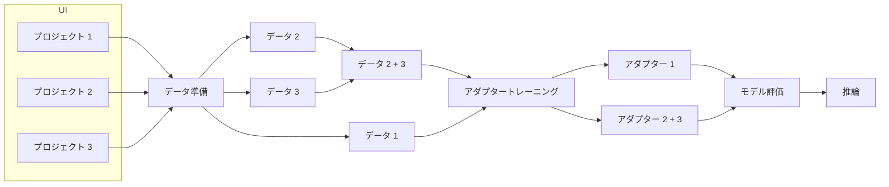
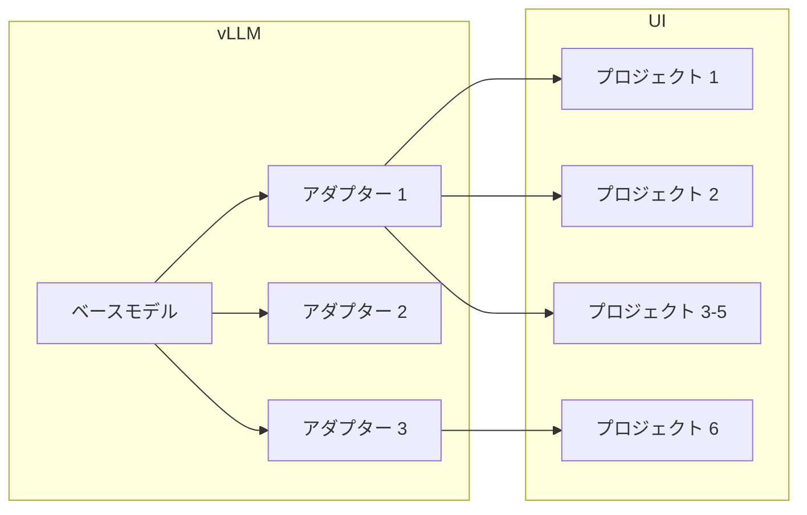
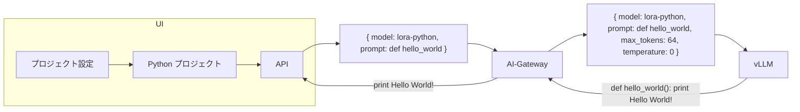
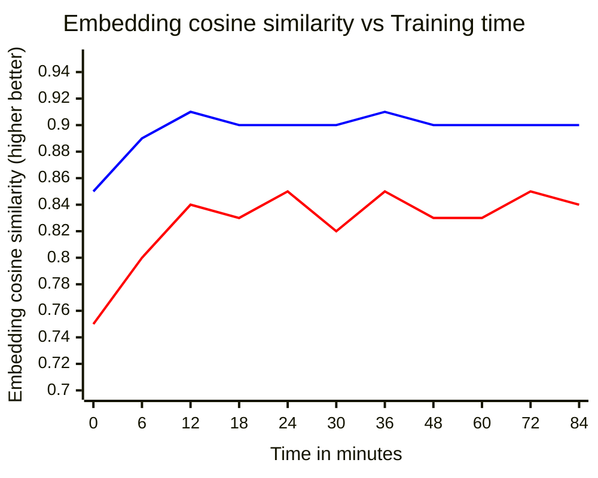
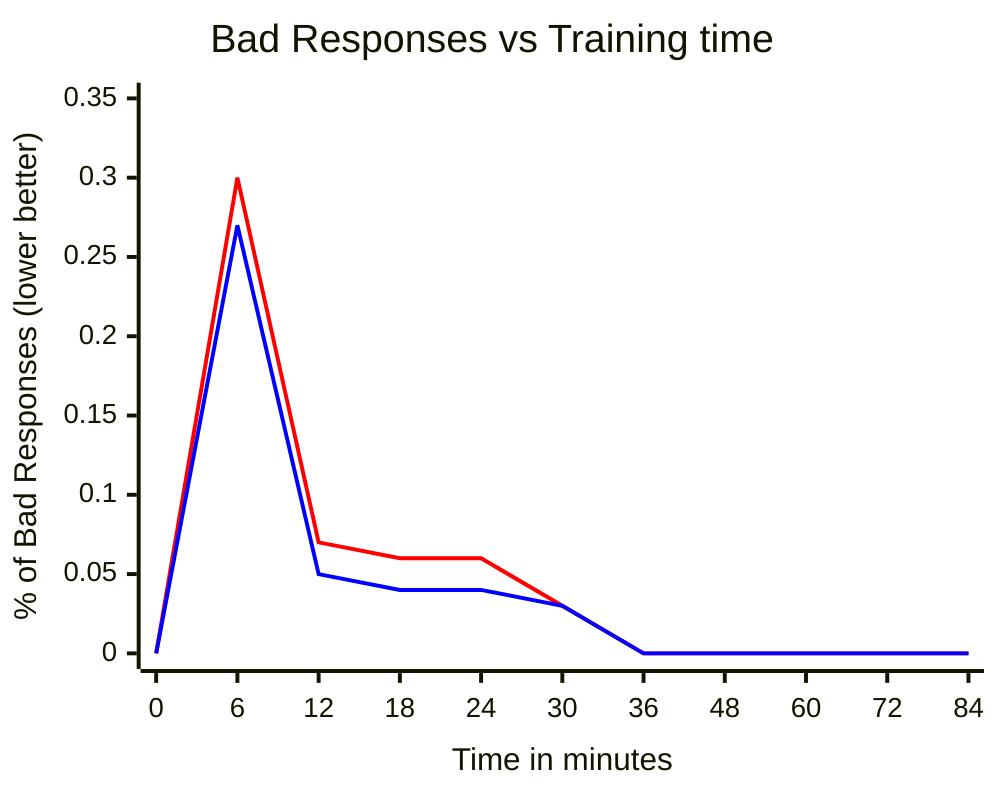

<!-- Design Documents often contain forward-looking statements -->

<!-- This renders the design document header on the detail page, so don't remove it-->



## 概要

このブループリントは、Parameter-Efficient Fine-Tuning (PEFT) を使用して Duo セルフホスト型モデルをファインチューニングするためのソリューションを提案します。

## 目標

GitLab Duo セルフホスト型のお客様向けに、軽量かつ効率的なモデルのファインチューニングを実現します。

## 非目標

モデルのカスタマイズに関するその他の形式:

- フルモデルのファインチューニング
- RAG
- RLHF

## 動機

Duo セルフホスト型の開発に伴い、モデルのカスタマイズに対するニーズが生じています。最初の例として、一部のニッチなコーディング言語のコードサジェスチョンにおいて、サポートされているモデルのパフォーマンスに不満を持つお客様がいました。別の例として、より個人化されたコードサジェスチョン（つまり、要件により正確でコードベースのコーディングパターンに従った機能レスポンス）への要望もありました。モデルをカスタマイズするための可能なアプローチの 1 つは、特定のタスクやユーザーのコードベースに合わせてファインチューニングすることです。

### モデルのファインチューニングの課題

モデル全体のファインチューニングはモデルカスタマイズの手段ですが、いくつかの大きな課題があります。

1) モデルのトレーニングには通常、モデルのロードに必要な vRAM の約 3〜4 倍が必要です。
2) _n_ 個のカスタムファインチューニングモデルを保存すると、ディスク使用量が多くなります。
3) _n_ 個の異なるファインチューニングモデルを同時にサービングすると、遅くてリソースコストが高くなる可能性があります。
4) モデルのトレーニングには広範で専門的な知識が必要であり、お客様にユーザーフレンドリーな UI を提供する必要性を強調しています。

これらの課題と、平均的なお客様が利用可能なハードウェアリソースに制限があるという全体的な期待から、より効率的なアプローチを検討する動機があります。

## PEFT と軽量アダプター

軽量で迅速なファインチューニングを実現するために選択されたソリューションは、PEFT 技術、特にアダプターの使用です。

### アダプターとは何ですか？

アダプターベースの手法は、既存の（ベース）モデルの層に追加のトレーニング可能なパラメーターを追加します。ベースモデルの重みは固定されたままで、新しい追加の重みが新しいデータセットでトレーニングされます。コードサジェスチョンの場合、データセットはお客様のコードベースやその他の適切なデータになります。最も広く使われているアダプターベースの手法の 1 つは Low-Rank Adaptation (LoRA) です。簡単に言うと、LoRA は元のモデルの重みと組み合わされる小さいランクの行列を使用します。これらの新しい小さな重みは別途保存され、ベースモデルの重みよりも大幅に小さいサイズです。推論中、新しい重みはベースモデルの重みと組み合わされ、1 つのベースモデルと複数の異なるタスク固有の LoRA を同時にホストできます。

追加リソース:

- [LoRA: Low-Rank Adaptation of Large Language Models](https://arxiv.org/abs/2106.09685)
- [A Survey on LoRA of Large Language Models](https://arxiv.org/abs/2407.11046)

### 利点と制限

他の手法と同様に、LoRA 手法には利点と制限があります。_一般的に_、LoRA は全体的なパフォーマンスで完全にファインチューニングされたモデルに若干劣ります。しかし、時間とハードウェアが制約となる場合、小さなパフォーマンスの低下は許容できる場合があります。

**利点:**

1) アダプターのトレーニングは、フルモデルのファインチューニングよりもメモリが少なく、はるかに時間効率が良い
2) アダプターのサイズは 100 ギガバイト単位ではなく 100 メガバイト単位になり、ベースモデルはまだ必要ですが、ストレージが簡素化され複数のアダプターの使用が容易になる
3) 異なるアダプター間のホスティングと切り替えは通常、低レイテンシーの手順です

**制限:**

1) LoRA は完全にファインチューニングされたモデルよりも少し「忘れやすい」傾向があります。そのため、LoRA はトレーニングされたタスクではベースモデルよりも優れたパフォーマンスを発揮しますが、トレーニングされていないタスクではベースモデルよりも劣る可能性があります。
2) LoRA はモデル固有で、トレーニングされたモデルでのみ適切に機能します。
3) LoRA は全体的なパフォーマンスと汎化において完全にチューニングされたモデルに劣る可能性が高いです。

## 設計と実装の詳細

### トレーニング

#### UI でのファインチューニングの起動

アダプタートレーニングの最初のステップとして、ユーザーは UI でファインチューニングに使用するプロジェクトまたはプロジェクトのコレクションを選択します。選択後、ユーザーはファインチューニングパイプラインを設定・起動します。
設定ページでは以下の操作が可能です。

- プロジェクトを確認し、アダプターがトレーニングされるファイルタイプを選択する
- データを保存する場所を設定し、必要なキーを提供する（リモートに保存する場合）
- アダプターの重みを保存する場所を設定する
- スライダーやフィールドでハイパーパラメーターを変更する（GitLab がデフォルト値を提供します）

ファインチューニングパイプラインは、設定されたインフラにファインチューニングサービスのインスタンスをデプロイし、以下のステップをトリガーします。

- データ準備
- アダプタートレーニング
- 評価

ファインチューニングサービスは Docker イメージとして提供されます。

コンテナは GitLab.com コンテナレジストリと DockerHub に定期的に公開されます。

#### データ準備

ファインチューニングパイプラインがトリガーされてサービスがデプロイされると、データの準備から始まります。

パイプラインのデータ準備ステップは、選択されたリポジトリが提供するデータを処理し、トレーニングデータセットと検証データセットの両方を構築して、提供された設定に基づいてハードディスクに保存します。データはローカルまたはサードパーティのストレージソリューション（AWS S3 など）に保存できます。ただし、ファインチューニングサービスがサポートしてアクセス可能であることが必要です。トレーニングを高速化するために、データはエンコードされてベクター形式で保存されます。

サービスの初期バージョンでは、ローカルストレージと AWS S3 をサポートします。

#### アダプタートレーニング

データの準備ができたら、パイプラインの次のステップは指定されたデータと設定に基づいてアダプターをトレーニングします。ファインチューニングサービスはデータを取得し、そのデータをトレーニングの基礎として使用します。ユーザーには評価・トレーニングパフォーマンスや残り時間などのフィードバックが提供されます。

ファインチューニングサービスは、よく知られた HuggingFace ライブラリと PyTorch を使用して記述され、重みは広く受け入れられ使用されている HuggingFace 形式で保存されます。

#### ファインチューニングモデルの評価

アダプターのトレーニングが完了したら、パイプラインの次のステップで全体的なパフォーマンスとレスポンスの観点から評価します。

評価ステップは、検証データセットから小さなランダムサンプルを使用してファインチューニングされたモデルをテストし、結果をお客様に提示します。

評価ステップでは、HuggingFace ライブラリを使用して新しくファインチューニングされたモデルをデプロイし、検証データセットのプロンプトでモデルを実行します。モデルの出力は[コサイン埋め込み距離](https://python.langchain.com/v0.1/docs/guides/productionization/evaluation/string/embedding_distance/)を使用してグラウンドトゥルースレスポンスと比較して評価されます。

### 推論

#### ファインチューニングモデルのデプロイ

タスク固有のアダプターがトレーニングされたら、お客様は vLLM を使用してベースモデルとトレーニング済み LoRA をホストする必要があります。

vLLM はベースモデルと LoRA のホスティングと推論をすぐにサポートしています。ベースモデルをアダプターと共にデプロイするには、ユーザーは保存されたアダプターの重みへのパスを提供する必要があります。

特定のアダプターで推論をトリガーするために、お客様は vLLM への API リクエストでアダプターの名前を指定できます。vLLM は背後でアダプターの重みをベースモデルにロード・マージするという複雑な処理をすべて行います。

#### 推論中のファインチューニングモデルと UI

各アダプターは単一のプロジェクトまたはプロジェクトのコレクションで使用できます。また、1 つのプロジェクトで同時に複数のアダプターを使用することも可能です。UI はユーザーがどのアダプターをどのプロジェクトで使用するかを選択できる方法を提供します。UI は、どのアダプターがどのプロジェクトのためにトレーニングされたかも通知します。デフォルトでは、各プロジェクトにベースモデルが割り当てられます。

プロジェクトが新しい場合（つまり、ファインチューニングするコードがあまりない場合）、ユーザーは既存のアダプターからアダプターを選択できます。デフォルトでは、そのようなプロジェクトにもベースモデルが割り当てられます。

機能リクエスト中は、バックエンドによって設定されたモデルが推論に使用されます。

## 技術的な詳細と初期結果

### 技術的な詳細

**アダプターごとのストレージ**: 200MB〜1GB。1 つの LoRA アダプターのサイズは設定によって異なります。

**アダプターごとのトレーニング時間**: 30 分〜1 時間（4xA100 80GB GCP サーバーでテスト済み）。時間はトレーニングデータセットのサイズによって異なります。下のチャートでは、トレーニング時間に対する埋め込みコサイン類似度の結果を示します。「0」分はファインチューニングなしのベースモデルを表します。赤線は `code_suggestions_aig_signatures`、青線は `code-suggestions-input-testcases-v1` データセットの結果です。

わずか 6 分後に相対的なパフォーマンスの向上が見られますが、モデルはまだ不安定であり、空のレスポンスの数を減らすためにさらなるトレーニング時間が必要です。

結論として、モデルを 30〜40 分トレーニングするのが最適と思われます。

**アダプタートレーニングのハードウェアスペック**: 選択されたベースモデルによって異なります。Codestral-22B の場合、最小スペックは 4xA10 で、推奨スペックは 4xA100 80GB GPU です。現在のセットアップは合計 **242GB** の vRAM を使用しています。

### 初期実験（PoC）の結果

コードサジェスチョン（コード生成と補完）機能の PoC が開発されました。アダプターは Codestral-22B の [ai-gateway](https://gitlab.com/gitlab-org/modelops/applied-ml/code-suggestions/ai-assist) 向けにトレーニングされました。ファインチューニングされたモデルは、手動と自動の両方の評価でポジティブな結果を示しました。

**手動**評価では、モデルは GitLab Duo セルフホスト型を使用して WebIDE でデプロイ・テストされました。ファインチューニングされたモデルは、ベースの Codestral-22B モデルよりも全体的なコード構造に合ったコードサジェスチョンを提案しました。

[WebIDE での手動評価の結果](https://gitlab.com/gitlab-org/gitlab/-/issues/505598#note_2284037077)
および[コード補完の結果](https://gitlab.com/gitlab-org/gitlab/-/issues/505598#note_2285961471)

手動評価に加えて、ファインチューニングされたモデルはいくつかのデータセットで評価され、ポジティブな結果を示しました（コードサジェスチョンが既存のコードとより整合するようになりました）。

[ELI5 を使ったコード補完の結果](https://gitlab.com/gitlab-org/gitlab/-/issues/508867#note_2290318225)

以下の表は、コード補完タスクの 3 つの異なるデータセットでのファインチューニングモデルとベースモデルの評価結果を示します。

列の 2 つの数字は: 埋め込み類似度、完全一致です。数値が高いほど良い（結果が期待される出力により近いことを意味します）。

| モデル | code-suggestions-input-testcases-v1 | code_suggestions_aig_random_fim | code_suggestions_aig_signatures |
| ------ | ------ | ------ | ------ |
| Codestral-22B | 0.89, 0.03 | 0.84, 0.0 | 0.80, 0.0 |
| LoRA+Codestral-22B | **0.91**, **0.17** | **0.87**, 0.0 | **0.85**, **0.05** |

評価予定の他のモデル: [Mistral Small 3](https://gitlab.com/gitlab-org/gitlab/-/issues/520221)。

## 代替案

アダプター、特に LoRA は万能薬ではありません。ユースケースに適していることがわかった場合に活用できる 1 つの手法です。その他の潜在的なアプローチは以下の通りです。

1) 小さいモデルのフルファインチューニング
2) ヒューマンフィードバック（RLHF）

**小さい専門家モデル。**
小さいモデルのファインチューニングは適切なアプローチかもしれません。そのようなモデルをトレーニングする時間とハードウェアリソースが多パラメーターモデルよりも優れているためです。しかし、このアプローチのスケーラビリティと小さいモデルの全体的なパフォーマンスには疑問が残ります。

長所:

- 小さな LLM は比較的短時間でファインチューニングできます。
- 完全にファインチューニングされたモデルは LoRA よりも汎化性が高いです。

短所:

- LoRA よりもスケーラビリティが低いです。複数のモデルを同時にホスティングするのはリソースコストが高いです。
- 一般的に大きな LLM よりも性能が劣ります。
- LoRA よりもリソースコストが高い可能性があります。

**人間のフィードバックによる強化学習（RLHF）。**
ヒューマンフィードバックを強化学習（RLHF）と組み合わせて、ユーザーのニーズにモデルをさらにファインチューニングすることができます。例えば、サジェスチョンが受け入れられたか拒否されたかは、モデルのファインチューニングプロセスをカスタマイズするための貴重なドメイン固有のフィードバックデータとして使用できます。

長所:

- ヒューマンフィードバックを活用し、実際のユーザーニーズにモデルをファインチューニングします。
- 継続的な学習が可能です。

短所:

- 通常、大量のデータが必要です。このアプローチはセルフホスト型よりも .com により適しています。

**なぜアダプターなのか？**
前述の通り、お客様のインフラでファインチューニングする際の主な課題は、プロセスを迅速かつリソース効率的にすることです。アダプターにより、モデルを素早く比較的安価にファインチューニングできます。さらに、アダプターはスケーラブルで軽量であり、1 つの GPU 対応インスタンスで数百のアダプターを潜在的にホストできます。アダプターは業界で広く使用されており、迅速で軽量なファインチューニングが必要な場合（例えば [Apple Intelligence](https://developer.apple.com/videos/play/wwdc2024/102/?time=185) や [Github Copilot](https://github.blog/news-insights/product-news/fine-tuned-models-are-now-in-limited-public-beta-for-github-copilot-enterprise/)）に利用されています。
