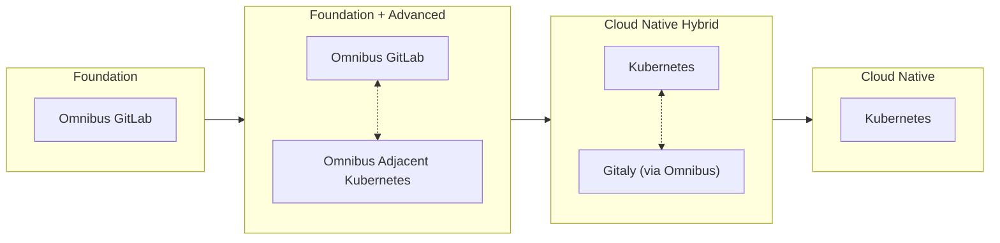
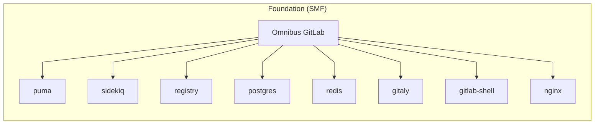
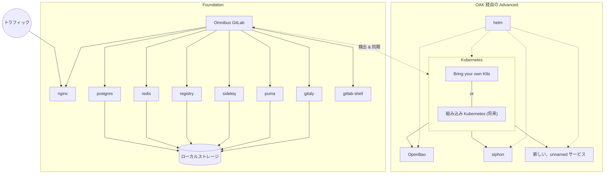
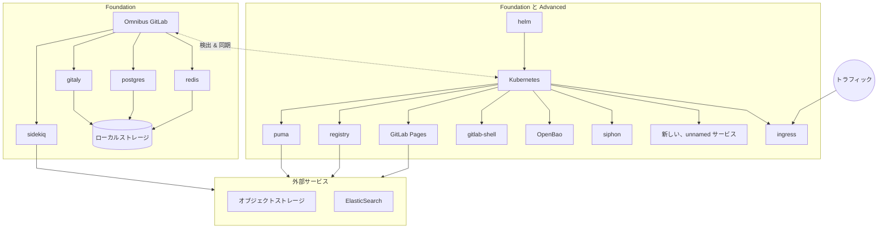
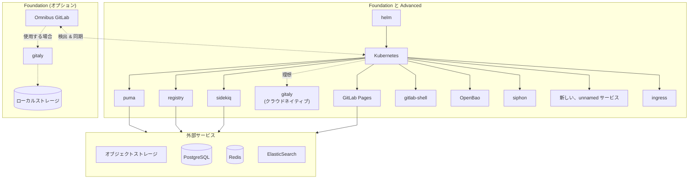

<!--
Document statuses you can use:

- "proposed"
- "accepted"
- "ongoing"
- "implemented"
- "postponed"
- "rejected"

-->

<!-- Design Documents often contain forward-looking statements -->
<!-- vale gitlab.FutureTense = NO -->

このページには今後予定されている製品・機能・機能性に関する情報が含まれています。ここに示す情報は参考目的のみです。購入・計画の決定にこの情報を使用しないでください。製品・機能・機能性の開発、リリース、タイミングは変更または延期される可能性があり、GitLab Inc. の独自の判断に委ねられています。

<table class="w-full text-sm border-collapse">
<thead>
<tr class="bg-gray-100 text-left">
<th class="px-3 py-2 border border-gray-300">Status</th>
<th class="px-3 py-2 border border-gray-300">Authors</th>
<th class="px-3 py-2 border border-gray-300">Coach</th>
<th class="px-3 py-2 border border-gray-300">DRIs</th>
<th class="px-3 py-2 border border-gray-300">Owning Stage</th>
<th class="px-3 py-2 border border-gray-300">Created</th>
</tr>
</thead>
<tbody>
<tr>
<td class="px-3 py-2 border border-gray-300">ongoing</td>
<td class="px-3 py-2 border border-gray-300"><a href="https://gitlab.com/WarheadsSE" class="text-blue-600 hover:underline">@WarheadsSE</a></td>
<td class="px-3 py-2 border border-gray-300"><a href="https://gitlab.com/andrewn" class="text-blue-600 hover:underline">@andrewn</a></td>
<td class="px-3 py-2 border border-gray-300"><a href="https://gitlab.com/WarheadsSE" class="text-blue-600 hover:underline">@WarheadsSE</a>, <a href="https://gitlab.com/mbruemmer" class="text-blue-600 hover:underline">@mbruemmer</a>, <a href="https://gitlab.com/mbursi" class="text-blue-600 hover:underline">@mbursi</a>, <a href="https://gitlab.com/nolith" class="text-blue-600 hover:underline">@nolith</a></td>
<td class="px-3 py-2 border border-gray-300">~devops::gitlab delivery</td>
<td class="px-3 py-2 border border-gray-300">2025-06-24</td>
</tr>
</tbody>
</table>

## 概要

この提案では、セルフマネージド製品を Foundation (`SMF`) と Advanced (`SMA`) という 2 つの明確なコンポーネント層に分割し、Foundation コンポーネントのみが Omnibus に含まれるように GA 要件を変更することを推奨します。
新機能が必要とする Foundation コンポーネントのみを実装し、Omnibus への新しいコンポーネントの追加を大幅に制限する予定です。

セルフマネージドの将来のいかなるパスも、かつて「Initial Delight」と呼ばれた、時間をかけてお客様ベースを非常にうまく構築してきたシンプルな初期採用を保持する必要があります。
[Usage Ping データの分析](https://docs.google.com/presentation/d/1iIDrMYXrw48A6Kj3PK9AeZ6x3YKYmes4mu2jXm5H8us/edit?slide=id.g35e93cc924b_0_58#slide=id.g35e93cc924b_0_58)
は、GitLab のお客様ベースが Omnibus の信頼性と一貫性のある体験に非常に慣れ親しんでおり、信頼できるシンプルさという評判を獲得していることを明確に示しています。
Omnibus GitLab はその使命において成功を収めましたが、その大きな成功が直接的に課題をもたらしました。

有料・無料を問わずお客様は常に持っていたシンプルで信頼できる体験を期待していますが、私たちのロードマップは新機能を提供するためにますます複雑な基盤アーキテクチャを必要としています。

> _「大きな勢いには段階的な変化が必要だ」_

セルフマネージドのお客様向けにコンポーネントを追加する現在のアプローチは、機能をお客様に提供できる速度を妨げています。
現在の Omnibus + Cloud Native GitLab アーキテクチャでまだサポートされていないコンポーネントの積み残しが増えていることからも明らかです。
コンポーネントリストが無限に拡張されることは期待していませんが、積み残しは設定が必要なサービスの複雑さと、手動の設定と相互接続の性質によって大きく影響を受けています。
機能提供に向けて受信コンポーネントの積み残しを加速・解消する手段を今日利用できる方法の中で検討する必要があります。
戦略的なセグメンテーションにより、Advanced を通じてモダンなインフラを持つお客様に最新機能を提供しながら、Foundation を通じて従来のデプロイ要件を持つ現在のお客様のサポートを維持できます。

この提案全体を通じて、FY26 CTO サミットのクラウドネイティブ GitLab セッションの[オプション 2: ハイブリッド Kubernetes を優先/推進](https://docs.google.com/document/d/1f8Ty_AE9IX2cawkyCLsEy7DkjD9zIgcifN7yQBgs2Uo/edit?tab=t.0#bookmark=id.cke52h57bu0i)
を実装し、補足的なエンタープライズ機能要件のクラウドネイティブ実装に優先的に焦点を当てることで、より迅速な提供を促進することを説明します。
「クラウドネイティブへの経路を進む」で説明されている [Omnibus-Adjacent Cluster](https://docs.google.com/document/d/1agZVZkbDrL8Zocp-PLiunQHFNWedEErUy_-fNEAeD2Y/edit?tab=t.0#heading=h.ro7ivridf2pb)
に焦点を当てており、サポートされているプラットフォームに関する明確さのために「[Omnibus-Adjacent Kubernetes](#omnibus-adjacent-kubernetes-oak)」と呼ぶことにします。

Omnibus GitLab パッケージが廃止されることはありませんが、将来のオプションコンポーネントには Free および CE を含むすべての製品 SKU にまたがるクラウドネイティブ実装を要求します。

## 動機

現在のセルフマネージドオプションは、GitLab の運用における参入障壁を低くするために構築・改善されてきました。過去 10 年間のすべての最適化は、単一の機能ローンチの傘の下ですべてのインフラ設計に対応するために行われてきました。
これにより、エンタープライズ機能（例: Ultimate の一部としてのセキュリティ機能）を、大きく異なるインフラ環境で提供しようとすると、大きなエンジニアリングの複雑さが生まれます。
具体的な例として、パイプラインに ClickHouse を利用可能にする必要がある機能がいくつかあります。ClickHouse はスケールの固有の複雑さのため、今日の Omnibus には実装されていません。
お客様は Omnibus のシンプルさを気に入っていますが、これが変更を迅速かつ整合的に推進する能力を妨げ始めています。これらはすべて、お客様の体験に奉仕するためにすべてを統合・管理するための取り組みです。

クラウドネイティブデプロイは、私たちが望む重要な機能を実現します: 自動スケーリング、自己回復、効率的なリソース共有。
これらは従来の OS レベルのインストールでは効率的にサポートされていません。
私たちは期待される品質で適切な時間内にすべてのデプロイ方法に対応するエンジニアリング帯域幅を持っていません。
Omnibus モノリシックパッケージは引き続きサイズを拡大することはできません（既に圧縮で 1.5GB 以上）。そのコンテンツの維持の複雑さと負担は、追加するたびに増大します。

従来の Omnibus ベースのアーキテクチャは、各コンポーネントに専用のシステムリソースと個別のプロセス管理が必要なため、基本的なスケーラビリティの課題に直面しています。
効率的にリソースを共有して動的にスケールする現代のコンテナ化ワークロードとは異なり、Linux パッケージモデルは静的なリソース割り当てを強制し、負荷パターンにうまく適応できません。
私たちはこれらの課題を GitLab.com の実装で経験し、リファレンスアーキテクチャの実装でも再び経験しました。
Omnibus に基づいてスケールされたインスタンスを構築する場合、コアサービスごとに専用ノードを使用するノード・パー・コンポーネント戦略を取らざるを得ません。
コンポーネントに高可用性を提供すると、リソース消費がさらに倍増し、控えめなデプロイでも 20 台以上の VM が必要になります。災害復旧のために Geo を有効にすると、これが各補足地域のフルミラーインフラで 2 倍になります。
コンポーネント数が増え続けるにつれて、Omnibus ベースのアプローチはますます持続不可能でコストがかかり、過剰なリソースを消費することが証明されています。
これらの制限と効率性への懸念は、お客様との会話で共通の焦点となっています。

GitLab.com はすでに、クラウドネイティブデプロイが GitLab をはるかに高い効率でスケールできることを実証しています。
クラウドのリファレンスアーキテクチャを Cloud Native Hybrid 形式で活用しているお客様は、これを直接体験しています。
より複雑で大規模なお客様にサービスを提供するために、Premium/Ultimate 機能リリースをクラウドネイティブファーストの Advanced に集中させる必要があります。
Omnibus で引き続き活躍しているお客様にサービスを提供するために、Foundation コンポーネントを通じてサポートを継続しながら、Advanced コンポーネントがもたらす付加価値の証拠を提供する必要があります。
Advanced を通じて、すべてのお客様が完全にクラウドネイティブなアーキテクチャに移行することを促進します。

### 目標

クラウドネイティブ対応のセルフマネージドユーザー、特にコンポーネントと機能の提供を加速する手段を提供します。
支払済み・未払いインストールベース合計のパーセンテージとして、従来のインフラ上の Omnibus ベースアーキテクチャの何らかのバリエーションを明らかに支持している既存のお客様インストールベースに過度な変更や圧力を強いることなく行います。

特に、これは以下を目指します。

- **イノベーションの加速**: 合理化された方法で補足コンポーネントを全体的な [GitLab アーキテクチャ](https://docs.gitlab.com/development/architecture/#component-diagram)に統合することを促進する。
- デプロイ方法間の透明な差別化を通じた**明確な期待**の提供。
- 異なる環境間での互換性維持の複雑さを軽減することによる**エンジニアリング効率**の向上。
- 高度な機能を求めるお客様に明確なパスを提供することによる**アップグレードパス**の改善。
- 最終的に、GitLab がサポートする必要があるデプロイ設定の組み合わせ数を削減する。新しい Premium/Ultimate インストールをクラウドネイティブ環境に促進する。

明確に避けたいこと:

- Omnibus 上で動作する Premium/Ultimate GitLab の廃止。この製品は近い将来も存在し続けます。既存の機能を見直す唯一の理由は、効果的にスケールできることを確認するためです。ただし、OpenBao や ClickHouse などの新しいオプションの Advanced コンポーネントは Omnibus ではサポートされず、クラウドネイティブコンポーネントとしてのみサポートされます。
- 従来の Omnibus を「内部的に」クラウドネイティブに強制変換する。内部変革をクラウドネイティブに促すことでコンシューマーのスキルセットを拡張することを促進したいと考えています。
- お客様のインフラコストと消費を予期せず増加させる。これらの変更を適切に伝える必要があります。
- あらゆる種類のコンシューマーを疎外し、大規模なアーキテクチャのリファクタリングを強いる。むしろクラウドネイティブへのシフトの価値を示すべきです。

### 非目標

この提案はコンポーネント追加のタイムラインを加速しながら、クラウドネイティブのノーススターに向けて推進することを目的としています。
いかなる意味においても、コンポーネントとサービスの「カンブリア爆発」を促進する意図はありません。
数千のデプロイにわたる GitLab 管理者が各リリースで新しいサービスを継続的に追加・維持・バックアップすることを期待することはできません。
ますます増加するリソース要求、指数関数的な複雑さ、および運用コストの増大をお客様が受け入れることを期待することはできません。

マイクロサービスベースのアーキテクチャに向けて製品が移行することを提唱したり、促進したりするものではありません。

機能とコンポーネントの追加に関して常に存在してきた同じ考慮事項は、引き続き存在します。
[コンポーネントオーナーシップモデル](../../../infrastructure-platforms/production/component-ownership-model/)と準備アセスメントを参照してください。

#### 直交するトピック

この提案に関連する、または交差するいくつかのトピックがあります。
これらは重要ですが、この提案によって直接影響を受けるものでも、この提案に直接的な影響を与えるものでもないため、分離しておきます。

- [エアギャップ](https://en.wikipedia.org/wiki/Air_gap_(networking)) vs 非エアギャップ環境の議論。
- Omnibus GitLab メタパッケージイニシアティブ。
- コンポーネントごとのバージョニングと整合したバージョンの追跡。
- 新しい Premium/Ultimate コンポーネントを別の有料 SKU として扱う議論はこの提案のスコープ外です。
- お客様向けに Kubernetes クラスターをデプロイする特定の方法を決定したり、OAK のためにお客様が自分のクラスターを持ち込むことを要求したりすること。

## 関連イニシアティブ

- [コンポーネントオーナーシップモデル](../../../infrastructure-platforms/production/component-ownership-model/)
- [セルフマネージドの Runway の技術戦略](https://gitlab.com/gitlab-com/gl-infra/platform/runway/team/-/issues/413)
- [クラウドネイティブファーストリファレンスアーキテクチャ](https://gitlab.com/groups/gitlab-com/gl-infra/software-delivery/framework/-/epics/36)
- [クラウドネイティブへの経路を進む: アプローチ評価](https://gitlab.com/groups/gitlab-org/-/epics/17606)

## 提案

このセグメンテーションの実装には実際的な意味があります。Advanced に価値を持たせるためにクラウドネイティブデプロイを強制することを目指しているわけではありません。この懸念に対処するために、既存のモノリスが既存のサービスを提供し、Kubernetes にデプロイされた補足コンポーネントに接続できる混合環境を促進する必要があります。これは Foundation と Advanced の橋渡しとして機能し、お客様が必要なプラットフォーム（Kubernetes）を提供して拡張された Advanced 機能コンポーネントをそこにデプロイすることで、既存の Omnibus を真にスケーラブルな環境に拡張できます。

セルフマネージドオプションを 2 つの明確なコンポーネント層、つまり機能に分割します。

|    | Self-Managed Foundation (SMF) | Self-Managed Advanced (SMA) |
| :- | :---------------------- | :-------------------------- |
| 技術基盤 | オペレーティングシステムパッケージ | コンテナ化されたクラウドネイティブデプロイアーキテクチャ。 |
| 対象お客様 | CE/EE Free; Foundation 機能セット | クラウドネイティブの技術スキルを持つ Free; Premium および Ultimate。 |
| 対象環境 | 従来のインフラ（ベアメタル、VM） | Kubernetes、IaaS クラウド（GCP、AWS など）またはオンプレミスのコンテナ化インフラ。Helm および将来的には Operator によって駆動。 |
| 提供価値 | 既存の Ultimate 機能が利用可能な、基本的な製品機能と本質的な機能。 | 現在および将来のすべての製品機能への完全なアクセス、および大幅に優れたスケーリング。 |
| 機能保証 | 新しい Ultimate 機能は保証されません。新機能に必要なコンポーネントが Omnibus で利用できない場合があります。 | すべての新しい Ultimate 機能が保証されます。 |

この提案のいかなる部分も、既存のコンポーネント内での機能追加がいずれかの層に提供されることを妨げるものではないことに注意してください。
新機能がコンポーネントへの変更や追加を必要としない場合（Rails、フロントエンド、Sidekiq ジョブの組み合わせなど）、これらのロールアウトをブロックするものはありません。
新しいコンポーネントを GitLab にデプロイする必要がある場合（Foundation コンポーネント）、引き続き Omnibus パッケージング、GET、Cloud Native GitLab に含める必要があります。

以下は、Runway がセルフマネージドの Kubernetes で動作できるという仮定の下での新機能のワークフローの概要です。
それが可能になるまでは、Foundation と Advanced に適用される「Premium のみ？」と「ステートレス？」の選択に関して、同様のフローが説明されます。

:link: _[元の Lucid ダイアグラム](https://lucid.app/lucidchart/6bcd26c7-84e8-4b97-ae14-646306b31dfa/edit?page=0_0#)_

## 設計と実装の詳細

FY26 CTO サミットの議論の後、[クラウドネイティブへの経路を進む](https://docs.google.com/document/d/1agZVZkbDrL8Zocp-PLiunQHFNWedEErUy_-fNEAeD2Y/)（将来的に `NRTCN`）内でいくつかのパスを検討しました。
[その探索](https://docs.google.com/document/d/1a_3GAdXnCB0l8f6OR-bSft6BPZ5pWuCyw76ShsKpgfM/edit?tab=t.0)
がこの提案を促進し、既存の Omnibus に隣接する単一テナント Kubernetes クラスターを期待する計画を提示しました。
このパターンが、クラウドネイティブパターンでインスタンスを運用していないお客様向けの Self-Managed Advanced の基礎を形成できると考えています。

基本的に、既存の機能と Foundation 機能はこれらのお客様が現在のインフラ設計で簡単に利用できます。
新しい Premium および Ultimate 機能を利用しようとするにつれて、GitLab の補助サービスのために Kubernetes を導入することでクラウドネイティブインフラに慣れ親しんでいきます。
時間の経過とともに、クラウドネイティブインフラの利点を認識し、完全に Omnibus から移行し始めるでしょう。

すでにクラウドネイティブパターンで運用しているが、GitLab インスタンスをその中で運用していないお客様にとっては、これにより GitLab インスタンスのクラウドネイティブへの移行が促進されます。

実用的な要約として、Foundation と Advanced を使用してお客様が時間をかけて完全にクラウドネイティブに移行することを促進し、移行を奨励しながらエンジニアリングとサポートの体験を簡素化します。

### Omnibus（Foundation のみ）

Omnibus の既存スコープは極めて限定的な形でのみ成長し、Foundation コンポーネントのみを組み込むべきです。
新しいサービスと機能は新しいコンポーネントを通じて主に Kubernetes デプロイとして Advanced に追加されます。

将来的には、高可用性、Geo、ゼロダウンタイムデプロイなどの高度な設定を Omnibus からクラウドネイティブな方法に移行することを検討します。これにより Omnibus の機能セットを SMF の理想である、より小さくシンプルなインスタンスに大幅に簡素化することを目的としています。
これは[プロジェクトフロー](https://docs.google.com/document/d/10f7i-y9aJKo1Lo1IW106ov-OuUXAywNGQg7uPYGOP44/edit?tab=t.0#heading=h.rci2kr8welcp)と整合しており、リファレンスアーキテクチャを簡素化されたクラウドネイティブファーストの将来に向けて推進することを目指しています。

重要な注意点: Advanced に提供された機能は、多くの場合 Omnibus 内のクライアント設定が必要です。
その設定の実装は引き続き行われます。これは機能の_運用_ではなく、機能の_使用_を促進するためのものです。

### Omnibus-Adjacent Kubernetes（OAK）

[Omnibus-Adjacent Kubernetes (OAK)](../omnibus_adjacent_kubernetes/index.md) は、GitLab インスタンスによる排他的な使用を意図した _単一テナント、単一アプリケーション_ の Kubernetes クラスターです。
GitLab は Kubernetes 環境へのワークロードの管理とデプロイに使用される tier-0 サービスであることが多いため、懸念事項の分離を強く推奨します。
GitLab が制御する可能性のあるクラスターから GitLab を分離することで、お客様の本番環境への循環依存や壊滅的な合併症を防ぎます。

この Kubernetes クラスターは k3s や k0s などの組み込みディストリビューション、またはあらゆる出所からのお客様提供のクラスターによって促進できます。

GitLab が組み込み Kubernetes ディストリビューションをデプロイできるメタパッケージの実装を選択する場合、このような選択を検討する際に十分な注意が必要です。
Kubernetes をバンドルすることで、GitLab Delivery ステージは事実上 Kubernetes ディストリビューターになります。
これにより、Kubernetes のアップグレードのテスト、さまざまな深刻度のセキュリティパッチの適用、異なるデプロイ環境での互換性の確保などの継続的なメンテナンス責任が生じます。
これらの要件を満たすには、専門的な Kubernetes の専門知識を持つスタッフと、製品セキュリティへの大きな依存が必要です。
さらに、組み込み Kubernetes の主要候補は FIPS 認定を提供しておらず、これが重大な懸念事項となります。

OAK の最終的な設計は[独自のデザインドキュメント](../omnibus_adjacent_kubernetes/index.md)で詳しく説明されます。

### セグメンテーションによるクラウドネイティブへの移行段階の図解

以下に示す段階は、現在のアプリケーションコンポーネントと今日のロードマップに載っているものに基づいています。

#### Self-Managed Foundation

今日体験できる最もシンプルな形が、Omnibus に基づく Foundation です。
これは「最小」のフットプリントであり、小さなインスタンスが着地して拡張する前の一般的な参入点です。
ここには GitLab の必須機能コンポーネントのコア、つまり GitLab の Foundation そのものだけがあります。

#### 初期 Self-Managed Advanced（SMA）

Advanced の最初期・最もシンプルな形では、すべての Foundation コンポーネントは Omnibus 内で運用され、すべての補足コンポーネントは OAK 内で運用されます。
すべてのインバウンド Web ベースサービスは _Foundation のみ_ を通り、OAK に向けられます。

#### クラウドネイティブ GitLab への移行

クライアントがアクセス可能なサービスのほとんどが OAK に移行した移行フェーズです。
ディスクベースのストレージは必要に応じてオブジェクトストレージに移行します。
すべてのインバウンド Web ベースサービスを OAK _のみ_ に移行します。

ここでの実証:

- 既知のノイジーネイバーワークロードである Sidekiq を、お客様が負荷を十分に理解するまで Foundation 内に留める。
- 外部プロバイダーへの移行前に Omnibus 経由でステートフルなデータサービスを運用する。

#### クラウドネイティブのスケーラビリティ

最終段階は今日の Cloud Native Hybrid リファレンスアーキテクチャデプロイです。
すべての状態は Omnibus および/または外部プロバイダーにあり、すべてのステートレスサービスは Kubernetes で運用されます。

将来的に: Gitaly も Kubernetes 内に移行予定で（Gitaly on Kubernetes の GA を待って）、Omnibus が不要になります。

### 混合環境の相互接続

OAK を通じて Advanced コンポーネントを実装することの結果として、コンポーネント間通信の設定が容易で適切に保護されていることをさらに確保する必要があります。
これらの懸念を軽減するためのアーキテクチャと設計における慎重さが必要です。

GitLab のコンポーネントを相互に通信させるよう設定することは、今日では非常に手動のプロセスであり、Omnibus ベースのアーキテクチャでは GitLab Environment Toolkit（GET）によって大幅に促進され、Cloud Native GitLab が動作する Kubernetes プラットフォームによって大幅に簡素化されています。
GET を使用していないお客様インスタンスや、GET を使用しない多くのお客様がいること、さらに GET よりも低いレベルでこれらの問題を解決する必要があります。

#### サービスエンドポイントの設定

GitLab のアーキテクチャはしばしば[大幅に簡略化された](https://docs.gitlab.com/development/architecture/#simplified-component-overview)方法で説明されます。
実際には、私たちの総アプリケーションスタックのサイズと複雑さはかなり[大きい](https://docs.gitlab.com/development/architecture/#component-diagram)です。
GitLab インスタンスの共通の複雑さは、スケールされた分散アーキテクチャ全体でエンドポイントを設定する必要があることです。
これは単一ノード Omnibus では非常にシンプルで、すべてのサービスが localhost または UNIX ソケット経由で通信できます。
コンポーネントの相互接続の複雑さはインスタンスのサイズとともに増大し、設定が複雑になります。
GET はコンシューマーの代わりに大量の複雑さを自動化を通じてマスクすることで処理しています。
すべてのコンポーネントが Kubernetes 内にある場合、すべてのエンドポイントを Service オブジェクト名を消費するように設定するだけで、Kubernetes クラスター内の DNS に「解決」を任せることができます。

すべての GitLab コンポーネントにサービス検出メカニズムを実装することで、複雑さを大幅に簡素化できます。
このようなメカニズムを実装するアプローチは、DNS によってのみ通知される知性の低いクライアントと、動的な再設定が可能なコンポーネントの両方をサポートするように意図されるべきです。
このようなメカニズムは、パフォーマンスとメンテナンスの複雑さへの影響を慎重に評価せずに必須の実装項目にすべきではありません。

#### 通信のセキュリティ確保

現在の実装にはコンポーネント間の TLS サポートが含まれていますが、かなりの部分が手動です。
これは Kubernetes の外に存在するコンポーネントが最小限の場合は[比較的簡単](https://docs.gitlab.com/charts/advanced/internal-tls/)ですが、それでも手動の操作が必要です。
mTLS コーディネーションサービスを通じた TLS の自動設定を調査することは価値がありますが、利用可能な既存のドキュメントがあるため、ブロッキング項目とは見なされません。
調査するいかなるオプションも、セキュリティチームによって評価され、FIPS および FedRAMP 環境内での使用可能性が確認される必要があります。

#### サービス検出と mTLS 自動化の実装

両方の懸念を自動化された mTLS 対応のサービスメッシュとプロキシオーケストレーションツールで対処できます。
多くのお客様がこれらを実装しており、今日 Cloud Native GitLab でその使用を例示できる複数のお客様がいます。
お客様が明示的なサポートを求めていたオプションの 1 つは [Istio](https://istio.io/latest/docs/) でした。
これは[2 種類のデプロイタイプを組み合わせ](https://istio.io/latest/docs/ops/deployment/vm-architecture/)、相互接続を促進し、プロジェクトのドキュメント内で説明されているように通信を保護できます。

GitLab では[新しい認証スタック](https://gitlab.com/groups/gitlab-org/-/epics/17711)など、mTLS とサービス検出に関わる可能性のある継続的な取り組みがいくつかあります。
この作業はそれらのプロジェクトに委ね、この提案が密接に監視する方が最善かもしれません。

### GitLab 製 Helm チャート全体での一貫性

Helm エコシステムは柔軟ですが、形式・機能・慣例の差異が多い。
GitLab が作成・保守するすべての Helm チャートで期待されるパターンのセットに落ち着き、収束させる必要があります。
一貫したパターンとスタイルに従い、すべての作業にわたってガイドラインとベストプラクティスを実装する必要があります。
これらは保守性・柔軟性・お客様体験によって情報提供されるべきです。

これらの即座の懸念事項の多くは、[Helm チャートの標準化されたツールセット](https://gitlab.com/gitlab-com/gl-infra/mstaff/-/issues/460)と CI コンポーネントを通じた自動化の実装を通じて対処できます。
また、コンポーネントが従うべきスタイルガイドとパターンのセットを策定する必要があります。既存の GitLab Helm チャートの[開発ドキュメント](https://docs.gitlab.com/charts/development/)は合理的な出発点です。

### サポートされる Kubernetes バージョンの定義

GitLab のコンポーネントが良好に動作することが期待されるバージョンの会社全体での説明を定義する必要があります。
コンポーネントによるサポートとアプリケーション自体の動作サポートの違いに注意する必要があります。
そのタイムラインを検討するには、まずお客様の Kubernetes のプラットフォームとしての体験を見る必要があります。

以下のポイントは、お客様が GitLab を Kubernetes バージョン上で最大 2 年間機能することを期待している可能性がありますが、私たちは主に 1 年強の Kubernetes バージョンのサポートに焦点を当てていることを示しています。
これはリリーススケジュールに密接に従い、サポート範囲を明確に示すべきことを示しています。
広範な投資対効果とリスクの検証なしに 4 バージョンを超えて拡張しないようにする必要があります。

#### サポートする Kubernetes バージョンの調査

Kubernetes のリリースは[年 3 回](https://kubernetes.io/releases/release/#the-release-cycle)行われ、公式に[1 年間のパッチサポート](https://kubernetes.io/releases/)を受けます。

主要なクラウドプロバイダーは、Kubernetes プロジェクト自体の公式リリースを超えてさらに 1 年間 K8s バージョンをサポートすることが多いです。

- GKE は GKE の[リリースチャネルを説明](https://cloud.google.com/kubernetes-engine/docs/release-schedule)しており、約 1 年を追加する「Extended」チャネルを含みます。
- AWS は「標準サポート」と 1 年を追加する「拡張サポート」を[詳述](https://docs.aws.amazon.com/eks/latest/userguide/kubernetes-versions.html)しています。
- Azure は[長期サポート](https://learn.microsoft.com/en-us/azure/aks/supported-kubernetes-versions?tabs=azure-cli#long-term-support-lts)として 1 年を追加することを[明示的に説明](https://learn.microsoft.com/en-us/azure/aks/supported-kubernetes-versions)しています。

Helm v3 はサポートされる Kubernetes バージョンとして [`n-3` を定義](https://helm.sh/docs/topics/version_skew/)しています。

Cloud Native GitLab を Helm 経由でデプロイするための現在のツールは[Helm v3.17 の使用を優先](https://docs.gitlab.com/charts/installation/tools/#helm)しています。
これは Kubernetes `1.29` から `1.32` のサポートを示していますが、一部のお客様が古いバージョンの Kubernetes で正常に動作していることは知っています。
これは現在ある程度サポートされる Kubernetes リリースが 1〜2 年分あることを示しています。

GitLab Agent for Kubernetes（"KAS"）などの GitLab コンポーネントは、テストのためにわずかに遅れますが、アップストリームの Kubernetes リリースサイクルに合わせた[サポートバージョン](https://docs.gitlab.com/user/clusters/agent/#supported-kubernetes-versions-for-gitlab-features)を明確に定義しています。

### GET と Dedicated プラットフォームの考慮事項

[GitLab Dedicated](https://docs.gitlab.com/subscriptions/gitlab_dedicated/) は GET を足がかりとして動作し、クラウドネイティブハイブリッド環境をデプロイします。
これらの Dedicated 環境は、GET によるサポートが統合されていれば、クラウドネイティブコンポーネントの使用を通じて補足機能を迅速に実装できます。
一般的に言って、Dedicated はお客様の使用状況に合わせてコンポーネントを有効化・スケールできます。
クラウドネイティブが製品提供の明確な焦点であることが Dedicated のユースケースにとって重要です。

[GitLab Dedicated for Government](https://docs.gitlab.com/subscriptions/gitlab_dedicated_for_government/) は、FedRAMP 認定内での動作に適したコントロールと設定を実装することで、さらに一歩進めています。
一部のコンポーネントは、GitLab リリースの一部として最初に含まれる際にこの環境内での動作基準を満たさない可能性があります。

### サポートおよびカスタマーサクセス組織のスキルアップニーズ

私たちのサポートエンジニア、CSM チーム、そして GitLab エコシステムのおそらく数千のサードパーティコンサルタントは、Omnibus の使用に関する複雑な知識を持っています。
私たちとパートナーは、お客様が Omnibus GitLab を使用する際に期待してきたのと同じレベルのサポートを提供できる必要があります。
GitLab 全体として、すべてのコンポーネントをクラウドネイティブとしてインストール・運用・デバッグ・サポートするために必要な適切な情報を含むようドキュメントを拡充する必要があります。既存のコンポーネントの新しいランブックとガイドを構築・普及させ、すべての新機能とコンポーネントが準備作業の一部としてこのニーズを満たすことを確保する必要があります。

拡充はエンジニアリング作業と並行して開発する必要がありますが、製品の成功のために_実行されなければなりません_。

## ユーザージャーニー

### 既存のお客様（クラウドベース、GET なしの Omnibus オールインワン）が Advanced コンポーネントをデプロイしたい場合

このお客様プロファイルは最初は Self-Managed Foundation のコンシューマーとして認定されます。
Self-Managed Advanced の補足機能（OpenBao、NATS、ClickHouse）をデプロイするために、これらのコンポーネントを配置する Omnibus-Adjacent Kubernetes（OAK）を提供する必要があります。

このお客様はクラウドベースであるため、いくつかの選択肢があります。

- EKS、GKE、または AKS などのクラウドプロバイダーの Kubernetes as a Service を使用する
- 自ら調達した Kubernetes クラスターを提供する
- GitLab がデプロイした Kubernetes の組み込みディストリビューションを使用する
  - _このオファリングを作成することは保証されておらず、おそらく Omnibus GitLab とは別になります。_

お客様が OAK を提供する手段を選択したら、[Self-Managed Foundation](#self-managed-foundation) から[初期 Self-Managed Advanced](#early-self-managed-advanced-sma) モデルに移行します。
Advanced コンポーネントのための OAK の運用経験が、時間をかけてクラウドネイティブ GitLab へのさらなる移行を促進します。

### 既存のお客様（オンプレミス、Omnibus と外部 PostgreSQL）が Advanced コンポーネントをデプロイしたい場合

このお客様プロファイルは、同じ状況のクラウドベースのお客様とほぼ同じです。
明確な違いは、クラウドプロバイダーの Kubernetes サービスが利用できないため、選択肢が少なくなることです。

### 新規お客様（クラウドベース）が最初から OAK 体験でオンボーディングしたい場合

このケースは Advanced コンポーネントをデプロイしたい既存のお客様とほぼ同じ動作をします。
上記のジャーニーを参照してください。

### GitLab Dedicated Environment Automation Engineer が Advanced コンポーネントをデプロイする場合

GitLab Dedicated のお客様環境は、[GitLab Dedicated アーキテクチャ](https://docs.gitlab.com/administration/dedicated/architecture/)で説明されているように、現在の Cloud Native Hybrid アーキテクチャを使用しています。
Environment Automation Engineer の Advanced のクラウドネイティブコンポーネントをデプロイする体験は簡単です。
Dedicated エンジニアは Switchboard、Amp、および Instrumentor を維持し、GET と GitLab Helm チャートの上に構築しています。

例として、[GitLab Secrets Manager](../secret_manager/) のための OpenBao の有効化を使用します。

GitLab Secrets Manager の利用はプロジェクト設定であり、期待される GitLab ライセンスレベルがインスタンスに存在し、OpenBao デプロイへのアクセスがある場合にすべてのインスタンスで利用可能で、公開されます。
お客様は OpenBao を有効化するよう[現在はサポートチケットとして](https://docs.gitlab.com/administration/dedicated/configure_instance/)依頼します。
Dedicated エンジニアは提出されたサポートチケットに対して、Switchboard を通じて適切なアクションを実行します。
その時点から、Dedicated の自動化が Amp、Instrumentor、Tenctl を通じてアクションを実行します。
OpenBao に必要なすべての機能要件がプロビジョニングされ、アプリケーションは次のメンテナンスウィンドウ中にインスタンスの Kubernetes 内の OpenBao と通信するよう設定されます。
お客様が適切なライセンスを設定していれば、各プロジェクトは GitLab Secrets Manager を有効化できるようになります。

この機能の機能要件は以下の通りです。

- API 呼び出しのための Rails から OpenBao への内部ネットワークアクセス。
- GitLab Runner が直接通信するため、Ingress を通じた OpenBao への外部ネットワークアクセス。
- OpenBao が使用するための PostgreSQL データベース。
- シーリング用の適切な KMS のプロビジョニング。
- インスタンスでこの機能を有効化するための適切なライセンスレベル。

この機能の前提条件:

1. [`gitlab/openbao` Helm チャート](https://gitlab.com/gitlab-org/cloud-native/charts/openbao)が [GitLab Helm チャートに統合](https://gitlab.com/groups/gitlab-org/distribution/-/epics/112)されます。
1. 設定が GET を通じて実装され、PostgreSQL データベースと KMS の[プロビジョニングと共に](https://gitlab.com/gitlab-org/gitlab-environment-toolkit/-/blob/main/docs/environment_provision.md)行われます。
1. Instrumentor がラップされた GET を更新し、この機能と Dedicated、Cells、USPubSec 環境での有効化機能を含めます。[gitlab-org/gitlab#473893](https://gitlab.com/gitlab-org/gitlab/-/issues/473893)
1. Switchboard がデプロイメントのオプション制御を公開します。

### GitLab 開発チームが新しいコンポーネントを必要とする機能を追加したい場合

このジャーニーでは、GitLab 内の開発チームが GitLab にコンポーネントを追加しようとする場合を表します。
[GitLab Secrets Manager](../secret_manager/) のために OpenBao を検討します。

これは上記の[提案の概要](#proposal)で示されたフローに従います。

決定ツリーをたどると、以下のようになります。

- GitLab Secrets Manager は OpenBao を使用したいが、現在は提供していません。
- OpenBao は新しいコンポーネントとして追加が必要と判断されます。
- GitLab Secrets Manager は Premium 機能と判断されます。
- OpenBao は Runway でデプロイできますが、Runway はまだセルフマネージドには適用可能ではありません。
- OpenBao アプリケーションはステートレスで、PostgreSQL データベース内にデータを保存します。
  - 注意: OpenBao は状態を管理しますが、それ自体の中ではなく、これはプロビジョニング・レプリケーション・回復力の懸念に対処する必要があります。
- コンポーネントはステートレスな Helm チャートとして Advanced 経由でサービス提供されます。
- コンポーネントは Experimental 成熟度として GitLab.com 用に有効化され、その後機能開発ライフサイクルを経て General Availability に進みます。

[機能の成熟度](https://docs.gitlab.com/policy/development_stages_support/)を通じて進む作業:

1. 開発
    - [準備ワークフロー](https://gitlab.com/gitlab-org/architecture/readiness#overview)に参加する
    - ディストロレス UBI と FIPS ビルドを含む OpenBao コンテナを作成する。
    - 新しいコンテナを使用した OpenBao Helm チャートを作成する。
1. Experimental
    - GitLab.com が使用するために Helm チャートを [GitLab Helm チャート](https://gitlab.com/gitlab-org/charts/gitlab)に統合する。
1. Beta
    - [GitLab Environment Toolkit](https://gitlab.com/gitlab-org/gitlab-environment-toolkit) に設定とプロビジョニングを統合する
    - GitLab Dedicated チームと協力して、Dedicated、Cells、USPubSec 環境内での適切な評価と有効化を実装する。
1. General Availability

## 製品開発への影響

GitLab の任意のコンポーネントの機能が Advanced コンポーネントに依存する場合、そのコンポーネントが存在しない場合に機能が適切に処理される必要があります。
これは Rails モノリスに特に当てはまります。

コンポーネントは常に依存関係の Minor +/-1 のサポートされたスキューで設計され、
適切な機能ゲートと適切な処理を念頭に置いて設計される必要があります。
これにより独立したデプロイとコンポーネントバージョニングの分離が可能になり、
Cells のような複雑な環境でのアップグレードプロセスのリスク軽減が可能になります。

### コンポーネント分類の拡張

特定のコンポーネントが Foundation か Advanced かを判断する最もシンプルな方法:
このコンポーネントは製品のコアとして必須の機能になりますか？

Foundation コンポーネントは Omnibus に実装する必要があります。
すべての Advanced は明示的にクラウドネイティブファーストを対象としています。
Omnibus 内の Advanced コンポーネントの実装はまれな機会であり、それを行うことは Omnibus メタパッケージの実行を前提条件とします。

## 代替ソリューション

### Strangler Fig

FY26Q1 の CTO サミットで、私たちは Omnibus をすべてのアイテムを Kubernetes 内にデプロイする手段にゆっくり変換する可能性を検討しました。これはいくつかの可能な方法で実現できたかもしれません。Omnibus に Kubernetes のマイクロディストリビューションをパッケージングし、その後すべてのコンポーネントをそのクラスターにデプロイするように徐々に切り替える [strangler fig パターン](https://en.wikipedia.org/wiki/Strangler_fig_pattern)を特に検討しました。
その[探索](https://docs.google.com/document/d/1a_3GAdXnCB0l8f6OR-bSft6BPZ5pWuCyw76ShsKpgfM/edit?tab=t.0)は価値ある演習でしたが、複雑さへの影響、リソース要件、補足的なお客様体験要件が懸念を与えることを認めています。この懸念は、GitLab が定期的なビルド・セキュリティパッチ・セキュリティ強化・機能的な FIPS バリデーションを提供するためのメンテナンス負担の責任とリスクを考慮するとさらに大きくなります。

Omnibus GitLab にこの方法で strangler fig パターンを実装することは、この提案が防ごうとしている問題のいくつかを特に引き起こし、GitLab に対するメンテナンスの重大な責任とリスクを課すことになります。

このルートを追求する代わりに、同様の概念を使用して、お客様が時間をかけてアーキテクチャを移行することを_奨励_し、GitLab が動作するクラウドネイティブ環境を運用する経験を構築または取得することを_インセンティブ付け_することを目指します。これはこの提案の目標として、Omnibus-Adjacent Kubernetes クラスターを使用することで達成できます。

### 何もしない

現在の動作とそれが提示する課題をそのまま継続することは、増大する積み残しの停滞にさらされます。Omnibus GitLab やクラウドネイティブ GitLab の方法に機能を含める手段を合理化するためのいくつかの継続的な取り組みがありますが、Kubernetes デプロイ方法を通じて新機能を含めることが私たちの広い組織にとってよりシンプルであるという単純な事実が残ります。クラウドネイティブを最初の優先事項にしても、私たちが今日直面しているステートフルなデータサービスと要件の懸念が解消されるわけではありません。お客様の SRE 体験に注意を払い、データセキュリティを確保するための最善を尽くす必要があります。

## Omnibus GitLab の廃止

選択すれば、Omnibus を完全に廃止することができます。主要な発表後に主要バージョンの作成を停止します。クラウドネイティブデプロイへの移行ツールを提供し、基本的にすべての既存のお客様に移行を強制します。
事実上、「すべての中の母」的な破壊的変更です。

これはお客様ベースとオープンコア製品のスチュワードとしての私たちのコミュニティに対して、はるかに有害であると判断されました。
