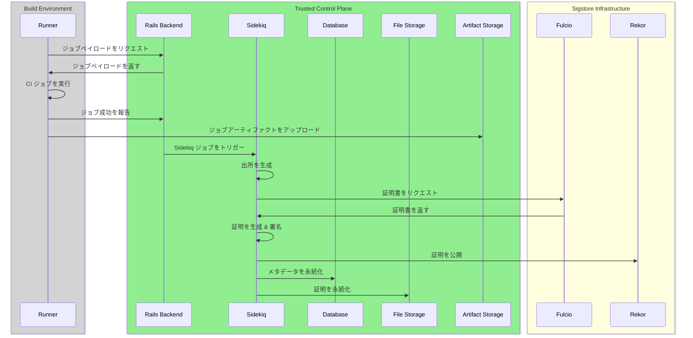
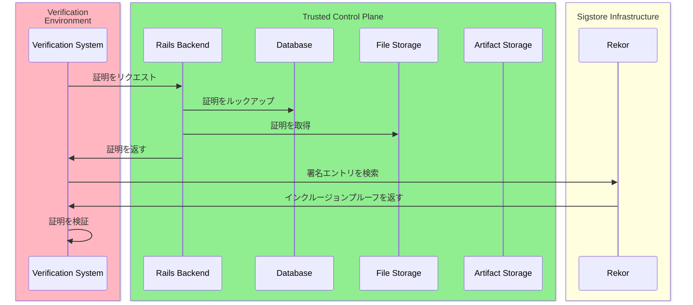

<div class="my-3 border-l-4 border-blue-500 bg-blue-50 px-4 py-3 rounded-r text-sm text-blue-800">
このページには今後予定されている製品・機能・機能性に関する情報が含まれています。ここに示す情報は参考目的のみです。購入・計画の決定にこの情報を使用しないでください。製品・機能・機能性の開発、リリース、タイミングは変更または延期される可能性があり、GitLab Inc. の独自の判断に委ねられています。
</div>

<div class="overflow-x-auto my-4">
<table class="w-full text-sm border-collapse">
<thead>
<tr class="bg-gray-100 text-left">
<th class="px-3 py-2 border border-gray-300">Status</th>
<th class="px-3 py-2 border border-gray-300">Authors</th>
<th class="px-3 py-2 border border-gray-300">Coach</th>
<th class="px-3 py-2 border border-gray-300">DRIs</th>
<th class="px-3 py-2 border border-gray-300">Owning Stage</th>
<th class="px-3 py-2 border border-gray-300">Created</th>
</tr>
</thead>
<tbody>
<tr>
<td class="px-3 py-2 border border-gray-300"><span class="inline-block rounded px-2 py-0.5 text-xs font-medium bg-gray-100 text-gray-700">ongoing</span></td>
<td class="px-3 py-2 border border-gray-300"><a href="https://gitlab.com/nrosandich" class="text-blue-600 hover:underline">@nrosandich</a></td>
<td class="px-3 py-2 border border-gray-300"><a href="https://gitlab.com/darbyfrey" class="text-blue-600 hover:underline">@darbyfrey</a></td>
<td class="px-3 py-2 border border-gray-300"></td>
<td class="px-3 py-2 border border-gray-300"><span class="inline-block rounded px-2 py-0.5 text-xs font-medium bg-gray-100 text-gray-700">~devops::software supply chain security</span></td>
<td class="px-3 py-2 border border-gray-300">2024-12-18</td>
</tr>
</tbody>
</table>
</div>


## 概要

このドキュメントは、GitLab CI/CD パイプライン内で SLSA レベル 3 コンプライアンスを実装するための技術的ビジョン・原則・主要なアーキテクチャ上の決定を概説します。このソリューションは、アーティファクトの出所を生成・署名・検証するための再利用可能でモジュラー・セキュアな方法を提供し、パイプラインのアイデンティティとビルドインフラを強化します。

## 提案

モジュラーで再利用可能なコンポーネントを使用して、GitLab CI/CD パイプライン全体で SLSA レベル 3 コンプライアンスの段階的な実装を提案します。各フェーズは重要なステップに対処します。

1. Sigstore を使用したパイプライン内の出所生成と検証: パイプライン内で出所証明の生成と検証を行う。
1. コントロールプレーンでの出所ステートメント生成: 信頼性を高めるために、出所生成を Runner から GitLab Rails バックエンドに移行する。
1. コントロールプレーンでの証明の生成と署名: セキュリティ向上のために、証明の生成と署名操作を GitLab Rails に移行する。
1. 証明の公開と検証: GitLab が生成した証明の公開と検証方法を有効にする。

この段階的なアプローチにより、MVP を早期に提供でき、時間をかけて段階的なセキュリティとコンプライアンスの強化が追加されます。

## 目標

- 既存のワークフローへの混乱を最小限に抑えながら、公開プロジェクトが [SLSA Build Level 3](https://slsa.dev/spec/v1.1/levels#build-l3) コンプライアンス要件を達成できるようにする。
- トレーサビリティのためにパイプライン変数・コミット ID などの GitLab 固有のプラットフォームデータを出所に埋め込む。
- 署名キーをビルド環境から隔離し、GitLab の Trusted Control Plane による外部署名をサポートする。

## 非目標

- すべての可能なプログラミングエコシステムの依存関係を収集する（まず主要なエコシステムに焦点を当てる）。
- GitLab の既存のアーティファクトストレージと配布メカニズムの置き換え。
- すべてのプロジェクトタイプのサポート（最初は公開プロジェクトに焦点を当てる）。

## 用語集

- [SLSA: Supply-chain Levels for Software Artifacts](https://slsa.dev/spec/v1.1/)、サプライチェーンセキュリティを改善するためのフレームワーク。
- 出所述語（Provenance predicate）: アーティファクトがソースコード・依存関係・環境を含めてどのようにビルドされたかを説明するメタデータ。
- 出所ステートメント（Provenance statement）: 出所述語をソフトウェアアーティファクトに結び付けるドキュメント。
- 出所証明（Provenance attestation）: 出所ステートメントと署名を組み合わせたエンベロープ。
- Sigstore: ソフトウェアアーティファクトを安全に署名・検証・保存するためのオープンソースツール（`cosign` と `gitsign`）。
- OIDC トークン: 安全な署名のために GitLab CI が発行する短命のアイデンティティベースのトークン。
- Runner: GitLab CI/CD パイプラインジョブを実行するビルドエージェント。
- VSA: Verification Summary Attestation（検証サマリー証明）、アーティファクトが特定の要件を満たすことが検証されたことを示す証明。
- GitLab Rails バックエンド: セキュリティクリティカルな操作のための信頼された環境を提供する GitLab Rails バックエンドで、ビルド環境とは別。

## 前提条件

- 出所生成: Sigstore Cosign（CLI、クライアント、またはポート）を使用して出所証明を生成する。
- OIDC ベースのキーレス署名: OIDC ベースのキーレス署名のために Sigstore Fulcio を使用する。
- 透明性ログ: Sigstore Rekor 透明性ログを使用する。
- 署名方法:
  - GitLab Runner ジョブでの OIDC ベースの短命の認証情報によるパイプライン内署名。
  - GitLab の Trusted Control Plane（GitLab Rails）によるパイプライン外署名。

## 設計の詳細

### 高レベルアーキテクチャ

以下のシーケンスダイアグラムは、署名と検証の両方のワークフロー中に行われるインタラクションを示しています。また、以下のエリアにグループ化されたさまざまなシステムも示しています。

- `Build Environment` は GitLab Runner インフラであり、GitLab SaaS・Dedicated・セルフマネージドのいずれかです。
- `Trusted Control Plane` は GitLab バックエンドで、Sidekiq・DB・オブジェクトストレージを含みます。
- `Sigstore Infrastructure` は Fulcio や Rekor などの Sigstore サービスで、公共の良好なインスタンスまたはセルフホスト型です。
- `Verification Environment` は検証を行う任意のシステムです。外部のビルドシステム・別の GitLab CI ジョブ・ユーザーの個人コンピューターのいずれかです。

#### 全体アーキテクチャ


#### 署名ワークフロー



#### 検証ワークフロー



#### フェーズ 1: Sigstore を使用したパイプライン内の出所生成と検証

- Sigstore ツール（cosign）を使用して出所証明を生成する。
- 安全で短命の認証情報のために GitLab CI の OIDC トークンを活用する。
- 出所証明を検証し、Verification Summary Attestations（VSA）を生成する。
- パイプラインに簡単に含められる再利用可能な GitLab CI コンポーネントを構築する。

#### フェーズ 2: コントロールプレーンでの出所ステートメント生成

- 出所ステートメントの生成を GitLab Rails バックエンドに移行する。
- 出所のすべてのフィールドを Trusted Control Plane で生成または検証する。
- 偽造不可能な出所ステートメントを生成する。

#### フェーズ 3: パイプライン外署名

- CI/CD パイプラインから GitLab Rails バックエンドへ署名操作を移行する。
- ビルド環境から署名操作を隔離することでセキュリティを強化する。
- 署名プロセスの集中管理を提供する。
- ビルドと署名の信頼境界を明確に分離する。

#### フェーズ 4: 証明の公開と検証

- 証明 API を通じて証明を発見可能にする。
- 証明 API と UI で証明を発見可能にする。
- 外部パッケージレジストリで Trusted Publisher になる。
- `glab` CLI に検証機能を追加する。

#### フェーズ 5: OCI コンテナイメージの証明

- コントロールプレーンで OCI コンテナイメージを証明する機能を追加する。
- `glab` でこれらのイメージの検証を可能にする。
- インテグレーターの使いやすさを確保するためのドキュメントを改善する。
- 特にエラー報告とファイルサイズ制限に関して、前のフェーズからのバグとフィードバックに対処する。

#### フォローアップ作業: 拡張データ収集

- 詳細なビルドメタデータを収集するツールを統合する（Go の go mod graph、Java の Maven 依存関係ツリーなど）。
- CI/CD ビルドジョブがリクエストした解決済みの依存関係を追跡するために GitLab の仮想レジストリ（旧 Dependency Proxy）を使用する。
- 拡張されたメタデータを含むように出所構造を更新する。
- プライベートプロジェクトとセルフマネージドインスタンスのサポートを拡張する。

### 実装の詳細

#### Sigstore と GitLab OIDC インテグレーション

- Sigstore の使用方法:
  - Sigstore ツール、特に cosign が出所の署名と検証のために活用されます。
  - cosign は GitLab CI の OIDC インテグレーションを利用して、ジョブを安全に認証し短命の認証情報を発行できます。これらの認証情報が出所ファイルに署名します。
  - GitLab が提供する OIDC トークンは実行中のパイプラインジョブにスコープされており、エフェメラルでセキュアです。
- GitLab OIDC インテグレーションワークフロー:
  - GitLab が CI コンポーネントで OIDC トークンを生成し、環境変数として公開します。
  - Sigstore の cosign が OIDC トークンを使用して、GitLab CI ジョブを Sigstore の透明性ログ（Rekor）で認証します。
  - Sigstore はアイデンティティを検証し、ジョブの期間中の署名機能を付与します。
  - cosign が署名済み出所ファイル（JSON 形式）を生成し、GitLab のアーティファクトストアにアップロードします。
- GitLab での OIDC 設定:
  - 既存の ID トークン機能を使用して GitLab OIDC サポートを有効にする。
  - CI/CD の環境変数を使用してトークンと必要なメタデータを公開する。

#### GitLab CI コンポーネント

<details>
<summary>出所署名コンポーネント</summary>

出所署名コンポーネントは、出所の生成と署名の複雑さを抽象化します。テンプレート YAML ファイルを使用した GitLab CI コンポーネントとして実装されます。

**コンポーネントの概要**

- 入力変数:
  - TARGET_ARTIFACT: アーティファクトまたはビルド出力へのパス。
  - BUNDLE_FILE: バンドルファイルを生成するパス。アーティファクトの検証に必要なすべてが含まれます。
  - RUNNER_METADATA_FILE: アーティファクトに明示的に名前が付けられていない場合のデフォルトのファイル名。
- 出力:
  - パイプラインアーティファクトとしてアップロードされた署名済み出所ファイル。

**再利用可能なコンポーネント YAML の例**

```yaml
# .gitlab/components/provenance-signer.yml
component:
  inputs:
    variables:
      TARGET_ARTIFACT: ""  # アーティファクトへのパス
      BUNDLE_FILE: "provenance.json" # 出力バンドルファイル
      RUNNER_METADATA_FILE: "artifacts-metadata.json" # アーティファクトに明示的に名前が付けられていない場合のデフォルトのファイル名

  id_tokens:
    GITLAB_OIDC_TOKEN:
      aud: sigstore

  variables:
    REKOR_SERVER: "https://rekor.sigstore.dev"
    FULCIO_SERVER: "https://fulcio.sigstore.dev"

  image: alpine:latest

  before_script:
    - apk add --update cosign jq

  script:
    - echo "Fetching GitLab Runner metadata..."
    - export RUNNER_METADATA=$(jq -c . ${RUNNER_METADATA_FILE})

    - echo "Generating predicate for ${TARGET_ARTIFACT}..."
    - echo "${RUNNER_METADATA}" | jq -c .predicate > predicate.json

    - echo "Attesting provenance for ${TARGET_ARTIFACT}..."
    - cosign attest-blob --predicate predicate.json \
        --type slsaprovenance1 \
        --oidc-issuer "${CI_SERVER_HOST}" \
        --fulcio-url "${FULCIO_SERVER}" \
        --rekor-url "${REKOR_SERVER}" \
        --identity-token "${GITLAB_OIDC_TOKEN}" \
        --bundle "${BUNDLE_FILE}" \
        --new-bundle-format \
        "${TARGET_ARTIFACT}"

    - echo "Performing self-verification to ensure provenance is valid..."
    - cosign verify-blob-attestation --type slsaprovenance1 \
        --bundle "${BUNDLE_FILE}" \
        --certificate-identity-regexp ".*" \
        --certificate-oidc-issuer "${CI_SERVER_URL}" \
        "${TARGET_ARTIFACT}"
    - echo "Self-verification successful! Provenance is valid."

  artifacts:
    paths:
      - ${BUNDLE_FILE}
    expire_in: 7d
```

</details>

<details>
<summary>出所検証コンポーネント</summary>

出所検証コンポーネントは証明を検証し、VSA を生成します。テンプレート YAML ファイルを使用した GitLab CI コンポーネントとして実装されます。

**コンポーネントの概要**

- 入力変数:
  - BUNDLE_FILE: 出所を含むバンドルファイルへのパス。
  - VERIFICATION_SUMMARY_FILE: 検証サマリー証明を生成するパス。
  - RESOURCE_URL: 公開されたアーティファクトへの完全な URL。
  - POLICY_URL: 検証に使用するポリシーへの URL。
- 出力:
  - パイプラインアーティファクトとしてアップロードされた検証サマリー証明。

**再利用可能なコンポーネント YAML の例**

```yaml
# .gitlab/components/provenance-verifier.yml
component:
  inputs:
    variables:
      BUNDLE_FILE: "cosign-bundle.json" # バンドルファイルへのパス
      VERIFICATION_SUMMARY_FILE: "verification_summary.json" # 出力検証サマリーファイル
      RESOURCE_URL: "" # 公開されたアーティファクトへの完全な URL
      POLICY_URL: "https://gitlab.com/slsa-vsa-policy/v1" # デフォルトポリシー URL

  id_tokens:
    GITLAB_OIDC_TOKEN:
      aud: sigstore

  variables:
    REKOR_SERVER: "https://rekor.sigstore.dev"
    FULCIO_SERVER: "https://fulcio.sigstore.dev"
    VERIFIER_ID: "https://gitlab.com/verifier"
    VERIFIER_NAME: "GitLab Verification Pipeline"
    DOWNLOADED_ARTIFACT: ".tmp/downloaded_artifact"

  image: alpine:latest

  before_script:
    - apk add --update cosign jq curl
    - mkdir -p .tmp

  script:
    - echo "Downloading artifact from ${RESOURCE_URL}..."
    - mkdir -p $(dirname ${DOWNLOADED_ARTIFACT})
    - curl -L -o ${DOWNLOADED_ARTIFACT} ${RESOURCE_URL}

    - echo "Calculating artifact digest..."
    - ARTIFACT_DIGEST=$(sha256sum ${DOWNLOADED_ARTIFACT} | cut -d ' ' -f 1)

    - echo "Downloading policy from ${POLICY_URL}..."
    - POLICY_FILE=".tmp/policy.json"
    - |
      if ! curl -L -f -o ${POLICY_FILE} ${POLICY_URL}; then
        echo "ERROR: Failed to download policy file from ${POLICY_URL}"
        exit 1
      fi

    - echo "Calculating policy digest..."
    - POLICY_DIGEST=$(sha256sum ${POLICY_FILE} | cut -d ' ' -f 1)
    - echo "Policy digest: ${POLICY_DIGEST}"

    - echo "Verifying signed provenance against downloaded artifact..."
    - cosign verify-blob-attestation --type slsaprovenance1 \
        --bundle ${BUNDLE_FILE} \
        --certificate-identity-regexp ".*" \
        --certificate-oidc-issuer ${CI_SERVER_URL} \
        ${DOWNLOADED_ARTIFACT}
    - RESULT="PASSED" # TODO: verify the provenance against the policies

    - echo "Generating verification summary for artifact..."
    - mkdir -p $(dirname ${VERIFICATION_SUMMARY_FILE})
    - jq -n --arg policyUrl "${POLICY_URL}" --arg result "${RESULT}" \
          --arg verifierId "${VERIFIER_ID}" \
          --arg timeVerified "$(date -u +'%Y-%m-%dT%H:%M:%SZ')" --arg resourceUri "${RESOURCE_URL}" \
          --argjson verifiedLevels '["SLSA_L3"]' --arg sha256 "${ARTIFACT_DIGEST}" \
          --arg bundleFilePath "${BUNDLE_FILE}" --arg bundleFileHash "$(sha256sum ${BUNDLE_FILE} | cut -d ' ' -f 1)" \
          --arg policyDigest "${POLICY_DIGEST}" \
          --arg slsaVersion "1.0" '{
        "_type": "https://in-toto.io/Statement/v1",
        "subject": [{
          "name": $resourceUri,
          "digest": { "sha256": $sha256 }
        }],
        "predicateType": "https://slsa.dev/verification_summary/v1",
        "predicate": {
          "verifier": {
            "id": $verifierId
          },
          "timeVerified": $timeVerified,
          "resourceUri": $resourceUri,
          "policy": {
            "uri": $policyUrl,
            "digest": {
              "sha256": $policyDigest
            }
          },
          "inputAttestations": [
            {
              "uri": $bundleFilePath,
              "digest": {
                "sha256": $bundleFileHash
              }
            }
          ],
          "verificationResult": $result,
          "verifiedLevels": $verifiedLevels,
          "dependencyLevels": {
            "SLSA_L3": 3
          },
          "slsaVersion": "1.0"
        }
      }' > "${VERIFICATION_SUMMARY_FILE}"

    - echo "Verification summary generated at ${VERIFICATION_SUMMARY_FILE}"
    - jq . ${VERIFICATION_SUMMARY_FILE}

    - echo "Signing the verification summary attestation..."
    - cosign attest-blob --predicate "${VERIFICATION_SUMMARY_FILE}" \
        --type slsaverificationsummary \
        --oidc-issuer "${CI_SERVER_HOST}" \
        --fulcio-url "${FULCIO_SERVER}" \
        --rekor-url "${REKOR_SERVER}" \
        --identity-token "${GITLAB_OIDC_TOKEN}" \
        --bundle "${VERIFICATION_SUMMARY_FILE}.bundle" \
        "${DOWNLOADED_ARTIFACT}"

    - echo "VSA signed and stored at ${VERIFICATION_SUMMARY_FILE}.bundle"

    - |
      if [ "$RESULT" == "FAILED" ]; then
        echo "Policy verification FAILED. Exiting with error."
        exit 1
      fi

  artifacts:
    when: always
    paths:
      - ${VERIFICATION_SUMMARY_FILE}
      - ${VERIFICATION_SUMMARY_FILE}.bundle
    expire_in: 7d

  allow_failure: true
```

</details>

<details>
<summary>例: パイプラインへのコンポーネントの追加</summary>

プロジェクトが再利用可能なコンポーネントを .gitlab-ci.yml パイプラインに統合する方法を示します。

パイプライン YAML の例

```yaml
stages:
  - build
  - provenance
  - publish
  - verify

variables:
  RUNNER_GENERATE_ARTIFACTS_METADATA: "true"
  RUNNER_METADATA_FILE: "artifacts-metadata.json" # アーティファクトに明示的に名前が付けられていない場合のデフォルトのファイル名

build_artifact:
  stage: build
  script:
    - echo "Building artifact..."
    - mkdir -p dist
    - echo "Example artifact content" > dist/example-artifact.txt
  artifacts:
    paths:
      - dist/
    expire_in: 7d

generate_provenance:
  stage: provenance
  needs: ["build_artifact"]
  component: .gitlab/components/provenance-signer.yml
  variables:
    TARGET_ARTIFACT: "dist/example-artifact.txt"
    BUNDLE_FILE: "dist/provenance.json"
    RUNNER_METADATA_FILE: "${RUNNER_METADATA_FILE}"

publish_artifact:
  stage: publish
  needs: ["generate_provenance"]
  script:
    - echo "Publishing artifact to package registry..."
    - |
      ARTIFACT_URL=$(curl --header "JOB-TOKEN: ${CI_JOB_TOKEN}" \
        --upload-file dist/example-artifact.txt \
        "${CI_API_V4_URL}/projects/${CI_PROJECT_ID}/packages/generic/artifacts/1.0.0/example-artifact.txt" \
        | jq -r '.location')
    - echo "ARTIFACT_URL=${ARTIFACT_URL}" >> publish.env
  artifacts:
    reports:
      dotenv: publish.env

verify_provenance:
  stage: verify
  needs: ["publish_artifact"]
  component: .gitlab/components/provenance-verifier.yml
  variables:
    BUNDLE_FILE: "dist/provenance.json"
    VERIFICATION_SUMMARY_FILE: "dist/verification_summary.json"
    RESOURCE_URL: "${ARTIFACT_URL}"
    POLICY_URL: "https://gitlab.com/my-policy"
```

</details>

#### パイプラインワークフローの説明

- ビルドアーティファクトステージ（build_artifact）:
  - アーティファクト（バイナリ、コンテナイメージなど）をビルドします。
  - アーティファクトをパイプラインアーティファクトとして保存します。
- 出所生成ステージ（generate_provenance）:
  - provenance-signer コンポーネントを使用して以下を実行します:
    - ビルドメタデータを含む詳細な出所述語を生成する。
    - 出所ステートメントに含めるためにアーティファクトのダイジェストを計算する。
    - GitLab の OIDC トークンを使用して Sigstore の cosign で出所に署名する。
    - 出所が有効であることを確認するために自己検証を実行する。
    - 署名済み出所をジョブアーティファクトとしてアップロードする。
- アーティファクト公開ステージ（publish_artifact）:
  - アーティファクトをレジストリやリポジトリに公開します。
  - 検証での使用のために公開されたアーティファクトの URL をキャプチャします。
  - このステージはビルド/署名と検証を分離し、本当の懸念事項の分離を確保します。
- 出所検証ステージ（verify_provenance）:
  - provenance-verifier コンポーネントを使用して以下を実行します:
    - 公開されたアーティファクトを URL からダウンロードする。
    - 必要な検証ポリシーをダウンロードする。
    - ダウンロードされたアーティファクトに対して署名済み出所を検証する。
    - 証明の SLSA L3 要件を確認する。
    - Verification Summary Attestation（VSA）を生成する。
    - GitLab の OIDC トークンを使用して Sigstore の cosign で VSA に署名する。
    - VSA をジョブアーティファクトとしてアップロードする。
    - 検証が失敗した場合はジョブを失敗させますが、パイプラインの続行は許可します。

### セキュリティの考慮事項

- エフェメラル OIDC トークン:
  - ID トークンは短命で現在のジョブにスコープされています。
  - これにより、パイプライン実行コンテキスト外で再利用できないことが保証されます。
- アーティファクトと出所のストレージ:
  - ビルドアーティファクトと署名済み出所ファイルの両方を安全に保存するために GitLab のアーティファクトストレージを使用します。
  - アーティファクトは自動的に管理され、指定された時間後に期限切れにできます。
- 隔離:
  - 共有 Runner を使用する場合は、サンドボックス化された環境（エフェメラルコンテナ）を確保します。
  - セルフホスト Runner は、トークン漏洩を防ぐためにセキュリティのベストプラクティスに従う必要があります。
- 依存関係管理:
  - サプライチェーン攻撃を防ぐために Sigstore ツール（cosign）の特定のバージョンをピン留めします。
- CI 変数:
  - CI 変数は署名済み出所ファイルに含まれます。ただし、`Masked` または `Masked and hidden` 変数は値ではなくキーのみが保存されるという Visibility 設定に従います。
- 懸念事項の分離:
  - 出所の生成と検証の分離により、検証が真に独立していることが保証されます。
  - VSA は検証コンポーネントによって生成され、明確な信頼の連鎖を提供します。

### コンポーネントのメンテナンスとスケーラビリティ

- チームが安定バージョンを取得できるよう、バージョン管理された Git リポジトリで GitLab CI コンポーネントを公開します。
- 採用のための明確なドキュメントと例を提供します。
- 後のフェーズで追加のメタデータ収集と署名の強化を含むようにコンポーネントを拡張します。

### 決定事項

- [001: 検証コンポーネント](decisions/001_verification_component.md) - 専用の CI/CD コンポーネントで SLSA 出所証明を検証する。
- [002: 出所生成場所](decisions/002_provenance_generation_location.md) - GitLab Rails バックエンドで SLSA 出所ステートメントを生成する。
- ~~[003: 証明の生成と署名場所](decisions/003_attest_sign_location.md) - glgo で SLSA 証明を生成・署名する。~~
- [004: 証明の生成場所を Sidekiq に変更](decisions/004_attestation_in_sidekiq.md) - cosign を GitLab Rails にバンドルし、GitLab Rails バックエンドで証明を実行する。
- [005: PublishProvenanceService での SHA-256 計算の実行](decisions/005_perform_sha256_in_service.md) - PublishProvenanceService 内でアーティファクトの SHA-256 ハッシュ計算を実行する。
- [006: OCI レジストリでの SBOM と出所を使った署名](decisions/006_signing_with_sbom_and_provenance_in_oci.md) - OCI イメージの出所証明と SBOM 署名。
