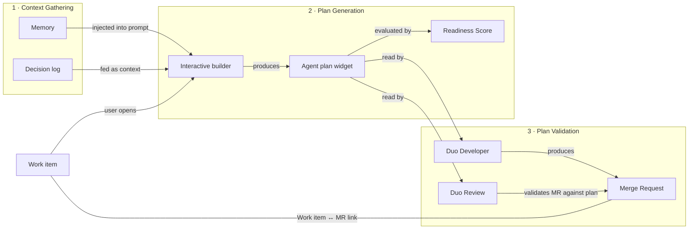

<!-- Design Documents often contain forward-looking statements -->
<!-- vale gitlab.FutureTense = NO -->

このページには今後予定されている製品・機能・機能性に関する情報が含まれています。ここに示す情報は参考目的のみです。購入・計画の決定にこの情報を使用しないでください。製品・機能・機能性の開発、リリース、タイミングは変更または延期される可能性があり、GitLab Inc. の独自の判断に委ねられています。

<table class="w-full text-sm border-collapse">
<thead>
<tr class="bg-gray-100 text-left">
<th class="px-3 py-2 border border-gray-300">Status</th>
<th class="px-3 py-2 border border-gray-300">Authors</th>
<th class="px-3 py-2 border border-gray-300">Coach</th>
<th class="px-3 py-2 border border-gray-300">DRIs</th>
<th class="px-3 py-2 border border-gray-300">Owning Stage</th>
<th class="px-3 py-2 border border-gray-300">Created</th>
</tr>
</thead>
<tbody>
<tr>
<td class="px-3 py-2 border border-gray-300">ongoing</td>
<td class="px-3 py-2 border border-gray-300"><a href="https://gitlab.com/fredericcaplette" class="text-blue-600 hover:underline">@fredericcaplette</a></td>
<td class="px-3 py-2 border border-gray-300"><a href="https://gitlab.com/ntepluhina" class="text-blue-600 hover:underline">@ntepluhina</a></td>
<td class="px-3 py-2 border border-gray-300"><a href="https://gitlab.com/fredericcaplette" class="text-blue-600 hover:underline">@fredericcaplette</a>, <a href="https://gitlab.com/vanessaotto" class="text-blue-600 hover:underline">@vanessaotto</a>, <a href="https://gitlab.com/marcsaleiko" class="text-blue-600 hover:underline">@marcsaleiko</a></td>
<td class="px-3 py-2 border border-gray-300">~devops::plan</td>
<td class="px-3 py-2 border border-gray-300">2026-04-16</td>
</tr>
</tbody>
</table>

## 概要

Spec-Driven Development（SDD）は、インテントを収集してエージェントによる作業を通じてアウトプットを生成することを根本的な目的としています。今日、作業を実行するために必要なコンテキストは、Issue、コメント、デザインファイル、コード、そして人々の頭の中に散在しています。構造化された入力なしにワークアイテムに基づいて行動しようとするエージェントは、なぜ・どのように・何をするかが欠如しているため、一貫性のない結果を生み出します。

SDD は GitLab ワークアイテム上に構造化された計画レイヤーを導入することでこれを解決します。**エージェントプラン**は人間と AI エージェントが協力して構築され、プロジェクトコンテキストで充実化され、その後ダウンストリームの実行エージェント（Duo Developer）と検証エージェント（Duo Review）によって消費されます。

私たちは、行われるすべての作業がエージェントと人間の両方に機能するという考え方でこの機能を構築しています。実際には、SDD は作業の方法であり、エージェントによる人気の高まりが見られます。しかし基礎となる概念は非常に人間的なものです：エージェントによって加速された、ドキュメント中心の開発方法です。

製品のコンテキストについては[親エピック](https://gitlab.com/groups/gitlab-org/-/work_items/21218)と[Wiki](https://gitlab.com/groups/gitlab-org/plan-stage/-/wikis/Spec-driven-development-(SDD))を参照してください。

## エンドツーエンドのフロー

## 構築する 3 つのレイヤー

アーキテクチャは 3 つのレイヤーに分解されます。各レイヤーには解決すべき固有の問題と、詳細な設計を含むサブページがあります。

### 1. コンテキスト収集

プランを生成する前に、エージェントはプロジェクトの慣習、過去の決定、アーキテクチャパターン、関連するワークアイテム、チームの好みなどのコンテキストが必要です。課題は、これらのコンテキストのレイヤーをどこに保存するか、どのように最新の状態を保つか、そして適切なタイミングで適切な部分を注入する方法を見つけることです。

| コンポーネント | 説明 | サブページ |
| ----------- | ------------- | --------- |
| Memory | git に保存された長期的なプロジェクトとチームのコンテキスト（プロジェクト・グループ・ユーザーの複数レイヤー） | [Memory とコンテキスト注入](memory.md) |
| Decision log | ワークアイテムに記録された構造化された決定（保留中と解決済み）、プラン生成セッションに投入される | [Decision log](decision_log.md) |

### 2. プラン生成

エージェントプランは中心的なアーティファクトです。ユーザーはインタラクティブビルダーを通じてエージェントと対話し、なぜ・どのように・何を・保留中の質問と手順の明確なリストを収集するプランを反復的に形成します。プランは時間をかけて改善され、複数のステークホルダーが貢献できるため、バージョン管理、監査証跡、軽量なレビューフローが必要です。

| コンポーネント | 説明 | サブページ |
| ----------- | ------------- | --------- |
| エージェントプランウィジェット | プランを保存する Markdown ベースのワークアイテムウィジェット | [エージェントプラン](work_plan.md) |
| インタラクティブビルダー | LLM アウトプットを反復するための再利用可能な Duo Chat + ライブプレビュー UI | [インタラクティブビルダー](interactive_builder.md) |
| プランの準備スコアリング | エージェント実行にプランが準備できているかを示す軽量な品質ゲート | [スコアリング](scoring.md) |

### 3. プラン検証

プランが承認されると、それが効力を持つ必要があります。ダウンストリームエージェントはプランを読み取り、それに従って実行し、結果のマージリクエストが記載されたインテントと一致することを検証します。これにはワークアイテムと MR の間に強いリンクが必要です。

| コンポーネント | 説明 | サブページ |
| ----------- | ------------- | --------- |
| ワークアイテム ↔ MR 関係 | ダウンストリームエージェントがプランを見つけて検証できる一級の双方向リンク | [ワークアイテムと MR の関係](wi_mr_relationship.md) |
| ダウンストリームコンシューマー | Duo Developer と Duo Review がプランをどのように読み取り使用するか | [ダウンストリームコンシューマー](downstream_consumers.md) |

## 決定

| 日付 | 決定 | 誰が |
| ------ | ---------- | ----- |
| 2026-03-30 | 短期的なアーティファクトはワークアイテム上の**エージェントプラン**（スタンドアロンではなく、すべてのワークアイテムタイプをサポート）。 | Workshop |
| 2026-03-31 | アウトプットはワークアイテムテンプレートによる**Markdown**。 | @fredericcaplette |
| 2026-03-31 | **承認ワークフローは現フェーズの対象外**。 | @izzychu, @shekharpatnaik |
| 2026-04-09 | ワークアイテム上の AI インタラクションには**同期 Duo Chat** を使用。 | @vanessaotto, @fredericcaplette |
| 2026-04-09 | 人間可読性のために **YAML より Markdown**。 | @fredericcaplette, @vanessaotto, @timzallmann |

## 制約

- エージェントセッションはシングルユーザー（非同期コラボレーションはワークアイテムコメントのみ）
- ワークアイテムの承認はプラットフォームに存在しない
- MR からワークアイテムへのリンクのみが Duo Review がプランにアクセスするための橋渡し
- v1 では IDE インタラクティブビルダーは対象外
- 長期的な Spec ストレージは未解決

## タイムライン

| ワークストリーム | 目標 | 信頼度 |
|------------|--------|------------|
| 0 - [エージェントプランウィジェット](https://gitlab.com/groups/gitlab-org/-/work_items/21511) | 2026-06-30 | Medium |
| 0.5 - [プランスコアリング](https://gitlab.com/gitlab-org/gitlab/-/work_items/596916) | TBD | 未着手 |
| 1 - [MR 強制](https://gitlab.com/groups/gitlab-org/-/work_items/21514) | TBD | 未着手 |
| 2 - [メモリループ](https://gitlab.com/groups/gitlab-org/-/work_items/21512) | TBD | 未着手 |
| 3 - [Decision log](https://gitlab.com/groups/gitlab-org/-/work_items/21552) | 2026-06-30 | Medium |
| [インタラクティブビルダー](https://gitlab.com/groups/gitlab-org/-/work_items/21653) | TBD | Medium |

リリースステージ：コアチーム（現在）-> 内部プレビュー（2026-05-30）-> お客様プレビュー（TBD）-> GA（TBD）。

## リンク

- [親エピック](https://gitlab.com/groups/gitlab-org/-/work_items/21218)
- [Wiki SSoT](https://gitlab.com/groups/gitlab-org/plan-stage/-/wikis/Spec-driven-development-(SDD))
- [AI パネルアーキテクチャ](../ai_panel/index.md)
- [設計 Issue](https://gitlab.com/gitlab-org/gitlab/-/work_items/592316)
- [エンジニアリングスパイク](https://gitlab.com/gitlab-org/gitlab/-/work_items/592314)
- [ワークショップノート](https://docs.google.com/document/d/1zFs7ziXNBrY7rYvXhhWZvyavWT-j_DAqNwmxbMMTa4o/edit?tab=t.0)
