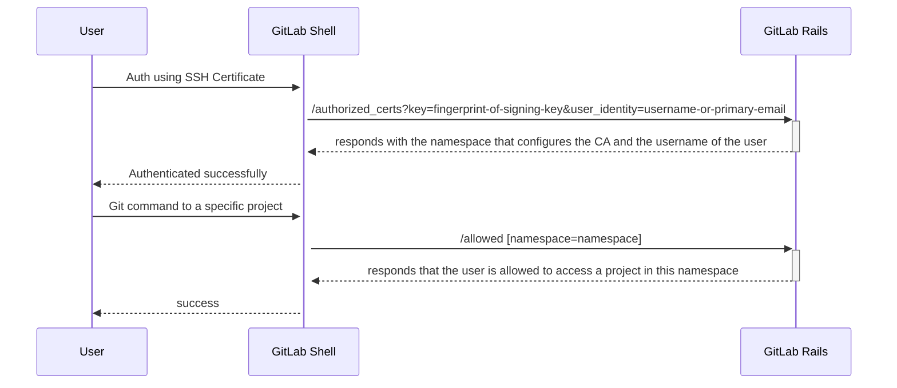

<div class="my-3 border-l-4 border-blue-500 bg-blue-50 px-4 py-3 rounded-r text-sm text-blue-800">
このページには今後予定されている製品・機能・機能性に関する情報が含まれています。ここに示す情報は参考目的のみです。購入・計画の決定にこの情報を使用しないでください。製品・機能・機能性の開発、リリース、タイミングは変更または延期される可能性があり、GitLab Inc. の独自の判断に委ねられています。
</div>

<div class="overflow-x-auto my-4">
<table class="w-full text-sm border-collapse">
<thead>
<tr class="bg-gray-100 text-left">
<th class="px-3 py-2 border border-gray-300">Status</th>
<th class="px-3 py-2 border border-gray-300">Authors</th>
<th class="px-3 py-2 border border-gray-300">Coach</th>
<th class="px-3 py-2 border border-gray-300">DRIs</th>
<th class="px-3 py-2 border border-gray-300">Owning Stage</th>
<th class="px-3 py-2 border border-gray-300">Created</th>
</tr>
</thead>
<tbody>
<tr>
<td class="px-3 py-2 border border-gray-300"><span class="inline-block rounded px-2 py-0.5 text-xs font-medium bg-gray-100 text-gray-700">ongoing</span></td>
<td class="px-3 py-2 border border-gray-300"><a href="https://gitlab.com/igor.drozdov" class="text-blue-600 hover:underline">@igor.drozdov</a></td>
<td class="px-3 py-2 border border-gray-300"><a href="https://gitlab.com/stanhu" class="text-blue-600 hover:underline">@stanhu</a></td>
<td class="px-3 py-2 border border-gray-300"></td>
<td class="px-3 py-2 border border-gray-300"><span class="inline-block rounded px-2 py-0.5 text-xs font-medium bg-gray-100 text-gray-700">~devops::create</span></td>
<td class="px-3 py-2 border border-gray-300">2023-07-28</td>
</tr>
</tbody>
</table>
</div>


## 概要

GitLab.com では、顧客が自社専用のトップレベルグループ（将来的には Organization）を取得します。セルフマネージドと比較して、このレベルで Organization 全体の設定を管理する必要があります。

現在、SaaS で提供されている Git アクセス制御オプション（SSH、HTTPS）は、ユーザープロファイルで設定された認証情報（アクセストークン、SSH キー）に依存しています。ユーザープロファイルは Organization の管理外にあるため、顧客はキーが機密に保たれているかどうか、または有効期限がポリシーを満たしているかどうかを評価する手段がありません。また、キーが漏洩した場合のダメージコントロールとして実施できることも非常に限られており、Git アクセスフローに MFA を強制することもできません。

顧客には、開発者が日常的に MFA を通じて一時的な SSH 証明書をリクエストし、内部システムへのアクセスを取得できるプロセスが存在する場合があります。SaaS で同じ働き方を実現するには、Git アクセス制御を目的として公開認証局（`CA`）ファイルを GitLab.com SaaS と共有する方法が必要です。

## 動機

- ユーザーが Git アクセス制御を目的として公開認証局（`CA`）ファイルを GitLab.com SaaS と共有できるようにします。
- SSH 証明書による認証をすでにサポートしている競合製品との製品ギャップを埋めます。

### 目標

このドキュメントでは、以下の要件を満たす機能を実装するためのアーキテクチャ設計を提案します：

- 証明書の発行に使用される `CA` ファイルの公開鍵（`CA.pub`）をグループに追加できる。
- `CA` によって発行された証明書を使用して、グループおよびその祖先のプロジェクトへの Git アクセスが可能になる。
- その証明書をグループおよびその祖先以外のプロジェクトへの Git アクセスに使用できない。

### 非目標

このドキュメントは、SSH 証明書による認証をサポートするためのコア機能を提供することに焦点を当てています。潜在的な改善点は [フォローアップ](#follow-ups) に記載されています。

## 提案

### MVC

グループ管理者が認証局ファイル（`CA`）として使用する SSH キーペアを生成します（`ssh-keygen -f CA`）：

- 秘密鍵はユーザー証明書の発行に使用されます
- 公開鍵は、ユーザー証明書を通じてグループへのアクセスを許可するためにグループに追加されます

#### ユーザー証明書

グループ管理者は `CA` 秘密鍵を使用してユーザー証明書を発行し、キー ID として GitLab ユーザー名またはユーザーのプライマリメールのいずれかを指定します：

```shell
ssh-keygen -s CA -I user@example.com -V +1d user-key.pub
```

その結果、以下の構造のユーザー証明書が生成されます：

```shell
ssh-keygen -L -f ssh_host_ed25519_key-cert.pub

ssh_host_ed25519_key-cert.pub:
        Type: ssh-ed25519-cert-v01@openssh.com user certificate
        Public key: ED25519-CERT SHA256:dRVV49XJHt85X1seqr9xXyxyuuGTbtFV6Lbwlrx6BIQ
        Signing CA: RSA SHA256:UAcgUeGoXrs8WOT/N+bmqY2vB9145Mc5NaN1Y977NCI (using rsa-sha2-512)
        Key ID: "user@example.com"
        Serial: 1
        Valid: from 2023-07-31T18:20:00 to 2023-08-01T18:21:34
        Principals: (none)
        Critical Options: (none)
        Extensions:
                permit-X11-forwarding
                permit-agent-forwarding
                permit-port-forwarding
                permit-pty
                permit-user-rc
```

- `Type` はユーザー証明書のタイプです。GitLab Shell はユーザー証明書のみを受け付け、他のすべてのタイプは拒否されます。
- `Public Key` はユーザーの公開鍵です。
- `Signing CA` は `CA` の公開鍵です。そのフィンガープリントはユーザー証明書に関連付けられたグループを見つけるために使用されます。
- `Key ID` はユーザーのユーザー名またはプライマリメールです。GitLab ユーザーをユーザー証明書に関連付けるために使用されます。
- `Serial` はユーザー証明書のシリアル番号です。同じ `CA` によって作成された異なる証明書を区別するために使用できます。
- `Valid` は有効期間を示します。この値は GitLab Shell によって検証され、有効期限切れおよびまだ有効でないユーザー証明書は拒否されます。
- `Principals`、`Critical Options`、`Extensions` は追加情報をユーザー証明書に埋め込むために使用されます。これらのフィールドは、将来のイテレーションでユーザー証明書に追加の制限を適用するために使用される可能性があります。

#### アプリケーションの動作

[GitLab Shell](https://gitlab.com/gitlab-org/gitlab-shell) は、SSH 経由で GitLab インスタンスに送信された [コマンド](https://docs.gitlab.com/ee/development/gitlab_shell/features.html) を処理するプロジェクトです。
ユーザーが SSH 接続を確立して公開鍵で認証しようとすると、GitLab Shell は内部 API リクエストを `/authorized_keys` エンドポイントに送信して、キーが GitLab ユーザーに関連付けられているかどうかを検出します。認証に証明書が使用される場合、GitLab Shell はそれを認識して代わりに `/authorized_certs` にリクエストを実行できます。

1. グループ管理者がグループに `CA.pub` ファイルを追加します。
1. ユーザーが `CA` によって署名された証明書を使用して認証しようとします。
1. GitLab Shell は `/authorized_certs` に `CA` のフィンガープリントとユーザー ID（GitLab ユーザー名またはプライマリメール）を送信します。
1. GitLab Rails は、フィンガープリントが追加された `CA.pub` を持つグループとユーザーを見つけます。`CA.pub` はフィンガープリントによってインスタンスで一意であり、`CA` とグループの間の 1 対 1 の関係を定義します。
1. GitLab Shell は確立された接続のネームスペースのフルパスを記憶します。
1. GitLab Shell は、ユーザーが特定のプロジェクトへのアクセス権を持つかどうかのチェックが必要なたびに `/allowed` エンドポイントにリクエストを送信します。ネームスペースのフルパスは `/allowed` エンドポイントに渡されます。
1. GitLab Rails は、ネームスペースがプロジェクトのネームスペースまたはその祖先のいずれかと一致するかどうかを確認し、ユーザーが証明書を通じてこのプロジェクトへのアクセス権を持つかどうかを判断します。
1. 上記のすべてのチェックが成功した場合、ユーザーはプロジェクトへのアクセス権を取得します。



#### 例

1. `CA.pub` を設定したグループ外のプロジェクトにアクセスする場合。

   次のグループ階層があるとします

   ```plaintext
   a/b/c/d/e/f
       |
       └/g/h/i
   ```

   - グループ管理者が `d` に `CA.pub` を追加し、ユーザーが `CA` によって署名された証明書を使用して認証されます。
   - ユーザーが `a/b/c/d/e/f/project` をクローンする場合、`a/b/c/d/e/project` のプロジェクトフルパスと `a/b/c/d` ネームスペースフルパスを送信します：`d` はプロジェクトのネームスペースの祖先であるため、ユーザーはプロジェクトをクローンできます。
   - ユーザーが `a/b/c/g/h/i/project` をクローンする場合、`d` はその祖先のリストにないため、ユーザーはプロジェクトをクローンできません。

1. `CA.pub` を設定したグループが別のネームスペースに移管される場合。

ネームスペースのフルパスは接続ごとに格納されているため、既存の証明書は引き続き有効です。ユーザーが再接続すると、`/authorized_certs` への別のリクエストが送信され、ネームスペースの新しいフルパスが返されます。

## 未解決の質問

### 複数の SSH 証明書で異なるプロジェクトにアクセスする場合

ユーザーは異なるプロジェクトにアクセスするための異なる SSH 証明書を持っている場合があります。
ユーザーが SSH 接続を確立する際、SSH クライアントはいくつかの潜在的なオプションを反復して、認証に成功するものを見つけようとします。
現在のアーキテクチャでは、ネームスペースへのアクセスを提供する最初の証明書が受け入れられます。
たとえユーザーが別のプロジェクトへのアクセスを意図していても同様です。

例えば：

1. ユーザーが `a` と `b` グループの有効な証明書を持っています。
1. `a` を使用してユーザーが認証に成功します。
1. ユーザーが `b/project` をクローンしようとして失敗します。

このシナリオの回避策として、SSH 接続中に特定の証明書を使用するよう Git を設定することができます。`.gitconfig` ファイルに以下を追加してください：

```plaintext
[core]
    sshCommand = ssh git@gitlab.com -i cert.pub
```

### 単一の証明書を失効させられない

単一のユーザー証明書の失効はこの MVC の範囲外です。この機能の実装は可能ですが、実現可能性について議論する必要があります。

これをサポートすると実装と UI/UX が複雑になります。しかし、証明書が侵害されるリスクは以下のアクションによって大幅に軽減できます：

- ユーザー証明書の有効期限。ドキュメントで強く推奨する必要があります。
- CA のローテーション（現在のすべてのユーザー証明書が失効する）。
- ユーザー証明書を使用できる IP アドレスを制限する `source-address` 機能の実装。

### 証明書が複数の GitLab インスタンスで使用できる

GitLab インスタンスに関する情報はユーザー証明書に埋め込まれていません。つまり、`KeyId` の値がそれらのインスタンスで認識される限り、複数の GitLab インスタンスで使用できることを意味します。

潜在的な解決策：

- 特定のインスタンスへのユーザー証明書の使用を制限するオプションフィールドは、フォローアップで `Extensions` を使用して実装できます。`extension:login@gitlab.com=username` を指定する方がより安全で柔軟なオプションですが、両方をサポートすることができます。

### CA を複数のグループで再利用できない

`CA.pub` のフィンガープリントは一意でなければならず、複数のグループで再利用できません。1 対 1 の関係は、ユーザーがアクセスできる単一のグループを見つけることができるように設計によって選択されています。

別のオプションは、`Extensions` または `Critical Options` を使用してユーザー証明書にネームスペースを埋め込むことです。

長所：

- `CA` を複数のグループで再利用できる。
- ユーザー証明書がアクセスするグループを*要求する*のではなく、アクセスするグループを*指定する*。

短所：

- ユーザー証明書のフォーマットにカスタム要件が必要。
- 他のグループが `CA.pub` を追加した場合、ユーザーが意図せずそのグループへのアクセスを取得する可能性がある。

潜在的な解決策：

- 特定のグループへのユーザー証明書の使用を制限するオプションフィールドは、フォローアップで `Extensions` または `Critical Options` を使用して実装できます。`CA` は引き続き再利用できませんが、ユーザー証明書が他のグループに使用されることを防ぐことができます。

## イテレーション計画

| コンポーネント | マイルストーン | グループ | 変更内容 |
|--------------|-----------------------|----------------------------------|---------|
| GitLab Shell | `16.3` | ソースコード | GitLab Shell での SSH 証明書を使用した認証を[実装](https://gitlab.com/gitlab-org/gitlab-shell/-/merge_requests/812) |
| GitLab Rails | `16.4` | ソースコード | `CA.pub` を設定したグループを検索する内部 GitLab Rails API エンドポイント `authorized_certs` を実装 |
| GitLab Rails | `16.4` | ソースコード | グループが `CA.pub` を追加/削除するための GitLab Rails API エンドポイントを実装 |
| GitLab Rails | `次の 2〜3 マイルストーン` | 認証と認可 | `CA.pub` を追加/削除するためのグループ設定 UX を実装 |
| GitLab Rails | `次の 2〜3 マイルストーン` | 認証と認可 | 認証に SSH 証明書のみを使用し、個人の SSH キーとアクセストークンを禁止するオプションを実装 |

## フォローアップ {#follow-ups}

このトピックに関連しているが、このブループリントの範囲外の機能：

- インスタンスまたはグループで HTTPS 経由の Git を無効にすることで、認証に SSH 証明書のみを使用することを強制する：必須機能。
- インスタンスまたはグループで個人の SSH キーの使用を禁止することで、グループレベルの SSH キーのみを使用することを強制する：必須機能。
- ユーザー証明書を特定の IP アドレスのセットに制限する `source-address` `Critical Option` の指定：あると便利な機能。
- ユーザー証明書を特定のインスタンスのセットに制限する `login@hostname=username` `Extensions` の指定：あると便利な機能。
- SSH 証明書を使用したコミットへの署名：あると便利な機能。
- 単一のユーザー証明書の失効。複雑な UI/UX が必要ですが、他の機能を使用することでリスクを大幅に軽減できます。
