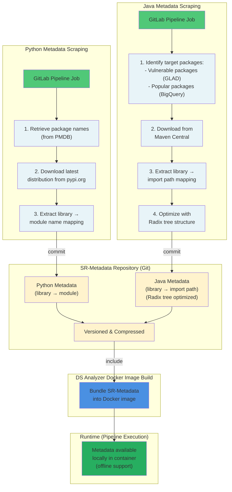

---
# This is the title of your design document. Keep it short, simple, and descriptive. A
# good title can help communicate what the design document is and should be considered
# as part of any review.
title: "静的到達可能性"
status: implemented
creation-date: "2025-10-01"
authors: [ "@nilieskou" ]
coaches: [ "@mbenayoun" ]
dris: [ "@joelpatterson", "@nilieskou" ]
owning-stage: "~devops::secure"
participating-stages: []
# Hides this page in the left sidebar. Recommended so we don't pollute it.
toc_hide: true
upstream_path: /handbook/engineering/architecture/design-documents/static_reachability/
upstream_sha: d5f4aa38819ae2b572eb32e0d967394d0361a975
translated_at: "2026-04-27T10:00:00Z"
translator: claude
stale: false
---

<!-- This renders the design document header on the detail page, so don't remove it-->

<div class="my-3 border-l-4 border-blue-500 bg-blue-50 px-4 py-3 rounded-r text-sm text-blue-800">
このページには今後予定されている製品・機能・機能性に関する情報が含まれています。ここに示す情報は参考目的のみです。購入・計画の決定にこの情報を使用しないでください。製品・機能・機能性の開発、リリース、タイミングは変更または延期される可能性があり、GitLab Inc. の独自の判断に委ねられています。
</div>

<div class="overflow-x-auto my-4">
<table class="w-full text-sm border-collapse">
<thead>
<tr class="bg-gray-100 text-left">
<th class="px-3 py-2 border border-gray-300">Status</th>
<th class="px-3 py-2 border border-gray-300">Authors</th>
<th class="px-3 py-2 border border-gray-300">Coach</th>
<th class="px-3 py-2 border border-gray-300">DRIs</th>
<th class="px-3 py-2 border border-gray-300">Owning Stage</th>
<th class="px-3 py-2 border border-gray-300">Created</th>
</tr>
</thead>
<tbody>
<tr>
<td class="px-3 py-2 border border-gray-300"><span class="inline-block rounded px-2 py-0.5 text-xs font-medium bg-gray-100 text-gray-700">implemented</span></td>
<td class="px-3 py-2 border border-gray-300"><a href="https://gitlab.com/nilieskou" class="text-blue-600 hover:underline">@nilieskou</a></td>
<td class="px-3 py-2 border border-gray-300"><a href="https://gitlab.com/mbenayoun" class="text-blue-600 hover:underline">@mbenayoun</a></td>
<td class="px-3 py-2 border border-gray-300"><a href="https://gitlab.com/joelpatterson" class="text-blue-600 hover:underline">@joelpatterson</a>, <a href="https://gitlab.com/nilieskou" class="text-blue-600 hover:underline">@nilieskou</a></td>
<td class="px-3 py-2 border border-gray-300"><span class="inline-block rounded px-2 py-0.5 text-xs font-medium bg-gray-100 text-gray-700">~devops::secure</span></td>
<td class="px-3 py-2 border border-gray-300">2025-10-01</td>
</tr>
</tbody>
</table>
</div>


## 概要

静的到達可能性（Static Reachability）は、GitLab の依存関係スキャン（Dependency Scanning）内の機能であり、依存関係がアプリケーションコードによってアクティブに使用（インポート）されているかどうかを判断します。
このコンテキスト情報は脆弱性の発見を豊かにし、ユーザーがすべての脆弱性を実際の影響に関係なく同等に扱うのではなく、実際にコードベースから到達可能な依存関係の脆弱性に焦点を当てることで修正作業を優先できるようにします。

この機能は Java、JavaScript/TypeScript、Python プロジェクトをサポートし、既存の Dependency Scanning パイプラインワークフローにシームレスに統合されます。
到達可能性データは脆弱性レポートと脆弱性詳細ページに表示され、セキュリティチームがより効果的に発見内容をトリアージできるようフィルタリング機能が提供されます。

## 動機

セキュリティチームは脆弱性管理において重大な課題に直面しています：依存関係スキャンから大量の脆弱性発見が寄せられますが、修正作業を効果的に優先するために必要なコンテキストが不足しています。これにより意思決定の麻痺とリソース配分の非効率が生じます。
現在、チームはリスクを評価するために 3 つの一般的なデータポイントに依存しています：

CVSS 重大度: 標準化されているがコンテキストに依存しないスコア
EPSS スコア: 脅威インテリジェンスに基づく悪用予測
KEV（Known Exploited Vulnerabilities）: 積極的に悪用されている CVE のカタログ

これらのメトリクスは価値がありますが、全体像の一部しか伝えていません。未使用のライブラリにある重大な脆弱性は、頻繁に使用される依存関係の中程度の脆弱性よりも実際のリスクははるかに低いです。このコンテキストの洞察がなければ、チームはアプリケーションへの実際の影響が最小限の脆弱性の調査と修正に時間を浪費します。

到達可能性データを導入することで、チームがノイズをフィルタリングし、作業に集中し、修正までの時間を短縮し、セキュリティ体制を改善できるようにします。
到達可能性分析は最新のセキュリティツールでますます期待されています。この機能を実装することで、GitLab はアプリケーションセキュリティテスト市場での競争力を強化し、複雑な依存関係エコシステムを管理する顧客に具体的な価値を提供します。

### 目標

1. **到達可能性コンテキストを提供する**: 依存関係がアプリケーションコードでアクティブにインポートされているかを判断します
1. **ノイズを削減する**: 未使用の依存関係の脆弱性をフィルタリングして優先度を下げることができるようにします
1. **修正効率を向上させる**: より迅速で情報に基づいたトリアージ決定を可能にします
1. **主要なエコシステムをサポートする**: Java（Maven）、Python（PyPI）、JavaScript/TypeScript（npm、pnpm、yarn）をカバーします
1. **オフライン環境を有効にする**: エアギャップおよびセルフマネージドインスタンスをサポートします

### 非目標

1. **動的/ランタイム到達可能性**: この設計は静的解析のみに焦点を当てています；ランタイムコールグラフ解析は範囲外です
1. **クロスファイルの深い解析**: パフォーマンスを維持するために、解析は網羅的なクロスファイルデータフロートラッキングを実行しません
1. **自動重大度調整**: 到達可能性ステータスは情報提供のみです
1. **関数レベルの到達可能性**: 現在の範囲は依存関係レベル（ライブラリが使用されているか？）であり、関数レベル（脆弱な関数が呼び出されているか？）ではありません

## 提案

静的到達可能性は、異なるプログラミング言語間で正しく機能するためにパッケージメタデータを必要とします。
例えば、Python では、SBOM にリストされているパッケージ名が import 文で使用される名前と異なる場合があります。
Java では、import はライブラリ名ではなくライブラリ内の特定のパスを参照します。
静的到達可能性分析を実行するには、パッケージ名を対応する import 識別子（Python での実際の import 名、Java での内部 import パスなど）にマッピングするデータが必要です。
JavaScript と TypeScript は、npm レジストリのパッケージ名がコードで使用される import 名と一致するため、このメタデータを必要としません。翻訳マッピングの必要性がなくなります。

[SR-metadata](https://gitlab.com/gitlab-org/security-products/static-reachability-metadata/-/tree/v1?ref_type=heads) リポジトリは、言語固有のスクレイパーによって毎週更新される PyPI と Maven パッケージメタデータを管理しています。**このメタデータは、オフライン使用をサポートするために DS アナライザーの Docker イメージにバンドルされています**。

静的到達可能性は CI/CD パイプライン内の依存関係スキャンの一部として実行され、新しい DS アナライザーで利用可能です。アナライザーはまず SBOM を生成し、機能が有効な場合にサポートされている各言語の静的到達可能性分析を試みます。SR は実行時間を延長する可能性があるため、デフォルトでは無効になっています。分析は semgrep-core を使用して import 文を識別し、SR-metadata とクロスリファレンスして、どの SBOM コンポーネントがアクティブに使用されているかを判断します。到達可能性情報は SBOM レポートに埋め込まれ、Dependency Scanning ジョブが完了したときに取り込まれます。脆弱性には到達可能性フィールドが含まれており、脆弱性レポートと詳細ページの両方に表示され、ユーザーが到達可能性状態でフィルタリングできるようになります。

## 設計と実装の詳細

### 高レベル設計

以下は、静的到達可能性分析がどのように機能し、GitLab プラットフォームと統合されているかを示す図です。

```mermaid
graph TB
    subgraph Metadata["Metadata Scraping Pipeline (Weekly)"]
        Trigger["⏰ Scheduled Pipeline<br/>(Once per week)"]
        PyPI["PyPI Scraper<br/>(Extract module names)"]
        Maven["Maven Scraper<br/>(Extract package info)"]
        
        Trigger -->|triggers| PyPI
        Trigger -->|triggers| Maven
    end
    
    subgraph MetadataRepo["SR-Metadata Repository<br/>(Git)"]
        PyPIData["PyPI Module Data<br/>(library → module mapping)"]
        MavenData["Maven Package Data<br/>(package metadata)"]
    end
    
    PyPI -->|writes| PyPIData
    Maven -->|writes| MavenData
    
    subgraph DockerImage["<b>DS Analyzer Docker Image</b><br/>"]
        BundledMeta["Bundled SR-Metadata<br/>(PyPI + Maven data)"]
    end
    
    PyPIData -->|bundled into| BundledMeta
    MavenData -->|bundled into| BundledMeta
    
    subgraph DSAnalyzer["Dependency Scanning Analyzer"]
        SBOM["1️⃣ Generate SBOM<br/>(Parse lockfiles)"]
        
        subgraph SRCheck["2️⃣ Check SR Eligibility"]
            LangCheck["Supported Language?<br/>(Java/Python/JS)"]
            SREnabled["SR Enabled?"]
        end
        
        subgraph SRAnalysis["3️⃣ Static Reachability Analysis"]
            Semgrep["semgrep-core<br/>(Find imports)"]
            MetadataUse["Use Bundled SR-Metadata<br/>(library mappings)"]
        end
        
        Enrich["4️⃣ Enrich SBOM<br/>(Add reachability properties)"]
        Output["SBOM Output<br/>(gl-sbom-*.cdx.json)"]
        
        SBOM --> LangCheck
        LangCheck -->|Yes| SREnabled
        LangCheck -->|No| Output
        SREnabled -->|Yes| Semgrep
        SREnabled -->|No| Output
        
        Semgrep --> MetadataUse
        MetadataUse -->|reads| BundledMeta
        Semgrep --> Enrich
        Enrich --> Output
    end
    
    subgraph GitLabRails["GitLab Rails Platform"]
        Ingest["SBOM Ingestion Service"]
        VulnDB["Vulnerability Database<br/>(with reachability_status)"]
        GraphQL["GraphQL API<br/>(reachability field)"]
    end
    
    Output -->|artifact| Ingest
    Ingest --> VulnDB
    VulnDB --> GraphQL
    
    subgraph UI["Frontend UI"]
        VulnReport["Vulnerability Report<br/>(Reachability column)"]
        VulnDetails["Vulnerability Details<br/>(Reachability indicator)"]
    end
    
    GraphQL --> VulnReport
    GraphQL --> VulnDetails
    
    style Trigger fill:#4a90e2
    style PyPI fill:#50c878
    style Maven fill:#50c878
    style PyPIData fill:#fff3cd
    style MavenData fill:#fff3cd
    style BundledMeta fill:#fff3cd
    style SBOM fill:#e8f4f8
    style Semgrep fill:#ff6b6b
    style Enrich fill:#9b59b6
    style Output fill:#27ae60
    style Ingest fill:#3498db
    style VulnDB fill:#2c3e50
    style GraphQL fill:#16a085
    style VulnReport fill:#f39c12
    style VulnDetails fill:#f39c12
```



### 到達可能性ステータスの値

| ステータス | 意味 |
|--------|---------|
| **Reachable: Yes** | 分析により依存関係がインポートされていることが確認されました |
| **Reachable: Not Found** | 分析では依存関係がインポートされているという証拠を見つけられませんでした |
| **Reachable: Not Available** | 到達可能性分析データがありません |

この設計では、偽陰性を防ぐために意図的に「到達不可能（Not Reachable）」ステータスを避けています。分析が使用を確認できない場合、依存関係を未使用と誤ってマークするのではなく、デフォルトで「Not Found」になります。

### メタデータスクレイパーインフラストラクチャ

Python と Java の場合、ライブラリ名をインポート可能なモジュール名にマッピングするための外部メタデータが必要です：



Python メタデータは、GitLab パイプラインジョブを通じて pypi.org から毎週スクレイピングされます：

- PMDB からすべての PyPI パッケージ名を取得
- pypi.org から各パッケージの最新ディストリビューションをダウンロード
- ライブラリ名とモジュール（import）名のマッピングを抽出
- SR-metadata git リポジトリにデータをコミット

このプロセスは最新バージョンのみを対象としています。ライブラリとモジュール名のマッピングはバージョン間でほとんど変わらないためです。

Java メタデータも同様の毎週スクレイピングスケジュールに従います。しかし、Java の静的到達可能性はライブラリ名と import パスのマッピングを必要とし、これは独自の課題があります：import パスはパッケージバージョン間で大幅に異なる可能性があり、すべてのバージョンの網羅的なデータを収集すると許容できないストレージ要件が生じます。これに対処するために、2 つの主要なサブセットに焦点を当てています：

- 既知のセキュリティアドバイザリを持つ脆弱なパッケージ。ソースは GitLab Advisory DB。
- 最も人気のある Java パッケージ

このターゲットを絞ったアプローチは、データを管理可能に保ちながら顧客のパッケージの大部分をカバーします。さらに、Java import パスは Radix ツリー構造で効率的に圧縮される長い共通プレフィックスを共有しているため、ストレージ効率を最適化するために Radix ツリー構造を採用しています。

### SBOM エンリッチメントプロセス

到達可能性データは、各コンポーネントへの `gitlab:dependency_scanning_component:reachability` プロパティを使用して SBOM レポートに格納されます：

```json
{
  "bom-ref": "pkg:pypi/requests@2.28.0",
  "name": "requests",
  "version": "2.28.0",
  "properties": [
    {
      "name": "gitlab:dependency_scanning_component:reachability",
      "value": "in_use"
    }
  ]
}
```

到達可能性プロパティは `in_use` と `not_found` の 2 つの値をサポートしています。
SBOM レポートの取り込み時に、これらの値はそれぞれ到達可能性フィールドの `Yes` と `Not Found` にマッピングされます。
プロパティが存在しない場合、静的到達可能性分析が実行されなかったことを示し、フィールドには `Not Available` が表示されます。
これは、静的到達可能性分析が有効でないか実行に失敗した場合、または言語がサポートされていない場合に発生します。

## 代替案

### 1. インポート + 使用状況分析

**アプローチ**: 当初の設計には、依存関係が**インポート**されているかどうかを検出するだけでなく、インポートされたライブラリがアプリケーションコードで**実際に呼び出し/使用**されているかどうかを確認することも含まれていました。

**検討した理由**:

- インポートのみの検出よりも精度が高い
- インポートされているが一度も呼び出されていない依存関係をフィルタリング
- 実際のコード実行を確認することで偽陽性を削減

**却下した理由**:

- 依存関係がインポートされると、自動的に一部の初期化コードが実行される。
- 関数レベルの静的到達可能性の一部として実装することを決定した。
- フロー全体を簡素化する。

**決定**: 機能を**インポートレベルの到達可能性のみ**（ライブラリがインポートされているか？）に絞りました。これにより、複雑さを最小限に抑えながら価値の大部分を提供します。

**重要な洞察**: インポートされているが呼び出されていない依存関係は、サプライチェーン脆弱性がある場合でもリスクがあります。インポートレベルの検出は、修正作業を優先するという主な使用例には十分です。

**参照**: [Epic #15780 - 静的到達可能性分析 - GA](https://gitlab.com/groups/gitlab-org/-/epics/15780#note_2558241464)

### 2. 別の先行ジョブとしての静的到達可能性

**アプローチ**: ベータフェーズ中、静的到達可能性は**Dependency Scanning ジョブの前に実行される別の CI ジョブ**として実装され、明示的なジョブ依存関係を持っていました。

**検討した理由**:

- 関心の明確な分離。静的到達可能性は SCA-to-sarif-matcher コードベースによって実行されていた。
- 個々のコンポーネントのデバッグが容易
- 各ジョブの独立したスケーリングが可能

**却下した理由**:

- **ジョブオーケストレーションの複雑さ**: ジョブ間の依存関係の管理が脆弱性を生んだ
- **運用の複雑さ**: 重度の CI/CD 顧客カスタマイズにより、運用上の失敗を避けることができなかった
- **ユーザーエクスペリエンス**: 複数のジョブが CI/CD テンプレートを理解し設定することをより困難にした

**決定**: すべての機能を以下を処理する**単一の Dependency Scanning ジョブ**に統合しました：

1. SBOM 生成
2. 静的到達可能性分析（有効な場合）
3. SBOM エンリッチメント

これによりジョブオーケストレーションの複雑さが解消され、よりクリーンなユーザーエクスペリエンスが提供されます。

**参照**: [スパイク #525958 - モノリシックとコンポーザブルアーキテクチャ](https://gitlab.com/gitlab-org/gitlab/-/issues/525958)、[パイプラインの一部としての静的到達可能性の有効化](https://gitlab.com/gitlab-org/gitlab/-/work_items/523358)

### 3. クライアント提供 Docker イメージ（実験フェーズ）

**アプローチ**: 実験フェーズ中、静的到達可能性では、ユーザーが分析のために `SCA-to-sarif-matcher` ツールに**アプリケーションコードを含む Docker イメージを提供**する必要がありました。ライブラリ名と import パス/名前のマッピングを見つけるために必要でした。

**検討した理由**:

- 初期実装の簡素化
- 既存の Oxeye/Lightz-aio 分析エンジンを活用
- インフラストラクチャ要件の削減

**却下した理由**:

- **ユーザーの摩擦**: ユーザーに Docker イメージの提供を要求することは採用への大きな障壁だった

**決定**: 以下の**メタデータスクレイピングアプローチ**を実装しました：

1. PyPI と Maven Central からライブラリとモジュールのマッピングを事前スクレイピング
2. このメタデータを SR-metadata Git リポジトリに保存
3. DS アナライザーの Docker イメージにメタデータをバンドル

**このアプローチのメリット**:

- ユーザー提供の Docker イメージが不要
- データ収集と分析のよりクリーンな分離

**参照**: [Issue #520509 - 静的到達可能性は Docker イメージを必要とせずに実行できる必要がある](https://gitlab.com/gitlab-org/gitlab/-/issues/520509)

### 4. 分析エンジンの移行: Lightz-aio から semgrep-core

**アプローチ**: 当初、静的到達可能性はクロスファイルコールグラフ分析を実行するために **Lightz-aio 分析エンジン**を使用していました。これには SBOM エンリッチメントのための別の `sca-to-sarif-matcher` ツールが必要でした。

**検討した理由**:

- 実証済みのプロプライエタリ分析エンジンを活用

**却下した理由**:

- **パフォーマンスのボトルネック**: Lightz-aio のクロスファイル機能により、非常に遅くなった（OpenAPI などの大きな Python プロジェクトでは 40 分以上）
- **柔軟性の制限**: ジョブオーケストレーションなしで DS アナライザーパイプラインに統合することが困難

**決定**: 分析エンジンとして **semgrep-core**（オープンソースの Semgrep）に移行し、**DS アナライザーに直接統合**しました。このアプローチは：

1. **`sca-to-sarif-matcher` を廃止**: 中間ツールを完全に削除し、複雑さを軽減
2. **分析を統合**: すべての静的到達可能性ロジックが DS アナライザーに存在
3. **パフォーマンスを改善**: 単一ファイル分析はクロスファイル分析よりも桁違いに高速
4. **統合を簡素化**: 別のジョブ依存関係やツールオーケストレーションが不要

**トレードオフ**:

- **受け入れた制限**: import 文と使用箇所が異なるファイルにある import を見逃す可能性がある（まれなエッジケース）
- **メリット**: パイプラインが数時間ではなく数分で完了し、実際の CI/CD ワークフローで機能が実用的になる

**参照**: [Issue #537156 - スパイク: Lightz-aio の代替として opengrep/semgrep を調査](https://gitlab.com/gitlab-org/gitlab/-/issues/537156)

## 将来の作業

### 関数レベルの静的到達可能性（FLSR）

**ビジョン**: 静的到達可能性をインポート検出を超えて**関数レベルの分析**に拡張し、依存関係がインポートされているかどうかだけでなく、その依存関係内の特定の脆弱な関数が実際に呼び出されているかどうかを判断します。

**アプローチ**:

- アプリケーションコードから呼び出される依存関係の関数をトラッキング
- 使用可能であることが明らかで、脆弱な関数が呼び出されているパッケージの脆弱性のみをフラグ
- 脆弱な関数を特定するためのソリューションで、脆弱なパッケージをオフラインで分析

**メリット**:

- **精度**: インポートされたライブラリ内の未使用の関数からの偽陽性を解消
- **リスク精度**: 可能な限り最も正確なリスク評価を提供。脆弱なライブラリは必ずしもアプリケーションコードが影響を受けることを意味しない。
- **修正の優先順位付け**: セキュリティ作業のさらにきめ細かな優先順位付けを可能にする

**スコープの制限**:
実用的なパフォーマンスと複雑さを維持するために、FLSR は**最初のレイヤーの推移的依存関係のみ**に焦点を当てます：

- ✅ **直接依存関係**: アプリケーションコードから呼び出される関数を分析
- ✅ **第 1 レイヤーの推移的依存関係**: 直接依存関係によって呼び出される関数を分析
- ❌ **第 2 レイヤー以降**: より深い推移的チェーンの分析を行わない（推移的依存関係の依存関係）

**スコープの根拠**:

- **複雑さの爆発**: 任意に深い依存関係チェーンを分析すると指数関数的な複雑さが生じる
- **パフォーマンス**: スコープを制限することで分析時間が CI/CD パイプラインに対して合理的に保たれる
- **保守性**: バグとエッジケースの表面積を削減する

**参照**: [Epic #16844 - 関数レベルの静的到達可能性](https://gitlab.com/groups/gitlab-org/-/epics/16844)
