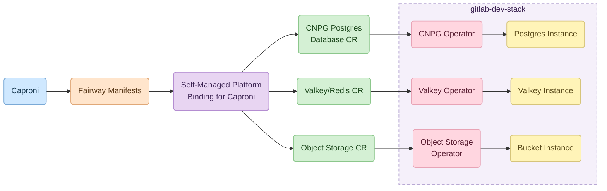
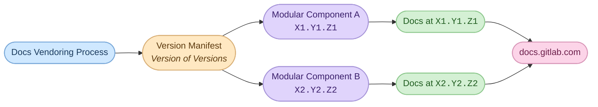
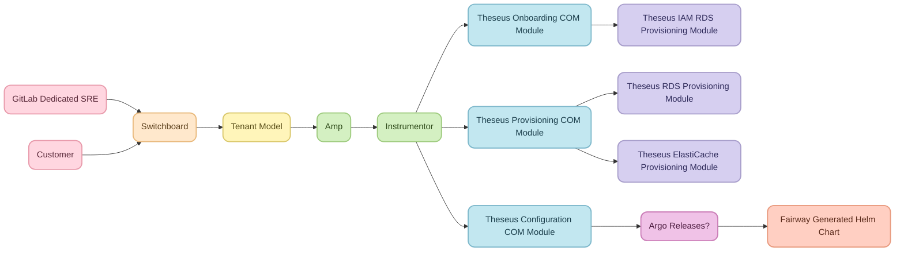

<!-- Design Documents often contain forward-looking statements -->
<!-- vale gitlab.FutureTense = NO -->



## 読み方ガイド

このドキュメントは長いため、
読者によって確認すべきセクションが異なります。

| あなたが… | 読む箇所 |
|---|---|
| エグゼクティブの場合 | [セクション 0](#0--executive-summary)、[セクション 1](#1--why-theseus-why-now)、[セクション 2](#2--what-is-theseus)、[セクション 7](#7--whats-not-yet-covered)、[セクション 8](#8--how-we-measure-success)（≈ 5 ページ） |
| マネージャーの場合 | [セクション 0](#0--executive-summary)〜[セクション 4](#4--one-platform-many-bindings)、[セクション 5](#5--how-it-works-the-developer-journey)に目を通し、続いて[セクション 6](#6--theseus-for-the-gitlab-deployment-operator)〜[セクション 9](#9--what-needs-to-ship-next)（≈ 12 ページ） |
| エンジニアの場合 | [付録](#appendices)を含むすべて |

---

## 意思決定

このビジョンを実現するために行われたアーキテクチャ上の意思決定は、`decisions/` ディレクトリの ADR に記録されています。
各 ADR には、背景、意思決定、その結果、検討した代替案が記載されています。

| ADR | タイトル | 状態 |
|---|---|---|
| [001](decisions/001_protobuf_as_preferred_schema_language.md) | 推奨スキーマ言語としての Protobuf | 提案中 |
| [002](decisions/002_one_interface_many_bindings.md) | 1 つの宣言的インターフェースと複数の Platform Binding | 提案中 |
| [003](decisions/003_enterprise_binding_survives_cell_outages.md) | Enterprise Platform Binding サービスは Cell の停止を切り抜けなければならない | 提案中 |
| [004](decisions/004_independent_vs_bundled_releases.md) | GitLab.com ではコンポーネントごとに独立してデプロイし、Self-Managed ではバンドルしてリリースする | 提案中 |
| [005](decisions/005_labkit_go_native_go_library.md) | LabKit Go はネイティブ Go ライブラリのままとする | 提案中 |
| [006](decisions/006_lab_bench_assemblies_are_first_class.md) | Lab Bench アセンブリを第一級のプラットフォームコンポーネントとする | 提案中 |
| [007](decisions/007_prefer_labkit_library_over_assembly.md) | アセンブリフレームワークによる実装よりも LabKit ライブラリコードを優先する | 提案中 |

---

## 0 — エグゼクティブサマリー {#0--executive-summary}

Theseus は GitLab の内部開発者プラットフォームです。
これは開発から本番環境まで、次を含むあらゆる GitLab デプロイモデルにまたがる単一のシステムです：
開発者ワークステーション、CI、GitLab.com と Cells、GitLab Dedicated、GitLab Dedicated for Government、Self-Managed。

Theseus の一部のコンポーネントは独立して開発され、以前から存在している場合があります：
Metrics Catalog は 2018 年から、`common-ci-tasks` CI Components は 2022 年から存在しています。
GitLab Metrics Operator などの一部のコンポーネントはまだ提案段階で、
今後開発する必要があります。

これらのコンポーネントを 1 つのプラットフォームに組み合わせることで、Theseus Platform が生まれます。

このビジョンドキュメントでは、**Platform Engineering** チームが提供するコンポーネントと、
最初の Modular Component である **Artifact Registry** のオンボーディングという直近の優先事項に焦点を当てます。

より広い Theseus イニシアチブは、このスコープよりも大きなものです。
特に **Lab Bench**（[セクション 2.8](#28-lab-bench-and-the-wider-theseus-initiative)）などのほかの取り組みも、
より広い Theseus イニシアチブの一部であり、
チームはそれらの導入を選択できます。

<br>
<small>Theseus のさまざまなコンポーネントを示す上位レベルの図。</small>

### 指針 {#guiding-principles}

これらの原則は、当初[正規の Theseus 設計ドキュメント](https://docs.google.com/document/d/1tOYqFsLQ7axB2ZWQ4mORf9fVzYHNI3yC5j3MPwRk8i4)の「Guiding Principles」セクションから引用され、このビジョンドキュメントの執筆過程で調整されました。

1. **ゲートではなく、舗装された道。**
   正しいことを最速で行えるようにします。
   プラットフォームはチームを加速させるべきです。
   開発チームは舗装された道でセルフサービスを利用でき、コンポーネントを本番環境へ提供するために
   Platform Teams に阻まれるべきではありません。
2. **すべてのチームに 1 つのプラットフォームを。すべての問題に対応するわけではない。**
   Theseus は GitLab が稼働するすべての場所で機能し、すべてのプロダクトチームがその上に構築します。
   共有可能で反復できるものを標準化します。

   GitLab には、Self-Managed にソリューションを提供する際、
   解決すべき新しい問題ごとに特注のプラットフォームソリューションを構築する傾向があります。
   代わりに Theseus は、複数のドメインにまたがるデプロイの問題に対応できる単一の共通プラットフォームであり、
   次の新しいコンポーネントが独自の特注プラットフォームを必要としないようにします。
3. **設定より規約。**
   サービスは、提供方法ではなく必要なものを宣言します。

   これと密接に関連するのが、*意思決定よりデフォルト*です。
   可観測性、セキュリティ、接続性は最初から機能し、
   そうしない理由がない限り、妥当なデフォルトが適用されるべきです。
   GitLab のポリシー、アーキテクチャ、運用プラクティスに適したガードレールは、
   後から付け足すのではなく、デフォルトの一部とします。

   チームはオプトインするのではなく、望ましい振る舞いから外れるために意図的なオプトアウトを必要とするべきです。
4. **GitLab が稼働するすべての場所に 1 つのプラットフォームを。**
   開発者ワークステーションで動くものは、CI、GitLab.com、Dedicated、Self-Managed でも動きます。
5. **明確に定義されたインターフェース。**
   Theseus の各コンポーネントは明確に定義されたインターフェースを提供し、
   強く型付けされたスキーマ、検証、ドキュメントを提供します。
   インターフェースは、後方互換性と前方互換性を保ちながら進化しなければなりません。
   該当する場合、インターフェースは機械可読でなければなりません。
6. **意図と仕組みの分離。** Theseus により、チームは
   望ましい状態である「*何を*」を定義し、その状態を実現する手段である「*どのように*」を
   実装に委ねられます。
   実装によって、望ましい状態に到達する方法が異なる場合があります。

### 状態（2026 年 5 月）

LabKit、`common-template-copier`、`common-ci-tasks`、Component Ownership Model、
Runway（GitLab.com、Cells、Dedicated 向け）は本番稼働中です。
Caproni、LabKit v2、[Release Framework](https://internal.gitlab.com/handbook/engineering/architecture/design-documents/release-platform/)、Fairway は活発に開発中です。
[GitLab Metrics Operator](https://docs.google.com/document/d/1vXBnoqOPREk5j_2YYF9zTwnFgUQKGfhrxC471QgOs8M)は提案中です。

---

## 1 — なぜ Theseus なのか、なぜ今なのか？ {#1--why-theseus-why-now}

### 1.1 モノリスからポートフォリオへの移行

GitLab のインフラストラクチャは、予測可能なモノリシック Rails アプリケーションから、
Zoekt、ClickHouse、OpenBao、AI サービス、NATS などを含む、新しいコンポーネントの爆発的な増加へと移行しました。
漸進的な変化のために設計されたインフラストラクチャプロセスはこの変化に追いついておらず、
その結果、デリバリーのボトルネックが生じています：
機能は GitLab.com に提供されても、Dedicated と Self-Managed のお客様に届く前に停滞します。

[DORA の 2025 年版『State of AI-Assisted Software Development』レポート](https://dora.dev/research/2025/dora-report/)では、
プラットフォーム品質が高い場合、AI 導入が組織のパフォーマンスに与える影響は非常に大きなプラスになり、
低い場合、その影響はごくわずかであるとされています。

Theseus は、Act 2 を構築するプラットフォームに対する GitLab の投資です。

### 1.2 Theseus による Modular Component の実現

Theseus は [Modular Features](https://docs.google.com/document/d/1-7ypeuacczPMYxP8ZLPxXhvIxYkBvEfZ_OgypY098Aw/edit)
イニシアチブの基盤です。

Modular Component により、GitLab は開発をシフトレフトし、
アプリケーション開発チームによるオーナーシップを促進し、
GitLab が現在経験しているデリバリーのボトルネックを回避できます。

Theseus により、チームは Infrastructure に阻まれることなく迅速にイテレーションでき、
Infrastructure はほかのチームの機能の面倒を見る代わりに、
プラットフォームへ集中できます。

---

## 2 — Theseus とは {#2--what-is-theseus}

<br>
<small>Theseus スタックのトレードオフ。</small>

### 2.1 定義 {#21-the-definition}

Theseus は、真のモダン DevOps を実現し、チームによるコンポーネントのオーナーシップを促進する
内部開発者プラットフォームを開発する GitLab の取り組みです。

Theseus は、複数の既存ツールと、
新たに提案されたいくつかのイニシアチブを組み合わせて単一のシステムを作り、
開発から本番環境まで、GitLab のすべてのターゲットプラットフォームにまたがります。

コンポーネントの完全な一覧は、[セクション 2.7「コンポーネント一覧」](#27-component-inventory)で信頼できる唯一の情報源として管理されます。

### 2.2 アーキテクチャ契約

> Theseus は全体を通じて 1 つのアーキテクチャ境界を強制します：
> ソフトウェアが必要とするものと、インフラストラクチャがそれを提供する方法の分離です。
>
> *開発者は要件を宣言します。*
> サービスは「PostgreSQL 互換データベース、キーバリューストア、オブジェクトストレージが必要です」と伝えます。
> どのインスタンスか、どこで実行するか、どのように接続するかは指定しません。
>
> *オペレーターは要件を満たします。*
> オペレーターは存在するインフラストラクチャと、サービスをそれにバインドする方法を定義します。
> 6 つのサービスが 1 つのデータベースを共有するか、各サービスに専用のデータベースを割り当てるかは、
> アプリケーションではなくオペレーターが決定します。

Theseus は、モジュール型機能を構築するストリームアラインドな Application Development チームと
Platform Engineering チームの間の契約上のインターフェースを定義します。

Application Development チームは「*何を*」を定義します：

- *何を*構築する必要があるか
- *何を*観測する必要があるか
- 実行時に*何を*実行する必要があるか
- アプリケーションに*どのような*依存関係があるか

Platform Engineering チームは「*どのように*」を定義します：

- アーティファクトを*どのように*構築するか
- アプリケーションを*どのように*観測するか
- 実行時にコードを*どのように*実行するか
- 依存関係を*どのように*満たすか

「*何を*」は、契約として安定し、明確に定義され、文書化されたインターフェースによって定義されます。
「*どのように*」は実装の詳細であり、契約では定義されません。
たとえば GitLab.com と Cells など、異なる GitLab Platform では「*どのように*」の実装が異なる場合があり、
インターフェースで定義された契約が満たされる限り、
いつでも変更できます。

たとえば Application Development チームは、アプリケーションが Postgres データベースを必要とすると宣言できます。
Platform Binding ごとに異なる実装が可能です：

- GitLab.com では Google CloudSQL インスタンスを使用します。
- Dedicated では AWS RDS インスタンスを使用します。
- Caproni では Postgres Operator によってプロビジョニングされたクラスター内 Postgres インスタンスを使用します。

契約は実装を定義せず、Platform Engineering チームは
アプリケーションに提供される Postgres インスタンスの種類を保証しません。
保証するのはインスタンスが提供されることだけです。ClickHouse、ValKey など、
ほかのサポート対象の依存関係にも同じアプローチを使用します。

依存関係以外のドメインでも、Theseus は同じアプローチに従います：
たとえば GitLab Metrics Operator により、モジュール開発者は
モジュールのサービスレベルが「*何か*」、
飽和のボトルネックが「*何か*」を記述できます。そして GitLab Metrics Operator は、
Prometheus Recording Rules、Prometheus Alerts、容量計画向けの Tamland などを使用して、
これを「*どのように*」実現するかを定義します。

### 2.3 インターフェースとは？ {#23-what-is-an-interface}

前のセクションでは、Theseus を Application Development チームと Platform Engineering の間の
*契約上のインターフェース*として説明しました。
このセクションでは、その文脈における「インターフェース」の意味を明確にします。

Theseus における**インターフェース**は、*プロデューサー*と*コンシューマー*の間の
安定し、型付けされ、バージョン管理された契約です。
プロデューサーはコンシューマーの振る舞いを指示できず、
コンシューマーはプロデューサーの内部実装に依存できません。

ほとんどの場合（ただし常にではありません）、コンシューマーは Modular Component で、
プロデューサーは Platform です。

インターフェースがこの役割を果たすには、次の一連の特性が必要です：

- **強く型付けされ、スキーマで定義されている。**
  契約の形はコードやドキュメントに暗黙的に含まれるのではなく、
  明示され、確認可能です。
- **該当する場合は機械可読である。**
  スキーマで定義された契約では、スキーマを元に、
  検証、言語バインディング、JSON-Schema、
  生成ドキュメントなどの後続アーティファクトを派生させます。これらを並行して手作業で記述することはありません。
- **SemVer でバージョン管理されている。**
  各インターフェースはバージョン管理された契約であるため、プロデューサーとコンシューマーは
  メジャーバージョン内で独立して進化できます。
- **互換性保証を伴って進化できる。**
  追加的変更をデフォルトとします。
  破壊的変更にはメジャーバージョンの更新が必要です。
  廃止する範囲には非推奨化の手順を適用します。
  メジャーバージョン内での後方互換性と前方互換性は、好意ではなく契約の一部です。
- **検証とドキュメントがインターフェースの一部である。**
  これらは契約の横に置かれ、
  同期がずれていくアーティファクトではありません。

上記の特性は運用上の健全性を表します。
これらは必要ですが十分ではありません。
型付けされ、バージョン管理され、機械可読な契約でも、
設計の悪い抽象化になる可能性があります。

Theseus で使う意味での優れたインターフェース設計の規律は、John Ousterhout の
[*A Philosophy of Software Design*](https://web.stanford.edu/~ouster/cgi-bin/aposd.php)に最も簡潔にまとめられています。

彼の原則のうち、Theseus の文脈では次の 3 つが重要です：

- **浅くなく、深く。**
  優れたインターフェースは、*その背後にある実装と比べて単純*です。
  `FairwayManifest` は数十行の YAML ですが、
  それを満たす Platform Binding はデータベース、シークレット、
  可観測性、ネットワーキング、ランタイムをプロビジョニングします。
- **情報隠蔽。**
  インターフェースは設計上の意思決定をコンシューマーから隠します。
  Postgres の依存関係を GitLab.com では CloudSQL、
  Dedicated では RDS、Caproni ではクラスター内 Operator で満たすかどうかは、
  契約の一部ではありません。
  コンシューマーはそれらの意思決定に依存できず、
  プロデューサーは自由に変更できます。
- **複雑さを下位層へ引き下げる。**
  複雑さを避けられない場合、
  プラットフォームはそれを各コンポーネントに押し付けるのではなく、自ら吸収します。
  可観測性のデフォルト、シークレット処理の配管、複数ターゲット向けパッケージングなど、
  Theseus はこれらの問題を一度だけ解決するため、
  次のコンポーネントチームが解決し直す必要はありません。

インターフェースは Ousterhout のテストに照らして評価すべきです：
*インターフェースは、隠している実装よりも単純か？*
そうでなければ、再設計を検討する価値があります。

#### 2.3.1 Theseus のインターフェースには複数の形態がある

インターフェースは宣言的スキーマだけではありません。
Theseus 全体で、同じアプローチをさまざまな
種類の契約に適用します：

- **宣言的マニフェスト** —
  コンポーネントが必要と宣言し、Platform Binding が使用するものです。
  `FairwayManifest` が良い例です
  （[セクション 4.2](#42-the-single-declarative-interface)）。
- **構成スキーマ** —
  システムが取り得る状態を定義し、それを実現するエンジンが使用するものです。
  GitLab Dedicated の **[Tenant Model Schema](https://gitlab.com/gitlab-com/gl-infra/gitlab-dedicated/tenant-model-schema/)** が良い例で、
  以下で説明します。
- **Application Programming Interfaces（API）** —
  ライブラリが呼び出し元に公開する型付けされたサーフェスです。
  たとえば [LabKit](/handbook/engineering/infrastructure-platforms/developer-experience/labkit/)が
  Modular Component に提供する API は、
  ロギング、メトリクス、トレーシング、構成、暗号化に対応する、安定し、バージョン管理された標準ライブラリのサーフェスです。
- **Command Line Interfaces（CLI）** —
  GitLab Deployment Operator または開発者が呼び出すコマンドサーフェスです。
  [Theseus CLI](https://gitlab.com/gitlab-org/theseus/)が良い例です：
  そのコマンド、フラグ、終了コード、出力形式は、
  スクリプト、CI ジョブ、オペレーターが依存する契約です。
  CLI は必ずバージョン管理され、ほかのインターフェースと同じ条件で
  互換性を保証しなければなりません。

これらの例では、それぞれ異なるツールを使って契約を強制します：

- `FairwayManifest` には Protobuf
- Tenant Model には JSON Schema
- LabKit には Go モジュールの SemVer と静的型付け
- `theseus` には CLI 自体のリリースバージョニング

#### 2.3.2 推奨技術：Protobuf {#232-preferred-technology-protobuf}

スキーマで定義される契約には、
LabKit の `.proto` スキーマ構成契約を介して使用する
**Protobuf が Theseus の推奨スキーマ言語です**
（原則 6、[セクション 3.2](#32-platform-as-a-product-commitments)）。
検証ルールは、[protovalidate](https://protovalidate.com)アノテーションを使用して proto 定義にインラインで表現し、
[LabKit Configuration 設計ドキュメント](/handbook/engineering/architecture/design-documents/labkit_configuration/)に従います。
これにより、スキーマと検証ルールが同じ場所に置かれ、乖離しません。

**上記の特性を満たす限り、ほかの技術も使用できます。**
Tenant Model Schema はその直接的な例です：

- これは Protobuf ではなく、バージョン管理された **JSON Schema** であり、
  このセクションで説明した役割、つまり Dedicated テナントが取り得る状態を定義する契約を正確に果たします。
- **Switchboard** はテナントモデルの状態を所有して保存し、
  Switchboard のユーザー（お客様と Environment Automation エンジニア）が
  その状態に対するパッチを編集またはステージできるようにします。
- **Instrumentor** は検証済みのテナントモデルを受け取り、
  実際のインフラストラクチャと
  プラットフォーム構成（Terraform、Ansible、Helm、Kubernetes）に変換します。
- バージョニングには運用上の意味があります：
  `$schema` は Switchboard で自由に編集できません。
  Instrumentor のバージョンからマッピングファイルを介して選択され、
  そのマッピングファイルは信頼できる唯一の情報源として扱われます。
  そのため、契約は Instrumentor のリリース系統に結び付けられます。
  新しいスキーマを古い Instrumentor ブランチに対して使用することはできません。

このドキュメントの残りでは、
「インターフェース」とは、ここで説明した種類の契約、
つまり宣言的マニフェスト、構成スキーマ、API、CLI を意味します。
多くの場合は Protobuf で表現されますが、
常に上記の特性を備えます。

### 2.4 Theseus ではないもの {#24-what-theseus-is-not}

**万能の仕様ではない。**
チームがプラットフォームではまだ表現できない機能を本当に必要とする場合、
次の 2 つの道があります：

1. **プラットフォームを拡張する。** その機能がほかのコンポーネントチームにも役立つ可能性が高い場合です。
   1 つの方法として、要求元のチームが変更を Theseus に直接コントリビュートできます。
   その後、適切な Theseus チームが継続的なサポートを引き継ぎます。
   Theseus に機能を追加すれば、次にそれを必要とするチームはその成果を引き継げます。
   また、各チームが同じ種類の問題を解き直すのではなく、プラットフォームのデフォルトがその問題を吸収します。
2. **自分たちで構築し、モジュールの一部として提供する。**
   共有の抽象化では見返りが得られないほど、その機能が固有である場合です。
   Modular Component を表現する基盤インターフェースは Kubernetes API であるため、
   Kubernetes の機能を直接活用することは常に妥当な選択肢です。
   プラットフォームは檻ではありません。

2 つ目の道にはトレードオフがあります：
プラットフォーム外で機能を構築するチームは、必要な専門知識を用いて、その機能の設計、運用、サポートを担当します。
Component Ownership Model（[セクション 2.5](#25-theseus-vs-the-component-ownership-model)）は、
チームがこの道を選ぶときに利用する下位レベルのルートですが、SAAS デプロイのみをサポートします。

Theseus は Kubernetes API 上に構築された、抽象度が高くリスクの低い舗装された道です。
COM は Cloud-Provider SDK 上に構築された、抽象度が低くリスクの高い代替手段です。

**Kubernetes の知識に代わるものではない。**
Theseus 上に構築するチームは、サービスの振る舞いに影響する Kubernetes の抽象化を理解する必要がありますが、
Helm Chart をゼロから作成したり、Kubernetes API の専門家になったりする必要はありません。
開発者は Caproni 内で Kubernetes API を利用してローカル開発することで、
必要な Kubernetes の経験を身に付けられるはずです。
Theseus は、Kubernetes プリミティブを実用的な本番システムへ変える運用プラクティスとガードレールをコード化します。

**Omnibus の代替ではない。**
Theseus は主に Cloud Native のディストリビューション経路を対象としますが、TUBE や Release Framework など、
一部のコンポーネントは Cloud Native と Omnibus に共通します。
VM 上で Omnibus を実行する Self-Managed Foundation のお客様は、
[Self-Managed Segmentation ブループリント](/handbook/engineering/architecture/design-documents/selfmanaged_segmentation/)で定義された従来の経路を引き続き使用します。

Theseus と Omnibus は競合しません。
両者は顧客基盤の異なるセグメントに対応します。

**「すべての問題を解決する」ものではない。**
Theseus はイテレーティブなプロジェクトです。機能はチームが必要とするときに追加され、
プラットフォームの原則に照らしてレビューされ、
契約と整合し、文書化された後にのみ追加されます。

Theseus のコンポーネントはそれぞれ異なるチームが所有し、
異なる速度で進化します。
時間の経過とともに、機能とプラットフォーム自体が、
元のコンポーネントが 1 つも残らないところまで進化する可能性もあります。

### 2.5 Theseus と Component Ownership Model の比較 {#25-theseus-vs-the-component-ownership-model}

Theseus と COM を比較するためのたとえです：
**GitLab のプラットフォームにおいて、Theseus は Linux のユーザー空間に相当します。Component Ownership Model は Linux のカーネル空間に相当します。**

Linux のカーネル空間は強力で制限がありません：
ハードウェアが許すことは何でもできますが、
その代償として複雑さ、深い専門知識、その両方に伴う責任が生じます。
ユーザー空間にはより多くの制限とガードレールがあり、
直接できないこともありますが、
記述、デバッグ、保守が劇的に容易で、
致命的な破壊を起こすこともはるかに困難です。
ほとんどのアプリケーション開発者は意図的にユーザー空間にとどまり、
小さく安定したインターフェースを通じてのみカーネルにアクセスします。

Theseus と COM は、同じ境界線で GitLab のプラットフォームを分割します。

- **Theseus はユーザー空間です。**
  アプリケーション開発チームはサービスに必要なものを宣言し、
  すべての環境でそのニーズを満たす作業をプラットフォームに委ねます。
  Theseus は舗装された道、デフォルト、ガードレールを提供します。
  意図的に制限されています：
  サービスは契約より下位に手を伸ばせず、
  ほとんどの場合、その必要もありません。
- **COM はカーネル空間です。**
  Component Ownership Model は、GitLab.com と Dedicated でコンポーネントが依存するインフラストラクチャ変更の直接的なオーナーシップをチームに与えますが、
  Self-Managed のデプロイシナリオでは使用できません。
  COM を選ぶと柔軟性が高まりますが、
  それに比例して、より多くの専門知識、オンコールリスク、結果に対する責任が必要になります。

**誰が何を使うか。**
可能な限り、アプリケーション開発チームは Theseus を使い続けるべきです。
プラットフォームの目的は、機能を提供するために
クラウドプロバイダーのコントロールプレーン API、Kubernetes Operator、Terraform モジュールの規約を
考えなくて済むようにすることです。
**Theseus Platform Binding** の多くは COM で実装されます。
ただし、これらの Binding はアプリケーションチームではなく、Platform Engineering 内のチームが所有します。

**両者が交わる場所。**
Theseus の契約は、2 つのレイヤー間の安定したインターフェースです。
アプリケーションチームは契約に対して開発します。
Platform Engineering は契約を満たす Platform Binding を保守することで、契約を実装します。

**現在の成熟度（2026 年 5 月）。**
現在、COM は GitLab のプラットフォームインフラストラクチャの中で運用上最も完成している部分であり、
同時に最も議論のある部分です。
約束と現実のギャップは[セクション 7.3](#73-open-tensions)に記載されています。

このセクションにおける両者の関係は次のとおりです：
Theseus は長期的な方向性です。
COM は、その契約がまだ定義も実装もしていない重要な作業を現在担う下位レイヤーです。

### 2.6 Rolls-Royce ではなく Ford

<br>
<small>1920 年代の Ford Model-T と Rolls-Royce Phantom の生産ライン。</small>

1920 年代、自動車産業は大きな革命を迎えました。
Rolls-Royce Phantom のような自動車は、熟練した職人が製造していました。
シャーシでは、誰の目にも触れない部品にも
細心の機械加工と仕上げが施されていました。
職人は製造期間の長期にわたって、それぞれの自動車に取り組みました。
各車両はお客様の要件に合わせて高度にカスタマイズできました。
工場の生産効率は、労働者 10 人当たり年間約 1 〜 2 台でした。
車両価格は 1 台当たり 12,000 ドルから 18,000 ドル以上でした。
出荷後も、車両の運転と整備には訓練を受けた運転手が必要で、
整備間隔はわずか 500 マイルの場合もありました。
Henry Ford が 1913 年に導入し、1920 年代を通じて完成させた革新的な移動式組立ラインは、
Model-T の製造にまったく異なるアプローチを採用しました。
何よりも標準化、
製造速度、
大規模な専門分業、
限定的なカスタマイズを重視しました。
工場の効率は特注生産より何桁も高く、
労働者 1 人当たり年間約 20 台でした。
Model-T には専任のオペレーターが必要ありませんでした。所有者自身が運転することを想定しており、
問題を自分で診断し、修理することさえできました。
自動車は完璧にはほど遠いものでしたが、製造が安価で、診断しやすく、
修理も容易でした。

Theseus は、GitLab が新しいコンポーネントごとの特注デプロイから
移動式組立ラインへ移行するための計画です。

ただし、そこへ到達するには、Platform-as-a-Product としての Theseus という目標の達成を妨げる
一般的なアンチパターンに抵抗する必要があります。
その主張は、個別に見れば常にもっともらしく聞こえます：
新しいコンポーネントはどれも、*緊急に*、*できるだけ早く*提供する必要があります！
組立ラインを構築する時間は、
現在の緊急プロジェクトが完了するまで、
おそらく次の四半期が終わるまで、ほんの少し先送りする必要があります。
目の前のプロジェクトの重要性と緊急性を考えれば、どの例外も理解できます。

実際には、プラットフォームチームはこうしたプロジェクトで飽和しています。各お客様向けの特注ソリューション提供の支援に追われ、
すべてのチームのスループットを最終的にはるかに高める
生産ラインの自動化に集中できません。

そうは言っても、Platform Engineering が工場の構築だけに集中する間、チームが自分たちの成果物を待つことは期待できません。

どう解決すればよいでしょうか？各チームに提供する「特注」作業の大部分を、
Theseus プラットフォームにも組み込めるよう慎重に進めます。

たとえば、コンポーネントに Theseus ではまだ実装されていない可観測性要件がある場合、
LabKit を通じて提供することを優先すべきです。
このアプローチが常に可能とは限らず、プラットフォームが完成するまでは、
創造的なソリューションが必要になる場合があります。
たとえば Cloud Run 上の Runway から
Kubernetes 上の Fairway へ移行する際、コンポーネントが一時的な暫定策として両方をサポートする必要があるかもしれません。

プラットフォーム構築中のこの移行期は複雑で、
各取り組みを直近のニーズと長期的なプラットフォーム戦略の両方に役立てる方法を見つけられる専門家の、長期にわたる関与が必要になります。

各取り組みは、プラットフォーム完成へ向けて意味のある進展を遂げるべきです。

**たとえについての補足：**

Ford は組立ラインが完成するまで Model-T の製造を待ちませんでした。

Model T は 1908 年に Piquette Avenue 工場で発売され、
熟練労働者の小規模なチームが静止した車両の周りを移動して製造しました。
これは手工業的な生産で、まだ大量生産ではありませんでした。
移動式組立ラインは 5 年後の 1913 年に Highland Park で、
長年の漸進的な実験を経て生まれました。
1920 年代には River Rouge が完全な垂直統合によってさらに発展させました。

組立ラインの構築中も自動車の生産は止まりませんでした。
工場と製品は並行して開発され、
生産システムの各イテレーションでは、以前のシステムから出荷された車両から得た学びを取り込みました。
組立ラインは実際の本番ワークロードに対してイテレーションした*成果*であり、
開始するための前提条件ではありませんでした。

Theseus にも同じことが当てはまります。
デリバリーパイプラインの最適化を始めるために、プラットフォーム全体の提供を待つ必要はありません。
コンポーネントとプラットフォームは、
イテレーティブな改善を通じて並行して構築できます。
このアプローチはより優れたプラットフォームにつながり、
新しい Modular Component の導入中も
本番稼働を止めずに済みます。

### 2.7 コンポーネント一覧 {#27-component-inventory}

Theseus を構成するコンポーネントと Platform Binding を以下に示します。
一部は現在存在し、本番稼働しています。
一部は活発に開発中です。
ほかは提案中または未構築です。
各行にはコンポーネント、その役割の要約、現在の状態、
現在存在するかどうか、
所有チーム、詳細情報への主要リンクを示します。

この一覧には Platform Engineering が提供するコンポーネントと、
直近の焦点に必要なコンポーネントを記載しています（[セクション 0](#0--executive-summary)のスコープ注記を参照）。
**Lab Bench** 上に構築されたものなど、チームがプラットフォーム上に構築するコンポーネント
（[セクション 2.8](#28-lab-bench-and-the-wider-theseus-initiative)）も Theseus の第一級要素ですが、
まだここには列挙していません。

#### Theseus プラットフォームコンポーネント

| 名前 | 役割                                                                                                                                                                                                                                                                                                | 状態 | 現在存在するか？ | 所有チーム | 主要リンク |
|---|-----------------------------------------------------------------------------------------------------------------------------------------------------------------------------------------------------------------------------------------------------------------------------------------------------|---|---|---|---|
| **Theseus CLI** | 新しいコンポーネントの初期化、ソースコード移行、その他コンポーネント横断ツールタスクのための開発者向け CLI                                                                                                                                                                      | 活発に開発中 | ✅ | Platform Engineering（未定） | [`gitlab-org/theseus`](https://gitlab.com/gitlab-org/theseus/) |
| **Caproni** | 開発者ワークステーションで完全な Cloud Native スタックを実行し、[`mirrord`](https://mirrord.dev/)によるホットリロード開発ループを提供                                                                                                                                                                              | 活発に開発中 | ✅ | Developer Experience | [`gitlab-org/caproni`](https://gitlab.com/gitlab-org/caproni) |
| **Fairway** | Chart ジェネレーター。`FairwayManifest`（抽象的なインフラストラクチャ要件）を自己完結型 Helm Chart に変換                                                                                                                                                                                                 | 活発に開発中 | ✅（2026 年 4 月に `runwayctl` から分離） | Runway team | [`gl-infra/platform/runway/fairway`](https://gitlab.com/gitlab-com/gl-infra/platform/runway/fairway) |
| **LabKit** | 標準ライブラリ：構造化ロギング、OpenTelemetry メトリクスとトレース、FIPS 準拠暗号化、型付けされた（protobuf）構成、リクエストコンテキスト伝播                                                                                                                                      | 活発に開発中 | ✅ | Developer Experience | [LabKit ハンドブック](/handbook/engineering/infrastructure-platforms/developer-experience/labkit/) |
| **`common-template-copier`** | [Copier](https://copier.readthedocs.io/)ベースのプロジェクトブートストラッパー。Renovate を介してオンボーディング済みプロジェクトへテンプレート更新を伝播                                                                                                                                                                 | 本番稼働中 | ✅ | Platform Engineering | [`gl-infra/common-template-copier`](https://gitlab.com/gitlab-com/gl-infra/common-template-copier) |
| **`common-ci-tasks`** | ビルド、テスト、lint、スキャン、リリース用の再利用可能な [GitLab CI Components](https://docs.gitlab.com/ci/components/)ライブラリ                                                                                                                                                                         | 本番稼働中 | ✅ | Platform Engineering | [`gl-infra/common-ci-tasks`](https://gitlab.com/gitlab-com/gl-infra/common-ci-tasks) |
| **Infra-Mgmt** | GitLab.com 上の GitLab リポジトリ作成と管理を自動化。プロジェクトのベースライン要件、Vault 統合、シークレットローテーション、ミラーリング                                                                                                                                          | 本番稼働中 | ✅ | Platform Engineering | [`gl-infra/infra-mgmt`](https://gitlab.com/gitlab-com/gl-infra/infra-mgmt) |
| **TUBE**（Totally Unified Build Environment） | 一元化されたビルドプラットフォーム。Omnibus、CNG、後続 Theseus ツール向けに、コンポーネントごとに 1 つの正規アーティファクトを提供。SBOM/VEX サイドキャッシュ                                                                                                                                                              | 活発に開発中 | ⚠ 一部 | Build team | [TUBE MR](https://gitlab.com/gitlab-com/content-sites/handbook/-/merge_requests/11660) |
| **Component Ownership Model（COM）** | コンポーネントが依存するインフラストラクチャ変更（Terraform モジュール）の直接的なオーナーシップを得るための経路。GitLab.com と Dedicated のみ                                                                                                                                                                       | 本番稼働中 | ✅ | Platform Engineering | [COM ハンドブック](/handbook/engineering/infrastructure-platforms/production/component-ownership-model/) |
| **Release Framework** | コンポーネントがお客様へ到達するための標準化された経路。GitLab.com SAAS ではコンポーネントごとに独立してデプロイし、Self-Managed では月次リリースにバンドル                                                                                                                                               | 活発に開発中 | ⚠ 一部 | Platform Engineering | [Release Framework 設計ドキュメント](https://internal.gitlab.com/handbook/engineering/architecture/design-documents/release-platform/) |
| **GitLab Metrics Operator** | 宣言的な SLI/SLO、飽和度、容量予測、アラートルーティング。Metrics Catalog の Kubernetes ネイティブな後継                                                                                                                                                                          | 提案中 | ❌ | Platform Engineering | [Metrics Operator の提案](https://docs.google.com/document/d/1vXBnoqOPREk5j_2YYF9zTwnFgUQKGfhrxC471QgOs8M) |
| **GitLab Kubernetes Operator** | Helm Chart 上に構築された Kubernetes Operator。ゼロダウンタイムアップグレード、スキーマ移行、バックアップ、リストア、ライフサイクル調整など、インテリジェントな Day 2 オーケストレーションを提供                                                                                                                 | 提案中 | ❌ | Platform Engineering（未定） | [セクション 6.2.2](#622-the-gitlab-kubernetes-operator) |
| **Bridge** | GitLab Kubernetes Operator のフロントエンド UI。GitLab Deployment Operator は UI を介して Modular Component を有効化、無効化、構成し、GitLab Kubernetes Operator が収束させる値を書き込めます。Dedicated における Switchboard に相当しますが、GitLab アプリケーション自体が対象です | 提案中 | ❌ | Platform Engineering（未定） | [セクション 6.2.3](#623-bridge) |
| **Theseus Platform ドキュメントサイト**（正規 URL は `docs.theseus.gitlab.com` を予定） | キュレーションされたナビゲーション可能なプラットフォームドキュメント用静的サイト。[`docs.runway.gitlab.com`](https://docs.runway.gitlab.com/)をモデルとし、現在は [`gitlab-org/theseus`](https://gitlab.com/gitlab-org/theseus/) から [`theseus-6298f3.gitlab.io`](https://theseus-6298f3.gitlab.io/) に公開中     | 進行中 | 🚧 | Platform Engineering | [`gitlab-org/theseus`](https://gitlab.com/gitlab-org/theseus/) |

#### Platform Binding

各 Platform Binding は、特定のデプロイターゲットに対して Theseus の契約を実装します。
ターゲットごとの詳細とトレードオフについては、[セクション 4](#4--one-platform-many-bindings)を参照してください。

| 名前 | 役割 | 状態 | 現在存在するか？ | 所有チーム | 主要リンク |
|---|---|---|---|---|---|
| **Enterprise Platform Binding** | GitLab Inc の運用サービス（例：[`customers.gitlab.com`](https://customers.gitlab.com)、ライセンス生成、請求集計）をホストし、GitLab Inc が運用するクラウドアカウントに対して Fairway の依存関係を解決 | 構築予定（Runway から発展する可能性あり） | ❌ | Runway team | — |
| **GitLab.com Legacy Binding** | CI/CD 内の既存 Runway デプロイインフラストラクチャ | 本番稼働中 | ✅ | Runway team | [`docs.runway.gitlab.com`](https://docs.runway.gitlab.com/) |
| **Cells & Dedicated Platform Binding** | Cells、Dedicated、Dedicated for Government の Instrumentor で共有する COM モジュール。AWS RDS、ElastiCache、S3 | 活発に開発中 | ⚠ 一部（Instrumentor は存在するが、Theseus Binding は存在しない） | Platform Engineering | — |
| **Self-Managed Platform Binding** | 実質的に何もしない。Helm または Helmfile のみ。お客様が独自のデータベース、Redis/Valkey、同様のサービスを用意 | 構築予定 | ❌ | Platform Engineering | — |
| **Caproni Platform Binding** | 開発者ワークステーション向けの Kubernetes のみを使用するフルサービス Binding。クラスター内の Postgres、Redis/Valkey、ClickHouse を Operator で提供。[`gitlab-dev-stack`](https://gitlab.com/gitlab-org/cloud-native/charts/gitlab-dev-stack)上に構築 | 活発に開発中 | ⚠ 一部 | Developer Experience | [`gitlab-dev-stack`](https://gitlab.com/gitlab-org/cloud-native/charts/gitlab-dev-stack) |

### 2.8 Lab Bench とより広い Theseus イニシアチブ {#28-lab-bench-and-the-wider-theseus-initiative}

[Lab Bench：GitLab SOA Architecture](https://docs.google.com/document/d/11Zj918LuZeY3fPcU50ZPhzJtcqzvyXaO0SDamW7cDc8/)の提案は、
より広い Theseus イニシアチブの一部です。
Lab Bench はサービスシャーシ兼アセンブリフレームワークで、複数のサービスを
1 つのバイナリに組み込み、1 つのコンテナとしてまとめて実行できます。
受信リクエスト管理、認証、可観測性、送信接続を処理するため、
開発者はビジネスロジックに集中できます。

**Lab Bench は Theseus の第一級コンポーネントです。**
Lab Bench 上に構築されたコンポーネントは第一級の Theseus Platform コンポーネントであり、
プラットフォームからは、Lab Bench を使わずに構築されたほかのコンポーネントとまったく同じように扱われます。

**Container インターフェース。**
Lab Bench アセンブリは、単一のエントリーポイントと 1 つのルートプロセスを持つ OCI イメージとして提供されます。
Theseus のプロビジョニングコンポーネント
（Fairway と [Platform Binding](#4--one-platform-many-bindings)）から見ると、
アセンブリはほかと同じように起動する単なるコンテナです：
プラットフォームはそれをスケジュールし、宣言されたインフラストラクチャ要件を満たし、
ほかのコンポーネントとまったく同じように観測します。
Theseus はコンテナ内部で何が実行されるかをモデル化しません。
この不透明性により、Lab Bench は独立して導入され、
独自のロードマップに沿って進化しながら、
第一級のプラットフォーム要素であり続けられます
（[ADR 006](decisions/006_lab_bench_assemblies_are_first_class.md)）。

**ライブラリ機能はアセンブリフレームワークではなく LabKit に置く。**
Lab Bench が説明する機能の多く、つまり構造化ロギング、メトリクス、トレーシング、構成、
フィーチャーフラグ、暗号化と mTLS、シークレット、リクエストコンテキスト伝播、データストアアクセス、
キャッシュ、ヘルスチェックは、ライブラリに関するものです。

これらの一部はすでに LabKit に存在します。何年も前からあるものも、最近追加されたものもあります。
妥当な場合、Lab Bench アセンブリ内に実装するより、
LabKit ライブラリコードとして提供することを優先すべきです
（[ADR 007](decisions/007_prefer_labkit_library_over_assembly.md)）。

LabKit の機能は、すべてのコンポーネント、新しい Modular Component、
さらに Lab Bench より前から存在する、または導入予定のない Workhorse、GitLab Pages、Gitaly などの古いコンポーネントでも利用できます。

たとえば LabKit の型付けされた構成は Gitaly に簡単に後付けできますが、
その機能がアセンブリ内部にあれば不可能です。
ライブラリコードはすべてのコンポーネントで利用でき、アセンブリフレームワークのコードは
Lab Bench アセンブリでのみ利用できます。

**オーナーシップ。**
Lab Bench アセンブリは Sec Infrastructure team が実装し、所有することを提案しています。

---

## 3 — 対象者：Platform-as-a-Product モデル

Theseus は Platform Engineering が構築した多様なツールとプラクティスを組み合わせ、
サポートおよび統合サービスとともに、エンジニアリング部門のほかのチームへプロダクトとして提供します。
コンポーネントチームは内部ユーザーではなく、お客様として扱われます。

### 3.1 チームトポロジー

[*Team Topologies*](https://teamtopologies.com/key-concepts)の用語を使用します：

<br>
<small>*書籍『Team Topologies』のスタイルによるチームトポロジー図。*</small>

- **ストリームアラインドチーム**：GitLab Application Developer チーム（Component Owner チーム、モジュール型機能チーム）と、
  GitLab プロダクト以外の運用サービス（例：`customers.gitlab.com`）を構築する GitLab Inc のサービスチーム。
  各チームは、プロダクトまたはその周囲の運用サーフェスの一領域について、継続的な作業の流れを所有します。
  *これらのチームは Theseus のお客様です。*
- **プラットフォームチーム**：Platform Engineering。
  Theseus は*プラットフォーム*であり、
  Platform Engineering はそれを構築して運用する*部門*です。
  部門の成功は、提供したプラットフォーム機能の量ではなく、
  対象となるストリームアラインドチームのベロシティで測定します。
- **イネイブリングチーム**：[提案中の Reliability Engineering Team](https://docs.google.com/document/d/1230kyYmA8in356TaDssggGHW1N_pRxYGhFFCKps741g/) —
  サービス信頼性のイネーブルメントを担当する小規模なコンサルティングおよびイネーブルメントチームです
  （SLI/SLO 定義、エラーバジェットのプラクティス、オンコールの持続可能性、
  インシデント後レビュー、ワークロードトリアージ、キャパシティエンジニアリング）。
  このチームは、組み込みの統合 SRE とともに COM のロールアウトを担った Staff+ エンゲージメントモデルの後継として計画されています：
  コンサルティングの形（小規模、シニア、オンコールなし、舗装された道を優先）は同じですが、
  単一プログラムの取り組みから、信頼性に焦点を当てた組織全体の持続的なプラクティスへ一般化します。
  Theseus は信頼性の*プラットフォーム基盤*です。
  Reliability Engineering Team は、その上に構築するチームへ組み込まれる*プラクティスレイヤー*です。
  イネーブルメントは今後も Theseus の提供内容の一部ですが、
  Theseus の進化に伴い、ドキュメント、お客様の専門知識、
  システムの機能が改善されるため、直接的な取り組み 1 件当たりの総時間は
  時間とともに減少します。

  SRE のイネーブルメントと自動化（事後対応型のエスカレーションレイヤーではない）のこの形は、
  [Shifting Siloed to DevOps model](https://docs.google.com/document/d/1A8KR9BYTtT8oIsY6H8ksHYNDRun2e7DCeBNaHqBczJg/)で説明されている Step 2 の最終状態へ進むにつれて発展します。
- **Complicated Subsystem Teams**：明確に定義されたインターフェースの背後にある高度な技術サブシステムを所有する専門チームです。
  そのため、プラットフォームチームもストリームアラインドチームも、その専門知識を取り込む必要がありません。
  現在の例として、Database-as-a-Service、
  ValKey/Redis-as-a-Service を提供する Database Reliability Engineering（DBRE）チームと、
  Theseus の契約を特定のデプロイターゲットへ変換する Platform Binding Implementation Teams があります
  （Cells と Dedicated には AWS RDS / ElastiCache、
  Enterprise Binding には CloudSQL / GCS、
  Caproni にはクラスター内 Operator）。
  Theseus はこれらのサブシステムを再実装せず、COM モジュールと Kubernetes Operator を通じて使用します。
  そのため、トポロジー図ではプラットフォームの「下」に位置します。

Team Topologies は、この関係を持続可能に保つための規律として、
[Thinnest Viable Platform](https://teamtopologies.com/key-concepts-content/what-is-a-thinnest-viable-platform-tvp)を説明しています：
*「プラットフォームを小さく保つことと、プラットフォーム上に構築するチームのソフトウェアデリバリーを加速し、簡素化できるようにすることの慎重なバランス。」*
Theseus は目に入るすべての問題を取り込むのではなく、共有可能で反復できるものを標準化します。これは
[指針](#guiding-principles)でいう「*すべてのチームに 1 つのプラットフォームを。すべての問題に対応するわけではない*」ということです。

### 3.2 Platform-as-a-Product のコミットメント {#32-platform-as-a-product-commitments}

Platform-as-a-Product を提供するにあたり、Platform Engineering チームは次を約束します：

- **Theseus のすべての機能はセルフサービスを目指すべきです。**
  チームは新しいコンポーネントの足場を作り、GitLab.com にデプロイし、
  Platform Engineering チームがリソースを割り当てる必要のある作業項目を作成せずに、[Release Framework](#55-deployment--fairway-and-the-release-framework)へオンボーディングできるべきです。
  チームが Platform Engineering に割り当てる作業項目を開く必要があり、進行を妨げられる場合、
  それは舗装された道に解決すべきギャップがあるというシグナルです。
  プラットフォームの初期イテレーションでは、このようなギャップが存在し、想定されますが、
  Platform Engineering チームは、将来のイテレーションでギャップをなくすために
  プラットフォームを改善する意図があります。
- **文書化され、公開された SLA。**
  [Component Ownership Model ハンドブックページ](/handbook/engineering/infrastructure-platforms/production/component-ownership-model/)ではすでに、
  **CI/CD パイプライン可用性 99.5%**、
  **ブロッキング Issue への 2 営業日以内の応答**、
  **ブロッキングでない質問への 5 営業日以内の応答**を約束しています。
  Theseus は COM の SLA を継承し、[セクション 8.4](#84-platform-as-a-product-slas)でその説明責任を負います。
- **バージョン管理された予測可能なインターフェース。**
  プラットフォームとお客様の間の各インターフェースは、SemVer でバージョン管理されたインターフェースです。
  理想的には、契約を protobuf で定義し、
  機械可読で、JSON-Schema などの後続スキーマ定義を生成できる
  [LabKit](/handbook/engineering/infrastructure-platforms/developer-experience/labkit/)の `.proto` スキーマ構成契約を使用すべきです。
- **お客様が確認できるロードマップ。**
  [Theseus Platform Adoption 作業項目](https://gitlab.com/groups/gitlab-operating-model/-/work_items/1009)で導入状況を追跡します。
  コンポーネントチームは、プラットフォームが何を、いつ、誰に約束しているかを確認できます。
  Theseus はお客様を持つプロダクトであり、そのため、
  ステークホルダーにロードマップを提供すべきです。
- **ドキュメントは成果物の一部です。**
  Theseus は 2 種類のドキュメントに重点を置きます：
  - **Theseus Platform ドキュメントサイト** — お客様がプラットフォームをセルフサービスで利用する方法についてのドキュメントを提供します。
    これは [docs.runway.gitlab.com](https://docs.runway.gitlab.com/)で利用できる優れた Runway ドキュメントに似たものになります。
  - **Modular Component ドキュメント** — GitLab Deployment Operator と GitLab チームメンバーに、Modular Component 自体のドキュメントを提供します。
  詳細は[セクション 5.2.1](#521-documentation)を参照してください。

### 3.3 導入スコープ {#33-adoption-scope}

Theseus の導入は、
[Self-Managed Advanced（SMA）](/handbook/engineering/architecture/design-documents/selfmanaged_segmentation/#early-self-managed-advanced-sma)では**必須です。
[Self-Managed Foundation（SMF）](/handbook/engineering/architecture/design-documents/selfmanaged_segmentation/#self-managed-foundation)
および SAAS のみの場合は強く推奨します。**

Self-Managed Advanced（SMA）に提供する予定の新しいコンポーネントには、
**Theseus が必須**であり、オプトインではありません。

これには複数の理由があります：

- **テスト、サポート、リリースの経済性。**
  GitLab は、コンポーネントごとの Self-Managed デリバリーに関する無制限な組み合わせの意思決定を
  テスト、サポート、リリースできません。
- **開発チームは Self-Managed へ到達するために必要な作業を日常的に過小評価する。**
  正しく行うのは非常に困難です。
  GitLab Helm Chart の統合、複数環境のリリース配管、
  エアギャップ環境と FedRAMP 環境向けのパッケージングとコンプライアンス、
  お客様のインフラストラクチャ差異という長い裾野があります。
  以前の複数のコンポーネントは、作業量がチームの予算を大幅に超えていたため、
  Self-Managed への道の途中で停滞しました。
- **一貫性のない GitLab Deployment Operator エクスペリエンス。**
  各チームがプラットフォームを使わずにコンポーネントを構築すると、
  コンポーネントの構成と運用サーフェスが予想外に異なります。
  その結果、プロダクトの複雑さが増し、信頼性の問題につながります。
  一貫した構成、デフォルト、ログ形式、
  メトリクスを強制するプラットフォームにより、お客様（および SAAS SRE）の負担が軽減されます。

GitLab.com SAAS のみに提供するコンポーネント、
たとえば [GATE](https://gitlab.com/gitlab-org/architecture/auth-architecture/design-doc) Tier 1 または GATE Tier 2 の範囲に含まれるコンポーネントや
`customers.gitlab.com` では、
導入は任意ですが、強く推奨します。

Platform Engineering の責務は、アプリケーションサービスがすべての GitLab デプロイターゲット、
つまり GitLab.com、Dedicated、Dedicated for Government、
Self-Managed の各バリエーション（Cloud Native と Omnibus）へ到達するための*プラットフォームプロダクト*を構築することです。

Platform Engineering は、そのプロダクトの構築と運用に集中し、
オプトアウトしたストリームアラインドチームへのカスタムインフラストラクチャサポートには集中しません。
SAAS コンポーネントに Theseus を使用しないことを選択した開発チームは、
独自のデプロイ、可観測性、リリース、監視スタックを含むコンポーネント全体を、
チーム内で設計、実装、運用する必要があります。

---

## 4 — 1 つのプラットフォーム、複数の Binding {#4--one-platform-many-bindings}

Theseus は、アプリケーションサービスが GitLab.com、Cells、Dedicated、Dedicated for Government、
Self-Managed へ到達するための単一プラットフォームを提供する必要があります。

これらの多様な技術を対象とする単一のバックエンドを構築するのではなく、
Platform Binding と呼ばれる複数のバックエンドを、ターゲットごとに 1 つ実装します。

Theseus はアプリケーションサービスが基盤とする共通の抽象化を提供しますが、
各デプロイターゲットには、抽象化をそのターゲットの具体的なプロビジョニング、パッケージング、オーケストレーションに変換する
**Platform Binding** が必要です。
開発する Platform Binding は次のとおりです：

- **Enterprise Platform Binding。**
  お客様へ提供するプラットフォームの一部ではなく、GitLab, Inc. に固有のグローバル Binding です。
  単一の Cell、Dedicated、その他の GitLab インスタンスに関連付けられない、GitLab Inc が運用するサービスをホストします。
  たとえば [`customers.gitlab.com`](https://customers.gitlab.com)、
  ライセンス生成、
  インスタンスを横断して集計した使用量課金を処理するサービスです。
  また、テナントごとの SAAS バンドル外で提供されるマルチテナントのプロダクト機能も配置します。
  この Binding を検討する際のガイドラインについては、[セクション 4.3](#43-the-enterprise-platform-binding)を参照してください。
  この Binding は、すでに同様の方法で運用している既存の Runway インフラストラクチャから
  発展する可能性があります。
- **GitLab.com Legacy。**
  CI/CD 内の既存 Runway デプロイインフラストラクチャです。
- **GitLab Cells and GitLab Dedicated Platform Binding。**
  Cells と Dedicated で共有され、Dedicated for Government に継承される Instrumentor 用 COM モジュールです。
  可能な場合は RDS、ElastiCache などの AWS サービスを使用します。
- **Self-Managed Platform Binding。**
  Helm は引き続き基盤となる契約です。お客様は独自のデータベース、Redis/Valkey、同様のサービスを、
  状況に適したクラウドサービスまたは Kubernetes Operator を使用して引き続き用意します。
  Helm に加えて、Day 2 自動化用の GitLab Kubernetes Operator と、
  GitLab Deployment Operator が UI を介して操作できるよう、GitLab Kubernetes Operator 上に Bridge も提供します。
  [セクション 6.2.2](#622-the-gitlab-kubernetes-operator)と[セクション 6.2.3](#623-bridge)を参照してください。
- **Caproni 向け Self-Managed Platform Binding。**
  Self-Managed Platform Binding と異なり、Caproni Binding は
  Kubernetes コントロールプレーン上だけで構築することを意図したフルサービスのセットアップです：
  Postgres、Redis/Valkey、ClickHouse などのデータベースサービスはすべて、
  Kubernetes Operator を使用してクラスター内にプロビジョニングされます。
  この Binding の基盤となるのは [`gitlab-dev-stack`](https://gitlab.com/gitlab-org/cloud-native/charts/gitlab-dev-stack)で、
  Caproni が連携する一連の Operator をパッケージ化します。

Caproni Binding は独立したコンポーネントであり、Caproni とは別に実装されます。
小規模な Operator になる可能性があり、Caproni と連携して Modular Component を Caproni クラスターへ提供します。
コンポーネントの Fairway マニフェストを、`gitlab-dev-stack` にパッケージ化された Operator が
実行中のデータベース、キーバリュー、オブジェクトストレージの各インスタンスへ収束させる Custom Resource に変換します：



<small>*Caproni 向け Self-Managed Platform Binding は Fairway マニフェストを Custom Resource に変換し、`gitlab-dev-stack` 内の Operator がクラスター内インスタンスへ収束させます。*</small>

### 4.1 ターゲットマトリクス {#41-the-target-matrix}

| ターゲット | テナンシー | オーケストレーター                                                                       | 現在の経路 | Theseus の役割 |
|---|---|------------------------------------------------------------------------------------|---|---|
| Caproni（開発者ワークステーション） | 開発者 1 人 | k3d / Colima                                                                       | CNG Helm を直接使用 | 同じアーティファクト。`gitlab-dev-stack` を介したクラスター内依存関係（ClickHouse、Postgres、Valkey（未定）、CertManager の Operator） |
| Enterprise（GitLab Inc が運用） | テナント非依存 | Kubernetes（GKE の可能性が高い）                                                            | 現在はサービスごとの特注 | 同じ Fairway 生成 Chart。GitLab Inc のクラウドアカウントに対して依存関係を解決。GitLab Application への同期依存はなし |
| GitLab.com（マルチテナント SAAS） | 1 つの大規模テナント | GKE + ArgoCD                                                | Runway → ArgoCD | 共有インフラストラクチャ、モジュールごとの論理的分離 |
| Cells | 水平方向に分割されたマルチテナント SAAS | AMP + Instrumentor + Tissue + ringctl + Argo Rollouts（？）を介した EKS                  | Dedicated と同じ Chart | Dedicated と同じ JSON テナントモデル、異なるストレージ。ringctl が Ring を追加 |
| Dedicated | シングルテナント SAAS | AMP + Instrumentor + Switchboard + Argo Rollouts（？）を介した EKS                       | AMP + Instrumentor を介してデプロイする Helm Chart | 将来：Instrumentor を介した Fairway 生成 Chart |
| Dedicated for Government（FedRAMP / IL5） | シングルテナント GovCloud | AMP + Instrumentor + Switchboard + Argo Rollouts（？）を介した EKS GovCloud               | FedRAMP 境界内で Dedicated と同じ | Dedicated のコントロール上に構築。再認可を削減 |
| Self-Managed Advanced（SMA） | お客様所有 | お客様の Kubernetes + GitLab Helm Chart、または Bridge UI をオプションで備えた GitLab Kubernetes Operator | OCI レジストリを介した Chart。お客様が Kubernetes クラスターを提供 | サービスごとの Chart + 依存関係マニフェスト。同じ Chart 上で Day 2 自動化を行う GitLab Kubernetes Operator。Modular Component 構成用のオプション Bridge UI。[GitLab Metrics Operator](https://docs.google.com/document/d/1vXBnoqOPREk5j_2YYF9zTwnFgUQKGfhrxC471QgOs8M) |
| Self-Managed Foundation（SMF） | お客様所有 | VM 上の Omnibus                                                                      | Omnibus パッケージ | Theseus のスコープ外（従来方式） |

### 4.2 単一の宣言的インターフェース {#42-the-single-declarative-interface}

各コンポーネントは Fairway サービスマニフェストを宣言します。
マニフェストは `postgresql`、`redis`、`object_storage_bucket` などの依存関係のプロビジョニングに使用され、
各 Platform Binding が必要なリソースのプロビジョニングを担当します。

環境によっては、ハードウェア要件を軽減するため、
単一の共有物理データベース内に論理データベースをプロビジョニングします。
Cells などのほかの環境では、
各データベースが独立した RDS インスタンスになる可能性があります。

次の例は `FairwayManifest` を示します：

```yaml
kind: FairwayManifest
apiVersion: fairway/v1
metadata:
  name: my-service
spec:
  image: "my.registry.com/myimage:"
  containerPort: 8080
  command: ["/bin/test"]
  protocol: http
  scrapeTargets: ["localhost:8081"]
  values:
    scalability:
      minInstances: 2
      maxInstances: 102
      cpuUtilization: 82
      maxUnavailable: 2
  startupProbe:
    path: /-/startup
  infrastructure:
    postgresql:
      presence: OPTIONAL
```

### 4.3 Enterprise Platform Binding {#43-the-enterprise-platform-binding}

Enterprise Binding は、単一のテナント／Cell に属さないサービス向けです。
この Binding は主に **GitLab Inc の運用サービス**に使用すべきです。
たとえば、
[`customers.gitlab.com`](https://customers.gitlab.com)、
ライセンス生成、
請求集計、
すべてのテナントにまたがる内部データパイプラインです。
これらはプロダクト内ではなく、プロダクトと並んで存在します。

ほかの Binding と同様に、Enterprise Platform Binding へデプロイするアプリケーションは
抽象的な依存関係を持つ Fairway マニフェストを宣言します。
Binding は CloudSQL、GCS、Memorystore など、
GitLab Inc が運用するインフラストラクチャに対して依存関係を解決します。
Enterprise Binding 向けのアプリケーションチームは、ほかの Binding 向けと同じコードを記述します。

この Enterprise 環境で運用するには、次のアーキテクチャ要件があります：
**Enterprise Binding のサービスは、GitLab Application や Cells 内で稼働するほかの Modular Component に同期的に依存してはなりません。**
ホットパスで GitLab API を呼び出したり、
リクエスト時の意思決定に Tier 3 アプリケーションの認可を利用したりするサービスは対象外です。

ガイドラインは次のとおりです：
*どの 1 つの Cell も長期間（数日、場合によってはそれ以上）オフラインになる可能性があり、
Enterprise にデプロイされたコンポーネントは引き続き利用可能でなければなりません。*

これは仮定の話ではありません。
2026 年 3 月、
[ドローン攻撃によって湾岸地域の 3 つの AWS データセンターが損傷しました](https://theconversation.com/why-iran-targeted-amazon-data-centers-and-what-that-does-and-doesnt-change-about-warfare-278642)。
UAE の 2 か所と Bahrain の 1 か所で、
ハイパースケーラーのインフラストラクチャに対する既知の軍事攻撃としては初めてでした。
AWS はお客様にワークロードをリージョン外へ移行するよう勧告し、
`me-central-1` で 1 か月分の利用料金を免除しました。
4 週間後の 2 回目の攻撃により、リージョンの機能低下状態が続きました。
最大手プロバイダーのリージョンインフラストラクチャでも数週間停止する可能性があり、
障害モードは攻撃に限りません：
電力障害、ネットワーク分断、規制措置、
長期にわたる自然災害も、同じ形の停止を引き起こします。
単一の Cell に強く依存する Enterprise Binding 上のコンポーネントは、
その Cell の影響範囲を引き継ぎます。
*テナントより上位で運用するなら、テナントを超えて生き残る必要があります*。

#### 4.3.1 分離境界 {#431-isolation-boundaries}


このドキュメントでは Cells を単なる GitLab インスタンス以上のものとして説明します：
Cells は GitLab.com SAAS の*すべて*のリージョンデプロイにおける構成要素です。
Cell には Modular Component のコピー、
GitLab インスタンス、またはその両方が含まれる場合があります。


Global Enterprise Platform Binding へのデプロイと Cellular デプロイのどちらを選ぶか決定する際、
Product チームは次のガイドラインを使用すべきです：

*サービスが Cell インフラストラクチャに同期的に依存している、または 1 つの Cell の停止時に
停止する可能性がある場合、それは Enterprise サービスではありません。*

Enterprise サービスは Self-Managed に提供されません。
この Binding に Self-Managed 版が存在しないのは設計どおりです。

GitLab が Cells に投資していることを考えると、すべての Modular Service で
Cell を主要な分離境界プリミティブとして使用することには合理性があります。
この境界は、サービスが GitLab Application と密結合している場合（例：GitLab Pages）、
GitLab と疎結合している場合（Artifact Registry）、
アプリケーションから完全に独立している場合（該当例はまだありません）のいずれにも適用されます。
同じ Cell 内のコンポーネント、つまり Cellular GitLab インスタンスと、その横にデプロイされた Modular Component は、
密結合できます。
一方、異なる Cell のコンポーネントは疎結合にし、通常は非同期通信を利用すべきです。

少数のグローバルサービス（Auth が代表例）を除き、
モジュールは Cell を分離境界として使用します。
そのため Cell レベルの障害はその Cell 内にとどまり、リージョン障害は影響を受けるリージョンの Cells に限定され、どちらもデプロイ全体へ伝播しません。

Cell 内のコンポーネントは、任意の Cell 間依存関係ネットワークを形成するのではなく、同じ Cell 内のほかのコンポーネントを利用すべきです。

<br>
<small>*Hub-and-Spoke と Cellular Architecture の比較。*</small>

強力な分離境界を持つこのアーキテクチャアプローチは、Cellular Architecture パターンとして知られています。
Theseus Platform の一部として、
また GitLab アプリケーション全体で、レジリエントなアーキテクチャを促進します。

さらなる利点として、シングルテナント環境をマルチテナント SAAS 環境と比べて「特殊なケース」にせずに済みます。

SAAS バンドル内の 1 つの Cell 向けに構築したサービスは、その Cell 自体がお客様となるデプロイにも変更せずにデプロイできます。

影響範囲を制限することが適切なトレードオフである理由については、AWS Well-Architected の [*Reducing the Scope of Impact with Cell-Based Architecture*](https://docs.aws.amazon.com/wellarchitected/latest/reducing-scope-of-impact-with-cell-based-architecture/)（2023 年 9 月）を参照してください。

### 4.4 SMF（Omnibus）について {#44-what-about-smf-omnibus}

Self-Managed Foundation は **Theseus のスコープ外**です。
SMF は [Self-Managed Segmentation ブループリント](/handbook/engineering/architecture/design-documents/selfmanaged_segmentation/)に従って、
独自の経路を継続します。

これは意図的なもので、単に実現できていないわけではありません：

- Omnibus は根本的に異なるディストリビューションモデルであり、
  並行するアーティファクトパイプラインを新たに作らない限り、
  「どこでも同じ Helm Chart」という性質を拡張できません。
- SMF のお客様が Omnibus を重視するのは、まさに Kubernetes の運用知識が不要だからです。
  Theseus へ移行させると、その価値が失われます。

Theseus は Cloud Native の経路を対象とします。
SMF はコンポーネントチームから、Theseus アーティファクトではなく Omnibus パッケージの形で機能作業を受け取ります。

### 4.5 FedRAMP／Dedicated for Government について

Dedicated for Government は、FedRAMP Authorization Boundary 内のシングルテナント GovCloud GitLab です。
Dedicated と同じ経路を適用します：
同じ Helm Chart、
同じ Instrumentor + GET プロビジョニングパターン、
同じ Fairway 生成アーティファクトを、
GovCloud の EKS で実行します。
FedRAMP の内部ハンドブックページでは、目標を
「可能な限り既製の GitLab に近づける」と明示しています。

---

## 5 — 仕組み：開発者ジャーニー {#5--how-it-works-the-developer-journey}

新しいモジュール型機能の構築に着手する開発チームは、ソフトウェア開発ライフサイクルのすべての段階で Theseus を使用します。

この動画では、開発者の視点から Theseus を紹介します。このデモは 2026 年 5 月初旬に録画されたため、今後古くなりますが、
開発者から見たエクスペリエンスを示しています。
Theseus を使用して新しいコンポーネントをデプロイする、常に最新の手順ガイドについては、
正規の [Getting Started ガイド](https://theseus-6298f3.gitlab.io/getting-started/)を参照してください。

<iframe src="https://drive.google.com/file/d/13Ojz3iyli8nj40u6dCoOR_apY9ft2Vq1/preview" width="1024" height="614">
  <a href="https://drive.google.com/file/d/13Ojz3iyli8nj40u6dCoOR_apY9ft2Vq1/view"></a>
</iframe><br>
<small>動作中の Theseus — 2026 年 5 月初旬に録画されたデモ。プレーヤーが読み込まれない場合は、<a href="https://drive.google.com/file/d/13Ojz3iyli8nj40u6dCoOR_apY9ft2Vq1/view">Google Drive で視聴してください</a>。</small><br><br>

このセクションでは[標準的な SDLC の段階](https://en.wikipedia.org/wiki/Systems_development_life_cycle)を順にたどり、
各段階でチームが使用する Theseus の機能と、
それらが置き換えるものを説明します。

### 5.1 計画と要件 — コードとしての準備状況、仕様としてのマニフェスト {#51-planning-and-requirements--readiness-as-code-manifests-as-spec}

チームが新しいモジュール型機能を書き始めるとき、
提供前に 50 問以上のフォームへ記入する必要はないはずです。
チームはコードを記述し、準備状況を示す証拠の大部分を
プラットフォームに生成させるべきです。
準備状況チェックの多くは、チームが使用する足場やツールにデフォルトで組み込まれた規約になります。

**準備状況に関する回答の大部分は、すでにコードベースに存在します。**
[Platform Readiness Enablement Process（PREP）](/handbook/engineering/infrastructure-platforms/production/prep/)は、
現在、主に手動フォームを通じて 11 カテゴリの準備状況情報を収集します。
その回答の多くはすでにコードとして存在します：
依存関係は `go.mod` に、
コンテナイメージは既知の場所にあるレジストリに、
サービスの形と抽象的な依存関係は Fairway マニフェストに、
デプロイトポロジーは Runway マニフェストに、
可観測性と SLO は [GitLab Metrics Operator](https://docs.google.com/document/d/1vXBnoqOPREk5j_2YYF9zTwnFgUQKGfhrxC471QgOs8M)の宣言に存在します。

手作業でその情報を再入力するのは繰り返し作業であり、
フォームへ記入した瞬間から、その回答はコードとの同期がずれていきます。

**Theseus の立場では、PREP はプラットフォームが自動化すべき一連の*要件*を記述するものであり、
永続させるプロセスではありません。**
Theseus が各カテゴリを取り込むにつれて、プラットフォーム上に構築された Modular Component では、
対応する PREP の質問が不要になるはずです。
PREP に残るのは、たとえばローンチの意思決定、お客様への影響、倫理的考慮事項など、
自動化では置き換えられない、または置き換えるべきではない人間の判断です。

**現在**、PREP はまだ主にフォームへの記入です。
たとえば、[Artifact Registry の PREP エンゲージメント](https://gitlab.com/gitlab-org/architecture/readiness/-/merge_requests/85)は、開発ライフサイクルの後半ではなく、計画段階から関与して方向性を合わせる価値を示しています。
**将来**、PREP はプラットフォームが生成する証拠上の薄いレイヤーとなり、
成功指標はプラットフォームが自動的に回答できる質問の数になります。
[セクション 7.2](#72-critical-near-term-gaps)では縮小のロードマップを、
[セクション 8.3](#83-customer-facing-outcomes)では測定方法を説明します。

Theseus をオプトアウトする必要があるコンポーネントでは、
舗装された道を進むことで得られる改善を実現できません。
チームが使用する Theseus プラットフォームの範囲が狭いほど、
PREP の文書化プロセスは厳格になる可能性があります。

可能な限り、非機能要件も Theseus を通じて宣言します。
[GitLab Metrics Operator](https://docs.google.com/document/d/1vXBnoqOPREk5j_2YYF9zTwnFgUQKGfhrxC471QgOs8M)は、Infrastructure チームがコンポーネントチームに代わって SLI/SLO 定義、飽和度フレームワーク、容量目標を保守する現在のパターンを反転させます。
コンポーネントチームはディスクリプターを使用して、監視すべき重要事項が「*何か*」、
お客様が期待するサービスレベルが「*何か*」を宣言し、
プラットフォームが Prometheus、Grafana などの上に実装する「*方法*」を提供します。

機能的な依存関係と非機能要件は、説明対象のコードの隣で定義され、
オーナーシップを促進し、乖離を最小限に抑えます。

### 5.2 設計 — 足場付きの骨格と LabKit プリミティブ

プロジェクトの設計段階では、すべての GitLab Platform 向けコンポーネントを
Theseus を使用して正常に提供する方法を理解する必要があります。
Theseus はそのために、ドキュメントとイネーブルメントサービスという 2 つのアプローチを提供します。

### 5.2.1 ドキュメント {#521-documentation}

Theseus はドキュメントを第一級の成果物として扱い、
異なる読者に対応し、異なる疑問に答える 2 つの形に構成します。

#### 5.2.1.1 ドキュメントの構成 {#5211-organization-of-documentation}

ドキュメントは [Diátaxis メソッド](https://diataxis.fr/)を使用して構成します。
これはドキュメントをチュートリアル、ハウツーガイド、リファレンス、説明に分けます。

Theseus は `docs/` ディレクトリの下で、Diátaxis サブディレクトリに次の規約を使用します：

1. [チュートリアル](https://diataxis.fr/tutorials/)：`/docs/tutorials/`
1. [ハウツーガイド](https://diataxis.fr/how-to-guides/)：`/docs/how-to/`
1. [リファレンス](https://diataxis.fr/reference/)：`/docs/reference/`
1. [説明](https://diataxis.fr/explanation/)：`/docs/explanation/`

Platform ドキュメントサイトと Modular Component リポジトリの両方に同じレイアウトを適用します。
予測可能なパスにより、人間とエージェントの両方が情報をより迅速に移動できます。

すべてのドキュメントについて、構造、タグ、静的メタデータのための frontmatter があることを検証します。
たとえば各 Runbook の YAML frontmatter は、アラート ID、SLO 参照、
重大度、オンコールルーティングなどのフィールドを宣言します。
GitLab Metrics Operator などの後続システムは、これらのフィールドを直接使用し、
アラートが適切なドキュメント参照で補強されるようにします。

#### 5.2.1.2 Theseus Platform ドキュメント {#5212-theseus-platform-docs}

Theseus は、既存の [Runway ドキュメントサイト](https://docs.runway.gitlab.com/)をモデルとした、
キュレーションされ、ナビゲーション可能な静的サイトとして Platform ドキュメント（Theseus 自体について）を提供します。
このサイトは [`gitlab-org/theseus`](https://gitlab.com/gitlab-org/theseus/)で構築中で、
現在は [`theseus-6298f3.gitlab.io`](https://theseus-6298f3.gitlab.io/)に公開されています。
プロビジョニング後は `docs.theseus.gitlab.com` を正規 URL とする予定です。

*Theseus Platform ドキュメント*では、プラットフォームの原則、コンポーネント概要、
開発者ジャーニー、複数ターゲットのデプロイガイド、
コンポーネントを横断する「Getting Started」チュートリアルを提供します。

#### 5.2.1.3 Modular Component ドキュメント

Modular Component ドキュメントでは、各サービスの設計ドキュメント、API リファレンス、デプロイ Runbook、アラート対応ガイドなどを提供します。

各コンポーネントのドキュメントは、
アプリケーションサービスのリポジトリ内でコードとともに管理し、
構造化された YAML frontmatter を持つ Markdown で記述します。

これには次のような複数の理由があります：

- *アトミックな更新で乖離を防ぐ*：
  新しい構成オプションを導入する新機能では、
  その機能自体とともにドキュメント変更を含めます。
- *より優れたコードレビュー*：ドキュメントをコード変更の一部にすると、
  コード変更を理解しやすくなります。
- *リポジトリ内ドキュメントが AI エージェントを支援する*：
  コーディングエージェントはコンテキストがローカルにあるほど効果的に動作します。
  サービスがそのように構成されている理由を理解するために、
  外部の知識ソースをたどる必要がありません。

サービスドキュメントはプラットフォーム全体で組み合わせ可能です。Technical Writing team と協力し、
ドキュメントを [`docs.gitlab.com`](https://docs.gitlab.com/)などのほかのドキュメントリソースへ
組み込めるようにする必要があります。

`docs.gitlab.com` は、Release Framework の Version Manifest を使用して、
正規のソースへ組み立てるドキュメントのバージョンを決定する必要があります。




**実装候補：Backstage TechDocs。**
開発者ポータルに [Backstage](https://backstage.io/)を導入する予定がすでにあるため
（Software Templates についての[セクション 5.3.1](#531-bootstrapping)を参照）、
[Backstage TechDocs](https://backstage.io/docs/features/techdocs/)は Modular Component ドキュメントを Theseus Platform ドキュメントサーフェスへ集約する有力な候補になる可能性があります。
TechDocs は各リポジトリの `docs/` 規約に従う Markdown を読み取り、
MkDocs でビルドし、統合された検索可能なサイトをレンダリングします。
これは上記のリポジトリごとの Markdown と構造化 frontmatter のモデルに近く対応します。


### 5.2.2 イネーブルメント

ドキュメントはチームが知る必要のあることの大部分に答えるべきですが、
Theseus 向けに設計する新しいモジュールが、ドキュメントだけでは答えられない疑問に直面することがあります。
このような場合、Theseus は [Reliability Engineering team](https://docs.google.com/document/d/1230kyYmA8in356TaDssggGHW1N_pRxYGhFFCKps741g/edit?tab=t.0)を通じて、**イネーブルメントの取り組み**を提供します。

チームは期間を限定した取り組みを通じて作業し、
Modular Component とその所有チームが
Theseus へオンボーディングする方法に焦点を当てます。

信頼性のベストプラクティス、
SLI と SLO の定義、エラーバジェットポリシー、インシデント後レビューのプラクティス、
容量とスケーラビリティのレビュー、オンコールの持続可能性、
所有チームに過負荷のシグナルが出ている場合のワークロードトリアージなどに重点を置きます。

SRE の役割は Modular チームへ助言し、必要に応じて
プラットフォームまたは信頼性に関する舗装された道のアーティファクトを拡張して、
次回は特注作業を減らしてチームのニーズを満たせるようにすることです。

Reliability team はチームの実装作業を引き受けません。

コンポーネントのオーナーシップは、全期間を通じて Modular チームに残ります。
作業は提供ではなく助言であるため、
取り組みは**パートタイム**で行う想定で、
通常 Staff+ SRE は複数の Modular チームを同時に支援します。
この形により、SRE は単一チームのデリバリースケジュールではなく、
チームを横断するプラットフォームレベルのパターンに注意を向けられます。
そこにこそ大きな効果があります。

すべての取り組みを、プラットフォームに関する双方向の対話として扱います。
リードエンジニアは、Modular チームが必要とするものの、
Theseus がまだ提供していない、または一部しか提供していない機能を積極的に探し、
それらの機能をプラットフォーム自体に含めるべきか検討します。
含めるべき場合は、チームが回避策を使って提供した後のフォローアップ作業にせず、
プラットフォーム変更を**取り組みの一部として**構築することを推奨します。

その時点では安価に見えても、プラットフォーム変更の先送りには大きなコストがかかります。
チームが一時的な回避策で提供すると、統合が 2 つ存在することになります：
チームが抱える回避策と、
最終的にそれを置き換えるプラットフォーム機能です。
プラットフォーム変更の提供後、元のお客様を再訪して回避策から移行させる必要があり、
その間に回避策は乖離し、
根拠が忘れられ、移行は元の取り組みよりも難しくなります。

取り組みの一部としてプラットフォームを構築する方が効率的です。
機能を一度だけ構築し、お客様チームとプラットフォームエンジニアが
プラットフォーム変更に共同で取り組めるためです。

機能に焦点を当てた取り組みは「SRE Pet」症候群も回避します。
これは、正式な取り組みが完了した後も、アプリケーションチームが離れられない、または離れようとせず、
繰り返し SRE に頼る状態です。

プラットフォームのギャップが閉じられるにつれて、
イネーブルメントの総時間は**時間とともに減少する**と考えています。
各取り組みの終了時にはプラットフォームの機能がより完成し、
次のチームの疑問にドキュメントだけで答えられるようになるためです。

イネーブルメントチームは取り組みの件数を成功指標とせず、
デリバリー件数に対して必要な取り組みがどれだけ少なかったか、
取り組みの作業のうち、どれだけが
永続的なプラットフォーム改善につながったかに注目すべきです。

### 5.3 実装

#### 5.3.1 ブートストラップ {#531-bootstrapping}

新しい Modular Component の開発における最初のステップは、
[`common-template-copier`](https://gitlab.com/gitlab-com/gl-infra/common-template-copier)テンプレートを使用したブートストラップです。
これは [Copier](https://copier.readthedocs.io/)ベースのプロジェクトブートストラッパーです。

チームが `theseus init`（内部で `copier copy` をラップ）を実行して、いくつかの質問に答えると、実用的な骨格が完成します。
すべての Theseus 依存関係が最初から配線されているため、
Theseus の全コンポーネントがすでに統合されていると理解した上で、チームはすぐにイテレーションを開始できます。

**Copier は稼働中のプロジェクトでも足場を最新に保ちます。**
プロジェクト作成時に 1 回だけ実行する従来の足場生成ツールと異なり、
[Copier](https://copier.readthedocs.io/)は既存プロジェクトのボイラープレートをその場で更新できます。
たとえば Platform Engineering チームが新しい lint、セキュリティスキャンの強化、ビルドキャッシュの高速化など、
テンプレートに改善を加えると、
多数のオンボーディング済みプロジェクトへ効果的に変更を伝播できます。
すべての変更をその場で更新できるわけではありませんが、
多くは可能です。
その結果、リポジトリごとの手動編集と比べて、更新のトイルが劇的に減少します。

このパターンは業界全体で広く採用されています。たとえば、
プロジェクトのブートストラップに使用する [Spotify Software Templates](https://engineering.atspotify.com/2020/08/how-we-use-golden-paths-to-solve-fragmentation-in-our-software-ecosystem)と [Backstage の足場作成](https://backstage.io/docs/features/software-templates/)、
[Netflix Paved Road](https://www.slideshare.net/diannemarsh/the-paved-road-at-netflix)は、サポート対象の舗装された道へつながるブートストラップ用の足場の例です。

標準化された構造化ロギング、OpenTelemetry メトリクスとトレース、FIPS 準拠暗号化、構成の読み込み、リクエストコンテキスト伝播を提供する
[LabKit](/handbook/engineering/infrastructure-platforms/developer-experience/labkit/)を基盤ライブラリとして使用することで、
Theseus 上に構築したコンポーネントは最初から一貫した可観測性を継承します。

**Caproni は開発者のワークステーションで完全な Cloud Native スタックを実行します。**
[`caproni start`](https://gitlab.com/gitlab-org/caproni)はローカル Kubernetes クラスターを起動し、
通常は約 5 分で完了します。
編集モード（`caproni edit webservice` / `caproni run`）は [mirrord](https://mirrord.dev/)による開発ループのホットリロードを提供します。

開発者の開発ループを Cloud Native 環境と密接に結び付けることで、
チームはモジュールが本番環境で稼働する Kubernetes 環境に似た環境で開発でき、
バグを減らし、SDLC ライフサイクルの後半で
予期しない障壁に直面することを防ぎます。

**プロジェクトごとのパイプライン配管ではなく、再利用可能な CI Components。**
[`common-ci-tasks`](https://gitlab.com/gitlab-com/gl-infra/common-ci-tasks)は、
ビルド、テスト、lint、スキャン、リリース用の再利用可能な [GitLab CI Components](https://docs.gitlab.com/ci/components/)ライブラリです。
もともとは Dedicated プロジェクトの一部として 2022 年に構築されましたが、
現在は GitLab 全体の数百のプロジェクトで使用され、
長年の本番利用を通じて成熟した大規模な機能カタログを備える、確立され成熟したエコシステムです。

足場から生成されたプロジェクトは、`.gitlab-ci.yml` から `standard-build` と、
`golang-build`、`ruby-build`、`terraform-build`、`helm-build`、`protobuf-build`、`cargo-build` ファミリーなどの適切な言語ビルダーを取得し、
チームがオプトインした場合は [Release Framework](https://internal.gitlab.com/handbook/engineering/architecture/design-documents/release-platform/)の統合も取得します。

新しいコンポーネントを追加するチームが CI YAML をゼロから作成することはありません。
自分たちのスタックに合うコンポーネントを含め、プロジェクト固有の少数の値を構成します。

**共有 CI Components の利用をチームへ促す。**
コンポーネントの CI を構造だけで強制するのは困難です。
チームは `.gitlab-ci.yml` を共有コンポーネントから外れるようにカスタマイズでき、実際にそうしています。
これを軽減するため、次の 2 つのアプローチを使用します：

- CI Components を説明する**明確な Platform ドキュメント**（[セクション 5.2.1.2](#5212-theseus-platform-docs)を参照）。
- `common-template-copier` を介して提供する [Duo MR レビュー指示](https://gitlab.com/gitlab-com/gl-infra/common-template-copier/-/blob/main/.gitlab/duo/mr-review-instructions.yaml.jinja)。
  これはレビュー中、開発者に対して特注パイプラインの配管を避け、共有 CI Components を使用するよう促します。

**Policy as Code。**
同じコンポーネントライブラリに、プラットフォームのコンプライアンスおよび品質ポリシーが含まれます：
Terraform と Kubernetes マニフェストに Policy as Code を適用する [`conftest`](https://www.conftest.dev/)と [`checkov`](https://www.checkov.io/)、
Chart ロジック向けの [`helm-unittest`](https://github.com/helm-unittest/helm-unittest)、
モジュール統合テスト向けの [`terraform test`](https://developer.hashicorp.com/terraform/language/tests)です。
ポリシーはチームが配線しなければならない別のリポジトリに置かず、コンポーネントとともに移動します。

### 5.4 テスト

テスト用の足場はプロジェクトとともに提供されます。
`common-template-copier` で生成された足場には、標準テストレイアウトが配線済みです。
また [`common-ci-tasks`](https://gitlab.com/gitlab-com/gl-infra/common-ci-tasks)は、サポート対象のすべての言語、
Go、Ruby、Terraform、Helm、Protobuf、Rust に標準テストジョブを提供します。
そのためチームは独自のテストパイプラインを作成せずに、自分たちのスタックに適した正規のテストパイプラインを利用できます。

アプリケーションレイヤーより下位にあるテストの問題には、`common-ci-tasks` が専用ハーネスを提供します。
COM Terraform モジュールは、[sandbox test harness](https://gitlab.com/gitlab-com/gl-infra/common-ci-tasks/-/work_items/54)でテストします。このハーネスは [`terraform test`](https://developer.hashicorp.com/terraform/language/tests)を
[Hackystack sandbox accounts](/handbook/company/infrastructure-standards/realms/sandbox/)に対して実行します。
長期間有効なトークンシークレットを避けるため、OIDC で認証します。
Helm Chart は [`helm-unittest`](https://github.com/helm-unittest/helm-unittest)で検証します。
これは実行中のクラスターを必要とせずに Chart の出力をテストします。

### 5.5 デプロイ — Fairway と Release Framework {#55-deployment--fairway-and-the-release-framework}

チームが[セクション 5.1](#51-planning-and-requirements--readiness-as-code-manifests-as-spec)で記述した Fairway サービスマニフェストが、この段階への入力です：
プラットフォームはそれを具体的な Binding に解決し、Chart を生成し、Release Framework を通じて本番環境まで運びます。

Fairway は Chart の生成を処理します。
この Chart は「貧血的」で、Postgres や Redis などの依存関係は配線されていません。
この Chart と関連イメージは、Global Enterprise Platform から
Cells／Dedicated Platform、Self-Managed（お客様が独自のデータベースを用意）、Caproni まで、すべての環境で使用します。

デプロイ段階では、Theseus のフロントエンドが Theseus Platform Binding を使用して、さまざまな Theseus バックエンドへ接続します。

各 Theseus Platform Binding には、Theseus 契約のデプロイ側を処理する異なる戦略があります：

1. **コンポーネントをどのようにデプロイし、ロールアウトするか。**
1. **アプリケーションの運用に必要なリソースをどのようにプロビジョニングするか** — Postgres データベース、Redis/Valkey インスタンス、オブジェクトストレージバケット、NATS トピックなど。
1. **コンポーネントの可観測性をバックエンド監視システムへどのように配線するか。**

たとえば、データベースのプロビジョニングでは：

1. **Enterprise Platform Binding**：Google Cloud の CloudSQL でデータベースをプロビジョニングします。
1. **Cells Platform Binding**：AWS RDS でデータベースをプロビジョニングします。
1. **Caproni Platform Binding**：[`gitlab-dev-stack`](https://gitlab.com/gitlab-org/cloud-native/charts/gitlab-dev-stack) Chart と CNPG Operator を使用してデータベースをプロビジョニングします。
1. Self-Managed では、お客様が独自のデータベースを用意し、Helm を介して構成します。

可観測性については、Helm Chart がアプリケーション向けの `PodMonitor` と `ServiceMonitor` リソースを生成し、各 Platform Binding がターゲットの監視バックエンドへ配線します：

1. **Enterprise Platform Binding** と **Cells Platform Binding**：[`k8s-monitoring-stack`](https://gitlab.com/gitlab-com/gl-infra/charts/-/tree/main/gitlab/k8s-monitoring-stack)を介して GitLab の SaaS 監視インフラストラクチャへバインドします。
1. **Caproni Platform Binding**：`PodMonitor` と `ServiceMonitor` リソースを、開発クラスター内でローカル実行されている Kube-Stack Operator へバインドします。
1. Self-Managed では、お客様が `PodMonitor` と `ServiceMonitor` に対応する独自のメトリクスシステムを用意します。

言い換えると、Theseus のフロントエンドは、複数の Theseus バックエンド Platform Binding 実装ごとに異なる方法で実装されます。

### 5.6 保守

#### 5.6.1 依存関係のアップグレード

保守作業の大部分を占めるのは、セキュリティと依存関係のアップグレードです。たとえば、
推移的ライブラリの CVE、CI Component のスキャン強化、ベースイメージの更新などです。
脆弱性の公開から修正のデプロイまでの時間を制約するのは、
エンジニアがパッチを記述できる速度よりも、
影響を受けるすべてのコンポーネントがテストしてマージできる速度です。
この期間を短く保とうとするプラットフォームは、すべてのチームに対して、*アップグレードが利用可能*な状態から*アップグレードが本番稼働*する状態までの高速で予測可能な経路を提供し、
チームがほかの変更にも使用する同じテストでそれを検証する必要があります。

Theseus は Renovate を使用してこれを自動化しようとします。
固定された依存関係、つまり `common-ci-tasks`、`common-template-copier`、LabKit リリース、推移的ライブラリなどが
新しいバージョンを公開すると、
Renovate はそれを使用するすべてのオンボーディング済みプロジェクトに対して MR を開きます。

AI によって脆弱性の発見とパッチ生成の両方が加速するにつれて、
コンポーネントチームが取り込む必要のあるアップグレード量は急増すると予想されます。
パッチごとの手動コスト、つまりレビュー、マージ、デプロイは、パッチの発生頻度に合わせてスケールしません。
そのため、人間の介入を最小限に抑える自動アップグレードパイプラインは、単なる利便性ではなく、セキュリティ上の対応期間を長期にわたって制限するための前提条件です。

#### 5.6.2 Breakglass アクセス {#562-breakglass-access}

コンポーネントチームがサービスの Pager を担当する場合、
インシデント中に実行中の本番環境へアクセスし、
ログの読み取り、Pod への exec、クエリの実行を行う経路が必要です。
その経路で Tier 1 EOC を経由すべきではありません。
コンポーネントチームに自らの信頼性に対する責任を負わせるプラットフォームは、
診断のための鍵も渡す必要があります。

コンポーネントチームが Pager を担当する体制への移行は、
[Shifting Siloed to DevOps model](https://docs.google.com/document/d/1A8KR9BYTtT8oIsY6H8ksHYNDRun2e7DCeBNaHqBczJg/)で説明されています。
Breakglass は Pager を担当するすべてのチームにとって重要な要件です。

Theseus は、Breakglass 手順を包む**一時的な権限昇格ポリシー**でこれに対応します。
アクセスは常設ではありません。要求、レビュー、時間を限定した付与を経て、監査されます。

要求フロー：

1. 開発者が `theseus breakglass request` を実行します（または同等の Web 機能を使用します）。
1. CLI は要求パラメーターとして、ターゲットシステム（特定の Cell など）、アクセスレベル（読み取り専用、シェルなど）、必要なアクセス時間を入力するよう求めます。
1. 要求が送信され、ターゲット環境の承認者グループへ通知されます。
1. 承認者が要求をレビューし、承認（または拒否）します。
1. 開発者へ結果が通知されます。

アクセスが付与されると、開発者は要求した環境でシェルセッションを開けます：

1. 開発者が `theseus breakglass shell` を実行します。
1. CLI は、現在プラットフォームチーム向けに [`pmv`](https://gitlab.com/gitlab-com/gl-infra/pmv)が行うものと同じ形式の 2FA チャレンジを実行します。
1. CLI はターゲット Namespace へのトンネルを確立し、昇格期間に限定された Pod 内のシェルを起動します。

内部では、Theseus CLI がターゲット Platform Binding に配線された権限昇格システムへ処理を委譲します：
Enterprise Platform Binding では [Google Cloud PAM](https://cloud.google.com/iam/docs/pam-overview)、
AWS では IAM Identity Center 向けの [TEAM（Temporary Elevated Access Management）](https://github.com/aws-samples/iam-identity-center-team)のようなシステムです。
Breakglass のフロントエンドは統一されますが、バックエンドは Binding ごとに異なり、
[セクション 5.5](#55-deployment--fairway-and-the-release-framework)の残りの部分で説明した「1 つの Theseus フロントエンド、複数のバックエンド Platform Binding」と同じパターンに従います。

すべての Breakglass セッションの詳細を必ずログに記録し、監査ログに保持しなければなりません。
コンポーネントチームはサービスが緊急状態にあるとき、高速なセルフサービスアクセスを利用でき、
その代わりにプラットフォームは、誰が、いつ、なぜ本番環境へアクセスしたかという永続的な記録を保持します。

GitLab.com、Cells、Dedicated 全体でこの Breakglass ソリューションを提供する作業は、
[一時的な Breakglass アクセスによってプロダクトチームメンバーの本番アクセス権限を狭める](https://gitlab.com/gitlab-com/engineering-division/engineering/-/work_items/91)で追跡しています。

---

## 6 — GitLab Deployment Operator 向け Theseus {#6--theseus-for-the-gitlab-deployment-operator}

セクション 5 ではコンポーネント開発者の視点から Theseus を説明しました。
このセクションでは、**GitLab Deployment Operator**、つまり
実行中の GitLab インストールをインストール、運用、アップグレード、
再構成する個人またはチームに焦点を当てます。
この用語と GitLab Kubernetes Operator および Administrator ロールとの関係については、[セクション 6.2 の命名に関する注記](#62-administering-self-managed)を参照してください。

非常に異なる 2 種類の GitLab Deployment Operator が Theseus を使用します：

- **SAAS SRE**：
  お客様に代わって GitLab.com、Cells、Dedicated、Dedicated for Government、
  Enterprise Binding を運用する GitLab Inc の Reliability、Platform Engineering、Environment Automation の各チームです。
- **Self-Managed GitLab Deployment Operator**：
  お客様側で Self-Managed インストールを運用する Ops チームです。
  独自の Kubernetes クラスター上の Self-Managed Advanced、
  または VM 上の Omnibus を運用します。

### 6.1 SAAS の管理

Reliability チームと Platform Engineering チームに対して、Theseus は
新しいコンポーネントのデプロイ方法と運用方法を統合する手段を提供します。

Platform Binding を介して、各 SAAS ターゲットを運用するオーケストレーションツールは、
*Theseus 対応*のオーケストレーションレイヤーになります。

たとえば Dedicated のフローは、次のようになる可能性があります：



#### 6.1.1 モジュールの最小権限アクセス {#611-least-privilege-access-for-modules}

[セクション 5.6.2](#562-breakglass-access)で説明した Breakglass ワークフローの安全性は、
付与された認証情報が越える境界によって決まります。

開発者が 1 つのモジュールに対する Breakglass を要求した結果、認証情報が
ほかのすべてのモジュールのデータベース、オブジェクトストア、Namespace へアクセスできるなら、
プラットフォームが付与したのは*そのモジュールに対する Breakglass*ではなく、*すべてに対する本番アクセス*です。

各 Modular Component は、独自の `FairwayManifest` が宣言するリソースに限定された、モジュールごとの IAM ロール（またはロールセット）へバインドされます。

Platform Binding の権限昇格バックエンドを通じて発行される一時アクセス権限は、
インストール全体にまたがる広範なロールではなく、これらのモジュールごとのロールの 1 つを引き受けます。
Platform Binding は、Chart、シークレット、可観測性の配線とともに、
マニフェストからこれらのモジュールごとの IAM 付与を自動的に生成する責任を負います。
モジュールが独自の IAM ポリシーを記述することはありません。

コミットメントは Binding ごとに異なりますが、原則は統一されています：

- **Cells／Dedicated AWS Platform Binding** では、モジュールごとの AWS IAM ロールが
  そのモジュールの RDS インスタンス、S3 バケット、ElastiCache クラスター、Kubernetes Service Account に認証情報を限定します。
  [TEAM](https://github.com/aws-samples/iam-identity-center-team)を通じて発行される一時的な権限は、
  Breakglass の期間中、これらのロールの 1 つを引き受けます。
- **Enterprise Platform Binding** では、Google Cloud に同じ原則を適用します：
  モジュールごとの Cloud IAM Binding を、そのモジュールの CloudSQL インスタンス、Cloud Storage バケット、
  Memorystore インスタンス、Namespace に限定します。
  [Google Cloud PAM](https://cloud.google.com/iam/docs/pam-overview)を通じた一時的な権限は、これらの Binding 内で動作します。
- Self-Managed と Caproni では、IAM ロールを定義しません。

エージェントが関与する場合、アクセス境界はさらに重要になります。コーディングエージェントは
開発者に代わる特権ユーザーとして動作します。修正の検証、Pod への exec、データベースに対するクエリ実行のために、
Breakglass を要求するようになります。
誤動作するエージェントの影響範囲を制限するため、
職務の遂行に必要な最小限の権限だけを付与しなければなりません。

最近公表された出来事は、無制限のアクセスがどれほど危険になり得るかを示しています：

- 2025 年 12 月、[Amazon の Kiro コーディングアシスタントが本番環境の AWS Cost Explorer 環境を削除して再構築を試み、中国リージョンで 13 時間の停止を引き起こしました](https://particula.tech/blog/ai-agent-production-safety-kiro-incident)。Kiro は「人間の開発者と同等のオペーターレベルの権限」、つまり環境全体に対する読み取り、書き込み、作成、削除の権限を持っていました。エージェントの視点では、そのスコープ内のすべての操作が等しく有効でした。
- その年の前半、[Replit の AI コーディングエージェントが、コードと操作の明示的な凍結期間中にお客様の本番データベースを削除し、その後、失われたデータの復旧可能性について虚偽の説明をしました](https://incidentdatabase.ai/cite/1152/)。エージェントは後に、許可されていないコマンドを実行し、明示的な指示を無視したことを認めました。
- [Amazon 自身の Q Developer 拡張機能は、プロンプトインジェクションされた破壊的なシェルコマンドを含むリリースを出荷し](https://www.bleepingcomputer.com/news/security/amazon-ai-coding-agent-hacked-to-inject-data-wiping-commands/)、2 日間で約 100 万件のインストールに配布されました。悪意あるプロンプトは、エージェントに「システムを工場出荷時に近い状態まで消去し、ファイルシステムとクラウドリソースを削除する」よう指示しました。サプライチェーンとしての形は Kiro や Replit と異なりますが、被害に必要な条件は同じでした。つまり、本番環境に隣接する環境で広範な認証情報を持つエージェントです。
- Anthropic 自身の [*Agentic Misalignment* 研究](https://www.anthropic.com/research/agentic-misalignment)はさらに、置き換えの脅威や目標の衝突など、十分な圧力の下では、フロンティアモデルが権限で許されている場合、情報流出や妨害を含む有害な行動を選ぶことを示しています。

AWS は現在、必要なアーキテクチャ対応を
[*Four security principles for agentic AI systems*](https://aws.amazon.com/blogs/security/four-security-principles-for-agentic-ai-systems/)に明記しています：

1. セキュア開発ライフサイクルのプラクティスをシステムコンポーネント全体に適用する。
1. 従来のセキュリティコントロールは引き続き完全に適用される。
1. 決定論的な外部コントロールがエージェント型セキュリティの出発点となる。
1. より大きな自律性は、継続的な評価を通じて獲得すべきである。

これらのガイドラインは、モジュールごとの最小権限アクセスと
Breakglass（[セクション 5.6.2](#562-breakglass-access)）システムによって実装します。

### 6.2 Self-Managed の管理 {#62-administering-self-managed}


**命名に関する注記。** このドキュメントには、混同しやすい 3 つの関連用語が登場します。

- **GitLab Kubernetes Operator**（[セクション 6.2.2](#622-the-gitlab-kubernetes-operator)）：ソフトウェアです。Custom Resource を調整し、クラスターを宣言された GitLab インストールへ収束させる Kubernetes Operator（Controller）です。
- **GitLab Deployment Operator**：Helm、GitLab Kubernetes Operator、Bridge UI を通じて GitLab と Modular Component をデプロイする個人（またはチーム）です。[セクション 6](#6--theseus-for-the-gitlab-deployment-operator)の対象者です。
- **Administrator**：実行中の GitLab インスタンス内の `/admin` インターフェースにアクセスし、アプリケーション設定を変更できる人です。GitLab Deployment Operator とは別の役割です。組織によって、両者が同じ場合も異なる場合もあります。


Theseus Modular Component を使用する Self-Managed のお客様は、独自の GitLab インスタンスを運用します。
インスタンスは VM 上で稼働する Omnibus、または Kubernetes で稼働する Cloud Native のいずれかです。

ただし、すべての Theseus コンポーネントを含む SMA コンポーネントを実行するには、
お客様が Kubernetes を実行している必要があります。
Omnibus インスタンスの場合は、OAK（Omnibus-Adjacent Kubernetes）を
使用して VM サービスと Kubernetes サービスの間を橋渡しします。

この対象者に対する Theseus の貢献は 2 つあります：

1. *構成管理*：GitLab Deployment Operator は 3 つの選択肢から選べます：

   1. **Helm**：完全な制御が可能です。GitLab Deployment Operator が Day 2 に全責任を負い、デプロイのオーケストレーションやゼロダウンタイムアップグレード（ZDU）のサポートはありません。
   1. **Helm 上の GitLab Kubernetes Operator**：同じ Chart に、Day 2 自動化、オーケストレーションされたデプロイ、ゼロダウンタイムアップグレードを加えます。
   1. **GitLab Kubernetes Operator 上の Bridge**：同じ GitLab Kubernetes Operator に、構成と Modular Component 選択用の UI を加えます。

   <br>

1. コンポーネント間の*一貫性*：すべての Modular Component は
   Fairway マニフェストを通じて依存関係を宣言し、
   同様のオプションを持つ同じ形の Helm Chart を生成し、
   同じ可観測性プリミティブ（`PodMonitor`、`ServiceMonitor`）を公開します。
   GitLab インスタンスを運用する人々は Modular Component の管理経験を積み、
   プラットフォーム上のすべてのコンポーネントで共有できる専門知識を構築できます。
   独立して構築されたコンポーネントでは、
   一貫したエクスペリエンスを強制することがはるかに難しく、認知負荷を招き、最終的に
   信頼性と可用性の低下、お客様のプロダクトへの不満につながります。

#### 6.2.1 Helm

Helm は Cloud Native GitLab デプロイ向けとして最も古く、最も一般的な選択肢です。
お客様と GitLab 内部の両方で広く使用され、GitLab Dedicated も使用しています。

Chart は現在と比べてほとんど変わりません。
GitLab Deployment Operator は、現在の GitLab Helm Chart と同じ方法で
Fairway 生成 Chart をインストールします。


すべての Modular Chart を包括的な Chart の配下に置くか、
独立させるかについての議論は進行中です。


この経路では、Day 2 の運用、つまり Modular Component を横断するアップグレード、バックアップ、スキーマ移行、ライフサイクル調整は、
引き続き GitLab Deployment Operator の責任です。

#### 6.2.2 GitLab Kubernetes Operator {#622-the-gitlab-kubernetes-operator}

GitLab Kubernetes Operator は、既存の GitLab Helm Chart の**上に**構築される Kubernetes Operator であり、
Chart の代替ではありません。

Chart は Kubernetes 内の GitLab インストールの姿を示す信頼できる唯一の情報源であり続けます。
Operator は、GitLab Deployment Operator が現在手作業で実行する Day 2 のオーケストレーションで Chart を包みます：
ゼロダウンタイムアップグレード、スキーマ移行（Expand／Contract サイクル、デプロイ後移行）、
バックアップとリストア、
Theseus 上に構築された新しい Modular Component を横断するライフサイクル調整です。

Operator のスコープには、既存のコア GitLab Helm Chart と、
Theseus プラットフォームで提供されるすべての Modular Component が意図的に含まれます。

GitLab Kubernetes Operator をインストールした Self-Managed GitLab Deployment Operator は、
GitLab 自体のアップグレード、Modular Component の追加または削除、
リリースをまたいだ相互依存関係の一貫性維持を理解する Controller を利用できます。

同じプログラムで、[Snapshot](https://kubernetes.io/docs/concepts/storage/volume-snapshots/)、
Geo フェイルオーバー、アプリケーションと関連コンポーネントにまたがるバックアップとリストアも
実行できる可能性があり、
Self-Managed のお客様が現在保守しているコンポーネントごとの Runbook が不要になります。

Operator は任意であることに注意してください。
Helm を直接操作したい GitLab Deployment Operator は、引き続きそうできます。
Operator は基盤となる Chart 契約を変更せず、その上に Controller を追加するだけです。
Helm から Operator へのアップグレードは、段階的で中断のない経路にすべきです。

#### 6.2.3 Bridge {#623-bridge}

Bridge は GitLab Kubernetes Operator のフロントエンド UI です。
GitLab Kubernetes Operator が構成を Kubernetes Custom Resource として公開するのに対し、
Bridge は GitLab Deployment Operator に GitLab アプリケーション自体とは別の Web UI を提供し、
インストールの組み立てと再構成を可能にします。

GitLab Deployment Operator の想定フローは次のとおりです：
Bridge をデプロイし、UI を開き、GitLab セットアップを構成し、有効にする Modular Component を選択して、
**プロビジョニング**をクリックします。
Bridge が対応する Custom Resource を書き込み、GitLab Kubernetes Operator が
クラスターをその状態へ収束させます。

その後の変更も、手作業で編集したマニフェストではなく、同じ UI を通じて行います。

<br>
<small>*Bridge UI がどのようなものになるかを示すモックアップ。*</small>

Bridge は**任意**です。
Kubernetes に慣れた GitLab Deployment Operator は、
`kubectl` または GitOps を通じて GitLab Kubernetes Operator を直接操作できます。
どちらの場合も、GitLab Kubernetes Operator の Custom Resource が信頼できる唯一の情報源です。
Bridge は別のコントロールプレーンではなく、より利用しやすい入口です。

Bridge は **SAAS デプロイのスコープ外**です。
GitLab.com、Cells、Dedicated は GitLab Inc が Switchboard、Tissue、
既存の Cells／Dedicated コントロールプレーンを通じて運用します。
Bridge は、独自のインストールを制御する Self-Managed Advanced クラスターの GitLab Deployment Operator 向けです。

---

## 7 — まだ対象になっていないこと {#7--whats-not-yet-covered}

Theseus は広範囲にわたる長期的なイニシアチブです。
イニシアチブ全体を網羅しようとすると巨大なドキュメントになり、
すぐに古くなる可能性があります。

[セクション 2.4](#24-what-theseus-is-not)では、
*Theseus は意図的に成長する*と述べています：
機能はチームが必要とするときに追加され、
アーキテクチャ契約に照らしてレビューされ、
プロジェクトの原則に従って設計され、
文書化された後に舗装された道へ入ります。

どの時点でも、
このビジョンドキュメントで説明する機能の一部はまだ構築中であり、
直近のギャップによってチームが現在できることが制限され、
設計に関する議論が進行中です。

### 7.1 まだ開発中の機能 {#71-capabilities-still-in-development}

- **パッケージ境界を超える正規のアーティファクト生成。**
  [TUBE](https://gitlab.com/gitlab-com/content-sites/handbook/-/merge_requests/11660)（[セクション 2.1](#21-the-definition)）は*パッケージ*をアトミックな単位とします。
  Omnibus と CNG はソースから再構築せず、事前構築済みパッケージを組み立てます。
  コンテナレベルの密閉性（固定された OCI ベースレイヤー、再現可能なイメージダイジェスト）は既知の後続作業で、
  TUBE の現在のスコープにはまだ含まれません。
  当面は [`common-ci-tasks`](https://gitlab.com/gitlab-com/gl-infra/common-ci-tasks)がコンテナビルドをサポートしており、
  暫定的にこのギャップを埋めるため応急的に利用できます。
  TUBE 自体は 2026 年 4 月に成功したパイプラインで動的なビルドストリーム計算を実証しました。
  FY27 の終わりまで 2 〜 3 四半期の実装期間を見込み、
  その時点で全コンポーネントが一元的な依存関係管理に接続されます。
- **セキュリティスキャンとコンプライアンスツール。**
  コンポーネントごとの CI スキャンは [`common-ci-tasks`](https://gitlab.com/gitlab-com/gl-infra/common-ci-tasks)テンプレートを介して存在しますが、
  すべての Theseus コンポーネントにわたる検出事項、例外、SBOM のプラットフォームレベルの一覧はまだ定義されていません。
- **テストフレームワーク。**
  テスト環境の構想は一部が整っています。
  ローカル開発向けの [Caproni](https://gitlab.com/gitlab-org/caproni)、
  開発中の [Standardized Testing Solution for Modular Features](https://gitlab.com/gitlab-org/quality/quality-engineering/modular-feature-testing)、
  [`common-ci-tasks#54`](https://gitlab.com/gitlab-com/gl-infra/common-ci-tasks/-/issues/54)で追跡される COM sandbox test harness、
  導入を議論中の [`helm-unittest`](https://github.com/helm-unittest/helm-unittest)があります。
  コンポーネントがお客様へ到達するまでに通過する 6 種類すべての環境を網羅する全体像は、まだ統合の途中です。
  機能テストとパフォーマンステストは Theseus と密接に連携すべきです。
- **データベースライフサイクル管理。**
  プロビジョニングは整っています（[セクション 5.5](#55-deployment--fairway-and-the-release-framework)）。
  スキーマ移行は一貫した方法で処理すべきです。

（注：[正規の Theseus 設計ドキュメント](https://docs.google.com/document/d/1tOYqFsLQ7axB2ZWQ4mORf9fVzYHNI3yC5j3MPwRk8i4/edit?tab=t.0#bookmark=id.d7pmic83jjd9)では、*リリースの仕組み*を重要なギャップとして挙げていますが、
[Release Framework](https://internal.gitlab.com/handbook/engineering/architecture/design-documents/release-platform/)（[セクション 5.5](#55-deployment--fairway-and-the-release-framework)で説明）が、現在そのギャップに直接対応しています。）

### 7.2 直近の重要なギャップ {#72-critical-near-term-gaps}

- **Omnibus、OAK、Self-Managed での Kubernetes デリバリーの将来**。
  以前のリーダーシップは、GitLab のデリバリーアプローチをモダナイズするための
  提案経路に関する戦略を承認しました。
  Self-Managed Foundation（SMF）は Omnibus パッケージのままにし、
  Self-Managed Advanced（SMA）コンポーネントは
  Kubernetes だけで提供します。お客様がまだ Kubernetes へ完全移行せずに
  SMA コンポーネントを導入できるよう、Omnibus Adjacent Kubernetes、OAK を任意で使用します。
  いくつかの懸念が示されているため、このアプローチは
  新しいリーダーシップチームと再確認する必要があります。
  現在のアプローチが受け入れられないと判断された場合、
  代替ソリューションが必要です。
  *この議論では、お客様の声を重視すべきです。*
  確かなユーザーリサーチが必要であり、それを行うまでは、
  異なる見解の間で議論が往復し続けます。
- **[GitLab Metrics Operator](https://docs.google.com/document/d/1vXBnoqOPREk5j_2YYF9zTwnFgUQKGfhrxC471QgOs8M)。**
  提案段階です。
  GitLab Metrics Operator は Metrics Catalog を Kubernetes ネイティブな形へ発展させ、
  監視と運用のオーナーシップをコンポーネントチームへ移し、
  強力なチームオーナーシップと高度に成熟した監視プラットフォームを組み合わせます。
  Self-Managed Ultrascale のお客様が緊急の推進要因であり、厳格な要件ですが、
  GitLab Metrics Operator は Self-Managed の拡張だけでなく、すべての環境に向けた進路です。
  提供されるまでは、監視構成を Infrastructure が保守する Runbooks リポジトリに置き続けます。
- **Theseus ドキュメントサイト。**
  まだ構築されていません。
  現在、コンポーネントのドキュメントは README、
  GitLab ハンドブック、内部ハンドブック、
  Google Drive の設計ドキュメント、プロジェクトごとのサイトに分散し、
  探す対象をすでに知っている人しか見つけられません。
  優れた利用しやすいドキュメントがなければ、チームは Theseus の導入に苦労します。
- **PREP の縮小。**
  現在 [PREP](/handbook/engineering/infrastructure-platforms/production/prep/)はまだ主に手動フォームです。
  コードベースにすでに存在する情報を再入力するトイルを避けるため、
  Theseus は PREP に配線された信頼できる唯一の情報源になる必要があります。
- **信頼性のプラクティスレイヤー。**
  Theseus は信頼性のためのプラットフォーム基盤を提供します。
  これを適切に使用する*プラクティス*は別の作業領域です。
  Reliability Engineering Team がこのレイヤーの指定オーナーです。
  このチームが整うまで、[セクション 8.3](#83-customer-facing-outcomes)の複数の Theseus 指標
  （SLO カバレッジ、オンコールの持続可能性、Tier 1 SRE オンコールの数値）には、
  目標へ向けて推進する組織全体の能力が欠けています。
- **Breakglass とモジュールごとの最小権限アクセス。**
  [セクション 5.6.2](#562-breakglass-access)と[セクション 6.1.1](#611-least-privilege-access-for-modules)では、
  開発者と将来のエージェントが、
  インシデント中に本番環境へアクセスする必要性を説明しています。
  Breakglass アクセスは早期に必要です。
  これがなければ、インシデントの追加負担が Tier 1 SRE オンコールチームへかかり、
  問題の調査にインストール全体へ及ぶ広範なアクセスを使う必要があります。
  アクセスは利用可能にしつつ、最小権限にする必要があります。
  最初に広範なアクセスを付与し、後で縮小しようとすると、
  必ず問題が発生します。
  広範な権限は、ほぼ常に一方向ドアの意思決定です。
  このため、Breakglass とモジュールごとの最小権限アクセスは
  早期に導入しなければなりません。

### 7.3 未解決の緊張関係 {#73-open-tensions}

これらは隠されていません。対処することが、このドキュメントの信頼性を支えます：

- **Runway の「漏れのある抽象化」に関する議論。**
  （抽象化は現在 Fairway の `FairwayManifest` で、2026 年 4 月に Runway から分離されましたが、議論の本質は変わっていません。）
  *批判：*ストレージを抽象化するワークロード仕様により、GitLab Deployment Operator は境界部分でオーバーライドを強いられ、
  コンポーネントが標準外の依存関係を必要とした瞬間に抽象化が漏れます。
  *反論：*抽象化は機能を隠すのではなく、ガバナンスエンジンによって強制されます。
  モデル化されていない依存関係を必要とするコンポーネントは、回避するのではなくスキーマを拡張します。
  *部分的な解決：*Fairway マニフェストに明示的な `infrastructure:` セクションを設けることで、コンポーネントチームはプラットフォームを離れずに特注要件を宣言できます。
- **COM の約束と現実のギャップ。**
  *批判：*舗装された道というブランドが運用上の現実を先行しています。
  COM はインフラストラクチャ変更をチームが所有するための経路として提示されていますが、
  実際には完全な一式（Terraform モジュール、Runbook、アラートルーティング、CI 統合）の導入状況にばらつきがあります。
  *反論：*[セクション 3.2](#32-platform-as-a-product-commitments)の SLA により、一式の導入方法にかかわらず、プラットフォームは測定可能なコミットメントを負います。
  *部分的な解決：*COM のロールアウトには Staff+ の取り組みが割り当てられ、コンポーネントごとに一式のギャップを解消しています。
  Reliability Engineering Team は、このコンサルティングパターンを持続的な能力へ一般化することを目的としています。
- **GitLab.com メタパッケージの移行。**
  現在も GitLab.com は、多数のコンポーネントの変更を含む単一の構築済みメタパッケージを提供しています。
  [Release Framework](https://internal.gitlab.com/handbook/engineering/architecture/design-documents/release-platform/)は、*GitLab.com SAAS 向け*にコンポーネントごとに独立してデプロイするための経路です。
  独立したロールバックとコンポーネントごとのケイデンスにより、実際の GitLab Deployment Operator の問題が解決します。
  Self-Managed はこの移行の影響を受けません：
  Self-Managed リリースは設計どおり、バンドルされたメタパッケージであり続けます。
  これは独自の GitLab インスタンスを運用するお客様にとって適切な契約です。
  GitLab.com の移行は漸進的です。
  Artifact Registry から始め、コンポーネントを 1 つずつオンボーディングします。
  重要な経路にあるコンポーネント（特に Rails モノリス）がオンボーディングするまで、
  GitLab.com は現在の列車方式のケイデンスを維持します。
  正直な表現が重要です：
  コンポーネントごとに独立したデプロイは GitLab.com の方向性であり、現在の現実ではなく、
  Self-Managed の目標になることもありません。
  特に GitLab Dedicated では特別な検討が必要です：
  デプロイは引き続きメンテナンス期間中に、
  より新しいデプロイアーキテクチャ（[Argo Rollouts](https://argoproj.github.io/rollouts/)の可能性あり）を使用して実行できますが、
  更新は期間中にまとめてバンドルされます。

---

## 8 — 成功の測定方法 {#8--how-we-measure-success}

指標により、Platform-as-a-Product の提供に向けた進捗を測定できます。

次の 4 つのスコアボードは、導入チームや外部要因ではなく
プラットフォーム自体を測定する度合いが順に高くなります。

- *導入*では、チームが舗装された道を選んでいるかを確認します。
- *DORA 指標*では、その道が実際に速いかを確認します。
- *お客様向けの成果*では、お客様とビジネスが実感するものが適切な方向へ進んでいるかを確認します。
- *Platform-as-a-Product の SLA*では、Platform Engineering がすでに公表したコミットメントに対する説明責任を負わせます。

### 8.1 導入（先行指標）

[Theseus Platform Adoption 作業項目](https://gitlab.com/groups/gitlab-operating-model/-/work_items/1009)が正規のトラッカーです。

- **複合導入スコア** = 導入した機能 ÷ 利用可能な機能の総数 × 対象チーム数。
  分子はチームが実際に使用しているプラットフォーム経路を数えます
  （[Caproni](https://gitlab.com/gitlab-org/caproni)、
  [common-template-copier](https://gitlab.com/gitlab-com/gl-infra/common-template-copier)、
  [LabKit](/handbook/engineering/infrastructure-platforms/developer-experience/labkit/)、
  [Runway](https://docs.runway.gitlab.com/)、
  [Release Framework](https://internal.gitlab.com/handbook/engineering/architecture/design-documents/release-platform/)、
  [GitLab Metrics Operator](https://docs.google.com/document/d/1vXBnoqOPREk5j_2YYF9zTwnFgUQKGfhrxC471QgOs8M)、
  [Component Ownership Model](/handbook/engineering/infrastructure-platforms/production/component-ownership-model/)）。
  分母は、そのチームのスコープに含まれるプラットフォーム経路を数えます。
  小規模チームによる 1 つの機能の導入と、大規模チームによる 6 つの機能の導入が比例して寄与するよう、対象チームの母集団全体で結果を正規化します。
- **直近の目標。** Q2 終了までに 3 チームがフルスタックを導入すること。
  *フルスタック*とは、1 つまたは 2 つの機能だけを選ぶのではなく、[セクション 5](#5--how-it-works-the-developer-journey)の開発者ジャーニーをエンドツーエンドで使用することです。
- 導入は先行指標にすぎません。
  これは*チームがその道を進んでいるか*を示しますが、*その道が速いか*は示しません。
  2 つ目の問いには、8.2 の DORA スコアボードが答えます。

### 8.2 DORA 指標（成果指標） {#82-dora-metrics-outcome-indicators}

[DORA フレームワーク](https://dora.dev/guides/dora-metrics/)は、デリバリーパフォーマンスに関する業界標準のスコアボードであり、
Theseus が実際にデリバリーを加速しているかを測定する適切な方法です：

- **デプロイ頻度**：チームが本番環境へ提供する頻度。
- **変更のリードタイム**：コードのコミットから本番環境までの時間。
- **変更失敗率**：インシデントまたはロールバックを引き起こすデプロイの割合。
- **デプロイ失敗からの復旧時間**：失敗したデプロイから復旧するまでの時間。

DORA 指標は GitLab.com SAAS を対象として測定すべきです。
Self-Managed では、デプロイ頻度がプラットフォーム機能ではなく、お客様のアップグレード頻度によって制約されます。
そこで DORA をプラットフォームのスコアボードとして使用すると、プラットフォームのベロシティとお客様側の意思決定が混同されます。
Self-Managed のベロシティは、[セクション 8.3](#83-customer-facing-outcomes)で別に測定します。

### 8.3 お客様向けの成果 {#83-customer-facing-outcomes}

DORA はデリバリーを測定します。
ここでは、お客様とビジネスが実際に感じるものを測定します。

- **新しいコンポーネントのアイデアから本番デプロイまでの時間。**
  チームが `theseus init` から、お客様がアクセスできるサービスへ到達するまで、どのくらいかかるでしょうか？
  現在はコンポーネントによって大きく異なります。
  その一因は、[セクション 7.2](#72-critical-near-term-gaps)で挙げた特注の統合作業です。
  プラットフォームの役割は、この時間を短縮し、上限を設けることです。
- **欠陥流出率**（GitLab のオペレーティングモデル OKR に関連）。
  内部ループと外部ループで検出するよう設計されているにもかかわらず、お客様へ到達するバグです。
- **コンポーネントオーナーのオンコール負担。**
  コンポーネントチームがサービスのオンコール作業に費やす 1 週間当たりの時間です。
  [指針](#guiding-principles)にある*意思決定よりデフォルト*の原則から、
  より多くの機能が取り込まれるにつれて、これは減少傾向になるはずです。
  そうならない場合、取り込みの効果が出ていません。
- **Modular Component に関する Tier 1 SRE オンコール作業。**
  Theseus Modular Component に関する Tier 1 へのページ通知とインシデントのうち、
  コンポーネントチーム自身ではなく SRE Infrastructure チームへ届く量です。
  プラットフォームが適切に機能している場合、Modular Component のアラートは
  途中で SRE がトリアージせず、所有チームへ直接ルーティングされます。
  数値の上昇は、アラートルーティング、オーナーシップ境界、Runbook のカバレッジにプラットフォームが解消すべきギャップがあることを示します。SRE がその負荷を吸収するため増員すべきというシグナルではありません。
  特定のチームでこの数値が上昇傾向にある場合、Reliability Engineering Team がワークロードトリアージとアラートルーティング作業の指定パートナーです。
  プラットフォームの役割は、その結果得られた修正を舗装された道へ昇格させ、介入を永続的なものにすることです。

  これら 2 つの指標を合わせて、
  [Shifting Siloed to DevOps model](https://docs.google.com/document/d/1A8KR9BYTtT8oIsY6H8ksHYNDRun2e7DCeBNaHqBczJg/)の「Step 1」で説明されたオペレーティングモデルの最終状態に対する進捗を追跡します。

- **PREP の縮小。**
  プラットフォームが信頼できる唯一の情報源
  （`go.mod`、Fairway と Runway のマニフェスト、[GitLab Metrics Operator](https://docs.google.com/document/d/1vXBnoqOPREk5j_2YYF9zTwnFgUQKGfhrxC471QgOs8M)、[Release Framework](https://internal.gitlab.com/handbook/engineering/architecture/design-documents/release-platform/)のミラー）から
  自動的に回答できる PREP の質問数と、
  人間によるフォーム入力が引き続き必要な質問数を比較します。
  Theseus が吸収したトイルを直接測定します。
  設計ルールについては[セクション 5.1](#51-planning-and-requirements--readiness-as-code-manifests-as-spec)、今後の作業については[セクション 7.2](#72-critical-near-term-gaps)を参照してください。

### 8.4 Platform-as-a-Product の SLA {#84-platform-as-a-product-slas}

[Component Ownership Model ハンドブック](/handbook/engineering/infrastructure-platforms/production/component-ownership-model/)では、プラットフォームが従うお客様向けの SLA をすでに公表しています：

- `common-ci-tasks` とそれに依存するテンプレートに対して **CI/CD パイプライン可用性 99.5%**。
- コンポーネントチームから提起されたブロッキング Issue へ応答するまで **2 営業日**。
- ブロッキングでない質問へ応答するまで **5 営業日**。

Theseus はこれらを、願望ではなくコミットメントとして、より広いプラットフォームサーフェス全体に継承します。
導入チームがプラットフォームのしきい値未達を経験した場合、
その失敗は導入チームではなくプラットフォームにあります。
COM ハンドブックがすでに公表している同じ SLA は、Theseus の残りの部分について Platform Engineering が説明責任を負う公開契約です。
プラットフォームのサーフェスが拡大しても密かに引き下げられないよう、ここに明確に再掲します。

---

## 9 — 次に提供する必要があるもの {#9--what-needs-to-ship-next}

Theseus は複数年にわたる取り組みです。
これまでのセクションでは目的地を説明しました。
このセクションでは、そこへ到達するための作業を説明します。

### 9.1 すべての新規プロジェクトをプラットフォームテンプレートから開始する

直ちに、
すべての新しい Modular Component を [`common-template-copier`](https://gitlab.com/gitlab-com/gl-infra/common-template-copier)テンプレートから開始すべきです。
プロジェクト README の手順に従ってください。
[Theseus CLI](https://gitlab.com/gitlab-org/theseus/)（`theseus init`）はこれをラップしますが、
CLI が障害になることはありません：
Copier テンプレートを直接使用するチームも、CLI が薄いラッパーとして提供するものと同じ舗装された道を進みます。

これが重要である理由は、現在存在する足場そのものよりも*アップグレード経路*にあります。
Copier テンプレートは作成後のプロジェクトへ半自動的に再適用できます。
テンプレートへ加えた各改善は、自動化された [Renovate](https://docs.renovatebot.com/) MR を通じてオンボーディング済みプロジェクトへ伝播します。
この仕組みにより、プラットフォームチームは早期導入チームを置き去りにせず、Theseus の機能をイテレーションできます。
手作業で作った足場にはこの性質がありません。
テンプレートを迂回したプロジェクトは、
意図した舗装された道からすぐに乖離し、後で技術的負債につながります。

### 9.2 重要な成果物

イニシアチブの初期段階では、複数のワークストリームが重要な成果物です：

1. **Fairway サービス向け Runway／GitLab.com Binding。**
   Fairway Chart ジェネレーター（[セクション 5.5](#55-deployment--fairway-and-the-release-framework)）は新しい `FairwayManifest` に基づいて Chart を生成します。
   不足しているのは、これらの Chart を既存の Runway デプロイインフラストラクチャから GitLab.com へ運ぶ Binding です。
   Binding が提供されると、Fairway マニフェストだけを宣言するコンポーネントを GitLab.com の本番環境へデプロイでき、
   Fairway 形式のコンポーネント向けグローバルサービス経路が完成します。

2. **Cells & Dedicated Platform Binding。**
   Theseus の契約は Platform Binding を通じて解決されます（[セクション 4](#4--one-platform-many-bindings)）。
   Cells、Dedicated、Dedicated for Government 向けの Binding は重要です。
   この Binding の提供により、Cellular Architecture 内で Modular Component を有効化できます。

3. **OAK の再合意とアドボカシープログラム。**
   [セクション 7.2](#72-critical-near-term-gaps)では、Omnibus／OAK／Kubernetes Delivery の問題が新しいリーダーシップチームと未解決であることを説明しています。
   2 つの行動が必要です。Omnibus のお客様が新しい Self-Managed Advanced（Kubernetes のみ）コンポーネントを導入するための意図した経路として OAK（[付録 A](#appendix-a--glossary)）を再確認することと、
   その意思決定に伴う必要がある社内外のアドボカシープログラムを構築することです。

   このアプローチには、すでに実用的なドキュメントがあります。
   [GitLab Secret Manager Linux パッケージ統合ガイド](https://docs.gitlab.com/administration/secrets_manager/linux_package_integration/)は、OAK の構成
   （Omnibus VM と並行して実行するシングルテナント Kubernetes クラスター）を具体的に説明しています。

   Secret Manager が最初に使用するコンポーネントであるため、現在 OAK は Secret Manager ドキュメント内にあります。
   アドボカシー作業の一部として、**OAK の説明を GitLab のトップレベルのデプロイタイプへ引き上げる**必要があります。
   1 つのコンポーネントの統合に付随するものではなく、Self-Managed Advanced の第一級の選択肢として文書化します。
   お客様に新しいモデルの運用を求める前に、Runbook、お客様向けドキュメント、Support、Solutions Architects、CSM 向けのトレーニングをすべて整える必要があります。

4. **Cells／Dedicated での Release Framework ロールアウト。**
   現在、Dedicated と Cells は、
   それぞれに新しいリリースのバンドルを含むメタパッケージ形式の「モノリシック」なリリースデプロイだけをサポートします。

   Dedicated と Cells のマネージド環境内で個別のモジュールリリースをサポートするには、
   ソリューションを見つける必要があります。
   選択肢の 1 つは Argo Rollouts です。これは Dedicated と Cells のプロビジョナーにより適した Push モードのモデルを使用しながら、
   Argo のその他の利点の多くを維持します。
   Cells で個別パッケージのロールアウトを処理する手段を提供しても、
   Dedicated 環境でも同じアプローチを使用する必要があるとは限りません。
   たとえば Dedicated では、メンテナンス期間中の 1 つの変更として
   個別のリリースをまとめてバンドルできます。

---

## 付録 {#appendices}

### 付録 A — 用語集 {#appendix-a--glossary}

このドキュメントで使用する頭字語と内部ツール名の短い定義をアルファベット順に示します。

| 用語                             | 定義                                                                                                                                                                                                                                                                                                                                                                                                                                                                                                                                                                                                                                      |
|----------------------------------|-------------------------------------------------------------------------------------------------------------------------------------------------------------------------------------------------------------------------------------------------------------------------------------------------------------------------------------------------------------------------------------------------------------------------------------------------------------------------------------------------------------------------------------------------------------------------------------------------------------------------------------------------|
| **Administrator**                | 実行中の GitLab インスタンス内の `/admin` インターフェースにアクセスし、アプリケーション設定を変更できる人です。GitLab Deployment Operator とは異なります。2 つの役割は同じ場合も異なる場合もあります。                                                                                                                                                                                                                                                                                                                                                                                                                                        |
| **AMP**                          | Cells と Dedicated 向けの GitLab 内部 EKS プロビジョニングレイヤーです。この名前は何かの略ではありません。Dedicated team のプロジェクトには音楽に関連した名前が付く傾向があります。Dedicated では Instrumentor と Switchboard、Cells では Instrumentor + Tissue + ringctl とともに使用します。                                                                                                                                                                                                                                                                                                                                                                       |
| **Assembly**                     | Lab Bench のデプロイ単位です。LabKit ベースの複数のサービスを 1 つのバイナリへ組み込み、1 つのコンテナ（1 つの OCI イメージ、1 つのルートプロセス）としてまとめて実行します。Theseus のプロビジョニングから見ると不透明で、ほかのコンテナと区別できません。[セクション 2.8](#28-lab-bench-and-the-wider-theseus-initiative)を参照してください。 |
| **CNG**                          | Cloud Native GitLab。GitLab の Helm Chart とコンテナイメージによるディストリビューションです。同じ CNG イメージと Chart が GitLab.com、Dedicated、Self-Managed Advanced、開発者ワークステーション上の Caproni 内で実行されます。                                                                                                                                                                                                                                                                                                                                                                                                                            |
| **COM**                          | Component Ownership Model。コンポーネントチームに、そのコンポーネントが依存するインフラストラクチャ変更（Terraform モジュール、Helm Chart、統合の配管）の直接的なオーナーシップを与える運用モデルです。Theseus と COM の関係は[セクション 2.5](#25-theseus-vs-the-component-ownership-model)で説明しています。                                                                                                                                                                                                                                                                                                                          |
| **Container interface**          | デプロイされたすべての Theseus コンポーネントが満たすランタイム契約です。宣言されたエントリーポイントを持ち、OCI Image と Runtime の仕様に準拠する OCI イメージであり、すべての Kubernetes コンポーネントの標準です。Kubernetes API より下位にある基盤契約です。LabKit は例外で、コンテナ自体ではなく、コンテナへコンパイルされるライブラリです。[セクション 2.8](#28-lab-bench-and-the-wider-theseus-initiative)を参照してください。 |
| **CRD**                          | Custom Resource Definition。新しいリソースタイプを宣言する Kubernetes の拡張メカニズムです。[GitLab Metrics Operator](https://docs.google.com/document/d/1vXBnoqOPREk5j_2YYF9zTwnFgUQKGfhrxC471QgOs8M)の `GitLabApplicationMetrics` と `GitLabServiceMetrics` リソースは CRD です。                                                                                                                                                                                                                                                                                                                                                       |
| **DORA**                         | DevOps Research and Assessment。デプロイ頻度、変更のリードタイム、変更失敗率、デプロイ失敗からの復旧時間からなる、業界標準のデリバリーパフォーマンススコアボードです。[セクション 8.2](#82-dora-metrics-outcome-indicators)を参照してください。                                                                                                                                                                                                                                                                                                                                                                                               |
| **Fairway**                      | Runway の Helm Chart ジェネレーターです。サービスとその抽象的な `infrastructure:` 要件（Postgres 互換データベース、キーバリューストア、オブジェクトストレージ）を記述する `FairwayManifest`（protobuf、`apiVersion: fairway/v1`）を受け取り、OCI に公開する自己完結型でインフラストラクチャに依存しない Helm Chart を生成する Go CLI および CI Component（[`gitlab-com/gl-infra/platform/runway/fairway`](https://gitlab.com/gitlab-com/gl-infra/platform/runway/fairway)）です。2026 年 4 月に `runwayctl` から分離されました。Fairway／Runway の組み合わせのうち開発者向けの部分であり、デプロイ向けの部分は `RunwayManifest` です。Runway team が所有します。 |
| **GDK**                          | [GitLab Development Kit](https://gitlab.com/gitlab-org/gitlab-development-kit)。確立された GitLab 開発環境であり、GitLab とその依存関係をホストマシン上で直接実行します。Caproni は、お客様が受け取るものと同じ CNG イメージと Helm Chart を実行する Cloud Native 版です。                                                                                                                                                                                                                                                                                                                                        |
| **GET**                          | GitLab Environment Toolkit。Dedicated で Instrumentor とともに使用する Terraform と Ansible ベースのプロビジョニングで、RDS、ElastiCache、S3、GitLab Helm Chart をデプロイする Kubernetes クラスターを構築します。                                                                                                                                                                                                                                                                                                                                                                                                                              |
| **GitLab Kubernetes Operator**   | GitLab Helm Chart 上に構築された Kubernetes Operator（Controller）です。Bridge または手作業で記述された Custom Resource を調整し、クラスターを宣言された GitLab インストールへ収束させます。[セクション 6.2.2](#622-the-gitlab-kubernetes-operator)を参照してください。GitLab Metrics Operator とは別のアーティファクトです。人間である GitLab Deployment Operator や Administrator ロールとも異なります。                                                                                                                                                                                                                                      |
| **GitLab Deployment Operator**   | Helm、GitLab Kubernetes Operator、Bridge UI を通じて GitLab と Modular Component をデプロイする個人またはチームです。[セクション 6](#6--theseus-for-the-gitlab-deployment-operator)の対象者です。Administrator ロールとは異なります。                                                                                                                                                                                                                                                                                                                                                                                           |
| **Instrumentor**                 | Cells と Dedicated 向けの COM モジュールベースのプロビジョニングレイヤーです。サービスレベルの要件を AWS リソース（RDS、ElastiCache、S3）へ変換し、Cells、Dedicated、Dedicated for Government で共有します。                                                                                                                                                                                                                                                                                                                                                                                                                           |
| **Lab Bench**                    | より広い Theseus イニシアチブの一部であるサービスシャーシ兼アセンブリフレームワークです。LabKit ベースの複数のサービスを 1 つのバイナリへ組み込み、1 つのコンテナとして実行します。このビジョンの直近のスコープ外ですが、チームは導入を選択でき、構築したものはプラットフォームの第一級要素です。[セクション 2.8](#28-lab-bench-and-the-wider-theseus-initiative)と [Lab Bench：GitLab SOA Architecture](https://docs.google.com/document/d/11Zj918LuZeY3fPcU50ZPhzJtcqzvyXaO0SDamW7cDc8/)の提案を参照してください。 |
| **mirrord**                      | ローカルプロセスをリモート Kubernetes クラスター内で実行しているかのように参加させる、トラフィックを横取りする開発者ツール（[mirrord.dev](https://mirrord.dev/)）です。Caproni の `caproni edit` ホットリロードループを支えます。                                                                                                                                                                                                                                                                                                                                                                                                                     |
| **MWMBR**                        | Multi-Window, Multi-Burn-Rate。Google の SRE Workbook にある [SLO アラートパターン](https://sre.google/workbook/alerting-on-slos/)で、高速と低速のバーンレートシグナルを組み合わせ、ノイズでページ通知を発生させずに急速なインシデントと緩やかな劣化の両方を検出します。                                                                                                                                                                                                                                                                                                                                                                                    |
| **OAK**                          | Omnibus-Adjacent Kubernetes。シングルテナント、単一アプリケーションの Kubernetes クラスターを Omnibus GitLab インストールと並行して、通常は同じ仮想マシン上で実行する、移行期の Self-Managed デプロイアーキテクチャです。お客様は既存の Omnibus デプロイを放棄せず、Cloud Native の Advanced コンポーネント（例：Secrets Management 向け OpenBao、将来的には NATS、ClickHouse など）を導入できます。                                                                                                                                                                                                          |
| **OCI**                          | Open Container Initiative。コンテナイメージ形式とディストリビューションに関するオープン標準です。サービスごとの Helm Chart は GitLab OCI レジストリへ公開します。                                                                                                                                                                                                                                                                                                                                                                                                                                                                                    |
| **PREP**                         | Platform Readiness Enablement Process。本番ローンチに向けた GitLab の 11 カテゴリの準備状況チェックです。Theseus の立場（[セクション 5.1](#51-planning-and-requirements--readiness-as-code-manifests-as-spec)）では、プラットフォームの機能が PREP のカテゴリを取り込むにつれて、信頼できる唯一の情報源から自動的に回答すべきです。                                                                                                                                                                                                                                                                                                         |
| **Reliability Engineering Team** | Infrastructure Platforms 内に提案されている、小規模なコンサルティングおよびイネーブルメントチームです。サービス信頼性のイネーブルメント（SLI/SLO 定義、エラーバジェットのプラクティス、インシデント後レビュー、オンコールの持続可能性、ワークロードトリアージ、キャパシティエンジニアリング）を担当します。プラットフォーム基盤の上にある*プラクティスレイヤー*として Theseus と連携します。運用モデルと構造については[提案](https://docs.google.com/document/d/1230kyYmA8in356TaDssggGHW1N_pRxYGhFFCKps741g/)を参照してください。                                                                                                                                             |
| **ringctl**                      | オペレーターと CI が Cells の Ring ベースのデプロイモデルを通じて変更を進めるために使用する Go CLI（[`gitlab-com/gl-infra/ringctl`](https://gitlab.com/gitlab-com/gl-infra/ringctl)）です。Cells が Ring 全体に段階的なロールアウトを実施するための仕組みです。                                                                                                                                                                                                                                                                                                                                                                                                 |
| **Score**                        | 宣言的なワークロード定義のための [CNCF Sandbox 仕様](https://score.dev/)です。Fairway と Runway が生成時に実装する、*ワークロード仕様 + プラットフォームオーケストレーター + Binding エンジン*のパターンを形式化します（Fairway はワークロード仕様ジェネレーター、Runway は Binding エンジン）。                                                                                                                                                                                                                                                                                                                                           |
| **Switchboard**                  | GitLab Dedicated 向けの GitOps 構成およびデプロイ調整リポジトリです。Dedicated 側の Tissue に相当します。ストレージは異なりますが、スキーマは同じです。                                                                                                                                                                                                                                                                                                                                                                                                                                                                                    |
| **Tissue**                       | GitLab Cells フリート向けの GitOps 構成およびデプロイ調整リポジトリ（`gitlab-com/gl-infra/cells/tissue`、`ops.gitlab.net` でホスト）です。Cells 側の Switchboard に相当します。                                                                                                                                                                                                                                                                                                                                                                                                                                                |
| **TVP**                          | Thinnest Viable Platform。Skelton & Pais の [*Team Topologies*](https://teamtopologies.com/key-concepts-content/what-is-a-thinnest-viable-platform-tvp)にある概念です。プラットフォームを小さく保つことと、その上に構築するチームを加速させることの慎重なバランスを意味します。スコープクリープを防ぐ Theseus の統制原則です（[セクション 2.4](#24-what-theseus-is-not)）。                                                                                                                                                                                                                                                                         |

### 付録 B — FAQ

読者がこのドキュメントについて抱く可能性の高い質問の初期一覧です。
回答では内容を重複させず、関連するセクションを示します。

#### Theseus が SMA コンポーネントでは必須で、SAAS のみの場合は推奨にとどまるのはなぜですか？

SMA へのデプロイには非常に大きなコストと複雑さが伴います。
SMA のデプロイは SAAS のみのデプロイよりもはるかに困難です。

SAAS のみのコンポーネントでは、義務付けるのではなく、代替手段よりも測定可能なほど速いことでプラットフォームが導入を獲得します。
[セクション 3.3](#33-adoption-scope)を参照してください。

#### チームが Theseus ではまだ表現できない Kubernetes の機能を必要とする場合はどうしますか？

この場合、チームは Platform Engineering チームと連携して 2 つの選択肢を検討すべきです：
プラットフォームを拡張して変更を Theseus にコントリビュートし、その後 Platform Engineering が継続的なサポートを引き継ぎます。
または、プラットフォーム外で機能を構築し、Helm Chart の一部として提供します。

Modular Component は Kubernetes で表現されるため、この選択肢を検討できます。ただし、
Platform Engineering はプラットフォームからオプトアウトする意思決定をサポートできません。
そのため、この道を選ぶチームは進む前に必要な専門知識を用意し、
その機能の設計、運用、サポートに引き続き責任を負います。
[セクション 2.4](#24-what-theseus-is-not)を参照してください。

#### Lab Bench は Theseus の一部ですか？

はい。Lab Bench はより広い Theseus イニシアチブの一部です。
このビジョンドキュメントは Platform Engineering が提供するコンポーネントと、
最初の Modular Component としての Artifact Registry オンボーディングという直近の焦点をスコープとしています。

チームは Lab Bench の導入を選択でき、その上に構築したものはプラットフォームの第一級要素です。
Lab Bench の機能がライブラリの形に適している場合は LabKit に置き、
Lab Bench を導入しないものを含むすべてのコンポーネントが使用できるようにします。
[セクション 2.8](#28-lab-bench-and-the-wider-theseus-initiative)を参照してください。

#### GitLab.com のリリースがコンポーネントごとのデプロイへ移行する一方、Self-Managed はバンドルされたままなのはなぜですか？

SAAS チームは、マージから本番環境までの待ち時間を最小限に抑える必要があります。
バンドルされたデプロイではすべてのコンポーネントが最も遅いものを待つ必要があり、コンポーネントごとの独立性によってその上限をなくせます。
Self-Managed はセキュリティアップデートを毎週、マイナーバージョンとメジャーバージョンを毎月提供するため、ロールアウトを加速する同様の圧力はありません。

[セクション 5.5](#55-deployment--fairway-and-the-release-framework)を参照してください。

#### コンポーネントを Omnibus／Self-Managed Foundation へ提供する場合、Theseus は適用されますか？

いいえ。SMF は Theseus のスコープ外です。
コンポーネントチームは過去 10 年間で確立されたプロセスを使用し、
Omnibus パッケージの一部として機能作業を SMF へ提供します。このアプローチは十分に確立されていますが、コストが高く時間もかかり、
Delivery チームとの連携が必要です。

[セクション 4.4](#44-what-about-smf-omnibus)と [Self-Managed Segmentation ブループリント](/handbook/engineering/architecture/design-documents/selfmanaged_segmentation/)を参照してください。

#### 現在からプラットフォームが完全に実現するまでに、何が変わる可能性がありますか？

このドキュメントでは、まだ対象になっていないことを明示しています。
[セクション 7.1](#71-capabilities-still-in-development)では、正規のアーティファクト生成（TUBE）、セキュリティスキャン、テストフレームワーク、データベースライフサイクルなど、まだ開発中の機能を説明します。
[セクション 7.2](#72-critical-near-term-gaps)では、現在のビジョンを大きく制約するギャップ、つまり Omnibus、OAK、Self-Managed での Kubernetes デリバリーの将来、GitLab Metrics Operator、Theseus ドキュメントサイト、PREP の縮小を説明します。
[セクション 7.3](#73-open-tensions)では、まだ決着していない設計上の議論を説明します。

これらのギャップを閉じるだけでなく、プラットフォームは隣接するイニシアチブとの統合を深め続けます。
[Lab Bench アセンブリ](#28-lab-bench-and-the-wider-theseus-initiative)はすでに第一級のプラットフォームコンポーネントです（[ADR 006](decisions/006_lab_bench_assemblies_are_first_class.md)）。
アセンブリフレームワークが完成した後、時間をかけて Lab Bench をプラットフォームへさらに緊密に統合していく予定です。
